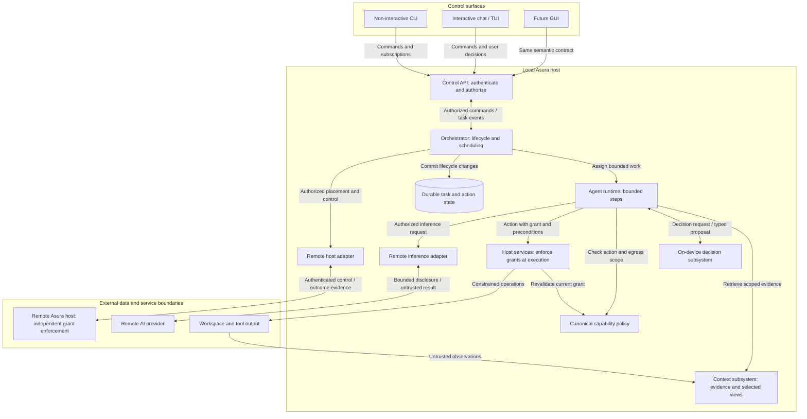
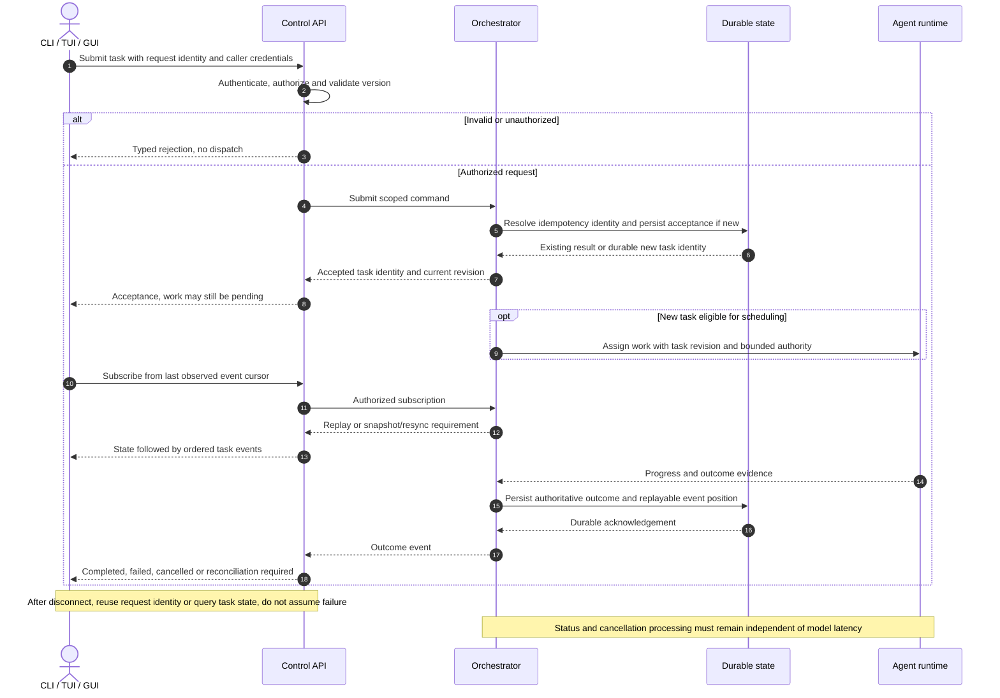
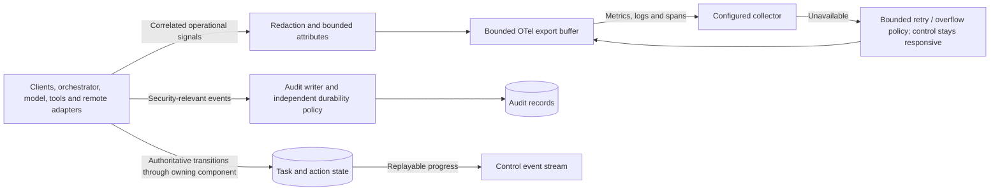

# Architecture baseline

Status: requirements and responsibility boundaries established; detailed designs
and technology selections remain open. This document does not establish runtime
security or performance guarantees.

## Purpose and platform

Asura is a coding AI harness targeting macOS 27 and later. It uses Apple's
Foundation Models API and on-device AI within orchestration for classification,
decision making, tool management, and more sophisticated logic. The on-device
capability determines when remote AI functionality is needed.

Swift and Rust are the selected implementation languages. Their proposed
responsibilities and repository layout are recorded in the
[architecture and design plan](plans/architecture-and-design.md). Allocation and
interoperation require a detailed design before scaffolding.

Asura inverts the delegation relationship of sibling project Daimon's MCP role:
the local system coordinates work and calls remote AI when appropriate. Daimon
is a reference, not an inherited architecture or dependency.

## Control and execution boundaries

The initial non-interactive CLI and interactive chat/TUI are control clients of
an orchestrator managing local agent instances. The same architecture must
accommodate a GUI and remote machines running Asura agents from day one.

| Component | Owns |
| --- | --- |
| Control clients | Input, presentation, interaction, and delivery of user decisions through the control contract |
| Orchestrator | Task lifecycle, scheduling, delegation, coordination, and control state |
| On-device decision subsystem | Model-assisted classification, routing, tool selection, and structured decision results |
| Agent runtime | Execution of assigned work and reporting progress and outcomes |
| Host services | Local process and workspace access, credentials, capability enforcement, and resource limits |
| Remote AI adapters | Provider-specific inference requests and response translation |
| Remote host adapters | Communication with and control of Asura execution on other machines |

These are logical boundaries. Process topology, deployment, and package structure
must be designed before implementation. A local deployment must exercise the
same semantic control contract that future interfaces will use.

Remote AI inference and execution on a remote Asura machine are distinct
capabilities. Each requires its own authorization, lifecycle, and failure model.

### Logical component and trust boundaries

Requirements view. Arrows name interactions, not compile-time dependencies. Boxes
inside a host are logical responsibilities, not selected process boundaries.
External content is untrusted input; the model's output is a proposal.

Every client receives the orchestrator's events through the API; return arrows
are condensed here to keep the ownership view legible. Remote results re-enter
the same validation and reconciliation path as local observations.

## Control API requirements

The orchestrator API must be modern, asynchronous, highly reliable, very high
performance, and secure. Its design must define:

- Typed, versioned commands and structured events with stable task and agent identities.
- Progress streaming, deadlines, cancellation semantics, and bounded backpressure.
- Durable state and reconnect behavior, including event ordering, replay, and retention.
- Idempotency and retry semantics, including how a caller resolves an ambiguous
  outcome after a connection or process failure.
- Authentication, per-operation authorization, and remote machine trust establishment.
- User decision and approval delivery across all supported control surfaces.
- Compatibility and error contracts shared by every client.

Reliability and performance objectives need measurable targets and benchmark
workloads before a transport is selected. Routine control operations must not
depend on waiting for model inference.

### Asynchronous submission and reconnect

Proposed interaction contract for D3. The durability acknowledgement and event
cursor rules need a concrete storage/transport design; the diagram establishes
their required ordering and distinguishes acceptance from completion.

## On-device decisions

Model-driven orchestration is a core part of Asura. Its design must specify the
inputs, structured outputs, context budgets, concurrency bounds, and evaluation
criteria for each decision type. Define behavior for unavailable models,
uncertainty, invalid output, timeouts, and failed remote calls.

Model decisions operate within independently enforced permissions and budgets.
Repository content, tool output, and remote responses cannot grant authority.
Task state must remain understandable without reconstructing it from model prose.

## Security boundaries

Protection is bidirectional: protect Asura from external interference and protect
the operating system from agent overreach or compromise. Use OS-local capabilities
to enforce the selected isolation and least-privilege design.

Before execution or remote control is implemented, define a threat model,
adversary capabilities, trust boundaries, credential lifecycle, and recovery
behavior. Select and verify the macOS mechanisms against those requirements.
State limitations explicitly; no protection against a particular adversary is
established merely by naming an OS facility.

Permission checks must be authoritative at the execution boundary. Distributed
hosts must enforce their own grants; a UI or model decision cannot bypass them.

## User experience

The experience must be elegant, intuitive, configurable, and controllable.
Clients should explain what is happening, why, and what the user can do next.
Design workflows for:

- Useful defaults with advanced settings exposed when needed.
- Inspecting, pausing, cancelling, and redirecting work with explicit effect semantics.
- Understanding remote AI use, delegation, permission requests, and failures.
- Reconnecting and switching interfaces without losing task state or pending decisions.
- Consistent configuration precedence and an inspectable effective configuration.
- Keyboard interaction, accessibility, readable output, and machine-readable CLI results.

UX scenarios and usability evidence belong in feature designs and validation.

## Observability

Support OpenTelemetry metrics, logs, and spans. Correlate activity across control
clients, orchestration, local model decisions, agents, tools, and remote calls,
propagating trace context across process and machine boundaries.

Measure routing outcomes, inference latency, queue time, retries, cancellations,
and resource use. Define bounded attribute cardinality and export buffering.
Collector failure must not stall task execution. Sensitive payloads such as
prompts, source code, tool output, and credentials are excluded by default;
any additional content collection requires an explicit data-handling design.

Security audit durability and retention must be designed separately from trace
sampling. Telemetry is not the authoritative task state store.

### Telemetry, audit and task state

Requirements view. Solid arrows show data flow; overflow behavior is bounded and
must be selected in D6. Audit persistence failure policy remains a separate
security decision and cannot inherit telemetry's lossy behavior.

## Single ownership of functionality

Each capability and contract has one canonical owner. Control clients do not
reimplement scheduling or authorization. Adapters translate protocols and
provider formats while shared behavior stays with its owner. Model selection
and tool metadata must have canonical definitions rather than client-specific copies.

Logical ownership does not require a single process. Designs must describe how
shared contracts and host-local enforcement remain consistent across deployments.

## Decisions required before implementation

1. Initial workflows, task/agent lifecycle, and UX acceptance criteria.
2. Module ownership, process topology, and local/remote deployment contracts.
3. Control protocol, compatibility rules, persistence, and recovery semantics.
4. Threat model, host isolation mechanisms, identity, and capability grants.
5. Decision subsystem responsibilities and model evaluation criteria.
6. Remote AI and remote host integration boundaries.
7. Configuration, credentials, audit, and telemetry schemas and lifecycles.
8. Swift/Rust allocation and toolchains, testing infrastructure, quality gates,
   and measurable objectives.

Resolve the decisions required by a scoped implementation before coding that
scope. Keep unrelated open decisions explicit and preserve the boundaries above.
