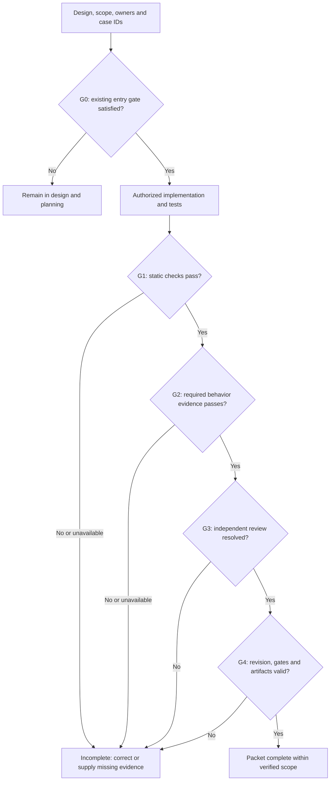
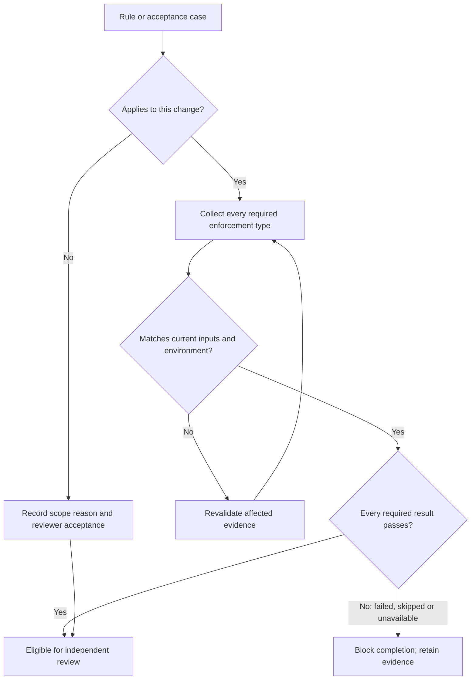

# Coding standards and enforcement

**Status: Draft for owner review.** This document proposes mandatory coding rules
and their enforcement contract. It does not record adoption, implemented checks,
or authorization to start implementation.

**Existing requirements:** The [architecture](architecture.md),
[design process](design-process.md), and [engineering standard](engineering.md)
remain authoritative. Their design, ownership, testing and completion gates apply
now. New obligations below become mandatory when the owner accepts this draft.

**Open mechanisms:** D2 selects component allocation and toolchains. D7 selects
checker versions, commands, test environments and delivery controls. I0 implements
those controls only after the existing implementation entry gate opens.

## Scope and rule interpretation

These rules apply to human and agent contributions: production code, tests,
build logic, generated bindings, migrations, configuration and dependencies.
Documentation follows the [writing standard](writing-standard.md).
This document owns coding rules and their enforcement mapping. The engineering
standard owns required test layers and completion criteria. Subsystem designs
own runtime semantics; this document links to those contracts without replacing them.

Each rule has a stable identifier. **Must** and **must not** express obligations.
**May** identifies a permitted choice within stated conditions. A change fails
the proposed delivery gate when an applicable rule lacks its required evidence.
An unavailable checker or environment produces a blocked result, never a pass.

Enforcement labels specify cumulative evidence, not interchangeable choices:

| Label | Required enforcement |
| --- | --- |
| Static | A pinned compiler, formatter, analyser or repository check rejects the violation |
| Test | Executable assertions exercise the behavior at the layers required by the engineering standard |
| Review | A reviewer records the rule, inspected scope, reasoning and supporting evidence |

Static checks cannot establish architectural correctness or memory safety alone.
Review cannot replace a required executable check. D7 must identify the automated
portion and the remaining review obligation for each rule labelled Static.

## Design, ownership and contracts

- **CS-01 — Design authority.** A change must identify its governing design
  revision, affected acceptance cases and canonical component owners. The
  [design gate](design-process.md#workflow) controls readiness and authorization.
  Behavioral changes discovered during coding must return to that gate.
  **Enforcement: Review.**

- **CS-02 — Dependency direction.** Each module must have one documented
  responsibility and an allowed dependency set. Cycles and access to another
  component's private state are prohibited. Clients and adapters must use the
  canonical owner for domain decisions. New abstractions must name the contract
  or present consumers they serve; speculative frameworks are prohibited.
  **Enforcement: Static, Review.**

- **CS-03 — Explicit contracts.** Every externally callable or cross-component
  operation must document inputs, units, outcomes, ownership and side effects.
  It must specify applicable concurrency, cancellation and compatibility behavior.
  Public visibility requires a named consumer; implementation details remain private.
  **Enforcement: Static, Test, Review.**

- **CS-04 — Represent valid states.** Domain identities, revisions, quantities
  and states must use distinct types where accidental substitution changes meaning.
  Validating constructors must protect invariants. Boolean flags or arbitrary
  strings must not encode lifecycle states or permission decisions. Transport
  decoding must not manufacture a validated domain value without validation.
  **Enforcement: Static, Test, Review.**

- **CS-05 — Readable implementation.** Names must match the
  [glossary](glossary.md) and governing contract. Each function must implement one
  named operation; unrelated effects require separate functions. Comments must
  explain invariants, decisions or constraints. Changed public contracts require
  updated documentation. Dead code, commented-out implementations and reachable
  placeholder behavior must not enter a completed delivery.
  **Enforcement: Static, Review.**

## Errors, values and resource ownership

- **CS-06 — Typed failure.** Expected failures must have typed outcomes with
  stable machine-readable categories. Translation at a boundary must preserve
  operation identity, causal evidence and outcome uncertainty while redacting
  sensitive data. Callers must not parse diagnostic prose to determine behavior.
  Catch-all success, silent error discard and failure converted to empty data
  are prohibited unless the contract explicitly defines that outcome.
  **Enforcement: Static, Test, Review.**

- **CS-07 — No accidental termination.** External input, resource exhaustion
  detected by the application, unavailable dependencies and cancellation must
  follow designed failure paths. They must not reach forced unwraps, unchecked
  indexing, assertions or deliberate process termination. An intentional fail-stop
  invariant requires a governing recovery design and the safety record below.
  **Enforcement: Static, Test, Review.**

- **CS-08 — Checked quantities.** Size, offset, count, time and budget arithmetic
  must detect overflow, underflow and invalid conversion. Units and precision must
  be explicit. Truncation, saturation and wrapping require defined domain semantics;
  they must not conceal exhausted capacity. Boundary tests must exercise minimum,
  maximum, invalid and conversion-edge values in release behavior.
  **Enforcement: Static, Test, Review.**

- **CS-09 — Owned resources.** Every task, process, subscription, file handle,
  buffer and reservation must have a named lifecycle owner. Ownership transfer
  must define lifetime and cleanup. Cleanup must be idempotent where repeated,
  bounded by the design, and observable when it fails. A destructor or object
  deallocation must not be the sole mechanism for durable settlement.
  **Enforcement: Static, Test, Review.**

- **CS-10 — Controlled inputs.** Logic that makes domain decisions must receive
  time, randomness, identities and external observations through explicit inputs
  or owned interfaces. It must not read mutable process-global state implicitly.
  Elapsed deadlines use a monotonic clock; restart semantics require a separate
  durable contract. Tests must control these inputs without duplicating domain logic.
  **Enforcement: Test, Review.**

## Rust rules

- **RS-01 — Diagnostics and formatting.** Repository Rust must pass its pinned
  formatter, compiler and Clippy profile without warnings. D7 must enumerate
  supported targets and feature combinations and check each. Clippy correctness,
  suspicious, complexity, performance and style groups form the proposed baseline.
  Additional lints require explicit selection; enabling every restriction lint
  is prohibited. Local suppressions follow the safety record requirements.
  **Enforcement: Static, Review.**

- **RS-02 — Safe modules by default.** Modules without a designed unsafe boundary
  must forbid unsafe code. Unsafe functions, blocks, traits, implementations,
  attributes and foreign declarations must be confined to named boundary modules.
  Each requires documented caller obligations and a local safety argument covering
  alignment, validity, aliasing, lifetime and threading where applicable. Unsafe
  operations inside unsafe functions must still use explicit unsafe blocks.
  Every such boundary requires an independently reviewed safety record.
  **Enforcement: Static, Test, Review.**

- **RS-03 — Failure propagation.** Recoverable production failures must use
  `Result` or a domain outcome. `unwrap`, `expect`, panic and unreachable assertions
  require a proven internal invariant and a safety record; input validation cannot
  rely on them. Tests may fail with assertions, but assertions must report the
  violated case. Production `todo!` and `unimplemented!` are prohibited.
  **Enforcement: Static, Test, Review.**

- **RS-04 — Ownership before sharing.** Values must remain immutable unless
  mutation serves a documented operation. Shared mutable state requires a named
  synchronization owner, lock order and invariant. Cloning or reference counting
  must not conceal unbounded copying, duplicate resource ownership or cross-context
  retention. Locks and unsafe trait implementations require concurrency review.
  **Enforcement: Static, Test, Review.**

The [Rust unsafe reference](https://doc.rust-lang.org/reference/unsafe-keyword.html)
defines the proof obligations behind RS-02. The
[Clippy lint guide](https://doc.rust-lang.org/clippy/lints.html) explains its groups
and why restriction lints require individual selection. These sources inform the
rules; they do not select Asura's compiler version or prove its code safe.

## Swift rules

- **SW-01 — Compiler-enforced concurrency.** Repository Swift must use a pinned
  language mode with complete concurrency checking. Compiler, formatter and the
  selected analyser diagnostics must pass without warnings. D2 must record the
  SDK and language mode; D7 must verify all supported build configurations.
  Lowering concurrency checking to obtain a pass is prohibited.
  **Enforcement: Static, Review.**

- **SW-02 — Explicit isolation.** Every mutable reference type and callback must
  identify its isolation owner. Cross-isolation values must satisfy the selected
  compiler's checked transfer rules. Actor isolation must be explicit where the
  contract depends on it. UI isolation must not become the owner of backend state
  or a place to execute blocking work. Post-suspension state requires AC-03 checks.
  **Enforcement: Static, Test, Review.**

- **SW-03 — Reviewed escape hatches.** `@unchecked Sendable`,
  `nonisolated(unsafe)`, concurrency-check suppression, unsafe pointers and unsafe
  ownership operations require the safety record. Records must cover every access
  and transfer, including callbacks. `@preconcurrency` must not conceal an unproved
  dependency boundary. No escape hatch may replace the missing isolation design.
  **Enforcement: Static, Test, Review.**

- **SW-04 — Failure and lifetime.** Production force unwraps, forced casts,
  `try!` and deliberate traps require the CS-07 invariant and safety record.
  Optional failure discard must have a specified harmless outcome. Retained
  closures, tasks and observers must have explicit termination and ownership;
  tests must detect unintended retention after cancellation and shutdown.
  **Enforcement: Static, Test, Review.**

Swift's [data-race safety guide](https://www.swift.org/migration/documentation/swift-6-concurrency-migration-guide/dataracesafety/)
and [Sendable contract](https://docs.swift.org/latest/documentation/swift/sendable/)
describe isolation and checked sharing. Unchecked conformance transfers the
correctness obligation to the author. Compiler success does not prove higher-level
ordering, cancellation or durable-state correctness.

## Asynchronous work and concurrency

The [asynchronous architecture decision](decisions/0006-async-event-pipelines.md)
governs processing semantics. These rules constrain its implementation without
selecting an executor, queue library or process layout.

- **AC-01 — Supervised work.** Every spawned task must have a lifecycle owner,
  concurrency limit, completion/error path and shutdown policy. Detached work is
  permitted only at a designed supervisor boundary with equivalent accounting.
  Dropping a handle must not hide running work or unknown effects.
  **Enforcement: Static, Test, Review.**

- **AC-02 — Explicit capacity.** Every queue, buffer, cache, collection driven by
  external input and parallel work group must have a numeric limit and overflow
  policy in its governing design. The producer and consumer must enforce that
  policy. Tests must saturate each boundary and verify the designed control-path
  responsiveness. “Unbounded for now” is prohibited.
  **Enforcement: Test, Review.**

- **AC-03 — Suspension and races.** Code must not hold a blocking lock or an
  authoritative transaction across unrelated I/O or model work. After suspension,
  operations must revalidate mutable preconditions. A designed serialization or
  fencing protocol must keep that validation effective through commit, dispatch
  and result acceptance, as applicable. Designs must specify conflict ordering,
  stale-result handling and lock ordering. Tests must exercise both event orders
  and invalidation inside each check-to-effect interval, including revocation
  between grant validation and execution and generation changes before result acceptance.
  **Enforcement: Static, Test, Review.**

- **AC-04 — Cancellation and uncertainty.** Cancellation request, acceptance,
  execution stop and settled outcome must remain distinct. Timeout, task abortion
  or disconnection must not imply non-execution or release reserved usage. Code
  must implement the canonical
  [failure and settlement contract](designs/core-harness-brief.md#common-failure-and-deadline-contract).
  **Enforcement: Test, Review.**

- **AC-05 — Bounded retries.** Each retry policy must name eligible errors,
  maximum attempts, elapsed-time limit, delay policy and budget charging. An
  unknown effect requires reconciliation before a potentially duplicating retry.
  Reconnection, callback duplication and redelivery must preserve request identity.
  Nested retries must share the designed aggregate limit.
  **Enforcement: Test, Review.**

- **AC-06 — Blocking and shutdown.** Blocking APIs and expensive CPU work must
  use designed isolation with bounded occupancy. Code must not synchronously wait
  for future async work on an executor required to perform it. Shutdown must stop
  admission, handle active work and persist recovery obligations in the designed
  order. Tests must include a worker that ignores cancellation.
  **Enforcement: Static, Test, Review.**

## Trust boundaries and data handling

- **SB-01 — Independent authority.** Every privileged operation must reach the
  canonical authorization owner and host enforcement boundary. The implementation
  must bind the grant to the actual operation, scope and current policy as required
  by the [security contract](designs/security-policy-brief.md). A client, model,
  repository file or remote response must not create authority. Missing or invalid
  authorization data must deny dispatch.
  **Enforcement: Test, Review.**

- **SB-02 — Validate at entry.** Each trust boundary must validate identity,
  version, framing, size, structure and semantic constraints before acting.
  Tests must cover malformed, truncated, oversized, duplicate and incompatible
  inputs. Parser success alone must not imply authorization. Unknown fields and
  variants must follow the versioned compatibility policy.
  **Enforcement: Static, Test, Review.**

- **SB-03 — Files and processes.** File access must enforce the designed path,
  object-identity and link-race rules at use time. Process launches must specify
  executable identity, arguments, working location, environment and inherited
  handles. Interpolating untrusted content into executable shell syntax is
  prohibited. Explicit shell capabilities need their own grant and confinement
  design. Tests must include descendants, hostile paths and environment injection.
  **Enforcement: Static, Test, Review.**

- **SB-04 — Confidentiality.** Credentials and private payloads must not appear
  in source, fixtures, diagnostics, crash artifacts or default telemetry. Egress
  must use the destination-specific disclosure contract and record its manifest.
  Terminal output must encode or filter untrusted control sequences. Tests must
  check redaction and output injection at actual output boundaries.
  **Enforcement: Static, Test, Review.**

- **SB-05 — Cryptography and identity.** Cryptographic primitives and protocol
  verification must use maintained, reviewed implementations selected in D1-D3.
  Custom primitives, disabled peer verification and plaintext credential transport
  are prohibited. Identity, key storage, rotation and revocation must follow the
  selected threat model. A secure transport does not replace per-operation policy.
  **Enforcement: Static, Test, Review.**

- **SB-06 — Model and context isolation.** Model responses remain untrusted typed
  proposals. Every tool callback must enter normal admission. Retained sessions,
  caches and retrieved context must obey the
  [effective-context contract](designs/core-harness-brief.md#model-session-ownership-and-effective-context).
  Tests must attempt stale-generation reuse and cross-task disclosure, including
  after cancellation, context invalidation and restart.
  **Enforcement: Test, Review.**

## Persistence, interoperability and operations

- **PO-01 — Durable truth.** Acknowledgements must reflect the precise durability
  level in the governing contract. Publication, replay and recovery must preserve
  accepted state without repeating effects. Unknown outcomes must remain explicit.
  Graph binding and budget accounting must follow the
  [selected decisions](decisions/README.md#decisions-from-the-2026-09-20-review).
  Tests must inject failure on both sides of each persistence/effect boundary.
  **Enforcement: Test, Review.**

- **PO-02 — Compatible change.** Persisted schemas and public contracts must be
  versioned. Changes require an explicit compatibility matrix and migration design,
  including interruption, verification, recovery and unsupported-version rejection.
  Migrations must not silently reset data. Destructive transformation requires
  the authorization and recoverability specified by its governing design.
  **Enforcement: Static, Test, Review.**

- **PO-03 — Language boundary.** Each Swift/Rust boundary must define identity,
  error translation, ownership, lifetime, concurrency and cancellation. FFI designs
  must define layout, allocation/free pairs, callback lifetime and prevention of
  unwinding across the boundary. IPC designs must define peer authentication,
  framing and recovery. Tests must use the real selected boundary in both directions.
  **Enforcement: Static, Test, Review.**

- **PO-04 — Configuration and audit.** Configuration must enter through the
  [canonical resolver](designs/user-service-configuration.md), with provenance and
  revision semantics preserved. Telemetry must obey cardinality, redaction and
  buffering limits. Audit failures must follow their independent durability policy;
  telemetry must not substitute for authoritative state or audit evidence.
  **Enforcement: Test, Review.**

- **PO-05 — Measured performance.** Performance-sensitive changes must name the
  designed workload, resource budgets, measurement method and accepted thresholds
  before measurement. Results must include environment, distribution and baseline.
  Responsiveness, overload and sustained memory behavior require real integration
  or end-to-end evidence. An average alone cannot satisfy a tail-latency target.
  **Enforcement: Test, Review.**

## Dependencies and build integrity

- **BI-01 — Reproducible inputs.** Toolchains, SDK requirements, dependency
  resolution, generators and CI actions must use reviewed versions or immutable
  identities. Delivery builds must verify lockfiles without silently updating them.
  Build inputs and artifacts must be attributable to the source revision. D7 must
  define and test the expected reproducibility, including signing-related variance.
  **Enforcement: Static, Test, Review.**

- **BI-02 — Dependency admission.** Each new or upgraded dependency must record
  its purpose, owner, alternatives, licence compatibility, maintenance status,
  transitive changes and required capabilities. Unreviewed install/build hooks,
  mutable download references and unused dependencies are prohibited. Known
  advisories require version-specific applicability evidence; an applicable
  unresolved vulnerability blocks delivery of the affected component.
  **Enforcement: Static, Review.**

- **BI-03 — Generated and vendored code.** Generated code must name its source
  and pinned generator; regeneration must detect drift. Hand edits to generated
  output are prohibited. Vendored code requires provenance, licence and patch
  records. Formatting or lint exclusions must name exact paths and equivalent
  checks. Generated and vendored behavior remains in integration and security scope.
  **Enforcement: Static, Test, Review.**

- **BI-04 — Trusted checks.** Untrusted changes must not access publishing keys
  or privileged runners. Changes to checker configuration, fixtures, workflow
  permissions, exclusions and release logic require explicit review. A contribution
  must not disable its own acceptance gate. D7 must define trusted gate selection,
  least-privilege credentials, artifact verification and protected publishing rules.
  **Enforcement: Static, Test, Review.**

## Validation quality

The [engineering standard](engineering.md#required-test-layers) requires cumulative
unit, integration and end-to-end evidence. The rules below strengthen assertion
quality and evidence integrity; they grant no exemption from those layers.

- **VQ-01 — Case mapping.** Each changed behavior, rejection and recovery branch
  must map to stable acceptance-case IDs and executable assertions. Each test must
  identify initial state, trigger and observable result, including forbidden effects.
  Coverage reports must identify unexercised branches. Each reachable changed
  decision branch must be exercised; an unreachable branch needs a reviewed proof.
  **Enforcement: Static, Test, Review.**

- **VQ-02 — Regression evidence.** A defect correction must include a reproducer
  that fails against the faulty behavior and passes after correction. Boundary and
  state-machine tests must exercise invalid transitions and adversarial inputs.
  D7 must assign property tests and fuzz targets for parsers, protocol boundaries
  and lifecycle invariants, with explicit budgets and retained regression cases.
  **Enforcement: Test, Review.**

- **VQ-03 — Honest doubles.** A substitute must implement the actual boundary
  contract and make injected failures explicit. Tests must not reproduce the
  implementation as an expected-value oracle. Real persistence, OS confinement,
  model quality and host-boundary claims require their actual environments as
  defined in the [validation matrix](designs/requirements-validation.md).
  **Enforcement: Test, Review.**

- **VQ-04 — Deterministic control.** Tests must use controlled clocks, seeds and
  synchronization where those inputs are controllable. Arbitrary sleeps, dependence
  on test order and shared mutable fixtures are prohibited. External behavior must
  use bounded observation with explicit failure. A flaky required test remains
  failing; retries may diagnose it but must not erase the first failure.
  **Enforcement: Static, Test, Review.**

- **VQ-05 — Meaningful measurement.** D7 must set coverage floors and measurement
  scope before implementation. Percentages must not replace case mapping or missing
  test layers. Empty assertions, broad skips and exclusions added to meet a number
  are prohibited. Security, lifecycle and admission tests require fault injection
  or mutation evidence showing that broken invariants are detected.
  **Enforcement: Static, Test, Review.**

- **VQ-06 — Evidence integrity.** Results must bind rule/case IDs to the design,
  source revision, command, toolchain, environment, fixture version and artifacts.
  Dirty-tree runs must identify the exact source snapshot. Failure, skipped,
  unavailable and passed are distinct outcomes. Changes to code, dependencies or
  checks invalidate affected evidence; a reviewer must justify retained evidence.
  **Enforcement: Static, Review.**

## Safety records and applicability

The named escape hatches above are permitted only with a reviewed safety record.
They are not general waivers. The record must contain:

1. Rule ID, exact symbol or source scope, component owner and governing design.
2. Why a checked alternative cannot meet the contract, with measured evidence
   when performance is the reason.
3. The invariant and proof obligations, including callers, threads, lifetimes,
   invalid input, cancellation and recovery where applicable.
4. A local code explanation, executable checks and an independent review result.
5. Review triggers: relevant code, compiler, SDK, dependency or contract changes.
   A temporary suppression also needs an expiry and removal condition.

The component owner and a reviewer other than the author must accept the record.
Blanket warning suppression, an unexplained `SAFETY` comment, or passing tests
alone cannot supply the argument. A record cannot waive design authorization,
authorization enforcement, known memory unsafety, truthful evidence or a required
test layer. Such a change must be corrected or remain incomplete.

An inapplicable rule needs an explicit reason tied to the change's scope and
reviewer acceptance. For example, a pure value change has no new process-launch
boundary. Inapplicability must not excuse a reachable behavior or an unavailable
environment. No author or agent may self-approve a safety record or gate change.

## Enforcement gates and review record

The contribution record must name the design and source revisions, owners,
affected rules, acceptance cases, required environments and evidence locations.
It must record review findings and their disposition. An independent reviewer
must inspect the implementation and assertions; an agent review is evidence,
not authority to approve its own work or open the implementation gate.

| Gate | Pass condition | Blocking condition |
| --- | --- | --- |
| G0: Design | Existing design-readiness, owner-review and authorization conditions are satisfied | Missing design, unresolved scoped decision or missing authorization |
| G1: Source | All applicable static checks pass for the declared build matrix | Diagnostic, drift, unreviewed suppression, unavailable check or missing matrix entry |
| G2: Behavior | Required unit, integration, end-to-end and specialist evidence passes | Failed, skipped, flaky or unavailable required case; missing assertion mapping |
| G3: Review | Independent findings are resolved with evidence; docs and contracts agree | Unresolved violation, unsafe record or stale evidence |
| G4: Delivery | G0-G3 apply to the delivered revision and required artifacts | Changed inputs without revalidation, missing provenance or unmet delivery checks |

G4 concerns completion of the authorized packet. Release additionally requires
the selected increments and [I9 qualification](plans/implementation.md#i9-release-qualification).
Publishing still follows the authorization rules in [AGENTS.md](../AGENTS.md).
A merge label or green status alone does not establish release qualification.

### Proposed contribution gate flow

Proposed process after adoption. Arrows show prerequisite satisfaction and
failure disposition. G0 refers to the existing design lifecycle; this diagram
does not add implementation permission.

### Proposed evidence decision flow

Proposed handling for each rule and acceptance case. Arrows show review decisions;
all applicable evidence converges at the contribution gate above. Failure requires
correction; unavailability requires the missing environment or check.

Runtime state, data and intercomponent diagrams remain with the linked governing
designs. This document specifies contribution gates, so additional runtime views
would duplicate those contracts.

## Adoption and delivery work

This draft can be reviewed before tools exist. It cannot be described as automated
enforcement until the designed checks have been implemented and qualified.

| Owner stage | Required output before its dependent work |
| --- | --- |
| Owner review | Accept or revise the proposed rules; record adoption separately from implementation authorization |
| D2 | Component/dependency map; Rust/Swift toolchain and language modes; selected interoperation boundary |
| D3-D6 | Concrete errors, limits, race ordering, recovery, security and operational contracts consumed by these rules |
| D7 | Rule-to-check registry; pinned tools; exact commands; supported matrix; coverage/fuzz budgets; evidence and retention formats; trusted review/publishing controls |
| D8 | Confirm applicable rules have enforceable designs and no unresolved initial-packet prerequisites |
| I0 | Implement and qualify the approved enforcement infrastructure after authorization |
| Later increments | Extend tests and rule mapping as new boundaries are delivered; preserve existing checks |

The D7 registry must map every rule ID to its checker or review procedure, owner,
invocation, scope, expected failure and evidence artifact. It must name the checks
required for each packet and release. CI and local commands must use the same
checked-in definitions. The CI vendor and test frameworks remain open.

I0 must prove that enforcement can reject failures before product packets rely
on it. Its design must specify acceptance cases with these initial conditions
and triggers:

| Case | Initial state and trigger | Required observable result |
| --- | --- | --- |
| EG-01 | Valid baseline; introduce a representative formatter/compiler/lint violation for each checker | Gate fails and identifies the responsible rule and artifact |
| EG-02 | Required test registered; fail it, skip it, remove its discovery entry or remove its environment | Each variant blocks completion and reports its distinct cause |
| EG-03 | Valid evidence; change source, dependency, fixture or checker inputs | Affected evidence becomes stale and cannot satisfy the gate |
| EG-04 | Untrusted contribution; attempt to disable a gate or access publishing credentials | Trusted gate remains effective; credentials remain inaccessible |
| EG-05 | Valid check run; terminate the runner or lose its result artifact | No success is reported; the incomplete run remains diagnosable |
| EG-06 | Passing tests around a critical invariant; introduce a designed invariant-breaking fault | The associated assertion fails and identifies the regression case |

D7 must give independent variants distinct case IDs and map them to unit checks
of gate decisions, integration checks of actual runners and artifacts, and an
end-to-end contribution-to-delivery exercise. These are specifications for future
validation, not tests performed by drafting this document.

## Draft verification on 2026-09-24

Two independent read-only reviews examined contract consistency, enforceability,
safety records and evidence handling. One review identified a check-to-effect
race in AC-03. The correction requires serialization or fencing and tests within
that interval; the reviewer rechecked it. RS-02 was also clarified to require an
independently reviewed safety record. No findings remained in the reviewed scope.

Documentation checks passed: 234 local links and anchors across 26 Markdown
documents; whitespace checks; 45 unique coding rule IDs with enforcement labels;
and `git diff --check`. Mermaid CLI 11.16.0 rendered both diagrams, and their
labels, branches and layout were visually inspected. Previews remained outside
the repository.

This evidence covers the draft and its navigation links. No product code, CI
checks, enforcement fixtures or runtime tests were implemented or executed.
The rules remain proposed, and the implementation authorization gate remains closed.
