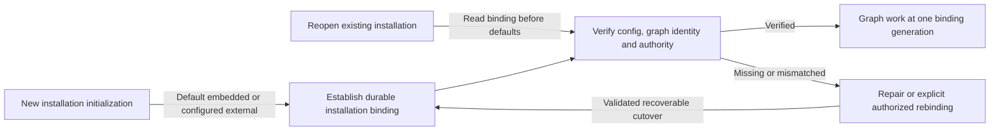

# ADR 0001: Bind each installation to one context graph

Date: 2026-09-20. Status: required behavior.
Remaining decisions: persistence and migration mechanisms. No runtime implementation exists.

## Context

Asura supports an embedded SurrealDB graph by default and a configured external
SurrealDB graph. Applying the default on every restart would allow an external
installation with a missing profile or environment variable to create an unrelated
embedded graph. Its durable tasks could then refer to evidence in another store.
The same risk arises when a database is recreated under an unchanged name.

## Decision

The orchestrator applies the embedded default only when it initializes a new
installation. It records which graph belongs to that installation. This record
is the graph binding, and it persists independently of the graph.

On each subsequent startup, the orchestrator verifies the binding before work
that needs the graph can start. Missing external configuration, a mismatched
identity, or unavailable data must produce an error with a repair path.
The orchestrator must not create or select another store. External mode requires
no embedded graph.

The orchestrator owns the binding lifecycle. The storage adapter persists binding
metadata and verifies database identity. The context subsystem owns graph rules
and reference validation. These responsibilities follow the proposed Rust
allocation. Swift adapters and interface clients do not duplicate store selection.
[ADR-0004](0004-user-service-contexts.md) fixes one backend owner per OS user on a
user device. Helper process topology and physical persistence remain D2-D3 decisions.

Changing mode or graph identity requires an authorized operation with a recovery
procedure. That operation must preserve existing references or explicitly resolve
their disposition. Only one binding generation may accept work. After the binding
change is committed, recovery continues towards the destination graph. An outage
must not cause an automatic rollback or fallback.

The [storage brief](../designs/context-storage-candidates.md#selected-installation-binding-and-change-contract)
is the canonical behavioral contract, including startup/recovery diagrams and
acceptance cases B1-B5. Keep detailed transitions there rather than duplicating
the specification in this record.

### Decision boundary

Selected design view. Edges show the admission evidence needed to use a graph;
they do not imply that distributed stores share a transaction.

## Alternatives considered

- Re-evaluate configuration alone at startup: simple, but an absent external
  setting silently changes durable graph identity. Rejected.
- Store binding metadata only inside the graph: avoids local bootstrap metadata,
  but cannot safely locate or distinguish the graph when its configuration or
  service is unavailable. Rejected.
- Require an explicit embedded setting for every installation: removes one
  default, but does not solve graph substitution and contradicts the desired
  embedded-default experience. Rejected.
- Automatically replicate or fail over between stores: adds distributed
  consistency and disclosure semantics without a requirement or a reviewed
  design. Outside current scope.

## Consequences and readiness gates

Operators receive explicit configuration/recovery errors instead of apparently
successful startup with empty history. External deployment still needs protected
local bootstrap metadata, but not an embedded graph database. Configuration is
operational input and cannot by itself authorize changing durable installation
identity. Endpoint and credential maintenance may preserve identity if the same
graph and current authority are verified.

D1 must establish bootstrap protection and administrator/tamper assumptions. D3
must select identity persistence, atomic cutover, single-owner fencing, graph/ledger
reference reconciliation and backup/restore behavior; no cross-store atomicity is
assumed. D6 must define initialization, change and repair UX. D7 must exercise
B1-B5 against real persistent engines and external servers before delivery.
Documentation review and diagram rendering cannot prove those runtime properties.
