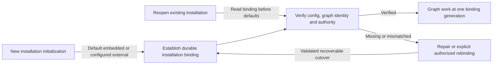

# ADR 0001: Bind each installation to one context graph

Status: selected design constraint, 2026-09-20. Detailed persistence and migration
mechanisms remain unselected; this ADR does not authorize implementation.

## Context

Asura supports an embedded SurrealDB graph by default and a configured external
SurrealDB graph. Applying the default on every restart would allow an external
installation with a missing profile or environment variable to create an unrelated
embedded graph. Its durable tasks could then refer to evidence in another store.
The same risk arises when a database is recreated under an unchanged name.

## Decision

Apply the embedded default only when initializing a new installation. Persist
its graph binding independently of the graph, then require subsequent startup to
verify that binding before graph-dependent work. Missing external configuration,
identity mismatch or unavailable data must produce a repairable failure without
creating or selecting another store. External mode requires no embedded graph.

The orchestrator owns binding lifecycle; the storage adapter persists its metadata
and verifies database identity; the context subsystem owns graph/reference
semantics. These responsibilities follow the proposed Rust allocation. Swift
adapters and interface clients do not duplicate store selection. Process topology
and physical persistence remain D2-D3 decisions.

Changing mode or logical graph identity requires an authorized, recoverable
migration/rebinding operation. It must preserve or explicitly dispose of existing
references and admit exactly one binding generation. A committed cutover recovers
forward; it does not silently roll back or fall back during an outage.

The [storage brief](../designs/context-storage-candidates.md#selected-installation-binding-and-change-contract)
is the canonical behavioral contract, including startup/recovery diagrams and
acceptance cases B1-B5. Keep detailed transitions there rather than duplicating
the specification in this record.

### Decision boundary

Selected design view. Edges show the admission evidence needed to use a graph;
they do not imply that distributed stores share a transaction.

## Alternatives considered

- Re-evaluate configuration alone at startup: simple, but an absent external
  setting silently changes durable graph identity. Rejected.
- Store binding metadata only inside the graph: avoids local bootstrap metadata,
  but cannot safely locate or distinguish the graph when its configuration or
  service is unavailable. Rejected.
- Require an explicit embedded setting for every installation: removes one
  default, but does not solve graph substitution and contradicts the desired
  embedded-default experience. Rejected.
- Automatically replicate or fail over between stores: adds distributed
  consistency and disclosure semantics without a requirement or a reviewed
  design. Outside current scope.

## Consequences and readiness gates

Operators receive explicit configuration/recovery errors instead of apparently
successful startup with empty history. External deployment still needs protected
local bootstrap metadata, but not an embedded graph database. Configuration is
operational input and cannot by itself authorize changing durable installation
identity. Endpoint and credential maintenance may preserve identity if the same
graph and current authority are verified.

D1 must establish bootstrap protection and administrator/tamper assumptions. D3
must select identity persistence, atomic cutover, single-owner fencing, graph/ledger
reference reconciliation and backup/restore behavior; no cross-store atomicity is
assumed. D6 must define initialization, change and repair UX. D7 must exercise
B1-B5 against real persistent engines and external servers before delivery.
Documentation review and diagram rendering cannot prove those runtime properties.
