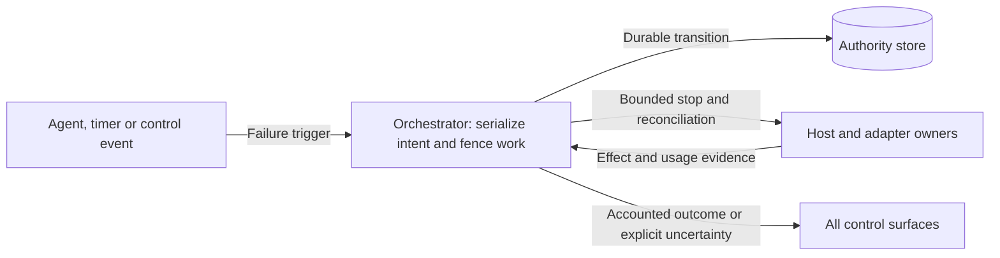

# ADR-0002: One failure settlement contract

Date: 2026-09-20. Status: selected design constraint; runtime unimplemented.

## Context

The brief required reconciliation for user-decision expiry but showed a direct
running-to-failed transition for fatal errors and budget exhaustion. A deadline
during an external action could therefore appear terminal while effects and cost
remained unaccounted for. Waiting and paused tasks also need defined deadline
behavior. This resolves review finding F2.

## Decision

All terminal failure triggers use the canonical
[common failure and deadline contract](../designs/core-harness-brief.md#common-failure-and-deadline-contract).
Persist intent and fence dispatch, then settle effects and usage. Report either
accounted failure/cancellation or failure with explicit uncertainty. Cancellation
retains precedence over pending failure, but cannot claim unknown effects stopped.
Task deadlines continue while queued, waiting or paused. Cleanup has separately
bounded authority and resources; task-budget exhaustion cannot enable unlimited
recovery or prevent the designed bounded stopping procedure.

The linked flow is the detailed visual contract. At the ownership level, this
selected view shows who decides and who provides evidence:

## Alternatives and consequences

- Direct failure on timeout is simpler but hides outstanding effects and breaks
  restart/cancel semantics. Rejected.
- Reconcile indefinitely avoids a terminal uncertainty report but can leave work
  operationally unbounded. Rejected; bounded recovery may end with uncertainty.
- Freeze the task deadline while paused would require a second duration policy
  and could retain resources indefinitely. Rejected for the initial contract.

Terminal status and the later arrival of evidence are separate concerns. Unknown
usage remains accounted for through durable conservative reservations after
terminal outcomes. Exact billing need not delay termination once operation effects
are known; unknown effects still require reconciliation. Clients need to show
residual effects, uncertainty and failure causes rather than only a status label.
Storage outages must not be represented as durable acceptance.

## Readiness and validation

D3/D4 must define durable schemas, clock behavior on restart, serialization,
recovery bounds and outage handling; D5 extends enforcement across remote hosts.
See the [core regression cases](../designs/core-harness-brief.md#validation-required-for-the-detailed-designs)
and [delivery gates](../plans/implementation.md#early-increment-acceptance-gates).
The decision establishes semantics, not those mechanisms or permission to code.
