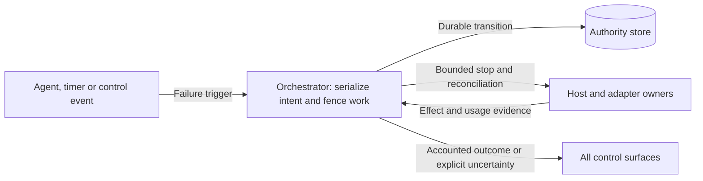

# ADR-0002: One failure settlement contract

Date: 2026-09-20. Status: required behavior.
Remaining decisions: see Readiness and validation. No runtime implementation exists.

## Context

The brief required reconciliation for user-decision expiry but showed a direct
running-to-failed transition for fatal errors and budget exhaustion. A deadline
during an external action could therefore appear terminal while effects and cost
remained unaccounted for. Waiting and paused tasks also need defined deadline
behavior.

## Decision

All terminal failure triggers use the canonical
[common failure and deadline contract](../designs/core-harness-brief.md#common-failure-and-deadline-contract).
The orchestrator persists the failure intent and prevents new work from starting.
It then collects evidence about outstanding effects and resource usage. It reports
failure or cancellation only with the required accounting. If effects remain
unknown when bounded recovery ends, it reports failure with that uncertainty.

Cancellation takes precedence over pending failure. It cannot establish that an
unknown effect has stopped. Task deadlines continue while tasks are queued,
waiting or paused.

Cleanup has separate authority and resource limits. An exhausted task budget must
not allow unlimited recovery. It also must not prevent the designed stopping
procedure from running within its own limits.

### Failure responsibilities

Required behavior. This view shows who decides and who provides evidence. Arrows
name requests, stored state and results. The linked core contract defines the
detailed failure flow.

## Alternatives and consequences

- Direct failure on timeout is simpler but hides outstanding effects and breaks
  restart/cancel semantics. Rejected.
- Reconcile indefinitely avoids a terminal uncertainty report but can leave work
  operationally unbounded. Rejected; bounded recovery may end with uncertainty.
- Freeze the task deadline while paused would require a second duration policy
  and could retain resources indefinitely. Rejected for the initial contract.

Evidence can arrive after a task reaches a terminal state. The budget authority
retains durable reservations for uncertain usage after termination. Exact billing
need not delay termination once operation effects are known. Unknown effects
still require reconciliation.

Clients must show remaining effects, uncertainty and failure causes. If the
required store is unavailable, the orchestrator must not claim it durably accepted
a control request.

## Readiness and validation

D3/D4 must define durable schemas, clock behavior on restart, serialization,
recovery bounds and outage handling; D5 extends enforcement across remote hosts.
See the [core regression cases](../designs/core-harness-brief.md#validation-required-for-the-detailed-designs)
and [delivery gates](../plans/implementation.md#early-increment-acceptance-gates).
Implementation remains subject to the [design process](../design-process.md).
