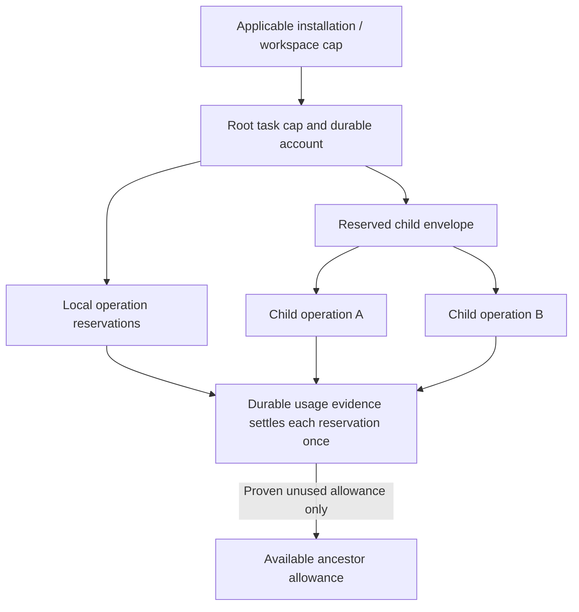

# ADR-0003: Durable aggregate budget admission

Date: 2026-09-20. Status: selected design constraint; runtime unimplemented.

## Context

Per-operation limit checks do not prevent two concurrent children from spending
the same remaining task allowance. A restart or disconnected provider also must
not restore potentially consumed budget. The earlier brief named limits without
assigning aggregate reservation, settlement or recovery ownership. This resolves
review finding F3.

## Decision

The orchestrator owns one durable authority for hierarchical budget admission.
An operation needs an atomic ancestor-budget reservation bound to durable action
intent before dispatch. Actual usage settles once; uncertainty retains allowance.
Agents propose bounds, adapters report evidence, and hosts enforce grants and
limits. Context capacity, consumable usage, occupancy and deadlines have distinct
units and rules. Remote children receive reserved envelopes, not independent
copies of their parent's remaining budget.

The [aggregate budget contract](../designs/core-harness-brief.md#aggregate-budget-ownership-and-admission)
owns the detailed rules and reservation state model. This selected scope view
shows containment of authority; arrows mean allocation, not additional budget:

## Alternatives and consequences

- Check each operation against a snapshot of remaining allowance: inexpensive
  but unsafe under concurrency. Rejected.
- Refund on timeout, lease expiry or task termination: improves apparent
  availability but allows repeated spending with unresolved usage. Rejected.
- Let each child own an independent full budget: duplicates authority and permits
  recursive amplification. Rejected.

Durable admission adds a serialization boundary and needs latency/load objectives.
Remote envelopes can leave capacity unavailable during partitions; that is the
cost of avoiding overspend. An unbounded provider operation cannot satisfy a hard
cap merely by using a cost estimate. Late evidence may settle accounts without
changing a terminal task outcome. Breaches must remain visible in actual usage.

## Readiness and validation

D3/D4 must choose schema, durability, atomicity, numeric representation and budget
configuration scopes. D5 must establish remote envelope fencing and settlement;
each provider design must establish billable bounds. Required tests include
competing children, duplicate admission/settlement, crash boundaries, ambiguous
billing, unavailable authority, and partitioned delegation. See the canonical
[regression cases](../designs/core-harness-brief.md#validation-required-for-the-detailed-designs)
and [delivery gates](../plans/implementation.md#early-increment-acceptance-gates).
No storage technology, distributed transaction or implementation is selected here.
