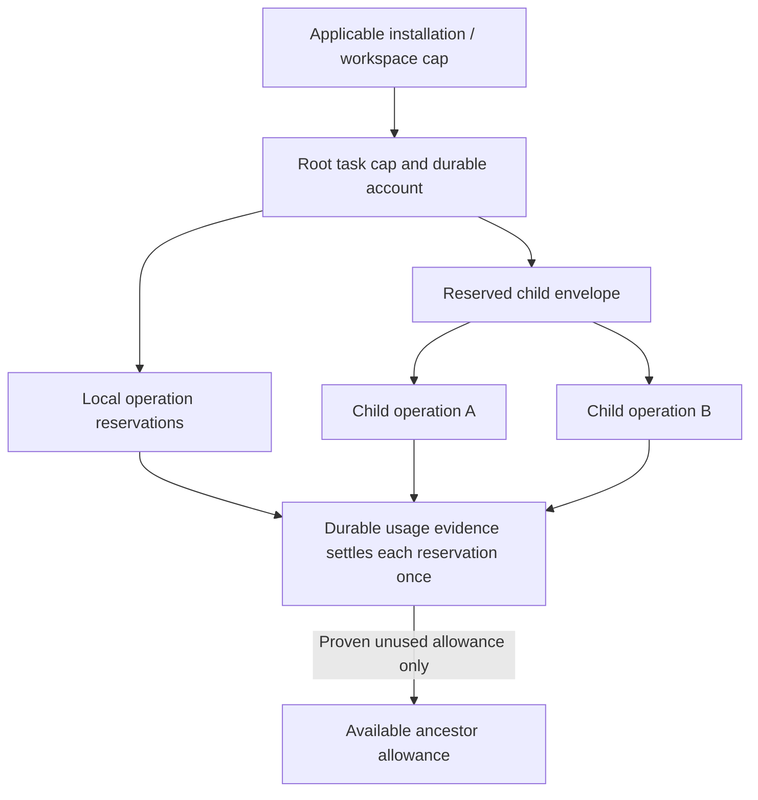

# ADR-0003: Durable aggregate budget admission

Date: 2026-09-20. Status: required behavior.
Remaining decisions: see Readiness and validation. No runtime implementation exists.

## Context

Per-operation limit checks do not prevent two concurrent children from spending
the same remaining task allowance. A restart or disconnected provider also must
not restore potentially consumed budget. The earlier brief named limits but did
not assign an owner to reserve budget, record usage, or recover interrupted work.

## Decision

The orchestrator controls the shared budget. Before an operation starts, it
reserves the required amount against each applicable budget limit. This includes
the operation's task limit and the limits inherited from parent tasks.

The reservation must be atomic across those limits. Concurrent operations must
not reserve the same remaining allowance. The orchestrator must durably link the
reservation to the action intent before dispatch. It records actual usage once.
If usage is uncertain, it retains the allowance until evidence permits settlement.

Agents propose the required limits. Adapters report usage evidence. Hosts enforce
grants and limits. Context capacity, consumable usage, occupancy and deadlines
have distinct units and rules. A remote child receives a reserved part of its
parent's allowance, called an envelope. It does not receive a separate copy of
the parent's remaining budget. See the [glossary](../glossary.md) for these terms.

### Budget allocation

The [aggregate budget contract](../designs/core-harness-brief.md#aggregate-budget-ownership-and-admission)
defines the detailed rules and reservation states. This required behavior view
shows how budgets contain child allocations. Arrows allocate existing allowance;
they do not create additional budget.

## Alternatives and consequences

- Check each operation against a snapshot of remaining allowance: inexpensive
  but unsafe under concurrency. Rejected.
- Refund on timeout, lease expiry or task termination: improves apparent
  availability but allows repeated spending with unresolved usage. Rejected.
- Let each child own an independent full budget: duplicates authority and permits
  recursive amplification. Rejected.

The orchestrator must coordinate concurrent reservations and persist them before
work starts. The design must set latency and load targets for this step. A network
partition can leave a remote child's reserved allowance unavailable to other work.
Retaining that allowance prevents overspending.

A cost estimate cannot enforce a hard cap on an unbounded provider operation.
Late evidence may update budget accounts without changing a terminal task outcome.
The accounts must show actual usage, including any amount above the limit.

## Readiness and validation

D3/D4 must define the record schema, persistence guarantees and atomic reservation
mechanism. They must also define numeric types and where each budget limit applies.
D5 must prevent stale remote owners from spending an envelope and define how to
settle remote usage. Each provider design must establish bounds on billable work.

Required tests cover concurrent children, repeated reservation and settlement
requests, and crashes at each persistence step. They also cover uncertain bills,
an unavailable budget authority, and network partitions during delegated work.
See the canonical [regression cases](../designs/core-harness-brief.md#validation-required-for-the-detailed-designs)
and [delivery gates](../plans/implementation.md#early-increment-acceptance-gates).
No storage technology, distributed transaction or implementation is selected here.
