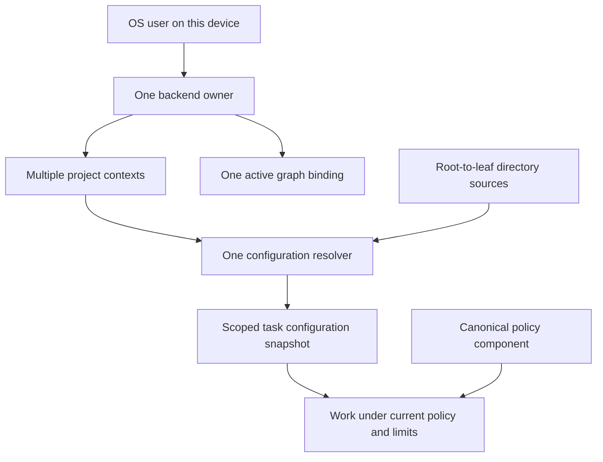

# ADR 0004: One user service with scoped configuration

Date: 2026-09-20. Status: required behavior.
Remaining decisions: service mechanisms, context identity schema and configuration
format. No runtime implementation exists.

## Context

The user requires one backend service per OS user on a user device. That backend
must know about multiple projects and repositories. It must discover, combine
and evaluate configuration in a directory and its parents.

Per-client or per-repository backends would divide task state and shared budgets.
A global current directory would let one client change another client's context.
Treating all configuration as last-value overrides would let repository settings
change service storage or widen security permissions.

## Decision

Use one backend owner per OS user on the device. Register project contexts within
that service and give each a stable identity. Commands explicitly identify their
context and working directory. Agent and platform helpers may be separate processes.

One backend resolver composes context settings along the verified directory chain
from filesystem root to the command directory. Schema rules define field precedence.
Service administration settings remain outside repository control. The canonical
policy component evaluates security controls; directory precedence cannot grant
authority. Tasks record immutable configuration snapshots while current policy
continues to constrain execution.

The [service and configuration brief](../designs/user-service-configuration.md)
owns the detailed behavioral rules, diagrams and acceptance cases C1-C4.
[ADR-0001](0001-context-store-binding.md) still governs the single graph binding;
multiple contexts share that graph with explicit scope isolation.

### Decision relationships

Selected behavior. Arrows show ownership or derivation, not physical processes.

## Alternatives and consequences

- A backend per client or repository conflicts with the required service model.
  Reject it. Use multiple agent instances inside the service's ownership instead.
- Stopping discovery at a repository root would omit parent configuration.
  Reject it. Validate every applicable ancestor source and retain its provenance.
- A general deep merge obscures list handling and security scope. Use declared
  per-field rules and separate authorization evaluation.
- One service reduces duplicate ownership but shares capacity and failure impact.
  Require context isolation, fair scheduling, bounded control latency and recovery.

Design configuration semantics in D3. D6 builds the editing and inspection UX.
I1 must deliver service and configuration behavior before model or execution work.
This decision does not authorize implementation.
