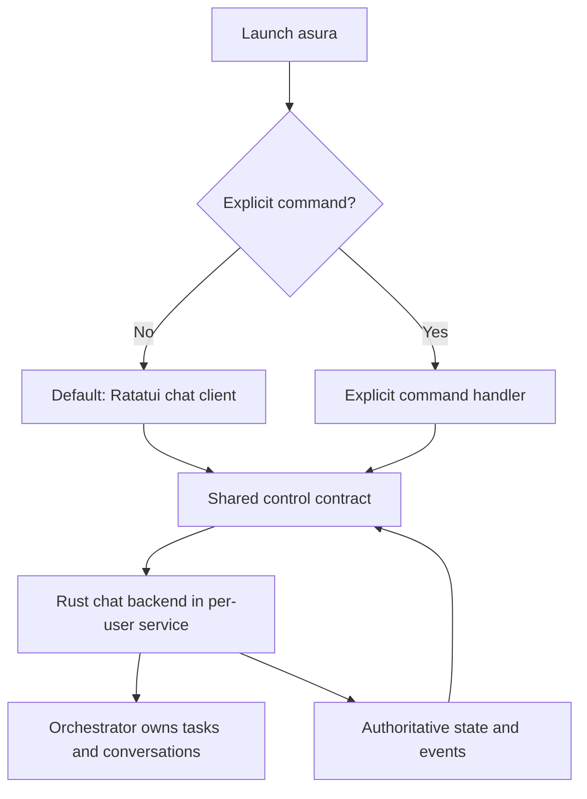

# ADR-0005: Default to Ratatui chat with a Rust backend

Date: 2026-09-23. Status: selected by the owner.
Production default launch and backend behavior are not implemented or runtime-validated.
The isolated TUI experiment has its own qualification scope.

## Decision and rationale

Use Ratatui for the interactive chat/TUI and Rust for the chat backend.
Launching `asura` without an explicit command selects interactive chat by default.
Explicit non-interactive commands remain available through the same control contract.
This makes chat the normal entry point for the selected local CLI/TUI release.

The chat backend belongs to the existing per-user backend service. It reuses the
orchestrator's task and conversation ownership rather than creating a separate
chat execution engine. The client owns input and presentation. Policy evaluation,
configuration resolution, budgets and host enforcement retain their canonical owners.
Client exit does not itself stop the service or cancel its tasks.

The owner selected these technologies and launch behavior. An explicit-chat-only
entry point is therefore not the default design. Alternative TUI frameworks are
not part of the current selection. This decision does not claim a benchmark win
or select the remaining Swift/Rust boundaries, transport or process topology.

## Launch and ownership view

Selected entry points and logical responsibilities. Arrows show mode selection
and control traffic, not a selected transport. Terminal availability and startup
failure handling require the detailed launch contract described below.

## Design consequences and validation

[W0](../designs/product-workflows.md#w0-launch-chat-by-default) owns launch acceptance
criteria. D2 must integrate the selected Rust ownership with the service topology.
D3 owns startup/attachment errors, durable conversation state and the control
contract. D6 owns launch parsing, terminal handling, keyboard interaction and
presentation. D7 pins versions, supported environments and runnable checks.

The input and signal pipelines follow the selected
[asynchronous architecture](0006-async-event-pipelines.md).
Before implementation, select the Ratatui version, terminal I/O integration,
event-loop mechanisms, rendering limits and terminal restoration behavior. Specify
non-TTY input/output, unsupported terminals, explicit help/version handling,
connection failures and service recovery. None may silently submit work, grant
authority or create a competing backend owner. Swift model/platform integration
remains subject to its governing design.

Validation requires unit tests for mode selection, integration tests through the
actual client/service boundary, and real-terminal end-to-end launch, reconnect,
resize and exit cases. Preserve W3-W4 cancellation, recovery and multi-client tests.
Selecting this framework does not establish accessibility or performance compliance.

Reference: [Ratatui's official documentation](https://ratatui.rs/) describes the
Rust terminal UI library. Documentation was checked on 2026-09-23; no dependency
was installed or pinned. Implementation remains subject to the
[design gate](../design-process.md).
