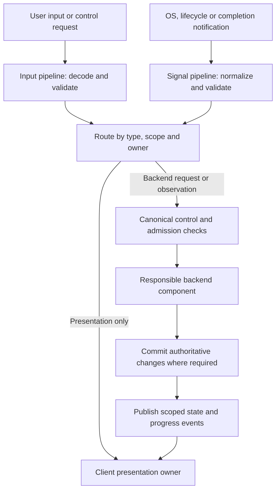
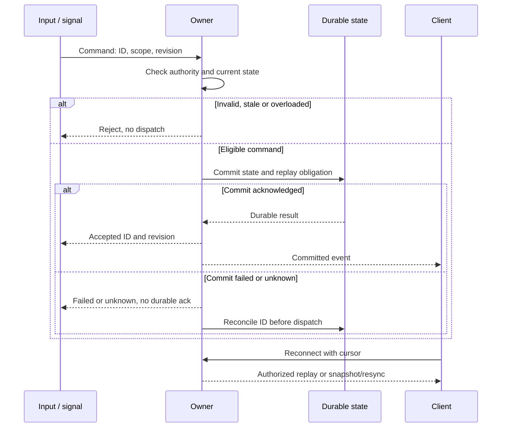

# ADR-0006: Asynchronous architecture with input and signal pipelines

Date: 2026-09-23. Status: required architecture selected by the owner.
Pipeline mechanisms and schemas need detailed design. No runtime proof exists.

## Decision and scope

Asura uses a fully asynchronous, event-driven architecture with explicit input
and signal processing pipelines. This applies to control clients, the Rust
backend, agent execution and model/platform/remote adapters. Control and rendering
must remain responsive while inference, storage or external work is pending.

An **input pipeline** receives user interaction or a control request, validates
and translates it, and routes a typed command to its owner. A **signal pipeline**
receives notifications such as terminal changes, process exits, deadlines,
cancellation requests, configuration changes and operation completions. It
normalizes and routes them to the component responsible for their meaning.
These are logical responsibilities, not a requirement for two global queues.

Asynchrony does not require every local computation to yield. Each handler must
perform bounded work and must not synchronously wait for slow I/O or model work
on control/rendering execution paths. D2 must isolate APIs that can block and
define their asynchronous boundary, cancellation and shutdown behavior. Selecting
an async runtime, actor framework, message broker or event-sourced store remains
separate design work; none is implied by this decision.

## Ownership and trust

The client owns terminal input decoding and presentation events. The backend
validates all received control requests using its canonical control and policy
contracts. A client-generated event cannot establish authority. Tool/provider
results and filesystem notifications remain untrusted observations.

The orchestrator remains the single owner of task lifecycle and budget admission.
Configuration, context, policy and host enforcement retain their existing owners.
Each event must reach its relevant owner; a subscriber cannot independently
authorize execution or create competing authoritative state.

An event's arrival order is not an authoritative order across sources. Task
revisions, operation/request identities, scope and owner/model generations must
support the relevant duplicate, stale and concurrent-event checks. D3-D5 select
the required envelope fields and ordering domains. Event delivery alone does not
prove persistence, acceptance, completion or exactly-once effects.

### Pipeline responsibilities

Required logical flow. Arrows carry typed inputs, signals, commands or events.
Queue placement, process boundaries and scheduling remain open. Presentation-only
events can remain local; backend-affecting requests always use the control contract.

## Ordering, backpressure and failure requirements

Every pipeline boundary needs a bounded queue or equivalent admission limit,
payload limits and an explicit overload outcome. D2/D3/D6 must specify numeric
limits, scheduling fairness and isolation between contexts and event classes.
Slow rendering, output floods and model completion traffic must not starve status,
cancellation or deadline processing. Existing P0-P9 objectives remain proposals.

Loss/coalescing rules must be specific to the event class. A resize may be
coalescible; accepted task commands, cancellation intent, operation outcomes and
usage obligations cannot silently disappear. A dropped file notification cannot
replace admission/restart source validation. D3/D6 must define replay or explicit
resynchronization when a consumer falls behind, disconnects or loses its cursor.

Submission may be rejected before acceptance under overload. After durable
acceptance, retain the command and its obligations under the recovery contract.
If persistence fails or its outcome is unknown, do not acknowledge durable
acceptance or dispatch work from that uncertainty. Follow the existing
[failure procedure](../designs/core-harness-brief.md#common-failure-and-deadline-contract).

### Durable control and event delivery

Required ordering for a state-changing backend command; acknowledgements and notifications
have different meanings. Arrows are asynchronous messages, not a transport choice.
The owning component serializes conflicting changes through the D3 contract.

Task cancellation, deadlines, user responses and completion signals must obey the
existing lifecycle precedence and settlement rules. An OS interrupt is not proof
of task cancellation; D6 must map client signals to explicit client/task/service
actions without conflating their lifetimes. Late execution-outcome and usage
evidence may support reconciliation or settlement without reopening a task or
starting fresh work. Results and tool callbacks from invalidated model generations
must be rejected; they cannot enter effective context or drive work. Preserve the
[model-session contract](../designs/core-harness-brief.md#model-session-ownership-and-effective-context)
when routing these different signal classes.

Shutdown and restart must define ingress closure, queued work disposition,
bounded draining, subscription closure and recovery of accepted commands and
outstanding effects. Independent contexts must retain the isolation required by
the [service contract](../designs/user-service-configuration.md).

## Design handoff and validation

D2 owns runtimes, execution contexts and blocking-API isolation. D3 owns command
and event schemas, ordering, durable publication/replay and recovery. D4 owns
agent/model callback integration; D5 extends it across remote boundaries. D6 owns
terminal input/signal mapping, rendering and consumer backpressure. D7 defines
the runnable fault, load and responsiveness checks. These remain readiness gates.

- **Unit:** Validate routing, payload bounds, duplicate/stale events, priority,
  allowed coalescing and cancellation/deadline/completion arbitration.
- **Integration:** Exercise actual queues, process/adaptor boundaries and durable
  stores with slow consumers, overflow, dropped connections and crashes around
  commit/publication. Verify recovery of accepted work and retained usage.
- **End-to-end:** Run default Ratatui chat and a second client while model work
  stalls and tool output floods. Resize, inspect status, cancel, disconnect and
  reconnect. Verify responsive controls, one authoritative outcome and disclosed
  uncertainty. Repeat with process signals and backend restart.
- **Environment:** Supported macOS, real terminals, Rust service, model/platform
  adapters and both storage modes; actual remote boundaries when delivered.

Each independent event race and overload/failure combination needs its own test
ID in D7. Mock callbacks cannot prove actual scheduling or OS signal handling.
The architecture selection does not authorize implementation.
