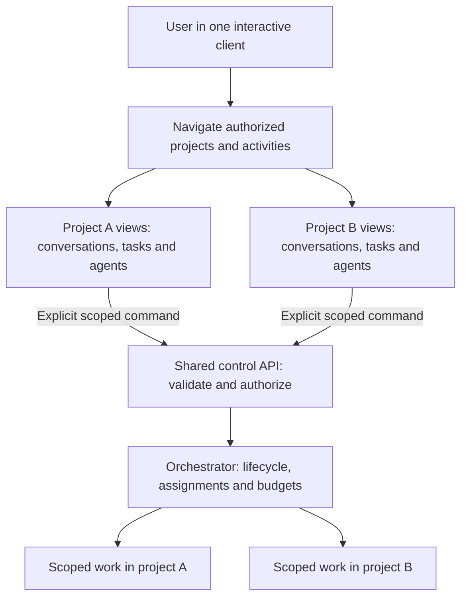

# ADR 0007: One interface for multiple projects and activities

Date: 2026-09-24. Status: required behavior.
Remaining decisions: navigation layout, selection defaults, subscription/revocation
mechanisms, draft persistence and measurable navigation targets. No runtime
implementation exists.

## Context

[ADR-0004](0004-user-service-contexts.md) establishes a shared per-user service
with multiple project contexts. The user requires the control interface to make
that separation useful: navigate projects and operate different agents and
activities from the same interface, without attachment to one launch directory.

The previous workflows demonstrate multiple clients with different contexts.
They do not explicitly require one client to manage several contexts and ongoing
activities. That gap could produce a project-bound interface over a shared backend.

## Decision

Require multi-project navigation within one interactive client. The orchestrator
continues to own tasks, agent assignments and execution. Client selection changes
presentation only; task commands use explicit scoped identities through the control
contract. Navigation cannot transfer permissions, model state or task ownership.

[W6](../designs/product-workflows.md#w6-navigate-projects-and-concurrent-activities)
owns the detailed user-visible contract and its delayed-command sequence. It covers
scoped drafts, background decisions, authorized discovery and recovery. The
[domain model](../designs/domain-model.md#conversations-tasks-and-model-input)
keeps conversations and tasks scoped while clients navigate between them.

### Navigation and execution ownership

Required responsibility view. Arrows show view selection and scoped control, not
process topology. A selection in the client does not change the work's ownership.
The detailed command/failure sequence remains canonical in W6.

## Consequences and validation

- A launch directory can aid initial selection, but does not restrict navigation.
- Starting another client is optional; switching does not restart background work.
- Scope clarity is mandatory for commands, drafts, approvals and event routing.
- Authorized discovery and background summaries need their own bounded contracts.
- Tabs, panes and a particular dashboard layout remain D6 choices.
- Cross-project task migration or shared model sessions are not introduced.

D3 supplies identity, discovery, subscription and acceptance semantics. D6 supplies
navigation, keyboard/accessibility behavior and view restoration. D2/D3/D7 cover
scheduling and load; D6/D7 establish measurable navigation acceptance targets.
I1 supplies scoped service control, and I4 delivers the single-client workflow.

The [R22 validation mapping](../designs/requirements-validation.md#cross-cutting-coverage)
requires unit, integration and end-to-end evidence for W6-A through W6-C. The first
release still has read-only source access and requires I9 qualification. This
decision does not authorize implementation or select a GUI design.
