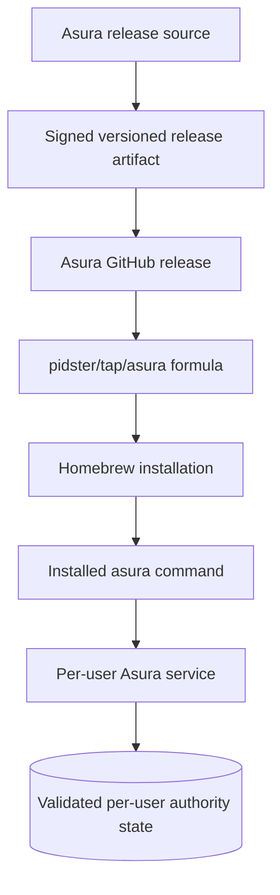

# ADR 0008: Distribute Asura through the existing Homebrew tap

Date: 2026-09-25. Status: selected distribution direction. Artifact contents,
signing workflow, service upgrade and release qualification remain D2/D7/I9
design work. No Asura formula or release artifact exists yet.

## Context

The owner selected a standalone `asura` command with a per-user service. The
existing [pidster/homebrew-tap](https://github.com/pidster/homebrew-tap)
installs Wisp through
[`Formula/wisp.rb`](https://github.com/pidster/homebrew-tap/blob/main/Formula/wisp.rb).
That formula downloads a versioned Wisp GitHub release archive, checks its
SHA-256, installs both `wisp` and `wisp-tui`, and tests each binary's `--version`.
It limits the host to arm64 and the macOS version required by Wisp. The tap
also contains a separate `daimon` formula. These observations describe the
current tap, not an Asura artifact or proven Asura release process.

## Decision

Asura will publish a prebuilt macOS release artifact from the Asura repository
and distribute it through an `asura` formula in `pidster/homebrew-tap`.
Homebrew installs the command; Asura's own service contract owns per-user
startup, attachment, shutdown and state migration. The formula does not own the
service lifecycle or create `$HOME/.asura/` during installation.

The [release distribution design](../designs/release-distribution.md) owns
artifact contents, trust checks, installation, upgrade and recovery. The
[standalone service design](../designs/system-architecture.md) owns runtime
arbitration and version negotiation. I9 must qualify the actual signed artifact
and formula before publication. This decision does not authorize release or
implementation.

### Distribution ownership

Selected responsibility view. Arrows show publication and installation, not
runtime authority. Only the running per-user service can initialize Asura state.

## Consequences

- The formula must refer to an immutable versioned asset and its exact digest.
- The release must package every executable and runtime asset Asura needs on a
  supported host; installing Asura must not require Xcode or a Rust toolchain.
- Homebrew upgrade can replace the installed command while an older service
  remains active. The control protocol must reject unsupported mixed versions
  and provide an explicit, recoverable handover path.
- Homebrew uninstall must leave per-user authority files and graph data intact.
  Any data removal requires a separate explicit user action.
- The existing tap is a distribution precedent. It does not establish Asura's
  artifact layout, signature verification or release readiness.
