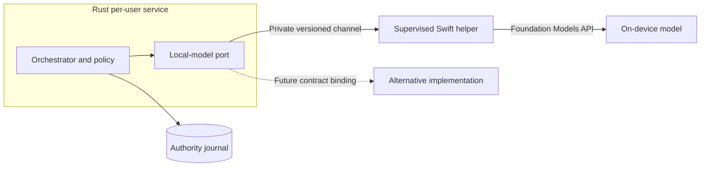

# ADR-0009: Supervise the first macOS local-model helper

Date: 2026-09-25. Status: selected by the owner. The first macOS Foundation
Models implementation runs in a supervised Swift process. IPC encoding, helper
identity, resource layout, numeric limits and runtime qualification remain D2/D7
design work. No production helper has been implemented or tested.

## Context and decision

The Rust per-user service owns task state, policy, budgets, model selection and
tool-effect admission. The [local-model design](../designs/swift-rust-boundary.md)
defines one semantic contract that can admit alternative implementations with
different platform capabilities. The first macOS implementation needs access to
Foundation Models without moving authority into Swift.

Use a separately supervised Swift executable for that implementation. The Rust
service launches it from a verified package-private location and communicates
through a private, versioned, bounded channel. The Swift process owns model
session mechanics but cannot write the authority journal, access the graph or
execute host tools. A model crash or stalled call must not crash or block the
service's control path. Process exit alone does not prove task cancellation or
settle an admitted external effect.

### Selected process boundary

Selected ownership view. Arrows show scoped model calls and the authority path;
results and proposals return through the same channel. The diagram does not
select wire encoding, a spawn API or a package path.

## Alternatives and consequences

An in-process Swift FFI bridge avoids process startup and transport framing.
It shares crash fate with the authority-owning service and needs a C ABI for
buffers, callbacks, executors, cancellation and unwinding. The owner selected
the supervised process for failure isolation and a terminable model boundary,
accepting IPC, helper verification and packaging work. The process choice does
not select a wire format or prove a latency target.

The semantic local-model contract remains independent of this macOS process
choice. Another platform may bind that contract through a different mechanism
after its own design and qualification. The first release still targets macOS
27 and Foundation Models; this decision does not claim cross-platform support.

The [I0 probe](../designs/swift-rust-boundary.md#i0-contract-probe-boundary)
uses a separate test-only Swift fixture to qualify the channel. I3 must repeat
the relevant failure and cancellation cases with the real model and durable
service. I9 must prove the signed packaged helper, resource lookup and Homebrew
upgrade behavior on a supported host. This decision does not authorize code.
