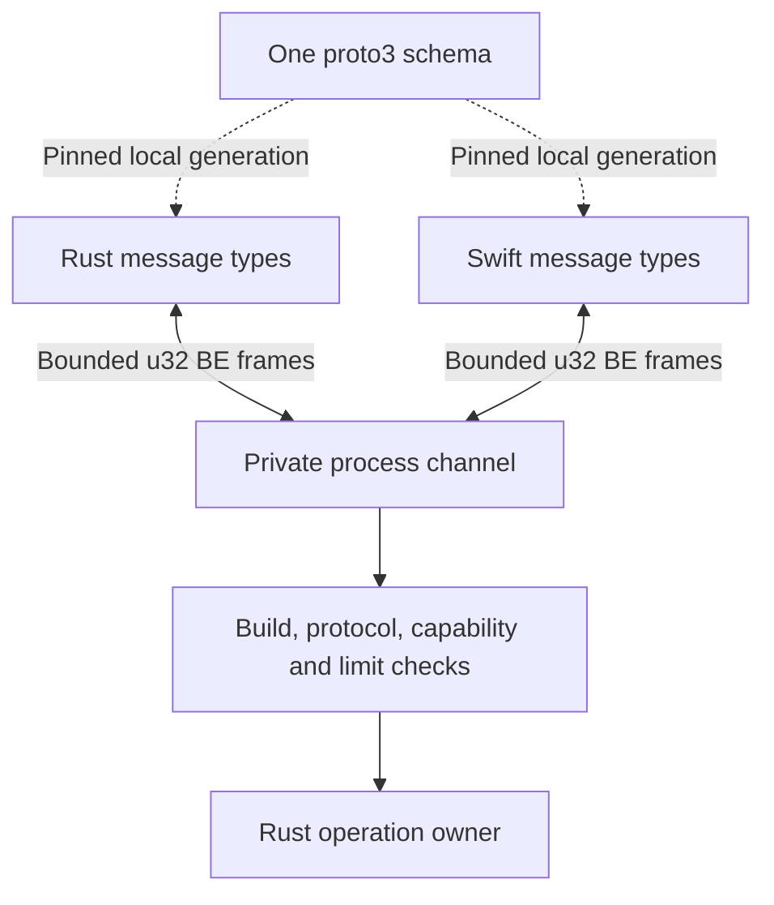

# ADR-0010: Use Protocol Buffers for the first model-helper channel

Date: 2026-09-25. Status: selected by the owner. Binary Protocol Buffers is the
wire contract for the first private Rust–Swift model-helper channel. Each frame
uses a 4-byte big-endian length prefix. Model payloads use ordered chunks
across bounded frames. Each transfer uses a bounded credit window. Schema
fields and numeric limits remain open. A clean build
generates both language bindings from the schema using pinned local tools.
The first binding requires an exact packaged build and private-protocol match.
No generated binding or process exchange has been implemented or verified.

## Context and decision

[ADR-0009](0009-supervised-local-model-helper.md) selects a supervised Swift
process for the first macOS Foundation Models implementation. The Rust-owned
semantic [local-model port](../designs/swift-rust-boundary.md) remains independent
of that process and must admit alternative implementations. The private channel
needs one cross-language schema and a versioned, bounded request/result contract.

Use one canonical `proto3` schema to generate Rust and Swift message types.
The owner selected build-time generation on 2026-09-25. A clean checkout must
generate both bindings from that schema with pinned local compiler and
generator tools. Generated source for this private channel is a build output,
not a checked-in contract. A missing tool, wrong version or generation failure
stops the build. The build must not silently compile stale generated output or
fetch an unpinned generator. The
[I0 bootstrap design](../designs/protobuf-toolchain-bootstrap.md) specifies
tool acquisition, the selected Rust bootstrap owner, initial version pins and
generated-output ownership. Its
test-only smoke schema does not validate this channel; clean build and channel
compatibility qualification remain. The signed release packages
compiled binaries and resources; users do
not need the generators to run them.
Carry each message as an unsigned 32-bit length in network byte order followed
by exactly that many Protobuf bytes on the private stream. `prost-build` and
Apple's `SwiftProtobuf` generator are selected bindings for I0. D2/D7 must
qualify their selected versions before the I0 bridge design is ready.
The owner selected chunked input and output on 2026-09-25. A transfer has a
stable request and transfer identity, ordered chunk ordinals and bounded total
bytes. Input has an explicit end marker. The one terminal result is the output
end marker and reports final chunk count, byte total and success or typed failure.
The receiver does not call the model with a partial input. A failed or cancelled
input transfer discards its buffered content. Partial output already published
as provisional progress requires an explicit failure or invalidation event; it
cannot become a settled result merely because a prefix arrived.
The owner selected positions and totals without a payload digest on
2026-09-25. Each nonempty chunk has a consecutive zero-based ordinal. An input
end marker or output terminal result states the final chunk count and total
payload bytes. The receiver checks both before treating the transfer as
complete. This detects missing, duplicate, reordered or truncated chunks but
does not detect a same-length change to payload bytes. No per-transfer SHA-256
or other digest is required by this private channel. Release-artifact digests
and D4 context-provenance rules remain separate.
The owner selected a bounded credit window on 2026-09-25. The input and output
transfers have separate byte-denominated credit ledgers. A sender may transmit
chunk bytes only within credit granted by that transfer's receiver. Control
messages, including cancellation and terminal status, do not wait for data
credit. Credit acknowledgement confirms transport acceptance, not model
execution, durable publication or operation completion. D2 defines the
[ledger transitions and fault tests](../designs/swift-rust-boundary.md#chunked-payload-transfer);
the numeric window and exact schema field types remain open.

The owner selected an exact packaged helper build match on 2026-09-25. Before
model content, Rust and Swift exchange one package-build identity and one
private-protocol identity. Both must equal the service's expected values; the
channel does not negotiate a compatible version range. A mismatch closes the
channel before request content and triggers bounded child cleanup. The service
must resolve and verify the helper from its own package before spawn. A
self-reported handshake value is not binary-integrity proof. D2/D7 must fix the
identity format, signed manifest and resource verification. Client-to-service
control-protocol compatibility remains a separate D3/D7 contract.

### Contract and authority view

Selected encoding and framing with proposed validation points. Arrows show
translation across the private channel. Frame length is checked before
allocation. Semantic validation happens after decoding before model work or
result settlement.

Protobuf parsing is not authorization. Unknown fields, unknown critical enum
values, missing semantic identities or a mismatched build or protocol cannot
grant capabilities. Rust validates the admitted request, scope and generation
after decoding. The helper validates its request envelope before model work.
Both readers reject a zero length, a length above the negotiated or local hard
maximum, and EOF within the prefix or body. They reject the frame before
allocating its declared body when the length is invalid. A malformed frame
closes the channel; neither side searches for a new boundary in later bytes.
The first handshake frame uses the local pre-negotiation hard maximum. Later
frames use the smaller of both peers' advertised maxima and the local hard
maximum. A peer's advertisement can reduce a limit but cannot raise it.
EOF at a frame boundary is orderly only after a valid terminal result or an
explicit handshake rejection with no admitted operation. Otherwise it is a
lost channel requiring reconciliation. Handshake, per-frame completion and
absolute operation deadlines prevent silence or byte dribbling from extending
work. Receiving one byte cannot restart a frame deadline; a completed frame
cannot extend the absolute operation deadline.
Cumulative frame-count and byte limits prevent a flood of small valid frames.
The numeric deadlines, local hard maximum, aggregate limits and per-message
field limits remain D2 decisions.
The [I0 probe](../designs/swift-rust-boundary.md#i0-contract-probe-boundary)
must prove mismatch and oversized-frame rejection with real Rust and Swift
processes; I3 repeats the relevant cases under durable service admission.

## Alternatives and consequences

Length-prefixed JSON is easier to inspect during development, but would still
need a qualified common schema generator and strict cross-language validation.
FlatBuffers offers another schema-first binary path, but adds a distinct runtime
and generator without an established I0 need. Protocol Buffers supplies mature
Rust and Swift generators and field-evolution rules, at the cost of pinned
compiler/plugin tooling and explicit semantic compatibility checks.
The [proto3 language guide](https://protobuf.dev/programming-guides/proto3/),
[Prost project](https://github.com/tokio-rs/prost) and
[SwiftProtobuf project](https://github.com/apple/swift-protobuf) describe those
language and generator contracts. The chosen versions still need qualification.

The inspected host has `protoc` but lacks the Swift generator. SDK and tool
availability alone do not prove compatible generated bindings, bounded parsing
or packaged operation. This decision does not authorize implementation.

Checking generated bindings into the repository would let a compiler run
without local generator tools. It would require a regeneration gate to detect
schema drift and could hide a generator mismatch until that gate runs. Build-time
generation keeps the schema authoritative and exposes tool failures in a clean
build. It adds a pinned toolchain prerequisite to developer and CI builds.

An inline-only payload would have a smaller transfer state machine but would
reject any request above one frame. Chunking supports larger authorized model
contexts while keeping each allocation bounded. It requires ordering, bounded
in-flight data, partial-transfer cleanup and additional fault tests. The
semantic port remains independent of this first macOS transport choice.

Stop-and-wait would allow only one unacknowledged chunk and simplify the
transfer ledger. It would also add a round trip to every chunk. A bounded
credit window allows several chunks in flight while limiting transport memory.
It requires cumulative acknowledgement, stale-credit rejection, independent
input and output ledgers, and cancellation tests. Window size and throughput
must be qualified before I0 implementation.

A transfer digest would detect a same-length reconstruction error in addition
to structural faults. It would require incremental hashing in both languages,
digest fields and cross-language fault cases. Positions and totals retain the
smaller protocol for this private local stream. They provide structural
validation, not authentication or cryptographic content integrity.

A negotiated compatible helper range could keep model work available when a
new package replaces an old one. It would require mixed-build schema,
cancellation, resource and recovery tests. Exact matching makes a mismatch an
explicit model-unavailable state until the service hands over or its verified
matching helper returns. It cannot silently load a helper from a newer keg.
