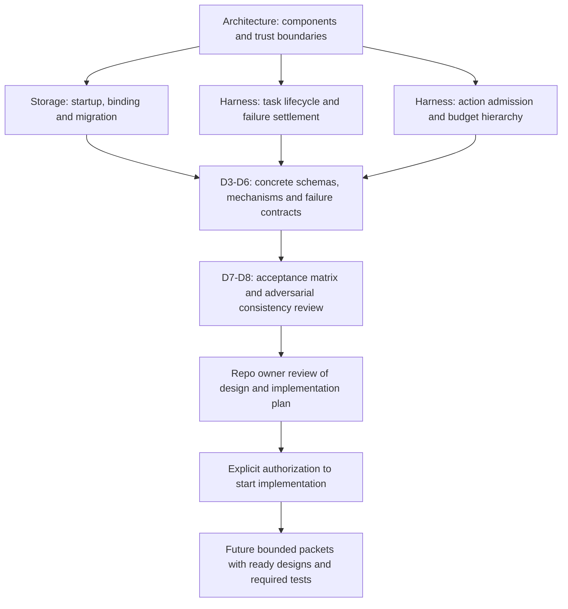

# Architecture decisions and review map

The project remains in design. A selected ADR records an architectural constraint;
it does not make a subsystem implementation-ready. Both design and implementation
plan must be reviewed before implementation is authorized.

## Decisions from the 2026-09-20 review

| Finding | Decision and reason | Canonical specification | Delivery evidence |
| --- | --- | --- | --- |
| F1: missing external settings could select a fresh graph on restart | [ADR-0001: store binding](0001-context-store-binding.md) preserves installation identity before applying initialization defaults | [Storage brief](../designs/context-storage-candidates.md) | I2: fresh startup, reopen, identity mismatch and interrupted migration in both storage modes |
| F2: fatal errors and task deadlines bypass effect accounting | [ADR-0002: failure settlement](0002-failure-settlement.md) applies one procedure in every nonterminal state | [Failure contract](../designs/core-harness-brief.md#common-failure-and-deadline-contract) | I1-I2: deadline/fatal/budget races, restart and explicit uncertain effects; later increments extend real boundary evidence |
| F3: parallel children can spend the same allowance | [ADR-0003: aggregate admission](0003-aggregate-budget-admission.md) reserves hierarchically before dispatch and retains unknown usage | [Budget contract](../designs/core-harness-brief.md#aggregate-budget-ownership-and-admission) | I2: concurrent admission/recovery; I3 model calls; I5 provider billing; I7 remote envelopes |

## Visual reading path

Selected documentation navigation, from requirements to detailed contracts and
future evidence. Arrows mean refinement or a required gate, not runtime calls.

Start with [architecture ownership](../architecture.md#logical-component-and-trust-boundaries),
then the linked canonical specifications above. The harness also includes
[context provenance](../designs/core-harness-brief.md#proposed-logical-graph-schema)
and [model-state admission](../designs/core-harness-brief.md#model-session-ownership-and-effective-context).
Follow the [design stages](../plans/architecture-and-design.md) and then the
[implementation dependencies and acceptance gates](../plans/implementation.md).

## Remaining design work

These findings are resolved at the contract level. D0-D8 still need to produce
the named detailed artifacts: user workflows and measurable objectives; threat
model and OS enforcement; topology and identity; concrete control/policy/storage
schemas and recovery mechanisms; graph algorithms and model evaluations; remote
protocols; configuration/audit behavior; and toolchain/CI/validation environments.
Those are recorded design deliverables, not claims of completed or verified
runtime behavior. The architecture plan remains the authority for their ordering.

## Documentation validation on 2026-09-20

The corrective contracts received a follow-up read-only adversarial review. Its
remaining ambiguity about unknown billing was resolved: known effects may reach
a terminal outcome while usage remains explicitly reserved and disclosed; unknown
effects require bounded reconciliation. The reviewer checked that resolution.

Mermaid CLI 11.16.0 rendered all 24 diagrams in the affected diagram-bearing
documents. Changed diagrams were visually inspected and overlapping labels were
corrected. All 69 local Markdown links/anchors and `git diff --check` passed.
Previews stayed outside the repository. These checks establish documentation
consistency and rendering only. No product implementation or runtime tests were
performed; the acceptance matrices specify future evidence.
