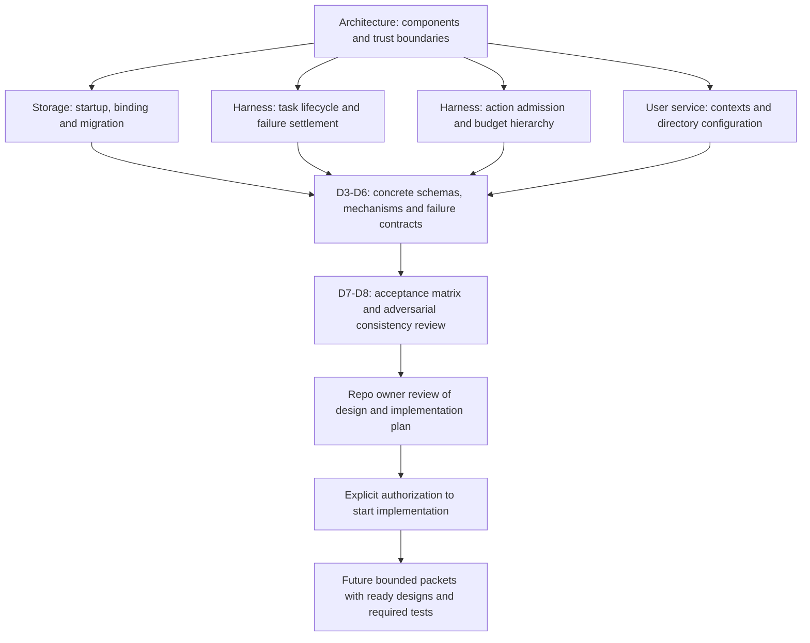

# Architecture decisions and review map

This directory records significant architecture choices and their rationale.
Decision records link to the designs that own detailed behavior. The dated
reviews below preserve the evidence and limitations recorded for those decisions.

Status: index of selected design decisions. Selection does not establish
implementation or runtime verification. The [design process](../design-process.md)
governs implementation readiness and authority. The [glossary](../glossary.md)
explains project terms.

## Files

| Decision | Selected behavior |
| --- | --- |
| [ADR-0001: Context-store binding](0001-context-store-binding.md) | Preserve the installation's graph identity across restart and authorized storage changes. |
| [ADR-0002: Failure settlement](0002-failure-settlement.md) | Apply one failure procedure that accounts for effects and usage. |
| [ADR-0003: Aggregate budget admission](0003-aggregate-budget-admission.md) | Reserve shared allowance before concurrent work can spend it. |
| [ADR-0004: User service and contexts](0004-user-service-contexts.md) | Use one backend per device user, with multiple project contexts and hierarchical configuration. |
| [ADR-0005: Default Ratatui chat](0005-default-ratatui-chat.md) | Launch Ratatui chat by default, with its Rust backend in the shared user service. |
| [ADR-0006: Asynchronous event pipelines](0006-async-event-pipelines.md) | Use asynchronous, event-driven coordination with explicit input and signal pipelines. |
| [ADR-0007: Multi-project control interface](0007-multi-project-control-interface.md) | Navigate authorized projects and concurrent activities within one interactive client. |
| [ADR-0008: Homebrew tap distribution](0008-homebrew-tap-distribution.md) | Distribute prebuilt Asura releases through the existing `pidster/homebrew-tap`. |
| [ADR-0009: Supervised local-model helper](0009-supervised-local-model-helper.md) | Run the first macOS Foundation Models implementation in a supervised Swift process. |
| [ADR-0010: Protobuf model channel](0010-protobuf-model-channel.md) | Generate bindings at build time; use fixed-prefix chunk frames, bounded credit and an exact packaged-helper build match. |

Return to the [documentation index](../README.md).

## Multi-project interface requirement on 2026-09-24

[ADR-0007](0007-multi-project-control-interface.md) requires one interactive client
to navigate authorized projects, conversations, tasks and agents. The launch
directory does not bind the interface to one project. The canonical
[W6 workflow](../designs/product-workflows.md#w6-navigate-projects-and-concurrent-activities)
defines selection, explicit command destinations, background activity and recovery.
R22 maps its unit, integration and end-to-end evidence; I4 delivers the workflow.
Presentation controls and concrete subscription mechanisms remain design work.

Validation: an independent read-only review found no conflicts or actionable
findings in the added ownership, scope, recovery and validation contracts.
Mermaid CLI 11.16.0 rendered the three new or changed diagrams after a sequence-label
syntax correction; each output was visually inspected. All 252 local links/anchors
and whitespace checks passed, as did `git diff --check`. This is documentation
evidence only; no product code or runtime checks were implemented or executed.

## Chat and asynchronous architecture decisions on 2026-09-23

[ADR-0005](0005-default-ratatui-chat.md) selects Ratatui chat as the default launch
mode with a Rust backend in the existing per-user service.
[ADR-0006](0006-async-event-pipelines.md) selects a fully asynchronous, event-driven
architecture with input and signal processing pipelines. Detailed launch,
scheduling, queue and recovery mechanisms remain design work.

Validation: a read-only review found ambiguous handling of obsolete model
callbacks. ADR-0006 now distinguishes rejected model output from execution/usage
evidence retained for reconciliation; the correction was rechecked. Mermaid CLI
11.16.0 rendered all three new diagrams, and each output was visually inspected.
All 205 local links/anchors and whitespace checks passed. These checks establish
documentation consistency only; no product implementation or runtime tests ran.

## Decisions from the 2026-09-20 review

| Finding | Decision | Detailed contract |
| --- | --- | --- |
| F1: restart could select an empty replacement graph | [ADR-0001: preserve the graph binding](0001-context-store-binding.md) | [Storage brief](../designs/context-storage-candidates.md) |
| F2: some failures could bypass effect accounting | [ADR-0002: use one failure procedure](0002-failure-settlement.md) | [Failure contract](../designs/core-harness-brief.md#common-failure-and-deadline-contract) |
| F3: parallel children could spend the same allowance | [ADR-0003: reserve shared budgets](0003-aggregate-budget-admission.md) | [Budget contract](../designs/core-harness-brief.md#aggregate-budget-ownership-and-admission) |

## User-service requirement on 2026-09-20

[ADR-0004](0004-user-service-contexts.md) records one backend per device user,
multiple project contexts and configuration discovery through parent directories.
The [service and configuration brief](../designs/user-service-configuration.md)
owns the scope, composition and change rules. Its C1-C4 cases require service,
filesystem, context-isolation and recovery evidence. D3 now owns configuration
semantics; D6 develops their editing and inspection workflows.

Validation: an independent read-only review checked service ownership, source
trust, scope isolation and reload behavior. Its three findings were corrected and
rechecked. Mermaid CLI 11.16.0 rendered all 14 diagrams in the five documents with
changed diagram sources. All 11 new or changed diagrams were visually inspected;
large ownership and lifecycle views were split for readability. All 150 local
links and anchors passed, as did `git diff --check`. These are documentation
checks, not implementation or runtime evidence.

## Delivery evidence for the review findings

I2 must test F1 in both storage modes: initialization, reopen, identity mismatch
and interrupted migration. I1–I2 must test F2 across failure, deadline and
cancellation races, including restart and unknown effects. Later increments add
evidence at each new execution boundary.

For F3, I2 must test concurrent reservations and recovery. I3 adds model calls;
I5 adds provider billing; I7 adds reserved budgets on remote hosts. The
[implementation plan](../plans/implementation.md#early-increment-acceptance-gates)
defines the delivery checks.

## Visual reading path

Selected documentation navigation, from requirements to detailed contracts and
future evidence. Arrows mean refinement or a required gate, not runtime calls.

Start with [architecture ownership](../architecture.md#logical-component-and-trust-boundaries),
then the linked canonical specifications above. The harness also includes
[context provenance](../designs/core-harness-brief.md#proposed-logical-graph-schema)
and [model-state admission](../designs/core-harness-brief.md#model-session-ownership-and-effective-context).
Follow the [design stages](../plans/architecture-and-design.md) and then the
[implementation dependencies and acceptance gates](../plans/implementation.md).

## Remaining design work

These findings are resolved at the contract level. D0-D8 still need to produce
the named detailed artifacts: user workflows and measurable objectives; threat
model and OS enforcement; topology and identity; concrete control/policy/storage
schemas and recovery mechanisms; graph algorithms and model evaluations; remote
protocols; configuration/audit behavior; and toolchain/CI/validation environments.
Those are recorded design deliverables, not claims of completed or verified
runtime behavior. The architecture plan remains the authority for their ordering.

## Contract review validation on 2026-09-20

The corrective contracts received a follow-up read-only adversarial review. Its
remaining ambiguity about unknown billing was resolved: known effects may reach
a terminal outcome while usage remains explicitly reserved and disclosed; unknown
effects require bounded reconciliation. The reviewer checked that resolution.

Before the later clarity rewrite, Mermaid CLI 11.16.0 rendered all 24 diagrams in the affected diagram-bearing
documents. Changed diagrams were visually inspected and overlapping labels were
corrected. All 69 local Markdown links/anchors and `git diff --check` passed.
Previews stayed outside the repository. These checks establish documentation
consistency and rendering only. No product implementation or runtime tests were
performed; the acceptance matrices specify future evidence.

## Clarity review on 2026-09-20

The review found unexplained terms, dense acceptance tables and large diagrams.
It also found a missing implementation-authorization check in the development-agent
workflow. The rewrite adds a [writing standard](../writing-standard.md), glossary,
numbered acceptance cases and smaller loop views. The workflow now includes the
existing owner-review and authorization requirements.

These are documentation corrections. They preserve the architecture decisions,
required test layers and implementation hold. Concrete runtime mechanisms remain
with the design stages listed above.

Validation: a read-only review compared the rewrite with the previous contracts.
It found two unintended changes to storage and budget requirements; both were
corrected. Mermaid CLI 11.16.0 rendered all 17 diagrams in the three documents
with changed diagram sources. Changed diagrams were visually inspected. All 133
local Markdown links and anchors passed, as did `git diff --check`.
No runtime tests were run. This review does not establish full ASD-STE-100 compliance.
