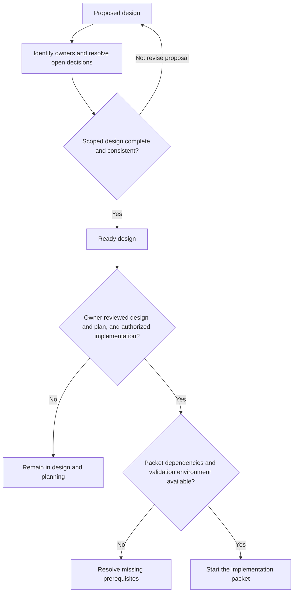
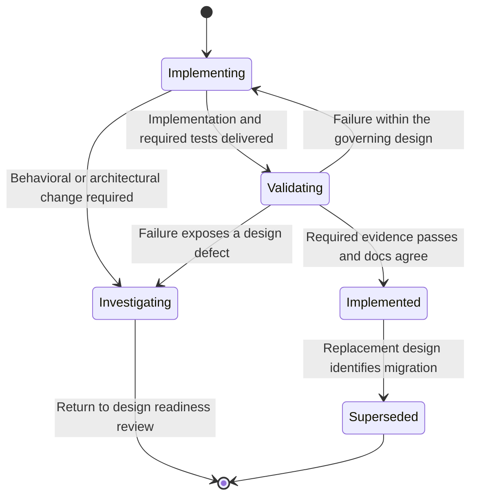

# Design before code

Never write code without a design. The architecture baseline establishes project
direction; a scoped design makes a change concrete enough to implement and test.
This rule covers production code, test code, scaffolding, build scripts, and spikes.

Current production phase: design and implementation planning. The owner authorized
the [isolated TUI experiment](plans/tui-prototype-implementation.md) on 2026-09-24
after its preflight; that authorization is limited to the packet's scope.
Repo owners must review the governing design and plan, then explicitly authorize
implementation before any product code, tests, scaffolding or build scripts are
written. A ready design, ADR or packet alone does not open that gate.

## Workflow

1. Read the architecture, engineering standards, relevant designs, and existing
   contracts. Identify conflicts and stop for the user if instructions disagree.
2. Identify the existing owner of each affected capability. For a new capability,
   assign its ownership and explain how it fits the dependency structure.
3. Write or update the scoped design. Resolve the decisions needed to implement
   that scope; record remaining unrelated questions explicitly.
4. Check the design against architecture, security, UX, observability, and testing
   requirements. Only then write the code it governs.
5. Validate the implementation, update documentation, and report evidence against
   the design's acceptance criteria. Revise the design first if implementation
   reveals a necessary behavioral or architectural change.

Design work can use read-only investigation of existing code, installed APIs,
documentation, and runtime capabilities. An executable experiment needs a design
stating its question, boundaries, and validation before its code is written.

## Required design contents

Follow the [writing standard](writing-standard.md). Use the [glossary](glossary.md)
for project terms. Label required behavior, proposed mechanisms and open decisions
separately when they occur in one document.

Keep designs proportionate to the change. A small correction may update an
existing design; a substantial feature needs its own document under `docs/designs/`.
Every governing design must address:

- **Status and scope:** proposed, ready for implementation, implemented, or
  superseded; objectives, non-goals, and dependencies.
- **User behavior:** workflows and observable acceptance criteria.
- **Ownership:** component responsibilities, existing functionality reused, and
  dependency direction.
- **Contracts:** inputs, outputs, errors, state transitions, compatibility, and
  concurrency semantics.
- **Failure and recovery:** relevant deadlines, cancellation, retries,
  idempotency, persistence, restart, and partial outcomes.
- **Security:** authority, data handling, trust boundaries, enforcement, and
  threat assumptions.
- **Operations:** configuration, resource bounds, telemetry, audit, and
  performance objectives.
- **Validation:** mapping from requirements and behaviors to unit, integration,
  and end-to-end cases, plus relevant model, security, performance, and usability
  evidence; name the required environments and acceptance criteria.
- **Decisions:** selected approach, consequential alternatives and tradeoffs,
  unresolved questions, and rollout or migration implications where relevant.

Mark an inapplicable concern explicitly with a reason. An unresolved decision
affecting the scoped behavior prevents that design being ready for implementation.

Record significant cross-cutting or hard-to-reverse choices under
`docs/decisions/`. Decision records explain rationale and link to the canonical
design; avoid copying specifications into multiple documents.

## Mermaid diagram requirements

Architecture, design documents, software plans, and specifications must contain
detailed Mermaid diagrams that implementation agents can follow. Store the
editable source in fenced `mermaid` blocks beside the governing prose. Diagrams
are part of the specification and must be updated with the behavior they describe.

| Document concern | Required diagram content |
| --- | --- |
| Architecture and ownership | Components, responsibility boundaries, dependencies, data/control flows, external systems, and trust/process boundaries where selected |
| API and cross-component interaction | Sequence diagrams naming callers and owners, request/result identity, authorization, persistence points, asynchronous events, and failure/timeout paths |
| Stateful behavior | State diagrams with triggering events, guards, terminal outcomes, interruption and recovery; distinguish a requested control action from its completed effect |
| Data and context | Entity/relationship or class diagrams, identities, cardinalities, versions and provenance; separate logical contracts from physical storage choices |
| Algorithms and decisions | Flowcharts showing inputs, decision conditions, bounded repetition, rejection, fallback and termination |
| Delivery plans | Dependency graphs, prerequisites, readiness gates, deliverables, and validation before completion |

Use the views relevant to the scope; record a reason when a view is inapplicable.
A high-level component picture alone is insufficient for an implementation-ready
stateful or distributed design. Link to an existing canonical diagram rather than
copying it into every document.

Each diagram needs a stable heading, a status (requirement, proposal, or selected
design), and a short explanation of its scope and arrow semantics. Use the same
component names, state names, IDs and stage IDs as the prose and tables. Label
requests, events, guards and dependency edges. Avoid relying on color for meaning.
Split large views at meaningful boundaries to keep labels readable.

Detailed designs must map important branches, transitions and invariants to
acceptance criteria and unit, integration, and end-to-end tests. Missing failure
branches are design gaps. Diagrams must not invent selected transports, database
engines, OS mechanisms, atomicity guarantees, or timing thresholds.

### Design readiness lifecycle

Required process. The first view shows the conditions for starting implementation.
Arrows name the review result. “Ready” means the scoped design is complete; the
owner must still review both the design and implementation plan and authorize work.

### Implementation and revision

Required process after the approval conditions above are met. Arrows show progress
or the kind of correction needed. A return to design must use the readiness and
approval conditions again before implementation resumes.

### Diagram validation

Before delivery, render every changed Mermaid block and check the output for
syntax errors, missing labels, clipped content, and unreadable layout. Check
state transitions and dependency edges against the governing prose as well as
rendering them. Report the renderer/version and any verification limits.

Inspect each diagram at normal document width. If labels require repeated zooming,
split the diagram into an overview and linked detail views. Keep all required
transitions and guards in the combined views.

For documentation work, an available local Mermaid CLI may read Markdown files
and render all their diagrams into an isolated temporary directory. Inputs are
the documents; outputs are disposable SVG/PNG previews and CLI diagnostics.
Do not overwrite Markdown sources, install project dependencies, or upload project
documents to a remote rendering service for this check. Renderer failures must
be corrected or reported; rendering alone does not validate architectural semantics.

## Initial state

Swift and Rust are selected. The initial baseline had no implementation-ready
scoped design or validation toolchain. The isolated experiment now defines its own
scoped checks; production toolchains and contracts remain open. Follow the
[architecture and design plan](plans/architecture-and-design.md)
to establish the initial workflows and governing contracts, then the
[implementation plan](plans/implementation.md). The core harness brief is a
design input, not permission to begin its implementation.
