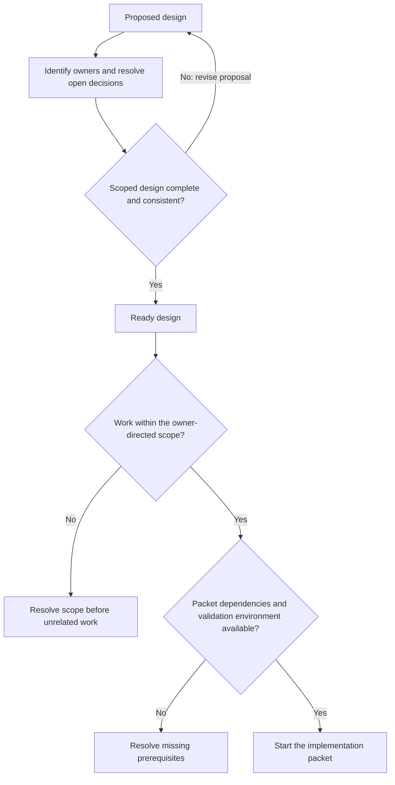
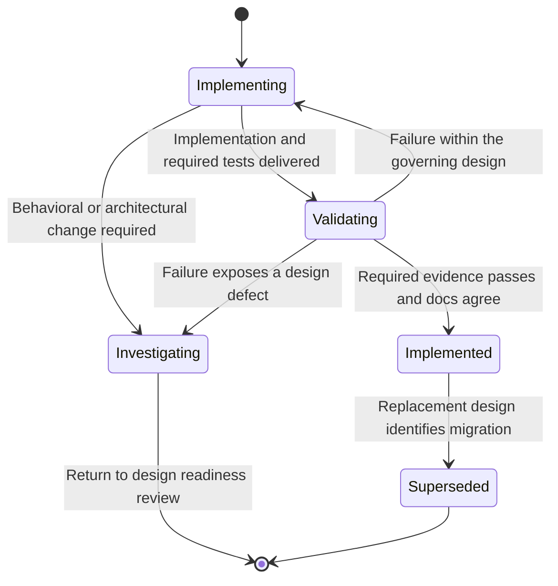

# Design before code

Never write code without a design. The architecture baseline establishes project
direction; a scoped design makes a change concrete enough to implement and test.
This rule covers production code, test code, scaffolding, build scripts, and spikes.

Current production phase: the owner's latest instruction makes Asura
implementation approval implicit and selects service-first delivery. Proceed
under a sufficient governing design without repeatedly requesting implementation
approval. Resolve actual design gaps before their code; an existing ready contract
is sufficient to continue the authorized task.

The [foundation packet](plans/production-foundation-implementation.md) starts the
real manual service checkpoint with standard Cargo, installed tools, verified
pinned protoc and locked prost generation. Complete PB0 cache publication, Swift
smoke, portable-cache proof and custom-driver extension are deferred qualification,
not prerequisites for that checkpoint. The
[bootstrap packet](plans/protobuf-bootstrap-implementation.md) retains that work.
Manual-preview evidence remains distinct from full host and release qualification.
The earlier isolated TUI experiment remains a separately scoped synthetic artifact.

## Workflow

1. Read the architecture, engineering standards, relevant designs, and existing
   contracts. Resolve discrepancies under the iteration and escalation rules below.
2. Identify the existing owner of each affected capability. For a new capability,
   assign its ownership and explain how it fits the dependency structure.
3. Write or update the scoped design. Resolve the decisions needed to implement
   that scope; record remaining unrelated questions explicitly.
4. Check the design against architecture, security, UX, observability, and testing
   requirements. Only then write the code it governs.
5. Validate the implementation, update documentation, and report evidence against
   the design's acceptance criteria. Revise the design first if implementation
   reveals a necessary behavioral or architectural change.

Design work can use read-only investigation of existing code, installed APIs,
documentation, and runtime capabilities. An executable experiment needs a design
stating its question, boundaries, and validation before its code is written.

## Iteration and escalation

Status: required workflow under the owner's authorization for iterative development.
Implementation authorization covers the design refinements, fixes and tests needed
to deliver the requested feature. Do not request approval again for each packet,
internal interface change or correction within that scope.

Update the governing design before changing behavior in code. Keep the update
proportionate to the change. Resolve scoped decisions through engineering judgment
when user requirements and existing authority provide enough direction. Review the
result against ownership, async execution, failure handling and required tests.
Use independent review when the risk warrants it; routine revisions do not require
an owner review meeting or another approval prompt.

Report instruction discrepancies promptly. An explicit user correction or authorized
rule change resolves the corresponding conflict; record it and continue. If the
instructions remain incompatible, stop the affected work and ask for a decision.
Continue independent authorized work while waiting.

Ask before a material product or authority decision that the available instructions
do not settle, or an irreversible action outside existing authorization. State the
specific missing decision and its consequence. Difficulty, an ordinary design
revision or a recoverable test failure does not itself require user approval.

Preserve design and code quality during iteration. Required security boundaries,
resource limits, recovery behavior and meaningful validation remain mandatory.
Report incomplete evidence explicitly. A manual testing checkpoint may precede full
qualification when its scope and remaining gaps are clear; it is not proof of release
readiness. Do not weaken tests or acceptance criteria merely to obtain a pass.

## Required design contents

Follow the [writing standard](writing-standard.md). Use the [glossary](glossary.md)
for project terms. Label required behavior, proposed mechanisms and open decisions
separately when they occur in one document.

Keep designs proportionate to the change. A small correction may update an
existing design; a substantial feature needs its own document under `docs/designs/`.
Every governing design must address:

- **Status and scope:** proposed, ready for implementation, implemented, or
  superseded; objectives, non-goals, and dependencies.
- **User behavior:** workflows and observable acceptance criteria.
- **Ownership:** component responsibilities, existing functionality reused, and
  dependency direction.
- **Contracts:** inputs, outputs, errors, state transitions, compatibility, and
  concurrency semantics.
- **Failure and recovery:** relevant deadlines, cancellation, retries,
  idempotency, persistence, restart, and partial outcomes.
- **Security:** authority, data handling, trust boundaries, enforcement, and
  threat assumptions.
- **Operations:** configuration, resource bounds, telemetry, audit, and
  performance objectives.
- **Asynchronous execution:** map the change to [AE-01–AE-07](engineering.md#asynchronous-execution-and-recovery).
  Name blocking APIs, isolation owners, numeric work/queue/concurrency limits,
  deadline and cancellation behavior, and startup/shutdown settlement.
  Define overload, stalled-dependency and recovery acceptance cases before coding.
- **Validation:** mapping from requirements and behaviors to unit, integration,
  and end-to-end cases, plus relevant model, security, performance, and usability
  evidence; name the required environments and acceptance criteria.
- **Decisions:** selected approach, consequential alternatives and tradeoffs,
  unresolved questions, and rollout or migration implications where relevant.

Mark an inapplicable concern explicitly with a reason. An unresolved decision
affecting the scoped behavior prevents that design being ready for implementation.

Record significant cross-cutting or hard-to-reverse choices under
`docs/decisions/`. Decision records explain rationale and link to the canonical
design; avoid copying specifications into multiple documents.

## Mermaid diagram requirements

Architecture, design documents, software plans, and specifications must contain
detailed Mermaid diagrams that implementation agents can follow. Store the
editable source in fenced `mermaid` blocks beside the governing prose. Diagrams
are part of the specification and must be updated with the behavior they describe.

| Document concern | Required diagram content |
| --- | --- |
| Architecture and ownership | Components, responsibility boundaries, dependencies, data/control flows, external systems, and trust/process boundaries where selected |
| API and cross-component interaction | Sequence diagrams naming callers and owners, request/result identity, authorization, persistence points, asynchronous events, and failure/timeout paths |
| Stateful behavior | State diagrams with triggering events, guards, terminal outcomes, interruption and recovery; distinguish a requested control action from its completed effect |
| Data and context | Entity/relationship or class diagrams, identities, cardinalities, versions and provenance; separate logical contracts from physical storage choices |
| Algorithms and decisions | Flowcharts showing inputs, decision conditions, bounded repetition, rejection, fallback and termination |
| Delivery plans | Dependency graphs, prerequisites, readiness gates, deliverables, and validation before completion |

Use the views relevant to the scope; record a reason when a view is inapplicable.
A high-level component picture alone is insufficient for an implementation-ready
stateful or distributed design. Link to an existing canonical diagram rather than
copying it into every document.

Each diagram needs a stable heading, a status (requirement, proposal, or selected
design), and a short explanation of its scope and arrow semantics. Use the same
component names, state names, IDs and stage IDs as the prose and tables. Label
requests, events, guards and dependency edges. Avoid relying on color for meaning.
Split large views at meaningful boundaries to keep labels readable.

Detailed designs must map important branches, transitions and invariants to
acceptance criteria and unit, integration, and end-to-end tests. Missing failure
branches are design gaps. Diagrams must not invent selected transports, database
engines, OS mechanisms, atomicity guarantees, or timing thresholds.

### Design readiness lifecycle

Required process. The first view shows the conditions for starting implementation.
Arrows name the review result. “Ready” means the scoped design is complete; the
current owner instruction supplies implementation authorization; scoped design
review and validation requirements still apply.

```mermaid
flowchart TD
    Proposed["Proposed design"] --> Investigating["Identify owners and resolve open decisions"]
    Investigating --> Check{"Scoped design complete and consistent?"}
    Check -->|No: revise proposal| Proposed
    Check -->|Yes| Ready["Ready design"]
    Ready --> Review{"Work within the owner-directed scope?"}
    Review -->|No| Hold["Resolve scope before unrelated work"]
    Review -->|Yes| Prereq{"Packet dependencies and validation environment available?"}
    Prereq -->|No| Wait["Resolve missing prerequisites"]
    Prereq -->|Yes| Implementing["Start the implementation packet"]
```

### Implementation and revision

Required process under the scoped design and current owner instruction. Arrows show progress
or the kind of correction needed. Review the revised design for readiness before
implementation resumes. Existing authorization continues within the requested scope.

```mermaid
stateDiagram-v2
    [*] --> Implementing
    Implementing --> Investigating: Behavioral or architectural change required
    Implementing --> Validating: Implementation and required tests delivered
    Validating --> Implementing: Failure within the governing design
    Validating --> Investigating: Failure exposes a design defect
    Investigating --> [*]: Return to design readiness review
    Validating --> Implemented: Required evidence passes and docs agree
    Implemented --> Superseded: Replacement design identifies migration
    Superseded --> [*]
```

### Diagram validation

Before delivery, render every changed Mermaid block and check the output for
syntax errors, missing labels, clipped content, and unreadable layout. Check
state transitions and dependency edges against the governing prose as well as
rendering them. Report the renderer/version and any verification limits.

Inspect each diagram at normal document width. If labels require repeated zooming,
split the diagram into an overview and linked detail views. Keep all required
transitions and guards in the combined views.

For documentation work, an available local Mermaid CLI may read Markdown files
and render all their diagrams into an isolated temporary directory. Inputs are
the documents; outputs are disposable SVG/PNG previews and CLI diagnostics.
Do not overwrite Markdown sources, install project dependencies, or upload project
documents to a remote rendering service for this check. Renderer failures must
be corrected or reported; rendering alone does not validate architectural semantics.

## Initial baseline and current implementation

Swift and Rust are selected. The initial baseline had no implementation-ready
scoped design or validation toolchain. Production now includes the local service,
TUI, storage, model channel and selected providers. Their
[component designs](designs/README.md) define the delivered scope and validation
limits. The isolated experiment retains its own scoped checks.

Use the [architecture and design plan](plans/architecture-and-design.md) for
remaining design decisions and the [implementation plan](plans/implementation.md)
for delivery dependencies. The core harness brief remains design input; it does
not replace a scoped implementation design.

The service-first authorization update changes the readiness diagram wording.
Its current visual inspection is pending because the installed local Mermaid
browser launches stall. Record this gap separately; it does not reinstate a
repeated approval or bootstrap gate for the owner-directed implementation.
