# Production command flows

Status: implementation audit and required regression map, 2026-09-27.
These charts describe current production command paths. They do not prove that
all branches have passed runtime tests. The gaps below remain explicit.

The governing contracts are [the production TUI](early-production-status-slice.md),
[conversation admission](conversation-admission.md),
[configuration commands](config-commands.md), and
[service lifecycle](system-architecture.md). Those documents own behavior and
limits. This document maps the implementation to their branch coverage.

Scope includes every command accepted by `asura-cli`, all production slash
commands, normal conversation submission, first-project confirmation, and exit.
Synthetic experiment commands and proposed extension commands are outside scope.
Each arrow means the next action or a guarded result. Error terminals preserve
existing authority unless a chart explicitly describes a committed mutation.

## CF01: Process entry and command selection

Implemented routing. `app.rs` owns argument parsing and presentation. The CLI
setup commands attach to an existing service; only TUI startup and `service start`
can launch one. Internal startup flags require inherited private capabilities.

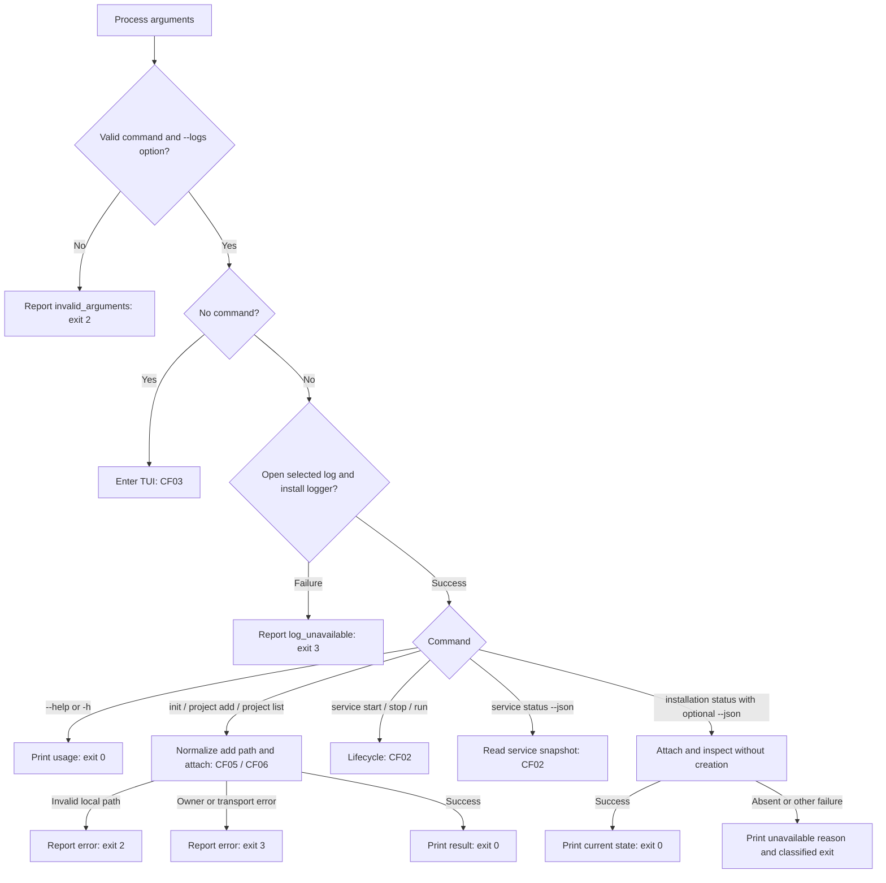
```mermaid
flowchart TD
    Args["Process arguments"] --> Parse{"Valid command and --logs option?"}
    Parse -->|No| Usage["Report invalid_arguments: exit 2"]
    Parse -->|Yes| Tui{"No command?"}
    Tui -->|Yes| UI["Enter TUI: CF03"]
    Tui -->|No| Log{"Open selected log and install logger?"}
    Log -->|Failure| LF["Report log_unavailable: exit 3"]
    Log -->|Success| Kind{"Command"}
    Kind -->|"--help or -h"| Help["Print usage: exit 0"]
    Kind -->|"init / project add / project list"| Setup["Normalize add path and attach: CF05 / CF06"]
    Setup -->|"Invalid local path"| Bad["Report error: exit 2"]
    Setup -->|"Owner or transport error"| SE["Report error: exit 3"]
    Setup -->|Success| OK["Print result: exit 0"]
    Kind -->|"service start / stop / run"| Life["Lifecycle: CF02"]
    Kind -->|"service status --json"| Status["Read service snapshot: CF02"]
    Kind -->|"installation status with optional --json"| Inspect["Attach and inspect without creation"]
    Inspect -->|Success| IS["Print current state: exit 0"]
    Inspect -->|"Absent or other failure"| IE["Print unavailable reason and classified exit"]
```

`--logs DIR` is rejected for the TUI, help, and private startup-notice mode.
Duplicate or missing log arguments are invalid. JSON status emits a failure object
when logging fails. Lifecycle classification returns 3 for unavailable, 4 for
incompatible, 5 for unsafe runtime, and 6 for an unconfirmed outcome. A successfully
read installation snapshot can report repair-required while the command exits 0.

## CF02: Service commands

Implemented lifecycle. `asura-client` owns launch and authenticated attachment;
`asura-service` owns drain. Absence is success for service status and stop.
Installation status instead reports absence with exit 3.

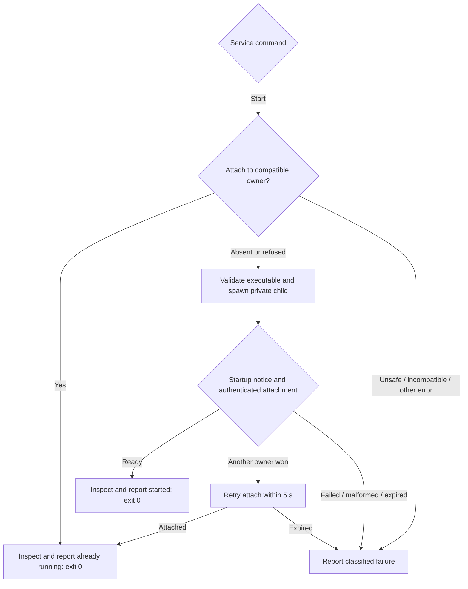
```mermaid
flowchart TD
    Command{"Service command"} -->|Start| Attach{"Attach to compatible owner?"}
    Attach -->|Yes| Existing["Inspect and report already running: exit 0"]
    Attach -->|"Absent or refused"| Spawn["Validate executable and spawn private child"]
    Attach -->|"Unsafe / incompatible / other error"| Failure["Report classified failure"]
    Spawn --> Notice{"Startup notice and authenticated attachment"}
    Notice -->|Ready| Started["Inspect and report started: exit 0"]
    Notice -->|"Another owner won"| Retry["Retry attach within 5 s"]
    Retry -->|Attached| Existing
    Retry -->|Expired| Failure
    Notice -->|"Failed / malformed / expired"| Failure
```

### CF02b: Inspect, stop and foreground run

Implemented lifecycle branches. Arrows select the command and its result.

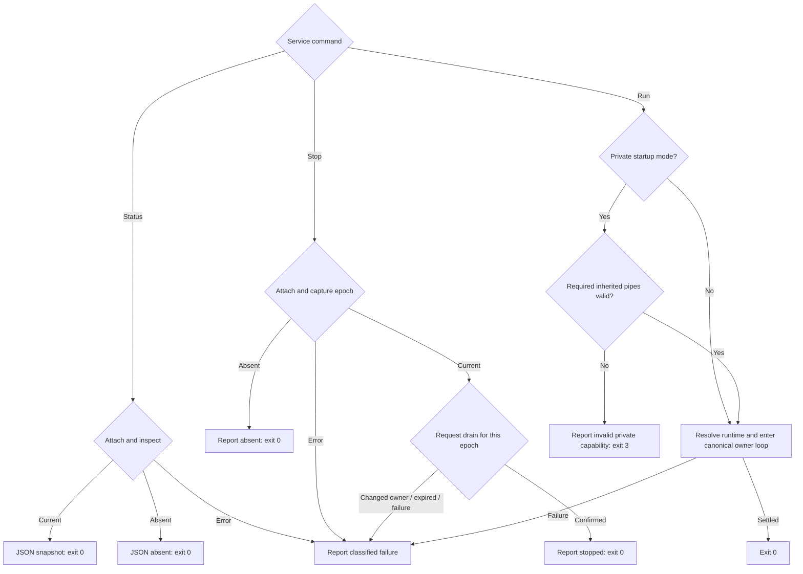
```mermaid
flowchart TD
    Command{"Service command"} -->|Status| Read{"Attach and inspect"}
    Read -->|Current| Snapshot["JSON snapshot: exit 0"]
    Read -->|Absent| Absent["JSON absent: exit 0"]
    Read -->|Error| Failure["Report classified failure"]
    Command -->|Stop| Target{"Attach and capture epoch"}
    Target -->|Absent| Gone["Report absent: exit 0"]
    Target -->|Error| Failure
    Target -->|Current| Drain{"Request drain for this epoch"}
    Drain -->|Confirmed| Stopped["Report stopped: exit 0"]
    Drain -->|"Changed owner / expired / failure"| Failure
    Command -->|Run| Mode{"Private startup mode?"}
    Mode -->|No| Owner
    Mode -->|Yes| Private{"Required inherited pipes valid?"}
    Private -->|No| Invalid["Report invalid private capability: exit 3"]
    Private -->|Yes| Owner["Resolve runtime and enter canonical owner loop"]
    Owner -->|Settled| Done["Exit 0"]
    Owner -->|Failure| Failure
```

Foreground `run` without internal flags needs no inherited pipes. Owner arbitration,
endpoint checks, socket deadlines, child reaping, and repair-only drain behavior
remain in the service contract. A deadline does not authorize killing a different
owner or replacing installation data.

## CF03: TUI startup and shutdown

Implemented lifecycle. Network and account lookup run in the status worker.
The render function consumes display state. Status results use a one-item mailbox.
The dispatcher checks bounded queues every 16 ms; this is not a push-only loop.

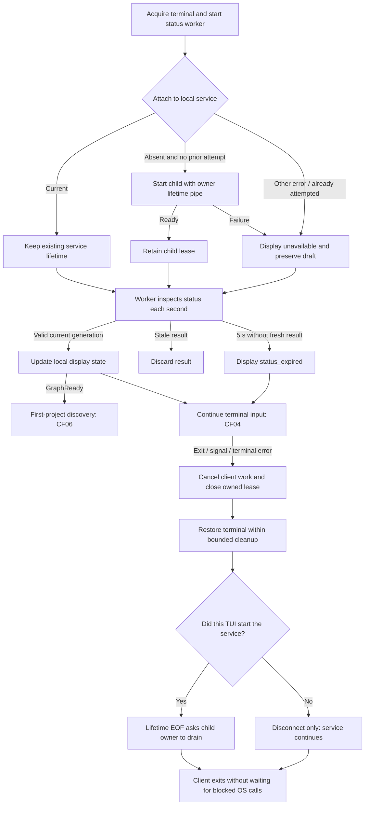
```mermaid
flowchart TD
    Begin["Acquire terminal and start status worker"] --> Attach{"Attach to local service"}
    Attach -->|Current| Independent["Keep existing service lifetime"]
    Attach -->|"Absent and no prior attempt"| Spawn["Start child with owner lifetime pipe"]
    Attach -->|"Other error / already attempted"| Unavailable["Display unavailable and preserve draft"]
    Spawn -->|Ready| Owned["Retain child lease"]
    Spawn -->|Failure| Unavailable
    Independent --> Inspect["Worker inspects status each second"]
    Owned --> Inspect
    Unavailable --> Inspect
    Inspect -->|"Valid current generation"| Display["Update local display state"]
    Inspect -->|"Stale result"| Ignore["Discard result"]
    Inspect -->|"5 s without fresh result"| Expired["Display status_expired"]
    Display -->|GraphReady| Discover["First-project discovery: CF06"]
    Display --> Input["Continue terminal input: CF04"]
    Expired --> Input
    Input -->|"Exit / signal / terminal error"| Cancel["Cancel client work and close owned lease"]
    Cancel --> Restore["Restore terminal within bounded cleanup"]
    Restore --> Own{"Did this TUI start the service?"}
    Own -->|Yes| Drain["Lifetime EOF asks child owner to drain"]
    Own -->|No| Leave["Disconnect only: service continues"]
    Drain --> End["Client exits without waiting for blocked OS calls"]
    Leave --> End
```

Connection loss does not authorize spawning a replacement after an initial attach
or launch attempt. The startup parameter for an explicit backend is not implemented
by the current argument parser. This chart records local-service behavior only.

## CF04: Slash-command dispatch and local commands

Implemented routing in `tui/ui.rs`. Local syntax errors retain the draft.
Commands that need the service enter workers through bounded request slots.

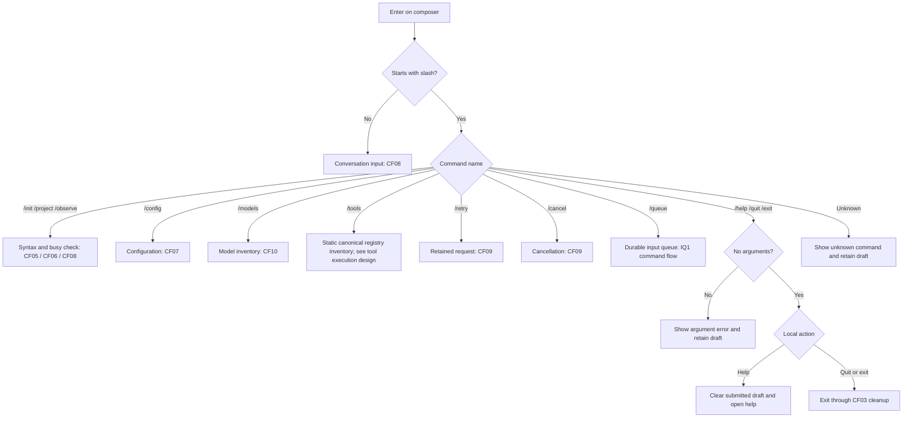
```mermaid
flowchart TD
    Enter["Enter on composer"] --> Slash{"Starts with slash?"}
    Slash -->|No| Chat["Conversation input: CF08"]
    Slash -->|Yes| Name{"Command name"}
    Name -->|"/init /project /observe"| Setup["Syntax and busy check: CF05 / CF06 / CF08"]
    Name -->|/config| Config["Configuration: CF07"]
    Name -->|/models| Models["Model inventory: CF10"]
    Name -->|/tools| Tools["Static canonical registry inventory; see tool execution design"]
    Name -->|/retry| Retry["Retained request: CF09"]
    Name -->|/cancel| Cancel["Cancellation: CF09"]
    Name -->|/queue| Queue["Durable input queue: IQ1 command flow"]
    Name -->|"/help /quit /exit"| Arity{"No arguments?"}
    Name -->|Unknown| Unknown["Show unknown command and retain draft"]
    Arity -->|No| Bad["Show argument error and retain draft"]
    Arity -->|Yes| Local{"Local action"}
    Local -->|Help| Help["Clear submitted draft and open help"]
    Local -->|"Quit or exit"| Exit["Exit through CF03 cleanup"]
```

### CF04b: Local command completion

Implemented completion. Arrows describe selection or cancellation; no service
request is sent by completion.

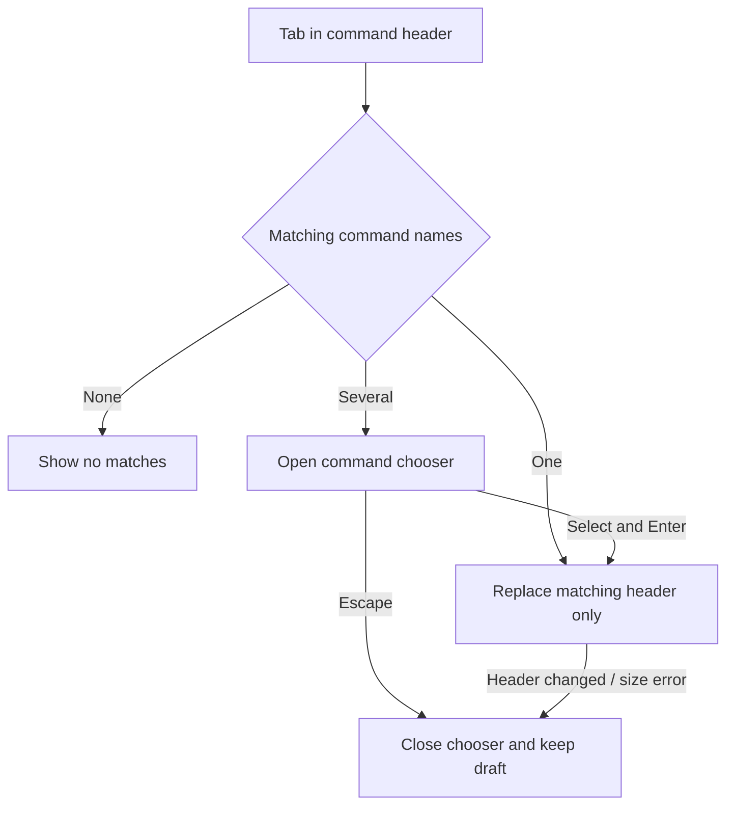
```mermaid
flowchart TD
    Tab["Tab in command header"] --> Matches{"Matching command names"}
    Matches -->|None| None["Show no matches"]
    Matches -->|One| Complete["Replace matching header only"]
    Matches -->|Several| Menu["Open command chooser"]
    Menu -->|Escape| Keep["Close chooser and keep draft"]
    Menu -->|"Select and Enter"| Complete
    Complete -->|"Header changed / size error"| Keep
```

F1 opens help. Escape closes help or a result panel. Result scrolling activates
only when content exceeds the visible box. Ctrl+Q/Ctrl+C exits with an empty draft;
a nonempty draft opens the discard confirmation. Ctrl+D exits only with an empty
draft. Slash `/quit` and `/exit` are explicit exit commands and need no discard
confirmation. Repeated action key events do not submit twice.

## CF05: Initialization and authority outcomes

Selected initialization semantics, mapped to the service and serialized writer.
Automatic fresh initialization follows the same owner operation. The TUI preserves
its request ID after a failure; `/retry` resends that request, not a new intent.

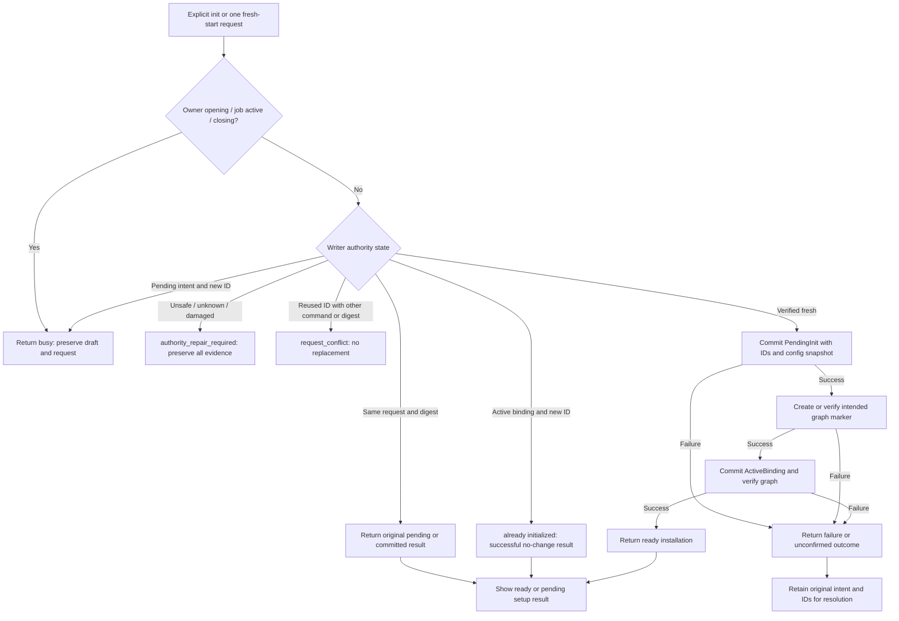
```mermaid
flowchart TD
    Init["Explicit init or one fresh-start request"] --> Busy{"Owner opening / job active / closing?"}
    Busy -->|Yes| Wait["Return busy: preserve draft and request"]
    Busy -->|No| State{"Writer authority state"}
    State -->|"Unsafe / unknown / damaged"| Repair["authority_repair_required: preserve all evidence"]
    State -->|"Same request and digest"| Replay["Return original pending or committed result"]
    State -->|"Reused ID with other command or digest"| Conflict["request_conflict: no replacement"]
    State -->|"Active binding and new ID"| Existing["already initialized: successful no-change result"]
    State -->|"Pending intent and new ID"| Wait
    State -->|"Verified fresh"| Intent["Commit PendingInit with IDs and config snapshot"]
    Intent -->|Success| Graph["Create or verify intended graph marker"]
    Graph -->|Success| Binding["Commit ActiveBinding and verify graph"]
    Binding -->|Success| Ready["Return ready installation"]
    Intent -->|Failure| Uncertain["Return failure or unconfirmed outcome"]
    Graph -->|Failure| Uncertain
    Binding -->|Failure| Uncertain
    Uncertain --> Keep["Retain original intent and IDs for resolution"]
    Replay --> Present["Show ready or pending setup result"]
    Existing --> Present
    Ready --> Present
```

The authority scanner treats a safe root `.DS_Store` as Finder metadata under the
[initialization contract](conversation-admission.md#automatic-initialization-and-explicit-registration-workflow).
It must reject unsafe metadata and other unknown names. A repair error is not
permission to remove the journal, database, or arbitrary files. The current UI
shows the safe error code but does not yet provide a repair workflow.

## CF06: Project discovery, registration, listing and selection

Implemented client decisions. Registration and object identity validation belong
to the service/platform owners. A selected ID is only a client preference until
the service validates it for conversation admission.

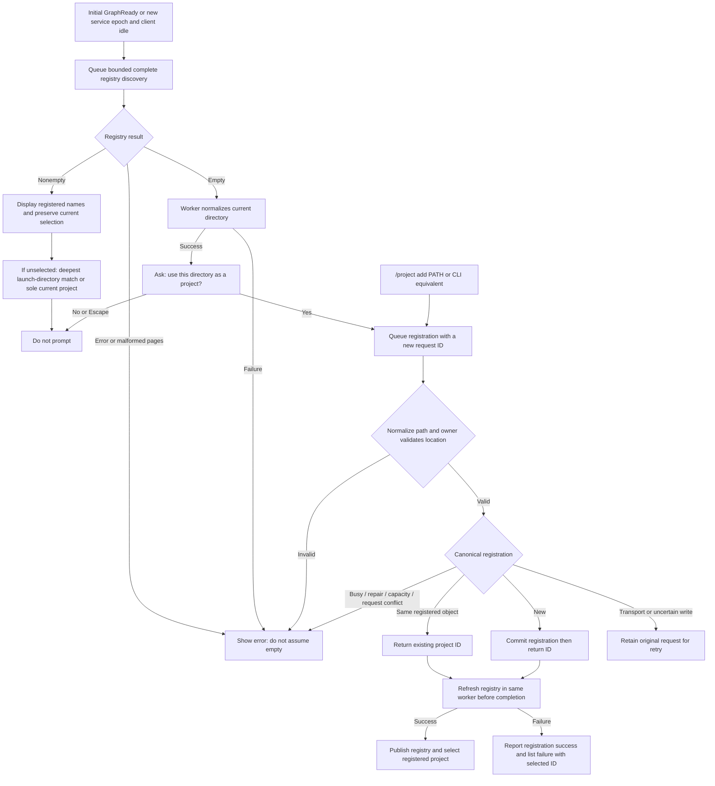
```mermaid
flowchart TD
    Ready["Initial GraphReady or new service epoch and client idle"] --> Discover["Queue bounded complete registry discovery"]
    Discover --> Registry{"Registry result"}
    Registry -->|"Error or malformed pages"| Error["Show error: do not assume empty"]
    Registry -->|Nonempty| Names["Display registered names and preserve current selection"]
    Names --> Match["If unselected: deepest launch-directory match or sole current project"]
    Match --> Keep["Do not prompt"]
    Registry -->|Empty| Cwd["Worker normalizes current directory"]
    Cwd -->|Failure| Error
    Cwd -->|Success| Offer["Ask: use this directory as a project?"]
    Offer -->|"No or Escape"| Keep
    Offer -->|Yes| Add["Queue registration with a new request ID"]
    Manual["/project add PATH or CLI equivalent"] --> Add
    Add --> Validate{"Normalize path and owner validates location"}
    Validate -->|Invalid| Error
    Validate -->|Valid| Commit{"Canonical registration"}
    Commit -->|"Same registered object"| Result["Return existing project ID"]
    Commit -->|New| New["Commit registration then return ID"]
    Commit -->|"Busy / repair / capacity / request conflict"| Error
    Commit -->|"Transport or uncertain write"| Retry["Retain original request for retry"]
    Result --> Refresh["Refresh registry in same worker before completion"]
    New --> Refresh
    Refresh -->|Success| Select["Publish registry and select registered project"]
    Refresh -->|Failure| Partial["Report registration success and list failure with selected ID"]
```

### CF06b: Project list and local selection

Implemented read and selection branches. Selection does not establish authority.

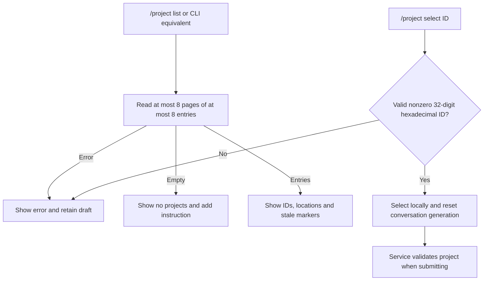
```mermaid
flowchart TD
    List["/project list or CLI equivalent"] --> Pages["Read at most 8 pages of at most 8 entries"]
    Pages -->|Error| Error["Show error and retain draft"]
    Pages -->|Empty| Empty["Show no projects and add instruction"]
    Pages -->|Entries| Rows["Show IDs, locations and stale markers"]
    Choose["/project select ID"] --> ID{"Valid nonzero 32-digit hexadecimal ID?"}
    ID -->|No| Error
    ID -->|Yes| Local["Select locally and reset conversation generation"]
    Local --> Later["Service validates project when submitting"]
```

A busy conversation slot rejects setup commands with the draft retained. Discovery
runs on readiness, new service epochs and successful registration. Failure does
not trigger automatic discovery retries. The creation offer appears at most once
per TUI session. Complete project lists update the same display registry.
Project confirmation preserves an existing composer draft. Successful setup clears
only the unchanged submitted command. Registry capacity is 64 projects; eight
pages cover that limit. No command initializes Git or modifies project contents.

## CF07: Configuration reads and writes

Implemented client and selected storage contract. The service owns configuration
admission; `asura-storage` owns YAML validation and atomic replacement.

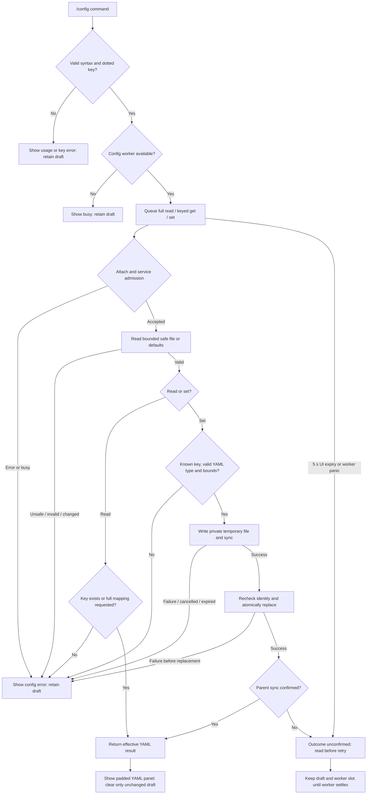
```mermaid
flowchart TD
    Command["/config command"] --> Parse{"Valid syntax and dotted key?"}
    Parse -->|No| Syntax["Show usage or key error: retain draft"]
    Parse -->|Yes| Slot{"Config worker available?"}
    Slot -->|No| Busy["Show busy: retain draft"]
    Slot -->|Yes| Request["Queue full read / keyed get / set"]
    Request --> Service{"Attach and service admission"}
    Service -->|"Error or busy"| Failure["Show config error: retain draft"]
    Service -->|Accepted| Read["Read bounded safe file or defaults"]
    Read -->|"Unsafe / invalid / changed"| Failure
    Read -->|Valid| Operation{"Read or set?"}
    Operation -->|Read| Key{"Key exists or full mapping requested?"}
    Key -->|No| Failure
    Key -->|Yes| Value["Return effective YAML result"]
    Operation -->|Set| Validate{"Known key, valid YAML type and bounds?"}
    Validate -->|No| Failure
    Validate -->|Yes| Write["Write private temporary file and sync"]
    Write -->|"Failure / cancelled / expired"| Failure
    Write -->|Success| Rename["Recheck identity and atomically replace"]
    Rename -->|"Failure before replacement"| Failure
    Rename -->|Success| Sync{"Parent sync confirmed?"}
    Sync -->|Yes| Value
    Sync -->|No| Unknown["Outcome unconfirmed: read before retry"]
    Request -->|"5 s UI expiry or worker panic"| Unknown
    Value --> Panel["Show padded YAML panel: clear only unchanged draft"]
    Unknown --> Retain["Keep draft and worker slot until worker settles"]
```

Read commands never write the file. The service serializes one configuration job and uses a two-second logical
deadline. Blocking OS work may outlast the deadline; it retains ownership until
settled. No automatic set retry occurs. A five-second client expiry does not prove
that the write stopped. `/config` reports effective persisted values, not model
or audit-consumer activation. Unsupported keys and an unset model are errors.

## CF08: Conversation submit and observation

Implemented request/observation pipeline with service-owned admission and durable
outcomes. The client has one conversation worker and one coalescing result mailbox.

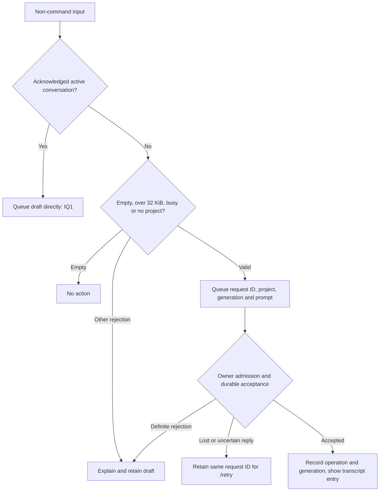
```mermaid
flowchart TD
    Text["Non-command input"] --> Active{"Acknowledged active conversation?"}
    Active -->|Yes| Choice["Queue draft directly: IQ1"]
    Active -->|No| Local{"Empty, over 32 KiB, busy or no project?"}
    Local -->|Empty| Ignore["No action"]
    Local -->|"Other rejection"| Keep["Explain and retain draft"]
    Local -->|Valid| Submit["Queue request ID, project, generation and prompt"]
    Submit --> Admit{"Owner admission and durable acceptance"}
    Admit -->|"Definite rejection"| Keep
    Admit -->|"Lost or uncertain reply"| Retry["Retain same request ID for /retry"]
    Admit -->|Accepted| Accept["Record operation and generation; show transcript entry"]
```

Observation is independent of submitting another input.

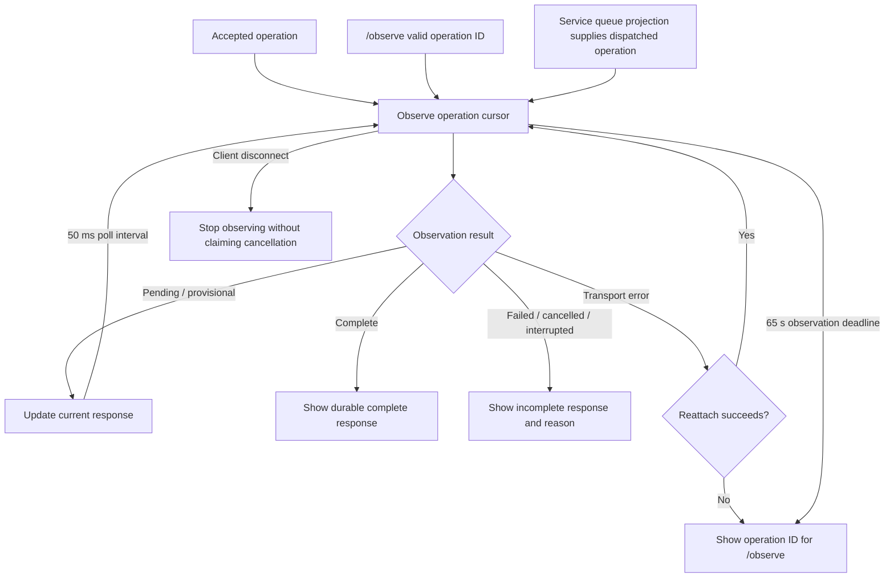
```mermaid
flowchart TD
    Accept["Accepted operation"] --> Observe["Observe operation cursor"]
    Explicit["/observe valid operation ID"] --> Observe
    Queued["Service queue projection supplies dispatched operation"] --> Observe
    Observe --> Result{"Observation result"}
    Result -->|"Pending / provisional"| Progress["Update current response"]
    Progress -->|"50 ms poll interval"| Observe
    Result -->|Complete| Complete["Show durable complete response"]
    Result -->|"Failed / cancelled / interrupted"| Incomplete["Show incomplete response and reason"]
    Result -->|"Transport error"| Attach{"Reattach succeeds?"}
    Attach -->|Yes| Observe
    Attach -->|No| Later["Show operation ID for /observe"]
    Observe -->|"65 s observation deadline"| Later
    Observe -->|"Client disconnect"| Stop["Stop observing without claiming cancellation"]
```

[IQ1](conversation-admission.md#durable-input-queue-iq1) supplies the full Queue,
Steer, list, inspect, resume and drop outcome flowcharts.
[IQ2](conversation-admission.md#existing-input-promotion-iq2) adds atomic Send now for an
existing input. [Composer interactions](composer-interactions.md) defines focus,
selectors, history and queue navigation. These commands use a
separate bounded client worker; they never make the TUI an execution scheduler.

Acceptance clears only an unchanged submitted draft. Admission errors do not
fabricate progress. Observe starts at cursor zero and adopts the owner's returned
generation. Terminal kinds are complete, failed, cancelled and interrupted.
The 65-second budget starts after attach/admission, not at queue admission; see G03.

## CF09: Retry and cancellation

Selected correction under the [client command contract](early-production-status-slice.md#first-conversation-client-integration).
`/retry` rejects extra arguments. `/cancel` requires an active Submit or Observe
request. Idle, setup and discovery preserve the draft and queue no cancellation.
The correction is implemented and 58 CLI unit tests pass. The full lifecycle
rerun remains integration evidence owned by the primary agent. The chart includes
these corrections; the audit findings distinguish fixed and remaining gaps.

A retry preserves identity. Client shutdown and user cancellation are different
operations. The chart below specifies the selected correction.

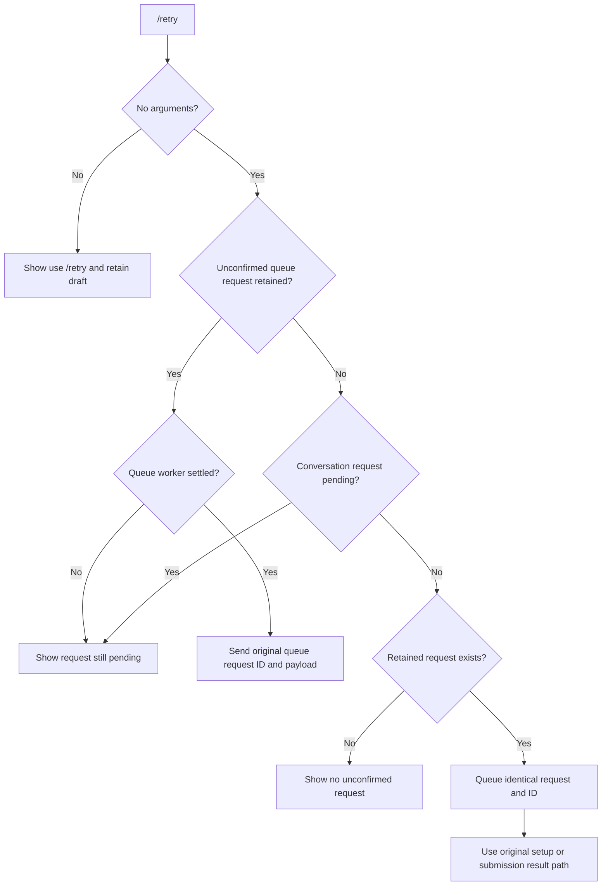
```mermaid
flowchart TD
    Retry["/retry"] --> RetryArity{"No arguments?"}
    RetryArity -->|No| RetryUsage["Show use /retry and retain draft"]
    RetryArity -->|Yes| QueueRetry{"Unconfirmed queue request retained?"}
    QueueRetry -->|Yes| QueueSlot{"Queue worker settled?"}
    QueueSlot -->|No| Wait
    QueueSlot -->|Yes| QueueSend["Send original queue request ID and payload"]
    QueueRetry -->|No| Busy{"Conversation request pending?"}
    Busy -->|Yes| Wait["Show request still pending"]
    Busy -->|No| Retained{"Retained request exists?"}
    Retained -->|No| None["Show no unconfirmed request"]
    Retained -->|Yes| Send["Queue identical request and ID"]
    Send --> Result["Use original setup or submission result path"]
```

Cancellation targets the observed operation, including a service-dispatched input.

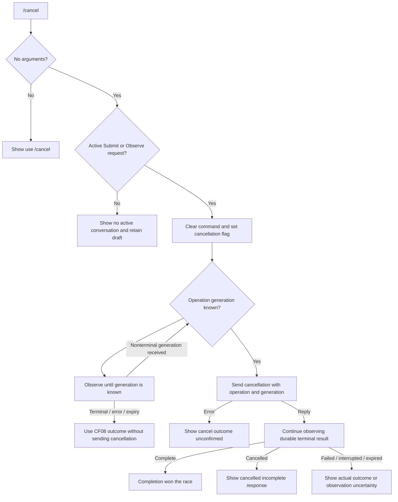
```mermaid
flowchart TD
    Cancel["/cancel"] --> Arity{"No arguments?"}
    Arity -->|No| Usage["Show use /cancel"]
    Arity -->|Yes| Job{"Active Submit or Observe request?"}
    Job -->|No| Gap["Show no active conversation and retain draft"]
    Job -->|Yes| Flag["Clear command and set cancellation flag"]
    Flag --> Generation{"Operation generation known?"}
    Generation -->|No| Observe["Observe until generation is known"]
    Observe -->|"Nonterminal generation received"| Generation
    Observe -->|"Terminal / error / expiry"| Before["Use CF08 outcome without sending cancellation"]
    Generation -->|Yes| Owner["Send cancellation with operation and generation"]
    Owner -->|Error| Unknown["Show cancel outcome unconfirmed"]
    Owner -->|Reply| ObserveResult["Continue observing durable terminal result"]
    ObserveResult -->|Complete| Won["Completion won the race"]
    ObserveResult -->|Cancelled| Stopped["Show cancelled incomplete response"]
    ObserveResult -->|"Failed / interrupted / expired"| Other["Show actual outcome or observation uncertainty"]
```

The selected correction prevents cancellation flags during setup or discovery.
Setup and configuration do not acquire conversation-cancellation semantics from
the command. G01 and G02 record the inspected behavior before this correction.

## Branch validation and remaining gaps

Required behavior: each command change must update its chart before code changes.
Review every decision edge against an observable unit, integration and terminal
case. A rendered chart is review evidence, not executable proof.

| Branch family | Existing test owner and evidence to inspect | Remaining qualification |
| --- | --- | --- |
| CF01–CF02 arguments and lifecycle | `asura-cli/src/app/tests.rs`, `tests/arguments.rs`, `tests/lifecycle.rs` | Keep exit codes, no-create inspection, changed-owner and unconfirmed-stop cases explicit. |
| CF03 ownership and input | `tui/observation.rs` tests and `tests/tui_pty.py` default journey | Native blocked account/filesystem calls remain distinct from socket-stall evidence. |
| CF04 command syntax and completion | `tui/ui.rs`, `tui/editor.rs` tests and terminal command journey | G01 and G02 unit and terminal regressions passed on 2026-09-27. |
| CF05 init and repair | storage writer tests, service `tests/conversation_flow.rs`, terminal `--setup` journey | Metadata-triggered repair regression must pass through scanner, real service and terminal, preserving bytes. |
| CF06 projects and confirmation | `tui/ui.rs`, service conversation journey and terminal setup journey | Discovery failure must never be treated as an empty registry. |
| CF07 YAML and uncertainty | configuration storage/service tests and terminal config journey | Mock failures alone do not prove post-rename disk-error handling. |
| CF08–CF09 acceptance, replay and cancel | service conversation journey, native model journey and client unit tests | Add full-admission deadline coverage and no-operation cancellation feedback. |

Audit findings and correction status:

- **G01 — Retry arity, fixed:** extra arguments are now rejected with usage.
  The draft and retained request remain unchanged. Unit regression passes.
- **G02 — Cancellation feedback, fixed:** idle, setup and discovery now report
  no active conversation without clearing the draft or queuing cancellation.
  Submit and Observe retain their cancellation path. Unit regression passes.
  The full CLI lifecycle gate, including both mandatory terminal journeys, passed.
- **G03 — Whole-request deadline:** the conversation worker's 65-second observation
  budget excludes resolution, setup and admission. Socket bounds do not bound a
  stalled OS lookup. Add admission-time expiry and retained uncertainty without
  releasing an occupied worker slot or duplicating effects.
- **G04 — Explicit backend selection:** the current CLI parser has no backend
  parameter. The user's broader startup rule remains incomplete for that branch.
- **G05 — Repair guidance:** `authority_repair_required` is displayed without an
  actionable diagnostic. Preserve data and expose the classified inspection reason;
  do not turn `/init` into destructive repair.

The same command files can change during integration. Recheck these findings
against the final diff and move fixed findings into recorded evidence. No build,
unit, service or terminal test execution is claimed by this documentation audit.

## Diagram verification

The installed local Mermaid CLI 12.0.0 rendered all charts on 2026-09-27.
Visual review checked branch labels, clipping and layout. Dense lifecycle,
completion and project charts were split into separate views before final review.
Previews are disposable local artifacts. No runtime correctness claim follows
from this rendering check.

## CF10: Model inventory

Selected command path under [MP3](model-provider-integration.md#mp3-model-inventory-command).
The client has one inventory worker slot. Attachment has a two-second deadline;
the typed inventory request has thirty seconds. The UI deadline is thirty-five seconds.
Only this worker accesses the socket. Cancellation shuts down a cloned socket
handle and sets a cancellation flag. The worker checks cancellation before and
after attachment. A timed-out slot stays occupied until its thread settles.
Late results are discarded. Exit restores the terminal before bounded worker
settlement. No renderer or input handler performs discovery or transport I/O.

The table marks the configured selector with `*`. It shows Model, Provider and
Status columns, with bounded details and provider issues below. Rows wrap at the
current pane width. The padded panel is bottom-aligned and scrolls only on
overflow. A successful result clears only the unchanged submitted draft. Errors
retain the draft, and a result waits for an already open panel to close.

The arrows show guarded input dispatch and asynchronous completion.

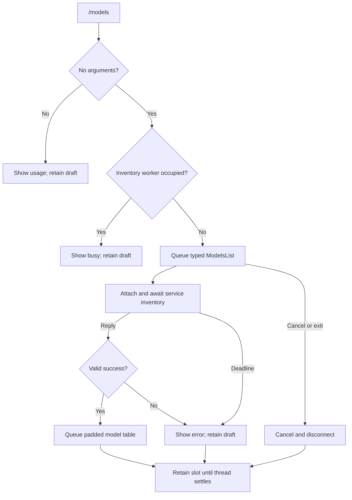
```mermaid
flowchart TD
    Input["/models"] --> Arity{"No arguments?"}
    Arity -->|No| Usage["Show usage; retain draft"]
    Arity -->|Yes| Busy{"Inventory worker occupied?"}
    Busy -->|Yes| Retain["Show busy; retain draft"]
    Busy -->|No| Queue["Queue typed ModelsList"]
    Queue --> Worker["Attach and await service inventory"]
    Worker -->|Reply| Result{"Valid success?"}
    Result -->|Yes| Table["Queue padded model table"]
    Result -->|No| Error["Show error; retain draft"]
    Worker -->|Deadline| Error
    Queue -->|Cancel or exit| Cancel["Cancel and disconnect"]
    Cancel --> Settle["Retain slot until thread settles"]
    Error --> Settle
    Table --> Settle
```

Validation covers command arity and completion, row states and selection,
resize/scroll behavior, stale result suppression, preserved newer drafts,
repeated commands, and quit while discovery is pending. The terminal journey
uses the real service and verified inventory helper without inference.

The MP3 update rendered CF04 and CF10 with local Mermaid CLI 12.0.0. Both
previews were visually inspected for labels, clipping and branch consistency.
Behavioral validation remains pending the root-owned serial test gate.

## CF11: inspect sensor evidence

`asura sensors PROJECT_ID [OFFSET REVISION]` is a read-only control command.
PROJECT_ID is 32 hexadecimal digits and must be nonzero. With no cursor it reads
the first 16 committed observations and all bounded proposals. OFFSET (0–64)
and REVISION (unsigned 64-bit) resume the same snapshot. Invalid syntax exits 2;
attachment, loading, unavailable and stale-cursor errors exit 3. Success exits 0.
It attaches to an existing local service under the same two-second deadline as
other standalone inspection commands; it does not launch a service. The typed
query has a separate two-second deadline. There is no UI/render loop to block.

The output shows project/revision, pending persistence and intake/clock health,
a source/sequence/expiry table, and proposal purpose/state/held reason. If more
observations exist it prints the exact continuation command. A revision conflict
requires a fresh first page, never an automatic replay against a changed snapshot.
All values are service-owned typed metadata. This command starts no model or tool.
The [SN2 sensor contract](sensors.md#sn2-bounded-inspection-of-durable-sensor-evidence)
owns semantics and persistence. The CLI owns arguments and presentation only.

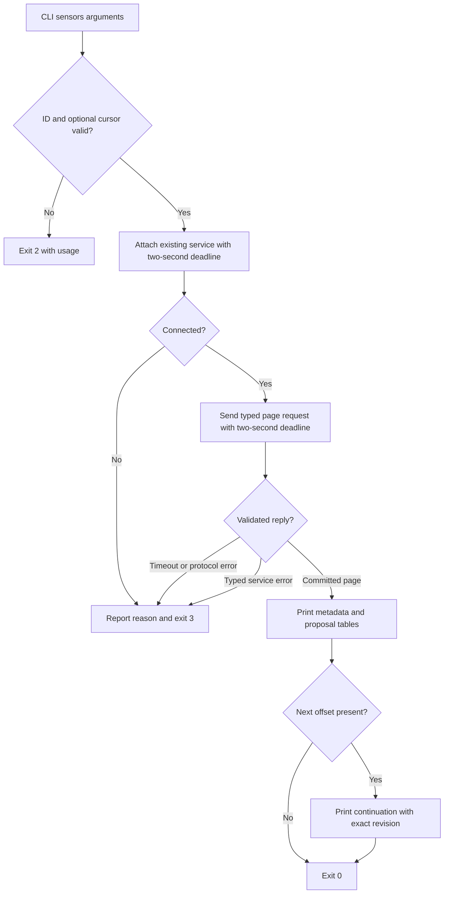
```mermaid
flowchart TD
    Start[CLI sensors arguments] --> Valid{ID and optional cursor valid?}
    Valid -->|No| Syntax[Exit 2 with usage]
    Valid -->|Yes| Attach[Attach existing service with two-second deadline]
    Attach --> Connected{Connected?}
    Connected -->|No| Failure[Report reason and exit 3]
    Connected -->|Yes| Query[Send typed page request with two-second deadline]
    Query --> Reply{Validated reply?}
    Reply -->|Timeout or protocol error| Failure
    Reply -->|Typed service error| Failure
    Reply -->|Committed page| Print[Print metadata and proposal tables]
    Print --> More{Next offset present?}
    More -->|Yes| Cursor[Print continuation with exact revision]
    More -->|No| Done[Exit 0]
    Cursor --> Done
```

Unit checks cover ID/cursor syntax and empty, pending and continuation output.
The real service client journey verifies persistence and restart under SN2.
The standalone command's process journey uses an isolated runtime and stops its
fixture service on every outcome. No user database or service is used for tests.

### Registered tool inventory

`/tools` has no arguments. The TUI reads immutable registry metadata from the
service crate and opens the existing padded result panel. It performs no I/O.
Invalid arguments retain the draft. Escape closes the panel; overflow enables
scrolling. The [inventory flow](model-tool-execution.md#tool-inventory-command-and-model-tool)
defines command branches, metadata ownership and model-tool behavior separately.

### Recent audit inspection (design only)

`/audit [limit]` is a selected review packet, not an implemented command. The
[recent audit contract](config-commands.md#recent-project-inspection-selected-review-packet)
owns its typed metadata, limits and read-only native tool. Limit defaults to 16
and accepts 1 through 16. This planned flow is explicitly outside the implemented
command inventory above.

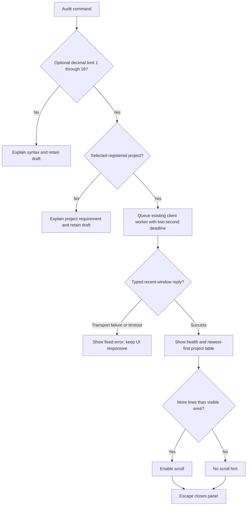
```mermaid
flowchart TD
    Input[Audit command] --> Syntax{Optional decimal limit 1 through 16?}
    Syntax -->|No| Invalid[Explain syntax and retain draft]
    Syntax -->|Yes| Project{Selected registered project?}
    Project -->|No| Missing[Explain project requirement and retain draft]
    Project -->|Yes| Read[Queue existing client worker with two-second deadline]
    Read --> Reply{Typed recent-window reply?}
    Reply -->|Transport failure or timeout| Failure[Show fixed error; keep UI responsive]
    Reply -->|Success| Panel[Show health and newest-first project table]
    Panel --> Size{More lines than visible area?}
    Size -->|Yes| Scroll[Enable scroll]
    Size -->|No| Static[No scroll hint]
    Scroll --> Escape[Escape closes panel]
    Static --> Escape
```

The command reads only the bounded committed-record projection. It does not read
files, browse archives, start inference or imply that an absent event never occurred.
Validation includes invalid limits, no project, two-project isolation, disabled and
stale health, empty windows, overflow scrolling, repeated use and owned-child cleanup.
