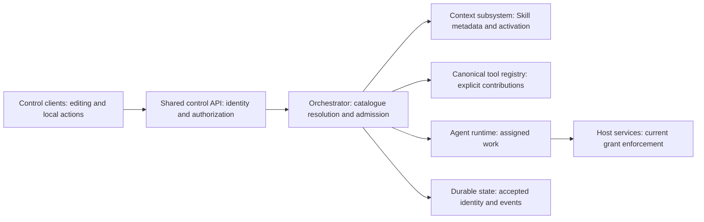
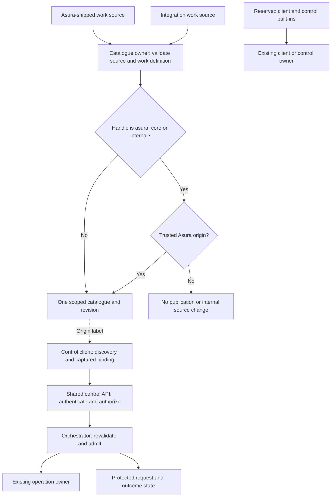
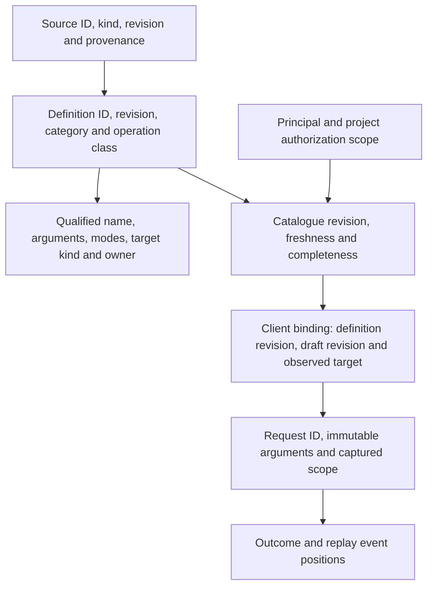
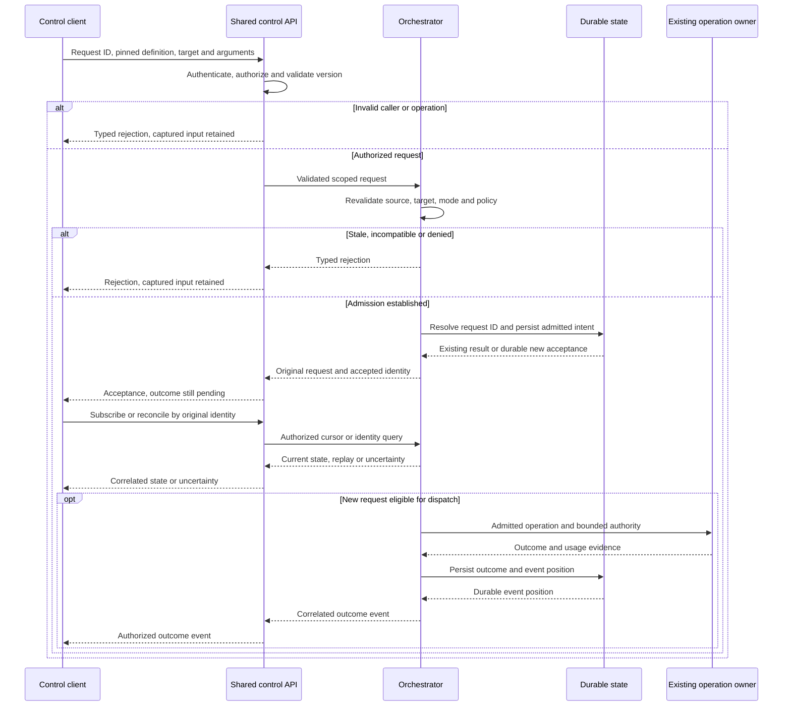
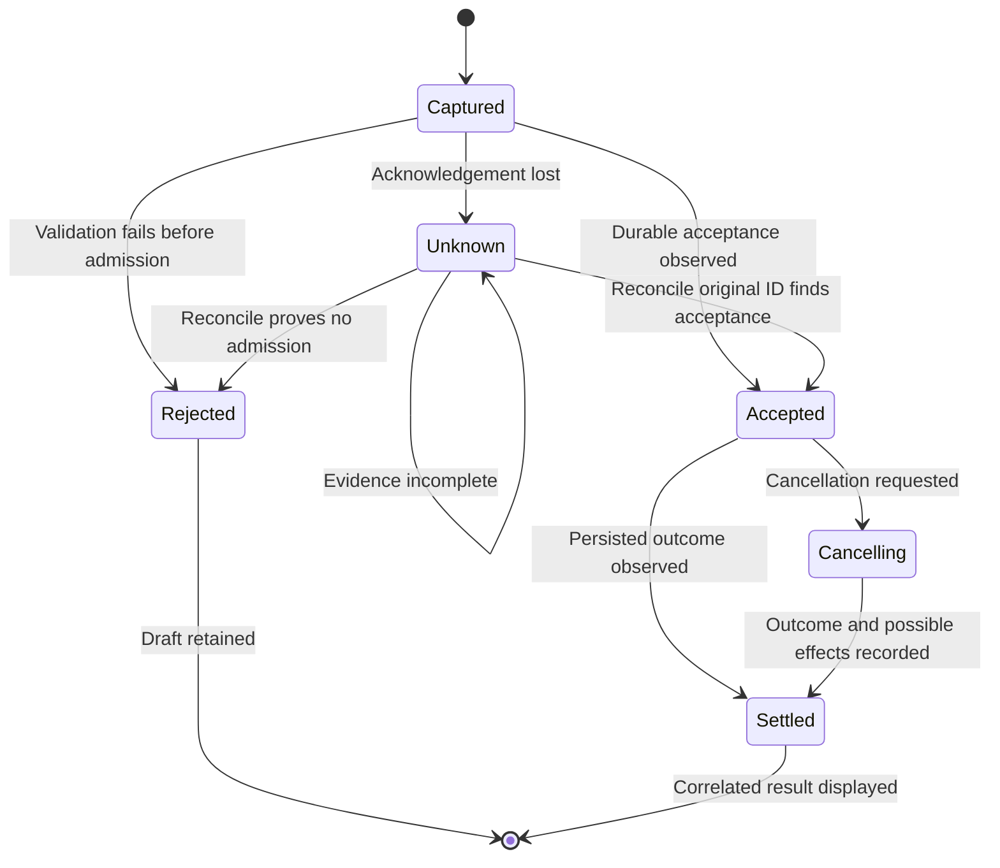

# In-chat command system

Status: **proposed production design**, prepared with the TUI interaction proposal
on 2026-09-24. The three categories and their authority boundaries are required.
The logical contracts below need D3, D4 and D6 decisions before production
implementation. This document authorizes no code, transport or storage schema.

The [interaction brief](interaction-and-extension-boundaries.md#in-chat-commands)
owns the category requirement. This design owns service command identity,
catalogue resolution and invocation semantics. The [TUI command design](tui-command-discovery.md)
owns editor, completion and terminal presentation. The
[architecture](../architecture.md#control-and-execution-boundaries) owns the
control API and task lifecycle boundaries. The existing
[asynchronous submission contract](../architecture.md#asynchronous-submission-and-reconnect)
owns acceptance ordering and replay.

## Scope and invariants

Built-ins are reserved commands supplied by Asura. Extensions are explicit
contributions from supported sources, including Asura-shipped feature modules.
Skill-based commands explicitly select an Agent Skill. An MCP tool,
resource or prompt does not become a command merely because it is discoverable.
Agent Plugins may later deliver contributions but are not required for extensions.

- Discovery is metadata presentation. It never starts a server, loads Skill
  instructions, reads project content, runs a model or admits work.
- A displayed name is not an authority token. Invocation binds an immutable
  definition revision, source identity, arguments and target scope.
- Client-local commands may change only presentation or the requesting client
  session. Service commands pass through the shared control API and their
  canonical operation owner.
- Unknown, ambiguous, stale, incompatible or denied commands fail explicitly.
  They never become chat text or another command by fallback.
- A project switch cannot retarget a captured command. A source update cannot
  replace the definition under a selected action.
- A missing acknowledgement is an unknown outcome. Reconcile by original request
  identity; do not blindly retry an effect or discard protected input.

## Owners and operation classes

This is a logical ownership view. Arrows mean the caller consumes the owner's
contract; they do not select a process, transport or package layout.

| Operation class | Permitted source | Owner of effect |
| --- | --- | --- |
| Client view | Asura built-in | Control client, with no service admission or task effect |
| Client session | Asura built-in | Control client, using its existing exit and protected-input flow; no service admission or task effect |
| Service control | Asura built-in | Existing control API and orchestrator control contract |
| Work request | Asura built-in or explicit extension | Orchestrator admission, then the existing operation owner |
| Skill activation and work request | Explicit Skill-based command | Context subsystem activation under admitted scope, then ordinary work and tool admission |

An extension cannot declare itself a service control or change its operation class
after admission. Skill activation selects instructions with provenance; it does
not run optional scripts or grant tool access. The context subsystem owns the
effective instruction manifest and invalidation. The canonical tool registry
owns tool-backed contribution definitions, not a second command executor.
Swift has no role in deterministic command resolution. A future model-assisted
interpretation must be separately admitted and cannot grant command authority.

### First-party extension boundary

**Selected design direction:** Asura may supply optional work functions through
the same extension contribution contract used by supported integrations. Prefer
this path for an additional work function unless it needs a reserved client or
service control contract. Built-in status is justified by that control need, not
by who ships the feature. `/quit`, its `/exit` alias, and `/help` remain client
built-ins.
Cancellation, recovery and authorization controls must remain available through
their canonical control owners when a contribution source is unavailable.

An Asura-supplied extension remains in the Extension category. Its source record
states that Asura supplies it, alongside source ID, revision and provenance.
Origin is display and audit data; it grants no permission, operation class,
budget or exemption from source revocation. The catalogue owner validates origin
against the registered source. A client-supplied label or source ID cannot assert
it. First-party and integration-supplied work definitions use the same validation,
publication, binding, admission, protected-request and outcome path. There is no
first-party executor, fallback built-in or privileged branch in the client.

This selected direction does not choose the production contribution source
format, loader, trust root, transport or installed-module lifecycle. D3/D4 must
settle those mechanisms before product code. The scoped TUI trial uses inert,
in-memory definitions only.

### Contribution and invocation ownership view

Selected logical boundary for first-party and integration-supplied work. Solid
arrows carry definitions or requests to the canonical owner; the dashed arrow
is presentation metadata, not an authority grant.

The shared control API checks the pinned source, definition, target, mode and
current authority even for an Asura-shipped source. A changed or revoked source
rejects before acceptance. If revocation follows acceptance, the owner blocks a
not-started effect and records an outcome under the original request ID. A source
restored at a new revision cannot revive an older capture. Both source kinds
follow the same rule.

### First selected built-in: quit

**Selected command names:** `/quit` is the primary built-in and `/exit` is its
alias. Both names resolve to one stable client-session definition identity.
Neither invokes the control API, stops a task, shuts down the per-user service or
changes another client's session. This command exits only the requesting client.
The TUI uses the same terminal cleanup and protected-input confirmation contract
as its existing Ctrl+Q action. A future GUI maps the client-session action to its
own close flow under D6; the service has no corresponding work command.

The command takes no argument body. Trailing whitespace alone is permitted;
other text is rejected with the draft unchanged. A completed `/ex` inserts
`/exit`, and `/qu` inserts `/quit`; both retain the same definition identity.
Discovery shows `/quit` and its `/exit` alias together, not two independent
effects. Built-in aliases cannot be overridden by extension or Skill entries.

### Second selected built-in: help

**Selected command name:** `/help` is one client-view definition with no alias.
It opens the requesting client's existing controls view, equivalent to F1 from
the editor. It does not call the service, read a project, load a Skill, admit
work or affect another client. It remains available while work is active, the
service is disconnected or contributed sources are unavailable. The client
accepts trailing whitespace but rejects non-whitespace arguments without
changing the draft. A successful invocation consumes only its current command
draft and leaves other drafts, pending requests and tasks untouched. Closing
the view returns to the empty editor. A client must route this action only for
the fixed `builtin:help` definition, not for a contributed operation-class
claim. D6 may refine the view content without changing command ownership.

## Catalogue and binding contract

These are logical records, not wire schemas or physical database tables. Identity
and revision edges mean that a later revision cannot inherit an earlier binding.

The service constructs a catalogue for an authorized principal and project scope.
Each entry identifies category, supplying source, stable definition identity,
revision, qualified name, operation class, target kind, argument contract,
supported modes, availability and a bounded help summary. Catalogue responses
declare revision, freshness and whether the result is complete. A partial or
failed refresh cannot establish that a name is absent or unique. Cached protected
metadata is removed when access is revoked and never crosses authorization scope.

The orchestrator owns service catalogue identity and resolution inside the
existing backend. Client-local built-ins are a fixed client catalogue in a reserved
namespace. The combined interface is a projection, not a second authority. D3
must define compatible contract versions so an incompatible service entry is
disabled while local help remains available.

**Selected extension prefix:** `/ext:source/name` is canonical. The earlier
`/extension:source/name` form is not an alias and cannot resolve a definition.
This name change does not change source IDs, definition IDs or admission authority.

**Required internal reservation:** The extension source handles `asura`, `core`
and `internal` belong exclusively to Asura. Thus `/ext:asura/name`,
`/ext:core/name` and `/ext:internal/name`, and their corresponding
`extension:asura`, `extension:core` and `extension:internal` source identities,
may be published only by a trusted Asura-supplied source. Reservation applies to
the source handle, not only to currently defined command names. These handles
remain reserved even when Asura publishes no commands under them.
The isolated first-party TUI trial uses `core` for its work command;
`asura` and `internal` remain reserved without trial definitions.

The catalogue owner must derive the source's Asura or integration origin from
trusted registration provenance. A contribution cannot set its own origin or
claim an internal handle through a display name, source ID, alias or revision.
The owner must reject an integration claim to a reserved handle before
publication. Rejection must not change the internal source's catalogue entry,
revision, availability or pending requests. Invocation still revalidates the
trusted source binding; an old or forged capture cannot bypass the reservation.
D3/D4 must select the concrete trust root and registration mechanism before
production implementation. This rule does not give Asura-supplied extensions
extra execution authority.

**Other naming proposed for review:** only built-ins have `/name` aliases. Explicit
extensions and Skills use qualified source/name forms. Two definitions may share
a friendly label; completion inserts an authoritative qualified name. A duplicate
identity or qualified name within one source revision invalidates that update.
Updates are published atomically by source revision. Invalid or oversized updates
disable that revision without leaving its old definitions executable. D3/D4 must
select stable source identities, handle allocation, revision persistence and
contribution validation before implementation.

Metadata is untrusted display data. Bound its size, strip terminal control
sequences and do not let bidi formatting obscure the authoritative ASCII name or
source. Descriptions contain no credentials or executable shell strings. Discovery
does not confer invocation permission; the API checks current authority again.

## Resolution, admission and outcomes

The API authenticates the caller and validates the requested operation. The
orchestrator resolves the pinned definition against current source, target,
arguments and mode, then performs canonical admission. A client-supplied category
or operation class is only an assertion to check. It cannot choose the executor.
The operation owner receives only an admitted request and bounded authority.

Arrows are requests, replies and persisted observations. Every client reply and
event crosses the shared API. The persistence edge precedes acceptance; D3 must
select and verify the concrete atomicity mechanism. The sequence does not imply
that acceptance proves execution.

Duplicate delivery uses the same request identity and returns the recorded
acceptance or outcome. A different payload under that identity is rejected.
Subscription and dispatch may race; D3's replay contract must close the gap
between the accepted identity and the first observed event.
Dispatch must revalidate live grants and source generation under D3/D4 fencing.
Revocation blocks new effects; effects already begun require reconciliation.
Cancellation records intent and possible effects, not a rollback promise.

An invocation captures principal, project, conversation, target and observed
revision, definition/source revisions, immutable arguments, requested mode and
request identity together. Navigation and a successor task cannot alter them.
The service rejects stale captures. Rejection leaves the editor draft and undo
history available for explicit correction. Delayed acceptance cannot clear newer
text. Results attach to the captured request, not the currently visible project.

## Failure and recovery

The state view follows one submitted service command. Labels describe evidence,
not guessed execution. D3 must supply durable protected-request and replay rules.

Connection loss makes service entries stale and non-invocable. The client removes
protected service metadata while offline because it cannot observe a new
revocation. A generic unavailable marker may remain for a focused entry. A missing or
incompatible contribution reports its reason. Refresh is a separate admitted
operation; opening discovery never starts all integration servers. A Skill source
failure cannot fall back to similarly named instructions from another scope.

## Validation and unresolved decisions

The [TUI plan](tui-command-discovery.md#acceptance-and-proof-plan) covers editor,
keyboard, layout and synthetic interaction. Production evidence requires real
client/API/orchestrator/store/context/tool/host boundaries. Every case below
needs unit, integration and end-to-end coverage under the
[engineering standard](../engineering.md#required-test-layers).

| Case | Initial state and trigger | Required result and proof boundary |
| --- | --- | --- |
| CS1 catalogue | Two projects, all categories, same friendly names, malformed and revoked source revisions; refresh and switch | Unit validation rejects collisions/oversize; integration publishes atomic scoped revisions; end-to-end discovery shows category, source and completeness without plugin installation or discovery effects |
| CS2 admission | Resolved definition; duplicate request, changed payload, target revision or authority; submit | Unit resolution rejects stale/denied/mode mismatch; integration API and orchestrator admit at most once; end-to-end rejected work has no agent/tool effect and retains input |
| CS3 Skill | Authorized Skill source with optional script; invoke and revoke during activation | Unit manifest provenance and invalidation; integration context activation and host denial; end-to-end script has no effect without ordinary tool admission |
| CS4 uncertainty | Acceptance committed, reply lost, project switched and newer draft typed; reconnect or restart | Unit identity guards; integration durable replay on both sides of commit; end-to-end original result reaches original scope without duplicate effect or newer-draft loss |
| CS5 cancellation | Work accepted and a tool effect may have started; cancel during disconnect | Unit state classification; integration owner/host reconciliation; end-to-end outcome distinguishes requested cancellation from observed effects |
| CS6 client quit | Two clients attach while a task runs; one enters `/quit` or `/exit` with protected text elsewhere | Unit aliases share identity and reject arguments; integration reuses client exit confirmation without service dispatch; end-to-end confirms the other client and task remain active after one client exits |
| CS7 first-party contribution | An Asura-shipped and an integration-supplied work source have current definitions; replace or revoke either before or after acceptance | Unit origin/source/operation validation; integration proves one catalogue and admission path without a privileged branch; end-to-end shows provenance, scoped rejection/recovery and no effect after revocation; real loading, durability and execution remain unproved by the TUI trial |
| CS8 reserved extension handles | An integration claims `asura`, `core` or `internal` through a source ID, qualified name, alias or replacement revision while an internal source has pending work | Unit rejects each form and preserves trusted source state; integration proves rejected publication cannot change internal revision, availability, pending requests or invocation binding; end-to-end shows only Asura-supplied definitions under reserved handles and no effect from a forged capture |
| CS9 client help | A client opens `/help` while another client has work, the service is disconnected or extension sources are revoked; an extension claims a client-view operation | Unit rejects arguments and forged local identity; integration opens only the requesting client's controls view without service dispatch or draft loss elsewhere; end-to-end confirms ongoing work and other clients are unchanged |

Open production decisions: D3 selects wire schemas, version negotiation,
transaction boundaries, replay and persistence. D4 selects contribution sources,
Skill activation lifetime, source fencing and revocation. D6 selects final syntax,
argument UX and mode presentation with the TUI trial. D7 sets production resource
limits, latency targets and accessibility evidence. D2 fixes module/process
boundaries. These decisions block implementation but do not block the isolated
synthetic interaction trial after its own review and authorization.

## Documentation evidence

On 2026-09-24, Mermaid CLI 11.16.0 rendered all four diagrams locally. The
ownership, data, sequence and recovery views were visually inspected. Local
links and anchors were checked. This is design evidence only; no command service,
integration, Skill activation, durable replay or runtime test exists.
