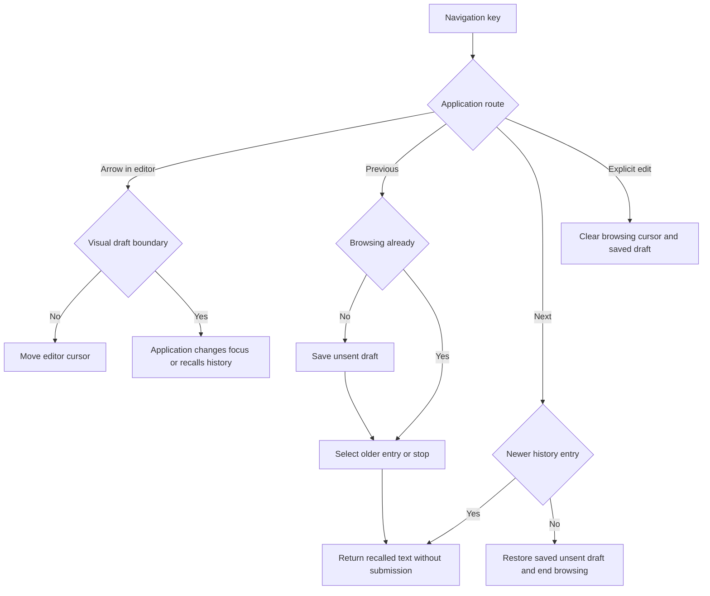

# Composer editor navigation

Status: selected refinement of the [production editor](early-production-status-slice.md#launch-presentation-and-editor).
Implementation and validation are separate from the prototype's undo history.

## Ownership and limits

The editor reports whether its cursor occupies the first or last visual draft row.
It uses the last rendered rat-text hard-wrap mapping, including Unicode widths.
Detection must not change text, selection, undo state or scroll position.
Before a nonempty render establishes a mapping, detection returns false.
The application owns focus transitions and key routing. Shift-arrow selection
must remain editing. A last visible viewport row is not necessarily the last draft row.

The client owns session-local recall of submitted commands and inputs.
Recall does not submit, execute, persist or change service queue state.
The history stores at most 100 entries and 1 MiB of UTF-8 entry data.
Each entry and the saved unsent draft are limited to the editor's 64 KiB bound.
Oversized entries and whitespace-only entries are ignored. Consecutive exact
duplicates use one entry. Oldest entries are removed to satisfy both limits.

On the first previous action, history saves the unsent draft. Further previous
actions stop at the oldest entry. Next stops after restoring the saved draft.
An explicit edit or submission resets navigation. The edited recalled text then
becomes the new unsent draft on the next previous action.
All operations use bounded in-memory data. There are no I/O calls, workers,
deadlines, permissions or recovery records. Process exit discards recall data.

## Validation

| Case | Required result |
| --- | --- |
| EN1: wrapped and multiline text | Only the actual first and last visual rows report boundaries. |
| EN2: scrolled editor and resize | Viewport edges cannot report false draft boundaries; resized mappings replace old ones. |
| EN3: Unicode and selection | Boundary checks preserve all editor state and handle wide and combining characters. |
| HN1: recall and restore | Previous/next preserve the exact unsent draft, including multiline Unicode. |
| HN2: explicit edit | Reset makes the edited text the next saved draft. |
| HN3: limits | Entry count, UTF-8 bytes and individual draft bounds hold after repeated insertion. |
| HN4: duplicate and empty inputs | Consecutive exact duplicates and blank inputs do not add entries. |

Unit tests verify these pure adapters. The composer integration must also test
key routing, selection, resize and service activity in the actual terminal journey.
