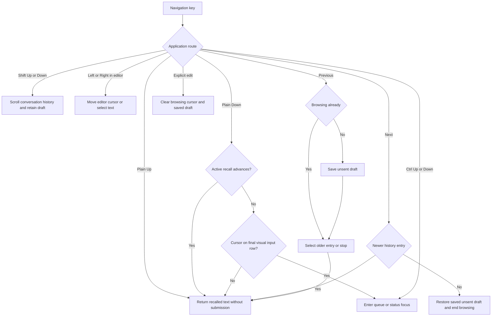

# Composer editor navigation

Status: selected refinement of the [production editor](early-production-status-slice.md#launch-presentation-and-editor).
Implementation and validation are separate from the prototype's undo history.

## Ownership and limits

The application owns focus transitions and key routing. Shift+Left/Right remains
editor selection. Shift+Up/Down scrolls the conversation history and never selects
draft text. Plain Up recalls submitted input. Plain Down first advances active input recall,
including restoring the saved draft. Otherwise, Down on the final visual input
row enters status focus; Down above that row retains input recall behavior.
Ctrl+Up enters queue focus and Ctrl+Down remains a status shortcut. The editor
provides the visual-row boundary through its existing hard-wrap mapping.

The client owns session-local recall of submitted commands and inputs.
Recall does not submit, execute, persist or change service queue state.
The history stores at most 100 entries and 1 MiB of UTF-8 entry data.
Each entry and the saved unsent draft are limited to the editor's 64 KiB bound.
Oversized entries and whitespace-only entries are ignored. Consecutive exact
duplicates use one entry. Oldest entries are removed to satisfy both limits.

On the first previous action, history saves the unsent draft. Further previous
actions stop at the oldest entry. Next stops after restoring the saved draft.
An explicit edit or submission resets navigation. The edited recalled text then
becomes the new unsent draft on the next previous action.
All operations use bounded in-memory data. There are no I/O calls, workers,
deadlines, permissions or recovery records. Process exit discards recall data.

## Validation

| Case | Required result |
| --- | --- |
| EN1: wrapped and multiline text | Up recalls input; Down restores recall before entering status from the final visual row. |
| EN2: scrolled editor and resize | Wrapping and resize preserve the final-row status boundary. |
| EN3: Unicode and selection | Shift+Left/Right select Unicode text; Shift+Up/Down preserve the draft. |
| HN1: recall and restore | Previous/next preserve the exact unsent draft, including multiline Unicode. |
| HN2: explicit edit | Reset makes the edited text the next saved draft. |
| HN3: limits | Entry count, UTF-8 bytes and individual draft bounds hold after repeated insertion. |
| HN4: duplicate and empty inputs | Consecutive exact duplicates and blank inputs do not add entries. |
| HN5: modifier routing | Recall takes precedence over Down-to-status; Shift arrows scroll transcript without editing; Ctrl arrows enter queue/status focus. |

Unit tests verify these pure adapters. The composer integration must also test
key routing, selection, resize and service activity in the actual terminal journey.

## Recorded validation — 2026-09-30

The Down-to-status correction passed all 162 CLI unit tests. Cases cover empty
input, multiline Unicode, hard wrapping, resize and exact draft restoration before
status focus. The real composer PTY journey passed plain Down entry, project and
model selection, draft preservation, recall and owned backend cleanup. The project
fixture selects its named row explicitly; registry order is not name order.
The development CLI and lifecycle fixture were rebuilt. Both changed Mermaid
diagrams were rendered with Mermaid CLI 12.0.0 and visually inspected.
