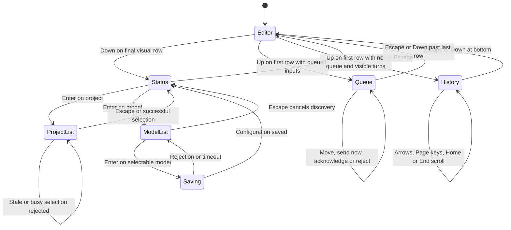
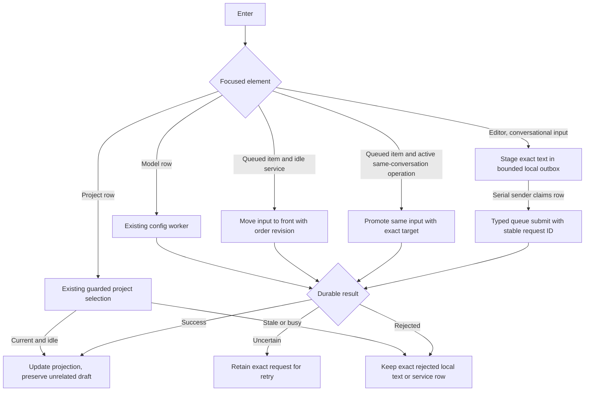
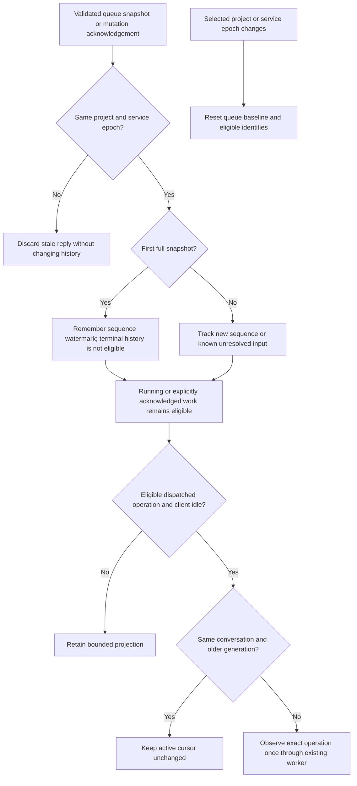

# Composer interactions

Status: selected design for the owner's composer changes, 2026-09-28, as
revised by the [managed input queue](managed-input-queue.md) on 2026-09-29.
Earlier scoped validation is recorded below; it does not validate the revised
all-input queue interaction.

## Ownership and scope

The TUI owns focus, selection, draft history and presentation. Existing project,
configuration, model inventory and conversation workers own transport. The service
owns queued inputs and steering. See [IQ2](conversation-admission.md#existing-input-promotion-iq2)
for atomic queue promotion and [editor navigation](composer-editor-navigation.md)
for bounded local recall. No rendering or key handler performs network or file I/O.
Protocol numbering remains 0.1 and journal format remains 1.

## Layout and interaction

Add one bottom row below the status row. Use mid-grey text on the terminal
background. This row describes interaction state and the keys available at the
current focus. Keep input blue exclusive to input, and use the existing grey-blue
panel colour for lists and queue display. All backgrounds include internal padding.
Focused status items and selected list or queue rows use a lighter grey-blue
background (RGB 70, 82, 94) and brighter text (RGB 245, 248, 250).
Do not invert foreground and background colours for selection.

An unmodified Down press on the final visual row of the draft enters status focus.
Wrapped input rows count as rows. Down within the draft continues normal navigation.
Project is the initial status item. Left, Right and Tab move between project and
model. Up or Escape returns to the editor without changing the draft. Enter opens
the selected list. Project displays its name alone, without a Project prefix.

Lists appear below the status row; the composer moves upward to reserve list space.
The bottom hint row remains visible. Lists have a bounded viewport, scroll only
when their rows exceed it, and keep the highlighted row visible. Up/Down select,
Enter applies, and Escape closes without applying. Very small terminals keep the
editor and hint visible and may clip the list to remaining space. No subtraction
may overflow when the terminal shrinks.

The project list uses the existing bounded project registry. It shows stale entries
as unavailable. Both `/project select` and list selection use the same transition.
An active conversation blocks switching projects under the existing contract.
A successful change resets conversation and telemetry scope and preserves the draft.

The model list uses the existing bounded `/models` inventory worker. Opening the
list starts one discovery request; pending, empty, partial and failed discovery
remain visible and cancellable. Available, installed and listed rows can be selected.
Unavailable or unchecked rows explain their status without applying. Enter writes
the selector through the canonical `model` config setter. The UI adopts it only
after success. Failure preserves selection and draft. This affects future admissions;
it does not change a running model. The picker never loads weights or starts inference.
Picker-origin requests must not clear drafts or open command-result overlays.

Ctrl+P/Ctrl+N recall previously submitted commands and inputs. Up on the first
visual draft row enters the queue when unresolved items exist. Otherwise, if the
conversation has visible turns, Up enters the history pane and scrolls it upward.
Up, Down, Page Up, Page Down, Home and End scroll that pane by visual rows.
Down at the bottom and Escape return to the editor without changing the draft.
The history pane retains its scroll position while focused and follows the latest
turn again when focus returns to the editor. Command recall remains on Ctrl+P/N.
Hints expose these interactions. Rendering and key handling perform no I/O.
The hint row uses `^` for Control chords and `↵` for Return. On macOS it
uses `⌥` for Option; on other systems it writes `Alt+`. It shows the newline
chord only when the editor can accept it. These labels describe existing key
events and do not change their handling. If a terminal is narrow, the existing
hint clipping applies; the full key list remains available through `/help`.

## Queue interaction

Enter stages every conversational message in a bounded local outbox, whether a
model operation is active or idle. It clears the editor as soon as the exact
text and a stable request ID have a local row. A serial worker sends rows to
the service queue one at a time. The service's durable receipt replaces the
provisional row with its accepted projection. A rejected or uncertain row keeps
its exact text and request identity without overwriting a newer draft. Slash
commands remain immediate control operations. The [managed queue contract](managed-input-queue.md)
defines the limits, receipts, retry and crash-loss disclosure.

Show a padded queue panel above the composer with `• Queued messages:` and rows
`>> input excerpt`. Display accepted rows from the bounded service projection
and provisional rows from the local outbox with distinct labels. Label held,
sending, unconfirmed and rejected rows explicitly. Display at most four rows
and an overflow count; scroll the selected item into view. Running and terminal
rows leave this panel.

Up from the first editor row enters queue focus at the last unresolved input.
Up/Down traverse the queue; Down past its last item returns to the editor. Escape
also returns. `[` and `]` move a selected unsent local row one position in the
local outbox. For an accepted kind-18 row, they request a same-lane durable move
with the observed order revision. In-flight, running, terminal and legacy kind-12
rows cannot move. A stale order result refreshes the projection without claiming
the move succeeded.

Enter on a queued or held accepted input sends it now. With an exact active
operation in the same conversation, the canonical service atomically promotes
the same input to Steer. The hint says this stops and restarts the response.
Without an active operation, Enter requests a move to the front; a held head
still needs explicit Resume. Never combine client Drop and Enqueue. If the
target is stale or the input was dispatched, show rejection and keep the
projection. Enter on a rejected local row restores its exact text only when
the editor is empty. The UI keeps uncertain decisions for `/retry`; success
does not clear an unrelated draft. Changed project/epoch invalidates stale
focus and projections.

## Focus flow

Selected design. Arrows describe key events and completed worker outcomes.

## Mutation flow

Selected design. Arrows show dispatch, failure and acknowledgement boundaries.

## Limits, recovery and tests

Reuse model inventory's 12-second client budget, configuration's existing bounded
worker, and queue's five-second observation budget. Each retains its worker slot
until settlement. Escape suppresses late picker results. Quit uses existing bounded
worker cancellation and owned-service cleanup. No new polling or timer is added.
History is volatile, at most 100 entries and 1 MiB. List projections remain bounded
by existing 64-project, 65-model and 16-unresolved-input service limits. The local
outbox has its separate 16-input cap. Exit warns when local rows lack a durable
receipt; an accepted service input survives client exit.

Unit checks cover visual row boundaries, focus transitions, narrow layouts, hint
states, list scrolling, stale selection, draft preservation, model save rejection,
history pane scrolling, command recall and default queue admission. Backend checks cover durable promotion,
exact retry, stale targets, duplicate steering, size rejection and restart hold.
Integration and real terminal checks exercise project and model selectors, local
staging, serial delivery, durable reorder, promotion and history while requests
are pending. Verify editor/quit responsiveness with stalled discovery and queue
delivery. [MQ01–MQ12](managed-input-queue.md#acceptance-cases-and-delivery-order)
define the new queue unit, integration and end-to-end proof. Root runs serial
Cargo/Swift checks and builds the executable.
Render and inspect both diagrams and terminal previews before reporting completion.

## Recorded validation

Historical checks before the all-input queue change: on 2026-09-28, all 115 CLI unit tests passed, including seven composer interaction
tests. The real composer PTY journey passed project and model selection, confirmed
configuration saves, draft preservation, history and owned-service cleanup.
Mermaid diagrams and terminal previews were rendered and visually inspected.
The revised non-inverted selection colours were inspected in status, project-list
and queue previews. This visual check does not claim identical font rendering in
every terminal application.

## Queue history and the active conversation cursor

The first full queue snapshot is a history baseline, not a request to resume all
past work. A terminal entry in that baseline must not select its conversation or
replace the current generation. A running entry remains eligible for observation.
Queued and held entries are remembered for later transitions. A subsequent entry
with a sequence above the baseline, or a previously observed unresolved entry that
finishes between polls, remains eligible. Explicit mutation acknowledgements also
retain eligibility, including when completion precedes the first full snapshot.

The client retains a sequence watermark and at most 16 eligible input identities
for each project/service-epoch scope. Subscription retries and five-second display
expiry do not reset this history baseline; a changed project or service epoch does.
Existing 32 observed-operation identities still suppress duplicate transcript rows.
No helper or storage call is added to the render/input path. Scope, source and
revision fences remain owned by the existing queue projection. Explicit queue jobs
capture the project and last known service epoch at dispatch. Connection loss alone
does not invalidate an acknowledgement or an unconfirmed request identity. A reply from another scope must
not change the projection, baseline, editor or cursor. A terminal stale reply only
releases its worker state; a staged local row retains its exact text and request
identity without overwriting the editor.

Before observing an eligible entry, compare its conversation and generation with
the active client cursor. Never replace a cursor with an older generation of the
same conversation. Historical queue entries do not select the current cursor.
The separate [conversation restoration read](conversation-restoration.md) selects
the latest accepted conversation for the project, even when the queue is empty.
Service generation validation stays mandatory.

Historical regression fixture: persisted kind-12 queued work targeting generation
2 completes as generation 3, then a direct turn advances that conversation to 4.
A fresh TUI restores generation 4 from the journal read. It must not adopt
generation 3 from the queue. Also cover running
work on the first snapshot, queued-to-complete between polls, new terminal work
after an empty baseline, reconnect/display expiry, mutation acknowledgement before
the baseline, duplicate snapshots and a same-conversation generation regression.

The prior native PTY regression created generations 1 and 2, queued generation
3, then submitted direct generation 4. The queue-first version must submit
both later inputs through the durable queue. It restarts the owned service and
fresh TUI against the same isolated journal, then requires another real answer
without conflict.
The fixture has a 240-second work deadline and its existing separate cleanup budget.

The earlier deterministic lifecycle fixture seeded queued generation 3 and later
direct generation 4. It expected two fresh TUI launches to start new conversations
at generation 1. That expectation is superseded by conversation restoration.
The updated fixture must verify both launches advance the restored conversation.
The actual packaged helper may run, but model completion is not this test's oracle.
Each TUI shuts down its owned service and helper before verification. This coverage
has a separate 75-second selector budget and the existing independent cleanup budget.

### History-baseline verification — 2026-09-28

The serial integration runner verified:

- CLI unit suite: 124 tests passed, including historical terminal exclusion,
  active queue observation, fast completion, delayed snapshots, generation fencing,
  project/epoch changes, and acknowledgement retention across real unavailable views.
- `cargo test --locked -p asura-cli --test lifecycle` passed. The canonical
  generation-3 queue/generation-4 direct fixture completed two fresh TUI admissions.
  Strict replay verified absent original conversation and expected generation zero
  for both inputs. Each owned service and helper stopped before replay verification.
- CLI Clippy for all targets with warnings denied passed.
- Both history diagrams rendered with Mermaid CLI 12.0.0 and were visually inspected.

The optional native answer journey failed on its first prompt with `outputLimit`,
before the queue scenario. It does not provide native answer success evidence for
this correction. The passing lifecycle case proves durable admission and cleanup;
it does not claim successful model generation. No user journal or database was changed.
