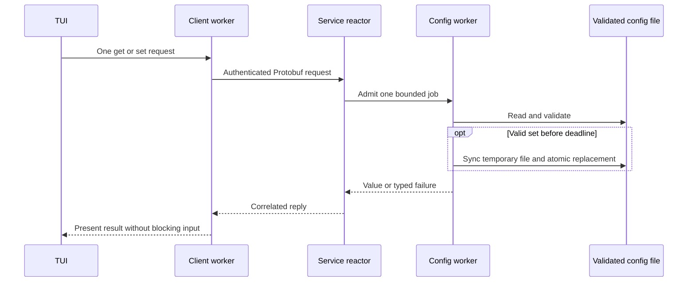
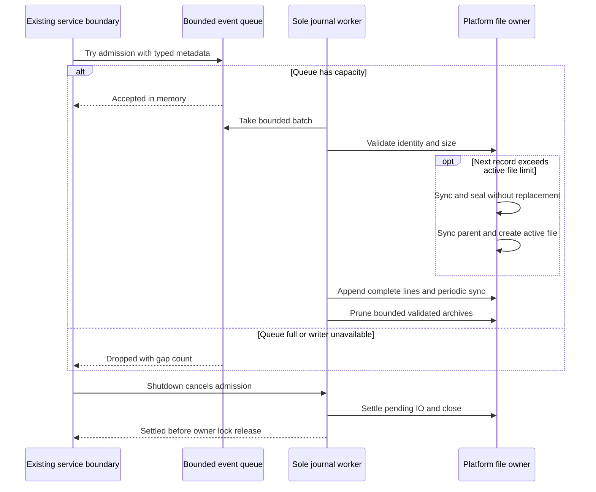
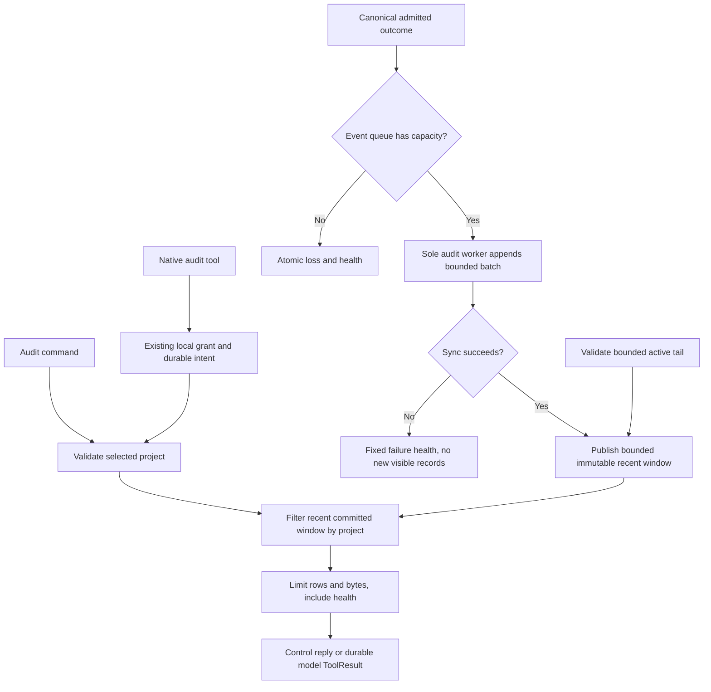
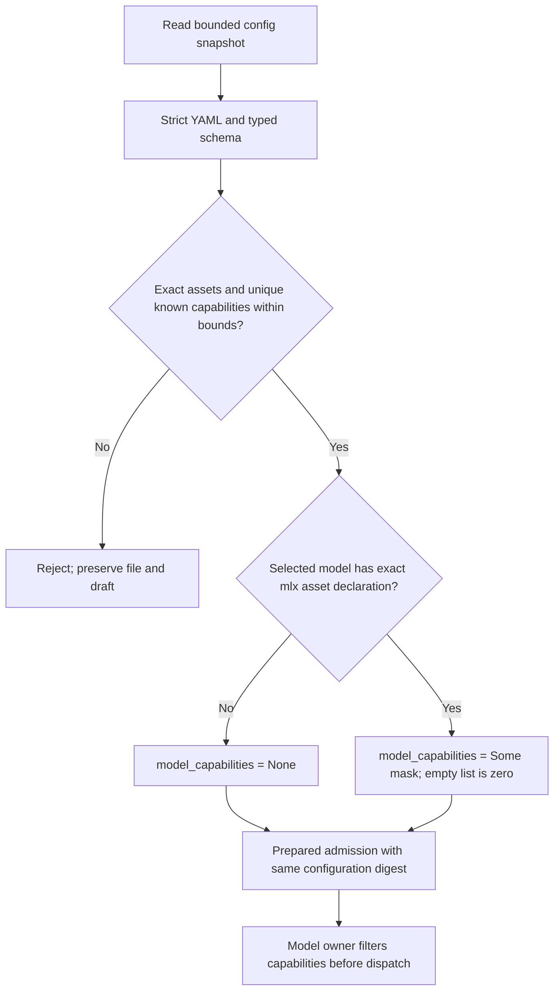
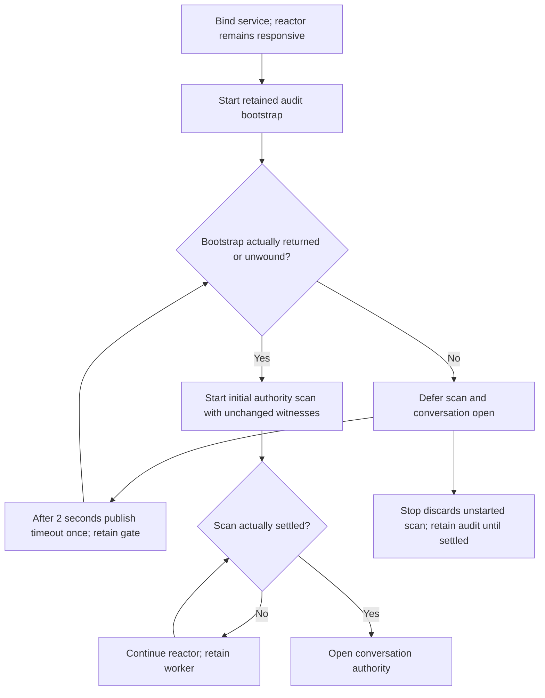

# YAML configuration commands

Status: selected implementation design. The owner authorized service config get/set
and selected model and audit settings. Root owns integration and the TUI. The
[storage adapter](storage-adapters.md) owns file persistence, schema validation and
serialization; platform supplies safe OS primitives and service owns admission.
The control/client crates own transport and correlation. The initial packet persisted
settings only. The selected recent-project inspection section adds the audit recorder
and its read-only control and model interfaces.

## Schema and command behavior

The canonical file is the account's `.asura/config.yaml`. Do not derive it from
the working directory or an environment override. Tests use scratch runtime roots.

| Key | Type and bounds | Default when absent |
| --- | --- | --- |
| `model` | Nonempty string, at most 1024 UTF-8 bytes, no control characters | Unset |
| `audit.enabled` | Boolean | `true` |
| `audit.keepFiles` | Integer, 1 through 10000 | `5` |
| `audit.maxFileBytes` | Integer, 1 through 1099511627776 | `10485760` |
| `audit` | Mapping of all three audit fields | Defaults above |
| `providers.mlx.models` | Up to 64 exact asset keys, each with a bounded capability list; see below | Empty mapping |
| `providers.ollama.endpoint` | ASCII URL, at most 2048 bytes; HTTPS host or numeric-loopback HTTP | `http://127.0.0.1:11434` at inference admission |

`/config` without arguments returns the complete effective configuration as YAML,
including audit defaults and omitting an unset model. It uses the same bounded
read-only pipeline and result overlay as keyed reads. It never creates or rewrites
the file. This reports persisted settings plus defaults, not active consumer state.
On the wire, ConfigGet with an absent key selects the complete mapping; an explicitly
empty key is invalid. ConfigSet still requires a key. Invalid files remain errors.

`/config get KEY` returns the effective YAML value, including defaults. An unset
model returns an explicit error. `/config set KEY VALUE` parses the entire remaining
text as one YAML value. Quoted model names are supported; `true` is a boolean,
not a model name. `set audit` requires all three fields. Unknown keys, duplicates,
nulls, custom tags, invalid types and bounds are errors. No deletion syntax is selected.
Standard YAML scalar tags are accepted only when their resulting type matches
the setting schema. The persisted root permits optional model, audit and providers fields; audit fields may be
omitted to inherit defaults. Invalid existing files are errors, never overwritten.
An absent or empty file uses defaults. Successful writes emit the complete
normalized mapping; comments and original formatting are not preserved.

The service uses pinned `serde_yaml_ng` 0.10.0 and Serde typed structures. Typed
structures reject unknown/duplicate fields and bound the supported nesting to the
root, audit and provider mappings, including the capability declarations below.
Parse single documents only, with at most 16 KiB of file
bytes and 4 KiB per supplied value. No includes, interpolation or execution.
Dependency source: https://docs.rs/serde_yaml_ng/0.10.0/serde_yaml_ng/ .

Configuration alone is not installation authority. A safe `config.yaml` alongside
runtime/log entries leaves installation status Uninitialized (`runtime_only`).
Its YAML validity is checked by the config owner, independently of installation
inspection. Unsafe file identity/type/permissions still fail inspection. State,
graph or unknown remnants retain their existing repair behavior. Extend platform
and real-service tests to cover config-only restarts and retained remnant detection.

The [provider contract](model-provider-integration.md#mp2-endpoint-configuration-handoff)
defines endpoint validation and disclosure. The optional providers mapping is omitted
from default YAML. Get supports `providers`, `providers.ollama` and the endpoint
leaf; set supports the endpoint leaf. MLX declaration operations are defined below.
An unset endpoint returns
`config_endpoint_unset`, while inference uses its documented default. The prepared
admission binds the endpoint to the same configuration digest as the model.

## Transport, concurrency and recovery

Use the owner-selected Protobuf control version 0.1 with ConfigGet, ConfigSet,
ConfigReply and the Config capability. Replies contain a YAML value or a fixed
safe error string. Preserve authenticated attachment, epoch and counter checks.
The version number remains 0.1 until the owner's explicit instruction changes it.
Message schemas and operations may evolve for authorized features under the normal
design, ownership and testing gates; keep both endpoints and bindings consistent
and document compatibility effects. Message changes do not themselves require
separate permission. See the canonical
[engineering rule](../engineering.md#wire-protocol-change-authority).
The owner selected wire version 0.1 on 2026-09-27; earlier development versions
1.0, 1.1 and 1.2 are incompatible. The existing Protobuf package name is a schema
identifier; the frame header controls protocol negotiation. Old endpoints reject the incompatible version; clients do not stop or replace them.

One service config job may run at a time. Additional requests return busy. Sets also return busy while initial installation
inspection retains its snapshot witness; gets remain available. This prevents
our own temporary files and renames from invalidating that inspection.
A separate bounded worker isolates file IO and parsing from the reactor. Each job
has a two-second deadline. The reactor publishes only to its original attachment
and request counter. No pipelining while a config response is pending. Expiry of a
set reports outcome unconfirmed and never causes an automatic retry. A timed-out
worker retains its slot until settlement. Drain cancels jobs and retains the
service owner lock until all filesystem work settles, using the existing repair
lifecycle. Before replacement, workers check cancellation and the deadline.

Platform access uses retained validated directory descriptors. Reject symlinks,
hard-linked files, foreign ownership, nonregular files and unsafe permissions or
ACLs. Read at most 16 KiB plus one byte and check file identity and change stamps
before accepting or replacing. Serialize service writes; external editors must
not write concurrently with a command. Detect observed edits and reject them.
The final check and rename are not a transactional lock against arbitrary external
editors; no stronger guarantee is claimed. Use an exclusive random temporary file
in the same directory, mode 0600, sync it, atomically rename, then sync the parent.
A post-rename sync error means outcome unconfirmed. Never remove another writer's
temporary file. A crash can leave a private temporary file; it is not config and
is never read as config or automatically promoted.

The TUI parses only command syntax. A dedicated bounded client worker accepts one
command at a time and uses the canonical client API. It does not touch the file.
The event loop polls results without waiting. Client requests have a five-second
UI expiry and no retry. Preserve the draft on failure; clear it on success only if
it still equals the submitted text. Show results in a dismissible result overlay,
with terminal controls escaped and bounded lines. Bottom-align the result above
the composer, with one cell of background padding on all four sides. Use muted
blue-grey RGB(55, 66, 76) for result panels and the top status bar; reserve
RGB(37, 59, 78) for user input. Do not repeat result text in the notice row.
Renderer checks cover padding, bottom alignment, palette separation and a single
copy of each result. Enable scrolling and show its hint only when wrapped text
exceeds the visible content rows. Clamp the offset to the final content row;
reset it to zero when a resize makes the full result fit. `/help` and Tab include `/config`.
Exit cancels queued work and waits at most 100 ms after terminal restoration;
in-flight mutations may have an unconfirmed result and must not be called failures.

## Validation

Unit checks cover command grammar, typed values, defaults, unknown/duplicate keys,
nulls, bounds, YAML errors, busy and expired jobs, and literal result display.
Platform integration checks use real scratch files for creation, persistence,
permissions, symlink/hardlink rejection, malformed files, observed replacement,
size limits and cancellation. Control checks cover new message shapes, directions,
version rejection and correlation. Real-service checks cover set/get persistence,
rejection without mutation, independent keys and responsiveness. PTY checks cover
help/completion, successful set/get, invalid input and exit with an in-flight
request. Existing lifecycle and terminal restoration checks remain required.

The no-argument `/config` extension was verified on 2026-09-27. Command parsing,
absent-key wire validation and default serialization checks passed. Real-service
tests confirmed full YAML reads before and after writes without file mutation.
The isolated TUI journey displayed the saved model and audit values, including
defaults; lifecycle and terminal-restoration journeys also passed. The normal
debug binary was rebuilt. This does not activate model or audit consumers.

## Proposed audit setting consumption and event journal

**Status: recording base selected on 2026-09-27; recent-inspection extension
accepted for scoped implementation on 2026-09-28. Integration and validation
are complete for the scoped evidence recorded below.** The get/set contract above remains delivered independently. This
selected extension makes the existing audit settings control a local structured event
journal. It does not select the authoritative security-audit policy, replace task
state or provide complete classifier training data.

### Evidence and scope

The current diagnostic owner is `asura-cli::app::install_logger`, using Rust
`tracing_subscriber`; `asura-storage::logs` selects its `asura.log` destination
and delegates private append operations to the platform owner.
Diagnostic output and its `--logs` destination remain a separate capability.
The current synchronous diagnostic sink also needs its own execution-rule review;
this proposal does not claim to have corrected diagnostic blocking.

Wisp's inspected `harness/Sources/WispCore/Audit/AuditLog.swift` provides one sink,
JSON Lines, a 0600 active file and size rotation. Its `keepFiles` counts archives
in addition to the active file. `AuditEvent.swift` correlates session, turn and
call events. `harness/Tests/WispCoreTests/AuditTrainingTests.swift` documents model
verdict selection, exclusion of failed/model-unavailable examples, redaction and
human refusal handling. These files were inspected as source evidence, not run.
Wisp's ADR 0010 explicitly selects verbatim content and synchronous writes. Asura
must not inherit those choices: its architecture excludes sensitive content by
default and requires filesystem isolation from control processing.

The first useful inspection slice records service/configuration outcomes and the
conversation/tool metadata defined below. The authority binary journal remains a
separate source of authoritative state. This audit feed contains no command text,
prompts, model verdicts or invented training labels. Adding classifier examples
requires a separate schema and redaction design.

### Ownership, paths and activation

Canonical owner: one `asura-service::audit` worker for the service owner
lifetime. Only service domain boundaries emit typed events. CLI/TUI clients do not
write duplicate records. `asura-storage::audit` owns validated file adapters, file
identity, append, synchronization, rotation and recovery. Storage also owns the
shared closed Event, Record and Health types; the service constructs those types
and does not define a schema on which storage would depend. Reuse existing runtime
validation and schema parsing; do not add a second config parser or launcher.

Proposed path: account `.asura/logs/audit.jsonl`, with sealed archives named
`audit.<32-hex-service-epoch>.<20-digit-sequence>.jsonl`. The directory is 0700;
files are 0600. `--logs` continues to select diagnostics only. The hybrid memory ontology includes this nonauthoritative journal under `logs/`.
The journal remains nonauthoritative and may have recorded gaps; authoritative
security audit and retention obligations must use a separately selected contract.

Read the validated configuration once at service startup in an isolated worker.
The startup snapshot fixes audit settings for that service lifetime. Successful
`/config set` persists settings immediately, but changed audit settings activate
on the next service start. Document this in command help before delivery. External
file edits have the same restart boundary. Recent inspection adds the bounded control messages below, but no runtime config
subscription. Restart activation is a scoped design
choice, not a restriction on future authorized schema changes. The wire version
number stays 0.1 under the engineering rule above.
Do not suggest that `get` describes the active writer: it returns persisted
settings plus defaults, as specified above.

An absent file uses the existing defaults. Invalid configuration disables journal
startup with a fixed diagnostic reason; it must not be overwritten or silently
interpreted as defaults. This failure does not block control service availability.
`audit.enabled: false` prevents new journal files, events and retention deletion;
it does not delete existing files. With enabled logging, `keepFiles` retains that
many sealed archives in addition to the active file. `maxFileBytes` includes the
newline and is a strict limit, including when configured below one event's size.

### Record schema and data handling

Use UTF-8 JSON Lines, one object and newline per record, at most 4096 encoded bytes.
The journal schema is `schema: 1`, independent of the wire protocol version number 0.1.
Use typed Serde structures and a closed event enum; no arbitrary detail maps.
Common fields are `schema`, `service_build` (128 bytes), `service_epoch` (32 hex),
`sequence` (monotonic u64 for this epoch), `unix_time_ms` (optional u64) and `kind`.
Sequence establishes local ordering; wall time is informational and may regress.
Clock failure omits time. Sequence exhaustion disables admission with a reason.

Initial kinds and allowed details:

| Kind | Allowed detail fields |
| --- | --- |
| `service.started` | Configuration load outcome enum and active audit bounds |
| `config.changed` | Known setting key and outcome enum: persisted or unconfirmed |
| `service.stopping` | Reason enum: stop, signal or owner lifetime ended |
| `journal.gap` | Saturating count and first/last lost sequence, with reason enum |

Do not record config values, raw parser/OS error messages, home paths, request
text, credentials, prompts, source, tool arguments or output. Redaction here is
an allowlist at construction, not a regex over a serialized event. Producers
cannot supply arbitrary strings except the validated build identifier. Config
get operations produce no records. A config mutation emits an outcome only from
its canonical worker completion; a request timeout cannot invent a persisted
outcome. Non-admission before mutation produces no changed event. The journal's
own failures must never recursively generate journal events.

The scoped identifiers below come from existing canonical owners. Other future
identifiers require schema review. Classifier records need a selected redacted input
representation, label semantics, label source/model version, failure exclusion,
human correction precedence, retention/consent and training-export rules.
Do not hash secrets as a substitute for excluding them. Classifier model files
remain under `.asura/data/classifiers/`; this packet does not train or install any.

### Admission, deadlines and failure

Use one channel with capacity 256 records and an enforced 4096-byte record bound
(at most 1 MiB of encoded payload), one writer thread, and one producer handle.
The reactor calls `try_send`, never a blocking send, disk operation or join.
Closed/full admission returns a typed dropped outcome immediately. An atomic
saturating gap count and sequence interval retain loss evidence without allocating
more records. Before its next normal record the writer emits one `journal.gap`
when it can; continuing failure may prevent even that record. Gaps must therefore
also be visible in fixed, rate-limited diagnostics, at most once per 60 seconds.
Emit these diagnostics from the isolated worker, never from queue admission; a
stalled diagnostic sink must not add a blocking call to the reactor.
Do not claim complete or durable security audit from this mechanism.

The worker opens and validates storage, serializes records, writes and rotates.
Config load, directory traversal, enumeration, append, sync and cleanup are
potentially blocking and stay off the reactor. Bound each work cycle by a
two-second logical deadline, checked between filesystem operations. The OS may
stall inside an operation: retain the single worker and queue bounds, report a
stale worker via atomic health, and do not spawn a replacement writer. Producers
continue to return immediately. Drain cancels admission; a one-second settlement
budget transitions the service to the existing repair lifecycle if the worker is
still active. Keep the service owner lock until all journal filesystem work
settles. Do not release ownership while a detached writer may still append.

Append batches contain at most 16 records or 64 KiB, and sync at least once per
second while records are pending, plus after rotation and graceful shutdown.
Successful enqueue means accepted in memory, not persisted. A crash may lose
unsynced records. After an uncertain write, close the active descriptor and recover
its tail before any retry; never replay an uncertain record automatically.
Disable disk writes for the rest of this service lifetime on unsafe identity,
permission, malformed complete line, or permanent filesystem failure. Retryable
interruption or temporary unavailability gets at most one retry after one second,
within the same worker and after validation; it must not multiply threads or
replay uncertain appends. Expose only fixed error codes to diagnostics.

### Rotation and recovery

Operate relative to retained validated `.asura` and `logs` descriptors. Reuse the
platform's symlink, ownership, regular-file, hard-link, permission and ACL checks.
Open nonblocking before file-type checks so a substituted FIFO cannot stall open.
Only the service owner writes. Validate the named file against the held descriptor
before each batch and rotation. External mutation is unsupported and an observed
change disables the journal; do not attempt to repair an arbitrary replacement.

Before an append would exceed the configured maximum, sync and seal the active
file using a fresh epoch/sequence archive name with exclusive no-replace rename.
Sync the directory, create a new active file exclusively, validate it, then append.
Do not shift numbered archives or overwrite an existing archive. A record larger
than either 4096 bytes or `maxFileBytes` is dropped with gap accounting; there is
no oversize-file exception. If even a gap record cannot fit, retain its loss count
in health state. A smaller configured size after restart seals an existing larger
file before further append; existing bytes are not truncated to meet the limit.

Maintain a bounded archive list after a descriptor-relative scan: at most 10001
recognized archive names and at most 20000 directory entries examined. Exceeding
either bound disables journal startup without deletion. Reject unsafe matching
files rather than following them. Sort by retained file creation timestamp, then
archive name for ties; this defines retention order, not event chronology across
epochs. Prune oldest validated archives only after a new active file is established,
until `keepFiles` remain. Delete at most 32 per worker cycle, with deadline/cancel
checks and parent sync. Temporary excess retention is allowed during recovery;
never exceed admission memory bounds to track it. Unrelated names are not deleted.

On restart, recover an existing validated active file before admitting writes.
Read at most the final 4097 bytes to find its last newline. A trailing partial
record is truncated to that newline (or zero for a file shorter than 4097 bytes),
then synced, and counted as an unknown lost record. If no newline is found in that
bounded window of a larger file, disable the writer as malformed. Read at most a
further 4097 bytes preceding that newline to validate the last complete record's
JSON/schema within the 4096-byte record bound. Recovery reads at most 8194 bytes;
it does not claim to validate every older record. Seal the old
active file before beginning the new epoch. If a crash occurred after sealing but
before active creation, create the missing active file, then perform bounded
retention. Never append bytes to a partial line or promote an unrelated file.

### Recent project inspection: selected review packet

This packet adds recording and read-only inspection together. The implementation
packets are in progress; no live audit availability is claimed. Integrate recording before
advertising `service_read_audit`. Preserve the recording, rotation, recovery and
restart-activation contracts above. The feed is diagnostic evidence with possible
gaps, not authoritative security audit or a classifier training dataset.

#### Typed outcome metadata

All records retain the common schema-1 fields above. The closed kind and its
exact typed fields serialize as `kind` and a nested `details` object. Extend the closed kind enum
with the following detail variants; no other keys are permitted. IDs are nonzero
16-byte identifiers encoded as 32 lowercase hexadecimal characters. Integer fields
are unsigned u64, except ordinal u32 in 1–8. Optional means absent, never a made-up
zero. No raw error string is permitted.

| Kind | Exact detail fields |
| --- | --- |
| `conversation.admission` | `project`, `request`, optional `conversation`, optional `operation`, `requested_generation`, optional `current_generation`, `outcome`, `reason` |
| `conversation.finished` | `project`, `conversation`, `operation`, `generation`, `outcome`, `reason` |
| `tool.finished` | `project`, `operation`, `generation`, `ordinal`, `tool`, `outcome` |

Admission outcome is accepted, rejected or unconfirmed. Its reason is none,
request_conflict, generation_conflict, unavailable, denied, invalid, busy, limit,
timeout, cancelled or internal. Preserve the actual fixed error classification;
never infer a generation conflict solely from `request_conflict`. Finished outcome
is completed, failed, cancelled or interrupted, with the same reason enum. Tool
outcome is the existing seven tool statuses. Tool is a closed registered-tool enum;
unknown codes cannot become free-form strings. Wire reason codes are none 0,
request_conflict 1, generation_conflict 2, unavailable 3, denied 4, invalid 5,
busy 6, limit 7, timeout 8, cancelled 9 and internal 10. Tool codes follow the
registry: read-file 1, list-directory 2, service-status 3, memory-list 4,
memory-get 5, memory-sources 6, tool-inventory 7 and audit-read 8.
This first slice does not record
queue events; admission metadata still explains stale expected generations.

The canonical conversation owner emits admission outcomes and supplies current
generation only when known from its authoritative decision. Do not parse diagnostic
text or scan the journal again. Emit finished/tool outcomes only after their durable
terminal/result acknowledgement. Early proposals and timeout guesses are not durable
results. Scope admission records only when the requested project has been validated;
unscoped rejected requests emit no project record. IDs do not authorize access.

Original config events use a closed setting category: model, audit, audit.enabled,
audit.keepFiles, audit.maxFileBytes or providers.mlx.models. Do not record arbitrary
model asset keys. No record contains prompts, source, note bodies, tool arguments,
outputs, config values, paths, chain-of-thought or raw provider/OS errors. Enforce
this allowlist when constructing typed events, before serialization.

#### Recent window and publication

The audit worker retains a newest-first window of at most 256 records across all
projects, each at most 4096 encoded bytes: at most 1 MiB of record payload. A record
enters the readable window only after its complete append batch has successfully
synced. Accepted-in-memory and unsynced events remain invisible. Failure after
append but before sync leaves them invisible until validated restart recovery.
The feed can lag the authority journal and is never proof that an omitted action
did not occur.

The worker publishes an immutable snapshot through one replaceable completion
slot; the reactor retains only its latest snapshot. Bound record payload across
worker window, pending snapshot and reactor snapshot to 3 MiB, plus the existing
1 MiB event queue and 64 KiB append batch. Do not accumulate snapshot history.
Snapshots share immutable record payload through reference-counted storage; the
reactor and conversation owner must not clone the inner record vector or retain
snapshot history. Emitter clones are reactor-local and share one nonblocking
admission owner.
Reserve epoch sequence 1 for the worker-created service.started record; subsequent
records use increasing sequences from 2. A queue-loss gap uses the last lost
sequence and precedes the next admitted record. Clones cannot create worker threads.
Use the existing completion wake mechanism. The reactor takes snapshots without
blocking; it performs no filesystem operation or worker join for inspection.

After the selected tail repair, startup hydrates at most 256 KiB ending at the last
complete newline of the validated active file. Skip the first partial line in that
window. Strictly parse each complete line within the 4096-byte bound, retain only
the newest 256 valid records, then sync/seal as specified above before publishing.
A malformed complete record disables inspection and recording with a fixed reason;
do not skip corruption or return raw text. If no active file exists, the initial
window is empty. Do not scan sealed archives. With audit disabled, safely validate
and hydrate this same bounded active tail without repair, sync, rotation or deletion;
a trailing incomplete line stays excluded. Unsafe files return unavailable.

The read window is smaller than on-disk retention. Restart may discard readable
records previously held only in memory or sealed archives. Quiet projects can have
no recent rows after other projects fill the global window. Reply metadata must
state `window=recent`, `capacity=256`, whether startup hydration has settled and
whether older records were omitted by the bounded window. There is no cursor,
archive browser, filesystem path argument or pagination registry in this slice.

#### Read contract and wire allocation

`/audit [limit]` accepts a decimal limit 1–16, default 16, and requires a selected
registered project. Bad arguments retain the draft. The asynchronous command worker
uses the existing control client, with one pending job and a two-second deadline.
It renders a padded newest-first table in the normal result panel, with health and
recent-window limits. Escape closes; scrolling activates only on overflow.

Add control Envelope fields 47 `AuditRead` and 48 `AuditReply`; the inspected schema
currently ends at 46. `AuditRead` contains required project_id bytes field 1 and
required limit uint32 field 2. The client supplies the selected project. The service
verifies registration and peer attachment; malformed IDs or limits are rejected.
`AuditReply` contains required project_id field 1, required health field 2, repeated
entries field 3 and optional fixed error code field 4. No free-form log text.

`AuditHealth` fields: required state uint32 field 1 (1 starting, 2 active, 3 disabled,
4 stale, 5 unavailable); required enabled bool 2; required keep_files uint32 field 3;
required max_file_bytes uint64 field 4; required dropped uint64 field 5; required
window_capacity uint32 field 6 equal 256; required hydrated bool 7; required
older_omitted bool 8; optional fixed reason enum field 9. Active settings are the
startup snapshot. If startup config is invalid, bounds are absent rather than
reported as defaults: fields 3/4 may be absent for states 1 and 5. This health summary
contains no identifiers or data from other projects. Health reason codes are
config-invalid 1, unsafe-storage 2, malformed-record 3, IO 4, deadline 5,
cancelled 6, limit 7, sequence-exhausted 8, queue-full 9 and closed 10.
Zero and unknown values are invalid when the optional reason is present.

`AuditEntry` fields: required service_epoch bytes 1; required sequence uint64 field 2;
optional unix_time_ms uint64 field 3; required kind uint32 field 4 (1 admission,
2 conversation finished,3 tool finished); required project bytes 5; optional request
bytes 6, conversation bytes 7, operation bytes 8; optional requested_generation uint64
field 9, current_generation uint64 field 10, generation uint64 field 11, ordinal uint32
field 12, tool uint32 field 13; required outcome uint32 field 14; required reason uint32
field 15. Kind-specific presence and enums follow the typed record table; tool reason
must be none. Entries contain only the three project kinds, never service/config
records. All nested unknown fields are rejected. Reply project must equal each row.

Native model ToolCall field 18 is `AuditRead`, with required uint32 limit field 1.
The empty/default native function argument maps to 16 before wire encoding.
Both codecs require limit 1–16; native invalid values fail locally as inputLimit.
There is no rejected audit ToolIntent kind. The model
supplies no project. The service derives it from the immutable admitted turn and
uses the same projection/filter as control. Native capability, local destination,
read grant, cancellation, ordinal and result budgets still apply. Durable ToolIntent
kind 15 uses empty path, offset 0 and limit 1–16; kinds 12/13 remain HM3 and 14 inventory.
This is a tool-kind allocation, not a change to journal record-kind 15 ToolResult.
Recheck allocations at integration; protocol remains 0.1 and journal format remains 1.

`service_read_audit` returns at most 16 project-matching entries, newest first, with
health and window metadata, in at most 16384 UTF-8 bytes. Include complete entries
only; stop before the byte bound and set older_omitted. Control has the same row and
encoded-reply byte bounds. Global lifecycle/config rows remain on disk for human
inspection but are not exposed by this first command or model tool. No project
content is read from diagnostic `asura.log` or the binary authority journal.

A starting worker returns starting health and no rows. A stalled worker returns
stale health with its last published committed window. Unavailable/unsafe storage
returns unavailable with no rows. Disabled logging can return the hydrated window
and disabled health. A missing file returns an empty window, not a fabricated log.
Model results are durable before delivery and rechecked against current turn/project
fences. Record the audit tool's ordinary durable tool outcome after the read snapshot;
this cannot recurse because no audit append emits another tool outcome.

#### Execution and validation gates

Inspection needs no additional filesystem job. It reads at most 256 cached records
and returns at most 16; all formatting is bounded. Existing journal work and native
tool settlement remain on their retained workers. The audit worker retains the
numeric queue, cycle, retry, sync, retention and shutdown limits above. Owner lock
release still waits for actual worker settlement. A stale audit worker cannot block
status, input, cancellation or other domain owners.

AI-U1 covers closed schema/privacy, kind-dependent presence, no untrusted strings,
sequence/gap saturation, cache/byte bounds, project filtering, first/last limit,
unknown fields/direction, absent/default native limit and duplicate callbacks.
AI-I1 proves written-but-unsynced rows invisible, sync publication, snapshot
replacement bounds, bounded active-tail hydration, disabled read without mutation,
corrupt complete-line refusal, retention/window divergence and no archive scan.
Reuse all rotation/recovery and unsafe-file tests below.
AI-I2 induces actual requested/current generation disagreement and checks the
metadata comes from canonical admission. It verifies project isolation, no-project
rejection, tool-result-before-event ordering, no recursive audit reads, and stale
worker responsiveness/cancellation/lock-last settlement.
AI-E1 starts an isolated service, induces request_conflict, inspects safe metadata
through `/audit` and a real native read tool, then rotates/restarts and checks the
explicit recent-window limit. Cover disabled mode and two project scopes. Use no
user database or logs. Root owns native qualification and all test-child cleanup.

### Implementation packets and validation

Root selected these implementation choices on 2026-09-27:

- Restart activation, with persisted and active settings explicitly distinguished.
- Best-effort nonauthoritative metadata journal with the bounds above.
- `logs/audit.jsonl` and its sealed archives under the ontology's log-file owner.
- Reuse the already locked `serde_json = 1.0.151` encoder and Serde; no new encoder.

These are design and integration decisions for the primary agent, not automatic
requests for more user permission. There is no user blocker for preparing this
metadata-only packet. Collecting sensitive classifier inputs or selecting the
separate authoritative security-audit policy would exceed this packet and needs
its own data-handling design and any applicable owner decision. A wire message
change alone is not a permission blocker; the version number stays 0.1.

After root review, split implementation ownership as follows:

1. Storage packet: new `asura-storage/src/audit.rs` and its exports; descriptor
   shared schema types, descriptor operations, archive limits, atomic sealing and
   tail recovery. No admission policy. Assign required private descriptor primitive
   additions in `asura-platform` to an explicit platform owner before coding.
2. Service packet: new `asura-service/src/audit.rs`; typed records, bounded admission,
   config startup snapshot, loss accounting and single worker. Use storage-owned
   schema types and no separate inspection worker. Root owns reactor
   and config-completion integration, retaining lock-last shutdown.
3. Client/model packet: control fields47/48, native field18, strict codecs, shared
   read adapters, `/audit` help/completion and panel tests. No client file writer.
   Root integrates canonical event producers and validates the recent-window
   publication/disclosure fences before native qualification.

Unit checks cover schema allowlists and maximum encoded size, configuration
activation, queue saturation, sequence/gap accounting, byte-limit edge cases,
retry classification and disabled mode. Fake stalled IO proves admission and
control progress, one-worker capacity and late settlement behavior.

Real scratch-file integration checks cover 0600/0700, symlinks, hard links, ACLs,
FIFO substitution, identity changes, complete-line appends, exact size rotation,
archive collision, retention decreases and enumeration limits. Inject failures at
every sync/rename/create/prune boundary, restart from each resulting filesystem
state, and prove no unrelated file is removed or uncertain record replayed.
Exercise truncated tails, malformed complete lines, overlong tails and small
configured byte limits. Verify foreign-file/unsafe failures leave original bytes
unchanged except the explicitly selected partial-tail repair.

Real-service end-to-end checks set each audit setting through the existing client,
restart an isolated service, and inspect actual files. Prove persisted-versus-active
behavior before restart, disabled behavior, rotation retention and metadata-only
records. Stall the journal worker while issuing Inspect, config get/set and Stop;
verify prompt responses, bounded memory, repair state and owner-lock retention
until release. Test normal and TUI-owned lifetimes. Do not claim classifier quality,
authoritative audit durability or OS-stall cancellation from these checks.

## Per-model MLX capability declarations

Status: selected design, implementation in progress. The storage configuration
owner validates declarations. The model owner uses the selected declaration to
filter advertised capabilities; configuration does not prove runtime support.

`providers.mlx.models` is a mapping of exact asset identifiers to mappings with
one required `capabilities` list. Supported names are `toolCalling`,
`guidedGeneration`, `reasoning` and `vision`, mapped to bits 1, 2, 4 and 8.
An absent model declaration resolves to `None`; an explicit empty list resolves
to `Some(0)`. The consumer must preserve this distinction. Configuration snapshots
and prepared admission carry `model_capabilities: Option<u32>` from the same
validated file and digest as the selected model. Only an exact `mlx:ASSET` match
resolves a declaration. Other providers receive `None`.

Get supports `providers.mlx` and `providers.mlx.models`. Set replaces the complete
`providers.mlx.models` mapping. Asset names are mapping keys, never dotted config
paths. At most 64 models are allowed. Each identifier has at most 256 UTF-8 bytes
and nonempty relative components; absolute paths, dot components, backslashes and
control characters reject. Each list contains at most four unique known names.
Unknown fields, duplicate mapping keys, nulls and custom tags remain invalid.

The existing 16 KiB file, 4 KiB set value, isolated config worker, deadlines,
atomic replacement and cancellation rules apply. Parsing permits six container
levels, at most 64 entries per mapping and four scalar sequence elements.
Typed validation permits sequences only for the capability lists. No metadata,
weights or arbitrary files are read. This adds no worker, network access or I/O
inside the service reactor. Config changes affect subsequent admission snapshots.

### Capability configuration flow

Selected design. Arrows identify validation and data handoff, with existing config
write/retry outcomes inherited from the command flow above.

Unit tests cover absent versus empty, exact names with dots/slashes, bit masks,
duplicate or unknown names, invalid paths, list/map/depth limits and type rejection.
Actual private-file integration tests cover set/get/dump, snapshot digest changes,
provider isolation and preservation after invalid writes. Service tests exercise
prepared-admission propagation and model capability filtering; the model-provider
packet owns runtime tool behavior and unsupported-capability outcomes.

## Audit bootstrap and initial authority inspection ordering

Audit startup can create `logs` under the Asura root. The authority scanner's
root witness detects this directory change correctly. Start the audit worker first,
then defer the initial installation scan until its synchronous bootstrap has
actually returned. A dedicated atomic completion flag, followed by a reactor wake,
records this boundary. It is set after successful/failed bootstrap or after panic
unwinding completes. Active, Stale and Unavailable health values are not settlement
signals. No deadline permits a scanner to race a still-running bootstrap.

The reactor remains available for Hello, Inspect, config reads and Stop while this
ordering gate is closed. After two seconds it reports inspection timeout once;
it retains the pending scan factory and starts the scan only after real bootstrap
completion. The scan retains its existing five-second deadline and unchanged
identity/witness checks. A late successful scan may replace the timeout snapshot.
Configuration writes remain busy until the scan settles. Conversation authority
open follows the completed scan. Stop before release discards the pending factory,
retains the audit owner until actual settlement, and starts no inspection worker.

AS-U1 holds bootstrap past its logical deadline, verifies health expiry does not
release inspection, then checks release on actual return/failure/unwind. AS-U2
holds the deferred scan factory, checks one timeout and cancellation without
invocation, then checks one invocation after release. AS-I1 creates a real missing
logs directory before the scanner starts and verifies the pending-installation
fixture remains Recovering. The existing changed-authority witness regression must
still reject an unrelated root mutation. Isolated CLI/native audit lifecycle checks
provide the final startup/auto-initialization regression evidence.

## Recent-inspection implementation evidence, 2026-09-28

The recorder and `/audit [limit]` panel are integrated. The model calls
`service_read_audit` through the same bounded, project-filtered snapshot.
Storage checks cover rotation, active-tail hydration, malformed input, disabled
no-write behavior, retention changes, permissions, ACLs and enumeration limits.
Service checks cover retained stalled workers, queue gaps, health precedence,
read-only projection, remote denial and actual-bootstrap ordering.

The real system-model audit journey passes with an exact recorded request conflict,
requested/current generations, project isolation, durable tool result, restart
replay and disabled recording. The CLI/TUI lifecycle harness passes, including
panel display and invalid-limit draft retention. Test services are stopped/reaped.
The original startup race reproduced as `authority_changed`; the new bootstrap
gate fixes scheduling while preserving authority witness validation. Other model
adapters have contract coverage; this packet does not claim native audit inference
qualification for them or complete archive browsing/security audit guarantees.
