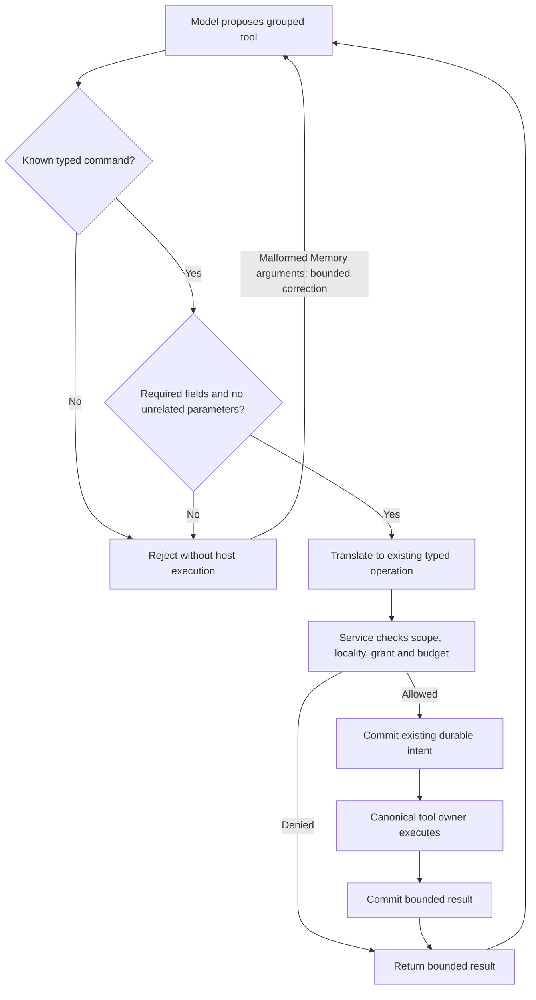

# Consolidated parameterised tools

Status: implemented; validation recorded below, 2026-09-28.

## Public interface and ownership

Expose four model tools through the existing shared native adapter: `project`,
`memory`, `service` and `shell`. Each grouped tool has a typed command enum and
bounded optional arguments. The adapter rejects fields that do not belong to the
selected command. It translates valid arguments into the existing typed private
model protocol; service policy, budgets, journal records and storage ownership
remain in their existing owners. No string command interpreter is added.

| Tool | Commands | Parameters |
| --- | --- | --- |
| project | read_file | path; offset defaults 0; limit defaults 4096 |
| project | list_directory | path defaults . |
| memory | list_notes | after optional; limit defaults 8 |
| memory | get_note | version; offset defaults 0; limit defaults 4096 |
| memory | note_sources | version |
| memory | create_note | body; source_version optional; HM3 activation packet |
| service | status | none |
| service | tools | none |
| service | audit | limit defaults 16 |
| shell | unchanged | command, cwd, timeout_seconds |

For example, `memory` receives `{ "command": "get_note", "version": "…" }`.
Command enums carry meaningful names rather than another resource selector when
only one resource type is supported. Note creation follows the
[HM3 activation contract](hybrid-memory-ontology.md#hm3-create-immutable-notes-through-admitted-tools).
Sensor inspection extends this contract when its canonical implementation is ready.
This packet changes model tools, not slash-command syntax. `/tools` lists the same
four tools and their commands; existing `/audit` remains available.

The Rust service registry owns public discovery. Keep its internal operation
metadata separate: durable activity and audit records continue to identify the
exact operation, such as memory_get_note. Existing journal kind numbers and model
wire variants retain their meaning. Protocol stays 0.1 and journal format stays 1.
The helper exposes only grouped names, without duplicate legacy advertised tools.
Legacy wrappers may remain internal translators so their tested schema semantics
can be reused; they cannot independently bypass the shared handler.

## Validation and failure handling

The shared adapter bounds UTF-8 strings and converts integer parameters without
loss. It rejects missing required arguments, negative/overflowed numbers and
extraneous command parameters before contacting the service. The service remains
the authority for scope, detailed limits, locality and permission checks. Grouping
read/write operations never grants write access from a read grant. `create_note`
requires a body of 1–16,384 UTF-8 bytes and accepts an optional source version.
It rejects version, after, offset and limit. Read commands reject body and
source_version. The service enforces HM3's separate write grant, verified local
destination, durable intent, receipt resolution and publication rules.
Malformed creation field combinations and write fields on read commands receive
fixed correction guidance without contacting the service.
The shared native proposal gate bounds valid and invalid callbacks;
the existing inference-pass, token and deadline limits remain in force. See the
provider design for the gate and failure contract.

Grouping adds no workers, queues, timers or I/O operations. HM3 defines the note
mutation through the existing storage owner. Tool callbacks retain
existing deadlines, cancellation, per-turn eight-call and byte budgets. All local
model classes use the same generated schemas and adapter. Cloud activation is
unchanged. Stored evidence remains untrusted; it cannot select another command or
grant access. An invalid grouped proposal cannot fall back to a shell command.

### Selected command flow

Arrows show proposal validation and canonical dispatch.

## Required evidence

Unit tests must verify command translation, defaults, invalid combinations, enum
schemas, exactly four advertised tool names, public registry consistency and
unchanged per-operation grants. Shared callback integration must retain existing
local-provider coverage and cancellation behavior. Native system and local Ollama
journeys must call grouped discovery and memory reads with exact committed results.
The post-tool long-response regression must use grouped discovery. Update native
fixture prompts that name replaced public tools. Render and inspect this diagram;
run Rust, Swift, TUI inventory and native tests before claiming completion.

## Recorded validation

The Swift suite passed 74 tests, including grouped defaults, invalid combinations,
exact command enums and four advertised tool names. The Rust CLI, control,
platform and service library suites passed 133, 23, 91 and 115 tests respectively.
The control fixture exporter remained intentionally ignored in that library run.

Native system-model journeys verified grouped discovery, project reads, service
status, memory list/get/sources, project isolation and durable restart replay.
Verified-local Ollama `granite4.1:8b` passed grouped discovery and memory journeys.
Its post-tool response passed the minimum-length and exact final-marker checks.
The fixtures stopped and reaped their service children.

The real CLI lifecycle suite passed, including the TUI `/tools` panel, repeated
commands, draft preservation, service attachment, shutdown and owned-process cleanup.
The Mermaid flow was rendered and visually inspected.

The shared adapter covers all local model classes. These runs do not establish
native CoreAI or MLX qualification for the consolidated interface. Memory mutation
and sensor inspection remain separate implementation packets.
