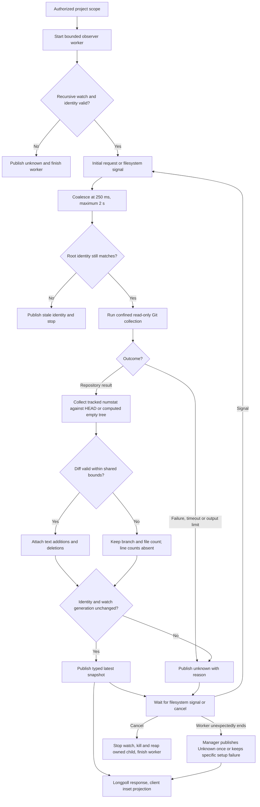
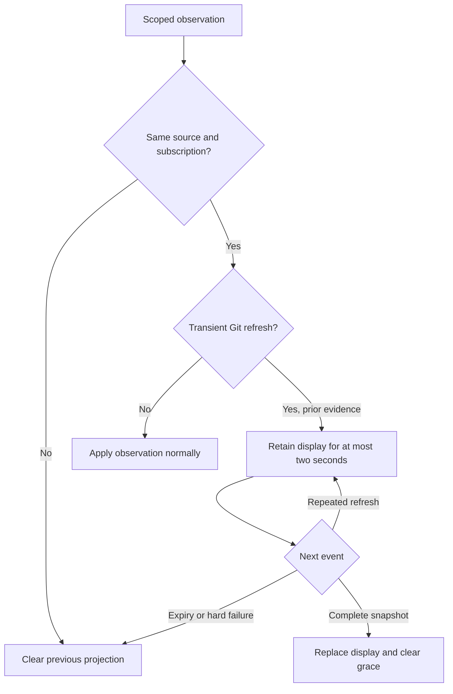

# Project context observations

Status: selected scoped design for the user-requested Git status replacement,
2026-09-27. Runtime qualification is required before calling Git status verified.
Root owns control/client integration; the observer packet owns two new modules.

## Pipeline and scope

Filesystem signals enter the service observation pipeline. The service coalesces
signals, collects bounded Git evidence, and publishes a scoped observation. The
TUI projects that observation into its inset. It never runs Git or parses output.
This is deterministic System 1 processing; it does not invoke a model.

The existing project registry remains authoritative. Root validates each request
against its project path/device/inode. Selection alone cannot retarget an observer.
The requested working directory must belong to that registered project. Collection
uses a validated cwd contained within its pinned root. Context observations are read-only
and require no durable task queue or new model execution owner.

## Owners and interface

`asura-platform::git_observer` owns macOS recursive filesystem notifications,
constrained Git processes and parsing. `asura-service::context_observer` owns
one retained worker and latest-result mailbox per admitted scope. Root owns the
maximum of two scopes, request/reply waits, client lifetimes and shutdown integration.

`ContextScope` contains `project`, `root`, `path`, `device` and `inode`.
The `path` is a nofollow-validated context cwd component-contained within `root`.
`ContextObserver::start(scope)` starts one worker; `take()` returns a latest snapshot
without blocking; `cancel()` requests closure; `is_finished()` and
`finish_if_stopped()` permit nonblocking owner settlement. No second worker starts
while an older scope's worker remains alive.

A `ContextSnapshot` contains that immutable scope, a monotonically increasing
revision for this subscription, observation time and `GitSnapshot`.
Git states are Unknown, NonRepository, Clean and Dirty. Fields include optional
branch, detached, unborn and conflict indicators. File and tracked text-line totals follow the Git change totals contract below. Unknown counts must not render as zero. Root supplies an
attachment/subscription generation when publishing; revisions cannot be compared
across replacement subscriptions.

Request/reply longpoll may wait at most one second for a newer cached revision.
It does not trigger collection. A fresh subscription starts with Unknown/pending;
the first collection publishes the result. Disconnected clients release their
interest. Root closes unused observers rather than retaining unlimited roots.

### Control subscription contract

Control protocol numbering remains 0.1. `ObserveContext` carries a registered
project ID and absolute working directory. The optional previous subscription ID
and revision must appear together. `ContextObservation` echoes the scope and
contains a nonzero subscription ID, revision and explicit pending flag. Pending
replies carry no Git claims; a collected reply has revision greater than zero.
Unknown Git state includes a bounded reason. Optional numeric fields follow the
Git change totals contract below.
The codec retains one boxed decoded envelope per frame, so larger observation
fields do not enlarge every framing-state variant. Frame byte limits are unchanged.

The reactor retains at most 32 pending replies, each for one second. Each attached
client can lease one scope. Equal scopes share a worker; unequal scopes have
independent subscription IDs. Scope includes registered root identity, not only
path text. Disconnect releases that client's lease. Retiring workers count toward
the two-worker limit until their thread and owned process have settled. Missing
projects, out-of-scope paths, capacity and shutdown return explicit errors.

The client keeps one dedicated attachment on its observation worker. It sends the
last subscription and revision to await newer evidence. Heartbeat replies do not
cause Git collection. A scope or service epoch change clears the old projection;
a result for an earlier scope cannot update the new inset. Network failure shows
unknown and follows bounded reconnect backoff outside the rendering loop.

### Observation flow

Selected flow. Arrows carry signals, requests or snapshots. Collection runs only
on the retained worker, never on the service reactor or rendering path.

## Filesystem signals and recovery

Use macOS FSEvents over the registered root, including nested directories. The
installed CoreServices header supplies creation, runloop scheduling and lifecycle
APIs. A root-only vnode watch was rejected because nested edits can be missed.
No dependency installation is required. One runloop slice lasts at most 100 ms
so cancellation remains observable. The callback only marks a dirty flag; it does
not parse paths, read files, allocate per event or perform collection.

Any event, including dropped-event and root-change notifications, invalidates the
previous snapshot. A fresh complete collection replaces it. Restart starts a new
watch and snapshot; no event cursor or historical Git action is replayed. If the
root is replaced, report unknown and close. Reopening requires registry validation.
After a collector error, another filesystem signal or explicit resubscription can
retry. No busy retry loop or expensive periodic repository scan is permitted.

No notification stream proves an atomic filesystem snapshot. Drain notifications
after collection; if another signal arrived, publish unknown/changed and recollect
after debounce. Undelivered/coalesced OS notifications remain a consistency limit.
The UI must show freshness and cannot call stale observations current after 30 s
without a live subscription. An unchanged live watch does not require a Git scan. If its worker unexpectedly
finishes, the manager publishes Unknown/context_observer_stopped once and never
uses pending heartbeats to preserve a successful snapshot. A specific setup
failure remains intact; no-result worker failure becomes revision 1 unknown.

## Git read boundary

Compare a constrained Git process with adding a Git library. A library would add
new dependencies and require qualification for filters, config and object access.
Select the installed Git executable behind the macOS sandbox for this slice.
The executable path is resolved from fixed developer-tool lookup, never repository
configuration or PATH. Shell execution is not used.

The process environment is cleared. Disable optional locks, system/global config,
filesystem-monitor hooks, untracked cache, submodule traversal and pager use.
The sandbox denies persistent file writes, network operations and arbitrary process
execution. The sole write exception is `file-write*` on the exact `/dev/null` device:
Git opens that nonpersistent sink read/write with creation-capable flags.
The process remains unprivileged and cannot change the root-owned device metadata. No directory or source file
receives write authority.
It permits content reads only beneath the selected root and fixed system runtime
files. Git path normalization may read metadata on the root's ancestor directories;
it cannot read sibling file contents.
The profile imports Apple's installed `dyld-support.sb` bootstrap rules. The
macOS 27 file explicitly requires root-directory access for libignition openat,
Cryptex ancestor reads, executable cache mapping and constrained bootstrap syscalls.
Those system-runtime permissions do not grant project executable mapping or
arbitrary process execution. Requalify the profile after OS changes.
Source config includes that request external reads must fail or remain ineffective;
qualification tests assert no external disclosure or execution.

Find the nearest `.git` from context cwd upward, stopping at the registered root
and at most 64 path components. Only an ordinary repository with its `.git`
directory inside this scope is supported initially. Linked worktree metadata outside the root, `.git` files,
symlinked metadata and external object stores are unsupported and yield Unknown.
No `.git` in that bounded search yields verified NonRepository. The child uses
context cwd and explicit `--git-dir` and `--work-tree` for the found repository.
Status covers that entire repository, including when cwd is nested.

Use porcelain v2 NUL-delimited status and branch metadata. Any tracked change or
untracked entry makes the tree Dirty. Unmerged entries set the conflict flag.
`branch.head` identifies the branch; detached and unborn states remain separate.
No patch, text conversion or source content is published. Binary changes count as
Dirty. Untracked files and submodules do not contribute text-line totals.
Submodules do not contribute nested status in this slice.

## Numeric bounds and shutdown

| Boundary | Limit |
| --- | --- |
| Active scopes/workers | 2 per service, enforced by root owner |
| Mailbox | 1 latest snapshot per worker; no per-event queue |
| Root/path | 4,096 UTF-8 bytes, validated directory identity |
| Git processes | 1 per worker, no concurrent collection |
| Collection | 2 seconds absolute including output reads; cancellation checked at most every 20 ms while process runs |
| Output | 1 MiB stdout and 16 KiB stderr; overflow cancels collection |
| Tool lookup | 2 seconds, 4 KiB output, performed once per worker |
| Debounce | 250 ms quiet interval, 2 seconds maximum during sustained writes |
| Shutdown | Watch wakes within 100 ms; owned process killed and reaped; owner never joins an unfinished worker |

Filesystem calls and process creation remain potentially blocking OS operations.
They are confined to the two retained workers. A stalled worker consumes its slot
and cannot be replaced. Service shutdown reports incomplete settlement if its
existing deadline expires; it must not report the worker stopped without evidence.
A kill request is not reap evidence. No test may leave a child Git process alive.

## Validation gate

| ID | Unit | Integration and end-to-end |
| --- | --- | --- |
| CO1 | Parse clean/dirty/detached/unborn/conflict and malformed status | Real private Git fixtures render corresponding inset fields |
| CO2 | Output limits and unsafe metadata/path rejection | External config/helper/filter/submodule/alternate fixtures prove no writes, execution, network or external disclosure |
| CO3 | Debounce and latest mailbox | Nested file mutation triggers real FSEvents collection without UI activity |
| CO4 | Scope/generation checks and stale rejection | Rename/replace root during collection never publishes a new directory as old scope |
| CO5 | Cancellation and deadline outcomes | Stall Git/output, saturate two scopes, type/cancel/exit within existing UI responsiveness budget |
| CO6 | Unknown versus nonrepo and absent counts | Nonrepo omits Git fields; error shows unknown; zero line counts never fabricated |
| CO7 | Revision and subscription replacement | Two clients, project switch, disconnect/reconnect and service restart preserve independent scope |

Root runs the normal platform/service tests and real terminal gate serially.
Installed API/source inspection and rendered Mermaid are not confinement evidence.
The collector cannot be described as qualified until the malicious-fixture and
actual process tests pass on the supported macOS host.

## Design evidence

The local Mermaid chart rendered with installed CLI 12.0.0 and was visually
inspected. Rust formatting and `git diff --check` passed. Runtime process, sandbox,
FSEvents and UI qualification remain with root's serial test execution.

## TUI projection packet

The TUI keeps one context transport worker, one latest mailbox and one desired
scope. Scope contains project ID, context cwd and observed service epoch. The
worker owns a dedicated client attachment and verifies its epoch before subscribing.
It sends `ObserveContext` with the last subscription/revision and waits for the
service's bounded longpoll. Pending responses refresh connection health without
inventing a new Git observation. No request starts a repository scan directly.

Project/path/epoch change cancels the old worker. A replacement waits until that
worker actually stops; at most one context transport thread exists. Socket RPCs
have the client's two-second deadline. Errors reconnect after one second using
one replacement worker, without busy looping. An OS resolver stall retains that
slot; it cannot multiply threads. Mailbox reads use `try_lock` and never block
rendering. On exit, cancel before terminal restoration and permit only a 100 ms
post-restoration settlement wait; CLI process exit contains remaining client work.

Display state rejects mismatched scope, stale revision, older receipt timestamps
and old worker generations. A monotonic client source generation fences retired
worker publications across reconnect. A finished worker retains its final mailbox
publication until consumed. The worker retains the latest actual observation for
its subscription; pending heartbeats republish that observation with current
freshness, so a delayed UI cannot lose a snapshot to mailbox coalescing. A new
subscription discards that retained observation. Failed thread creation backs off one second and makes
Git unavailable; it does not exit the chat client.
A replaced service clears the previous projection. A pending reply for a new
subscription clears old Git fields. Five seconds without a response makes the
projection unavailable. Verified nonrepository omits Git; unknown displays `? ? +?-?`.
Repository observations show branch or detached state and numeric change totals.
No absent count appears as zero. Paths and provider strings
remain literal terminal text. Rendering makes no filesystem or network call.

### Collector qualification on 2026-09-27

`cargo test --locked -p asura-platform git_observer -- --nocapture --test-threads=1`
passed all 9 tests on macOS 27 with Apple Git 2.54.0. The real fixtures covered
nonrepository, unborn, clean, dirty, detached, nearest nested repository,
fsmonitor/filter nonexecution, unchanged index bytes, denied external config,
unsupported alternate stores, replaced scope, recursive FSEvents and exact-child
settlement after cancellation, deadline and output overflow.

Earlier restricted profiles failed during dyld bootstrap, `/dev/null` open and
project-ancestor normalization. Installed dyld bootstrap rules and bounded test
stderr supplied the evidence for the documented system-path exceptions. No source,
network or arbitrary-execution exception was added to obtain a pass.

This evidence qualifies the tested local collector subset. The following section
records root integration results. These checks do not establish linked-worktree,
line-count, remote-host or all-repository support.

### Integrated observation evidence on 2026-09-27

Root ran the real CLI lifecycle gate successfully. Its private service fixture
verified shared subscriptions, separate scope cursors, the two-worker bound,
out-of-scope rejection, filesystem-driven revision changes and one subscriber
remaining live after another disconnects. Service cleanup proved owner release.
The terminal journey launched in a nested project directory and observed
clean → dirty → clean after file creation and deletion, with no keyboard or resize
input between mutations. It also verified the context path remained visible.

The combined CLI/service unit run passed 78 CLI and 35 service tests. Subsequent
platform verification passed all 53 tests, including the socket-creation umask
race regression. Source review added and verified invalidation when an observer
thread ends after a successful snapshot, preventing indefinite clean heartbeats.
Later model-tool integration has separate activation gates and is not covered by
these Git-status claims.

## Git change totals

The selected report is `branch files_changed +added-deleted`. The inset uses
structured numeric spans: additions RGB(134,239,172), deletions RGB(252,165,165).
It omits the words Git, clean, dirty, unborn and conflicts. A detached repository
uses a detached branch label. An unknown observation renders `? ? +?-?`;
a non-repository observation omits this group. Width fallback drops the complete
group rather than truncating its meaning.

`ContextObservation` adds optional uint64 fields 12 `files_changed`, 13 `added`
and 14 `deleted`, without a numbering change. Pending, unknown and non-repository
responses omit all three. Repository responses include the file count. Line
counts are either both present or both absent; absent values render `+?-?`.

The collector counts porcelain status entries with `--untracked-files=all`:
each untracked file counts separately and a rename counts once. Line totals
measure tracked text changes in the working tree relative to HEAD, including
staged and unstaged changes without double counting. Untracked files contribute
to the file count only. Binary changes contribute no numeric text lines.
A separate confined `diff --numstat -z --no-renames --no-ext-diff --no-textconv`
provides the totals. Diff failure preserves the status and file count, with
absent line counts. An unborn repository uses its empty tree as the baseline;
a confined `hash-object -t tree --stdin` with empty input and without `-w`
computes the baseline in the repository object format without a write. If that
baseline cannot be safely obtained, line counts remain absent.
All sequential collector children share one absolute two-second deadline and
one aggregate 1 MiB output budget. No child runs concurrently with another.
Tests cover staged and unstaged changes to one file, binary changes, unborn
repositories, renames, unusual filenames, output limits and forbidden helpers.

## Display continuity during refresh

A same-scope `git_changed` or `git_changed_during_observation` event starts a
two-second display grace interval. The TUI retains its last complete repository
or nonrepository projection during this interval. This is previous evidence, not
a new successful observation. Repeated invalidations and heartbeats cannot extend
the interval. A complete replacement clears it. Expiry, a hard error, disconnect,
or changed source/subscription/project immediately removes the retained values.
The service still publishes invalidations; rendering performs no collection.
Unit validation covers replacement without blanking, repeated invalidations,
expiry, hard errors and subscription replacement.

