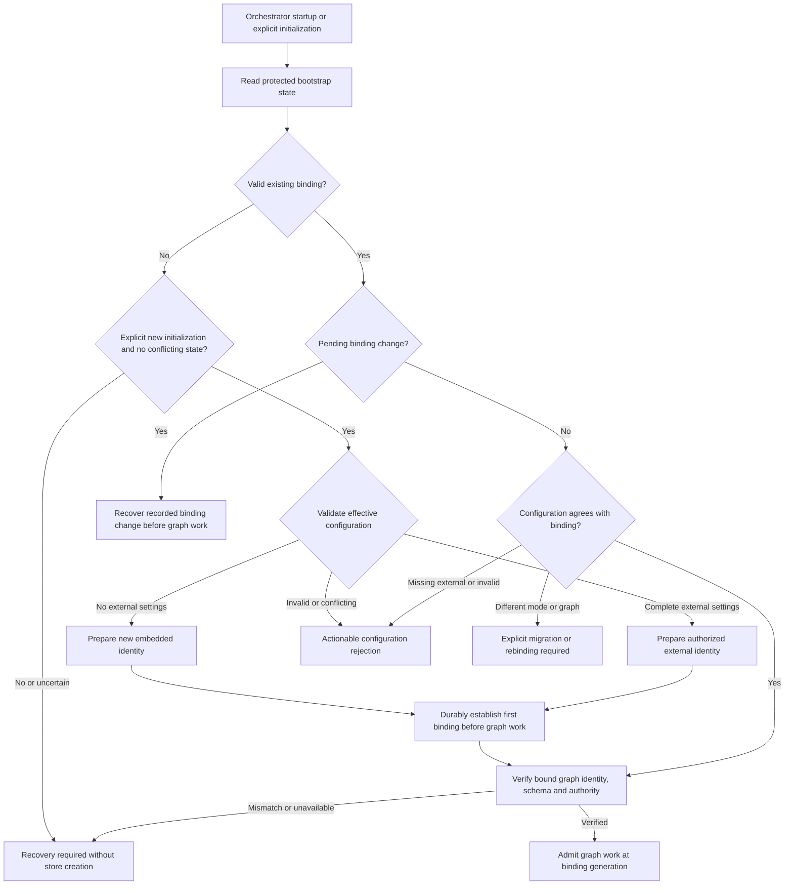
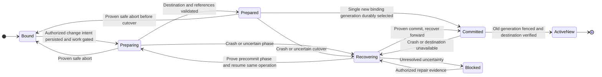
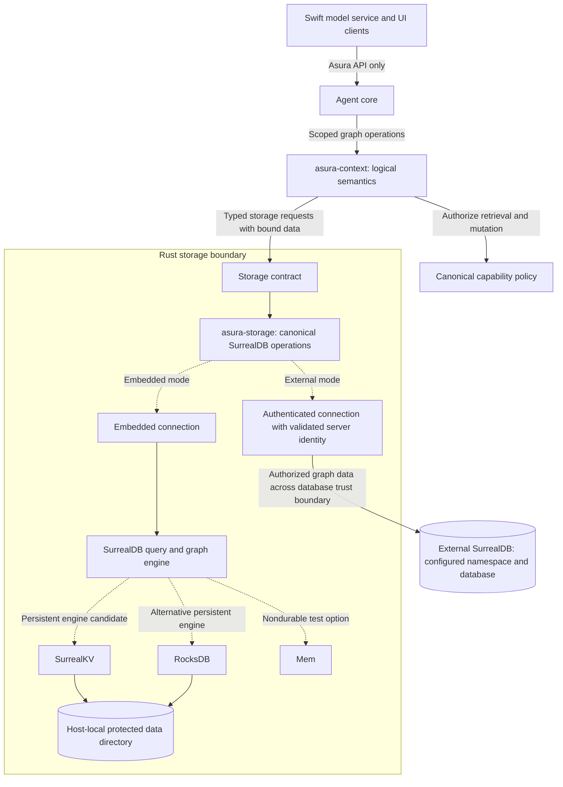
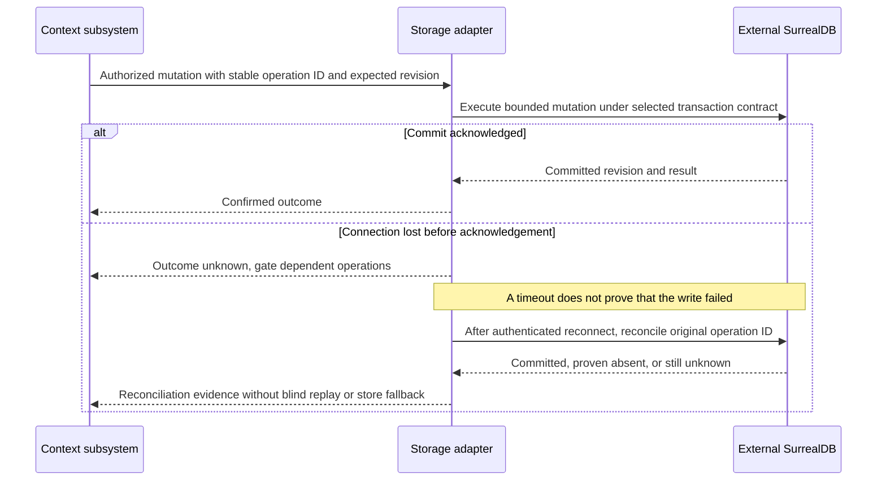
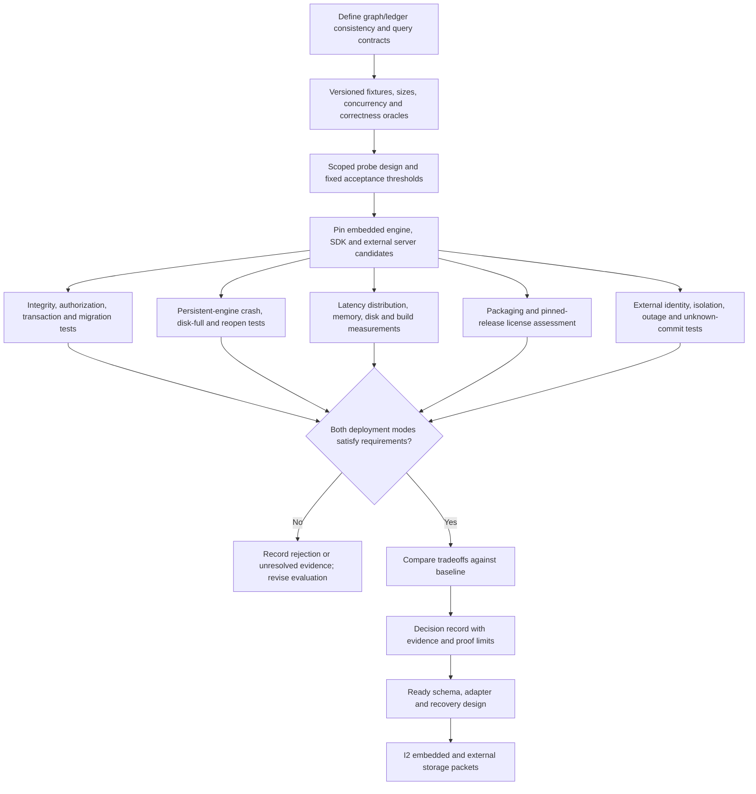

# Context storage: embedded and external SurrealDB

Status: required deployment behavior, with proposed mechanisms.
Remaining decisions: SDK/server versions, embedded engine, transport and
persistence contracts.

Evidence: embedded documentation checked on 2026-09-19; external SDK support
checked on 2026-09-20. No runtime validation exists. This assessment feeds D3-D4 in the
[architecture and design plan](../plans/architecture-and-design.md).

## Required deployment choices

Asura must support embedded SurrealDB and a configured external SurrealDB
connection for the context graph. External mode must not require opening or
initializing an embedded graph database. Both modes use the same graph and storage contract,
with the same conformance fixtures.

For a new installation, the orchestrator selects the configured external
connection if one exists. Otherwise, it selects embedded SurrealDB. When reopening
an installation, it first checks the persisted graph binding. The binding records
which graph belongs to the installation. Network discovery or a connection-health
probe must not select the store.

| Installation state and effective configuration | Required behavior |
| --- | --- |
| New installation initialization, no external connection configured | Select and bind the embedded graph store |
| New installation initialization, complete valid external connection configured | Select and bind that external graph store without initializing an embedded one |
| Existing embedded binding, no external connection configured | Reopen the bound embedded graph after identity verification |
| Existing external binding, matching complete external configuration | Reopen the bound external graph after identity verification |
| Existing external binding, external configuration missing | Report missing configuration and retain the external binding, do not initialize embedded storage |
| Existing binding, configuration changes mode or logical database identity | Require an authorized migration/rebinding operation, do not open a replacement as the active graph |
| Missing, corrupt or ambiguous bootstrap identity on reopen | Enter recovery with graph-dependent work unavailable, do not infer a new installation from absence alone |
| Partial, invalid or conflicting external settings | Reject configuration with an actionable error, do not treat it as absent |
| Configured external database unavailable or authentication fails | Report the external-mode failure, do not switch to embedded storage |

Each installation has one active graph store. A mode or graph identity change
requires an explicit, validated operation with a designed migration or rebinding
procedure. Asura must not silently create an empty replacement, write to both
stores, replicate between them, or fall back to embedded storage after an external
failure.

D3 must separately decide where the task/action ledger resides. An external graph
does not require remote storage of policy, credentials or other installation state.

## Selected installation binding and change contract

Required behavior, selected in [ADR 0001](../decisions/0001-context-store-binding.md).
This section defines startup and binding changes. See the [glossary](../glossary.md)
for binding, generation, admission and fencing.

The orchestrator owns the installation lifecycle and active binding. The proposed
language allocation places it in Rust. It uses the Rust storage adapter to persist
metadata and verify graph identity. The context subsystem owns graph rules and
reference validation. Swift model/platform adapters and control clients must not
select a store independently or repair a binding.

Platform adapters may provide protected-file and credential operations after
D1-D2 defines those contracts. Process boundaries and IPC/FFI remain open. The
external database is a separate server and trust boundary. It does not coordinate
Asura tasks.

The storage adapter must persist a protected bootstrap record independently of
the graph. An external graph outage must not erase the installation's binding.
This local record does not require an embedded graph database. It contains:

- Installation identity and active graph identity.
- Deployment mode and binding generation.
- The identity and phase of any pending binding change.
- Credential references where needed, but never credentials.

D3 must select the record format, atomic update mechanism and recovery procedure.
D1 must define protection against tampering and rollback, including trust limits
for local administrators. A filename or connection URL alone is not graph identity.

The binding includes the graph identity and its namespace/database or embedded
store identity. An endpoint address locates an external graph. Changing that
address may retain the binding if the adapter verifies the same graph. Server
trust and egress policy still apply. Recreating a database under the same name
must not give it the same graph identity.

D3 must define durable graph identity and verification during reopen. Verification
must not implicitly create a graph. Credential rotation may preserve the binding,
but still requires current authority.

On normal startup, the orchestrator reads and validates bootstrap state before
applying initialization defaults. Only explicit initialization may establish the
first binding. Missing files during reopen require recovery.

Initialization must detect existing installation, ledger and store references.
It must reject accidental reuse. A deliberately separate installation needs a
separate identity and state scope. Missing embedded data also requires recovery;
it must not cause creation of an empty replacement. Diagnostics must show the
resolved mode, binding generation and repair action without exposing secrets.

### Startup binding admission

Selected behavior. Arrows label admission decisions, not a chosen persistence
algorithm. Recovery reports an actionable error and prevents graph-dependent work.

### Explicit migration and rebinding

An authorized control caller requests an administrative binding change. The
request includes a stable operation ID, expected current binding generation and
destination graph. It also selects one of two actions: migrate the existing graph,
or bind a graph that has already been prepared. Editing configuration alone
cannot authorize either action. A model proposal cannot grant authority.

The orchestrator coordinates changes in this order:

1. Authorize the change and any data egress through the canonical policy.
2. Serialize the change against other binding changes. Persist the change intent
   before mutations. Prevent new work that needs the graph, and prevent stale
   owners from writing before validation or cutover.
3. Settle or reconcile outstanding actions and graph/ledger writes. An unresolved
   effect blocks cutover.
4. Prepare and validate the destination snapshot and references while it remains
   inactive. Persist each recovery phase before the mutations it governs.
5. Durably commit one binding generation before allowing work on that generation.

These steps require a recovery protocol. They do not assume one transaction can
span bootstrap metadata, the ledger and the graph. Clients show the impact and
result through the control contract.

Late results remain evidence for their recorded source generation. They must not
mutate the graph that happens to be active after a switch.

Migration must preserve graph references needed by task and action state. A change
to a different graph requires a disposition for every existing reference. The
operation must either verify preserved or remapped references, or use a designed
archive boundary that prevents old tasks from resuming against the new graph.
The orchestrator rejects switches with unresolved references. It must not present
an empty replacement as recovered history.

Until recovery proves which generation is active, neither graph may accept task
work. Retain the source until cutover and validation are confirmed. Deleting the
source requires a separate authorized operation.

Before committed cutover, an abort may restore work on the source only if two
conditions hold. No destination generation became active, and source/reference
consistency still holds. After committed cutover, recovery must continue towards
the destination. Automatic rollback is forbidden because it could split task
history across two graphs. A reverse migration requires a new authorized
operation. A timeout or client disconnect does not mean the change was aborted.

### Binding change recovery states

Selected logical state contract. Arrows name durable evidence or recovery results.
The concrete commit marker, fencing and cross-store reconciliation are D3 gates.

### Binding acceptance cases

Required acceptance cases. Every failure case must check that no unrelated empty
graph is created and no stale binding permits work. These tests are not yet
implemented.

| Case | Behavior |
| --- | --- |
| [B1](#b1-first-initialization-and-reopen) | Initialize and reopen the selected store |
| [B2](#b2-configuration-or-graph-identity-loss) | Reject missing or mismatched identity |
| [B3](#b3-authorized-change-and-reference-safety) | Change stores without breaking references |
| [B4](#b4-interrupted-change-and-stale-owners) | Recover one active generation after interruption |
| [B5](#b5-compatible-connection-maintenance) | Maintain a connection without substituting a graph |

#### B1: first initialization and reopen

- **Initial state:** A new installation, or an installation with a valid binding.
- **Trigger:** Initialize or restart using embedded or complete external settings.
- **Required result:** Apply the selection table. Reopen the same graph after
  restart. External mode must not initialize an embedded graph.
- **Unit:** Distinguish initialization, reopen and malformed settings.
- **Integration:** Verify persistent identity across restart with embedded storage
  and a real external server. Verify that external mode needs no embedded graph.
- **End-to-end:** Use the CLI to initialize the embedded default and reopen its
  history. Run the configured external workflow and check for no embedded graph.

#### B2: configuration or graph identity loss

- **Initial state:** An installation has an existing graph binding.
- **Trigger:** Remove external settings or embedded data. Corrupt bootstrap
  metadata, or recreate the external database under its existing name.
- **Required result:** Reject reopen with configuration or recovery guidance.
  Missing state must not cause initialization of a new installation.
- **Unit:** Reject missing external settings and mismatched graph identity.
- **Integration:** Inject each trigger using real persistent stores. Check that
  graph-dependent work cannot start.
- **End-to-end:** Restart through the CLI. Show the retained mode and required
  repair, rather than a new empty task history.

#### B3: authorized change and reference safety

- **Initial state:** A bound graph contains evidence referenced by task/action state.
- **Trigger:** Request a mode or graph change, or change configuration alone.
- **Required result:** An authorized operation preserves or verifies remapped
  references. Only one generation accepts work. Configuration alone cannot switch
  the graph.
- **Unit:** Reject a conflicting expected generation, an unauthorized destination,
  or unresolved task references.
- **Integration:** Migrate between real embedded and external stores with ledger
  references. Verify those references and the single active generation.
- **End-to-end:** Complete an explicit change and inspect prior task evidence.
  Verify that configuration-only switches are rejected.

#### B4: interrupted change and stale owners

- **Initial state:** A binding change is in progress.
- **Trigger:** Crash at each phase, lose acknowledgements, or race two owners.
- **Required result:** Recover one generation using the recorded operation.
  Recovery has bounded retry or a blocked outcome. Committed cutover cannot
  automatically abort.
- **Unit:** Exercise every recovery state and reject rollback after commit.
- **Integration:** Terminate before and after intent persistence, preparation,
  binding commit and work admission. Race owners and lose acknowledgements.
  Verify one active generation after recovery.
- **End-to-end:** Reconnect or restart. Show the same operation, with either a
  completed change or an actionable recovery state. No duplicate writable history
  may appear.

#### B5: compatible connection maintenance

- **Initial state:** An installation uses a verified external graph.
- **Trigger:** Rotate credentials or change the endpoint address.
- **Required result:** Preserve the binding only if graph identity, trust and
  policy checks pass.
- **Unit:** Verify the identity, trust and policy conditions for maintenance.
- **Integration:** Rotate credentials and relocate the endpoint. Include a server
  that impersonates the destination and a destination with an empty graph.
- **End-to-end:** Show the same graph history after authorized maintenance.
  Report a typed failure if the destination substitutes a different identity.

Before implementation, D3 must define the identity schema, reference disposition,
atomic binding commit, fencing, bootstrap backup/restore and rollback detection,
plus recovery when the ledger itself is unavailable. D6 must specify initialization,
administrative authorization, effective configuration and repair workflows. D7 must
define fault-injection points and live environments for B1-B5. These remain
readiness blockers, not optional implementation choices.

## Confirmed documentation support

SurrealDB's Rust SDK supports running the database inside the application process
without a separate database server. Its documented options include in-memory
`Mem` and persistent RocksDB or SurrealKV storage. The Rust API uses async calls.
See the official [Rust embedding overview](https://surrealdb.com/docs/build/embedding/by-language/rust)
and [embedding guide](https://surrealdb.com/docs/reference/rust/embedding).

The [`surrealdb` local-engine API](https://docs.rs/surrealdb/latest/surrealdb/engine/local/index.html)
documents feature-gated embedded engines, including `kv-mem`, `kv-rocksdb`, and
`kv-surrealkv`. Pin a release and verify its exported types, features, transitive
dependencies, and supported toolchain before designing concrete configuration;
the current generated page includes examples referring to older versions.

The Rust SDK also documents connecting to external endpoints, including secure
WebSocket connections, selecting a namespace/database and authenticating. See
[connect](https://surrealdb.com/docs/reference/rust/methods/connect),
[namespace/database selection](https://surrealdb.com/docs/reference/rust/methods/use),
and [sign-in](https://surrealdb.com/docs/reference/rust/methods/signin). These establish
SDK support, not Asura connectivity, compatibility or security proof. Pin and test
the chosen SDK/server pair and authentication method before implementation.

SurrealQL's [`RELATE`](https://surrealdb.com/docs/reference/query-language/statements/relate)
creates graph edges that can carry their own fields and be traversed in queries.
Its documentation also distinguishes default relation creation from enforced
endpoint existence. Asura must specify and test the required integrity constraints.

SurrealDB and SurrealKV are distinct choices: embedded SurrealDB includes the
query/graph layer, while SurrealKV alone is a lower-level key-value engine. The
project's [component overview](https://surrealdb.com/opensource) describes that
separation. Choosing SurrealKV alone would leave Asura responsible for additional
graph query/indexing functionality.

## Proposed fit and ownership

SurrealDB's documented features make it a plausible candidate for versioned
evidence nodes, metadata-bearing provenance edges, and dependency traversal.
This is an architectural inference, not a measured performance or reliability result.

Keep the logical graph contract in `asura-context` and the database implementation
in `asura-storage`, following the proposed Rust layout. Clients and the Swift
model service access graph operations through Asura contracts; they do not open
the database or supply arbitrary SurrealQL. Storage adapters accept typed requests
and bind data parameters. Authorization remains with Asura's canonical policy.

For embedded mode, propose one storage-owning Asura process per database directory.
For external mode, the storage adapter owns the connection and verifies the
graph identity in the orchestrator's active binding. The evaluation must establish
locking, transactions and concurrency behavior.

Connecting to a shared server does not authorize multiple orchestrators to own
one graph. D3 must define isolation, allow only one owner to write, and reject
writes from stale owners. Multiple writers require an explicit coordination design before that topology
is allowed. Remote Asura hosts still use host/control protocols; a shared
database is not a control plane or permission to bypass host authorization.

### Candidate storage boundary and alternatives

Required deployment alternatives with proposed internal allocation. Solid arrows
show calls and storage flow; dotted arrows show mutually exclusive configured
modes or embedded-engine candidates. Support both modes, activate one graph store.

Current grant checks remain part of the Asura operation boundary in both modes.
Transport/engine bindings must not duplicate graph semantics or authorization.
Two embedded engines must not open the same data directory.

## External connection and failure contract to design

Required behavior. D6 must define the configuration schema. D3-D4 must define
security and persistence before I2.

The orchestrator must show the resolved mode in effective configuration and
diagnostics. External settings must identify the endpoint, namespace, database,
credential reference and server trust configuration. They must also set connection
and query deadlines, with bounded reconnect attempts. Embedded mode does not
require these external settings.

The orchestrator must reject ambiguous or incompatible settings. It must not
silently select another mode. Credentials belong in the selected credential
facility. Passwords and tokens must not appear in committed configuration,
connection URLs, model context, telemetry or client-visible errors. Runtime
database access must use scoped authority. Provisioning and migration require
separate authorization.

An external database is a separate disclosure destination, even in another process
on the same machine. Asura must authorize the destination and data before
transmission. The storage adapter must use an authenticated, encrypted connection
and verify server identity. The design must preserve sensitivity and deletion
requirements in server retention and backups.

Selecting a namespace/database does not establish isolation. Neither permission
for remote inference nor endpoint configuration authorizes database egress. D1 must
define the trust assumptions for the server and its operators.

At startup, the storage adapter must check server compatibility, authentication,
graph identity and schema revision. The design must identify who can perform
migrations. A successful connection must not automatically provision or migrate
a database.

After network loss, the storage adapter must reconcile an unknown commit using
its stable operation ID and the selected transaction/idempotency contract.
It must not blindly retry. D3 must define how graph updates coordinate with the
action ledger when the two use different stores. The design must not assume a
transaction spans both stores.

During an outage, the orchestrator must stop operations that lack required evidence
or persistence. Status and cancellation handling must not wait for database calls.
Clients must report which capabilities are unavailable. The orchestrator may
acknowledge durable control acceptance only after the authority store persists it.

D3 must define authorized reconciliation and cleanup during failure. This includes
failure of a remote authority store. A stale cache must not silently replace
current authority or required evidence.

### External write with an ambiguous outcome

Proposed D3-D4 sequence. Arrows show persistence calls and recovery evidence;
transaction syntax, transport and reconciliation algorithm remain design work.

## Evaluation required before selection

| Area | Evidence to collect |
| --- | --- |
| Graph semantics | Typed nodes/edges, endpoint integrity, unique/versioned relations, cycles, provenance traversal, workspace scoping and stale-evidence invalidation |
| Representative queries | Bounded neighborhood retrieval, dependency closure, source-to-summary invalidation, evidence supporting a decision, revision-filtered context assembly |
| Consistency and recovery | Atomic changes, concurrent readers/writers, conflict handling, reopen after forced termination, disk-full behavior, corruption reporting, and graph/ledger reconciliation |
| Responsiveness | Query cancellation/deadlines and bounded query complexity; p50/p95/p99 context assembly under simultaneous ingestion and agent activity |
| Resource cost | Cold start, idle/peak memory, disk growth, compaction, binary size, clean/incremental build time and transitive native dependencies on Apple silicon |
| Security | Workspace/task isolation, query parameterization, selected database capabilities, file protection, backup/deletion behavior and outbound network restrictions |
| Operations | Schema/data migrations, backup/restore, supported upgrades, rollback limits, export and recovery into a replacement backend |
| Distribution | Exact release and feature compatibility, license and notice obligations for embedded components and intended Asura distribution |
| External deployment | Authenticated connectivity, server identity rejection, namespace/database isolation, SDK/server compatibility, credential rotation, network partitions, unknown commits, server restart, migration fencing and cancellation responsiveness during outage |

Evaluate both embedded and external SurrealDB against the same logical workload,
including server/network latency and failure injection for external operation.
Compare persistent embedded SurrealDB with SurrealKV storage against a simple
SQLite node/edge-table benchmark baseline. Keep RocksDB as another embedded engine
option if evidence warrants it. SQLite is an evaluation baseline, not a substitute
for the required external SurrealDB capability or a promised production backend.

Define workload sizes, concurrency, graph shapes, query correctness oracles and
acceptance thresholds in a scoped evaluation design before writing probe code.
Use the same logical fixtures and requirements for each candidate. In-memory
success cannot establish persistent-engine crash recovery or durability.

Unit cases must cover the selection table, configuration rejection, secret
redaction, bounded retries and unknown-outcome state transitions.

Integration tests must use persistent embedded storage and an authenticated
external server. They must cover lost commit acknowledgements, schema mismatch,
invalid identity and outage.

End-to-end tests must run the same CLI context/restart workflow in both modes.
They must verify the embedded default and external operation without an embedded
graph. They must also verify no fallback and responsive controls during outages.
Add dedicated-host network evidence before claiming off-machine support.
An in-process mock does not exercise this boundary.

### Storage decision gate

Proposed D3-D4 evaluation workflow. Edges identify evidence dependencies for both
required deployment modes and selection of concrete versions/engines.

The [core database license](https://github.com/surrealdb/surrealdb/blob/main/LICENSE)
inspected is Business Source License 1.1 with an additional-use restriction on
Database Service offerings. Review the exact pinned release and intended product
behavior; permissive licensing of a separate SDK or storage engine does not
establish the license of the embedded database core. No licensing conclusion for
Asura has been made here.

## Selection output

Produce a decision record with the chosen embedded engine and SDK/server versions,
features, external connection/authentication contract, query/schema
design, ownership and transaction boundaries, failure semantics, test/benchmark
results, distribution findings and alternatives. Resolve the decision before
implementing persistent graph storage. Keep Asura's domain contract stable so
database details do not spread into orchestration or presentation logic.
