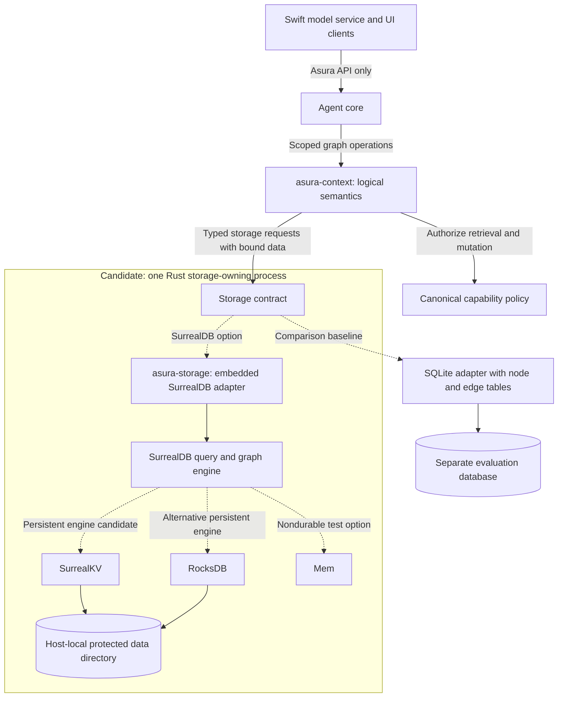
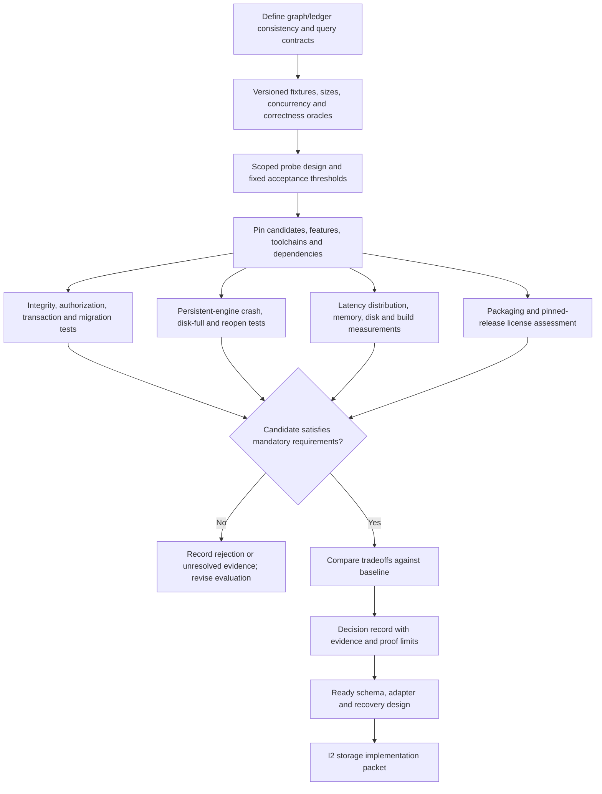

# Context storage candidate: embedded SurrealDB

Status: research candidate, not selected. Documentation checked on 2026-09-19.
No dependency, benchmark, executable probe, or runtime validation has been added.
This assessment feeds D3-D4 in the
[architecture and design plan](../plans/architecture-and-design.md).

## Confirmed documentation support

SurrealDB's Rust SDK supports running the database inside the application process
without a separate database server. Its documented options include in-memory
`Mem` and persistent RocksDB or SurrealKV storage. The Rust API uses async calls.
See the official [Rust embedding overview](https://surrealdb.com/docs/build/embedding/by-language/rust)
and [embedding guide](https://surrealdb.com/docs/reference/rust/embedding).

The [`surrealdb` local-engine API](https://docs.rs/surrealdb/latest/surrealdb/engine/local/index.html)
documents feature-gated embedded engines, including `kv-mem`, `kv-rocksdb`, and
`kv-surrealkv`. Pin a release and verify its exported types, features, transitive
dependencies, and supported toolchain before designing concrete configuration;
the current generated page includes examples referring to older versions.

SurrealQL's [`RELATE`](https://surrealdb.com/docs/reference/query-language/statements/relate)
creates graph edges that can carry their own fields and be traversed in queries.
Its documentation also distinguishes default relation creation from enforced
endpoint existence. Asura must specify and test the required integrity constraints.

SurrealDB and SurrealKV are distinct choices: embedded SurrealDB includes the
query/graph layer, while SurrealKV alone is a lower-level key-value engine. The
project's [component overview](https://surrealdb.com/opensource) describes that
separation. Choosing SurrealKV alone would leave Asura responsible for additional
graph query/indexing functionality.

## Proposed fit and ownership

SurrealDB's documented features make it a plausible candidate for versioned
evidence nodes, metadata-bearing provenance edges, and dependency traversal.
This is an architectural inference, not a measured performance or reliability result.

Keep the logical graph contract in `asura-context` and the database implementation
in `asura-storage`, following the proposed Rust layout. Clients and the Swift
model service access graph operations through Asura contracts; they do not open
the database or supply arbitrary SurrealQL. Storage adapters accept typed requests
and bind data parameters. Authorization remains with Asura's canonical policy.

Propose one storage-owning Asura process per database directory. Establish actual
engine locking and concurrency semantics during evaluation. Remote Asura hosts
communicate through the host/control protocols; selecting an embedded database
does not select shared-file access or database replication.

### Candidate storage boundary and alternatives

Proposal for evaluation. Solid arrows show typed calls and storage flow; dotted
arrows identify alternative adapter/engine choices. Only one production choice
is intended unless a later design establishes a need for more.

Current grant checks remain part of the Asura operation boundary regardless of
the selected database. The diagram does not imply separate live adapters will be
shipped, nor that two engines may open the same data directory.

## Evaluation required before selection

| Area | Evidence to collect |
| --- | --- |
| Graph semantics | Typed nodes/edges, endpoint integrity, unique/versioned relations, cycles, provenance traversal, workspace scoping and stale-evidence invalidation |
| Representative queries | Bounded neighborhood retrieval, dependency closure, source-to-summary invalidation, evidence supporting a decision, revision-filtered context assembly |
| Consistency and recovery | Atomic changes, concurrent readers/writers, conflict handling, reopen after forced termination, disk-full behavior, corruption reporting, and graph/ledger reconciliation |
| Responsiveness | Query cancellation/deadlines and bounded query complexity; p50/p95/p99 context assembly under simultaneous ingestion and agent activity |
| Resource cost | Cold start, idle/peak memory, disk growth, compaction, binary size, clean/incremental build time and transitive native dependencies on Apple silicon |
| Security | Workspace/task isolation, query parameterization, selected database capabilities, file protection, backup/deletion behavior and outbound network restrictions |
| Operations | Schema/data migrations, backup/restore, supported upgrades, rollback limits, export and recovery into a replacement backend |
| Distribution | Exact release and feature compatibility, license and notice obligations for embedded components and intended Asura distribution |

Compare persistent embedded SurrealDB with SurrealKV storage against a simple
SQLite node/edge-table baseline. Keep RocksDB as another SurrealDB storage option
if workload evidence warrants it. The baseline is a proposed comparison, not a
selected dependency or a requirement to maintain multiple production backends.

Define workload sizes, concurrency, graph shapes, query correctness oracles and
acceptance thresholds in a scoped evaluation design before writing probe code.
Use the same logical fixtures and requirements for each candidate. In-memory
success cannot establish persistent-engine crash recovery or durability.

### Storage decision gate

Proposed D3-D4 evaluation workflow. Edges identify evidence dependencies and
selection outcomes. No candidate is selected by this diagram.

The [core database license](https://github.com/surrealdb/surrealdb/blob/main/LICENSE)
inspected is Business Source License 1.1 with an additional-use restriction on
Database Service offerings. Review the exact pinned release and intended product
behavior; permissive licensing of a separate SDK or storage engine does not
establish the license of the embedded database core. No licensing conclusion for
Asura has been made here.

## Selection output

Produce a decision record with the chosen engine/version/features, query/schema
design, ownership and transaction boundaries, failure semantics, test/benchmark
results, distribution findings and alternatives. Resolve the decision before
implementing persistent graph storage. Keep Asura's domain contract stable so
database details do not spread into orchestration or presentation logic.
