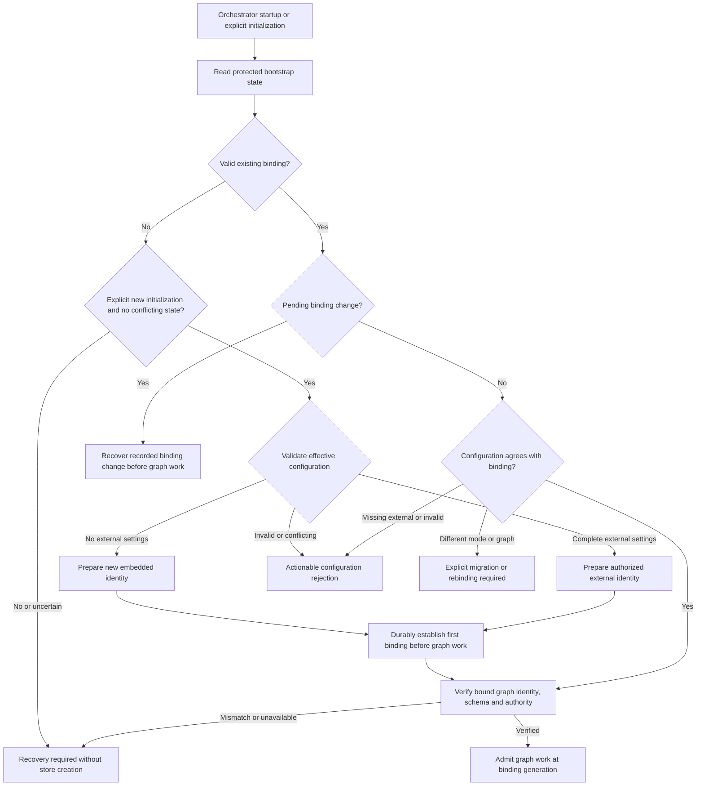
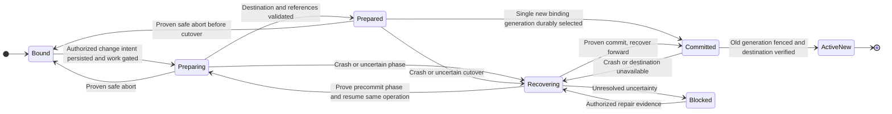
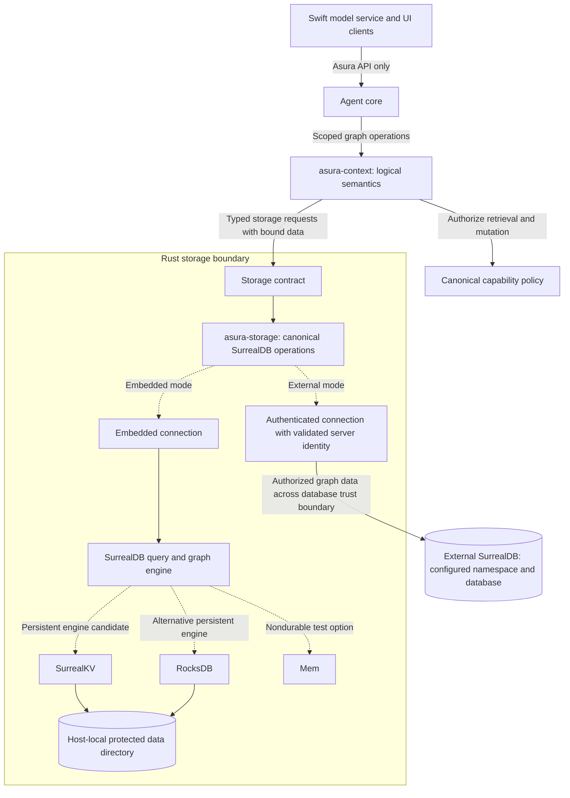
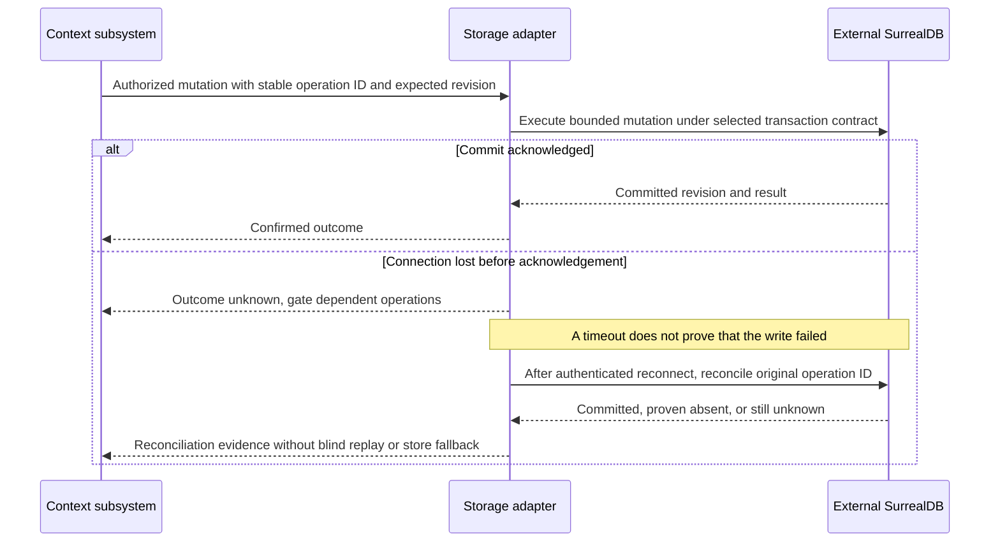
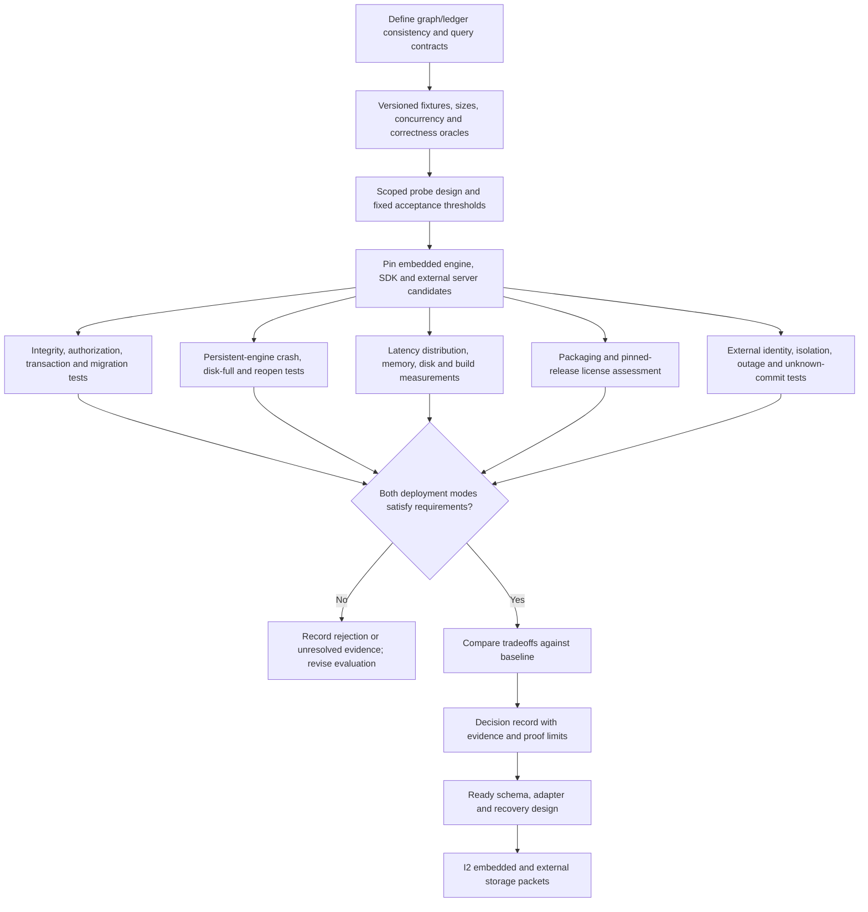

# Context storage: embedded and external SurrealDB

Status: SurrealDB deployment requirements established; exact SDK/server versions,
embedded engine, transport and persistence contracts remain under evaluation.
Embedded documentation checked on 2026-09-19; external SDK support on 2026-09-20.
No dependency, benchmark, executable probe, or runtime validation has been added.
This assessment feeds D3-D4 in the
[architecture and design plan](../plans/architecture-and-design.md).

## Required deployment choices

Asura must support configuring an external SurrealDB connection as an alternative
to embedded SurrealDB for the context graph. Embedded operation is optional:
external mode must not require opening or initializing an embedded graph database.
Both modes use the same logical context/storage contract and conformance fixtures.
When initializing a new installation, use the configured external connection when
present; otherwise use embedded SurrealDB by default. Reopening an installation
must first honor its persisted graph binding. Selection is based on validated
effective configuration and installation identity, not network discovery or a
connection-health probe. The physical embedded engine and external protocol
remain open; dependencies still require a detailed design.

| Installation state and effective configuration | Required behavior |
| --- | --- |
| New installation initialization, no external connection configured | Select and bind the embedded graph store |
| New installation initialization, complete valid external connection configured | Select and bind that external graph store without initializing an embedded one |
| Existing embedded binding, no external connection configured | Reopen the bound embedded graph after identity verification |
| Existing external binding, matching complete external configuration | Reopen the bound external graph after identity verification |
| Existing external binding, external configuration missing | Report missing configuration and retain the external binding, do not initialize embedded storage |
| Existing binding, configuration changes mode or logical database identity | Require an authorized migration/rebinding operation, do not open a replacement as the active graph |
| Missing, corrupt or ambiguous bootstrap identity on reopen | Enter recovery with graph-dependent work unavailable, do not infer a new installation from absence alone |
| Partial, invalid or conflicting external settings | Reject configuration with an actionable error, do not treat it as absent |
| Configured external database unavailable or authentication fails | Report the external-mode failure, do not switch to embedded storage |

Choose one active graph store for a configured Asura installation. Switching mode
or database identity must be an explicit, validated operation with a designed
data-migration/rebinding procedure. Do not silently create an empty replacement,
dual-write, replicate, or fall back from an unavailable external database to an
embedded store. The task/action ledger's location remains a separate D3 decision;
an external graph does not imply remote storage of policy, credentials or all state.

## Selected installation binding and change contract

Selected behavioral constraint, recorded in [ADR 0001](../decisions/0001-context-store-binding.md).
This section owns the startup and rebinding semantics; it is not a ready storage
implementation design. The orchestrator owns installation lifecycle and the
active binding. Under the proposed language allocation it is Rust, using the Rust
storage adapter for durable metadata and identity checks. The context subsystem
owns graph semantics and reference validation. Swift model/platform adapters and
all control clients neither select a store independently nor repair a binding.
Platform adapters may implement narrow protected-file/credential operations after
D1-D2 selects their contract. Exact processes and IPC/FFI remain open; the external
database is a separate server and trust boundary, never a coordination authority.

Persist a protected bootstrap record independently of the context graph so an
external graph outage cannot erase the fact that the installation uses it. This
host-local metadata does not require an embedded graph database. Logically it
contains installation identity, active graph identity, deployment mode, binding
generation and any pending change identity/phase. It contains credential references
where needed, never credentials. D3 selects its durable representation, atomic
update and recovery mechanism; D1 defines tamper/rollback and local-administrator
trust limits. A filename or connection URL alone is not graph identity.

The binding includes the logical graph identity and its namespace/database or
embedded-store identity. Endpoint addresses locate an external graph; changing an
address for the same verified graph is distinct from changing graphs and remains
subject to server trust and egress policy. Recreating a database under the same
name must not make it the same graph. D3 must define durable graph identity and
how the adapter verifies it without implicitly creating a graph during reopen.
Credential rotation may preserve binding identity but requires current authority.

Normal startup reads and validates bootstrap state before applying initialization
defaults. Only a new-installation initialization operation may establish a first
binding; missing files during reopen are a recovery condition. Initialization must
detect existing installation/ledger/store references and reject accidental reuse.
Creating a deliberately separate installation must use a separate identity and
state scope. Existing embedded data missing from its bound location is likewise a
recovery error, not permission to create an empty replacement. Diagnostics expose
the resolved mode, binding generation and repair action without secrets.

### Startup binding admission

Selected behavior. Arrows label admission decisions, not a chosen persistence
algorithm. Recovery reports an actionable error and prevents graph-dependent work.

### Explicit migration and rebinding

An authorized administrative control operation names its stable operation ID,
expected current binding generation, destination identity and intended semantics:
either migrate the existing graph or bind an independently prepared graph. Merely
editing configuration cannot authorize either. The orchestrator serializes changes,
gates new graph-dependent work and fences stale owners before validation/cutover.
Settle or explicitly reconcile in-flight actions and graph/ledger writes before
validating the destination snapshot and its references; an unresolved effect
blocks cutover. Late results remain evidence for the recorded source generation
and cannot mutate whichever graph happens to be active after a switch.
Canonical policy authorizes the change and any data egress; clients present its
impact and result through the control contract. No model proposal grants authority.

Migration preserves graph references needed by task/action state. Rebinding to a
different graph requires an explicit disposition for every existing reference:
verified remapping/preserved identity, or a designed archived installation boundary
that prevents old tasks from resuming against the new graph. Reject a switch with
unresolved references. An empty replacement is never presented as recovered history.
Do not assume atomic transactions span bootstrap metadata, ledger and graph.

Persist the change intent and recovery phase before mutations, prepare/validate
the destination while it is inactive, and durably commit a single binding
generation before admitting work there. Until the recovery protocol proves which
generation is active, neither graph admits task work. Retain the source until
cutover and validation are confirmed; deletion is a separate authorized operation.
Before committed cutover, an abort may restore source admission only after proving
that no destination generation became active and source/reference consistency
still holds. After committed cutover, recover forward to the destination; an
automatic rollback could split history and is forbidden. A later reverse migration
is a new authorized operation. Timeouts and client disconnects do not imply abort.

### Binding change recovery states

Selected logical state contract. Arrows name durable evidence or recovery results.
The concrete commit marker, fencing and cross-store reconciliation are D3 gates.

### Binding acceptance cases

Required future evidence, not tests already executed. All failure cases assert
that no unrelated empty graph is initialized and no stale binding admits work.

| Case | Unit acceptance | Integration acceptance | End-to-end acceptance |
| --- | --- | --- | --- |
| B1: first initialization and reopen | Selection table distinguishes initialization, reopen and malformed settings | Persistent embedded and real external stores keep identity across restart; external mode needs no embedded graph | CLI initializes embedded by default and reopens its history; configured external workflow creates no embedded graph |
| B2: configuration or graph identity loss | Missing external config and identity mismatch reject reopen; absence alone cannot mean new installation | Remove profile/environment settings, corrupt bootstrap metadata, remove embedded data and recreate external database under the same name; admission fails safely | Restart reports recovery/configuration action and retained mode instead of a new empty task history |
| B3: authorized change and reference safety | Expected-generation conflicts, unauthorized destinations and unresolved task references reject change | Migrate between modes with real stores and ledger references, verify preserved/remapped references and one active generation | Explicit change preserves inspectable prior task evidence, while config-only switches are rejected |
| B4: interrupted change and stale owners | Every recovery state has bounded retry or blocked outcome; committed cutover cannot auto-abort | Terminate before/after intent, preparation, binding commit and admission; race two owners and lost acknowledgements; recover one generation | Reconnect/restart shows the same operation and either completed change or actionable recovery, never duplicate writable histories |
| B5: compatible connection maintenance | Credential/endpoint change preserves binding only when graph identity, trust and policy match | Exercise credential rotation and endpoint relocation with identity checks, including an impersonating or empty destination | User sees stable graph history on authorized maintenance and a typed failure on identity substitution |

Before implementation, D3 must define the identity schema, reference disposition,
atomic binding commit, fencing, bootstrap backup/restore and rollback detection,
plus recovery when the ledger itself is unavailable. D6 must specify initialization,
administrative authorization, effective configuration and repair workflows. D7 must
define fault-injection points and live environments for B1-B5. These remain
readiness blockers, not optional implementation choices.

## Confirmed documentation support

SurrealDB's Rust SDK supports running the database inside the application process
without a separate database server. Its documented options include in-memory
`Mem` and persistent RocksDB or SurrealKV storage. The Rust API uses async calls.
See the official [Rust embedding overview](https://surrealdb.com/docs/build/embedding/by-language/rust)
and [embedding guide](https://surrealdb.com/docs/reference/rust/embedding).

The [`surrealdb` local-engine API](https://docs.rs/surrealdb/latest/surrealdb/engine/local/index.html)
documents feature-gated embedded engines, including `kv-mem`, `kv-rocksdb`, and
`kv-surrealkv`. Pin a release and verify its exported types, features, transitive
dependencies, and supported toolchain before designing concrete configuration;
the current generated page includes examples referring to older versions.

The Rust SDK also documents connecting to external endpoints, including secure
WebSocket connections, selecting a namespace/database and authenticating. See
[connect](https://surrealdb.com/docs/reference/rust/methods/connect),
[namespace/database selection](https://surrealdb.com/docs/reference/rust/methods/use),
and [sign-in](https://surrealdb.com/docs/reference/rust/methods/signin). These establish
SDK support, not Asura connectivity, compatibility or security proof. Pin and test
the chosen SDK/server pair and authentication method before implementation.

SurrealQL's [`RELATE`](https://surrealdb.com/docs/reference/query-language/statements/relate)
creates graph edges that can carry their own fields and be traversed in queries.
Its documentation also distinguishes default relation creation from enforced
endpoint existence. Asura must specify and test the required integrity constraints.

SurrealDB and SurrealKV are distinct choices: embedded SurrealDB includes the
query/graph layer, while SurrealKV alone is a lower-level key-value engine. The
project's [component overview](https://surrealdb.com/opensource) describes that
separation. Choosing SurrealKV alone would leave Asura responsible for additional
graph query/indexing functionality.

## Proposed fit and ownership

SurrealDB's documented features make it a plausible candidate for versioned
evidence nodes, metadata-bearing provenance edges, and dependency traversal.
This is an architectural inference, not a measured performance or reliability result.

Keep the logical graph contract in `asura-context` and the database implementation
in `asura-storage`, following the proposed Rust layout. Clients and the Swift
model service access graph operations through Asura contracts; they do not open
the database or supply arbitrary SurrealQL. Storage adapters accept typed requests
and bind data parameters. Authorization remains with Asura's canonical policy.

For embedded mode, propose one storage-owning Asura process per database directory.
For external mode, the storage adapter owns the connection and verifies the
logical graph identity requested by the orchestrator's active binding. Establish actual locking, transactions and concurrency
semantics during evaluation. Connecting to a shared server does not authorize
multiple orchestrators to own one graph: D3 must define isolation and enforce
single-owner fencing, or design explicit multi-writer coordination before allowing
that topology. Remote Asura hosts still use host/control protocols; a shared
database is not a control plane or permission to bypass host authorization.

### Candidate storage boundary and alternatives

Required deployment alternatives with proposed internal allocation. Solid arrows
show calls and storage flow; dotted arrows show mutually exclusive configured
modes or embedded-engine candidates. Support both modes, activate one graph store.

Current grant checks remain part of the Asura operation boundary in both modes.
Transport/engine bindings must not duplicate graph semantics or authorization.
Two embedded engines must not open the same data directory.

## External connection and failure contract to design

The final configuration schema belongs to D6, with its security and persistence
contract established in D3-D4 before I2. Expose the resolved mode in effective
configuration and diagnostics. External connection settings include endpoint,
namespace, database, credential reference, server trust settings, connection/query
deadlines and bounded reconnect limits. External settings are not required for
the embedded default. Reject ambiguous or incompatible settings rather than
silently choosing another mode. Credentials belong in the selected credential facility;
do not put passwords/tokens in committed config, connection URLs, model context,
telemetry or client-visible errors. Use scoped runtime database authority and
separate authorization for provisioning or migrations.

External storage is its own disclosure destination, including a server on another
local process or machine. Authorize the destination and allowed data before any
transmission, require authenticated encrypted connections and verified server
identity, and preserve graph sensitivity/deletion requirements across server-side
retention and backups. Selecting a namespace/database is not proof of isolation.
Neither remote-inference permission nor endpoint configuration alone grants data
egress authority. D1 must identify the server/operator trust assumptions.

Define startup checks for server compatibility, authentication, logical database
identity, schema revision and migration ownership. Do not automatically provision
or migrate a database merely because a connection succeeds. Unknown commit outcomes
after network loss must be reconciled using stable operation identities and the
selected transaction/idempotency contract, not blindly retried. D3 must establish
how graph updates coordinate with the action ledger when they occupy different
stores; a shared transaction must not be assumed across that boundary.

During an outage, stop operations whose required evidence or durability is
unavailable. Keep status and cancellation processing independent of database
waits, report degraded capability, and acknowledge durable control acceptance only
when the chosen authority store has persisted it. Define authorized reconciliation
and cleanup during failure, including the case where that store is also remote.
No stale cache may silently substitute for current authority or evidence.

### External write with an ambiguous outcome

Proposed D3-D4 sequence. Arrows show persistence calls and recovery evidence;
transaction syntax, transport and reconciliation algorithm remain design work.

## Evaluation required before selection

| Area | Evidence to collect |
| --- | --- |
| Graph semantics | Typed nodes/edges, endpoint integrity, unique/versioned relations, cycles, provenance traversal, workspace scoping and stale-evidence invalidation |
| Representative queries | Bounded neighborhood retrieval, dependency closure, source-to-summary invalidation, evidence supporting a decision, revision-filtered context assembly |
| Consistency and recovery | Atomic changes, concurrent readers/writers, conflict handling, reopen after forced termination, disk-full behavior, corruption reporting, and graph/ledger reconciliation |
| Responsiveness | Query cancellation/deadlines and bounded query complexity; p50/p95/p99 context assembly under simultaneous ingestion and agent activity |
| Resource cost | Cold start, idle/peak memory, disk growth, compaction, binary size, clean/incremental build time and transitive native dependencies on Apple silicon |
| Security | Workspace/task isolation, query parameterization, selected database capabilities, file protection, backup/deletion behavior and outbound network restrictions |
| Operations | Schema/data migrations, backup/restore, supported upgrades, rollback limits, export and recovery into a replacement backend |
| Distribution | Exact release and feature compatibility, license and notice obligations for embedded components and intended Asura distribution |
| External deployment | Authenticated connectivity, server identity rejection, namespace/database isolation, SDK/server compatibility, credential rotation, network partitions, unknown commits, server restart, migration fencing and cancellation responsiveness during outage |

Evaluate both embedded and external SurrealDB against the same logical workload,
including server/network latency and failure injection for external operation.
Compare persistent embedded SurrealDB with SurrealKV storage against a simple
SQLite node/edge-table benchmark baseline. Keep RocksDB as another embedded engine
option if evidence warrants it. SQLite is an evaluation baseline, not a substitute
for the required external SurrealDB capability or a promised production backend.

Define workload sizes, concurrency, graph shapes, query correctness oracles and
acceptance thresholds in a scoped evaluation design before writing probe code.
Use the same logical fixtures and requirements for each candidate. In-memory
success cannot establish persistent-engine crash recovery or durability.

Unit cases must cover the selection table above, configuration rejection, secret
redaction, bounded retries and unknown-outcome state transitions. Integration must
exercise both a persistent embedded database and an actual authenticated external server, including commits
whose acknowledgements are lost, schema mismatch, invalid identity and outage.
E2E must run the same CLI context/restart workflow in each mode, demonstrate the
embedded default with no external configuration and external mode without an
embedded graph store, and prove that outages do not cause fallback
or loss of control responsiveness. Add dedicated-host network evidence before
claiming off-machine support; an in-process mock does not exercise this boundary.

### Storage decision gate

Proposed D3-D4 evaluation workflow. Edges identify evidence dependencies for both
required deployment modes and selection of concrete versions/engines.

The [core database license](https://github.com/surrealdb/surrealdb/blob/main/LICENSE)
inspected is Business Source License 1.1 with an additional-use restriction on
Database Service offerings. Review the exact pinned release and intended product
behavior; permissive licensing of a separate SDK or storage engine does not
establish the license of the embedded database core. No licensing conclusion for
Asura has been made here.

## Selection output

Produce a decision record with the chosen embedded engine and SDK/server versions,
features, external connection/authentication contract, query/schema
design, ownership and transaction boundaries, failure semantics, test/benchmark
results, distribution findings and alternatives. Resolve the decision before
implementing persistent graph storage. Keep Asura's domain contract stable so
database details do not spread into orchestration or presentation logic.
