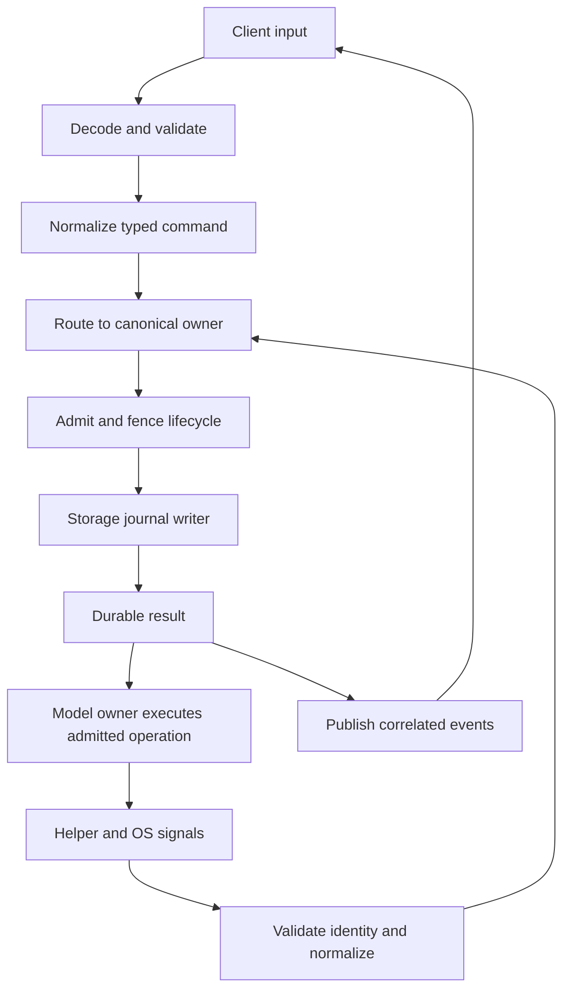
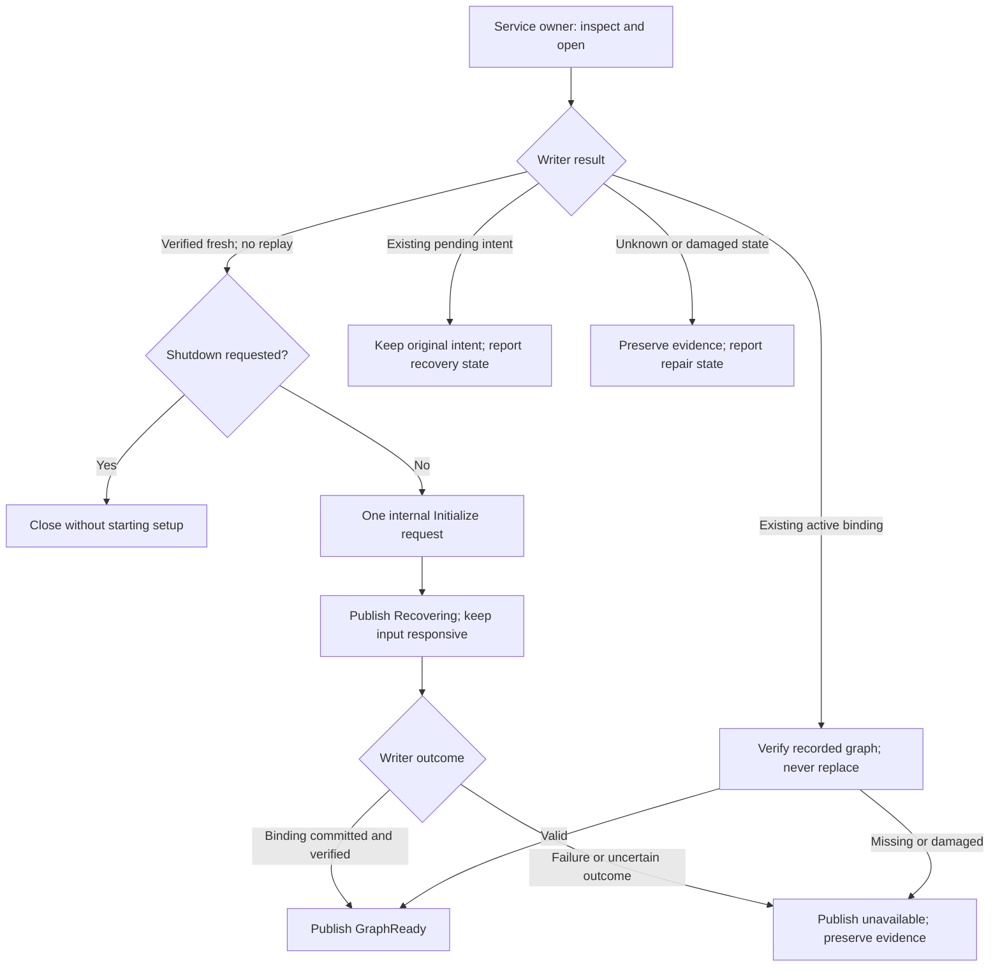
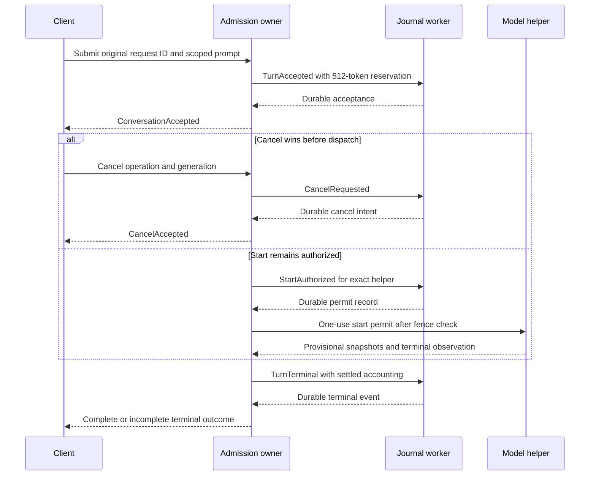
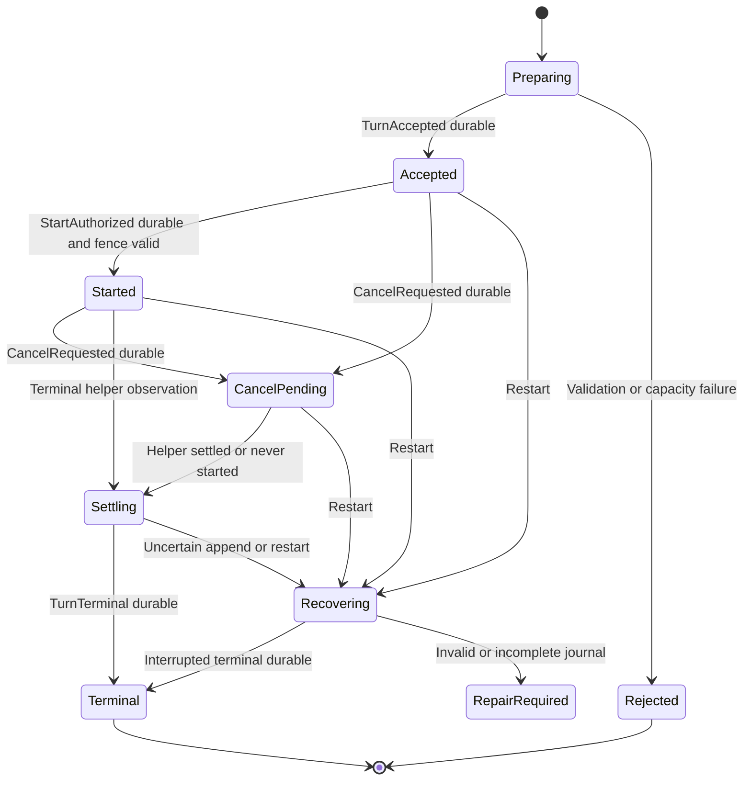
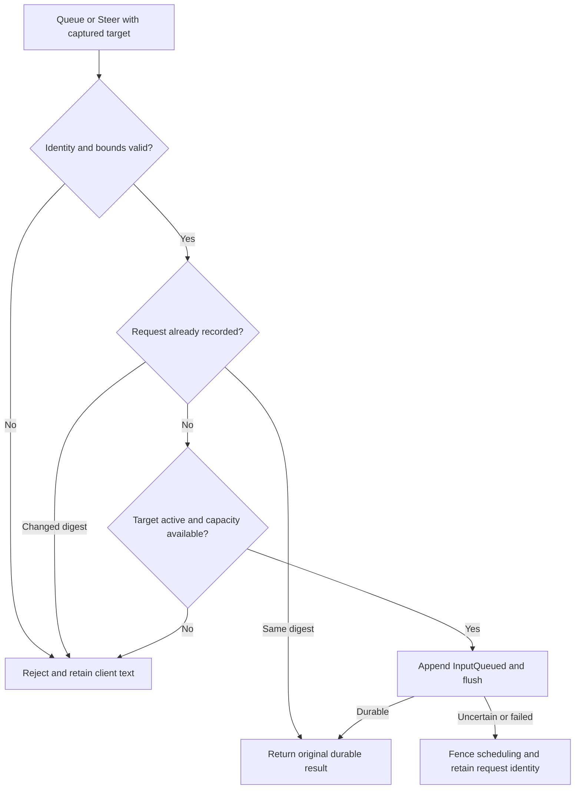
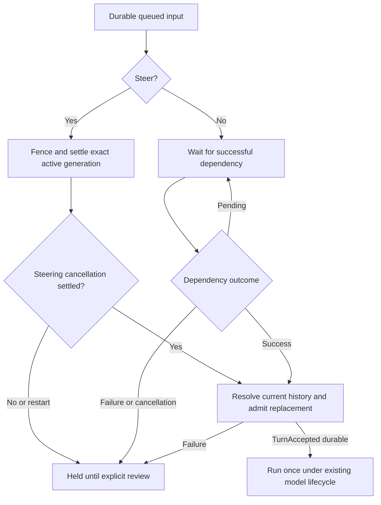
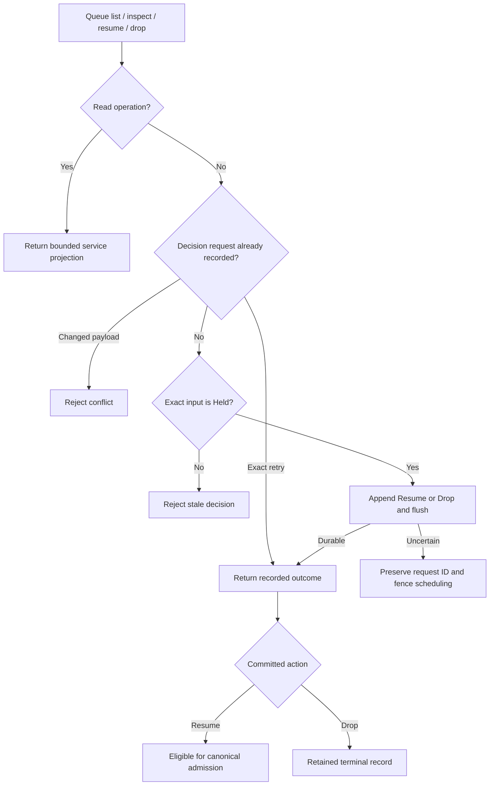
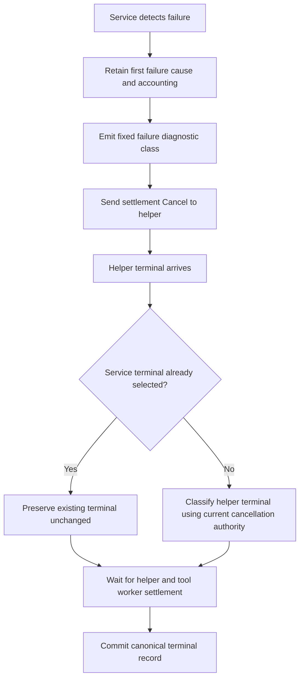
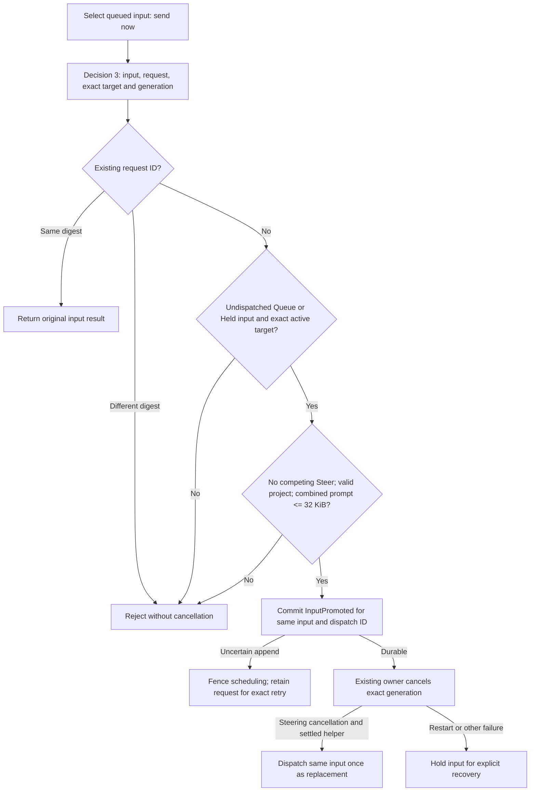
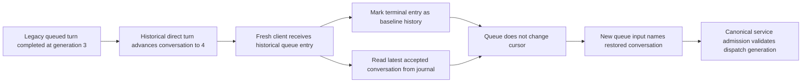

# First conversation: durable admission and recovery

Response-budget update, 2026-09-28: the [response activity contract](response-activity.md#response-limits-and-truthful-completion)
supersedes this packet's earlier 512-token budget and 256/128/128 allocations.
New admissions reserve 2,048 tokens with tool passes of 1,024/512/512. Historical
512-token journal records retain their recorded accounting. Earlier numerical
examples and validation evidence below describe that earlier packet.

Status: CA-A and CA-B implemented, with the storage validation subset below
passing on 2026-09-27. The owner authorized conversation execution and the shared
input pipeline. The implementation extends the canonical ordinary-file authority
owner and embedded graph adapter. Journal format remains 1. Fault and durability
qualification remains incomplete where explicitly listed below.

The [recovery design](persistence-recovery.md) owns the journal and installation
binding. This amendment defines format 1 and the first conversation writer.
The [model packet](platform-capabilities.md#remaining-authority-prerequisite-and-execution-order)
owns helper execution and conversation transport. The [storage ownership contract](storage-adapters.md)
places persistence in `asura-storage`; platform supplies safe OS primitives.
[ADR-0006](../decisions/0006-async-event-pipelines.md) governs both pipelines.

## Scope and canonical owners

Deliver one active text generation per service, one project per conversation,
and no tools. The initial provider is the admitted `system` model. One submitted
turn creates one task and one model operation. Both have durable identities.
The task has one operation and a 512-output-token budget. This packet does not
implement multi-step scheduling, remote providers, conversation branching, history
editing, retention deletion or journal compaction.

Required product direction: conversation models may run locally or remotely.
Classifiers run locally only, including custom classifiers. Classifier failure
must never trigger a remote-classifier fallback. Provider selection and classifier
selection are separate responsibilities. Remote conversation adapters and explicit
classifier stages are not implemented by this first-conversation packet; they
require scoped stage contracts and validation before implementation.

| Owner | Responsibility |
| --- | --- |
| Control codec | Decode version 0.1 frames and validate directions, sizes and identities |
| Shared service pipeline | Normalize commands, route to existing owners, reject unsupported capabilities |
| Orchestrator/admission owner | Project scope, conversation generation, task lifecycle, reservations, start/cancel order and terminal decisions |
| Context owner | Construct bounded history from exact committed turns, validate its generation and input digest |
| Storage authority adapter | Canonical encoding, serialized append, durable flush, replay and request-result lookup |
| Platform | Validated directory/file descriptors, local APFS checks, identity fencing and durability primitive |
| Model owner/helper | Availability, token count, actual generation, cancellation and child settlement |
| Client | Draft, request ID retention, provisional display, reconnect and observed outcomes |

A typed command passes through decode, validate, normalize, route, admit, execute
and event publication. Local presentation commands stop before backend admission.
Helper and OS signals pass through validation and normalization before reaching
the same lifecycle owner. Neither the TUI nor helper writes authority records.

### Pipeline and authority

Selected ownership proposal. Arrows carry typed requests, effects or observations.
The two input paths converge on one serialized admission owner.

## Installation and project prerequisites

Use `state/control/slot-0.log` under the validated account root. Directory mode is
0700; journal mode is 0600, current-user owned, regular and singly linked. Reuse
existing descriptor/ACL checks. Keep the service owner lock until all writers and
owned helpers settle. Log files, YAML settings and graph receipts never replace it.

Normal service startup initializes only a verified fresh installation. Initialization
creates the installation and graph identity through PendingInit, verified graph
marker and ActiveBinding. Reuse the [HM0 binding contract](hybrid-memory-ontology.md#files-binding-and-initialization-boundary).
This packet supplies format-1 request outcomes for that sequence; it does not
turn the scratch database adapter into a production initialization bypass.
A missing or mismatched embedded graph remains repair-required.

Before the first conversation, the project must have a committed registration.
The registration owner validates a directory with retained device/inode identity,
records its location and closed visibility, and rechecks identity after commit.
This is an explicit project selection/registration flow. A working directory is
a hint, not implicit registration or authority to use a replacement path.
New registration follows the existing GraphReady prerequisite. A registered text
conversation may use only journal-backed prompt/history when an external graph
is unavailable; it cannot retrieve graph evidence or register a new location.
Missing embedded data or binding mismatch never qualifies for this allowance.

Installation, graph, project, conversation, task, operation and transition IDs use
nonzero 16-byte values generated by the existing platform random-ID owner.
Request IDs come from the authenticated client. They are not paths or PID values.
Conversation generation starts at 1 and advances exactly once per accepted turn.
Only one nonterminal turn is permitted per conversation and per service.
No integer, cursor, revision or generation may wrap.

## Automatic initialization and explicit registration workflow

Normal startup must make a new installation ready without an `/init` command.
The service admission owner waits for initial inspection and the serialized
writer's Open result. Only a successful Open with no replay, verified as RuntimeOnly,
permits one internal Initialize request with a new request ID. The existing writer
rechecks the fresh-state condition and owns all initialization writes. No client
performs initialization policy, and no project is registered automatically.

The root entry `.DS_Store` is Finder metadata, not installation authority. The
platform scanner accepts only a regular file owned by the account, with one
hard link and no group or world write permission. Read permission for other
users is permitted. Existing descriptor, ACL and change validation still apply.
The scanner does not read, remove or modify its contents. It counts the entry
against the existing 64-entry limit but excludes it from installation evidence
and unknown content. Symlinks, directories and unsafe metadata remain rejected.
All other unknown names retain the existing rejection behavior.

Validation requires isolated scanner cases for safe metadata and unsafe types,
permissions and links. Real service and terminal journeys must initialize with
metadata present, reopen the same installation after restart, and complete a
repeated `/init` without replacing data. Preserve metadata bytes throughout.

An existing binding is reopened and verified. Pending initialization retains its
original intent and requires explicit recovery; automatic startup must not create
a replacement intent or graph. Unknown, damaged or missing associated data remains
unavailable. Failed automatic initialization publishes its failure and does not
retry with new IDs. Stop prevents scheduling a new initialization job; an already
submitted job settles under the existing writer deadline and shutdown contract.
Inspection and terminal input remain responsive while initialization runs. Publish
GraphReady only after the committed binding and graph have been verified.

Selected startup flow. Arrows show storage observations and the service's next
action; initialization and verification run on the existing bounded writer.

`/init` and `asura init` remain explicit setup/readiness commands. On an active
binding, their no-change response refers the user to the current installation
status. The normal path is startup, then `/project add PATH`, then a prompt.
The equivalent CLI project command uses the same service operation.
A missing project displays a project-registration instruction and preserves the draft. The TUI
must not invent a project ID or register its launch directory without a command.
For `PATH` equal to `.`, the client resolves its working directory to an absolute
UTF-8 locator; the platform owner verifies the actual directory independently.
Reject non-UTF-8 locations in this slice rather than performing lossy conversion.

Extend version-0.1 control operations through the canonical schema owner:

| Command | Typed inputs | Durable result |
| --- | --- | --- |
| InitializeInstallation | request ID, mode `embedded`, expected authority revision 0 | Installation ID, graph ID, pending/completed phase and authority revision |
| ResolveInitialization | original request ID and request digest | Original pending or committed result; unknown request never creates state |
| ProjectRegister | request ID, absolute location string | Project ID, registry revision 1, canonical location and current/stale association status |
| ProjectList | optional after-project ID, limit 1 through 8 | Ordered page of at most eight project IDs/locations/states and next cursor; complete response at most 40 KiB |

The initialization request digest covers command kind, embedded mode and expected
revision. The service records configuration revision 1 plus its validated digest
for the new installation. Same-ID retries use that original snapshot. A different
ID during PendingInit returns busy; after ActiveBinding it returns already-initialized.
The storage owner returns a distinct `AlreadyInitialized` result for a new request
ID against an active binding. It does not append records or replace the graph.
An ID already used by another command still conflicts. The service exposes
`installation_already_initialized`; clients show this as a successful no-change
setup result with guidance to list or add a project. Definite service rejections
must not be described as unconfirmed outcomes. Validation must cover a fresh-ID
repeat, unchanged journal bytes, a real service reply, and visible TUI feedback.
Root integrates these fields with HM0's initialization/resolve definitions rather
than creating duplicate operations. Unsupported external mode returns unavailable;
it never selects an embedded fallback for existing external settings/bindings.

Initialization runs through one serialized storage worker while holding the existing
service lock. It creates the protected journal directories and writes format-1
PendingInit. Then it creates or verifies only the intended embedded graph marker
using the canonical adapter. Finally it appends format-1 ActiveBinding. These are
three durable boundaries, not one cross-store transaction. Missing acknowledgement
at any boundary resolves from the original request/graph IDs. Existing partial or
unknown state is preserved for repair; no `init --force` exists in this slice.

The production graph connection must use validated account-root capabilities;
it cannot call HM0-A's scratch-only path constructor. Extract its typed query/marker
implementation behind the canonical adapter while retaining scratch-only test
constructors. Qualify no-create reopen, owner retention and identity mismatch before
service initialization is enabled. This is an explicit implementation dependency
within stage CA-B below, not permission to weaken HM0 path checks.

ProjectRegister first checks the initialized binding and GraphReady state, validates
the location through the platform owner, and looks for an existing same-object
association. A repeated original request returns its result. A new request naming
an already registered device/inode returns that project through a durable request
alias record, kind 9 below. It does not create another project. A changed path/object
cannot silently replace an association. Current/stale status is revalidated before
selection and before each admission. Registration identity and location are
immutable; the later [project-name contract](project-names.md) adds a durable
display-name update without changing either. Removal remains outside this slice.

The client retains request IDs/digests while connected and offers resolution, not
a fresh-ID retry. CLI initialization accepts an explicit `--request-id` and prints
the selected ID before submission, so an operator can retain and reuse it after
client loss. ProjectList and installation inspection provide recovery views when
that receipt was not retained. A restarted TUI first reconciles service state;
it never automatically resubmits a previous draft under a new request ID.
Durable automated client-session recovery is outside this first packet. Clients
write no control or recovery files; the existing journal remains the only authority.

## Format 1 and record compatibility

Journal format remains **1**. Format, API and protocol numbers change only when
the owner explicitly authorizes the change. Authorized feature work can add record
kinds without changing the format number.

Preserve diagnostic initialization kinds 1 and 2 and their exact payloads from the
[recovery contract](persistence-recovery.md#format-1-byte-contract). Request-bearing
PendingInit and ActiveBinding use distinct kinds 10 and 11. Kind 3 keeps its existing
OwnerGeneration meaning; kinds 4 through 9 add the conversation transitions below.
Never reinterpret an existing kind based on payload length. A stream starts with
either diagnostic kind 1 or request-bearing kind 10. The first record selects its
transition rules; mixing diagnostic and request-bearing initialization records
rejects the complete stream. Diagnostic streams remain inspectable but have no
request outcomes and cannot admit conversation writes. No automatic conversion or
startup migration is defined. Missing request authority is not a version mismatch.

Public inspection validates all transitions before returning the installation
summary, including conversation records when kind 10 starts the stream. It must
not skip unsupported kinds or return a valid prefix after an invalid transition.

Retain the 144-byte header, SHA-256 chain, 40-byte trailer, byte order and size
limits from the [format-1 contract](persistence-recovery.md#format-1-byte-contract).
The file magic remains `ASURAJ01`; every frame has header version 1. Other versions
reject. Transition operation IDs remain unique per frame. User request IDs are
payload fields and may link several transitions. The header command digest remains
SHA-256 of kind-u16 plus exact payload bytes. A separate request digest identifies
the normalized user command across retries.

Payload encoding is canonical, bounded binary data. Integers are unsigned
big-endian. IDs are 16 bytes; digests are 32 bytes. Strings are u32 byte length
followed by strict UTF-8. Lists are u16 count followed by encoded elements.
Optional values use u8 0/1 followed by the value only for 1. Reject other flags,
unknown enums, trailing bytes, duplicate IDs and allocation lengths above bounds.
Request digest input is command-kind-u16 plus the normalized request fields in
this encoding, excluding request ID and generated result IDs. Preserve prompt
bytes exactly; normalization does not trim or rewrite user text.

### Normalized request digest fields

Use SHA-256 over the following exact encodings. Numeric command kinds are separate
from the transition frame kind when a transition is a result or alias. Client
request ID, generated result IDs and current filesystem state are excluded.

| User command | Digest input, in exact order |
| --- | --- |
| InitializeInstallation | u16 1, mode u8, expected authority revision u64 (must be 0) |
| ProjectRegister | u16 4, normalized absolute location string |
| ConversationSubmit | u16 5, project ID, optional original conversation ID, expected generation u64, exact prompt string |
| ConversationCancel | u16 7, model-operation ID, conversation generation u64 |

For a create submit, the original conversation option is 0 and expected generation
is 0. For an existing conversation, the option is 1 followed by its nonzero ID,
and expected generation equals its current positive generation. TurnAccepted
retains both those original fields and the resulting conversation/generation.
A create result has generation 1 and a previously unused generated conversation ID.
An existing result keeps the original conversation ID and increments generation
once. Replay recomputes the request digest from the stored original fields before
indexing acceptance. The generated task and operation IDs must also be unused.

ProjectRegister normalization accepts an absolute UTF-8 locator with no `.` or `..`
components and no trailing separator except the filesystem root. It does not follow
symlinks or replace the locator with current filesystem metadata while hashing.
The platform independently resolves and pins the directory for admission. Alias
transitions retain the same original locator so replay recomputes command kind 4.
PendingInit has implicit expected authority revision 0 and recomputes kind 1.
Cancellation has no independent client request ID in the selected wire contract;
its operation/generation key is idempotent, and only one cancel intent is committed.
Internal deadline/shutdown cancellation retains its distinct recorded cause.

### Transition payloads

Selected minimum schema. Fields occur in the listed order. Revision/sequence and
installation/owner identity remain in the common header. All transition writes
include the complete state/result/event obligation described below.

| Kind | Payload fields in byte order | Preconditions and effect |
| --- | --- | --- |
| 10 PendingInit | request ID, request digest, mode u8, configuration revision u64, configuration digest, intended graph ID | First frame only, owner generation 1; mode 1 embedded or 2 external; creates durable pending initialization lookup |
| 11 ActiveBinding | original request ID, binding generation u64, graph ID, configuration digest | Pending intent matches; generation 1; atomically records successful initialization result |
| 3 OwnerGeneration | no payload | Previous owner generation plus 1; durable before any new dispatch |
| 4 ProjectRegistered | request ID, request digest, project ID, location string, device u64, inode u64, registry revision u64, visibility u8 | First project revision 1, visibility 1 closed; records original result and pinned association |
| 9 ProjectRequestAlias | request ID, request digest, original location string, existing project ID, registry revision u64 | Existing same-object association; records idempotent result for a new request without another project |
| 5 TurnAccepted | request ID, request digest, project ID, original conversation ID optional, expected generation u64, conversation ID, generation u64, task ID, model-operation ID, model string, configuration digest, instructions digest, input digest, prior-operation ID list, prompt string, reserved-output-tokens u32, event cursor u64 | Registry and expected generation verified; atomically creates conversation when needed, accepts task/operation, reserves exactly 512 tokens and records acceptance cursor 1 |
| 6 StartAuthorized | model-operation ID, conversation generation u64, helper-instance ID, input digest | Accepted operation, no cancel/terminal and same owner generation; one dispatch permit only |
| 7 CancelRequested | model-operation ID, conversation generation u64, cause u8 | Cause 1 user, 2 deadline, 3 output limit, 4 service shutdown; one intent per operation, existing intent wins |
| 8 TurnTerminal | model-operation ID, conversation generation u64, terminal kind u8, cause u8, final cursor u64, usage-known u8, output-tokens u32, charged-tokens u32, text string | Kind 1 complete, 2 failed, 3 cancelled, 4 interrupted; only once, helper settled where applicable; terminal task/operation, accounting and final event commit atomically |

Location is at most 4096 UTF-8 bytes. Model identity is at most 1024 bytes. Prompt
is nonempty and at most 32 KiB. Prior-operation list has at most 32 distinct IDs
from complete turns in the same conversation. Terminal text is at most 60 KiB.
Maximum frame remains 64 KiB including overhead; encode and check the entire
frame before append. At most 64 registered projects and 256 conversations are
admitted in this slice. Journal bounds remain 8 MiB and 32,768 frames. At most
one operation is nonterminal. No overwrite or deletion makes space at a limit.

Terminal cause values are closed: 0 none, 1 user cancel, 2 deadline, 3 output limit,
4 service shutdown, 5 provider failure, 6 protocol failure, 7 restart, 8 authority
failure, 9 input/context limit. Complete requires cause 0, valid terminal metadata and no committed cancel intent.
A complete response can have unknown usage; it retains the full 512-token charge.
Unknown usage requires output-tokens 0 plus usage-known 0; the flag prevents that
placeholder from being reported as measured zero. Before-start terminal usage is
known zero. A restart terminal requires interrupted kind and cause 7. Terminal
text may be empty; complete text must be nonempty. Generation, model-operation ID
and task mapping must match TurnAccepted. Cancel and start records are forbidden
after terminal. A cancellation arriving during terminal append waits for that
append's known outcome, then returns already-terminal or follows recovery; it
cannot append an intent behind a completed operation.

The serialized writer reserves capacity for terminal closure before accepting a
turn: maximum terminal frame plus one start frame, one cancel frame and one owner
frame. New normal records cannot consume that reserved byte/frame capacity.
The replay-memory bound reserves those future frame bytes and the conservative
per-transition index allocation charge as well. Normal records cannot consume
that memory reserve. A terminal commit releases unused capacity, not records.
The finite store reserves one recovery owner frame, not unlimited crashes. If a
further OwnerGeneration would consume the remaining mandatory terminal reserve,
return capacity exhausted and remain repair-required with all evidence preserved.
No successful recovery or automatic space reclamation is claimed in that case.

## Admission and dispatch ordering

1. Validate the attachment, project, conversation generation and request digest.
   Check committed request IDs before allocating new task or operation identities.
2. Resolve the selected model/configuration snapshot and availability. Construct
   instructions, exact complete history references and prompt within 64 KiB.
   This preparation checks bytes, references and scope only. It creates no model
   session and requests no token count. Token counting follows the durable start
   permit under the selected D2 helper contract.
3. Recheck scope, generation, configuration identity, owner generation and the
   one-active-operation slot. Reserve journal capacity and append TurnAccepted.
4. Wait for its durable result asynchronously. Only then return ConversationAccepted.
   Publication uses the accepted operation and conversation identities from that frame.
5. Serialize cancellation against start authorization. Append StartAuthorized and
   wait for durability before delivering its one-use permit to the identified helper.
   Recheck a committed cancel intent before sending the permit. If the selected
   adapter has a native input counter, the helper validates its measured window
   with 512 output tokens reserved. Otherwise, input usage stays unknown and the
   provider must enforce context overflow under its provider contract.
   A context/counting failure becomes a durable failed terminal with known zero
   output usage when the helper confirms no generation started.
6. Process helper snapshots as provisional events. Validate operation, helper and
   conversation generations. A stale helper cannot publish or settle another turn.
7. After helper settlement, append TurnTerminal. Publish its durable terminal event
   and release the active-operation slot only after the append is known committed.

A committed StartAuthorized record does not prove the helper received its permit.
That uncertainty is intentional: a crash in this interval cannot cause replay of
an operation that might already have started. A cancel arriving after the permit
fences output immediately and starts the helper's bounded cancellation/termination
sequence. A durable cancellation acknowledgement means intent persisted; it does
not mean the SDK stopped. If cancellation arrives while an append is in flight,
queue it in reserved control capacity and prevent subsequent permit dispatch.

### Admission and cancellation race

Selected sequence. Dashed replies follow durable commit. The start permit is a
separate effect that requires both a durable start record and a current cancel fence.

## Idempotency, history and event recovery

The journal index maps `(installation ID, request ID)` to kind, request digest,
accepted identities and original result. Same ID and digest returns the existing
result; changed kind/digest returns `idempotency_conflict`. Revalidate disclosure
scope before returning historical content. An unresolved append reports
`outcome_unconfirmed`; do not automatically retry it or allocate another request.
A disconnect does not cancel accepted work.

Store the accepted prompt directly in TurnAccepted and complete response directly
in TurnTerminal. They are bounded conversation authority, not a second graph
memory store. Graph references and exported transcripts are optional later
projections. Private journal mode protects retained text; diagnostic/audit logs
must not duplicate it. UI drafts remain client-owned until admission commits.

Only `complete` terminal text becomes assistant history. Failed/cancelled/interrupted
prefixes remain incomplete UI evidence and are excluded from later model context.
No streaming snapshot is separately journalled. It may be lost on service restart.
A complete response lost before terminal commit is interrupted, never fabricated
from an incomplete journal tail or helper transcript.

Acceptance cursor is 1. Live snapshot cursors increase within the owner generation.
Reserve `u64::MAX` for the terminal cursor, which exceeds every provisional cursor.
The owner rejects snapshot-counter exhaustion before reaching that value. Terminal
cursor and text are durable and unchanged across restart. A restarted nonterminal
operation is committed as interrupted with this terminal cursor. Thus a client
holding any old provisional cursor can observe its terminal result without replaying
volatile revisions. `after_cursor == u64::MAX` returns the same terminal result.

## Budget and terminal outcomes

The 512-token reservation bounds output generation for this one-operation task.
Input-window accounting is separate and is measured after the durable start permit,
before generation, as selected by D2. The
helper limit and reservation use the same value. This packet creates no money
budget or fabricated provider billing estimate.

| Terminal condition | Charged output tokens | History and recovery |
| --- | --- | --- |
| Complete with validated known count 0 through 512 | Actual count; release unused reservation | Complete text becomes history after durable terminal commit |
| Complete with unknown count | 512, usage unknown | Complete text becomes history after durable terminal commit; no measured usage is invented |
| Cancel/failure before any StartAuthorized record | 0, usage known | No helper generation was permitted |
| Started operation with validated known terminal count | Actual count 0 through 512 | Incomplete text excluded from history |
| Started operation with unknown count, crash or uncertain permit delivery | 512, usage unknown | Full reservation remains charged; never infer zero usage |
| Count above 512 or invalid terminal metadata | 512, usage unknown and failed result | Protocol failure; no complete-history publication |

Retained unknown charges are conservative accounting, not a claim of measured
usage. Restart cannot restore them to available task budget. A new user turn is
a new task with its own explicit budget; no interrupted task is silently retried.
Task status reflects terminal failure/cancellation/interruption, not an apparently
successful empty response. Parent task scheduling remains outside this packet.

## Writer, recovery and bounded execution

Storage serializes one append worker. Queue capacity is eight: at most six normal
commands plus two slots reserved for cancel/terminal or recovery controls. New
admission returns busy when its capacity or the active-operation slot is occupied.
Frames and worker replies have fixed maximum lengths. A second worker cannot race
journal offsets or expected revisions. The service polls completions without joining
unfinished workers or holding its event loop on filesystem calls.

Open existing journal files without truncation. Retain descriptors and expected
end offset, revision and digest. Before writing, validate the chain identities,
size and stamp, then write the complete pre-encoded frame with a bounded pwrite
loop. Short writes advance the same offset; EINTR retries preserve the absolute
deadline. Zero write, unexpected offset/identity or failed flush fences all new
admission. Do not issue another append to guess what committed.

On supported local APFS, use the platform's reviewed `F_FULLFSYNC` wrapper for
journal durability. Creation also synchronizes each new parent directory entry
using the selected platform directory-sync primitive before acknowledgement.
No silent downgrade from a failed full flush is allowed. Unsupported volume or
sync behavior returns unavailable and blocks writes. Ordinary process-kill tests
do not qualify physical power-loss durability.

Deadlines: five seconds for startup replay, two seconds for append/flush observation,
and 60 seconds from admission preparation through terminal generation observation.
Worker deadlines do not cancel a blocked syscall. Keep its writer slot, file handle
and owner claim until settlement. Inspect and signal processing remain responsive.
After the existing stop budget, retain RepairOnly ownership if work is unsettled.
A full journal or uncertain writer leaves independently safe read-only status usable.

The replay result exposes one canonical internal state: sequence, end offset,
last frame digest, authority revision, owner generation, initialization intent and
binding, project/location index, request-result index, conversation generations,
accepted task/operation records, reservation accounting and terminal event offsets.
Do not build a second parser in the service. Keep prompt/response bodies on disk
by validated frame offsets; decode at most one bounded response buffer per read.
Replay format 1 into bounded indexes using the existing 16 MiB allocation budget.
Unknown kind/version, interior damage or inconsistent transitions reject the full
public replay. A short trailing frame remains preserved as `incomplete_tail` and
repair-required, matching the selected inspection contract. This packet adds no
automatic truncation, quarantine copy, checkpoint or slot switch.

Retire the initial inspection witness after its result is published and before
any append. Writer-owned descriptor identities and the current committed revision
then govern inspection snapshots. Legitimate journal growth must not invalidate
an old witness and leave permanent `authority_changed` status.

After successful replay, append and flush OwnerGeneration. Before accepting new
work, settle every previously nonterminal operation as Interrupted. An operation
with no durable StartAuthorized record charges zero. A durable start record charges
512 with unknown usage unless an already committed terminal record supplies usage.
Recovery never starts a model, reuses an old permit or appends a second terminal
for a completed operation. The helper owner must settle any process it can identify
as still owned before permitting replacement; uncertain child lifetime blocks
new generation. Request lookup and cancel intents remain available during recovery.

### Turn and restart states

Selected state transitions. Journal commit establishes each durable state.
Uncertain writes route to replay/repair, not directly back to admission.

## Implementation order and acceptance

Root must integrate this amendment into the canonical recovery design before
changing journal code. Preserve diagnostic record layouts and fixtures. Public
inspection validates both supported initialization paths and rejects malformed records.
No model permit may be enabled before the writer and recovery checks below pass.

1. **CA-A, pure codec/replay:** own canonical storage authority modules and tests.
   Encode/decode the exact format-1 records, validate transitions, reconstruct
   indexes and preserve format-1 compatibility. No filesystem writes or model calls.
2. **CA-B, platform IO and storage writer:** implement descriptor-held create/open,
   full flush/directory durability, expected-offset append and uncertain settlement.
   Integrate the production graph binding adapter and explicit initialization.
3. **CA-C, service init/register/admit:** deliver request outcomes and registration,
   preserving PendingInit/ActiveBinding and bound-graph checks. The scratch HM0
   adapter alone does not complete this prerequisite.
   Implement conversation routing/admission with a scripted helper. Prove request
   replay, reservation, start/cancel ordering, terminal durability and restart.
4. **CA-D, UI and native execution:** connect the reviewed native model helper and
   client setup/selection/event flow. Then run the
   real on-device conversation and the existing status/TUI responsiveness journeys.

| Case | Unit | Integration | End-to-end |
| --- | --- | --- | --- |
| CA01 format | Header stays 1; distinct initialization kinds; reject unknown versions, kinds and mixed initialization paths | Diagnostic fixtures stay unchanged; conversation file survives reopen and public inspection | Diagnostic installation remains inspectable; missing request authority never triggers silent migration |
| CA02 initialization/project | Original request mapping, identity, revision and visibility | PendingInit/ActiveBinding fault boundaries; pinned directory replacement | Explicit initialize/register/restart resolves original IDs |
| CA03 admission | Duplicate ID, changed digest, generation mismatch, limits and 512 reservation | Real journal commit before scripted helper permit | Lost acceptance reply and reconnect produce one operation |
| CA04 cancel race | Cancel before/after permit, stale helper, duplicate intent | Gate each append/flush and helper start boundary | Cancel acknowledgement remains distinct from terminal settlement |
| CA05 completion | Usage limits, provisional/complete distinction, terminal cursor | Kill before/after terminal flush; preserve complete response only after commit | Reconnect displays original complete or interrupted result |
| CA06 restart | Started versus never-started charge and no re-execution | Real child/service death with durable or incomplete frames | Restart reports Interrupted without another model call |
| CA07 journal failure | Reserved closure capacity, short writes, zero write and deadline | Real scratch disk/flush failures, identity swaps, stalled worker and owner retention | Inspect/Stop and TUI input remain responsive, unknown outcomes explicit |
| CA08 bounds | 64 projects, 256 conversations, 8 MiB/32768 frame limits, eight-slot queue | Saturation and 16 MiB replay allocation measurement | Capacity exhaustion preserves draft and existing outcomes |
| CA09 live model | Model selection and result validation | Real helper transport and cancellation, no tools | Supported macOS model completes a scoped turn with durable history |

Target TUI/control response under a stalled storage/helper dependency is 100 ms
in the supported test environment. Record actual latencies and host/filesystem/SDK
versions. Mock success does not prove APFS durability, helper cleanup or live model
availability. Missing physical power-loss evidence remains a stated limit.

## Implementation status and remaining qualification

CA-A supplies the canonical format-1 conversation codec and replay. CA-B supplies
the descriptor-held writer, explicit embedded initialization, graph binding,
project registration, preparation and restart settlement. The service and clients
use these owners; root records their native and command-level validation separately.

Verified storage behavior on 2026-09-27: 15 unit tests, 12 conversation authority
tests, six diagnostic authority tests and five journal writer integration tests
passed. The writer tests use private scratch directories and actual APFS files.
They cover:

- Full-sync append, reopen and unchanged bytes after rejected replacement.
- Exclusive journal locking and project directory replacement/symlink refusal.
- Preservation of an incomplete journal tail.
- Initialization request replay, registration and guarded turn acceptance.
- Restart settlement with known zero usage before start and unknown 512-token
  charge after a durable start permit.
- Missing database refusal without creating a replacement database.
- Snapshot retention backpressure before writes, followed by progress after release.

Unit checks verify that expired mutation observations and disconnected completion
channels report uncertain outcomes. The timeout poll completed within 100 ms in
that test; this does not qualify responsiveness under an actual stalled syscall.
The 64 MiB journal allocation ceiling has static conservative accounting and a
retained-snapshot backpressure test. Peak resident-memory measurement remains open.

Remaining qualification includes injected short/zero writes and flush failures,
actual stalled storage calls and queue overload, process death at each durability
boundary, and physical power loss. Successful APFS full-sync calls and normal
reopen tests do not establish physical power-loss durability. These limits prevent
a claim that every CA01–CA09 acceptance case is complete.

Diagnostic initialization conversion and external database deployment remain
outside this slice. Preserve existing evidence and report unavailable capabilities.
Root owns integration, the design index and delivery-plan updates.

## Packet validation

On 2026-09-27, Mermaid CLI 12.0.0 rendered all three diagrams. The rendered
images were visually inspected for readable labels and consistent transitions.
The initial packet passed whitespace checks. Those renders validate the diagrams,
not runtime behavior. The implementation checks are listed separately above.
The CA-B refinement keeps the same diagram transitions and component ownership.

## CA-B descriptor and worker implementation contract

Selected refinement, 2026-09-27. The storage worker retains one platform journal
capability. This capability pins the runtime root, state directory, control
directory and slot file. A nonblocking exclusive file lock prevents another writer
from opening the same slot. This supplements the service owner lock. The capability
checks identities and private permissions before and after each append. It rejects nonlocal or non-APFS volumes. Newly created
entries use `fsync` on their parent directories; journal contents use
`F_FULLFSYNC`. Either failure prevents acknowledgement. The writer never truncates.

The worker owns all replay buffers and mutable state. Callers enqueue at most six
ordinary requests or eight total requests, including closure controls. Each reply
has a one-item channel. Polling never waits. A two-second observation deadline
reports an uncertain outcome for ordinary mutations. Initialization retains HM0's
10-second operation budget; startup replay uses five seconds. Each journal append
also has its own two-second flush deadline. The worker keeps its claim until it
settles. The embedded engine shares the existing process-wide engine claim.
Shutdown drops its router and retains the executor until all engine tasks settle.
Dropping a caller never opens a replacement writer. Shutdown joins only
a finished worker. Initialization and graph verification run on this same isolated
owner; service control remains independent. Project identities retain a directory
file descriptor and revalidate every path component without following symlinks.

The existing admission and recovery diagrams govern this implementation without
new lifecycle states. The embedded graph marker uses the original initialization
request ID as `init_operation_id`; frame transition IDs remain distinct in the
journal. CA02 and CA07 require actual scratch APFS append/reopen,
replacement rejection, incomplete-tail preservation and expired observation tests.

### CA-B aggregate journal memory limit

The per-replay accounting limit remains 16 MiB. The worker bounds the aggregate
journal allocation at 64 MiB: three replay generations at most 16 MiB each,
one 8 MiB journal buffer, eight commands/replies of at most 64 KiB each, and
bounded frame, preparation and project-page buffers. This bound excludes the
separately bounded embedded engine and model owners.

The reactor replaces its replay snapshot when it consumes a reply. The writer
retains weak references to retired snapshots. Before another append, it permits
at most one externally held retired generation. If an additional generation would
remain held, admission returns busy before allocating replay state or writing.
Queued replies may share the same immutable generation; they do not clone indexes.
Tests retain old generations to prove this backpressure and release them to resume.

## Durable input queue (IQ1)

Status: selected legacy kind-12 input contract, 2026-09-27. The service owns
its durable records and existing replay. The [managed input queue](managed-input-queue.md)
supersedes this section's busy-only and direct-idle submission rules for new
conversational input. New input uses kind-18 `InputQueuedV2`, including when the
service is idle. Existing kind-12 records retain their original dependency and
steering meaning; they are not converted into reorderable records. The
[composer interaction](composer-interactions.md) covers the current client.
Wire stays 0.1 and journal format stays 1.

### Ownership and bounded admission

For kind-12 records, the conversation service owner accepts, orders, dispatches
and recovers inputs.
The existing journal writer alone persists them. Clients retain an unsent draft,
one unacknowledged request and a service projection. Disconnect never deletes an
accepted input. Retries reuse the original request ID and exact payload.

A queue input names an existing project, conversation, active operation and
captured generation. Queue acceptance validates these identities and records the
prompt before acknowledgement. A stale target rejects without effects. Queue
order is journal sequence order within the conversation. At most 16 unresolved
inputs exist across the service, each at most 32 KiB UTF-8. Busy storage rejects
before acceptance; clients retain text. Existing cancellation capacity remains
reserved. Each dispatch retains the existing 60-second model deadline, 512-token
reservation and one active operation limit.

InputQueued stores its original request/digest, a fresh internal dispatch request
ID, project, conversation, target operation/generation, optional previous queued
input ID, kind (Queue or Steer), prompt and frame sequence. Internal dispatch IDs
cannot collide with any request or another queued dispatch ID. Acceptance creates
no model operation or token reservation. TurnAccepted for the internal dispatch
ID establishes dispatch atomically and remains subject to canonical admission.
History and configuration are resolved at dispatch, not queue acceptance.

Replay retains bounded metadata and journal frame references. It must not clone
all queued prompt bodies into each replay snapshot. Input bodies are read through
the existing bounded ReadRecord writer command. Queue listing returns at most 16
metadata entries with 256-byte UTF-8-safe excerpts; one-input inspection returns
its bounded full text. A frame remains limited by the existing 64 KiB contract.
Queue projection reads cannot wait on filesystem or inference in the reactor.

### Dependencies, steering and recovery

A Queue input depends on the last unresolved Queue input in its conversation, or
its captured active operation when no such input exists. Dispatch requires the
dependency to complete successfully. Failure, cancellation, interruption, dropped
predecessor or preparation failure holds the input. Held inputs do not run until
an explicit Resume command commits. Resume bypasses that input's failed dependency;
its successors still depend on its eventual successful result. Drop commits a
terminal queue decision and never deletes the retained prompt or rewrites history.

Steer uses an explicit cancel-and-replace boundary in this first model adapter.
Its presentation says that active generation will stop and restart with the
instruction. It does not claim to modify running inference. Only one unresolved
Steer may target an operation. Durable acceptance precedes cancellation. The owner
fences output and uses existing cancellation/settlement before replacement.
The replacement prompt includes the original user prompt and the new instruction;
it excludes incomplete assistant output. Their combined UTF-8 size must fit 32 KiB,
or steering rejects before cancellation. A Steer is eligible only after its exact
target is durably Cancelled by that steering request. Restart, unrelated user
cancellation, service shutdown or failed settlement holds it instead. Ordinary
follow-ups affected by that cancellation remain Held for explicit review.

The journal records InputDecision with Hold for preparation failure, or Resume/Drop
for explicit recovery. Decisions have unique request IDs and canonical digests; exact retries
return the original result and changed payloads conflict. Replaying OwnerGeneration
holds undispatched inputs whose scheduling outcome is uncertain. Recovery never
restarts inference automatically from a previous owner generation. It preserves
accepted text and projects Held until explicit Resume. A queue input already
associated with TurnAccepted resolves to that operation, never a second dispatch.
Uncertain append fences new scheduling under the existing writer contract.

### Asynchronous boundaries

Queue mutations use the existing eight-slot isolated journal worker, two-second
append observation and five-second replay limits. Project checks, prompt reads,
configuration and history remain worker-side. One in-flight queue mutation uses
the conversation owner's serialized ticket; the reactor continues Inspect, helper
signals and cancellation. Scheduler work per reactor cycle is one bounded queue
transition. Queue projections are immutable bounded results; client workers send
RPCs and publish results through bounded mailboxes. A separate one-slot queue
worker permits enqueue while the conversation worker observes execution. Its
five-second observation deadline reports uncertainty without releasing an
unsettled worker. Queue metadata refresh uses a 500 ms interval, with no RPC
in rendering and no claim of server-push delivery. Rendering performs no RPC,
filesystem call, database call, blocking receive or producer-lock wait.

The historical kind-12 client showed Pending until durable acknowledgement, then
Queued, Steering pending, Running, Complete, Held or Dropped from service state.
New drafts could not be cleared by late acknowledgements. The current
[composer design](composer-interactions.md) and [managed queue](managed-input-queue.md)
define all-input staging, queue presentation and promotion. A stale kind-12
target retains text and requires a fresh action. /queue lists service state;
/queue resume
ID and /queue drop ID operate on exact retained identities. /retry retains request
identity; /cancel retains the current operation's existing semantics.

### Command and scheduler outcomes

Selected flow. Arrows are decisions or durable transitions; no arrow bypasses
canonical service admission.

Selected scheduler flow. Durable queue records supply work; clients do not dispatch.

### Required validation

IQ01 codec/replay unit tests cover record bounds, dependency identities, duplicate
requests, changed digests, dispatch association, capacity and invalid transitions.
IQ02 real journal integration tests cover queued acceptance/reopen, owner restart,
held text, exact decision retries and one dispatch across lost acknowledgement.
IQ03 service process tests cover FIFO successful execution, concurrent clients,
stale target rejection, overload, steering commit-before-cancel and helper settlement.
IQ04 terminal tests cover default queue, selection-based promotion, pending acknowledgement, retained
new draft, queue projection, resume/drop and reconnect. No synthetic fixture alone
proves production scheduling. IQ05 stalled storage/helper tests retain responsive
Inspect/cancel/input with a 100 ms target; uncertain work must not lose its owner.
Existing native-model completion and cleanup checks remain required. Physical
power-loss durability remains outside the existing evidence, not newly claimed.

### Service terminal precedence during helper settlement

A service-detected failure fixes its terminal cause before it sends a cancellation
frame to settle the helper. The helper's resulting cancelled terminal acknowledges
settlement; it must not replace the original failure, accounting or snapshot.
An explicit user cancellation likewise keeps its selected cause. A later failure
while settling an already failed or cancelled operation cannot replace that cause.
The service emits a fixed diagnostic class at the initial failure boundary, with
no prompt, tool arguments, file content or model output. Unit regressions cover
protocol failure, deadline failure and explicit cancellation followed by helper
cancel acknowledgement; native replay must still establish the original runtime
cause of an unexpected first-turn cancellation.

## Existing input promotion (IQ2)

Status: selected design, implementation in progress. The composer queues new text
without a choice dialog. Selecting an accepted queued input can send it now.
The service changes that same input to Steer; clients must not copy its prompt or
combine Drop and Enqueue. IQ1 bounds, transport, ownership and settlement apply.
Protocol remains 0.1 and the journal remains format 1.

`ConversationQueueDecision.action = 3` requests promotion. It includes the input
ID, a fresh stable request ID, and the observed active operation ID and generation
(fields 4 and 5). Resume and Drop omit these target fields. Exact retries return
the original result; a changed target or input under the same request ID conflicts.

The writer requires an undispatched Queue input in Queued or Held state, the exact active
operation in that input's conversation and project, and no existing Steer for that
operation. A completed, cancelled, changed or dispatched target rejects without
cancellation. The writer reads the retained prompt through its existing bounded
record reader and verifies the combined steering prompt fits 32 KiB. It validates
the project identity, then commits one InputPromoted record (kind 16). That record
retains the original input and dispatch identities, prompt frame and sequence. It
changes the effective kind and target and removes the promoted input's predecessor.
The original enqueue request remains retryable with its original digest.
The [managed queue](managed-input-queue.md) extends promotion to kind-18 inputs.
It preserves this exact-target, same-input, durable-before-cancel contract. An
idle Send now instead moves a kind-18 input to the front by durable reorder.

The service detects the committed Steer through the existing scheduling path.
Only then may it cancel the active generation. Existing output fencing and helper
settlement precede replacement dispatch. Other queue dependencies remain unchanged;
inputs affected by cancellation become Held. An explicit promotion clears the
selected input's Held state. Restart holds undispatched promotion,
and an uncertain append prevents scheduling. No new reactor I/O, worker, retry loop
or queue is introduced: the eight-slot writer, two-second mutation deadline,
five-second replay deadline and 16-input limit remain authoritative.

### IQ2 promotion flow

Selected design. Arrows describe request validation and durable state transitions.

### IQ2 validation

- Unit: strict action/target fields; unchanged version numbers; promotion codec,
  digest and replay; unchanged input identity and prompt frame; stale target,
  dispatched input, competing Steer and invalid generation rejection.
- Integration: journal reopen preserves promotion; owner restart holds it; exact
  retries resolve to the same input and changed payloads conflict. Existing writer
  failure tests cover append uncertainty and mutation settlement.
- End-to-end: real control client queues text, promotes that input, observes target
  cancellation and replacement completion, then verifies one input and one dispatch.
  TUI tests cover default queue, selection, pending acknowledgement, draft retention,
  project fencing and responsive navigation while the mutation is pending.

### IQ2 history-baseline correction

Queue inspection includes historical terminal entries. Their dispatched generation
is historical evidence, not the current conversation generation. Clients must not
derive the active cursor from the first full queue snapshot or lower an active
same-conversation generation. The separate [conversation restoration read](conversation-restoration.md)
selects the latest accepted conversation from the journal. The
[composer history baseline](composer-interactions.md#queue-history-and-the-active-conversation-cursor)
defines bounded eligibility tracking for new/live completions across reconnects.
Service admission still rejects a stale expected generation for direct legacy
submission. The [managed queue](managed-input-queue.md) permits lagging observed
generation in a known conversation lane while using current generation at dispatch.
This historical baseline correction itself did not change journal records or
stored user data.

The historical validation fixture includes the generation-2 target,
generation-3 queued completion and generation-4 later direct turn. Revised
queue-first validation must cover live transitions and provisional lanes.

Historical verification on 2026-09-28: the normal CLI lifecycle suite passed the
old fresh-conversation requirement. Strict replay verified each new input used no
original conversation and expected generation zero. Conversation restoration
supersedes that behavior and requires new evidence. The 124-test CLI unit suite
also passed under the old requirement. See the
[composer verification record](composer-interactions.md#history-baseline-verification--2026-09-28)
for scope, cleanup evidence and the separate native generation limitation.
