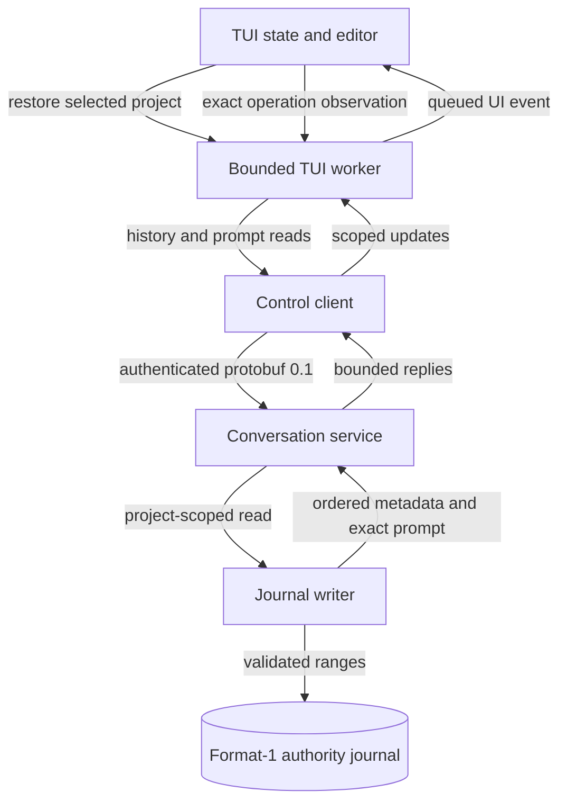
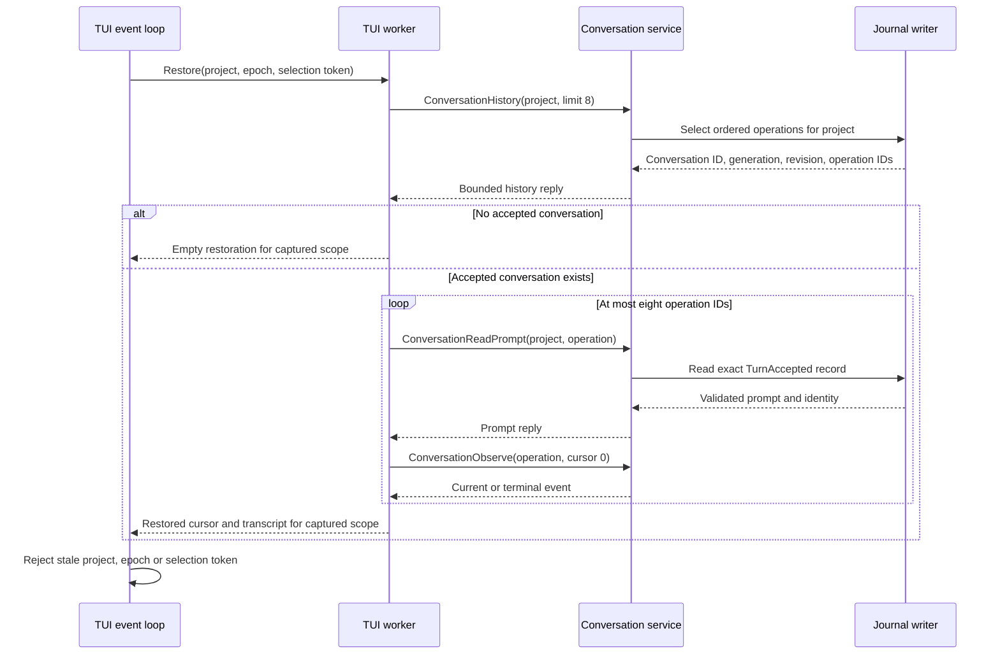
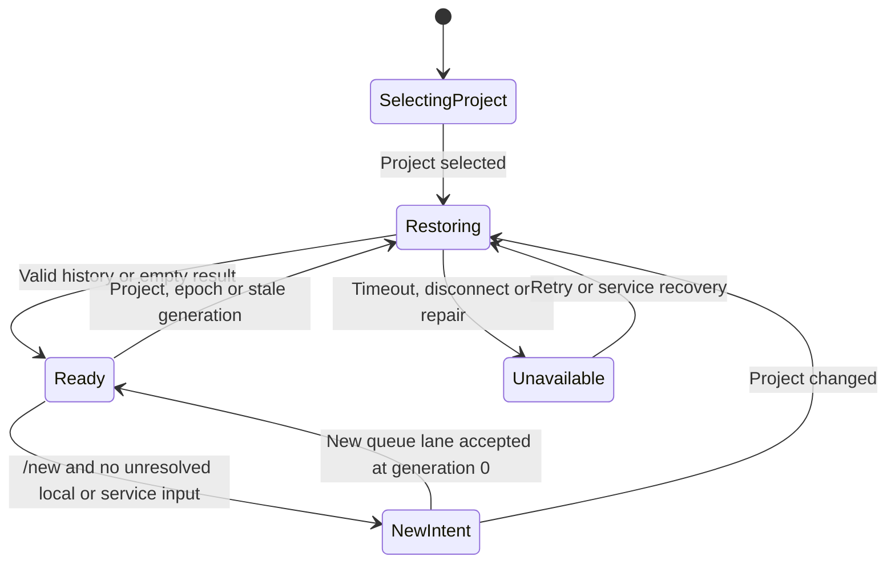
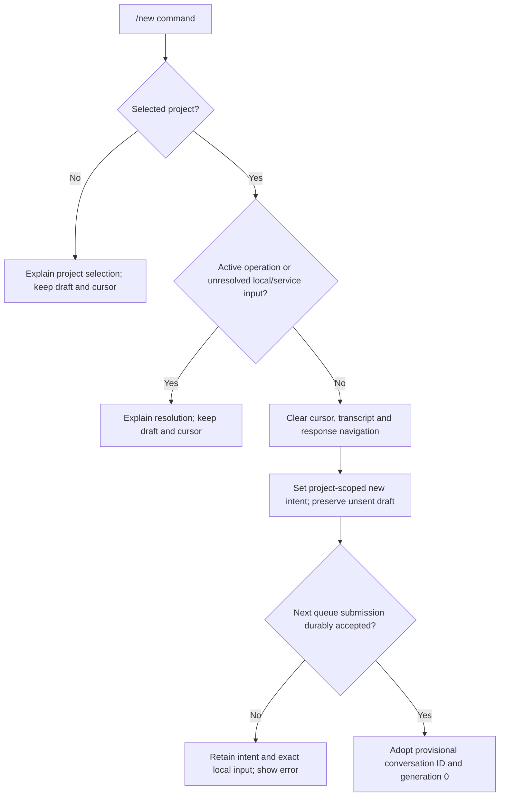

# Conversation restoration

Status: selected design for automatic project-scoped conversation restoration,
revised for the [managed input queue](managed-input-queue.md) on 2026-09-29.
The 2026-09-28 validation remains historical; revised queue-first end-to-end
validation remains open. Protocol numbering stays 0.1 and the authority journal
remains format 1.

## Behavior and ownership

After the TUI selects its initial project, it restores that project's most recently
accepted conversation. It shows the latest eight turns and uses the journal's
current conversation generation for the next queue submission. A project with
no accepted conversation starts with an empty composer and no accepted cursor.
The service queue snapshot may identify one durable provisional conversation
for that project. If it is newer than the latest accepted turn, the TUI selects
that lane for subsequent messages. A project change restores the newly selected
project's history and queue scope.

`/new` is an explicit TUI command. It clears the visible conversation cursor,
transcript and response navigation after the user invokes it. It preserves the
unsent draft. The next queue submission creates a provisional conversation at
generation 0; its first accepted turn advances it to generation 1.
Until the queue submission succeeds, the TUI keeps the new-conversation intent for the
selected project. Reconnection must not silently restore the old cursor over it.
The command does not write an empty conversation or cancel an active operation.
The TUI rejects `/new` while it owns an active or uncertain conversation
operation, or while this project has unresolved local or service queue inputs.
A new TUI launch restores the latest accepted conversation and any durable
provisional queue lane. An unused `/new` choice is local to its TUI.

| Owner | Responsibility |
| --- | --- |
| Journal writer and replay | Validate existing format-1 records; select accepted turns in journal order; read exact accepted records. |
| Conversation service | Authorize project-scoped history reads; choose the latest conversation; provide immutable turn metadata and prompts. |
| Control contract and client | Add validated read-only requests and bounded responses to the existing protocol 0.1 transport. |
| TUI conversation worker | Request restoration and hydrate turns off the render thread; return scoped, ordered updates. |
| TUI state | Apply project, epoch and generation fences; render history; own `/new` and the unsent draft. |

The service remains the only owner of the conversation cursor's validity. The
TUI treats the restored generation as an observed value; queue acceptance and
later dispatch verify it again. A lagging observed generation can queue future
work in a known lane; dispatch uses its current generation and complete history.
The queue projection remains a separate source of queued-input activity. Its
first historical snapshot cannot set or lower the restored accepted cursor.

### Ownership and data flow — selected design

Arrows show read requests, journal evidence and UI updates. The service and
writer are inside the existing per-user backend; there is no new process.

## Durable selection and control reads

The writer uses `Operation.accepted_frame.start`, the validated TurnAccepted
record position, as acceptance order. It filters operations by the requested
project and chooses the conversation of the greatest accepted position. It then
returns at most eight operations from that conversation in newest-first order.
The selected generation is the conversation's current replay generation, even
if the newest operation failed, was cancelled or was interrupted. Terminal
kind does not remove a turn from the user-visible transcript. Existing context
preparation still admits only complete turns into model history.

Add `ConversationHistory` and `ConversationHistoryReply` to the existing control
envelope with new unused field numbers. A request has a 16-byte project ID, an
optional 16-byte conversation ID, an optional exclusive `before_accepted_frame`
cursor, and a `limit` from 1 through 8. Without a conversation ID, the service
selects the latest conversation for that project. With one, it verifies its
project and pages that conversation. A reply includes project ID, conversation
ID when present, current generation, authority revision, service epoch through
the envelope, a `has_more` flag, and at most eight entries. Each entry has
operation ID, generation, accepted-frame cursor and terminal kind or pending.
The service does not place prompt or terminal text in this reply.

Add `ConversationReadPrompt` and `ConversationPromptReply`. The request names
one operation ID and project ID. The service verifies both against the replay
index, reads exactly that operation's validated TurnAccepted range through the
writer, and returns its prompt plus operation/conversation/generation identities.
The prompt is at most 32 KiB. The existing `ConversationObserve` returns the
operation's terminal text and cumulative activity. One prompt or one observed
result occupies a separate control frame. Every response must fit the existing
65,536-byte control frame; oversized or corrupt records cause an explicit
unavailable/error result, never silent truncation.

An empty matching project returns an empty history reply, not a synthetic
conversation. Unknown or cross-project conversation/operation IDs fail with the
same non-disclosing invalid-request result. The service requires an authenticated
local attachment, a current project registration and graph-ready authority.
The read does not grant model, tool or cross-project access. Existing connection
limits and peer UID checks still apply. It does not accept, cancel or mutate a
turn. These additions do not change protocol number 0.1 or journal format 1.

### Restoration sequence — selected design

Arrows show replies and local events. The journal snapshot is read under the
writer's existing serialization, while subsequent prompt and observation reads
refer to immutable operation identities.

## Asynchronous hydration and recovery

The TUI starts restoration after project discovery or an authorized project
selection. The render and key paths perform no file, socket or model calls.
The existing conversation client worker owns the read sequence. It posts updates
to the TUI's bounded event mailbox. Its queue holds one restoration job and at
most eight turn entries; a newer project selection cancels or supersedes the
old job. Each control RPC uses the existing two-second attachment/operation
deadline; the entire restoration has an 18-second deadline. Shutdown requests
stop the worker and use the existing bounded cleanup path. A hung service cannot
hold rendering, editor input or quit handling.

The worker fetches newest-first metadata and the latest eight prompts/results.
It publishes one scope-fenced update containing ordered transcript entries when
the initial viewport is complete. The UI may show a loading status meanwhile.
If a read fails or times out, it shows restoration unavailable and keeps the
draft. It must not silently create a new queue lane with an absent cursor while
a conversation may exist. Retry restoration on explicit user action or service
recovery. Before the serial sender submits a staged message, the TUI requires a
successful restoration for the selected project and epoch, an empty-history
response, or explicit `/new` intent. It also needs a current queue snapshot to
identify a durable provisional lane. A newer accepted turn can make the
observed generation lag; the service permits queueing future work in a known
lane and dispatches it against current history. A stale or wrong-project lane
is rejected. The client retains the exact local row and refreshes project
scope; it never silently forks a conversation.

The service may restart during hydration. The worker reconnects only to the
same installation and repeats the scoped snapshot under a new service epoch.
The TUI discards all updates from the old epoch. If the journal requires repair,
the UI reports that state and disables implicit new-conversation admission.
An active latest operation is shown as pending; the worker continues exact
operation observation through the existing event path after initial hydration.
Queued inputs remain controlled by the separate service queue.

### TUI restoration state — selected design

Arrows name the event or guard. `New intent` is a client-only state and expires
when its first new conversation is admitted or the TUI exits.

## Required command flow

`/new` uses the established built-in command dispatcher. It does not add a
second conversation owner. The command remains available when restoration is
unavailable, but the TUI must know a selected project. If a queue submission
has uncertain outcome, `/new` is rejected until that request is resolved;
otherwise it could hide an accepted input. Unresolved accepted queue inputs
also block `/new` for the project. The command produces a short confirmation.

### `/new` decision flow — selected design

Arrows show the checks performed before changing local TUI state.

## Validation and consistency work

The earlier fresh-client requirements in
[composer interactions](composer-interactions.md#queue-history-and-the-active-conversation-cursor)
and [conversation admission IQ2](conversation-admission.md#iq2-history-baseline-correction)
are historical. Their baseline guard remains, while the journal read selects
the accepted cursor. The managed queue snapshot can add a newer provisional
lane but cannot lower that accepted cursor. The earlier
[response activity packet](response-activity.md) excludes previous launch
history only from that packet; this design supplies that capability. Recorded
2026-09-28 checks do not prove queue-first restoration.

| Case | Initial state and trigger | Unit check | Integration check | End-to-end check |
| --- | --- | --- | --- | --- |
| CR01 latest | Two project conversations interleaved; relaunch | Acceptance-order selector chooses newest accepted conversation, not greatest ID or queue sequence | Control reply has correct project, ID, current generation and eight-or-fewer entries | Relaunch TUI displays prior turns and next prompt advances same conversation |
| CR02 explicit new | Restored conversation, empty queue; `/new`, then Enter | Command preserves draft and sets local intent; Enter stages exact text | Queue submit has absent ID and expected generation 0; rejection retains local text and intent | TUI creates a provisional lane, then first dispatch reaches generation 1; relaunch restores it |
| CR03 isolation | Two projects and cross-project IDs | Validator rejects ID mismatch without revealing content | Service read returns non-disclosing error; no mutation | Project switch shows only selected project's history |
| CR04 stale queue | Historical kind-12 generation 3 then direct generation 4; relaunch | Baseline cannot lower restored cursor | History reply selects generation 4; historical queue row does not change it | PTY next queue submit names restored conversation; dispatch advances from current generation |
| CR05 pending | Latest accepted turn has no terminal record | Pending entry is visible but excluded from model history | Exact observe resumes; duplicate events do not duplicate rows | Relaunch shows pending work and remains responsive |
| CR06 faults | Slow or missing service, corrupt record, restart, stale reply | Scope fences discard wrong project/epoch/token; draft remains | Deadlines and cancellation release worker; repair state blocks implicit admission | PTY accepts keys, resize and quit during stalled restoration; owned backend stops |
| CR07 bounds | Eight turns with maximum permitted prompt/result lengths | Each reply fits control frame; no truncation or overflow | Page cursor excludes prior entry; malformed cursor and IDs fail | Long response remains complete after relaunch and history navigation |
| CR08 provisional lane | First queued input creates a generation-0 lane; client relaunches before dispatch | Queue snapshot selects durable lane, not historical terminal row | Second submit uses the same conversation ID; cross-project ID rejects | PTY relaunch sends next message into the provisional lane without creating another conversation |

The unit layer includes control message validation, replay-order selection and
TUI command/state transitions. Integration uses a real format-1 journal and
control socket. End-to-end uses the real TUI and an isolated owned service,
checks process cleanup and strict replay, and does not depend on model wording.
Native model completion is separate evidence. A passing mock does not prove
runtime recovery or visual placement. Render the Mermaid blocks and inspect
them at normal document width before treating the design as reviewed.
