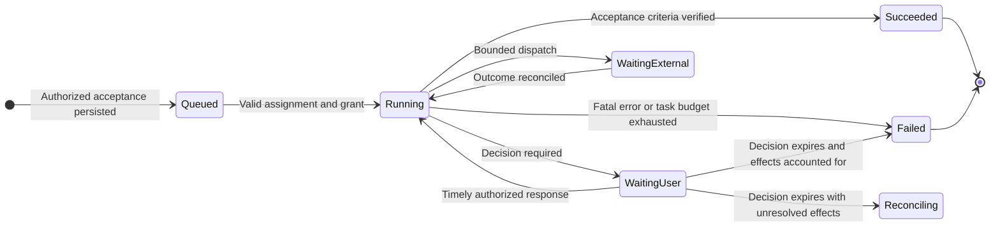
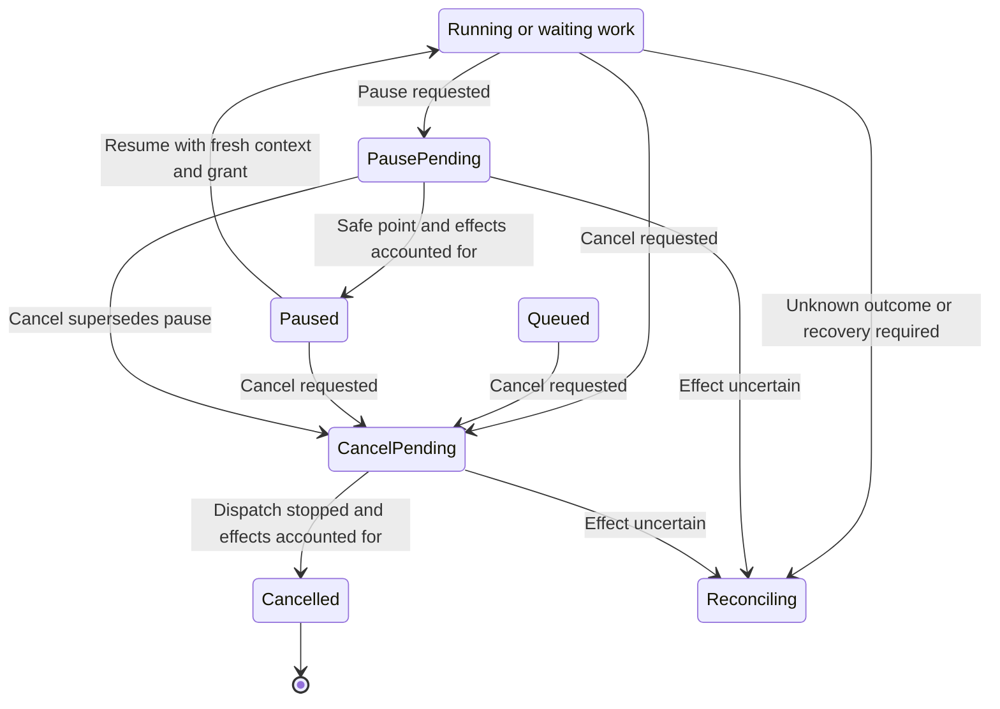
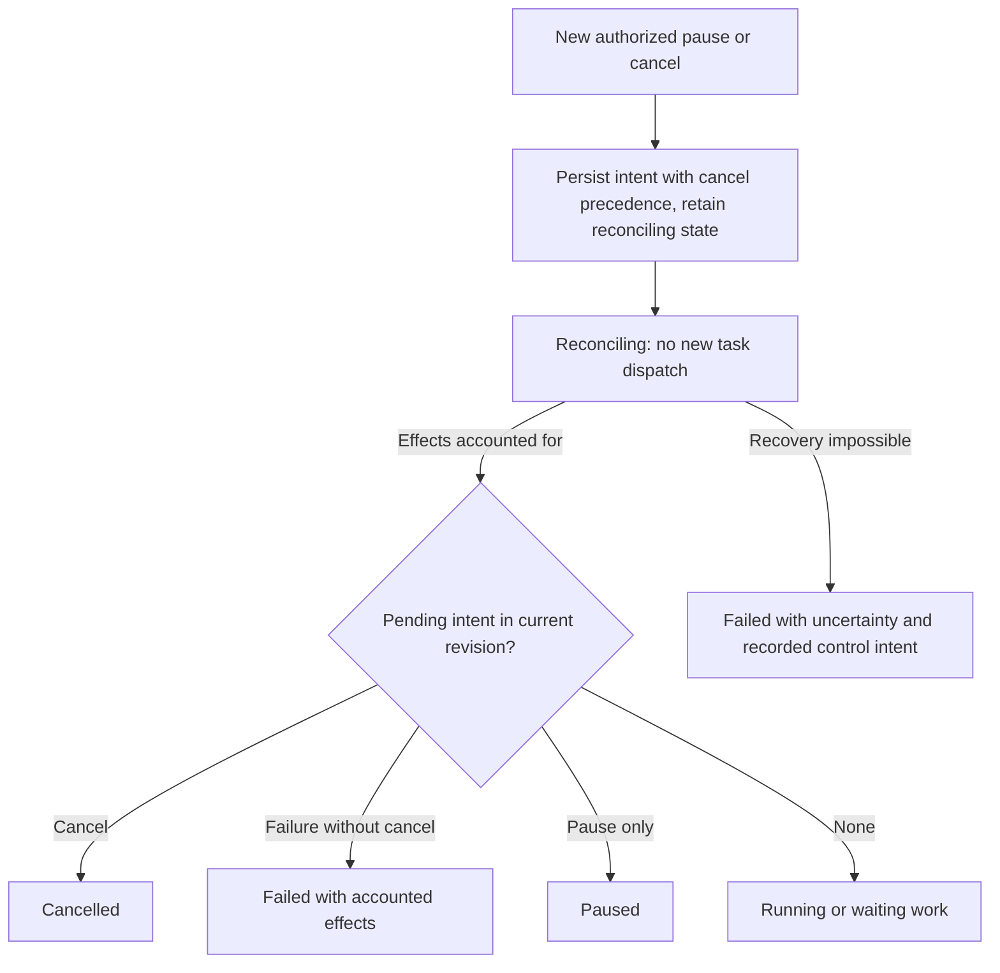
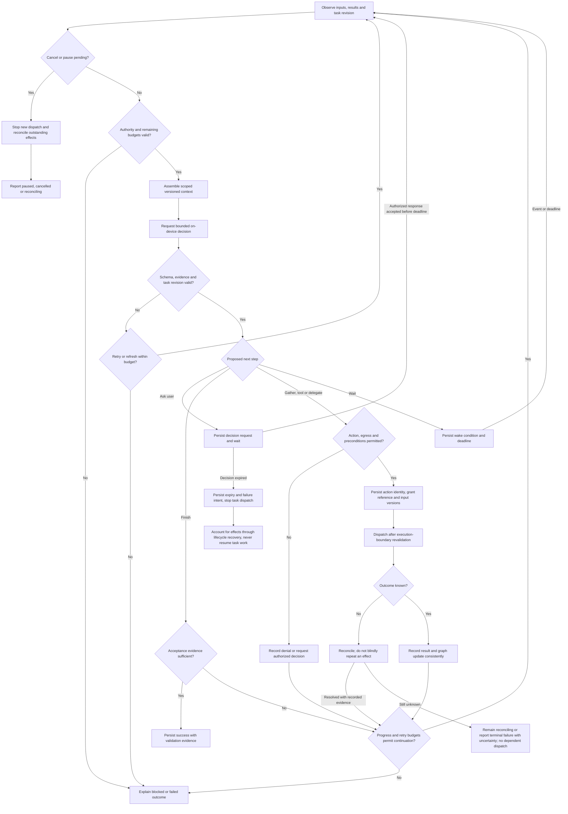
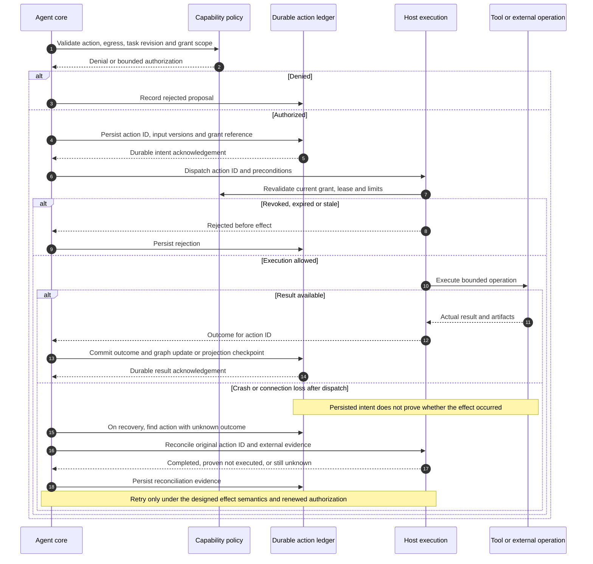
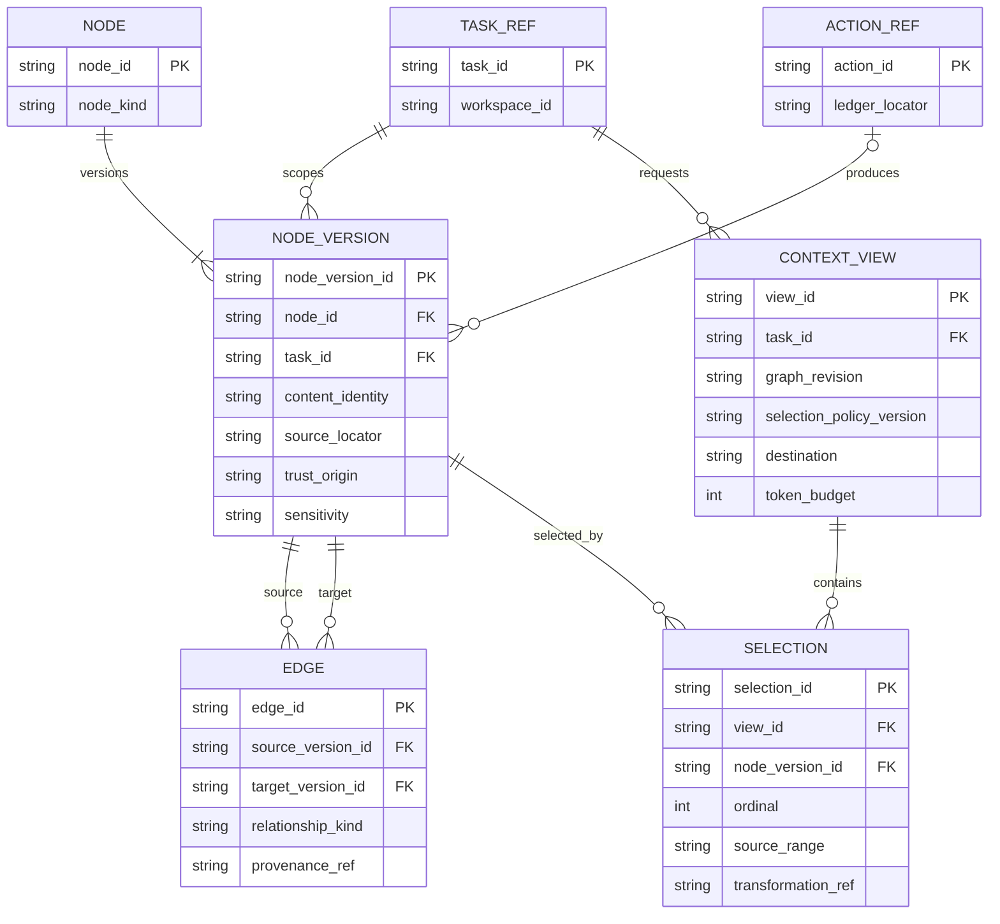
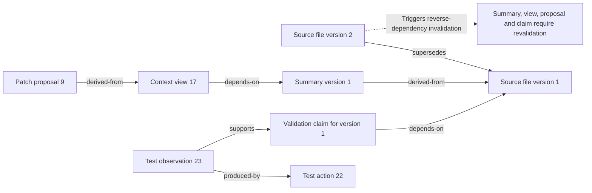
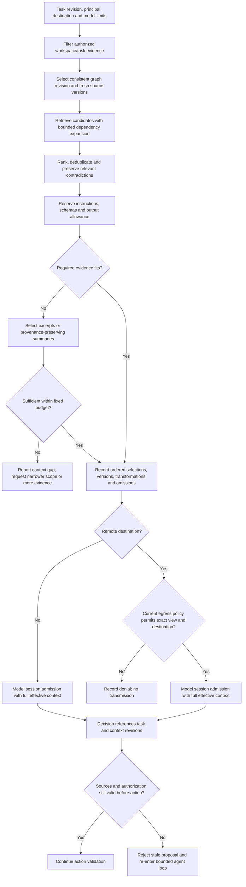
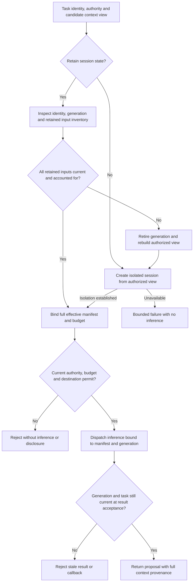

# Core harness: design brief

Status: proposed semantics and open questions. This is an input to D3-D4 in the
[design plan](../plans/architecture-and-design.md), not an implementation-ready
specification. Detailed algorithms, schemas, thresholds, and test cases remain
to be resolved there.

## Ownership and execution model

Propose one durable orchestration state machine coordinating bounded agent steps.
The orchestrator owns scheduling and task/agent lifecycle; the agent core owns
step semantics; the context subsystem owns evidence retrieval and assembly;
host execution enforces action grants. Avoid a second scheduler or competing
task state machine inside a model adapter or UI.

Treat each model interaction as an operation within this outer loop. Determine
whether Foundation Models interactions return structured proposals, use bounded
tool callbacks, or both. Any framework-managed tool calls must pass the same
action lifecycle and enforcement boundary. A hidden nested loop cannot escape
step, tool-call, time, or spending budgets or make cancellation unknowable.

Candidate task states are queued, running, waiting for user, waiting for external
work, paused, reconciling, succeeded, failed, and cancelled. D3 must define which
are persisted states versus derived views. Pause and cancellation requests are
distinct from their eventual effect; define safe points and non-interruptible work.

### Proposed task lifecycle

Proposal for D3. Edge labels specify triggers and completion guards. D3 must
decide which states are durable and whether pause/cancel intent is a separate
field. Normal progression and interruption are split into complementary views.

### Proposed interruption and recovery states

Companion proposal for D3. `ActiveWork` is a diagram entry representing the
current running or waiting state, not a new stored task state. Queued and paused
tasks may also be cancelled. Pending control intent survives reconciliation.
The orchestrator accepts and durably records new pause/cancel intent while
reconciliation continues, acknowledging acceptance only after persistence. Cancel
supersedes pause and any pending failure outcome; pause cannot clear cancellation
or a pending failure. Updating intent does not imply an outstanding effect stopped.
No new task work is dispatched while reconciling. Reconciliation observations and
bounded cleanup retain their own authorization and cannot restart task work.

### Reconciliation control and exit

Companion proposal for D3. Arrows name durable intent updates or guarded exits
from reconciliation. `ActiveWork` again denotes running or waiting work. The
terminal failure contract below distinguishes accounted failure from irrecoverable
uncertainty; neither exit permits new task dispatch.

On startup, persisted nonterminal work with potentially outstanding effects enters
reconciliation before redispatch. Cancellation cannot undo an already-completed
effect; its terminal report must identify residual effects. Terminal states are
not reopened by late results, which are retained as evidence for investigation.
Serialize intent updates, recovery completion and dispatch eligibility against the
same authoritative task revision. A cancellation accepted during reconciliation
must prevent the recovery path from resuming or dispatching task work, including
after restart. With accounted effects, pending failure and no cancellation,
persist `Failed`. If recovery fails with unknown effects, persist `Failed` with
their uncertainty and any cancellation intent in the terminal report rather than
claiming they stopped.

### User-decision expiry contract

Resolved brief-level behavior for D3-D4: expiry of a required user decision fails
the task, rather than asking again or returning to model inference. Persist the
expired decision and failure intent, disable further task dispatch, and account
for outstanding effects before reporting failure. With unresolved effects, remain
in reconciliation until they are accounted for or the recovery contract produces
an explicit terminal failure with uncertainty. A subsequently accepted cancellation
supersedes the pending failure outcome as described above.

The orchestrator serializes response acceptance, deadline expiry and control intent
against the pending decision/task revision. Accept a response only while that
decision is pending and before its authoritative deadline; late or duplicate
responses cannot resume work. An already accepted cancellation cannot be replaced
by timeout failure. D3 must specify the authoritative clock, restart handling and
atomic update mechanism. A timer wakeup alone is not permission to infer or dispatch.

## Proposed agent step

| Step | Responsibility and resulting evidence |
| --- | --- |
| 1. Observe | Accept user input and completed action observations; check cancellation, grants, task revision and budgets |
| 2. Assemble | Select a versioned context view with provenance, freshness and bounded size; include current task constraints |
| 3. Decide | Ask the on-device subsystem for a typed proposal: gather context, perform a tool action, delegate, ask the user, wait, or finish |
| 4. Validate | Validate schema, task relevance, context revision, capabilities, data egress, resource limits and preconditions; reject or request clarification |
| 5. Record intent | Durably bind action identity, task revision, selected inputs and grant scope before dispatch; define expiry and recovery behavior |
| 6. Execute or wait | Dispatch to the local agent/tool, remote inference adapter, or remote host; stream bounded progress and honor deadlines |
| 7. Reconcile | Record actual outcome, artifacts, evidence, and unknown effects; update durable state and graph consistently |
| 8. Evaluate progress | Check acceptance criteria and independent validation results; continue, replan, ask, or terminate with an explicit reason |

### Proposed step control flow

Proposal for D4. Solid arrows show step ordering and guarded branches. The
execution box covers local tools, remote inference, and remote-host operations;
all go through the action lifecycle below.

An unavailable, timed-out, or invalid model response follows the bounded
retry/fallback policy; it cannot authorize a remote fallback on its own.

Not every step needs model inference. Deterministic events such as cancellation,
expired authorization, and a completed process update state without model approval.
No model call belongs inside a storage transaction or a lock needed for control.

The detailed loop design must address:

- Task revisions, concurrent user steering, stale proposals and late results.
- Agent ownership/leases and fencing so an old owner cannot continue dispatching.
- Step, time, cost, context and tool-call budgets, plus repeated-action and
  no-progress detection. Model-reported confidence alone is not a routing policy.
- Separating permission to contact a remote model from permission to execute its
  suggestions, and bounding any recursively delegated work.
- Behavior when the on-device model is unavailable, including status/cancel
  availability and whether a task waits, fails, or uses an explicitly enabled fallback.
- Completion criteria checked against evidence; a prose success claim is insufficient.
- Recovery after dispatch with no recorded outcome. Exactly-once external effects
  are not assumed: classify effects as safely retryable, reconcilable, or unknown.

### Proposed action durability and uncertain outcomes

Proposal for D3-D4. The storage participant represents the selected durability
contract, not a chosen database. The graph is either committed with the result
or updated through a recoverable projection; that choice remains open.

## Context graph purpose

The graph represents the evidence and relationships needed to choose and justify
the next action. It must support focused context assembly, dependency tracking,
staleness detection, and inspection. It is distinct from a chat transcript, the
durable action/event ledger, and OpenTelemetry trace context. Decide their links
and transaction boundaries without creating competing task-state authorities.

Start with typed relationships and concrete queries. A graph data model does not
require a graph database, embeddings, or a general autonomous memory system.
Choose storage and indexes from workload evidence.

Embedded SurrealDB is a candidate for evaluation; see the
[context storage assessment](context-storage-candidates.md). Keep graph semantics
owned by the context subsystem and database-specific persistence in the storage
adapter. Database selection must not dictate the agent loop or expose raw query
access to models and interface clients.

Candidate node types:

- Task goals, constraints, acceptance criteria, and user decisions.
- Versioned source artifacts: files, code locations, test/build results, tool outputs.
- Observations, hypotheses, model decisions, action proposals, and action outcomes.
- Context views, derived summaries, delegated requests, and validation evidence.

Candidate edge types include derived-from, supports, contradicts, depends-on,
supersedes, produced-by, and selected-for. Provenance/dependency relationships
must preserve causality; other relationships may be cyclic. D4 must select the
actual types, cardinalities, direction and cycle rules rather than treating the
entire graph as a DAG by assumption.

### Proposed logical graph schema

Proposal for D4. Crow's-foot cardinalities describe logical relationships; fields
are illustrative contract candidates, not a physical database schema. Node
versions are immutable evidence; task state and current grants remain authoritative
outside this graph. A context view contains explicit selection records so order
and transformations can be inspected.

This initial view scopes each evidence version to a task. Cross-task reuse,
permission inheritance, payload storage and deletion need explicit D4 decisions;
they must not be inferred from shared identifiers. The optional producing action
allows user-provided or externally captured evidence without inventing an action.

### Example provenance and invalidation relationships

Illustrative graph instance. Arrows follow the named relationship from subject to
object; `derived-from` therefore points toward the source, while invalidation
walks its reverse. Each item refers to a version, not just a filesystem path.

## Required graph semantics

1. **Identity and provenance:** stable IDs; source locator plus content/version
   identity; producing task/action/model where applicable; capture time and trust
   origin. Separate observations from inference and verified claims.
2. **Freshness:** define file/workspace revision tracking, derived-node invalidation,
   deletion, competing observations, and checks immediately before a side effect.
   Path equality alone is not content identity.
3. **Access:** scope retrieval by workspace, task and principal. Propagate
   sensitivity through derivation and summaries. A permission reference in the
   graph is evidence, never the authoritative current grant.
4. **Consistency:** define concurrent updates, snapshot versions and action-ledger
   linkage. Choose transactional updates or rebuildable projections with explicit
   checkpoints and lag; never silently combine incompatible revisions.
5. **Retrieval:** specify candidate discovery, relevance ranking, dependency closure,
   deduplication, diversity and deterministic tie-breaking. Evaluate a lexical and
   structural baseline before optional semantic retrieval.
6. **Context assembly:** reserve budgets for instructions, tool schemas and output;
   select source excerpts by budget and relevance; record what was omitted.
   Never assume one fixed context size across all models.
7. **Summarization:** retain source links, uncertainty and supersession semantics;
   do not promote lossy summaries to authority or erase unresolved contradictions.
8. **Lifetime:** define retention, task isolation, optional cross-task reuse,
   garbage collection, quotas, encryption needs and user deletion semantics,
   including indexes, summaries and retained artifacts.
9. **Egress:** build a separately authorized remote context view, record its
   manifest and destination, and enforce limits before transmission. A model's
   request for more context cannot override the policy.

Each assembled context view should identify the selected node versions, source
ranges, transformations, order, selection policy version, budget accounting,
destination, and omissions. Keep sensitive payloads out of telemetry. The design
must settle how to retain enough evidence to inspect a decision while respecting
deletion and minimization requirements; hashes alone cannot reconstruct deleted data.

### Proposed context assembly and remote disclosure

Proposal for D4-D5. Arrows show bounded data transformations and explicit branch
conditions. Insufficient context is an observable result, not permission to exceed
budgets or include inaccessible evidence.

The local and remote admission nodes use the session contract below. They cannot
dispatch inference with unaccounted history. For a retained remote conversation,
the exact view checked for egress includes the retained inputs as well as new
content; admission must reject any mismatch and rebuild/re-authorize the view.

## Model decision contracts

Define separate request/result schemas and evaluations for task classification,
context selection assistance, tool selection, delegation, and progress assessment.
Each result includes the proposed action, referenced evidence, and a concise
user-facing rationale. Do not require hidden reasoning transcripts.

Tool metadata has one canonical registry: stable identity/version, input/output
schema, capabilities, side effects, retry class, limits and provenance. Produce
model-facing descriptions and UI views from that registry. Model-guided selection
can narrow the eligible set but cannot enlarge authorized capabilities.

Evaluate decisions against labelled representative tasks and failure cases.
Measure routing quality, inappropriate delegation, missed delegation, unnecessary
context, invalid tool selections, and latency/cost tradeoffs. Calibrate any
confidence or uncertainty threshold on evidence rather than trusting a generated score.

### Model session ownership and effective context

Required contract for D4-D5. Select either stateless requests built from each
authorized context view or explicitly managed stateful sessions. Do not infer
permission to reuse a session from its presence in the Foundation Models API or
a provider adapter. The requirements apply to transcripts, retained tool results,
summaries, application-managed prompt caches and remote conversation references
that can affect a later model response.

- The orchestrator supplies task/principal/workspace identity, current authority
  scope and a session generation tied to the task revision. The model adapter
  owns session resources; the context subsystem owns the effective input manifest.
  The adapter must account for every retained input before inference. Session
  identity or a cache hit cannot act as a grant or a second context authority.
- Never reuse conversation state across tasks or principals. Any authorized
  cross-task evidence reuse must re-enter through the context subsystem and a new
  session. Within a task, account for retained history, instructions, tool schemas,
  tool results and new selections in provenance, sensitivity and total input/output
  budget calculations. The recorded manifest must describe the effective input,
  not just the latest appended message. No hidden reasoning transcript is required.
- Revalidate retained inputs against current authority, deletion and source
  invalidation before reuse. If the adapter cannot enumerate and bound their
  contribution, retire the session and rebuild from authorized evidence. If it
  cannot establish an isolated fresh session, report a bounded failure without
  inference or remote disclosure.
- Revocation, relevant deletion, cancellation, task completion or a scope change
  invalidates affected session generations. The adapter stops reuse and attempts
  cancellation/cleanup under the designed lifecycle. Reject late results and tool
  callbacks from invalidated generations. Continuing permitted work requires a
  fresh generation and a rebuilt, authorized manifest; cancellation never restarts
  work. Provider-side deletion guarantees and cleanup failures must be explicit,
  not inferred from retiring a local reference.

Proposed admission flow. Arrows identify checks before either local or remote
inference. Admission and result acceptance use current authority and generation
fencing; D4 must specify their concurrency protocol rather than assuming that a
check alone prevents invalidation races.

## Validation required for the detailed designs

| Concern | Unit | Integration | End-to-end |
| --- | --- | --- | --- |
| Loop | Transition/invariant and budget tests with generated event sequences | Durable transitions, late results, crashes at dispatch boundaries | Coding workflow with restart, user steering and cancellation |
| Graph | Retrieval/invalidation/authorization properties and budget limits | Concurrent storage, projection recovery, migrations and deletion | Changed source invalidates a proposal; retrieved evidence explains the final result |
| Decisions | Schema and deterministic policy tests with controlled outputs | Real Swift model adapter with cancellation and unavailable-model cases | Actual on-device decisions in local and remote-assisted workflows |
| Tools | Registry contracts and capability decisions | Actual constrained processes and denied resource access | Malicious content cannot induce unauthorized execution or egress |

The following regression scenarios are required design acceptance cases, not
implemented tests. D3-D5 must assign concrete fixtures, commands and environments
before the corresponding implementation packets become ready.

| Case | Unit | Integration | End-to-end |
| --- | --- | --- | --- |
| Control during reconciliation | Generate pause/cancel/recovery orderings and prove cancel precedence with no resume | Persist cancel after entering reconciliation, restart, then deliver a late outcome and assert no new task dispatch | Disconnect an executing host, enter reconciliation, cancel from another client, reconnect and report accounted or explicitly uncertain effects |
| User-decision expiry | Race response, timeout and cancellation against one revision and assert a single winner with no inference after expiry | Restart with an expired pending decision and unresolved action, reject late/duplicate responses and preserve failure/cancel intent | Let a required decision expire through CLI/TUI, observe failure or reconciliation and no re-prompt or new task work |
| Model session isolation | Reject identity/generation mismatch and account for full retained-input budgets and provenance | Exercise the real adapter with task A then B, revocation/deletion during inference, and stale tool callbacks; prove retirement or isolated reconstruction | Run tasks with distinct access scopes and revoke access within a task; verify excluded evidence never enters a later effective input, and invalidated outputs are not accepted |

Session tests must inspect admitted effective inputs, manifests and generation
acceptance at the adapter boundary. Absence of a secret in one stochastic model
answer alone does not prove isolation. Exercise both stateless and retained-state
paths if both are shipped, including remote conversations when I5 is delivered.

Also define model evaluation datasets, protocol fuzzing, multi-client race tests,
context poisoning cases, token-boundary cases, graph growth/retrieval benchmarks,
and control latency during model load. Each test needs an observable oracle;
no production safety claim is established by fixtures alone.
