# Core harness: design brief

Status: design brief for D3–D4. This document combines required behavior and
proposed mechanisms. Each section identifies its status.

Open decisions: algorithms, schemas, limits, persistence mechanisms and concrete
test cases. The [design plan](../plans/architecture-and-design.md) assigns this
work. Runtime behavior is not implemented or verified.

Use the [glossary](../glossary.md) for project terms. The
[decision index](../decisions/README.md) explains selected decisions. Start with
the lifecycle views, then follow the step overview to the detailed action and
context models.

## Ownership and execution model

Required behavior: the orchestrator controls task state, scheduling and shared
budget accounting. The agent core defines the steps for assigned work. The context
subsystem retrieves evidence and prepares model input. Host services enforce grants
when they execute actions. Model adapters and clients must not duplicate task control.

Proposed mechanism: one durable state machine coordinates the agent steps.

Treat each model interaction as an operation within this outer loop. Determine
whether Foundation Models interactions return structured proposals, use bounded
tool callbacks, or both. Any framework-managed tool calls must pass the same
action lifecycle and enforcement checks. A nested model loop must obey the step,
tool-call, time and spending budgets. Its operations must remain visible to the
orchestrator so that it can track and cancel them.

Candidate task states are queued, running, waiting for user, waiting for external
work, paused, reconciling, succeeded, failed, and cancelled. D3 must define which
are persisted states versus derived views. Pause and cancellation requests are
distinct from their eventual effect; define safe points and non-interruptible work.

### Proposed task lifecycle

Required behavior is shown in the transitions and their conditions. The state
representation is proposed. D3 must choose which states to store and how to record
pause and cancellation requests. Read this view with the interruption and failure
views below; they apply to all relevant nonterminal states.

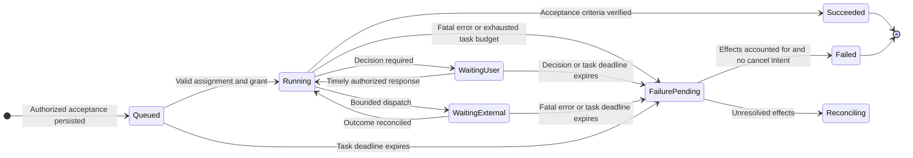

### Proposed interruption and recovery states

Required behavior; state storage remains a D3 decision. `ActiveWork` represents
the current running or waiting state in this diagram. Queued and paused tasks
may also be cancelled.

The orchestrator must retain pause and cancellation requests during reconciliation.
It acknowledges a request only after recording it durably. Cancellation overrides
pause and a pending failure outcome. Pause cannot clear cancellation or failure.
Accepting a request does not prove that an operation has stopped.

The orchestrator must not dispatch new task work during reconciliation. Recovery
observations and cleanup need separate authorization and limits. They must not
restart task work.

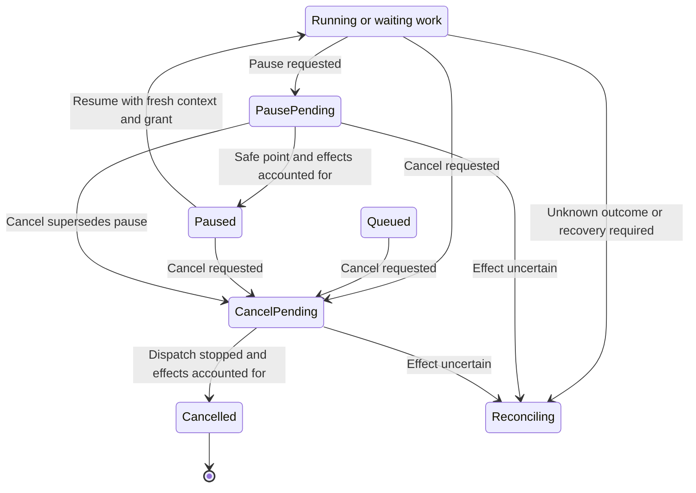

### Reconciliation control and exit

Required behavior. Arrows show recorded control requests or conditions for leaving
reconciliation. `ActiveWork` means running or waiting work. The failure contract
below distinguishes known effects from effects that remain unknown.

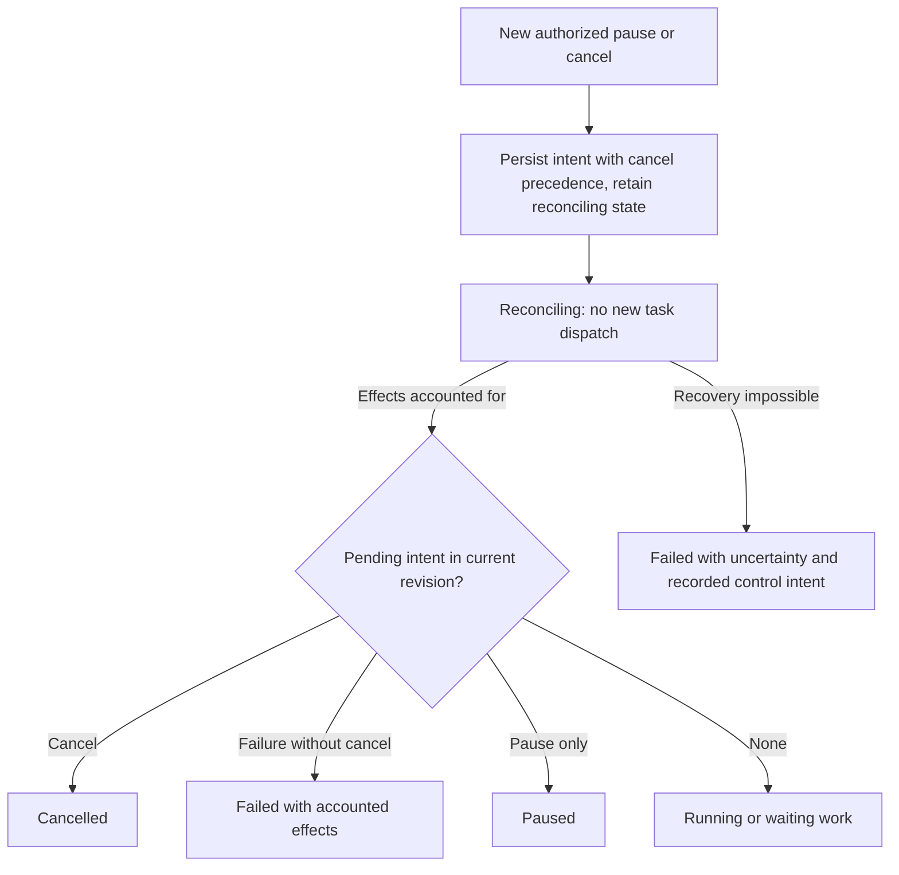

On startup, persisted nonterminal work with potentially outstanding effects enters
reconciliation before redispatch. Cancellation cannot undo an already-completed
effect; its terminal report must identify residual effects. Terminal states are
not reopened by late results, which are retained as evidence for investigation.
Serialize intent updates, recovery completion and dispatch eligibility against the
same authoritative task revision. A cancellation accepted during reconciliation
must prevent the recovery path from resuming or dispatching task work, including
after restart. With accounted effects, pending failure and no cancellation,
persist `Failed`. If recovery fails with unknown effects, persist `Failed` with
their uncertainty and any cancellation intent in the terminal report rather than
claiming they stopped.

Throughout these lifecycle views, **accounted** means operation effects are known
and each usage obligation is either settled from evidence or conservatively held
by an explicit durable reservation. Exact provider billing need not delay a
terminal outcome once effects are known. Such an outcome must disclose unresolved
usage and retained allowance. Unknown operation effects still require bounded
reconciliation and cannot produce a successful cancellation claim.

### Common failure and deadline contract

Selected constraint for D3-D4; rationale in
[ADR-0002](../decisions/0002-failure-settlement.md). `FailurePending` is the
logical combination of failure intent and stopped dispatch, not a commitment to
a separate stored enum. Fatal errors, exhausted task budgets, task deadline expiry
and required user-decision expiry all enter this procedure from **every
nonterminal state**, including queued, paused, waiting and reconciling states.
Recoverable per-operation failures may retry only while this procedure has not
started and current authorization and budgets permit it.

1. The orchestrator orders the failure trigger against other updates to the
   authoritative task revision. It records the cause and pending failure and blocks
   further task dispatch as one transition. D3 must define the atomic mechanism.
   The orchestrator also invalidates affected planning and model generations.
   A previously accepted cancellation keeps precedence.
2. The orchestrator requests that outstanding work stop within the recovery limits.
   It reconciles every admitted operation, including model calls and delegated work.
   Admission records must distinguish work proven not dispatched from work with an
   unknown outcome. A timeout, process death or disconnection does not prove that
   no effect or cost occurred.
3. When effects and usage are accounted for, the orchestrator records `Failed`.
   If cancellation won, it records `Cancelled` instead. If the recovery limit is
   reached with unknown effects, it records `Failed` and the remaining uncertainty.
   That record includes unresolved usage reservations and accepted control requests.
   The report must not claim that cancellation completed in this case.

Failure intent forbids resume and fresh task/model work. Reconciliation and cleanup
use separately authorized, bounded recovery resources, reserved outside the task's
spendable allowance; they cannot borrow permission for new task work. D3/D4 must
specify recovery bounds, allowed operations and exhaustion reporting before code.
An authority-store outage cannot produce a false durable acknowledgement: locally
stop new dispatch and use only existing bounded stop/cleanup authority until the
selected persistence contract can record the transition. Remote owners remain
subject to their lease and host limits. D3/D5 must define that outage protocol.

The task deadline covers queueing, waiting, pause and reconciliation; pausing does
not extend it. Deadline expiry during reconciliation records failure intent but
does not skip settlement or reset the recovery bound. Terminalization, failure,
cancel and dispatch admission are serialized: if success was already durably
committed, a later timer cannot reopen it. Success requires no outstanding task
operations and reconciled budget accounting. D3 defines clock representation,
restart/clock-jump handling and the atomic mechanism. Clock uncertainty must not
extend work authority. Late observations may append evidence and settle usage
without reopening terminal state or triggering new work.

#### Failure settlement flow

Selected logical ordering. Edges are triggers or guarded outcomes; persistence
technology and numerical recovery limits remain D3/D4 design work.

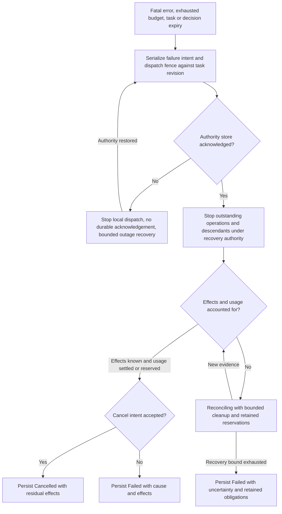

### User-decision expiry contract

Resolved brief-level behavior for D3-D4: expiry of a required user decision fails
the task, rather than asking again or returning to model inference. Apply the
[common failure procedure](#common-failure-and-deadline-contract): persist the
expired decision and failure intent, disable further task dispatch, and account
for outstanding effects before reporting failure. With unresolved effects, remain
in reconciliation until they are accounted for or the recovery contract produces
an explicit terminal failure with uncertainty. A subsequently accepted cancellation
supersedes the pending failure outcome as described above.

The orchestrator serializes response acceptance, deadline expiry and control intent
against the pending decision/task revision. Accept a response only while that
decision is pending and before its authoritative deadline; late or duplicate
responses cannot resume work. An already accepted cancellation cannot be replaced
by timeout failure. D3 must specify the authoritative clock, restart handling and
atomic update mechanism. A timer wakeup alone is not permission to infer or dispatch.

## Proposed agent step

| Step | Responsibility and resulting evidence |
| --- | --- |
| 1. Observe | Accept user input and completed action observations; check cancellation, grants, task revision and budgets |
| 2. Assemble | Select a versioned context view with provenance, freshness and bounded size; include current task constraints |
| 3. Decide | Ask the on-device subsystem for a typed proposal: gather context, perform a tool action, delegate, ask the user, wait, or finish |
| 4. Validate | Validate schema, task relevance, context revision, capabilities, data egress, resource limits and preconditions; reject or request clarification |
| 5. Admit and record intent | Atomically reserve aggregate budgets and durably bind action identity, task revision, selected inputs and grant scope before dispatch |
| 6. Execute or wait | Dispatch to the local agent/tool, remote inference adapter, or remote host; stream bounded progress and honor deadlines |
| 7. Reconcile | Record actual outcome, artifacts, evidence, and unknown effects; update durable state and graph consistently |
| 8. Evaluate progress | Check acceptance criteria and independent validation results; continue, replan, ask, or terminate with an explicit reason |

### Proposed step control flow

Proposed mechanism for D4, subject to the required failure and budget contracts.
This overview shows the checks before a proposal is processed. Arrows show the
next check or procedure. The following views expand proposal handling and results.

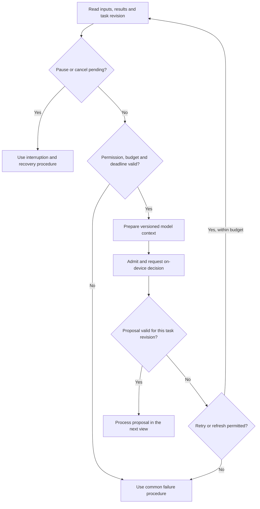

### Proposal handling

Proposed mechanism for D4. Arrows select a procedure by proposal type. Each return
to the next step repeats the permission, control and deadline checks above.

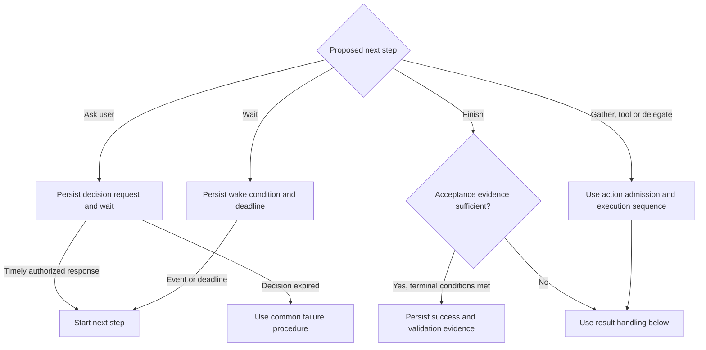

### Result handling

Proposed mechanism for D4. Arrows show the result or recovery evidence. The action
sequence below records the outcome and updates the graph before reporting a known
result. Reconciliation must use the original action ID.

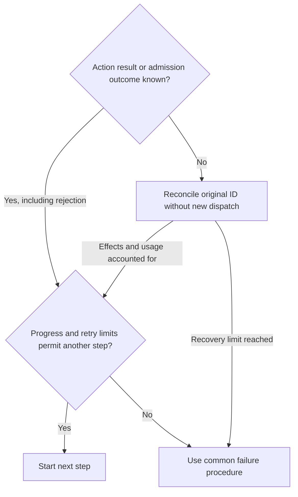

The on-device decision request also uses action admission and budget reservations.
The action sequence applies to local tools, remote inference and remote hosts.
Proposal validation checks the schema, supporting evidence and task revision.
Admission rejection leads to a limited wait, replan or failure. It must not start
a busy retry loop. Task deadline checks apply while waiting and before success.
Success also requires the terminal conditions in the common failure and deadline
contract. Reaching a recovery limit must not restart that recovery period.

An unavailable, timed-out, or invalid model response follows the bounded
retry/fallback policy; it cannot authorize a remote fallback on its own.

Not every step needs model inference. Deterministic events such as cancellation,
expired authorization, and a completed process update state without model approval.
No model call belongs inside a storage transaction or a lock needed for control.

The detailed loop design must address:

- Task revisions, concurrent user steering, stale proposals and late results.
- Agent ownership/leases and fencing so an old owner cannot continue dispatching.
- The aggregate budget contract below, plus repeated-action and
  no-progress detection. Model-reported confidence alone is not a routing policy.
- Separating permission to contact a remote model from permission to execute its
  suggestions, and bounding any recursively delegated work.
- Behavior when the on-device model is unavailable, including status/cancel
  availability and whether a task waits, fails, or uses an explicitly enabled fallback.
- Completion criteria checked against evidence; a prose success claim is insufficient.
- Recovery after dispatch with no recorded outcome. Exactly-once external effects
  are not assumed: classify effects as safely retryable, reconcilable, or unknown.

### Proposed action durability and uncertain outcomes

Required ordering for D3–D4. The storage participant represents durable records;
the database is an open decision. D3 must choose whether the result and graph
update share a transaction or use a recoverable projection.

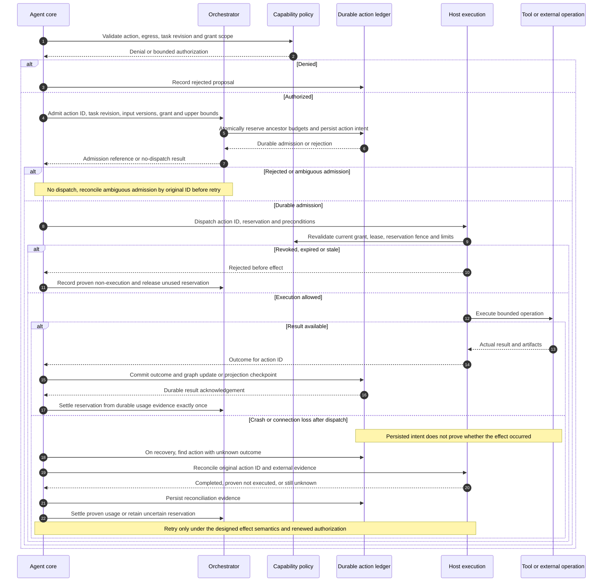

### Aggregate budget ownership and admission

Required behavior for D3–D5. The orchestrator controls the shared budgets and
records each reservation durably. The agent core requests an allowance before an
operation starts. Model and provider adapters report usage. Hosts enforce operation
limits. Graph data and telemetry cannot authorize spending.

[ADR-0003](../decisions/0003-aggregate-budget-admission.md) explains the decision.
The [glossary](../glossary.md#persistence-recovery-and-budgets) defines reservations,
settlement and ancestor budgets.

| Dimension | Accounting rule |
| --- | --- |
| Consumable steps, tool calls, model tokens and monetary cost | Typed units, cumulative charged usage plus outstanding reservations may not exceed the configured cap at admission. Money records currency and pricing revision; unlike units are never added together. |
| Concurrent operations or resource occupancy | Reserve capacity while occupied; release only on evidence of completion/non-execution. A lost connection does not free the slot. |
| Context capacity | Check the entire effective context per invocation, including retained history, with its model-specific limit. This is distinct from cumulative inference-token allowance. |
| Elapsed task time | Check the authoritative task deadline; it is not replenished by retries, restart, waiting or pausing. |

Budgets form a hierarchy: installation and workspace limits where configured,
then root task, child tasks and operations. Each operation counts once against
each applicable ancestor budget. A child limit can reduce its inherited allowance
but cannot increase it. Creating child tasks must not increase the root budget.

The orchestrator must admit each operation atomically. It checks all applicable
budget limits, the current task revision and permission to dispatch. It then
records the operation ID, reservation and action intent together. D3 must select
the atomic mechanism. Concurrent requests must not reserve the same remaining
allowance. A repeated request with the same ID returns the original result or
reservation; it must not allocate another one.

Each model call, retry, framework tool callback and delegated operation requires
admission. The orchestrator reserves the maximum permitted consumption before
dispatch. The host or provider interface must enforce that maximum. An operation
without an enforceable maximum cannot be admitted under a hard budget limit.
A cost estimate alone is insufficient. Each provider design must cover billable
input, maximum output, pricing and retries before claiming a hard cost limit.

The orchestrator settles each operation's usage once, using durable evidence.
It releases only the allowance proven unused. Proof that the operation never ran
may release the full reservation.

If execution or billing is unknown, the reservation remains in place through
timeout, cancellation, terminal failure and restart. Lease expiry prevents new
dispatch. It neither proves that old work stopped nor refunds its consumption.
Late evidence may settle usage without restarting the task.

If actual usage exceeds the reserved maximum, the orchestrator records the full
usage and the breach. It stops affected admissions and uses failure handling.
It must not reduce the recorded usage to make the budget appear valid.

Before remote delegation, the parent reserves a share of its budget for the child.
This share is the child's **budget envelope**. The child subdivides it among its
operations. The parent's account counts the envelope once; the child's account
counts the operations within that envelope.

The child operates under a current owner epoch. Enforcement must reject obsolete
owners, as required by the fencing contract. During a network partition, the parent
cannot spend or reassign the outstanding envelope. Release requires evidence that
the old owner cannot continue to spend it and that final usage is accounted for.
After losing authority, a child may only continue previously admitted work within
its limits. It must not start unallocated spending.

Open decision: D5 must specify the delegation protocol, expiry enforcement, owner
fencing and the evidence needed to settle the envelope.

Open decisions for D3–D4: reservation schemas, atomic updates, storage location,
configuration scopes, numeric precision, overflow handling and recovery checkpoints.
The admission transaction must not contain network requests or model work.

If admission is unavailable or its outcome is unknown, the orchestrator must not
dispatch new work. It must first reconcile the original operation ID. A provider
retry needs a new reservation unless the provider contract proves it is the same
operation.

#### Reservation lifecycle

Selected logical states; arrows name evidence or admission outcomes. Unknown
usage remains committed against the cap, including after a task becomes terminal.

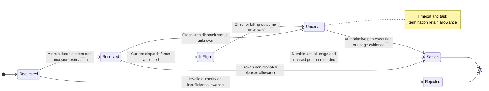

## Context graph purpose

The graph represents the evidence and relationships needed to choose and justify
the next action. It must support focused context assembly, dependency tracking,
staleness detection, and inspection. It is distinct from a chat transcript, the
durable action/event ledger, and OpenTelemetry trace context. Decide their links
and transaction boundaries without creating competing task-state authorities.

Start with typed relationships and concrete queries. A graph data model does not
require a graph database, embeddings, or a general autonomous memory system.
Choose storage and indexes from workload evidence.

SurrealDB support must allow optional embedded operation or a configured external
connection; see the [context storage assessment](context-storage-candidates.md).
Embedded is the initialization default when no external connection is configured;
a configured external connection selects external initialization. On reopen,
verify the persisted binding before opening either mode; missing configuration
cannot silently select a different graph. The storage brief owns binding and
migration semantics, including external failure behavior.
Concrete engine, SDK/server versions and failure contracts remain under evaluation.
Keep graph semantics owned by the context subsystem and database-specific
persistence in the storage adapter. Database selection must not dictate the agent
loop or expose raw query access to models and interface clients.

Candidate node types:

- Task goals, constraints, acceptance criteria, and user decisions.
- Versioned source artifacts: files, code locations, test/build results, tool outputs.
- Observations, hypotheses, model decisions, action proposals, and action outcomes.
- Context views, derived summaries, delegated requests, and validation evidence.

Candidate edge types include derived-from, supports, contradicts, depends-on,
supersedes, produced-by, and selected-for. Provenance/dependency relationships
must preserve causality; other relationships may be cyclic. D4 must select the
actual types, cardinalities, direction and cycle rules rather than treating the
entire graph as a DAG by assumption.

### Proposed logical graph schema

Proposal for D4. Crow's-foot cardinalities describe logical relationships; fields
are illustrative contract candidates, not a physical database schema. Node
versions are immutable evidence; task state and current grants remain authoritative
outside this graph. A context view contains explicit selection records so order
and transformations can be inspected.

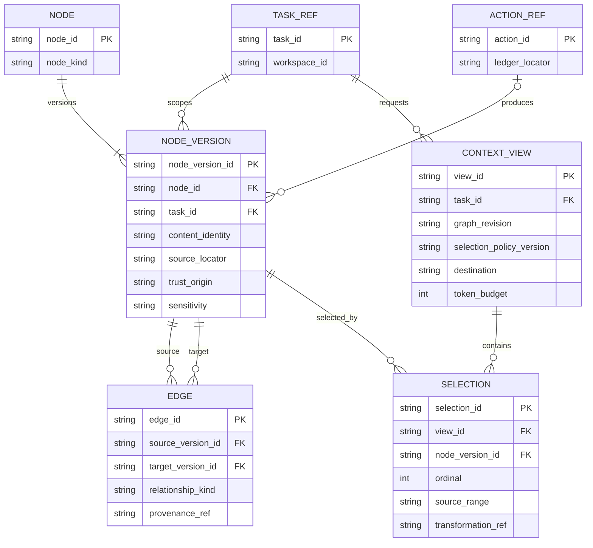

This initial view scopes each evidence version to a task. Cross-task reuse,
permission inheritance, payload storage and deletion need explicit D4 decisions;
they must not be inferred from shared identifiers. The optional producing action
allows user-provided or externally captured evidence without inventing an action.

### Example provenance and invalidation relationships

Illustrative graph instance. Arrows follow the named relationship from subject to
object; `derived-from` therefore points toward the source, while invalidation
walks its reverse. Each item refers to a version, not just a filesystem path.

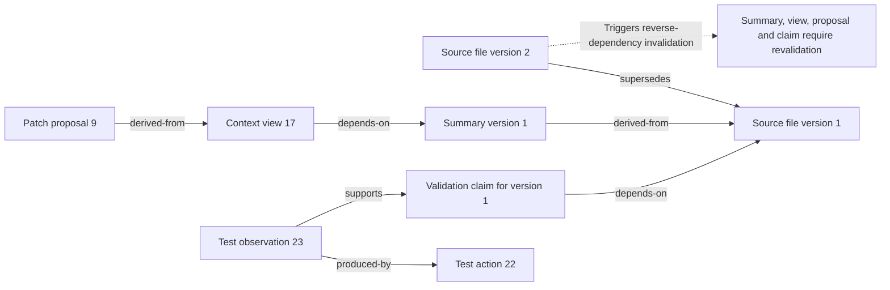

## Required graph semantics

1. **Identity and provenance:** stable IDs; source locator plus content/version
   identity; producing task/action/model where applicable; capture time and trust
   origin. Separate observations from inference and verified claims.
2. **Freshness:** define file/workspace revision tracking, derived-node invalidation,
   deletion, competing observations, and checks immediately before a side effect.
   Path equality alone is not content identity.
3. **Access:** scope retrieval by workspace, task and principal. Propagate
   sensitivity through derivation and summaries. A permission reference in the
   graph is evidence, never the authoritative current grant.
4. **Consistency:** define concurrent updates, snapshot versions and action-ledger
   linkage. Choose transactional updates or rebuildable projections with explicit
   checkpoints and lag; never silently combine incompatible revisions.
5. **Retrieval:** specify candidate discovery, relevance ranking, dependency closure,
   deduplication, diversity and deterministic tie-breaking. Evaluate a lexical and
   structural baseline before optional semantic retrieval.
6. **Context assembly:** reserve budgets for instructions, tool schemas and output;
   select source excerpts by budget and relevance; record what was omitted.
   Never assume one fixed context size across all models.
7. **Summarization:** retain source links, uncertainty and supersession semantics;
   do not promote lossy summaries to authority or erase unresolved contradictions.
8. **Lifetime:** define retention, task isolation, optional cross-task reuse,
   garbage collection, quotas, encryption needs and user deletion semantics,
   including indexes, summaries and retained artifacts.
9. **Egress:** build a separately authorized remote context view, record its
   manifest and destination, and enforce limits before transmission. A model's
   request for more context cannot override the policy.

Each assembled context view should identify the selected node versions, source
ranges, transformations, order, selection policy version, budget accounting,
destination, and omissions. Keep sensitive payloads out of telemetry. The design
must settle how to retain enough evidence to inspect a decision while respecting
deletion and minimization requirements; hashes alone cannot reconstruct deleted data.

### Proposed context assembly and remote disclosure

Proposal for D4-D5. Arrows show bounded data transformations and explicit branch
conditions. Insufficient context is an observable result, not permission to exceed
budgets or include inaccessible evidence.

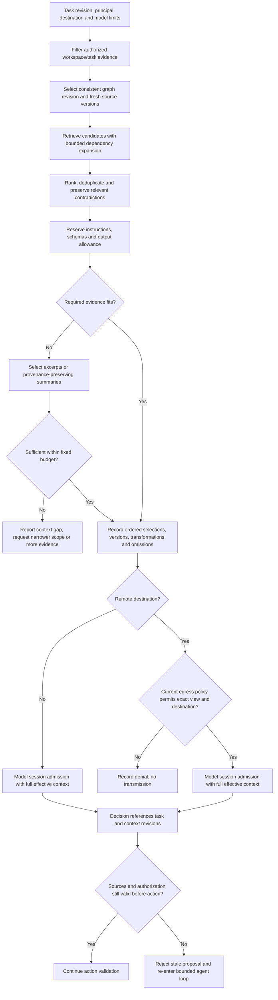

The local and remote admission nodes use the session contract below. They cannot
dispatch inference with unaccounted history. For a retained remote conversation,
the exact view checked for egress includes the retained inputs as well as new
content; admission must reject any mismatch and rebuild/re-authorize the view.

## Model decision contracts

Define separate request/result schemas and evaluations for task classification,
context selection assistance, tool selection, delegation, and progress assessment.
Each result includes the proposed action, referenced evidence, and a concise
user-facing rationale. Do not require hidden reasoning transcripts.

Tool metadata has one canonical registry: stable identity/version, input/output
schema, capabilities, side effects, retry class, limits and provenance. Produce
model-facing descriptions and UI views from that registry. Model-guided selection
can narrow the eligible set but cannot enlarge authorized capabilities.

Evaluate decisions against labelled representative tasks and failure cases.
Measure routing quality, inappropriate delegation, missed delegation, unnecessary
context, invalid tool selections, and latency/cost tradeoffs. Calibrate any
confidence or uncertainty threshold on evidence rather than trusting a generated score.

### Model session ownership and effective context

Required contract for D4-D5. Select either stateless requests built from each
authorized context view or explicitly managed stateful sessions. Do not infer
permission to reuse a session from its presence in the Foundation Models API or
a provider adapter. The requirements apply to transcripts, retained tool results,
summaries, application-managed prompt caches and remote conversation references
that can affect a later model response.

- The orchestrator supplies task/principal/workspace identity, current authority
  scope and a session generation tied to the task revision. The model adapter
  owns session resources; the context subsystem owns the effective input manifest.
  The adapter must account for every retained input before inference. Session
  identity or a cache hit cannot act as a grant or a second context authority.
- Never reuse conversation state across tasks or principals. Any authorized
  cross-task evidence reuse must re-enter through the context subsystem and a new
  session. Within a task, account for retained history, instructions, tool schemas,
  tool results and new selections in provenance, sensitivity and total input/output
  budget calculations. The recorded manifest must describe the effective input,
  not just the latest appended message. No hidden reasoning transcript is required.
- Revalidate retained inputs against current authority, deletion and source
  invalidation before reuse. If the adapter cannot enumerate and bound their
  contribution, retire the session and rebuild from authorized evidence. If it
  cannot establish an isolated fresh session, report a bounded failure without
  inference or remote disclosure.
- Revocation, relevant deletion, cancellation, task completion or a scope change
  invalidates affected session generations. The adapter stops reuse and attempts
  cancellation/cleanup under the designed lifecycle. Reject late results and tool
  callbacks from invalidated generations. Continuing permitted work requires a
  fresh generation and a rebuilt, authorized manifest; cancellation never restarts
  work. Provider-side deletion guarantees and cleanup failures must be explicit,
  not inferred from retiring a local reference.

Proposed admission flow. Arrows identify checks before either local or remote
inference. Admission and result acceptance use current authority and generation
fencing; D4 must specify their concurrency protocol rather than assuming that a
check alone prevents invalidation races.

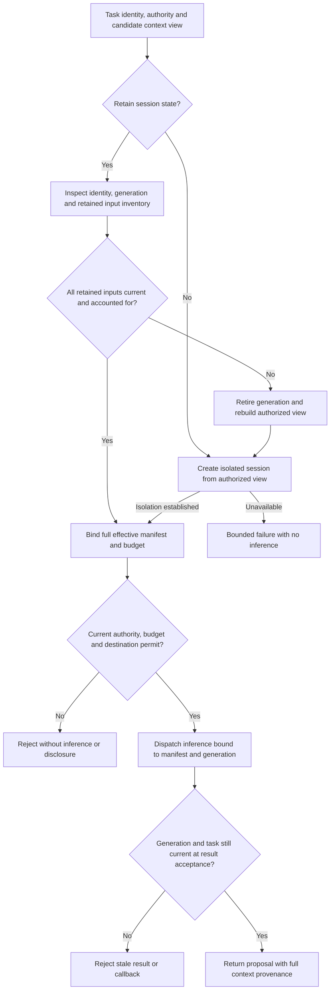

## Validation required for the detailed designs

| Concern | Unit | Integration | End-to-end |
| --- | --- | --- | --- |
| Loop | Transition/invariant and budget tests with generated event sequences | Durable transitions, late results, crashes at dispatch boundaries | Coding workflow with restart, user steering and cancellation |
| Graph | Retrieval/invalidation/authorization properties and budget limits | Concurrent storage, projection recovery, migrations and deletion | Changed source invalidates a proposal; retrieved evidence explains the final result |
| Decisions | Schema and deterministic policy tests with controlled outputs | Real Swift model adapter with cancellation and unavailable-model cases | Actual on-device decisions in local and remote-assisted workflows |
| Tools | Registry contracts and capability decisions | Actual constrained processes and denied resource access | Malicious content cannot induce unauthorized execution or egress |

The following regression scenarios are required design acceptance cases, not
implemented tests. D3-D5 must assign concrete fixtures, commands and environments
before the corresponding implementation packets become ready.

| Case | Required result |
| --- | --- |
| H1: failure handling | Stop new dispatch and retain the failure cause through recovery |
| H2: shared budgets | Prevent duplicate spending and retain allowance for unknown usage |
| H3: control during recovery | An accepted cancellation prevents work from resuming |
| H4: user-decision expiry | A missed decision deadline cannot start more task work |
| H5: model session isolation | Reject inputs and results from an invalid task or session generation |

### H1: failure handling

**Initial state:** a task in any nonterminal state, including paused or waiting.
**Trigger:** a fatal error, task deadline or exhausted task budget.
**Required result:** stop new dispatch and preserve the failure cause. Pausing must
not extend the task deadline. Recovery uses its own limited resources.

- **Unit:** test each trigger in each nonterminal state. Vary the ordering of
  failure, success and cancellation. Verify dispatch is blocked after failure wins.
- **Integration:** crash at failure-intent recording, stopping and terminal commit.
  Expire a deadline during external work. Make the authority store unavailable and
  inject unknown effects or usage. Restart must not reset budgets or permit dispatch.
- **End-to-end:** expire a CLI task during an actual operation, then restart.
  Report the original cause, remaining effects and any uncertainty.

### H2: shared budgets

**Initial state:** parent and child operations share limited allowance.
**Trigger:** concurrent admissions, duplicate requests, crashes or unknown usage.
**Required result:** no duplicate allocation or refund. Unknown usage keeps its
reservation, including after cancellation or restart.

- **Unit:** check ancestor limits, duplicate operation IDs and repeated settlement.
  Cover distinct units, numeric overflow and usage above a reserved maximum.
- **Integration:** race admissions for the last allowance in real storage. Crash
  before and after admission and settlement. Inject unknown provider usage, a
  partitioned remote budget envelope and obsolete owner epochs.
- **End-to-end:** run parallel delegated work to a shared limit without overspend.
  Cancel and restart with unknown usage. Later evidence may settle the account but
  must not reopen the task. I5 and I7 add actual provider and two-host evidence.

### H3: control during recovery

**Initial state:** the task is reconciling an operation with an unknown outcome.
**Trigger:** a pause or cancellation request arrives during recovery.
**Required result:** retain the request through restart. Cancellation takes
precedence and must prevent new task dispatch.

- **Unit:** vary the order of pause, cancellation and recovery completion.
- **Integration:** record cancellation, restart, then deliver a late outcome.
  Verify that work does not resume.
- **End-to-end:** disconnect an executing host and cancel from another client.
  Reconnect and report known effects or explicit uncertainty.

### H4: user-decision expiry

**Initial state:** a required user decision is pending; an action may be unresolved.
**Trigger:** the decision deadline expires while responses or cancellation arrive.
**Required result:** record one winning outcome. Expiry must not start new model
inference, repeat the question or resume task work.

- **Unit:** vary response, timeout and cancellation order against one task revision.
- **Integration:** restart with an expired decision and unresolved action. Reject
  late or duplicate responses and preserve failure or cancellation intent.
- **End-to-end:** let the decision expire through CLI or TUI. Show failure or
  reconciliation without another question or new work.

### H5: model session isolation

**Initial state:** tasks have different access scopes or retained model input.
**Trigger:** task switch, revocation, deletion or a late model callback.
**Required result:** only current, authorized inputs may affect an accepted result.

- **Unit:** reject task or generation mismatches. Account for all retained input
  in provenance and budget checks.
- **Integration:** use the real adapter for task A and then task B. Revoke access
  or delete input during inference. Inject obsolete tool callbacks. Verify session
  retirement or isolated reconstruction.
- **End-to-end:** run tasks with different access scopes and revoke access during
  one task. Verify that excluded evidence never enters later effective input and
  that invalidated outputs are rejected.

Session tests must inspect admitted effective inputs, manifests and generation
acceptance at the adapter boundary. Absence of a secret in one stochastic model
answer alone does not prove isolation. Exercise both stateless and retained-state
paths if both are shipped, including remote conversations when I5 is delivered.

Also define model evaluation datasets, protocol fuzzing, multi-client race tests,
context poisoning cases, token-boundary cases, graph growth/retrieval benchmarks,
and control latency during model load. Each test needs an observable oracle;
no production safety claim is established by fixtures alone.
