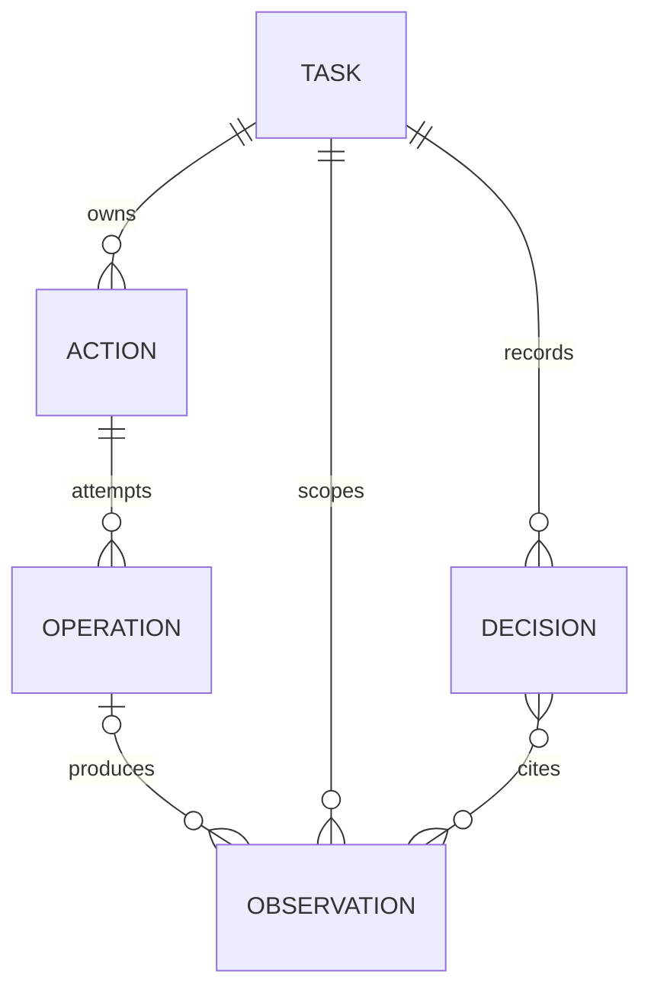
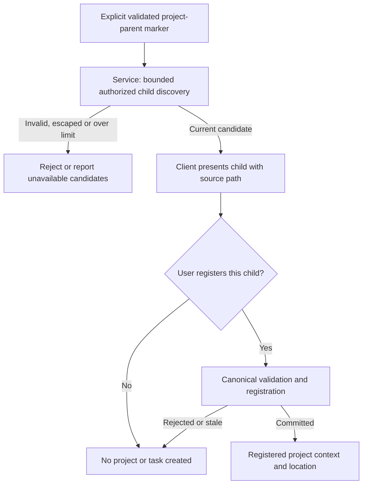
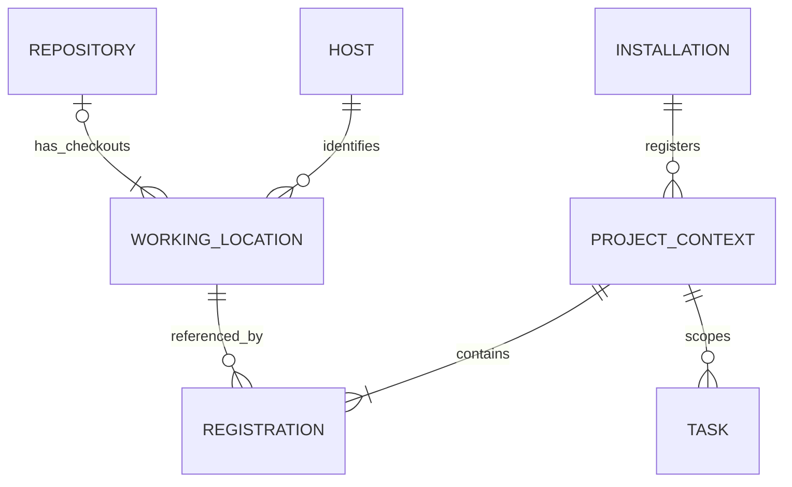
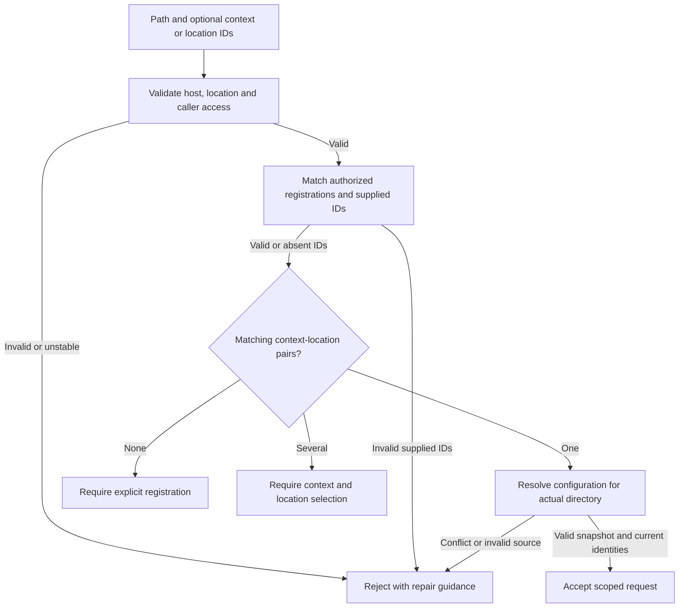
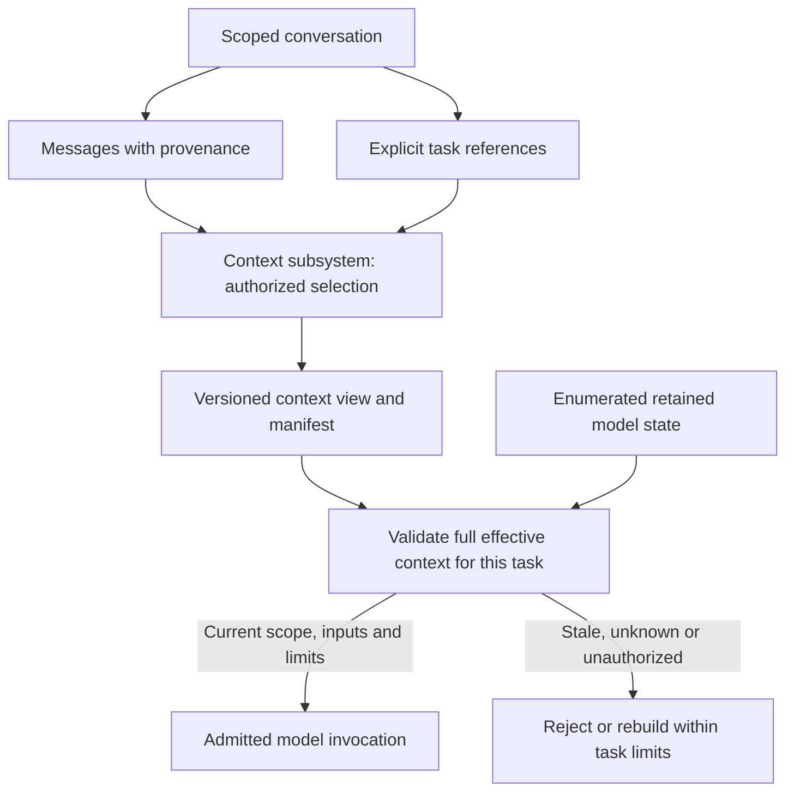
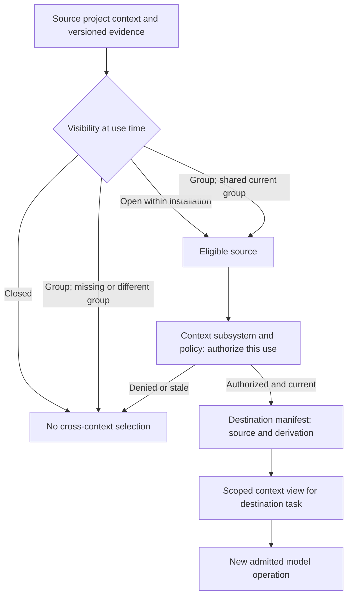

# D0 domain model

Status: D0 semantic model for review. One-project-context conversations,
installation-local visibility and project-parent discovery are selected; other relationships remain
proposed. Existing requirements retain authority through linked contracts.
No physical schema, runtime mechanism or implementation readiness is claimed.

This document owns D0 relationships and identity semantics. The
[glossary](../glossary.md) owns short definitions; the
[workflows](product-workflows.md) own observable scenarios. D3 selects durable
schemas and concurrency mechanisms; D4 selects graph and model representations.

## Owners and records

Required ownership follows the [architecture](../architecture.md#control-and-execution-boundaries).
The record boundaries below are proposals for those owners.

| Concept | Meaning and canonical owner |
| --- | --- |
| Task | Work with goals, acceptance criteria, scope and limits; the orchestrator owns its identity, revision and lifecycle |
| Conversation | User-visible grouping of messages and task references; the orchestrator owns membership, while clients render it |
| Agent instance | Runtime participant assigned bounded work; the orchestrator owns assignment, and the runtime reports execution evidence |
| Host | Execution device with its own identity and enforcement; host services enforce local grants |
| Action | Identified proposal and intent for work, retained through admission, execution and recovery under the harness contract |
| Operation | Individually admitted execution attempt, such as a model invocation or tool call; the orchestrator owns admission and usage |
| Observation | Evidence with source, version, scope and trust provenance; the context subsystem owns its representation |
| Decision | Typed conclusion or request; its kind identifies whether it is a model proposal, policy result or authorized user response |

A decision is not a generic permission token. The on-device subsystem produces
proposals. The policy component evaluates authority. The orchestrator accepts
user responses against pending task/decision revisions. Host services enforce
current grants. These records must remain distinguishable in inspection and audit.

### Task, action and evidence relationships

Proposed logical cardinalities. Edges describe references and ownership, not
database tables or transactions. An observation may originate outside an action.

An action can be rejected before any operation starts. Each actual attempt has
its own operation identity, reservation and outcome. Transport retransmission of
the same admitted operation preserves that identity; it does not allocate again.
A retry that may execute again requires fresh admission and accounting. The
[budget contract](core-harness-brief.md#aggregate-budget-ownership-and-admission)
governs the exception where a provider proves it is the same operation.

Framework tool callbacks and delegated work cannot hide inside an untracked model
operation. Each requires admission. D3-D4 must specify parent links and action
granularity while preserving separate attempt identities and cumulative budgets.

Task acceptance is distinct from action admission and execution completion.
An observation is evidence, not authoritative task state. A terminal task cannot
restart because a late observation arrived; late usage evidence may settle a
reservation. The [failure contract](core-harness-brief.md#common-failure-and-deadline-contract)
owns these transitions and supersedes any simplified client presentation.

## Service, project and location identity

Required behavior comes from the
[service contract](user-service-configuration.md#project-context-identity).
One installation belongs to the per-user service. Its contexts share the bound
graph, while tasks, evidence and model history retain their authorized scope.

The following refinements are proposed:

- A project context groups one or more registered working locations. It can
  include several repositories or a directory that is not a repository.
- A repository represents related version-control history. Independent clones
  have distinct local repository identities even when their remotes match.
- A worktree is one checkout associated with repository history. Each worktree
  has a separate working-location identity, including separate branch/dirty state.
- A working location names a validated root on a particular host. A request also
  identifies its validated working directory within that location.
- Several contexts may explicitly register the same location. This shares a
  filesystem object, not task state, permissions or model sessions.

Selected distinction: a project parent is an explicitly marked discovery
container within one installation. It may help find candidate child projects,
but it is not a project context, registration or working location. Marking a
parent does not register a child, select a task directory or grant access.
Each child still needs explicit registration before Asura can use it as a
project context. D1/D3 must define validation, bounded discovery, aliases,
persistence, change handling and authority for the parent marker. The
[initial selection flow](production-bootstrap-status.md#initial-visible-selection)
shows where the explicit parent choice occurs.
The marker does not alter root-to-leaf configuration discovery or make parent
files governing instructions for a child task. The service registry owns the
marker; the client only presents candidates returned by an authorized,
bounded discovery operation.

### Project-parent discovery boundary

Selected D0 semantics. Arrows show possible discovery and an explicit later
registration, not automatic child registration or selected filesystem traversal.

### Registration relationships

Proposed logical cardinalities. Registration is the association between a context
and a location. The optional repository permits non-repository locations. In this
model, a repository checkout is represented by a working location, not a second
independently registered worktree record. Project parents do not appear in this
registration diagram because their discovery role creates no registration edge.

Every accepted task identifies its installation, project context, host, working
location, validated working directory and pinned configuration snapshot. An opaque
identifier is a reference, not a grant. Requests and observations must be authorized
for the referenced scope.

### Resolving aliases and overlap

Proposed selection behavior. Edges show service decisions before task acceptance.
Canonical filesystem identity and race-resistant access remain D1-D3 work.

Path convenience is a service resolver function. Clients must not independently
choose the deepest repository or keep a shared current project. Hidden registrations
must not appear in unauthorized diagnostics. Selection of a context does not stop
configuration discovery at that context's root.

Two symlink spellings of the same validated location resolve to the same location
identity and configuration chain. Re-registering that location within the same
context returns the existing association. An overlapping parent and child location
remain distinct registrations; ambiguity requires explicit selection of the
context-location association. A context ID alone is insufficient when that context
has several matching locations. Invalid supplied IDs reject the request; they
must not trigger registration or fallback to another association. Remote URLs,
branch names and path strings alone cannot prove location identity.

A move, deletion, replacement or mount change makes affected identity assumptions
stale. The service must revalidate before admitting work. An explicit authorized
relocation may preserve logical identity only after validating the intended object;
replacement must not silently redirect an existing task. D3 defines the identity
evidence, revision transitions, retention and recovery procedure. D1 determines
which filesystem races and adversaries the platform can resist.

Overlapping registrations cannot bypass filesystem limits or configured ancestor
budgets. Distinct context IDs do not isolate physical writes to a shared location.
D3-D4 must define conflict detection and coordination before operations can race
there; I6 additionally requires an edit-conflict contract. Until then, the proposed
initial workflows retain the existing source-read-only boundary.

## Conversations, tasks and model input

Selected D0 behavior: a conversation belongs to one project context and principal
scope. It contains messages and references to zero or more tasks. A task may be
submitted without a conversation. Attaching another client does not create a new
task, principal or model session. Starting work in another context creates a
separate conversation or standalone task with explicit scope.

A new message does not silently mutate active task goals or authorize an action.
The control contract distinguishes a new task, an explicit task revision and a
response to a pending decision. D3/D6 define these commands and conflict reporting.
Child tasks retain parent links and constrained budgets; conversation membership
cannot remove that ancestry or transfer authority.

The required [multi-project workflow W6](product-workflows.md#w6-navigate-projects-and-concurrent-activities)
adds client navigation across these existing entities. A client's visible selection
is presentation state, not an installation-wide current project or a task scope.
For each project view, the client retains a logical working location and validated
working directory. Returning to that project restores its last valid selection;
it does not change the TUI process's OS working directory. A new command captures
the visible logical location and directory before the client can navigate away.
Displaying another conversation does not move the original conversation, task,
agent assignment or model session. D3/D6 must define explicit command targets and
per-client view restoration without changing the canonical ownership above.

### Conversation and model boundary

Proposed relationship view. Solid arrows are references or validated input flow.
The gate preserves the required effective-context contract; it is not a new owner.

Conversation history is not automatically model input. Selected messages require
the same provenance, scope, freshness and budget checks as other evidence. A model
session never becomes the conversation's authoritative task state. Retained sessions
must obey the [model-session contract](core-harness-brief.md#model-session-ownership-and-effective-context),
including task/principal isolation, invalidation and rejection of stale callbacks.
Explicit evidence selection across tasks does not permit reuse of another task's
retained model session.

## Project visibility and linked evidence

Selected D0 intent: one installation may link context information and data from
several project contexts in its bound graph. A newly registered project context
is closed by default. Its visibility can later be open or group. A context can
belong to at most one project group at a time. Open permits eligible reuse by
other authorized contexts in the same installation. Group visibility limits
eligibility to authorized members of the same current group. Closed prevents
cross-context reuse. These labels do not grant access by themselves. Every
selection still requires current authority, source provenance and destination
scope checks.
No label permits cross-installation or cross-user disclosure.

Linked evidence retains its origin context, source version, visibility revision
and derivation history. The context subsystem must record those facts in the
destination task's manifest before the evidence can enter model input. A change
to visibility or membership must invalidate affected derived views and retained
input under D4's effective-context contract. D3 must define who can declare a
visibility change, group identity and membership, its durable winner, and how
revocation affects running work. D4 must define permitted data classes, derived
data sensitivity and per-use selection.

Path-scoped AGENTS.md instructions, task permissions, budgets and retained model
sessions do not transfer through a project link. If another project's file
content is eligible as evidence, the destination task treats it as cited,
lower-trust input, not as governing instructions or a permission grant.

### Cross-context selection boundary

Selected D0 intent. Arrows show eligibility and per-use validation, not a
physical SurrealDB schema or an automatic graph traversal.

## Design and validation handoff

D3 owns concrete identity formats, idempotency scope, conversation persistence,
task revisions, location validation, atomic admission, visibility and group
membership records. D4 owns observation schemas, action granularity, graph
reuse and cross-context invalidation. D5 owns remote identity mappings;
local paths cannot be interpreted as remote paths. D6 owns client presentation.

The [requirements matrix](requirements-validation.md) maps these relationships to
unit, integration and end-to-end evidence. Before D0 exit, reviewers must resolve
or accept the remaining proposed relationships. Before implementation, D3-D4
must provide executable contracts and tests for aliasing, overlap, retries,
session isolation and linked-evidence access.
This semantic model neither selects a storage engine nor opens the coding gate.
