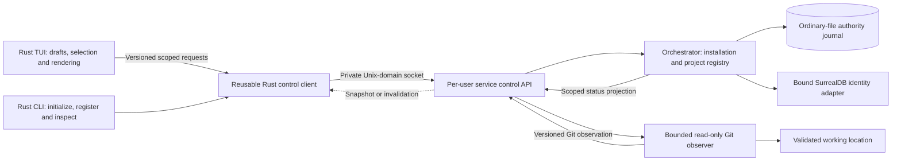
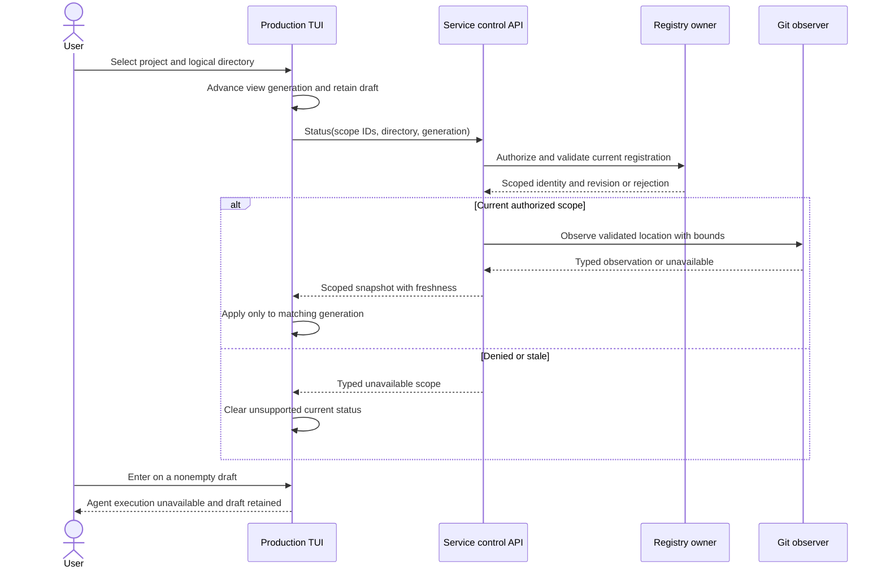

# Early production status slice

Status: proposed scoped D2-D3-D4-D6 design for review. On 2026-09-25, the owner
selected a status-first production trial and a Unix-domain socket for its
standalone per-user service. The trial shows real project and Git status before
local agent execution. This document narrows the first practical trial;
it does not authorize code or qualify I0-I4. The open contracts below prevent
implementation readiness.

## Outcome and boundaries

The first trial runs a real Rust control client and the selected per-user service.
It initializes or recovers the installation, registers existing directories,
supports project navigation and renders a live composer status bar from scoped
service observations. The TUI retains local drafts while the user navigates.
Enter does not submit agent work in this slice; it gives one clear unavailable
reason and preserves the draft. The service cannot fabricate a task, model
session, context percentage or agent response. The right side of the bar shows
an explicit unavailable model identity and `?%` until the I3 model owner exists.

This slice reuses the [production bootstrap and status contract](production-bootstrap-status.md),
the [multi-project workflow](product-workflows.md#w6-navigate-projects-and-concurrent-activities),
and the [prototype's visual geometry](tui-project-status.md). It is not an
extension of the synthetic experiment. The first trial does not execute tools,
read source for model input, invoke a model, load Skills or MCP, modify source,
or claim release readiness. It may observe bounded Git metadata through the
service's selected workspace observer. All other capabilities remain visibly
unavailable rather than silently using fixture data.

The complete I0-I4 plan and I9 qualification still apply. The slice can enter
production implementation only after a scoped D8 review proves that every
contract it uses is ready, followed by owner review of this design and its
implementation packet and explicit authorization. The broader D8 gate still
governs later capabilities. A packet may complete locally without completing
its parent increment or the release.

### Dependency and ownership view

Selected scope, proposed component interactions. Solid arrows are service
requests or observations; the dotted arrow is a client presentation update.
The same owners continue into later increments.

The orchestrator owns installation and project identity, durable registration
and status projection. The service's observer owns Git collection. The TUI
owns only its current draft count, visible selection, local draft retention and
spinner drawing from delivered state. No new client-side registry, Git parser,
authorization evaluator or model-usage estimator is permitted. A project parent
remains a discovery container, not a project or working location.

## User-visible trial

1. `asura` attaches to or starts the one user service. It shows verified ready,
   uninitialized, unavailable or repair state; it never auto-initializes.
2. After explicit initialization, a launch directory with one current authorized
   registration becomes the visible project. Overlap or no match opens an
   explicit choice. The user may register the existing directory, mark a
   discovery-only project parent, choose a known project or continue without a
   selected project. Each action has its own authorization and validation.
3. Project navigation restores each client's last valid logical working
   location and directory. It does not change process cwd or retarget a draft.
4. The bar shows real project/path and Git observations. Unknown, non-repository,
   detached, merge, rebase and clean states remain distinct. A nonempty draft
   adds the local character count. No synthetic running spinner appears.
5. A status change, invalidation or reconnect refreshes the matching scope.
   Stale and unauthorized fields disappear or become explicitly unavailable.
   Typing and navigation remain responsive while observations are slow.

Exact first-use controls, unavailable wording, status freshness, response
deadlines and project-parent discovery limits remain D3/D6/D7 decisions. The
client may reuse the prototype's geometry and editor adapter only after the
production ownership and dependency review confirms that reuse is safe.

### Status and submission boundary

Proposed D3-D6 sequence. A view generation prevents a late result from project A
overwriting project B. Enter cannot create a task while the execution capability
is absent. Durable registration acknowledgements follow the journal contract.

## Failure, security and recovery

The [D1 threat model](threat-model.md), [service boundary](system-architecture.md),
[authority recovery design](persistence-recovery.md) and [binding contract](context-storage-candidates.md)
must become ready for the operations used by this slice. The first trial writes
real installation and registration records, so an uncertain write, corrupt
journal, competing service owner, unsafe home, stale path or graph identity
conflict must fail closed with repair information. It cannot replace the graph
or registration to make the UI look ready. Both configured graph modes must be
represented accurately; an unqualified mode is unavailable, never a fallback.

The service authenticates the selected same-UID principal and rechecks scope on
each request and before disclosing a collected observation. Reconnect retires
the old attachment; an old response cannot become current merely because the
project selection is unchanged. The [status publication contract](production-bootstrap-status.md#publication-and-attachment-validity)
owns these rules and their remaining D3 mechanism decisions.

A launch path or project-parent marker is not a grant. Git reads are read-only
and confined to the validated location. They have byte, time and concurrency
limits. The service treats their results as untrusted metadata. A slow observer must not block
local editing or unrelated service control. Status events carry scope identity,
revision and freshness; reconnect obtains a fresh authorized snapshot before
showing current values. Sensitive paths and content are not written to ordinary
telemetry. D1-D3/D7 must fix the concrete mechanisms and limits before code.

## Validation and readiness

| Case | Unit | Integration | End-to-end and environment |
| --- | --- | --- | --- |
| ES1: startup and ownership | Launch-mode and typed-state rules | Competing real processes, endpoint loss, journal replay | CLI/TUI attach, explicit init and recovery on supported macOS |
| ES2: registration and directory choice | Identity, overlap and no-auto-action decisions | Real aliases, replacement and authority changes | Register, choose overlap and reject stale path in Ghostty and Terminal.app |
| ES3: project-parent discovery | No implicit project/task, bounded candidate rules | Real large tree, escapes, symlinks and changes | Mark parent, inspect child and register it separately |
| ES4: live Git and bar | Typed clean/dirty/detached/merge/rebase/unknown states | Actual Git fixtures, observer failure and delayed updates | Inspect real bar while editing and switching projects in both terminals |
| ES5: unsupported agent | Preserve exact draft and absence of task admission | Service receives no task command | Enter explains unavailability and draft survives navigation/reconnect |
| ES6: stale scope and recovery | Generation/freshness and invalidation rules | Delayed A event after B selection, disconnect and restart | No cross-project status leak or false current value in either terminal |

These cases supplement PBS1-PBS14 and W6-A through W6-D; they do not replace
the deeper fault matrix. D7 must assign exact test IDs, commands, durations,
fixtures and supported host versions. Mock and PTY evidence cannot establish
real service, filesystem, graph-binding or native-terminal behavior. Visual
previews must be inspected, with Ghostty and Terminal.app results recorded
separately. No release or full I0-I4 completion claim follows this trial.

### Open readiness items

- D1: qualify home, runtime directory, filesystem identity and read-only Git
  confinement on supported macOS.
- D2: fix production Rust package ownership, selected Unix-socket service
  attachment, owner-lock behavior and the control-channel contract, including
  versioning and bounds.
- D3: fix authority-journal encoding and recovery, graph binding, registration,
  project-parent marker, view restoration and status snapshot/event schemas.
  The [publication contract](production-bootstrap-status.md#publication-and-attachment-validity)
  also requires disclosure ordering, attachment identity and observation ordering;
  PBS12-PBS14 qualify races that a view generation alone cannot reject.
- D4: name and qualify the Git observation owner. Model-context accounting is
  outside this slice and remains unavailable.
- D6: finish first-use choices, status wording, editor behavior and accessibility.
- D7: define executable ES1-ES6 evidence and the local test environment.
- D8: review only the contracts exercised by this slice, record later gates, and
  obtain owner review of the ready design and implementation packet.
