# Early production status slice

Status: production TUI contract with incremental implementation and recorded
validation. The initial thin checkpoint below predates automatic setup, project
selection and Git observations. Their later contracts govern current behavior:
[bootstrap and registration](production-bootstrap-status.md),
[context observations](context-observations.md), and
[event routing](event-routing.md). Remaining trial acceptance cases are retained.
On 2026-09-25, the owner
selected a status-first production trial and a Unix-domain socket for its
standalone per-user service. The trial shows real project and Git status before
local agent execution. This document narrows the first practical trial;
it does not qualify I0-I4. The open contracts for the full project/Git trial
below do not block the selected thin checkpoint.

## Selected thin production TUI

The user's latest sequence brings the production TUI forward before registration
and Git observation. This checkpoint uses the real service and installation
inspection already delivered. It does not depend on stages 3B, 3C or 4. The full
project/Git trial below remains required later, with its original acceptance cases.
Current implicit implementation authorization applies after scoped design review.

### Launch, presentation and editor

Bare `asura` opens the Rust TUI when stdin and stdout are terminals. Otherwise,
return the existing usage error (exit 2) without terminal changes or service
startup. Interactive launch attaches first. If account runtime resolution or
attachment reports absent/refused, the observation worker opens the canonical
platform log sink at the account home's `.asura/logs/asura.log`, then resolves
runtime with creation enabled and calls the existing client startup owner.
The existing posix_spawn launcher starts the backend as a child. A backend
started by this TUI must drain and stop when this TUI exits. A TUI attached to
a pre-existing backend exits alone. Explicit Stop, termination signals and owned
client exit each retain their shutdown intent through delayed worker settlement.
After entering repair-only during drain, finish shutdown when all workers settle;
do not require a second Stop. Tests must verify lock retention while stalled and
automatic endpoint removal and owner release after settlement. Owner contention attaches to the
winner. Unsafe paths, protocol mismatch and other errors never authorize spawn.
One automatic start attempt is allowed per TUI launch, preventing restart loops.
A successful attachment also resolves startup: later disconnection retries attach
only and does not silently replace an independently managed backend.
Failure remains visible while editing and local commands stay available.
For `incompatible_protocol`, state that an existing backend is incompatible and
that its owner must restart it with the current build. Do not suggest that logs
alone resolve the failure. Preserve drafts and never stop or replace that backend.
A renderer regression check must verify this recovery message.

Use the platform account-home resolver, not HOME or the shell working directory.
The fixture injects both scratch runtime and log resolvers; production exposes
no runtime override. Open the selected log sink before runtime creation. Pass it
to the existing launcher for fd2; never inherit interactive stderr into the child.
An already running service keeps its existing log sink. This automatic TUI launch
uses file logs explicitly; ordinary `service start` retains its existing logging
selection. Log failure prevents spawn. The launcher performs no database
initialization; the service owns automatic setup under the bootstrap contract.

The client owns one cancellation-aware start API; existing callers delegate to
it with cancellation disabled. Check cancellation at entry, before spawn and
between startup retries. Cancellation never stops a pre-existing backend. Closing the launching TUI
lifetime channel stops only its own spawned backend, including during startup. Worker cancellation uses the
bounded settlement below even during startup. Tests cover absent startup,
repeat attachment/same epoch, owned shutdown versus attached-client exit, redirected
logs, and no-spawn errors/cancellation, all under isolated scratch roots.

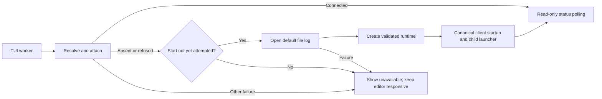
```mermaid
flowchart LR
    Launch[TUI worker] --> Attach[Resolve and attach]
    Attach -->|Connected| Inspect[Read-only status polling]
    Attach -->|Absent or refused| Once{Start not yet attempted?}
    Attach -->|Other failure| Error[Show unavailable; keep editor responsive]
    Once -->|Yes| Log[Open default file log]
    Log --> Runtime[Create validated runtime]
    Runtime --> Start[Canonical client startup and child launcher]
    Start --> Inspect
    Once -->|No| Error
    Log -->|Failure| Error
```

Reuse the experiment's terminal outline, composer/editor and status-row geometry.
Use Wisp as the visual baseline. Keep one cell of internal left and right
padding for log content, notices and overlays. The composer background and its
half-block strips span the full terminal width, with no external margin.
Its content keeps one cell of internal left and right padding. The status row
uses that same inset, so its text aligns with the prompt. The minimum terminal
size remains 30×8. Resize guidance also stays inside the outer padding.
When a bottom-anchored status overlay or queue panel is visible above the
composer, fill the top separator row with the composer blue. This removes the
half-cell gap. When both panels close, restore the upper half-block strip.
Keep the lower strip, input geometry, and overlay padding unchanged.

The top status pane spans the terminal width with muted blue-grey RGB(55, 66, 76).
Reserve the composer blue RGB(37, 59, 78) for user input.
Its first row shows `Asura`, the compiled package version, the observed connection
status and a project-tab area delimited by `<` and `>`. Use one cell of internal
padding. Show registered directory names and mark selection with `*`. Before
discovery completes, show `Projects loading`; only a verified empty registry
shows `No projects`. Tab navigation is not yet enabled. A full-width `▀` row follows,
using the band colour as foreground and terminal-default background below it.
At widths below 60, use a compact name/version, project and connection row.
Shorten text by display cells if required; preserve the minimum-size behavior.

The composer status path identifies the context's working directory, distinct
from its project root. In this slice, a launch inside a registered project uses
the launch directory, including subdirectories. Selecting another project uses
that project's root as its initial context directory. No directory-change command
exists yet. The worker supplies the observed launch directory; rendering performs
no filesystem calls. Retain the known directory across disconnects and registry
refreshes. This display locator grants no tool access or execution authority.
At normal widths shorten the path to fit before dropping it; compact layouts may
omit it. Unit and terminal checks must distinguish a nested launch directory from
its project root and cover switching projects and narrow Unicode layouts.
The CLI renderer owns this presentation. Git status follows the selected
[context observation contract](context-observations.md): service filesystem
signals produce bounded observations consumed by a dedicated client worker.
Rendering performs no Git or network operations. Validate full,
compact and minimum-size buffers for the header fill, separator and connection
text; retain existing real-service connection journeys.

The main body shows real service lifecycle and installation state/reason. Keep
an empty conversation area; no synthetic welcome conversation, agent reply,
project name, Git branch or task exists. The composer follows the [project status layout](tui-project-status.md): the tinted input band contains a fixed `›` prompt and editable draft.
Place the prompt one cell inside the input band's left edge, followed by one blank cell; start
the editor two cells after the prompt position. Reserve that gutter on wrapped and continuation rows,
with the prompt only on the first visible editor row. The prompt is presentation
only: it is not draft text and does not affect selection, copying or character
count. Measure wrapping after the two-cell prompt gutter; use the rest of the
content width, retaining the one-cell right padding. The lower half-block strip closes
that band; a single status row follows on the terminal-default background.
Display prior user messages with a muted full-width band, using RGB(38, 51, 65).
This is the rounded midpoint between the composer blue RGB(37, 59, 78) and
the reference terminal background RGB(38, 43, 51). Terminal-default backgrounds
remain configurable by the terminal; this palette does not query terminal colours.
Preserve the composer prompt gutter, internal padding and half-block spacing. Wrap message text within
the gutter and right padding; continuation rows do not repeat the prompt marker.
Viewport clipping must preserve these styles when the history exceeds its height.
Responses use the default background with a small square `▪` in the same marker
column as `›`. The square foreground matches the composer background RGB(37, 59, 78).
Response text starts in the same column as prior input text.
Wrapped response rows retain this gutter without repeating the marker. Empty
responses have no marker. Clipped continuations do not invent a new marker.
Rendering checks compare composer and history cells at wide and narrow sizes,
including multiline input and history overflow. Inspect a rendered terminal image.
This styling requirement does not add synthetic history or submission behavior.
There is no permanent keyboard-hint row. F1 owns ordinary key guidance; paste
capture and action feedback use a temporary notice above the input.

### Composer top separator

Selected design. Arrows show presentation decisions during each redraw; they do
not start a worker or change conversation state.

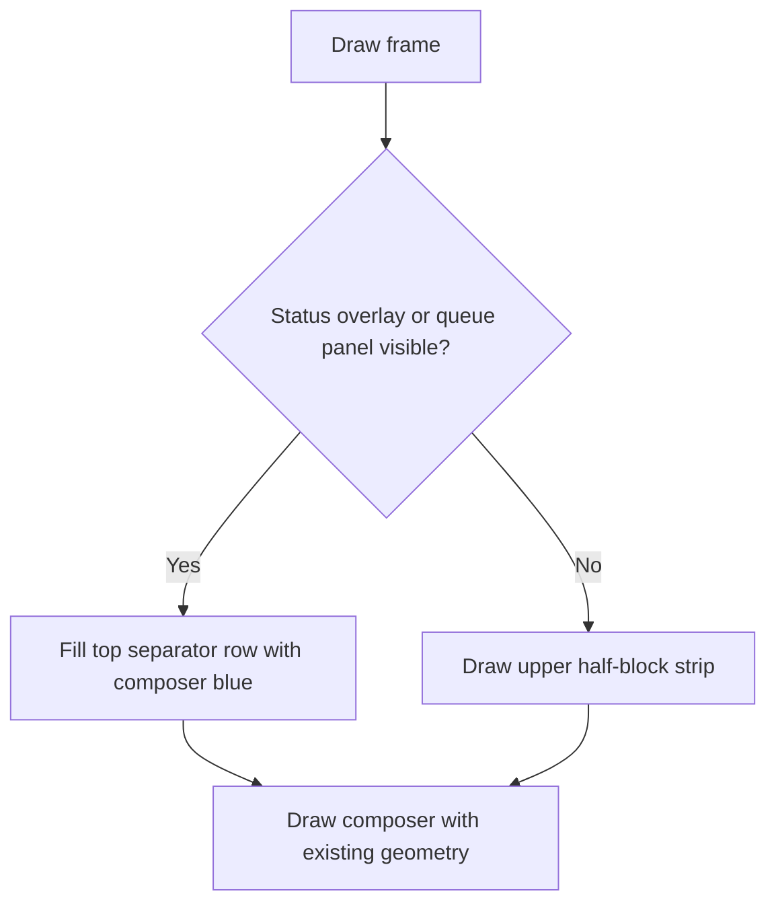
```mermaid
flowchart TD
    Draw[Draw frame] --> Box{Status overlay or queue panel visible?}
    Box -->|Yes| Full[Fill top separator row with composer blue]
    Box -->|No| Half[Draw upper half-block strip]
    Full --> Composer[Draw composer with existing geometry]
    Half --> Composer
```

The left status group shows cyan `No project`, muted `path ?` and `git ?`
placeholders, then the local grapheme count (`N chars`) only for a nonempty draft.
The right group shows `0% · unavailable`. These placeholders do not infer
project association, repository state, model identity or usage. Unknown Git
covers both branch and line counts; do not invent a branch or zero counts.
At widths below 60, omit path/Git and use `Nc` and `0% · ?`.
Keep one-cell outer insets and at least two blank cells between groups. Shorten
path first, then omit path if needed; retain Git when it fits. Preserve the draft
count and unknown percentage, shortening project/model identity by grapheme.
Do not add queue totals, an activity spinner, model version or fast marker without
backend evidence. No extra backend or dependency is introduced.

Validate full and compact buffers, minimum size and long drafts: status is below
the band, default background, distinct left/right groups, correct colours and no
ordinary key hints. Retain editor and real-service PTY journeys. Inspect rendered
buffer previews separately from native-terminal appearance. Service connection state is separate from task activity; no task spinner
is fabricated. Render all service metadata literally with terminal controls
escaped. Narrow layouts prioritize service state and editing; below 30×8 show a
resize message while retaining draft and exit controls.

The client owns one in-memory draft; it is not a project association. Enter
shows `Agent execution unavailable; draft retained` without clearing text, undo
history or cursor, and emits no submission request. Repeated Enter is inert
apart from that same notice. No task, queue, steering, project switch, Skill,
MCP, model or command-discovery browser action is enabled.

Client-local commands now follow the experiment's invocation semantics: a slash
at the first character reserves the draft for command handling on plain Enter.
Recognize exact, case-sensitive `/help`, `/quit` and `/exit`, allowing trailing
whitespace. `/help` consumes the command draft and its editor history and opens
the same overlay as F1. Escape or F1 returns to an empty editor. `/quit` and
`/exit` request normal client cleanup immediately: the command itself is not
unsaved prose, and pending config requests may have an unconfirmed outcome.
Unknown names and non-whitespace arguments to these three commands show an error above input and retain
the entire draft and undo history. Never forward slash commands as chat. Leading
whitespace remains ordinary draft text. Paste, typing and Option+Return do not
invoke commands; overlays keep their existing input ownership. Tab completion includes these names and `/config`, whose service-backed
behavior follows the [configuration command contract](config-commands.md). With no selection and the
cursor within the first slash-name span, Tab completes a unique prefix in one
undo transaction. It replaces only that span, preserving arguments and later
lines. Exact names are unchanged. Zero matches retain the draft and show
`No matching local command`. `/` has multiple matches and opens a local command
list with no initial selection. Arrows select; Tab first selects the first item,
then Tab or Enter completes the selected name and closes the list. Completion
never invokes; a separate plain Enter is required. Escape cancels unchanged.
The captured draft/name span is checked again before replacement. Repeated Tab
cannot select or complete. Outside the eligible header, Tab inserts two spaces.
The editor owns captured spans and atomic replacement; App owns the fixed names,
matching and list focus. No service or extension catalogue is introduced.
Unit validation covers unique/exact/zero/multiple matches, selection/cursor
eligibility, Unicode arguments, stale captures, size limits, undo, cancellation
and completion without invocation. PTY validation completes all three commands
and selects from `/` before a separate Enter executes.

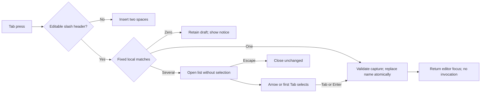
```mermaid
flowchart LR
    Tab[Tab press] --> Eligible{Editable slash header?}
    Eligible -->|No| Spaces[Insert two spaces]
    Eligible -->|Yes| Matches{Fixed local matches}
    Matches -->|Zero| Notice[Retain draft; show notice]
    Matches -->|One| Replace[Validate capture; replace name atomically]
    Matches -->|Several| List[Open list without selection]
    List --> Select[Arrow or first Tab selects]
    Select -->|Tab or Enter| Replace
    List -->|Escape| Cancel[Close unchanged]
    Replace --> Editor[Return editor focus; no invocation]
```
These three client-local commands work while disconnected. Client exit closes its owned-backend lifetime
channel; a pre-existing backend remains running. The CLI App owns dispatch; the existing terminal loop owns cleanup.
Unit checks cover exact names, arguments, unknown commands, retained history,
help dismissal and inert paste/repeats. PTY checks invoke help and both exit
names and verify restoration without creating a service runtime.

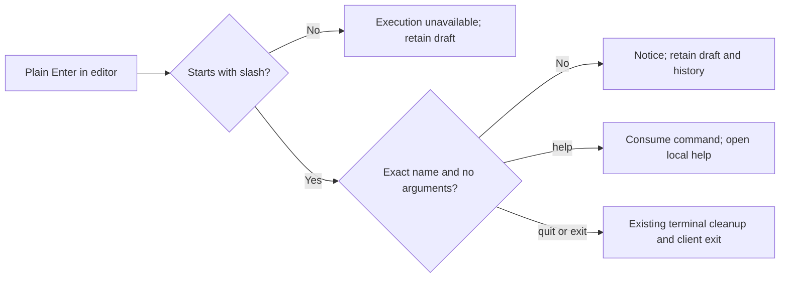
```mermaid
flowchart LR
    Enter[Plain Enter in editor] --> Slash{Starts with slash?}
    Slash -->|No| Draft[Execution unavailable; retain draft]
    Slash -->|Yes| Parse{Exact name and no arguments?}
    Parse -->|No| Error[Notice; retain draft and history]
    Parse -->|help| Help[Consume command; open local help]
    Parse -->|quit or exit| Exit[Existing terminal cleanup and client exit]
```
Exiting discards the local draft; no persistent conversation or session file is
created by this checkpoint.

Reuse the reviewed Unicode editor behavior: 65,536-byte draft cap, 100 undo
sequences, grapheme movement/counting, atomic bounded paste and two-space Tab.
Reject an oversized edit without altering the previous draft. Option+Return
adds a newline; plain Ctrl+J is ignored outside the existing explicit paste
capture route. Keep editor-only selection, undo/redo and paste controls, removing
fixture and task action bindings. F1 toggles concise help; Escape closes help or
an exit prompt, otherwise leaves the draft unchanged. Key release/repeat events
cannot trigger Enter, help or exit actions.

Ctrl+Q or Ctrl+C exits immediately with an empty draft. With text, display
`Discard draft and exit?` with `Keep editing` initially selected. Tab/arrow changes
the selection; Enter confirms it. Escape or repeated exit keys preserve text.
Ctrl+D exits only when the draft is empty and no overlay is open. An OS SIGINT,
SIGTERM or SIGHUP requests cleanup and exit; the process cannot promise draft
preservation after an external termination. Do not intercept native terminal
selection/copy or enable mouse capture in this checkpoint.

### Backend lifetime ownership

Selected correction: the TUI that starts a backend owns its lifetime. Attaching
to an existing backend never transfers that ownership. If another TUI attaches
to a TUI-owned backend, its exit does not stop the backend; the launching TUI's
exit still does. Explicit `service start` retains its independent lifetime.

Use one private anonymous pipe, not a discovered PID or a new lifecycle manager.
The platform owns pipe creation and validation. The TUI retains the sole write
end, marked close-on-exec. Its worker receives only the read end. The canonical
client startup owner may pass that reader through the existing posix_spawn
launcher to fixed fd4 with private `--internal-owner-lifetime` together with the
existing fd3 startup notice. All duplicated spawn sources must be above fd4.
The child validates fd4 as a read-only FIFO before runtime access, sets it
nonblocking/close-on-exec and transfers it to the existing service reactor.
No public runtime override or protocol message is added.

The TUI closes its writer on cancellation, normal exit, signal cleanup and Drop.
Process exit also closes it after a crash. Cancellation before/after spawn is
safe: a late child receives an already-closed lifetime. The child cannot inherit
a writer and keep itself alive. A losing startup contender exits normally; pipe
closure cannot affect the winning pre-existing service or a later replacement.
The existing client `start` path stays unchanged for standalone service commands;
a TUI-specific cancellable entry delegates to the same startup implementation.

The service registers its nonblocking lifetime reader with the readiness reactor.
EOF, unexpected bytes or read failure
request the same canonical drain used for termination. Trigger it once; do not
reset its deadline on repeated EOF. Preserve inspection cancellation, endpoint
cleanup and lock-last release. If inspection is still settling after the drain
budget, preserve the existing repair state and retry final drain when it settles.
A stopped or OS-blocked backend cannot respond until scheduled; the UI must never
wait indefinitely for it. No PID-based fallback kill is introduced.

Validation must prove: owned backend stops after normal/command/signal/crash exit;
attached backend and its epoch survive client exit; startup cancellation does not
orphan a late child; contender/replacement identity cannot be stopped accidentally;
invalid inherited descriptors fail before runtime creation; lifetime closure
reuses drain with bounded polling; the UI stays responsive with a stalled backend.
Platform tests cover pipe type/direction, EOF and descriptor inheritance. Service
integration covers EOF drain. Real isolated CLI/PTY journeys cover both lifetime
modes and cleanup. Preserve all existing deadline, draft and terminal tests.

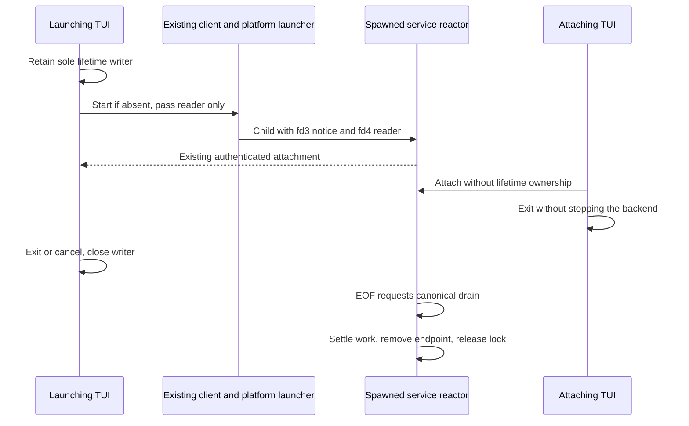
```mermaid
sequenceDiagram
    participant T as Launching TUI
    participant L as Existing client and platform launcher
    participant S as Spawned service reactor
    participant A as Attaching TUI
    T->>T: Retain sole lifetime writer
    T->>L: Start if absent, pass reader only
    L->>S: Child with fd3 notice and fd4 reader
    S-->>T: Existing authenticated attachment
    A->>S: Attach without lifetime ownership
    A->>A: Exit without stopping the backend
    T->>T: Exit or cancel, close writer
    S->>S: EOF requests canonical drain
    S->>S: Settle work, remove endpoint, release lock
```

### Process ownership and bounded observation

The CLI owns terminal lifecycle, editor, renderer and one observation worker.
Its binary and isolated test executable call the same CLI library entry point.
This keeps test-only unit fixtures out of the copied executable and adds no
production path override or separate client owner.
The existing Rust client owns peer authentication, protocol version, attachment
identity and deadlines. The service owns lifecycle and installation classification.
The worker subscribes to service status through `ObserveService`, which contains
both states. It does not read journal files or connect to a database. No Swift
process is involved. The [event routing contract](event-routing.md#cursor-subscriptions)
defines cursors, cached status and heartbeat semantics.

Use one worker, one outstanding subscription and one latest-result slot. Attach
and transport calls have two-second deadlines. An unchanged subscription waits
for a change or its one-second heartbeat. A failed call closes the attachment;
reconnect uses one-second backoff and a fresh authenticated attachment. No queue
of refreshes accumulates. UI/worker cancellation is independent of terminal input.
Each result carries a local connection generation, service epoch and monotonic
request-start time. Accept only the current generation and completed request.
A disconnect/error clears all previous service and installation claims immediately
on delivery. The UI also expires results five seconds after request start, including a first observation that has not yet arrived; show unavailable until fresh success. Reconnect
or resume after uncertain clock continuity retires the old generation and data.
Never present a prior epoch as a currently connected service.

The UI routes input and worker notifications through the bounded priority
dispatcher in [event routing](event-routing.md). Explicit deadlines wake expiry
handling. Redraw only on change or resize. No network, filesystem or service wait runs on the render
thread. The fixed-size snapshot and one result slot bound observation memory;
the editor's existing limits bound draft/history memory.

### Bounded input and exit correction

The selected macOS event source is Crossterm 0.29's `use-dev-tty` backend,
which uses level readiness through filedescriptor 0.8.3 (select on macOS).
This replaces its Mio edge readiness path, which can return a resize before
consuming a same-batch input readiness event. The source reuses stdin because
interactive launch already requires a terminal. Review the locked dependency
change before building. Keep one retained input reader, isolated from the
foreground dispatcher under [event routing](event-routing.md).

The platform boundary owns a guard that saves stdin/stdout descriptor flags
before changing either descriptor, enables O_NONBLOCK on both, then restores
the exact original flags on cleanup or setup rollback. The CLI terminal guard
owns this guard. Restore terminal modes before descriptor flags, including on
panic; do not wait for the status worker first. Platform `TerminalOutput` buffers at most 4 MiB per frame. Flush/pump makes only
nonblocking writes, at most 64 KiB and 16 write attempts per pump;
WouldBlock retains the pending byte offset and returns immediately. The UI calls
pump each turn and defers another draw while bytes remain, continuing input,
cancellation and status processing. One absolute 100 ms output deadline starts
at first flush and is checked on subsequent pumps; progress never resets it.
No sleeping or waiting is allowed in the output pump. Deadline/write failure
exits through cleanup. This bounds queue memory and prevents slow consumers from
blocking the reactor.
Ratatui is dropped while descriptors are still nonblocking, before guard cleanup.
Cleanup retries reacquire nonblocking descriptor state before writing if a prior
cleanup already restored flags. After interactive input closes, final teardown
may retry WouldBlock restoration for one absolute 100 ms budget, yielding 2 ms
between attempts. This is bounded terminal settlement after the reactor ends;
non-retryable failures return immediately. Never reset the budget on progress.
Normal event processing never waits for output. Retain setup/panic Drop cleanup
as best-effort restoration. A lost
or stalled terminal can prevent complete visual restoration; report errors after
attempting cleanup. This is bounded application behavior, not a promise against
an unscheduled process or a failed operating system.

The isolated terminal reader uses positive bounded polls because Crossterm's
selected backend does not check buffered events for a zero-duration poll. It
publishes decoded events to the foreground inbox. A partial escape or paste
sequence cannot block the foreground dispatcher. The event routing design owns
input admission, backpressure, cancellation and reader settlement.

Cancel the read-only status worker and restore the terminal, then wait at most
100 ms for completion using JoinHandle::is_finished. Join only a finished thread.
If still running, drop the handle and return from the CLI entry; the existing
binary's process::exit ends remaining threads. This is an explicit exception to
the prior mandatory join: this worker owns no terminal state or database mutations. Its optional startup
uses the existing standalone service launcher, whose TUI-owned child observes the lifetime channel closing on
client exit. Cancellation prevents further startup attempts. Check cancellation before resolution and again before attachment. Drop
uses the same bounded settlement. No new worker is started after cancellation.
Tests gate a worker deliberately to prove bounded settlement and release it after
the assertion; never leave test threads behind.

Regression PTY cases remove the 100 ms synthetic resize delay, interleave resize
with keys, leave an escape sequence incomplete while status refresh continues,
and stop a scratch service while editing/exiting. Verify normal mode and original user-controllable file-status flags are restored.
Darwin sets the kernel-only FWASWRITTEN flag on the first write and F_SETFL cannot
clear it; the PTY supervisor writes a probe before capturing baseline flags, then
requires exact equality after exit. Platform tests exercise flag restoration and
failure rollback on isolated descriptors. Existing command/editor journeys stay
required. No account service is changed by these tests.

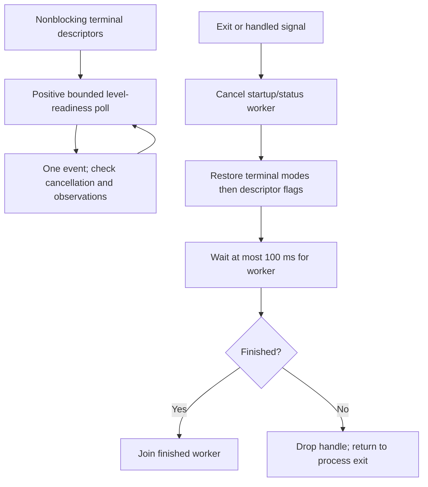
```mermaid
flowchart TD
    Input[Nonblocking terminal descriptors] --> Poll[Positive bounded level-readiness poll]
    Poll --> Loop[One event; check cancellation and observations]
    Loop --> Poll
    Exit[Exit or handled signal] --> Cancel[Cancel startup/status worker]
    Cancel --> Restore[Restore terminal modes then descriptor flags]
    Restore --> Wait[Wait at most 100 ms for worker]
    Wait --> Done{Finished?}
    Done -->|Yes| Join[Join finished worker]
    Done -->|No| Drop[Drop handle; return to process exit]
```

### Terminal acquisition and cleanup

The CLI acquires raw mode, alternate screen, bracketed paste and cursor state
through one terminal guard. Reuse the experiment's acquisition/rollback pattern,
not its fixture application. Restore every acquired mode in reverse order on
setup failure, normal exit, I/O failure, unwind and handled signals. Cleanup is
idempotent. Panic reporting follows restoration; SIGKILL and terminal loss cannot
be given a cleanup guarantee. Do not install two competing signal owners.

On exit, cancel the worker and restore the terminal before waiting for it. Use the bounded worker settlement above. Socket deadlines do not bound OS account
or filesystem lookups; do not use an unconditional join. No new Inspect begins
after exit. Buffer at most one stable terminal failure diagnostic for output
after restoration. Do not emit stderr tracing lines while the alternate screen
is active; service logging remains in its separate process and existing sink.
Never log draft text, pasted contents or raw service paths.

### Thin TUI interaction

Selected sequence. Arrows show UI actions and read-only observations. Service
failure affects status, not draft ownership or terminal input.

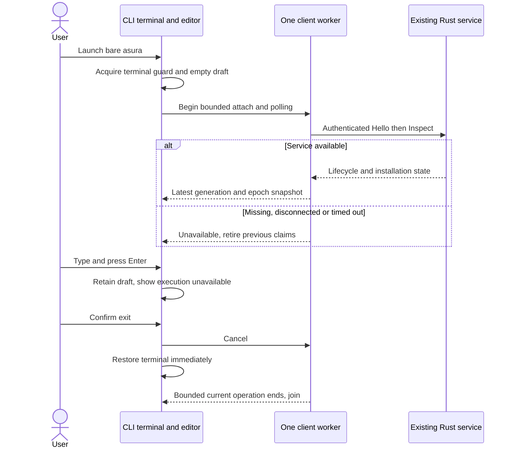
```mermaid
sequenceDiagram
    actor User
    participant UI as CLI terminal and editor
    participant W as One client worker
    participant S as Existing Rust service
    User->>UI: Launch bare asura
    UI->>UI: Acquire terminal guard and empty draft
    UI->>W: Begin bounded attach and polling
    W->>S: Authenticated Hello then Inspect
    alt Service available
        S-->>W: Lifecycle and installation state
        W-->>UI: Latest generation and epoch snapshot
    else Missing, disconnected or timed out
        W-->>UI: Unavailable, retire previous claims
    end
    User->>UI: Type and press Enter
    UI->>UI: Retain draft, show execution unavailable
    User->>UI: Confirm exit
    UI->>W: Cancel
    UI->>UI: Restore terminal immediately
    W-->>UI: Bounded current operation ends, join
```

## Outcome and boundaries

The first trial runs a real Rust control client and the selected per-user service.
It initializes or recovers the installation, registers existing directories,
supports project navigation and renders a live composer status bar from scoped
service observations. The TUI retains local drafts while the user navigates.
Enter does not submit agent work in this slice; it gives one clear unavailable
reason and preserves the draft. The service cannot fabricate a task, model
session, context percentage or agent response. The right side of the bar shows
an explicit unavailable model identity and a display default of `0%` until context measurements arrive.

This slice reuses the [production bootstrap and status contract](production-bootstrap-status.md),
the [multi-project workflow](product-workflows.md#w6-navigate-projects-and-concurrent-activities),
and the [prototype's visual geometry](tui-project-status.md). It is not an
extension of the synthetic experiment. The first trial does not execute tools,
read source for model input, invoke a model, load Skills or MCP, modify source,
or claim release readiness. It may observe bounded Git metadata through the
service's selected workspace observer. All other capabilities remain visibly
unavailable rather than silently using fixture data.

The complete I0-I4 plan and I9 qualification still apply. The slice can enter
production implementation only after a scoped D8 review proves that every
contract it uses is ready, followed by owner review of this design and its
implementation packet and explicit authorization. The broader D8 gate still
governs later capabilities. A packet may complete locally without completing
its parent increment or the release.

### Dependency and ownership view

Selected scope, proposed component interactions. Solid arrows are service
requests or observations; the dotted arrow is a client presentation update.
The same owners continue into later increments.

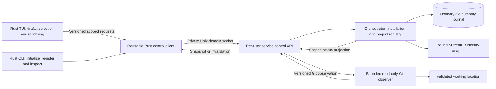
```mermaid
flowchart LR
    TUI["Rust TUI: drafts, selection and rendering"] -->|Versioned scoped requests| Client["Reusable Rust control client"]
    CLI["Rust CLI: initialize, register and inspect"] --> Client
    Client -->|Private Unix-domain socket| API["Per-user service control API"]
    API --> Registry["Orchestrator: installation and project registry"]
    Registry --> Journal[("Ordinary-file authority journal")]
    Registry --> Binding["Bound SurrealDB identity adapter"]
    API --> Observer["Bounded read-only Git observer"]
    Observer --> Workspace["Validated working location"]
    Registry -->|Scoped status projection| API
    Observer -->|Versioned Git observation| API
    API -.->|Snapshot or invalidation| Client
```

The orchestrator owns installation and project identity, durable registration
and status projection. The service's observer owns Git collection. The TUI
owns only its current draft count, visible selection, local draft retention and
spinner drawing from delivered state. No new client-side registry, Git parser,
authorization evaluator or model-usage estimator is permitted. A project parent
remains a discovery container, not a project or working location.

## User-visible trial

1. `asura` attaches to or starts the one user service. Startup may create the
   validated `.asura/run/` runtime area. It shows verified ready, uninitialized,
   unavailable or repair state. The service automatically initializes only verified
   fresh state through the canonical writer. Runtime directory creation alone is
   not proof of installation readiness.
2. After initialization, a launch directory with one current authorized
   registration becomes the visible project. Overlap or no match opens an
   explicit choice. The user may register the existing directory, mark a
   discovery-only project parent, choose a known project or continue without a
   selected project. Each action has its own authorization and validation.
3. Project navigation restores each client's last valid logical working
   location and directory. It does not change process cwd or retarget a draft.
4. The bar shows real project/path and Git observations. Unknown, non-repository,
   detached, merge, rebase and clean states remain distinct. A nonempty draft
   adds the local character count. No synthetic running spinner appears.
5. A status change, invalidation or reconnect refreshes the matching scope.
   Stale and unauthorized fields disappear or become explicitly unavailable.
   Typing and navigation remain responsive while observations are slow.

Exact first-use controls, unavailable wording, status freshness, response
deadlines and project-parent discovery limits remain D3/D6/D7 decisions. The
client may reuse the prototype's geometry and editor adapter only after the
production ownership and dependency review confirms that reuse is safe.

### Status and submission boundary

Proposed D3-D6 sequence. A view generation prevents a late result from project A
overwriting project B. Enter cannot create a task while the execution capability
is absent. Durable registration acknowledgements follow the journal contract.

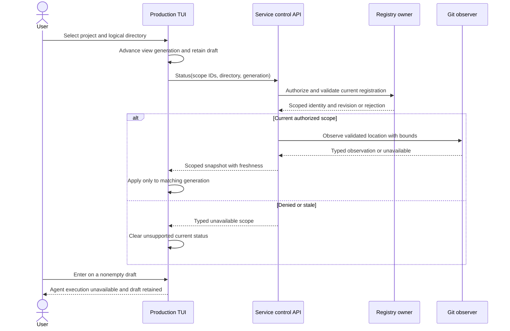
```mermaid
sequenceDiagram
    actor User
    participant TUI as Production TUI
    participant API as Service control API
    participant Registry as Registry owner
    participant Git as Git observer
    User->>TUI: Select project and logical directory
    TUI->>TUI: Advance view generation and retain draft
    TUI->>API: Status(scope IDs, directory, generation)
    API->>Registry: Authorize and validate current registration
    Registry-->>API: Scoped identity and revision or rejection
    alt Current authorized scope
        API->>Git: Observe validated location with bounds
        Git-->>API: Typed observation or unavailable
        API-->>TUI: Scoped snapshot with freshness
        TUI->>TUI: Apply only to matching generation
    else Denied or stale
        API-->>TUI: Typed unavailable scope
        TUI->>TUI: Clear unsupported current status
    end
    User->>TUI: Enter on a nonempty draft
    TUI-->>User: Agent execution unavailable and draft retained
```

## Failure, security and recovery

The [D1 threat model](threat-model.md), [service boundary](system-architecture.md),
[authority recovery design](persistence-recovery.md) and [binding contract](context-storage-candidates.md)
must become ready for the operations used by this slice. The first trial writes
real installation and registration records, so an uncertain write, corrupt
journal, competing service owner, unsafe home, stale path or graph identity
conflict must fail closed with repair information. It cannot replace the graph
or registration to make the UI look ready. Both configured graph modes must be
represented accurately; an unqualified mode is unavailable, never a fallback.

The service authenticates the selected same-UID principal and rechecks scope on
each request and before disclosing a collected observation. Reconnect retires
the old attachment; an old response cannot become current merely because the
project selection is unchanged. The [status publication contract](production-bootstrap-status.md#publication-and-attachment-validity)
owns these rules and their remaining D3 mechanism decisions.

A launch path or project-parent marker is not a grant. Git reads are read-only
and confined to the validated location. They have byte, time and concurrency
limits. The service treats their results as untrusted metadata. A slow observer must not block
local editing or unrelated service control. Status events carry scope identity,
revision and freshness; reconnect obtains a fresh authorized snapshot before
showing current values. Sensitive paths and content are not written to ordinary
telemetry. D1-D3/D7 must fix the concrete mechanisms and limits before code.

## Validation and readiness

| Case | Unit | Integration | End-to-end and environment |
| --- | --- | --- | --- |
| ES1: startup and ownership | Launch-mode and typed-state rules | Competing real processes, endpoint loss, journal replay | CLI/TUI attach, explicit init and recovery on supported macOS |
| ES2: registration and directory choice | Identity, overlap and no-auto-action decisions | Real aliases, replacement and authority changes | Register, choose overlap and reject stale path in Ghostty and Terminal.app |
| ES3: project-parent discovery | No implicit project/task, bounded candidate rules | Real large tree, escapes, symlinks and changes | Mark parent, inspect child and register it separately |
| ES4: live Git and bar | Typed clean/dirty/detached/merge/rebase/unknown states | Actual Git fixtures, observer failure and delayed updates | Inspect real bar while editing and switching projects in both terminals |
| ES5: unsupported agent | Preserve exact draft and absence of task admission | Service receives no task command | Enter explains unavailability and draft survives navigation/reconnect |
| ES6: stale scope and recovery | Generation/freshness and invalidation rules | Delayed A event after B selection, disconnect and restart | No cross-project status leak or false current value in either terminal |

These cases supplement PBS1-PBS15 and W6-A through W6-D; they do not replace
the deeper fault matrix. D7 must assign exact test IDs, commands, durations,
fixtures and supported host versions. Mock and PTY evidence cannot establish
real service, filesystem, graph-binding or native-terminal behavior. Visual
previews must be inspected, with Ghostty and Terminal.app results recorded
separately. No release or full I0-I4 completion claim follows this trial.

### Proposed delivery packets

The [stages 3–5 packet](../plans/production-status-implementation.md) divides
installation, graph binding, registration, Git collection and TUI presentation
into reviewable deliveries. It consumes the separate foundation stages 1–2.
Each substage needs its own ready contracts, owner review and explicit
implementation authorization. A runnable diagnostic stage does not complete
the production status trial.

### Open readiness items

- D1: qualify home, runtime directory, filesystem identity and read-only Git
  confinement on supported macOS.
- D2: fix production Rust package ownership, selected Unix-socket service
  attachment, owner-lock behavior and the control-channel contract, including
  versioning and bounds.
- D3: fix authority-journal encoding and recovery, graph binding, registration,
  project-parent marker, view restoration and status snapshot/event schemas.
  The [publication contract](production-bootstrap-status.md#publication-and-attachment-validity)
  also requires disclosure ordering, attachment identity and observation ordering;
  PBS12-PBS14 qualify races that a view generation alone cannot reject.
- D4: name and qualify the Git observation owner. Model-context accounting is
  outside this slice and remains unavailable.
- D6: finish first-use choices, status wording, editor behavior and accessibility.
- D7: define executable ES1-ES6 evidence and the local test environment.
- D8: review only the contracts exercised by this slice, record later gates, and
  obtain owner review of the ready design and implementation packet.

## First conversation client integration

The [conversation admission contract](conversation-admission.md) governs setup and
execution. `/init`, `/project add PATH`, `/project list`, and `/project select ID`
provide explicit setup and selection. CLI `init` and `project add PATH` use the
same client methods. Selection stays local; it grants no service authority.

The TUI owns one conversation observation worker and one pending conversation
request. The [IQ1 queue contract](conversation-admission.md#durable-input-queue-iq1)
adds a separate one-slot worker for queue commands and projections. The service
alone orders, persists, dispatches and recovers accepted inputs. Enter during
active work queues the draft directly. The [composer interaction contract](composer-interactions.md)
defines interactive queue promotion, selectors, history and dynamic hints. Ctrl+S requests cancel-and-replace
steering; Ctrl+T queues a follow-up. `/queue [ID | resume ID | drop ID]` inspects
or explicitly recovers retained service inputs. The padded tray shows observed
states; a pending request is not counted as accepted. `/retry` prioritizes a
retained unconfirmed queue request and reuses its original identity.

The conversation worker retains the
original request ID and draft until durable acceptance. A worker performs bounded
attach/request calls outside the terminal loop. Worker notifications wake
completion handling through the event dispatcher. A mutex mailbox coalesces snapshots into one value, at most 60 KiB. The
worker has a 65-second observation budget, two-second attach/request bounds,
three-second mutation bounds, and six-second initialization bound. It never
joins an unfinished worker on the terminal loop. Cancellation uses a separate
atomic control flag; it requests durable intent through the same client after
any in-flight bounded exchange. Terminal exit disconnects; it does not silently
cancel a turn on an independently owned service.
The terminal loop polls completions before dispatch. It retains its one queued
request until the previous worker has exited, even when a final result arrived
before thread cleanup. Worker retirement must not turn that queued request into
a busy rejection or lose a once-only project-discovery request.

Rendering and input handlers perform no service attachment, socket request,
database operation or response wait. The dispatcher delivers bounded requests to
workers and consumes their result events. Conversation and status each use a
one-element coalescing result mailbox. The UI uses `try_lock` to read these
mailboxes; contention defers consumption until the next cycle without waiting
or discarding the result. Unit tests must hold a producer's mailbox lock and
prove the consumer returns before release. The stalled-backend PTY journey
verifies editing and exit during blocked socket work.

`/cancel` requests cancellation of the active operation. `/observe ID` retrieves
an existing operation after a disconnect. Request errors retain the original
request object. `/retry` explicitly repeats that object with the same request ID;
it never allocates an automatic replacement ID.
Both commands accept no arguments. Invalid syntax preserves the draft and shows
usage. Cancellation is available only while submitting or observing a conversation;
idle state, discovery and setup requests preserve the draft and report that no
conversation can be cancelled. Track this capability from request dispatch until
its final update. A cancellation request is not proof of a durable cancellation.
Unit checks cover idle, setup, submitting, observing and completed states plus
invalid retry syntax with a retained request. The mandatory terminal journey
checks idle cancellation and invalid retry feedback without clearing input.
The TUI shows provisional snapshots as replacement text and labels incomplete
terminal outcomes. Only accepted prompts enter display history. Display keeps
at most eight turns; this client bound does not delete durable service history.

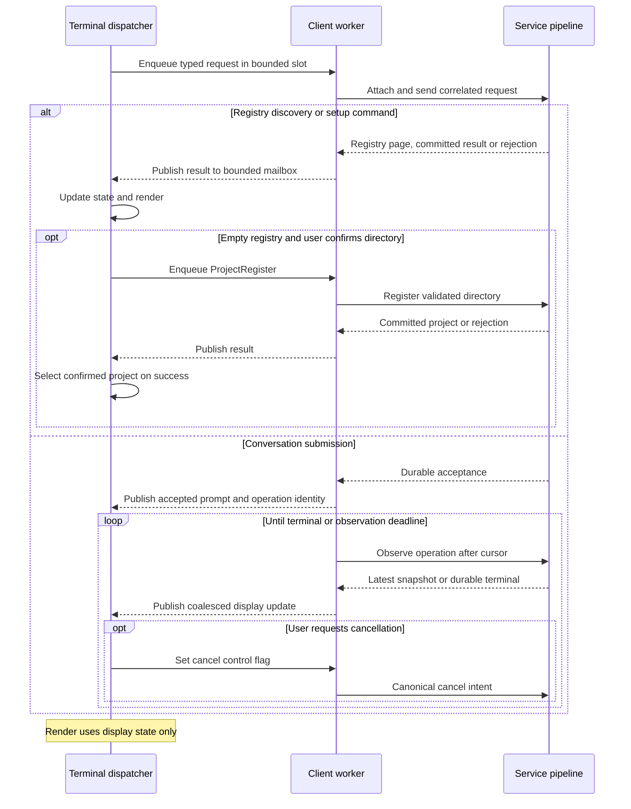
```mermaid
sequenceDiagram
    participant UI as Terminal dispatcher
    participant W as Client worker
    participant S as Service pipeline
    UI->>W: Enqueue typed request in bounded slot
    W->>S: Attach and send correlated request
    alt Registry discovery or setup command
        S-->>W: Registry page, committed result or rejection
        W-->>UI: Publish result to bounded mailbox
        UI->>UI: Update state and render
        opt Empty registry and user confirms directory
            UI->>W: Enqueue ProjectRegister
            W->>S: Register validated directory
            S-->>W: Committed project or rejection
            W-->>UI: Publish result
            UI->>UI: Select confirmed project on success
        end
    else Conversation submission
        S-->>W: Durable acceptance
        W-->>UI: Publish accepted prompt and operation identity
        loop Until terminal or observation deadline
            W->>S: Observe operation after cursor
            S-->>W: Latest snapshot or durable terminal
            W-->>UI: Publish coalesced display update
            opt User requests cancellation
                UI->>W: Set cancel control flag
                W->>S: Canonical cancel intent
            end
        end
    end
    Note over UI: Render uses display state only
```

Validation covers command parsing, absent selection, malformed identities,
retained drafts, bounded coalescing, terminal labels and unchanged config styling.
Scratch process journeys must prove setup, streamed response, cancellation,
reconnect and cleanup before claiming runtime readiness. Scripted provider
journeys do not prove native inference.

### First-project prompt

When the service first reports GraphReady, the TUI asynchronously queries the
canonical project registry on initial readiness and each new service epoch. Read
all pages through the existing client, at most eight pages and 64 entries. Reject
invalid IDs, repeated cursors and incomplete pagination without publishing a
partial registry. Network calls and launch-directory lookup stay in the worker.
Retain the registry as display state. Show project directory names in the header,
mark the selected name, and mark stale entries. An unknown registry is not empty.
Prefer the deepest current project containing the launch directory. If none
matches, select the sole current project; otherwise leave selection unset and
display the known projects. A refresh preserves a still-current explicit selection.
Successful registration refreshes the registry in the same worker job before
publishing completion. It selects the registered project. A refresh failure
reports that registration succeeded but listing failed; it does not retry the
mutation or hold a new background job over the next command. A changed selection clears
the conversation identity and generation; it grants no service authority.
If the registry contains no
projects, ask “Use this directory as a project?” and show the client's absolute
launch directory. Present Yes and No; Enter confirms the selected choice and
Escape declines. Default focus is Yes. The dialog waits behind an existing
overlay and preserves any draft typed during discovery. A nonempty registry must
not show this prompt. Discovery failure reports the error; it never implies an
empty registry or grants permission to register anything.

On Yes, submit the existing ProjectRegister operation through the bounded client
worker. The service validates the directory and owns the durable registration.
Select the returned project only after success and preserve the existing draft.
On No, preserve both directory and registry and do not prompt again in that client
session. Registration failure preserves the draft and shows the failure; no
automatic retry is allowed. Do not create a Git repository or write project files.
The prompt authorizes Asura registration of the existing directory only.

The existing client-worker-service sequence above governs these calls. Unit checks
cover offer/accept/decline, delayed discovery, existing projects, and retained
drafts. Mandatory PTY checks cover Yes with selection and persistent registration,
No with an empty registry, and no prompt when projects already exist.
Also test existing-project display and selection after restart, multiple projects,
stale entries, pagination failures and new-epoch refresh with draft preservation.

Selected discovery flow. Arrows describe worker results and local presentation.

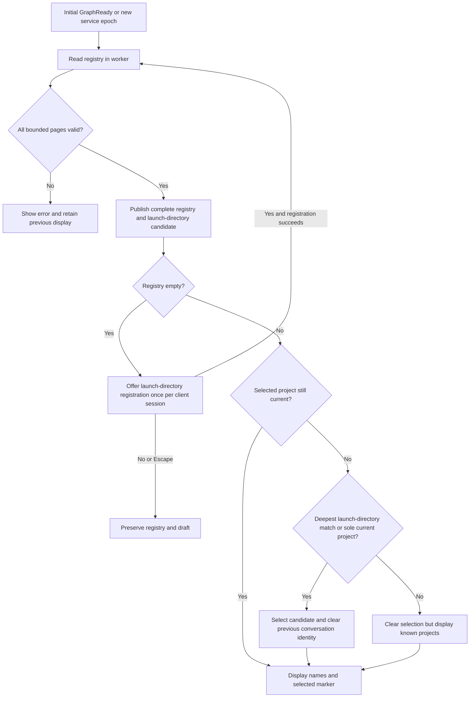
```mermaid
flowchart TD
    Ready["Initial GraphReady or new service epoch"] --> Queue["Read registry in worker"]
    Queue --> Pages{"All bounded pages valid?"}
    Pages -->|No| Error["Show error and retain previous display"]
    Pages -->|Yes| Registry["Publish complete registry and launch-directory candidate"]
    Registry --> Empty{"Registry empty?"}
    Empty -->|Yes| Offer["Offer launch-directory registration once per client session"]
    Empty -->|No| Keep{"Selected project still current?"}
    Keep -->|Yes| Show["Display names and selected marker"]
    Keep -->|No| Candidate{"Deepest launch-directory match or sole current project?"}
    Candidate -->|Yes| Select["Select candidate and clear previous conversation identity"]
    Candidate -->|No| Unset["Clear selection but display known projects"]
    Select --> Show
    Unset --> Show
    Offer -->|Yes and registration succeeds| Queue
    Offer -->|No or Escape| Unchanged["Preserve registry and draft"]
```

### Mandatory command regression execution

The existing CLI `lifecycle` Cargo test must run both the default `tui_pty.py`
journey and its `--setup` journey. Cargo passes the current lifecycle executable
to Python; copied `asura-fixture` executables retain the existing private runtime
resolver. These tests require Python 3, macOS PTYs and local socket access.
Missing prerequisites or either failed journey fail the Cargo test; no silent
skip or model availability requirement applies to these command checks.

The Rust harness owns and reaps each Python child. Each journey has its existing
52-second work budget and a fresh eight-second deadline on cleanup entry. An
expired work budget must not prevent cleanup of an independently started backend;
the default journey injects this condition before its final cleanup. The harness allows
75 seconds, then requests termination and allows ten seconds for cleanup before
killing and reaping the child. Forced termination fails with cleanup unconfirmed.
Python handles termination through its fixture cleanup path. Fixture-owned
services and terminals must settle before a journey succeeds.
During independent CLI checks, the PTY fixture continues draining terminal output,
as a real terminal emulator does. Those checks must not accidentally become
terminal-backpressure fault injection. Error reporting after terminal restoration
uses fallible writes; an unavailable stderr must not cause a second panic or
replace the intended failure exit code.

The setup journey must cover: automatic first-use readiness without `/init`; a
fresh-ID `/init` readiness check in the same session and after backend restart;
project add, repeat add, list and select; an invalid project path; and persistence
of installation and project identities. Installation process tests must cover
pending, damaged and missing associated state without replacement or overwrite. Assert service state and visible terminal
results through the real protocol. Do not inject formatted success as the sole
proof of a client/server mapping. Result checks must not send extra keys or resize
events to make asynchronous output appear. Explicit resize scenarios remain valid.

The existing requirement-to-evidence diagram in
[engineering standards](../engineering.md#requirement-to-evidence-traceability)
governs these complementary unit, integration and end-to-end checks. Native
inference remains a separate explicit journey; this gate requires no model calls.

After initialization verifies the embedded graph, the canonical authority
owner publishes installation `GraphReady` (value 6) and reason `GraphVerified`
(value 16). Inspection includes installation ID, authority revision, owner and
binding generations, and journal format 1. These observations describe verified
state; the client does not infer readiness from an initialization request.

### Compact Git totals, 2026-09-27

The composer Git group renders `branch_name files_changed +added-deleted`.
Do not show a `git` prefix or clean/dirty/unborn/conflict words in this group.
A detached repository uses `detached` in place of its branch. Unknown values use
`?`; a verified nonrepository omits the whole group. Files changed includes
tracked changes and individual untracked files. Line totals describe tracked text
changes against HEAD, including staged changes once; untracked and binary files
add no invented line counts. The platform collector owns those calculations.

Control ContextObservation adds optional unsigned fields 12 files_changed,
13 added and 14 deleted. Pending, unknown and nonrepository observations carry
no counts. Repository observations carry files_changed and either both line
totals or neither. A failed line collection preserves the known branch/file count.
The service maps typed evidence and the TUI consumes it on the existing event
pipeline; no work moves into rendering and protocol numbering remains 0.1.

The renderer uses structured spans: branch and file count use the existing muted
colour, addition uses experiment RGB(134,239,172), deletion RGB(252,165,165).
There is one space before the addition and no space between addition/deletion.
Existing narrow-layout policy may omit the entire Git group. Never recolour a
path or branch because its text resembles a count.

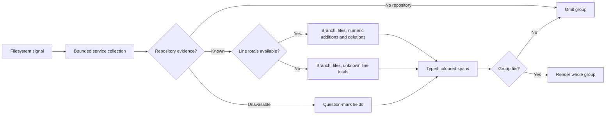
```mermaid
flowchart LR
  Signal[Filesystem signal] --> Collector[Bounded service collection]
  Collector --> Known{Repository evidence?}
  Known -->|No repository| Omit[Omit group]
  Known -->|Unavailable| Unknown[Question-mark fields]
  Known -->|Known| Counts{Line totals available?}
  Counts -->|Yes| Values[Branch, files, numeric additions and deletions]
  Counts -->|No| Partial[Branch, files, unknown line totals]
  Values --> Spans[Typed coloured spans]
  Partial --> Spans
  Unknown --> Spans
  Spans --> Width{Group fits?}
  Width -->|Yes| Show[Render whole group]
  Width -->|No| Omit
```

Validate wire presence rules, parser/real-repository count semantics, exact TUI
text and colour cells, and a terminal edit that updates totals without input.
Existing cancellation, bounds, scope and child-cleanup requirements still apply.

### Status path display, 2026-09-28

The status bar displays at most the last four nonempty directory components.
Use a leading `…/` when earlier components are omitted. Paths with four or fewer
components retain their existing representation. Apply the existing grapheme-safe
width limit afterward. This is presentation only: commands and observation scope
retain the complete path. The context-path rendering regression covers this rule.

### Command help table

The local help overlay presents commands and editor keys in two columns:
`Command / key` and `Action`. Wrap each cell within its column at narrow widths.
Use the existing padded, bottom-aligned secondary panel. Retain all supported
commands and keys. Arrow keys scroll only when the table exceeds the available
height; Escape or F1 closes help. Opening help resets its scroll position.
This is local presentation with bounded static rows and no service requests.
The existing command flow governs opening and closing the overlay. Renderer tests
check column headings, narrow wrapping, overflow scrolling and return to editing.
The terminal help journey remains the end-to-end command-opening check.
The CLI suite passed 94 unit tests and the isolated terminal lifecycle journeys
on 2026-09-28. These checks cover rendering and interaction, not visual inspection
in every terminal emulator.

### Native terminal failure evidence

The native conversation fixture must fail as soon as the TUI reports a failed
terminal outcome. It must not spend the remaining success deadline waiting for
that failed turn to complete. Before removing its scratch home, it may report
only allowlisted model diagnostic lines from the final 8 KiB of its service log.
This adds failure evidence; it does not authorize retrying native inference or
printing prompts, generated text or arbitrary provider error descriptions.
