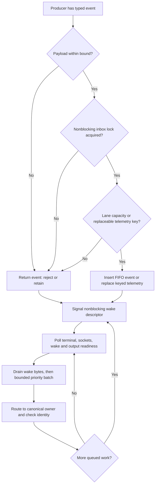
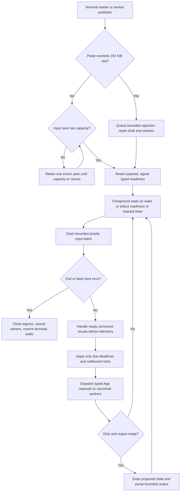
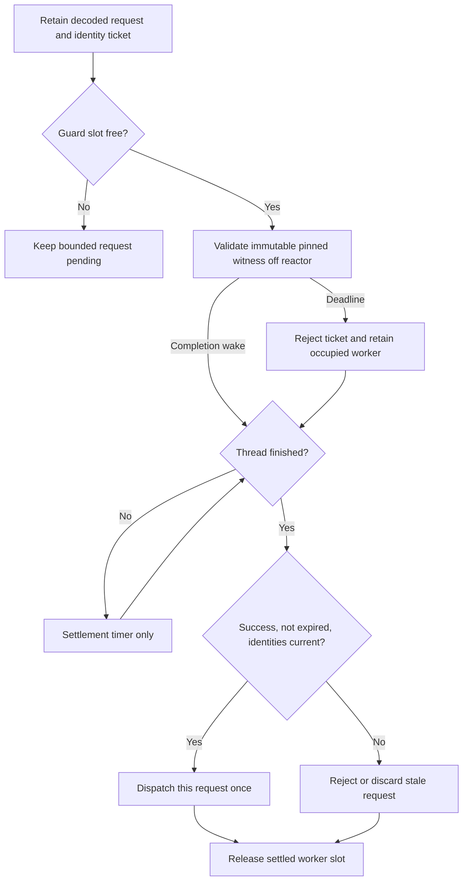
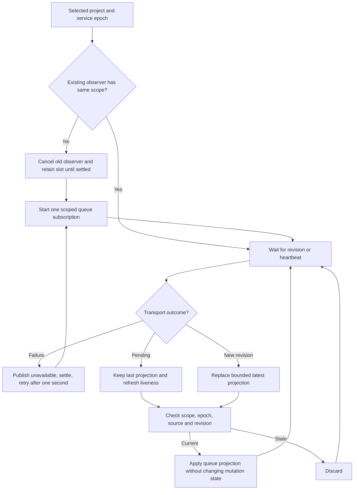
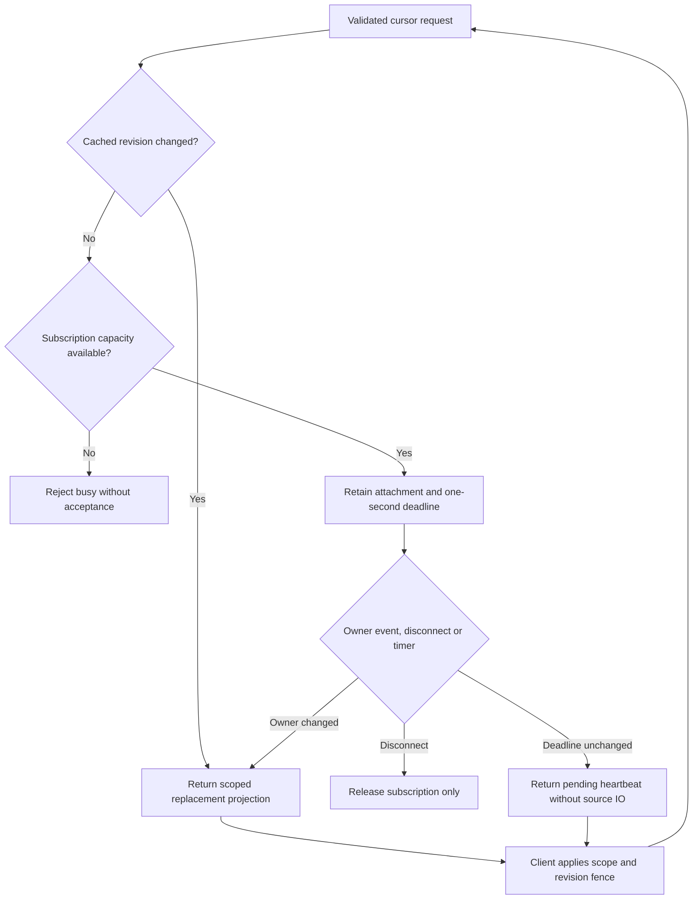
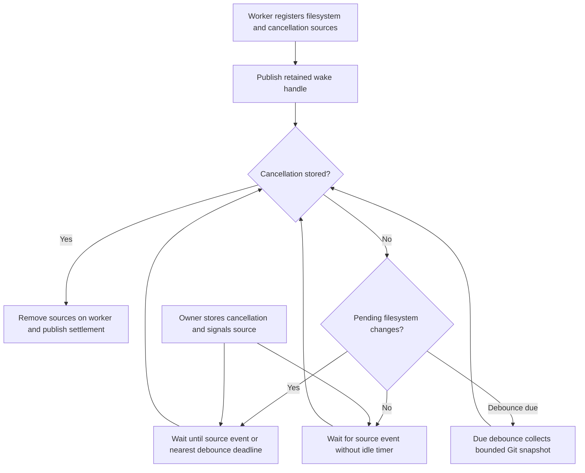

# Event routing and readiness

Status: implemented for the local service and TUI. Validation evidence and
remaining scope limits are recorded below.
The wire protocol stays 0.1. The journal stays at format 1.

## Owners and delivery

The platform owns descriptor wakeups and bounded local inboxes. Each service or
client component retains its existing state and authorization responsibilities.
The TUI translates input to commands. Its dispatcher routes commands to workers.
The renderer only reads projected state. The service owns durable admission,
execution, publication and recovery. An inbox acknowledgement is never a durable
acceptance acknowledgement.

E1 uses the existing platform readiness poll. It adds no runtime dependency.
A private nonblocking socket pair wakes a receiver. Both descriptors have
close-on-exec set. A cloned sender retains the pair, so notification cannot write
to a closed peer. Notification bytes carry no authority or payload. A full socket
already represents readiness. The receiver drains at most 16 KiB per call.

An inbox contains three FIFO lanes and eight keyed latest-value telemetry slots.
The critical lane has eight entries; interaction has 128; completion has 32.
Each lane permits at most 64 KiB of caller-declared payload bytes. One event permits
at most 32 KiB. Telemetry permits eight entries and 64 KiB in total. Its keys are
integers 0 through 7. Producers must include retained dynamic payload bytes in
this accounting. Component contracts must bound producer-retained payloads too.

The critical lane is reserved for shutdown, cancellation and fatal owner events.
Interaction contains decoded user input and admitted control requests. Completion
contains command results and worker settlement. Telemetry contains replaceable
status projections; replacement preserves the key's original scheduling position.
Scope and generation checks remain with each receiving owner.

All queue access uses a nonblocking lock attempt. A producer receives its original
event on contention, capacity exhaustion, oversize input or receiver closure.
It must retain a required result within its admitted operation slot, or reject
new input before acceptance. Required results must never be silently discarded.
Telemetry may be superseded by a later projection. Failed publication signals the
wake descriptor so the consumer can release capacity. Callers must arrange a
capacity event or a retained source readiness token before retrying; a timed
retry loop is not the delivery contract.

The consumer drains at most 64 events. Each scheduling round takes eight critical,
eight interaction, four completion and one telemetry event. The scheduling cursor persists across short drains. Thus normal traffic
cannot starve command outcomes or telemetry. Handlers additionally yield after
2 ms. Output readiness and the next dispatch turn preserve remaining work.
The receiver clears wake bytes before inspecting queues, then rearms if entries
remain or its lock attempt fails. Publication inserts the event before signalling.
These orders prevent a lost wakeup during concurrent publication.

## Integration sequence

E2 converts TUI worker publications and terminal input into typed routed events.
Its output dispatcher receives explicit commands. Quit and cancel precede status.
The poll timeout is the nearest explicit deadline, not a periodic status scan.

E3 registers service completion wakeups, lifetime EOF and model transport
readiness alongside control sockets. Each owner exposes its next deadline.
Timer expiry produces an event for that owner. Request routing is bounded per
client. Filesystem ownership checks move behind a bounded isolation boundary;
a request cannot cause effects until its required identity validation settles.
The platform rounds a positive remaining deadline up to the next millisecond
for OS `poll`. An expired deadline remains zero. This prevents short settlement
deadlines from becoming repeated zero-time waits before their actual expiry.

E4 replaces repeated status, queue and conversation queries with bounded retained
cursor subscriptions. Heartbeats establish liveness and do not initiate scans.
Disconnect releases subscriptions; durable queue work retains service ownership.

A worker result and worker settlement are different events. The owner retains its
slot until actual settlement. A bounded isolated reaper may join worker handles
and publish settlement; the reactor must never join an unfinished thread.
Operation timeout reports its real effect status and does not release that slot.
Shutdown closes ingress, cancels work, restores the terminal, and retains service
ownership through its existing recovery and drain contract.

## Validation

E1 unit tests cover lane bounds, payload bounds, FIFO, keyed replacement, priority,
fairness, receiver closure, lock contention and rearming after a partial drain.
Real descriptor tests publish from another thread, wake platform poll, and race
publication with draining. No test uses the user's service directory.
E2/E3 integration tests must cover completion and cancellation while telemetry is
saturated, worker settlement races, signal/lifetime EOF, and idle input delivery.
PTY tests must show input and exit responsiveness under stalled output and workers.
Service tests must show no status scans while idle and ordered subscription delivery.
These integration requirements are not satisfied by E1 primitive tests.

## TUI integration

E2 has one foreground dispatcher and one retained terminal reader. The reader
uses Crossterm's parser outside the dispatcher, including incomplete escape
sequences. It checks cancellation at most every 100 ms between parser calls.
The platform inbox carries decoded input: Ctrl-C and Ctrl-D use the critical
lane, other keys/paste use interaction, resize uses one latest telemetry key.
Decoded pastes use one separately accounted reserved slot of at most 192 KiB
raw text, matching capture limits; the inbox carries only its small readiness
token. The reader waits for consumption before reading another event. The editor
retains its 64 KiB normalized draft limit. Oversized paste produces a bounded
rejection token; the App preserves its draft, marks active capture invalid, and
keeps the TUI running. Other overlays retain their existing ignore-paste behavior.
Full input lanes apply backpressure without dropping input or ending the TUI. A reader
error is retained in one reserved slot and wakes the dispatcher. Input admission
contention or capacity exhaustion retains one decoded event and waits for the dispatcher's capacity
notification before retry; cancellation wakes this wait.

Worker results remain in their existing bounded operation slots. A typed source
bit identifies configuration, conversation, queue, context or status readiness.
Producers insert the result before setting the bit and waking the platform
inbox descriptor. The dispatcher retains at most 32 drained input events and yields between
handlers after 2 ms. It handles this bounded input batch first, then
command results, then replaceable context/status. Mailbox contention rearms the
source bit. Thus a notification cannot consume the only copy of an outcome.
Status/context keep their generation and scope fences. Outbound App commands
are dispatched after input/result handling, outside drawing.

A worker-exit guard publishes a separate settlement hint, including on panic.
This is not proof that the JoinHandle has finished. A finished handle still
owns its slot until the owner consumes and joins it. A thread-state check must
never clear the only settlement hint while that slot is retained. A 10 ms settlement timer
rechecks only hinted owners until their handle is finished; occupied slots are
retained throughout. Configuration and queue deadlines remain explicit timers.
Context retry and five-second observation expiry expose their next deadline.
Queue projections use the retained E4 subscription below; there is no periodic
queue-list timer.

The foreground waits on the inbox wake descriptor and stdout writable readiness
when a frame is pending. The wait deadline is the earliest owner deadline,
settlement timer or frame deadline. Signal hooks also write to a private
nonblocking socket pair registered in the foreground readiness set. Clock
continuity is checked on events and owner deadlines; it does not create an idle
poll. The fixed 16 ms global mailbox scan is removed.
A frame retains the existing 100 ms write deadline. Shutdown first stops input
admission and requests cancellation, restores the terminal, then performs bounded
reader/worker settlement. An unresponsive reader is retained until process exit;
no replacement reader or ownership reuse is allowed.

E2 unit tests cover source coalescing, notification ordering, retained settlement
hints and input classification/size bounds. Existing worker tests continue to
prove that result publication does not free an unsettled slot. PTY regression
covers idle input, incomplete escape input, cancellation, resize and output stall.

## Service readiness integration

Each isolated service worker publishes a completion signal after storing its
result. Registration after completion must also signal the reactor. The receiver
retains the worker handle until settlement. A one-millisecond settlement timer
runs only after a completion signal and before `JoinHandle::is_finished` succeeds.
It does not inspect unrelated workers or launch work. Operation deadlines remain
absolute. Their expiry cannot extend a worker's execution or release its slot.
Installation source validation occurs on its inspection worker before publishing
its snapshot. Later mutations retain their own admission identity checks.

Storage replies notify after enqueueing the reply and reducing admitted work.
The owner reads a ticket only on a completion wake or its absolute deadline.
Context producers notify after replacing their typed snapshot. Pending context
subscriptions wake on observation publication or their one-second liveness timer.
Transport and lifetime descriptors join the existing poll set. Polling OS
readiness is permitted; periodic state scans are removed as integration proceeds.
A service shutdown uses its existing drain deadlines and explicit unsettled-worker
timers. Guard filesystem validation uses the per-request fence below;
removing those checks without that fence is forbidden.

## Service guard validation

The platform exposes an immutable owner validation snapshot: the retained runtime
chain, shared lock descriptor and recorded endpoint identity. Creating it performs
no filesystem call. Its validation uses the same complete directory, ACL, lock
and endpoint checks as OwnerGuard. Sharing the descriptor intentionally retains
the owner lock until the validation worker settles; it does not acquire new authority.

One service guard worker admits one request ticket at a time. The dispatcher
retains at most one decoded request per admitted client and preserves the client
slot generation, request identity and service lifecycle generation with its ticket.
A request cannot dispatch effects until its own successful validation settles and
all these identities still match. Results cannot authorize another request or
be cached as blanket runtime validity. Startup also validates before admission.

Validation and cleanup have two-second deadlines and completion wake signals.
Timeout rejects admission and retains the worker slot. A later success is marked
expired and cannot authorize effects. Poll joins only an already finished worker;
notification-before-thread-exit uses the existing one-millisecond settlement timer.
A blocked syscall cannot be forcibly cancelled; cancellation is checked before
and after validation. No replacement worker starts until settlement.

Endpoint removal transfers the full guard into the same isolated worker and
returns it after settlement, including failures. A failed thread spawn returns
the guard to its caller. Cleanup validates and unlinks through the existing
platform method. A timeout does not claim the unlink did not happen: its effect
remains unconfirmed until settlement. Shutdown retains the guard and all snapshots
until every owned worker settles, preserving lock-last release. Client disconnect
invalidates a pending request ticket without releasing its active worker early.

Validation tests cover invalid runtime/endpoint identity, lock retention across
snapshot ownership, timeout then late success, exactly-once deadline, actual
settlement, cleanup guard return and completion wake registration. Reactor tests
must prove stale client/lifecycle tickets cannot dispatch and stalled validation
does not block input cancellation, other completion handling or shutdown initiation.

### Model readiness edge cases

A model owner with retained undecoded input bytes schedules an immediate bounded
next turn even if its OS socket is empty. A partial frame with no retained bytes
waits for descriptor readiness. After preparation cancellation, its elapsed model
deadline no longer schedules work; only completion/settlement wakes apply until
its worker returns. Failed cleanup-thread creation retains the child and schedules
an explicit 100 ms retry. Tests cover more than eight coalesced frames, cancelled
stalled preparation, and cleanup retry deadlines without idle polling.

## E4 client subscriptions

The existing startup/status worker retains its service connection and status
revision. `ObserveService` waits for a status revision or a one-second heartbeat.
The startup lease and single start attempt keep their existing ownership rules.
Transport failure clears the connection/cursor and retries after an explicit
one-second backoff; cancellation wakes that backoff. Healthy subscriptions have
no extra client sleep. The configured model selector is a display fallback until
a native model reports its actual variant. A selector or service epoch change
clears the previous actual variant and context metrics. Heartbeat snapshots refresh the five-second liveness bound.

Conversation observation retains its operation/cursor and uses the service's
one-second wait. The 50 ms client sleep is removed. Cancellation checks run between
bounded requests; an in-flight observation can delay a cancellation request by
at most its two-second transport deadline. Conversation generation and terminal
result handling remain unchanged.

Queue mutations and explicit `/queue` queries retain their existing operation
worker. A separate single retained queue observer subscribes to selected project
and service epoch, so an idle longpoll cannot block a mutation. It has one latest
mailbox, one connection, a monotonic source generation, one-second heartbeat,
two-second transport deadline and one-second reconnect backoff. A scope change
cancels its worker; no replacement starts before actual worker settlement.
Pending replies preserve the last projection in the producer mailbox. The App
fences project, epoch, source generation and revision before replacing queue
entries. A new scope clears the previous projection. Subscription results do not
clear drafts, mutation receipts or explicit command state. The automatic 500 ms
queue-list request and its timer are removed. A five-second heartbeat expiry
clears the stale queue projection without changing durable service state.

E4 adapter tests cover pending snapshot coalescing, old source/scope rejection,
expiry, actual settlement before scope replacement and preservation of explicit
command/draft state. Root integration tests cover status/queue/conversation wakes,
heartbeat retention, reconnect and cancellation under longpoll.

## Cursor subscriptions

`ObserveService` (envelope tag 41) accepts an optional service-local revision.
`ServiceObservation` (42) returns revision, pending, the cached inspection status,
and optional configured model selector. Each attachment retains at most one
request. The service permits 32 retained requests. A changed revision returns
immediately. An unchanged revision waits at most one second and returns a
liveness heartbeat with the current cached status. Epoch changes invalidate cursors.

The service reads the model selector with canonical `conversation_snapshot` on
one isolated worker at startup and after configuration mutations. The read has a
two-second deadline. Timeout makes the selector unavailable and retains its worker.
A heartbeat never rereads configuration. A pending refresh coalesces into one
subsequent read after the current worker settles. External file edits take effect
on the next explicit configuration interaction or service restart.

`ConversationQueueList.after_revision` (field 3) requests a retained queue
subscription. `ConversationQueueReply.revision` (4) identifies the journal view;
`pending` (5) distinguishes heartbeat from replacement projection. A heartbeat
has no entries and cannot clear the client's retained queue projection. Full-text
inspection cannot also subscribe. The service retains at most 32 observation
requests across queue and conversation streams. Disconnect removes retained
requests. Mutations keep their independent acknowledgement path.

`ConversationObserve.wait_ms` already exists. The client selects 1000 ms. The
service returns a changed cursor or terminal immediately; otherwise it retains
the request until change or heartbeat deadline. No sleeping query loop remains.
The service observes journal revision changes in memory. It only reads queue
prompt excerpts when an actual replacement projection is required. A busy writer
retains the subscription until its slot is available or the heartbeat deadline.

Tests must cover unchanged heartbeat without source reads, change-driven delivery,
revision fencing, separate mutation responsiveness, disconnection release and
bounded retained requests. Native conversation and PTY queue journeys must run
with these subscriptions before this packet is complete.

### Embedded memory idle wait

The embedded memory owner blocks only its isolated command thread on the existing
bounded channel. Ordinary idle operation has no timer. Shutdown first sets its
closing flag, then attempts a nonblocking shutdown sentinel in that channel.
An empty channel wakes immediately; a full channel already contains work and the
worker observes closing before another operation. The queue keeps its eight-item
bound. Commands already queued receive cancellation when shutdown drains them.
Dropping the handle uses the same wake path. Actual database/runtime settlement
retains its existing deadline and SDK-task checks; those are shutdown activity,
not an idle scan. Tests exercise wake from idle close/drop and a full channel.

### Git watcher cancellation wake

Each retained Git observer installs one custom Core Foundation run-loop source
beside its filesystem stream. A shared retained signal handle may only signal
that source and wake the run loop; it cannot run callbacks, collect Git, or remove
the stream. Cancellation stores the stop flag before signalling. Signalling a
source before the worker enters its wait remains pending, preventing a lost wake.
The worker publishes its handle before checking the stop flag, covering shutdown
before watcher creation. Stream/source registration and removal stay on the worker.

With no filesystem changes the worker waits for a source event, with no periodic
cancel checks. With dirty data it waits until the earlier of last-change+250 ms
and first-change+2 seconds. Active Git child deadlines/reap checks remain bounded
worker activity. Tests signal before and during a long wait and verify immediate
return; existing real recursive filesystem watch tests remain required.

A terminal observation that needs journal text retains its request while the
writer is occupied. At its heartbeat deadline it returns Pending with the same
operation, generation and last observed cursor. It cannot claim a terminal result
until the terminal record is read. The next request resumes that read when free.

### Final owner lock release

OwnerGuard and immutable validation snapshots share one OwnerLock. Only the final
shared OwnerLock destructor explicitly unlocks its retained file description and
then closes its descriptor. This preserves lock-last validation-worker pinning.
A descriptor temporarily inherited by a concurrently spawned child must not extend
Asura's intentionally completed ownership after final owner settlement; close-on-
exec alone does not cover the interval before exec closes inherited descriptors.
The explicit unlock affects that shared open-file description. Tests retain a
duplicated description to model this interval, prove a snapshot still holds the
lock after OwnerGuard drops, then prove final snapshot release unlocks even while
the duplicate remains. Existing real socket/peer/owner lifetime checks remain.

## Integrated validation, 2026-09-27

Root ran serial checks on macOS 27. The combined library gate passed 92 CLI,
46 service and 66 platform tests. Control passed 12 library and 15 integration
tests; the separate cross-language fixture exporter remained explicitly ignored. Embedded storage
passed 16 unit and 35 integration tests, including idle close/drop wakeups.

The mandatory CLI lifecycle gate passed real service subscriptions, configuration
publication, unchanged status and queue heartbeats, idle input, resize, incomplete
escape input, stalled dependencies, project commands and owned backend cleanup.
A tracked-file edit updated Git additions/deletions without terminal input.

Native service and PTY journeys passed model identity/input measurement, queued
successors, steering, cancellation, restart and cleanup. The setup journey first
exposed a completed-but-retained worker slot. A deterministic settlement regression
and the repeated full terminal journey now pass. A parallel lock-release failure
led to explicit final-owner unlock and a deterministic shared-description test.

These checks establish the tested local flows. Heartbeats, debounce, operation
deadlines and worker settlement checks remain explicit timed events. Isolated
terminal parsing and active child supervision retain bounded cancellation checks.
This is not evidence for remote model providers, remote hosts or enabled project
tool execution; those retain their separate integration gates.

Final Rust formatting, `git diff --check` and Clippy with warnings denied passed.
The readiness deadline rounding regression also passed after its correction.
