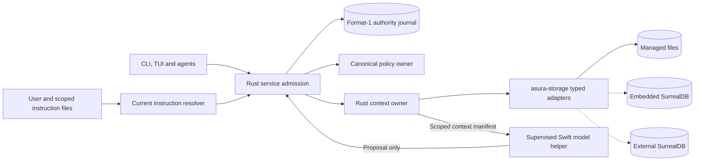
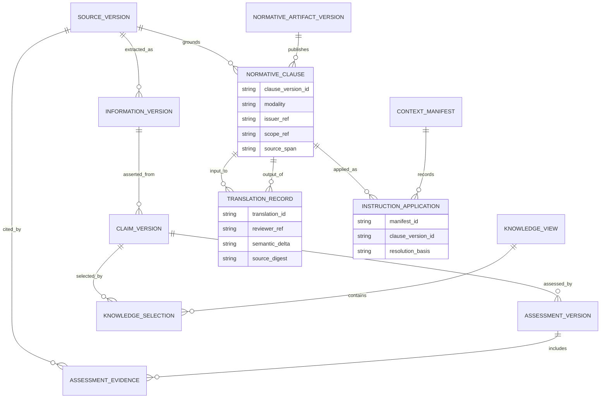
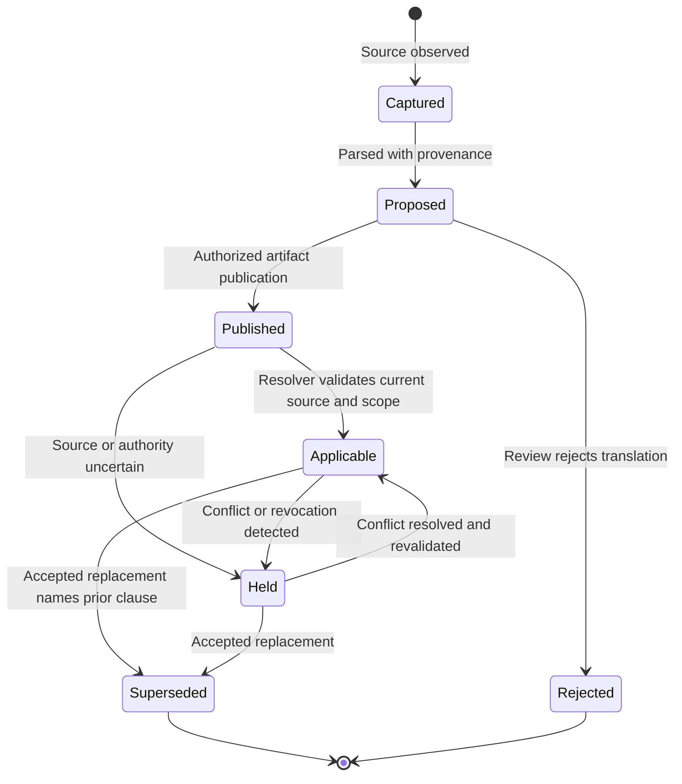
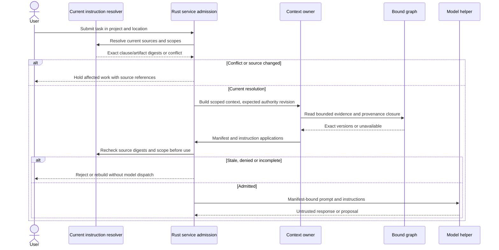
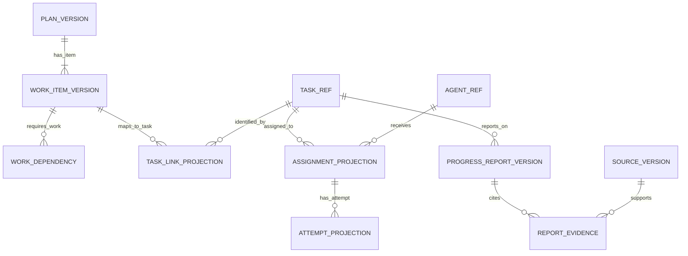
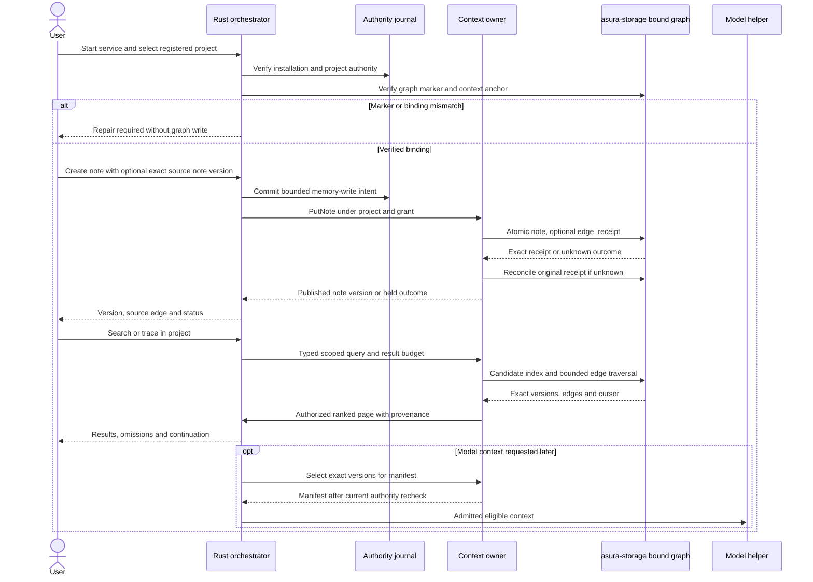
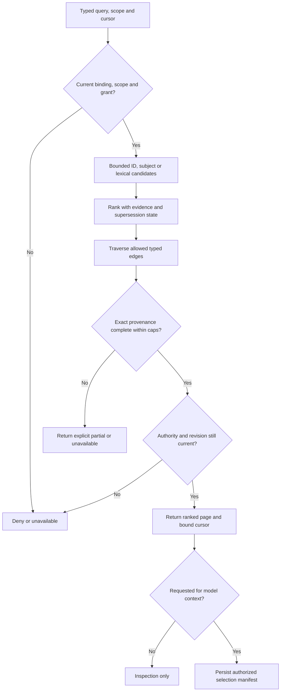
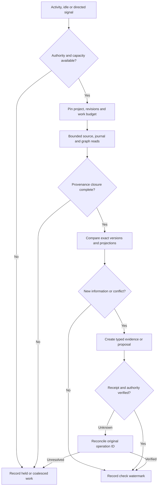
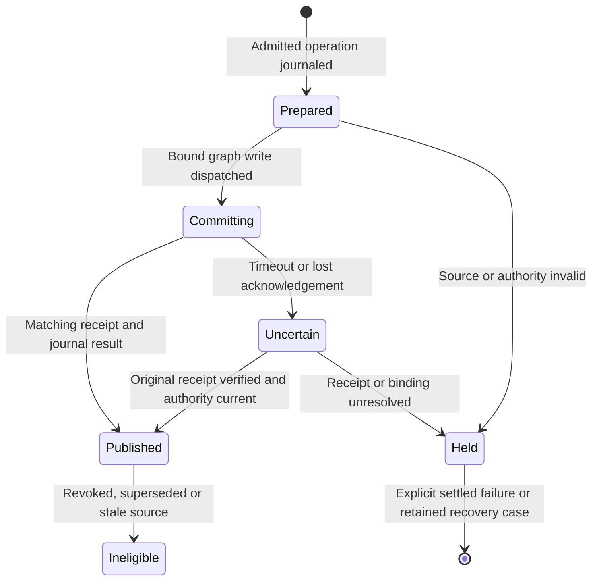

# Graph memory and instruction evolution

Status: proposed D4 design for review, 2026-09-28. The user requires a graph-based
context memory, with documents, files, plans, tasks and partial progress. This
document develops the graph and the history of instructions. It does not change
the implemented HM0–HM3 note schema, initialize a database, ingest private
sessions, or authorize a migration. The [hybrid ontology](hybrid-memory-ontology.md)
remains the governing contract for storage, visibility and recovery. This design
adds concrete graph shapes and instruction-derivation rules for the next packets.

## Purpose and evidence basis

Asura needs to answer connected questions: what was observed, what is claimed,
which evidence supports it, which instruction applied to a task, and why that
instruction changed. A transcript string or a vector match cannot answer these
questions with scope, provenance and time. The graph stores exact versioned nodes
and typed, property-bearing relationships. SurrealDB document fields hold bounded
content and structured attributes. Files hold large or externally authored bytes.

The design derives from a bounded review of Asura-related Codex sessions dated
2026-09-20 through 2026-09-28, the Git history of `AGENTS.md`, and current
repository contracts. The session review sampled the main Asura conversation and
selected design turns; it did not exhaustively classify every subagent session.
The review did not import raw transcript content into this repository or prove
that a historical session is current instruction authority. The reviewed Codex
sessions are external research material. Asura must not scan `$HOME/.codex/` or
ingest those sessions as product memory without a separate authorized import.

| Observed evolution, paraphrased | Graph interpretation |
| --- | --- |
| The owner first required design and implementation planning before product code. The root agent guide recorded a design gate. | A user directive led to a version of a governing instruction artifact. Link the directive, review decision, artifact revision and affected work. |
| The owner later asked for enforceable coding standards and directory-specific Rust and Swift instructions. A later `AGENTS.md` revision added scoped guide discovery. | A standard can have clauses; a rule can apply to paths; an artifact revision can implement several directives. Scope must be a first-class record. |
| The owner selected files plus SurrealDB, then moved classifier assets from `models/classifiers` to `data/classifiers`. | A placement decision superseded an earlier decision. Preserve both assertions, their effective intervals and the explicit supersession edge. |
| The owner later made implementation approval implicit and asked for productive iteration while retaining design and quality. The current working guide and design process record that refinement. | A newer directive changes a workflow rule. Derived agent instructions must cite the current governing artifact and its source decision; old text remains historical evidence. |
| The owner required the whole architecture to be asynchronous and fixed protocol 0.1 and journal format 1 until explicitly changed. | Separate factual baseline, normative constraint, protected version identifiers and their scopes. A schema edit cannot infer permission to change a number. |

These examples show why time alone is not authority. The graph can explain how a
rule was derived. The current instruction resolver still reads authenticated
user input and applicable files under their actual precedence rules. A model,
memory record, old session or search result cannot promote itself to that resolver.

## Canonical owners and process boundaries

The Rust context subsystem owns memory semantics, graph queries, provenance,
eligibility and invalidation. `asura-storage` owns the typed SurrealDB and file
adapters. The Rust orchestrator owns accepted conversation, task, plan adoption,
assignment and execution state in the format-1 authority journal. The canonical
policy owner decides permissions. The instruction resolver constructs the
effective instruction set from current authenticated sources; it is not a graph
query that treats all historical instructions as active. Rust clients present
typed results. The supervised Swift model helper consumes authorized manifests
and returns proposals. It has no database connection or authority to change rules.

The graph may hold task, conversation and instruction **projections** with the
source journal position or governing file digest. It cannot recreate a missing
authority journal or change a live grant. An external SurrealDB server remains
a separate trust and egress boundary. No new process is proposed.

### GM-O1: owner and trust view (proposed)

Solid arrows name typed calls. Dotted arrows name one selected storage mode.
Historical content enters through capture and never bypasses authority checks.

## The graph's basic vocabulary

Every content node is immutable and has a stable object identity plus a version
identity. Every relationship names exact endpoint versions or an explicitly
labelled authority projection. The common envelope is defined in the
[hybrid ontology](hybrid-memory-ontology.md#identity-and-common-record-envelope).
No node's existence proves its content true, current or authorized.

| Kind | Meaning | Distinguishing fields |
| --- | --- | --- |
| `source_version` | Exact observed file, document, message or tool-result source | Locator or retained object, byte digest, span, capture method, source revision |
| `information_version` | Bounded extracted content with no truth assertion | Exact source versions, extractor identity, transform digest, omissions |
| `claim_version` | Asserted proposition or hypothesis | Subject, predicate, value, stated scope, claimant, uncertainty |
| `assessment_version` | A check of one claim against evidence | Method, result, environment, evidence set, limitations, validity horizon |
| `knowledge_view` | A computed view of supported claims for one purpose | Query scope, assessment and source closure, policy revision, invalidation generation |
| `normative_clause` | A directive, rule, policy, guideline or standard clause as historical content | Modality, issuer, target, applicability, exact source span, effective interval |
| `normative_artifact_version` | Exact guide, standard, policy, decision or configuration document revision | File/source digest, path scope, authority class, publication evidence |
| `instruction_application` | An instruction used in one admitted context manifest | Task and operation, clause/artifact versions, resolution basis, exclusion reasons |
| `translation_record` | Reviewable mapping from source directive to derived artifact clause | Author, transformation method, approved status, semantic delta, exact spans |

Information is extracted data. A claim states something that may be wrong. An
assessment records a method and evidence. A knowledge view selects currently
eligible assessed claims; it is a view, not a timeless fact. Rules, policies,
guidelines and standards are normative content types, not confidence levels.
A standard can group clauses; a policy controls authority only when the canonical
policy owner has adopted the applicable revision. A guideline advises. A rule
states a required or prohibited behavior under an identified governing source.
An agent instruction is a resolved application of one or more such clauses to
one task and invocation. Its role is determined by the current instruction
resolver, not by wording such as “must” inside untrusted content.

### GM-D1: versioned knowledge and instruction data (proposed)

ER arrows show logical cardinality. The physical tables below refine this view.
An assessment can cite many source versions through evidence edges. An
instruction application always pins exact clause and artifact versions.

## Instruction derivation and temporal authority

Represent five distinct events: source capture, interpretation, artifact edit,
publication, and application. A user message may contain several clauses and
facts. Extraction may split them, but each extracted clause retains exact
source spans and a reviewable semantic delta. A changed file is a new artifact
version even if its path stays the same. A file revision is **published** when
the current source loader accepts its exact bytes and scope. A Git commit may
record that revision, but a commit is not required for local `AGENTS.md` to
apply. A clause is **applied** only after the current resolver validates its
source, scope and precedence for the specific task. Capturing a historical
conversation alone performs none of the latter steps.

Each normative clause records: `kind` (`directive`, `rule`, `policy`, `guideline`,
`standard_clause`), modality (`require`, `prohibit`, `permit`, `advise`), issuer
reference, target actor and behavior, applicability predicate, source span and
digest, asserted start/end or unknown, publication reference and trust class.
Use an explicit `supersedes` edge only after an accepted decision identifies the
old and new clauses. Multiple applicable clauses can coexist. A disagreement
creates a `conflicts_with` assessment and stops the affected work under the
current project instructions; it is not resolved by latest timestamp or model
confidence. An explicit owner correction may resolve that conflict. The graph
records the correction and the current resolver re-evaluates it.

`translation_record` states whether the derived clause preserves, narrows,
extends, interprets or contradicts its source. It names the agent/author and
review outcome. An unreviewed translation is a proposal. If the source says
“async across the architecture” and `AGENTS.md` says “async in clients,” the
translation must expose the narrowing. The derived text cannot silently replace
the broader requirement. If a user says “protocol 0.1 until I say otherwise,”
the graph records both current value and the authority needed to change it.

### GM-S1: clause lifecycle (proposed)

Transitions name evidence; `Applicable` is evaluated for one scope and time.
Supersession preserves history. A conflict holds use rather than selecting a
winner by clock order.

### GM-I1: instruction resolution and trace (proposed)

The resolver's precedence comes from the current host and project instruction
contract. The graph records its decision, including exclusions. It does not
implement its own competing precedence policy.

The context manifest records instruction order, version, source, applied scope,
policy/config revision and any excluded candidate with a reason. It distinguishes
model prompt content from governing instructions. An old conversation may be
retrieved as evidence, but its commands remain quoted data. This prevents a
summary or embedding from silently becoming a higher-priority instruction.

## Physical SurrealDB shape and typed graph operations

**Proposed mechanism:** retain the implemented `graph_marker`, `memory_note`,
`memory_link` and `memory_receipt` tables. Add schema-full, typed node tables
for the families above and the plan/task families in the hybrid ontology. Use
SurrealDB `TYPE RELATION IN ... OUT ...` tables for each semantic edge family.
No application caller sends free-form SurrealQL. `asura-storage` owns compiled,
parameterized queries and validates all returned rows.

| Proposed table family | Key and selected fields | Ownership and constraint |
| --- | --- | --- |
| `context_anchor` | Installation/graph binding, canonical project ID and accepted registry revision | Rebuildable project projection; no independently editable project identity |
| `memory_object`, `memory_version` | Stable object ID; exact version ID, kind, scope, source digest and payload reference | Context owner; immutable version and compare-and-set head |
| `source_version`, `information_version`, `claim_version`, `assessment_version` | Exact IDs and typed document fields above | Context owner; assessments never overwrite claims |
| `normative_clause`, `normative_artifact_version`, `translation_record` | Exact source/artifact versions, clause span, modality and review evidence | Historical memory only; resolver and policy remain canonical |
| `plan_version`, `work_item_version`, `progress_report_version` | Immutable plan/item/report identities and exact task references | Context stores content; orchestrator owns adoption and task lifecycle |
| `authority_projection`, `instruction_application`, `context_manifest` | Journal or source position/digest, scope and selection revision | Rebuildable only from verified named authority; manifest itself is immutable evidence |
| `memory_receipt` and future operation receipts | Operation ID and exact command digest | Storage idempotency; verify before retry or publication |

Relation tables are `derived_from`, `supports`, `contradicts`, `supersedes`,
`conflicts_with`, `describes`, `cites`, `published_in`, `translated_from`,
`selected_for`, `has_item`, `requires_work`, `maps_to_task`, `assigned_to` and
`reports_on`. Each row has its own ID, installation/graph binding, origin and
destination scopes, exact endpoint version IDs, creating operation, source
evidence, relation kind, publication state and sensitivity. A `requires_work`
edge has an exact adopted plan version and satisfaction predicate. A
`translated_from` edge has a semantic delta and reviewer decision. A
`supersedes` edge never deletes the earlier node. A generic `memory_link` is
retained for HM3 note provenance; it is not an authority shortcut to arbitrary
new relation types.

Define indexes for `(origin_context_id, kind, version_id)`, exact source digest,
relation `in`/`out`, journal projection position, operation receipt ID,
plan/version dependency endpoints and normative scope/source digest. The
specific index definitions and SurrealDB version are implementation gates.
Use deterministic keyset pagination on immutable IDs plus explicit revision.
An ID's sort order is not creation time; use accepted journal position when
ordering tasks or conversations. Evaluate transactions and uniqueness under the
pinned embedded and external engines before relying on them.

### GM-D2: plan and work graph (proposed)

Edges are versioned facts. Journal-backed projections link plans to accepted
tasks, assignments and attempts. Reports can arrive out of order and cannot
complete tasks by themselves.

The plan dependency subgraph is a DAG within one immutable plan version.
General provenance or code dependencies may cycle and use bounded traversals.
Readiness requires current journal adoption, satisfied predicates, valid scope
and budget, and a serialized admission recheck. See the
[plan contract](hybrid-memory-ontology.md#plans-tasks-and-agent-work).

## Files versus database

| Place | Store | Reason and authority |
| --- | --- | --- |
| `$HOME/.asura/db/` | Embedded SurrealDB engine data for versions, structured documents, relation records, receipts and indexes | One verified bound graph; absent in external mode |
| External SurrealDB | Same logical graph, when configured and authorized | Remote database trust and data egress apply; no silent embedded fallback |
| `$HOME/.asura/config.yaml` | User configuration | File is the configuration source; graph snapshots are historical evidence only |
| `$HOME/.asura/logs/` | Bounded diagnostics and audit log files | Read-only model inspection may be allowed; logs never repair authority or graph |
| `$HOME/.asura/sessions/` | Verified immutable large payloads and explicit session exports | Graph holds digest, logical payload ID, scope and provenance; exports are projections |
| `$HOME/.asura/tmp/` | Staged capture and disposable work | No acknowledged result depends only on temporary bytes |
| `$HOME/.asura/data/classifiers/` | Local custom classifier binaries and versioned assets | Graph may cite training/evaluation evidence; metadata does not activate a model |
| `$HOME/.asura/data/models/coreai/`, `mlx/` | Local model bundles | Model owner validates binaries; graph records descriptive provenance only |
| `$HOME/.asura/state/control/` | Ordinary-file format-1 authority journal | Installation, task, accepted conversation and execution truth remain journal-owned |
| Project source trees and applicable `AGENTS.md` | Live source files outside managed memory | Capture exact versions; do not treat old graph copies as current governing files |

For a bounded note or clause, the database may hold the body. For a large
document, raw session artifact or attachment, retain exact bytes in one
immutable file and put its digest and object reference in the graph. Extraction
creates a separate derived document node. No body is independently editable in
both stores. A file path is never a capability or a replacement for digest and
filesystem identity checks. The payload threshold and retention policy require
an implementation packet decision.

## Retrieval, reconciliation and user tools

### Create the graph, attach a note, then find it

**Required behavior:** one installation has one bound SurrealDB graph. A project
gets a logical context anchor inside that graph. “Create a graph” means verify
or initialize that installation binding, then create the project's scoped anchor.
It does not mean create an arbitrary second database per note or per agent.
The existing automatic initialization path owns the physical marker and journal
binding. Neither a model tool nor a note write may initialize an unbound graph.
If a prior binding is missing or mismatched, report repair required. Do not make
an empty replacement and silently lose memory.

**Proposed first user journey:**

1. The service verifies its installation journal and active graph marker. If
   both are absent on a clean start, its authorized initialization creates one
   binding. It validates the selected embedded or external mode.
2. The user selects or registers a project. The orchestrator ensures a scoped
   `context_anchor` record with project ID and accepted registry revision. It
   derives the anchor from canonical registration; it is not a new project.
3. The user or admitted model calls `memory create_note` with a bounded body and
   optional exact source **note** version. The existing HM3 path journals intent, creates
   a `memory_note`, an optional `derived_from` `memory_link`, and a receipt in
   one SurrealDB transaction. It publishes only after receipt reconciliation.
4. A later capture can link a file or session excerpt to a note through an
   immutable exact `source_version` and a typed `cites` or `derived_from` edge.
   It must not mutate an old note to point at a new file version. A correction
   creates a new note version or a new assessment.
5. `memory search` retrieves candidate versions in the authorized project scope.
   `memory trace` follows allowed edges to exact sources, claims and assessments.
   The result states whether the path is complete, partial or unavailable.
6. Context assembly selects eligible versions into a manifest. It rechecks
   current visibility, source eligibility and instruction authority before model
   use. A memory search result by itself never becomes model input.

For the session example, capture the owner's classifier-path instruction as a
source version and extract a placement claim. Capture the later corrected path
as another source and claim. Link the second to the first with an accepted
`supersedes` relation. Link the current guide or design clause through a
`translation_record`. A search for classifier storage returns the current
placement with both source references and the supersession explanation.
It must not report the old path as an equally current instruction.

### GM-I2: creation, link and retrieval journey (proposed)

Arrows name the service's typed calls and persistence checkpoints. The model
receives only selected manifest content. The graph adapter never accepts a
caller-provided query expression.

### Typed operations and command surfaces

Typed service tools expose graph concepts, not SurrealQL. Candidate operations
extend the existing grouped `memory` model tool. CLI commands may present the
same typed service operations, but the service owns scope and policy. The names
below are proposed commands, not implemented syntax. `graph_status` is read
only. Physical graph creation remains an internal service initialization call.

| Command | Typed input | Bounded result and owner |
| --- | --- | --- |
| `memory graph_status` | No graph name or path | Binding mode, verified/mismatch/unavailable state, graph identity, projection watermark; service and storage |
| `memory create_note` | Body 1–16,384 UTF-8 bytes; optional exact source note version | Existing HM3 note version, optional note edge and receipt; separate write grant |
| `memory capture_source` | Service-issued source handle, range and expected source revision | Immutable source version, digest and capture limits; host capture plus context owner |
| `memory link_note_source` | Exact note and source version IDs, relation kind from closed set, operation ID | Immutable edge and receipt; context owner, separate link grant |
| `memory search` | Query text, closed kinds, optional subject, limit 1–32 and opaque cursor | Ranked summaries with exact IDs, provenance, status and next cursor; context owner |
| `memory trace` | Exact version ID, closed edge kinds, direction, depth 1–3, limit 1–32 and cursor | Bounded nodes/edges, path and omissions; context owner |
| `memory get_claim` | Exact claim version ID | Claim, assessments and direct evidence IDs, paged if needed |
| `memory trace_instruction` | Exact clause or application ID | Source span, translation chain, supersession/conflict status and manifest ID |
| `memory list_plan`, `memory task_progress` | Exact plan/task ID and cursor | Adopted revision, journal watermark and bounded reports |
| `memory explain_context` | Exact manifest ID and cursor | Selected and excluded versions, reasons and authority revisions |

Existing `list_notes`, `get_note`, `note_sources` and `create_note` remain
unchanged. New commands use the same canonical grouped tool and strict command
enum. `link_note_source` cannot create plan prerequisites, task assignments,
instruction applications or policy edges. `capture_source` cannot accept an
arbitrary path string from the model. A user file capture may name a path only
through the host service's validated source-handle operation. The model can use
an admitted observation handle or exact source version with a current read grant.
A model can propose a source or relationship but cannot make
its own output trusted host evidence. Read discovery may list supported commands;
execution still rechecks grants and destination locality.

Every page returns `items`, `next_cursor`, `complete`, `omissions`,
`graph_binding`, `projection_watermark` and `invalidation_generation`. A
continuation cursor binds query filters, project/principal scope, graph binding,
snapshot revision and the last ordering tuple. The service validates it and
rechecks current authority on every page. A changed revision returns
`stale_cursor`; it never combines rows from different snapshots into a false
complete result. Cursors are position aids, not bearer permission tokens.

### Discovery and ranking plan

The context owner first checks current installation, project visibility, task
purpose and read grant. It then selects candidates by exact ID, subject or
bounded lexical index. It never scans every document or expands arbitrary
relations for a model. Candidate search filters scope before ranking. Proposed
ranking order is: exact ID/subject match, assessed and currently supported
claims, direct source or note lexical match, then derivative summaries. Within
a tier, use explicit evidence quality and freshness fields, then stable version
ID as the deterministic tie-breaker. Recency cannot override a supersession,
revocation, contradiction or missing source. A model-generated confidence score
is displayed as a statement, not a ranking authority.

For each candidate, traverse only the command's allowed edge set. Verify exact
endpoint kinds, origin scope, binding, source digest, publication receipt and
current invalidation generation. A returned claim includes a support/contradict
summary and the evidence IDs. A returned note includes source version IDs and
digest. A trace exposes path direction and relation properties. Where a source
body is missing, return metadata as unavailable; do not reconstruct its content
from a summary. Ranking does not grant disclosure: recheck authorization before
serializing each result and before using one in a context manifest.

### GM-A2: search and trace plan (proposed)

The flow separates candidate discovery from context selection. Any cap or
incomplete provenance closure produces an explicit partial or unavailable result.

`memory trace_instruction` returns the applied clause, source span, translation
chain, supersession/conflict status and manifest ID. `memory explain_context`
returns selected and excluded versions with reasons.
Writes require separate grants: capture, assess, report progress and propose
plan are distinct from read; adoption, assignment, policy and live instruction
publication remain with their canonical owners. A model cannot grant itself a
write by producing a tool argument.

Activity-triggered reconciliation can check new source versions, changed
instructions, task progress and graph/journal projection lag. Idle-triggered
reflection may propose summaries, cross-data checks or local classifier
candidates. Neither trigger can silently adopt a policy, publish governing
instructions, complete a task, dispatch an agent, or train/activate a classifier
without the corresponding owner-controlled admission. Proposals retain their
sources and review state. The [sensor design](sensors.md) owns trigger and
observation semantics; this design owns memory consequences.

### GM-A1: bounded reconciliation (proposed)

Every branch terminates with a durable status or a held proposal. An uncertain
write is reconciled by operation receipt, not repeated blindly.

## Asynchronous, failure and security contract

No graph, file or network call runs in a TUI render loop or the service control
dispatch loop. The service routes typed work through its existing bounded
authority/context workers. Storage isolates blocking file and embedded-engine
calls. External queries have a deadline and cancellation path; late results
must pass generation, task, binding and disclosure rechecks. Cancellation of a
write may leave an unknown database commit; retain its receipt identity until
reconciliation. Shutdown settles owned work and preserves unresolved records.

For the first graph traversal packet, propose hard caps of depth 3, 128 visited
nodes, 256 traversed edges, 256 KiB decoded content, 32 result items per page,
and a two-second operation deadline. These are design targets, not measured
capacity claims. The packet must reconcile them with the existing control frame,
authority-worker slots, service deadlines and model context budget before code.
If closure exceeds a cap, return explicit partial/unavailable status. Do not
claim absent evidence. Queue overload coalesces low-priority maintenance signals;
it does not discard accepted control outcomes or turn a stale graph into current
authority. Recovery replays journal positions and receipts before publishing
new graph projections.

Current source files, user input, imported sessions and model output have
different trust classes. A statement copied into a guide is not automatically
authorized. The resolver checks exact source and scope at use time. The graph
records a translation chain so reviewers can detect omissions and added force.
Cross-project retrieval follows current closed/group/open eligibility and
separate per-use permission. Derivatives inherit sensitivity. External graph
writes and remote model input need distinct egress authorization. Logs and
classifier training data can contain secrets and cannot become broad memory
sources through an idle trigger.

### GM-S2: publication and failure state (proposed)

This state applies to a graph mutation, not to journal authority. The receipt
and current binding must be verified before publication.

## Acceptance cases and delivery order

| Case | Initial state and trigger | Required result | Unit / integration / end-to-end evidence |
| --- | --- | --- | --- |
| GM-01 instruction lineage | A user directive is translated into a guide clause, then revised | Both versions and exact source spans remain; an application names the current version and resolution basis | Unit: edge validation and semantic-delta classification. Integration: edit guide, recapture and query lineage. E2E: admitted task reports applied instruction provenance. |
| GM-02 conflict and precedence | Two applicable clauses disagree, or imported text claims authority | Affected work holds; source/issuer and scope are shown; imported text has no authority | Unit: conflict/scope matrix. Integration: resolver and graph disagree safely. E2E: TUI displays hold while unrelated work continues. |
| GM-03 fact and assessment | A claim has supporting and contradicting evidence; one source changes | Preserve both assessments; recomputed knowledge view excludes stale support and shows uncertainty | Unit: closure/invalidation. Integration: real bound graph update/restart. E2E: model context cites only eligible versions. |
| GM-04 plan progress | Adopted plan has a prerequisite; agent reports partial progress | Report links to task and evidence but does not satisfy completion or dispatch dependent work | Unit: DAG and predicate checks. Integration: journal projection and out-of-order reports. E2E: visible task progress plus blocked dependent item. |
| GM-05 cross-store interruption | File payload installed and graph acknowledgement lost | Original receipt is reconciled; no duplicate node or invented response | Unit: identity/digest. Integration: fault at each checkpoint. E2E: restart and retrieve exact payload. |
| GM-06 overload and stale scope | Graph stalls, queue fills, project visibility changes | Control remains responsive; bounded error; no late or cross-scope disclosure | Unit: limits and stale generation. Integration: stalled embedded/external adapter and revocation. E2E: TUI remains editable and reports unavailable accurately. |
| GM-07 external mode and restore | External DB unavailable or backup lacks graph/payload | No embedded fallback; affected memory unavailable; restore refuses incomplete closure | Unit: binding checks. Integration: real external DB outage/backup. E2E: restart with preserved journal and missing graph reports repair state. |
| GM-08 graph-to-note journey | Clean authorized installation, one project and a captured source | One verified graph/context anchor; note and exact source edge publish once; search and trace return the note with provenance | Unit: scope, edge direction and receipt IDs. Integration: real embedded database, lost-ack retry and indexed query. E2E: create, restart, search, trace and cite from a second session. |
| GM-09 ranking and pagination | Two conflicting classifier-path claims and enough matches for two pages | Current supported claim ranks above superseded one; old source remains visible as history; cursor binds filters and revision | Unit: deterministic score tiers and stale cursor. Integration: index and edge queries with cap faults. E2E: inspect explanation and select only current eligible evidence for a model. |

Delivery should proceed from source/version capture and typed relations, to
instruction lineage inspection, then assessed knowledge views and plan/report
projections, then background reconciliation. Each packet must define the pinned
SurrealDB version, exact schema, index and migration behavior, numeric queues,
retention, grants, wire fields within protocol 0.1, and meaningful unit,
integration and macOS end-to-end checks. The journal remains format 1 unless
the owner explicitly changes its number. New record kinds need their own
compatibility and recovery review without inferring a version bump.

## Open decisions and proof limits

- Select and qualify the embedded SurrealDB version, SDK, engine and external
  compatibility before physical schema implementation.
- Fix payload cutoff, retention and deletion policy. A hash alone cannot recover
  missing bytes or justify indefinite retention of private sessions.
- Fix the instruction resolver's exact source classes, precedence and publication
  events in its governing design. This graph records those decisions; it cannot
  choose a different authority order.
- Define the first read/write tool wire shapes, grants and pagination with the
  control and model contracts. Keep protocol numbering at 0.1.
- Reconcile candidate traversal limits with measured service capacity and the
  existing HM3 authority worker. Validate SurrealDB transactions and constraints
  with real embedded and external databases.

This document is a design proposal. Session sampling, source inspection and
Mermaid rendering can validate its consistency, but they do not prove database
behavior, permission enforcement, recovery or model use.
