# Hybrid memory ontology and storage contract

Status: the broad D3–D4 ontology remains a proposal. HM0–HM3 define the authorized
incremental implementation; their evidence sections distinguish tested behavior
from remaining qualification. The owner selected embedded data
under `$HOME/.asura/db/`, plus `config.yaml`, `logs/`, `sessions/`, `tmp/`
and `data/classifiers/` for custom classifier files. Other locally managed model
files belong under `data/models/`, with `coreai/` and `mlx/` subdirectories.
The previously selected `run/` runtime area remains. These choices do not select
an embedded engine, database version, record schema or implementation packet.
The HM sections narrow storage, read and immutable-note creation packets.
They do not authorize unrelated migrations or changes to existing user data.

This document proposes one memory model across files and SurrealDB document and
graph records. The [storage contract](context-storage-candidates.md) owns deployment
and graph binding. The [authority design](persistence-recovery.md) owns control
transactions and recovery. The [domain model](domain-model.md) owns project,
conversation and visibility semantics. The [context contract](core-harness-brief.md#required-graph-semantics)
owns evidence selection, provenance, invalidation and effective model input.

## Scope and selected placement

A document is a typed content record with nested fields. A graph edge records a
typed relationship between versioned records. A file holds source bytes or a
retained payload. These are complementary representations of one identified
memory object. They do not create three independent memory services.

The selected directories have these roles. Proposed contents below require
review. This list does not relocate the control journal into SurrealDB or remove
its independent durability requirement.

| Location | Status and intended contents | Creation and deletion boundary |
| --- | --- | --- |
| `db/` | Selected embedded engine directory; engine format remains open | Explicit bound initialization or authorized migration; absent in external mode |
| `config.yaml` | Selected service configuration file; schema remains open | Configuration resolver validates it; no plaintext credentials or policy bypass |
| `logs/` | Bounded diagnostics and the selected nonauthoritative `audit.jsonl` event journal/archives | Telemetry owner; never authoritative task state or security audit |
| `sessions/` | Selected session artifact area; proposed immutable payloads and explicit exports | Storage adapter under context/conversation owners; retained files require reference tracking |
| `data/classifiers/` | Selected custom classifier model files, outside SurrealDB | Model owner validates and activates versions; format, version layout and installation protocol remain D4 work |
| `data/models/` | Selected other locally managed model files, outside SurrealDB | Model owner validates and activates versions; format, version layout and installation protocol remain D4 work |
| `data/models/coreai/` | Selected Core AI model files | Uses the model owner's validation and activation contract |
| `data/models/mlx/` | Selected MLX model files | Uses the model owner's validation and activation contract |
| `tmp/` | Selected staging and disposable work area | No acknowledged result may depend only on temporary bytes; cleanup respects active operations |
| `run/` | Previously selected runtime lock and socket area | Service lifecycle; existence does not initialize an installation |
| Control journal | Independent ordinary-file authority remains required; `state/control/` remains a proposal | Orchestrator authorizes transitions; authority adapter owns append/replay |
| Project source tree | Existing working location, outside managed memory | Host services authorize reads; memory never rewrites source to retain evidence |
| External graph | Configured SurrealDB server, outside the local home | Same logical schema and saved binding; independent trust and egress controls |

`db/` replaces the earlier proposed `data/graph/` placement for embedded storage.
Existing data must move only through an authorized migration that verifies the
saved binding. A new path does not permit creation of an empty replacement.
External mode does not create an embedded database as a cache or fallback.

A validated pre-initialization `config.yaml` needs an explicit allowlist and
conflict check in the bootstrap design. Its presence is not installation proof.
Unknown files, partial database contents or missing authority still require the
existing repair classification. The new path choices do not make arbitrary
pre-existing content safe to overwrite.

## Owners and authority matrix

The Rust context subsystem owns evidence, document semantics, derivations and
memory selection. The Rust orchestrator owns installation, tasks, conversations,
accepted operations and durable control. The canonical policy component owns
permissions; the configuration resolver owns settings and source snapshots.
The storage adapter implements file and SurrealDB access for those owners.

Clients and agents use typed owner interfaces. They cannot open managed stores
or submit arbitrary SurrealQL. The selected Swift model helper consumes an admitted
context manifest and returns proposals. It cannot register memories, alter their
visibility, migrate stores or turn a transcript into control authority. Narrow
Swift platform adapters may supply qualified file or credential operations.
Module allocation follows the governing D2 design; this ontology adds no process.

| Record | Canonical semantic owner | Authoritative representation | Other representations |
| --- | --- | --- | --- |
| Installation, binding, registry, task/control outcome | Orchestrator | Ordinary-file authority contract | Graph references are versioned projections with replay position |
| Conversation membership and accepted messages | Orchestrator | D3 conversation authority contract, not selected here | Session transcripts and graph references cannot supersede it |
| User settings | Configuration resolver | Validated `config.yaml` and applicable scoped sources | Immutable resolved snapshots retain source digests and resolver version |
| Current policy, visibility and group membership | Canonical policy/registry owners | Their durable authority contract | Captured labels in memory are historical evidence, never current grants |
| Plan definitions, work items and prerequisite definitions | Orchestrator owns planning semantics; context subsystem stores versions | Bound SurrealDB content | Accepted adoption and execution remain journal-owned |
| Partial progress reports | Agent runtime or authorized reporter supplies evidence; context subsystem stores versions | Bound SurrealDB immutable reports | Task/assignment/operation references do not change accepted lifecycle |
| Evidence metadata and immutable document versions | Context subsystem | Bound SurrealDB records | Search indexes and current-head caches are rebuildable |
| Retained exact payload bytes | Context subsystem or originating conversation owner | One verified immutable file or inline database payload, selected per version | Exports are labelled copies; no independently editable second primary |
| Claims, assessments and derivation edges | Context subsystem | Versioned graph/document records | Mutable heads select versions; no overwritten evidence |
| Context selection manifest | Context subsystem | Immutable record linked to admitted operation | Journal records its identity/digest; the model helper receives an authorized view |
| Model runtime state | Model-session owner under task scope | Qualified runtime/session contract | Session files cannot claim to restore opaque framework state |
| Custom classifier files | Model owner | Files under `data/classifiers/` | Proposed graph metadata can reference version, digest, training provenance and evaluation evidence; metadata alone does not activate a model |
| Other locally managed model files | Model owner | Files under `data/models/` | Proposed graph metadata references model versions, digests and evaluation evidence; metadata alone does not activate a model |
| Diagnostic logs | Telemetry owner | Bounded diagnostic files | Cannot repair missing task, evidence or audit records |

The graph is authoritative for its evidence and document records. It is not all
rebuildable from the control journal. Only records declared as projections may
be reconstructed from their named authority source. A graph backup therefore
remains necessary even when the journal and session files survive.

### Ownership and storage view

Required ownership with proposed record placement. Solid arrows name authorized
operations. Dotted arrows select one bound graph mode; they are not replication.
The external server is a separate process and trust boundary.

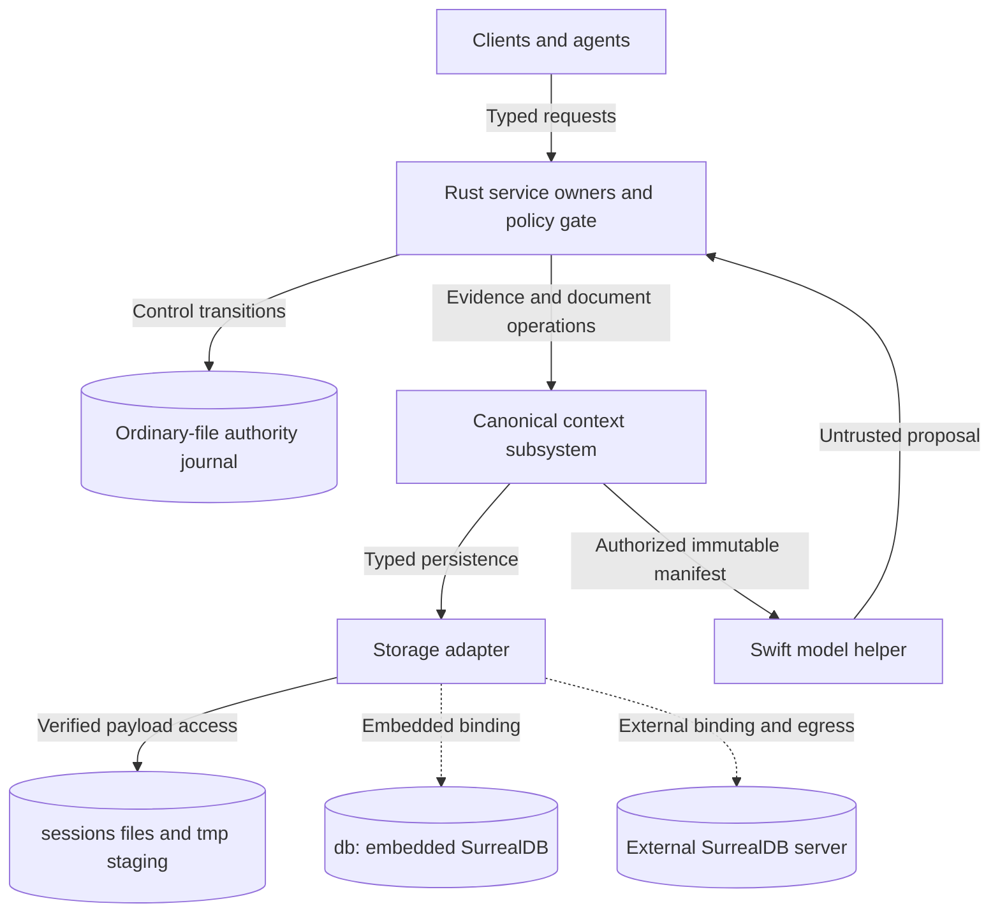
```mermaid
flowchart TD
    Client["Clients and agents"] -->|Typed requests| Service["Rust service owners and policy gate"]
    Service -->|Control transitions| Journal[("Ordinary-file authority journal")]
    Service -->|Evidence and document operations| Context["Canonical context subsystem"]
    Context -->|Typed persistence| Adapter["Storage adapter"]
    Adapter -->|Verified payload access| Files[("sessions files and tmp staging")]
    Adapter -.->|Embedded binding| Embedded[("db: embedded SurrealDB")]
    Adapter -.->|External binding and egress| External[("External SurrealDB server")]
    Context -->|Authorized immutable manifest| Model["Swift model helper"]
    Model -->|Untrusted proposal| Service
```

## Identity and common record envelope

Proposed logical schema. Physical table definitions and migrations remain a
separate reviewed implementation packet. IDs are typed opaque values scoped to
an installation; no path, display name, content hash or remote URL grants identity.
Propose UUID record identities. D3 must fix their generator and wire encoding.
The storage adapter maps them to SurrealDB record IDs and verifies table kind.

Every stored version has the following envelope. Required applicability rules
must be validated before persistence and again when decoding untrusted server data.

| Field | Meaning and invariant |
| --- | --- |
| `schema_version`, `kind` | Known record version and closed kind discriminator; unknown required fields or kinds reject |
| `installation_id`, `origin_graph_id`, `binding_generation_at_capture` | Immutable origin provenance; current storage resolution follows the verified active binding and authorized migration map |
| `record_id`, `version_id` | Stable logical object and immutable version identities |
| `origin_context_id`, `principal_scope_ref` | Original project and principal scope; origin is never replaced by destination scope |
| `origin_task_id`, `operation_id` | Producing task/operation where applicable; absent for permitted task-independent capture, not fabricated |
| `created_at`, `source_observed_at` | Diagnostic capture times; not unique order, freshness proof or conflict resolution |
| `source_revision`, `content_digest` | Source version evidence and algorithm-tagged content identity where applicable |
| `provenance_ref`, `sensitivity_ref` | Producer, capture/transform history and classified sensitivity |
| `visibility_revision_at_capture` | Historical origin policy reference; current authority is rechecked per use |
| `ingest_operation_id`, `publication_revision` | Original persistence operation and acknowledged publication boundary |

Capture binding generation is historical provenance, not a demand that the
installation keep that generation forever. Retrieval verifies the current active
binding and any authorized migration mapping from the origin graph/version.
A migrated immutable version may remain valid without rewriting its capture
fields. An arbitrary graph with matching IDs cannot substitute for that mapping.
A current request still carries the active binding generation for admission.

Propose SHA-256 over exact retained bytes with an algorithm/version tag. Text
normalization or extraction creates a new version with its own digest and source
link. A digest detects byte change; it does not prove origin, permission or truth.
Do not globally deduplicate across projects from matching digests. Even hash
existence and equality can disclose private content.

For ordered mutable metadata, use explicit expected/resulting revisions. Timestamp
order cannot decide a winning update. Repeating an operation ID with another
payload digest rejects. Database transaction retries retain the same operation
identity after checking whether its receipt already committed.

### Evidence and payload relationships

Proposed logical cardinalities. A memory object has immutable versions. Each
version selects exactly one payload representation when it has content. A source
reference describes captured provenance; it is not a live filesystem capability.

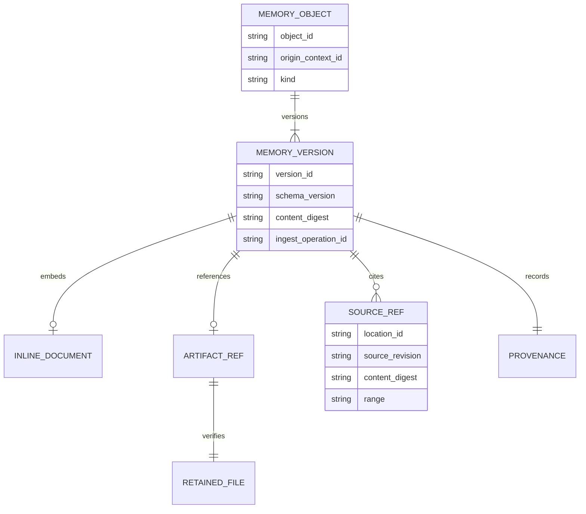
```mermaid
erDiagram
    MEMORY_OBJECT ||--|{ MEMORY_VERSION : versions
    MEMORY_VERSION ||--o| INLINE_DOCUMENT : embeds
    MEMORY_VERSION ||--o| ARTIFACT_REF : references
    MEMORY_VERSION ||--o{ SOURCE_REF : cites
    MEMORY_VERSION ||--|| PROVENANCE : records
    ARTIFACT_REF ||--|| RETAINED_FILE : verifies
    MEMORY_OBJECT {
        string object_id
        string origin_context_id
        string kind
    }
    MEMORY_VERSION {
        string version_id
        string schema_version
        string content_digest
        string ingest_operation_id
    }
    SOURCE_REF {
        string location_id
        string source_revision
        string content_digest
        string range
    }
```

The two optional payload edges express alternatives, not permission for two
primary bodies. A content-bearing version must select one. A source-only reference
may have no retained body and must report that historical bytes are unavailable.
Relationships spanning tables still need application validation and database
constraints; the diagram is not an implemented schema.

## Ontology and document shapes

### Versioned objects

Proposed record families. Keep fields in typed nested objects rather than using
an unrestricted property bag. Strings from files, tools or models remain data.
A stored instruction document does not acquire governing instruction priority.

| Family | Document fields beyond the envelope | Purpose and restrictions |
| --- | --- | --- |
| `source_version` | Host/location IDs, validated relative locator, filesystem identity evidence, observed VCS revision, capture interval, byte length, media type | Exact source observation; a Git commit alone cannot identify dirty working bytes |
| `entity_version` | Entity ID, kind (`symbol`, `module`, `package`, `concept`), observed name, language/ecosystem, exact source-version/span references, resolution method/version | A versioned description of a coding subject; names do not prove identity or truth |
| `observation_version` | Observation kind, typed result, producer reference, execution/result evidence, uncertainty | Records what was observed; imported or model-produced observations retain lower-trust provenance |
| `document_version` | Document subtype, title, language/media type, typed sections, payload choice, extraction version | Notes, instructions-as-evidence, structured reports and message-derived documents |
| `claim_version` | Claim text or typed predicate, subject references, asserted scope, author/producer, stated confidence and uncertainty | Hypothesis or assertion; confidence never grants authority or proves verification |
| `assessment_version` | Claim version, result, method/version, exact evidence versions, environment, limits | Supports accepted/disputed/unverified status for a particular claim and evidence set |
| `summary_version` | Source versions, transform/model identity, prompt/template version, omissions, uncertainty, digest | Lossy derivative; cannot replace source provenance or erase contradictions |
| `context_manifest` | Destination task/operation, ordered selections, transforms, omissions, policy/config revisions, budgets and model-session generation | Records effective eligible input; not a new permission token |
| `authority_projection` | Authority kind/ID, source journal position, source revision/digest, projection schema/version | Read-only task, action or conversation references; unavailable if authority cannot be verified |

Normalized memory documents, claims, assessments and their typed metadata live
in SurrealDB. Propose inline database bodies for bounded notes and structured
reports. Large original captures, attachments and exact tool output use retained
files with database references. The payload threshold is an HM-D4 decision.
Extraction from original bytes produces a separate derived document version;
the raw file and extracted document are different records with explicit provenance.
No document body is independently editable in both stores.

Propose a `memory_head` record per logical object with its current version and
expected/resulting revision. Updating it is compare-and-set under the context
owner. The previous version remains immutable. Conflicting proposals may both
be retained, but only one head update wins; the loser must re-evaluate current
state before retry. No record means universally true merely because it is current.

A claim becomes supported or disputed through a new assessment record. The original
claim and prior assessments remain inspectable while retention permits. Revoked,
expired or superseded evidence makes a prior assessment ineligible for current
use; it does not rewrite the historical result. Correction and deletion are
separate operations with separate authority and retention consequences.

### Coding subjects and semantic relationships

Propose stable logical entity IDs for symbols, modules, packages and concepts.
An `entity_version` describes one observed interpretation of that entity. A symbol
occurrence names an exact source version and byte span; a package observation also
records ecosystem, declared version and lockfile/source evidence where available.
Concepts may originate in user documents without a source-code span.

Same spelling across projects, worktrees or source versions does not prove the
same entity. Identity resolution records its method, evidence and uncertainty.
Uncertain matches remain separate subjects with a claim about possible identity;
they are not silently merged. An entity ID is a memory reference, not a canonical
fact about the source or permission to access it. This design selects no parser,
language server or symbol-resolution implementation.

A query can find a symbol's definitions, containing module, cited tests and claims
about behavior. Every result retains the exact version and provenance used to
establish that relation. A newer definition can invalidate a derived behavior
claim without overwriting the historical relationship.

#### Coding memory graph

Proposed semantic example. Arrows use the relationship catalogue below. Every
node denotes an exact version; names and test labels are descriptive data.

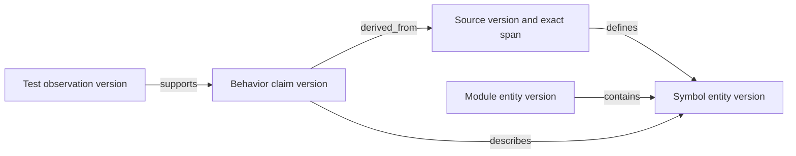
```mermaid
flowchart LR
    File["Source version and exact span"] -->|defines| Symbol["Symbol entity version"]
    Module["Module entity version"] -->|contains| Symbol
    Claim["Behavior claim version"] -->|describes| Symbol
    Test["Test observation version"] -->|supports| Claim
    Claim -->|derived_from| File
```

### Relationship catalogue

Proposed edge documents have their own stable ID, schema version, endpoints,
origin scope, provenance, creating operation and sensitivity. Endpoint references
name exact versions unless explicitly designated as an authority projection.
Edges require properties; they are not unlabelled adjacency or timeless facts.
Automatic cascade deletion must not erase required provenance. The adapter must
qualify endpoint deletion behavior and preserve referenced tombstones or reject
deletion until the retention owner authorizes it.

| Edge | Direction and endpoints | Cardinality and rule |
| --- | --- | --- |
| `defines` | Source version → entity version | Exact byte span and extraction provenance; no identity inference from name alone |
| `contains` | Module/package entity version → member entity version | Versioned containment; acyclic containment only, distinct from cyclic code dependencies |
| `describes` | Document/evidence/claim version → entity version | Many-to-many semantic subject link; preserves uncertainty and current access checks |
| `derived_from` | Derivative version → input version | Many-to-many; acyclic for versioned derivation; invalidation follows reverse edges |
| `supports` | Evidence/assessment version → claim version | Many-to-many; retain method, scope and limitations |
| `contradicts` | Evidence/assessment version → claim version | Many-to-many; coexists with support; do not collapse by last write |
| `supersedes` | New version → prior version of the same object | No self/cycle; version history can branch, while head selection is explicit |
| `depends_on` | Version or manifest → required version | Many-to-many; general dependency cycles are permitted but traversals are bounded |
| `produced_by` | Version → authority operation reference | Zero or one producer; user/import capture need not invent an execution |
| `selected_for` | Selection record → manifest and exact version | Ordered many-to-one links; the selection records ranges, transforms and omission reasons |
| `references` | Document version → version or typed authority reference | Many-to-many semantic citation; no access grant or automatic recursive inclusion |

Do not infer symmetric access from an edge. Cross-context edges retain origin
and destination scope and are hidden when either disclosure is unauthorized.
A cross-context reuse event is recorded in the destination manifest, not by
changing the source object's origin or moving its retained model session.

### Context selection records

Proposed data view. Each manifest preserves selection order and exact versions.
Authority references point to the canonical ledger; graph records cannot mutate
its task or model-operation state.

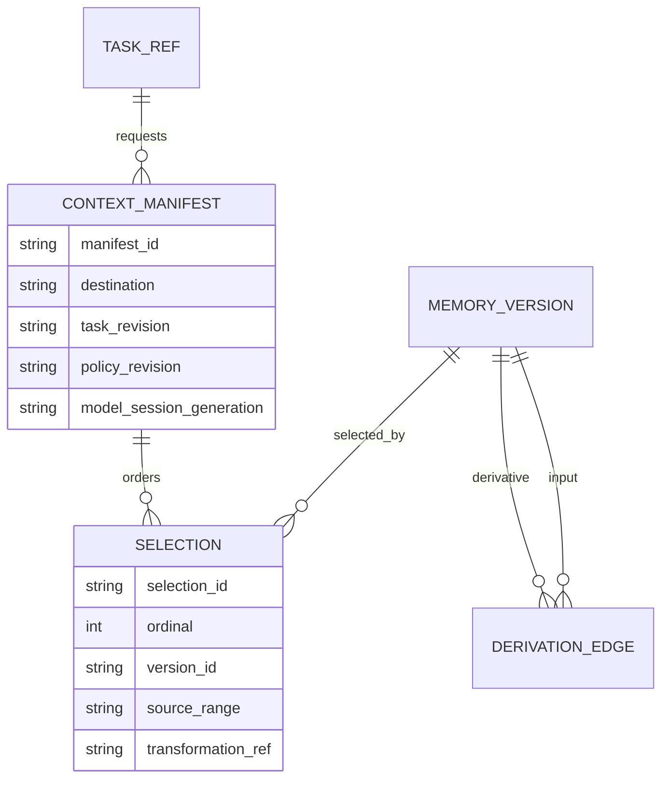
```mermaid
erDiagram
    TASK_REF ||--o{ CONTEXT_MANIFEST : requests
    CONTEXT_MANIFEST ||--o{ SELECTION : orders
    MEMORY_VERSION ||--o{ SELECTION : selected_by
    MEMORY_VERSION ||--o{ DERIVATION_EDGE : derivative
    MEMORY_VERSION ||--o{ DERIVATION_EDGE : input
    CONTEXT_MANIFEST {
        string manifest_id
        string destination
        string task_revision
        string policy_revision
        string model_session_generation
    }
    SELECTION {
        string selection_id
        int ordinal
        string version_id
        string source_range
        string transformation_ref
    }
```

## Plans, tasks and agent work

**Required behavior:** Asura must represent plans, tasks and work dependencies in
its graph. It must track agent work and permit partial progress reports linked
to tasks. Users must be able to inspect intended work, prerequisites, assignments,
reported progress and accepted outcomes. Ordinary file outputs retain the file/DB
split above. This requirement does not select physical tables or scheduling policy.

**Proposed mechanism:** The following records extend the common version envelope.
The Rust orchestrator owns plan validation, adoption, scheduling and assignment.
The existing Rust context subsystem stores plan content and report evidence.
The journal owns accepted adoption, task lifecycle, assignment and reservations.
The graph presents versioned projections of those accepted facts. No new service
or process is proposed. Swift helpers and control clients submit proposals or
reports through existing typed interfaces; neither can adopt or dispatch a plan.

### Plan and tracking records

| Record family | Proposed fields and meaning |
| --- | --- |
| `plan_version` | Stable `plan_id`, immutable version ID, prior version, author, goal, scope references, completion criteria, exact work-item versions and dependency versions, content digest |
| `work_item_version` | Stable item ID within its plan, exact version, description, acceptance criteria, authorized scope proposal, estimated resources, optional intended capability; no fabricated task ID |
| `work_dependency_version` | Exact dependent and prerequisite item versions, plan version, typed satisfaction predicate and failure disposition; immutable with the plan snapshot |
| `plan_adoption_projection` | Accepted plan version/digest, owning task reference, adoption revision, source journal position; a missing or stale projection cannot establish adoption |
| `task_link_projection` | Exact plan/item versions, canonical accepted task ID and revision, admission operation reference and source journal position; created only after task acceptance |
| `assignment_projection` | Accepted assignment ID/revision, task and item references, agent instance ID, host identity, scope and deadline references, journal position; assignment is not an execution attempt |
| `attempt_projection` | Canonical action and operation IDs, assignment reference, reservation reference, accepted outcome/reconciliation revision and journal position |
| `progress_report_version` | Report ID/version, canonical task ID, observed task revision, optional exact plan/item, assignment and operation references, author/agent identity, producer sequence, capture time, completed work, remaining work, blockers, evidence references and uncertainty |

Unchanged immutable item versions may be reused across plan versions. Each plan
snapshot pins its full membership and dependency set; changed items receive new
versions. Each dependency version belongs to exactly one plan snapshot.

A plan contains work items. This membership does not establish task ancestry,
permission inheritance or budget ownership. Accepted task ancestry and aggregate
reservations come from the canonical task contract. Estimates are advisory;
plan edges cannot allocate resources or increase a task's limits.

An item can exist before any task is accepted. It can have several historical task
links after explicit replanning or replacement. Each link names the accepted
revision and reason. D4 must choose item-to-task granularity before implementation;
no implicit one-to-one mapping or automatic retry follows from this proposal.

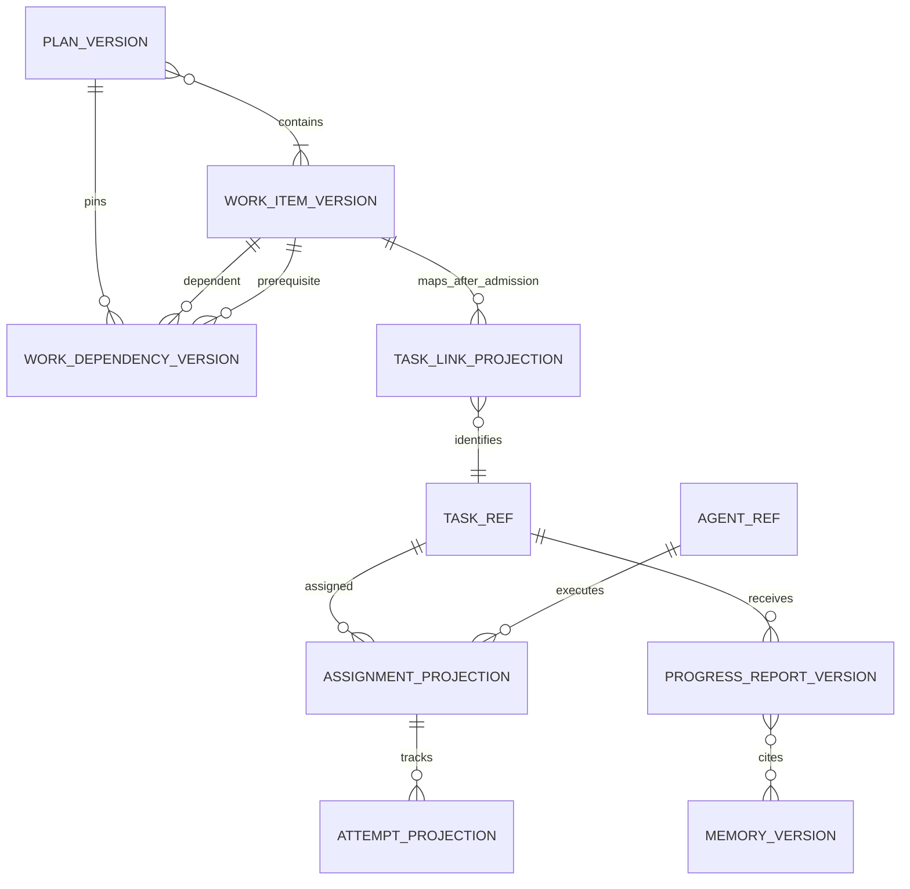
```mermaid
erDiagram
    PLAN_VERSION }o--|{ WORK_ITEM_VERSION : contains
    PLAN_VERSION ||--o{ WORK_DEPENDENCY_VERSION : pins
    WORK_ITEM_VERSION ||--o{ WORK_DEPENDENCY_VERSION : dependent
    WORK_ITEM_VERSION ||--o{ WORK_DEPENDENCY_VERSION : prerequisite
    WORK_ITEM_VERSION ||--o{ TASK_LINK_PROJECTION : maps_after_admission
    TASK_LINK_PROJECTION }o--|| TASK_REF : identifies
    TASK_REF ||--o{ ASSIGNMENT_PROJECTION : assigned
    AGENT_REF ||--o{ ASSIGNMENT_PROJECTION : executes
    ASSIGNMENT_PROJECTION ||--o{ ATTEMPT_PROJECTION : tracks
    TASK_REF ||--o{ PROGRESS_REPORT_VERSION : receives
    PROGRESS_REPORT_VERSION }o--o{ MEMORY_VERSION : cites
```

The graph supports queries for a plan's remaining work, critical prerequisites,
blocked items, agent assignments and cited progress. Answers include the adopted
plan revision and journal watermark. Missing projections return unknown status;
a graph query cannot substitute a reported outcome for an accepted outcome.

### Tracking relationships

These proposed typed edges retain exact version endpoints and the common provenance
envelope. Projection edges also carry their authority journal position.

| Edge | Direction and condition |
| --- | --- |
| `has_item` | Plan version → exact work-item version; versioned membership, no authority inheritance |
| `requires_work` | Dependent item version → prerequisite item version; scoped to one plan version with a satisfaction predicate |
| `maps_to_task` | Exact plan/item membership → canonical task reference; accepted task-link projection only |
| `assigned_to` | Assignment projection → agent instance reference; accepted task and assignment revisions required |
| `attempt_of` | Operation/attempt projection → assignment reference; preserves separate action, operation and reservation IDs |
| `reports_on` | Progress report version → canonical task reference; required even when no plan or assignment exists |
| `reports_for` | Progress report version → optional exact plan/item, assignment or operation; validate task ownership |
| `cites` | Report version → exact evidence version; per-use visibility and provenance apply |

### Work dependencies and readiness

Propose `requires_work` as a separate execution prerequisite relationship. Each
edge belongs to one immutable plan version and connects its exact item versions.
The execution prerequisite subgraph must be a DAG. The existing general
`depends_on` relationship retains its permitted cycles. Containment and causal
edge rules also remain distinct. Plan validation rejects missing endpoints,
self-prerequisites, duplicate conflicting predicates and prerequisite cycles.
Cross-plan prerequisites require an explicit reviewed contract; this proposal
rejects them rather than creating an unbounded scheduling graph.

Each prerequisite specifies a satisfaction predicate, such as accepted successful
completion plus a required evidence version. A textual claim, percentage, missing
edge or agent report alone cannot satisfy it. Failure disposition must be explicit:
block for a decision, or request an authorized replan. This proposal does not
silently skip failed prerequisites. Alternative/optional work needs a reviewed
predicate in a new version; it cannot bypass a live edge by editing a label.

Readiness is a computed candidate, never a durable permission. At admission the
orchestrator must verify all of the following against current authority:

1. The adopted plan version/digest and expected task revision still match.
2. Every prerequisite predicate has current, available and authorized evidence.
3. The task is eligible, nonterminal and not cancelling or reconciling effects.
4. The assignment and execution scope remain valid for the destination context.
5. Policy, deadline, capabilities and parent aggregate budget permit admission.

The orchestrator serializes this check with the accepted admission transition.
D3 must qualify how evidence revisions and invalidation participate in that guard.
Unknown, stale, revoked or unavailable inputs block admission. Later revocation
uses the canonical cancellation/invalidation path for already admitted work.
Cross-context links retain origin provenance and confer no permissions.

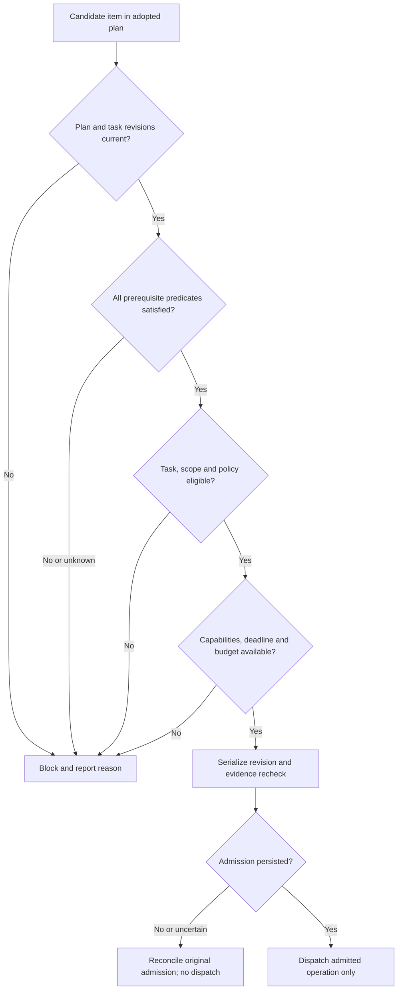
```mermaid
flowchart TD
    Candidate["Candidate item in adopted plan"] --> Revision{"Plan and task revisions current?"}
    Revision -->|No| Block["Block and report reason"]
    Revision -->|Yes| Prerequisite{"All prerequisite predicates satisfied?"}
    Prerequisite -->|No or unknown| Block
    Prerequisite -->|Yes| Authority{"Task, scope and policy eligible?"}
    Authority -->|No| Block
    Authority -->|Yes| Budget{"Capabilities, deadline and budget available?"}
    Budget -->|No| Block
    Budget -->|Yes| Guard["Serialize revision and evidence recheck"]
    Guard --> Result{"Admission persisted?"}
    Result -->|No or uncertain| Hold["Reconcile original admission; no dispatch"]
    Result -->|Yes| Dispatch["Dispatch admitted operation only"]
```

### Adoption, replanning and recovery

The graph stores an immutable proposed plan version and publication receipt.
The orchestrator adopts its exact digest through the journal after validation.
Graph publication and journal adoption follow the existing cross-store protocol.
A published proposal without adoption has no scheduling effect. Unknown adoption
is reconciled by its original identity before another activation or dispatch.

Replanning creates a new version with explicit changes and prior-version links.
Adoption uses expected plan and task revisions. Existing assignments remain tied
to their admitted revisions. The orchestrator must explicitly keep, cancel or
replace affected work through canonical controls; a graph edit cannot retarget it.
Evidence corrections can block future admission. They cannot silently unblock
work accepted against another plan or resurrect a terminal task.

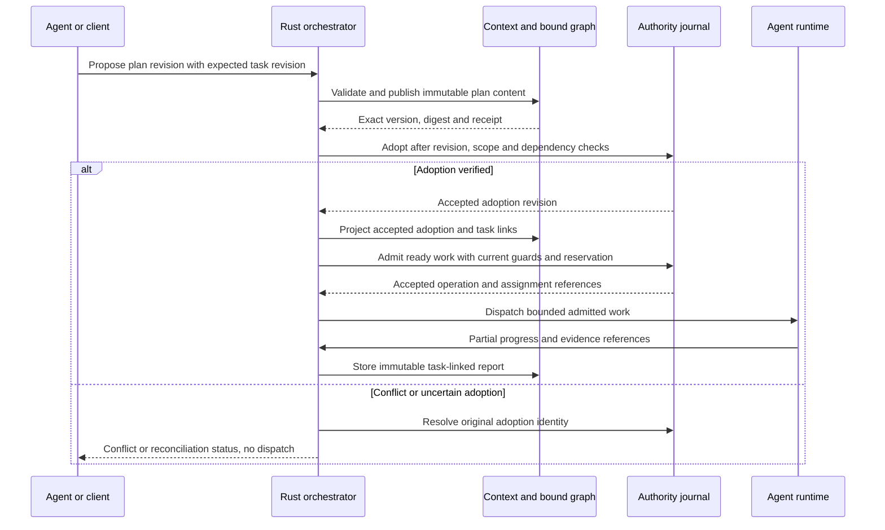
```mermaid
sequenceDiagram
    participant A as Agent or client
    participant O as Rust orchestrator
    participant G as Context and bound graph
    participant J as Authority journal
    participant R as Agent runtime
    A->>O: Propose plan revision with expected task revision
    O->>G: Validate and publish immutable plan content
    G-->>O: Exact version, digest and receipt
    O->>J: Adopt after revision, scope and dependency checks
    alt Adoption verified
        J-->>O: Accepted adoption revision
        O->>G: Project accepted adoption and task links
        O->>J: Admit ready work with current guards and reservation
        J-->>O: Accepted operation and assignment references
        O->>R: Dispatch bounded admitted work
        R->>O: Partial progress and evidence references
        O->>G: Store immutable task-linked report
    else Conflict or uncertain adoption
        O->>J: Resolve original adoption identity
        O-->>A: Conflict or reconciliation status, no dispatch
    end
```

The agent instance identifies the assigned runtime participant. An assignment
can cover several operations; every actual attempt has its own admitted operation
and reservation. Transport retransmission preserves the original operation ID.
A retry that may execute again requires new admission under the budget contract.

Cancellation is persisted by the orchestrator before dispatch can continue.
Cancellation requests for dependent work use each task's current revision and
scope; plan membership alone cannot cancel unrelated tasks. Restart replays
adoption, cancellation, assignments and unresolved operations from the journal.
Unknown effects or usage retain their reservations until canonical settlement.
Stale reports, graph projections and disconnected agents cannot restart work.

### Partial progress reports

Reports are immutable evidence snapshots. They may arrive while work is running,
blocked or reconciling. An authorized late report may document a terminal task,
but it cannot change its lifecycle. Optional assignment/operation references must
belong to the named task; reporters cannot claim another agent's identity.

The service records receipt ordering separately from producer sequence and capture
time. Duplicate `(report_id, version_id)` submissions with identical content are
idempotent; conflicting content is rejected. Out-of-order reports remain inspectable with their observed
revisions. A correction adds a superseding version and preserves the earlier
report. There is no last-arrival-wins task state or universal percentage-complete
field. Report text and cited source instructions remain lower-trust content.

For example, a report may say: “Parser change is written. Integration checks are
pending. Fixture access is blocked.” It names the task, source/evidence versions,
remaining checks and uncertainty. A later report can cite completed checks.
Only the orchestrator's accepted result can mark the task successful.

Reports and evidence use current per-use visibility checks, including their task,
plan and agent references. If a viewer cannot access a prerequisite or report,
return a permitted omission/unknown status without leaking private labels.
Reports, adopted plan versions and unresolved attempts become retention roots
under the existing audit/recovery policy. Removing a plan view cannot delete
required execution evidence or settle an outstanding operation.

## Typed built-in tools

**Required behavior:** Asura must expose its built-in database through built-in
tools specific to the data being entered. These tools must provide typed input
and result contracts for memory, planning and work tracking. They use the bound
storage contract in both embedded and external modes.

The [canonical tool registry](interaction-and-extension-boundaries.md#ownership-and-language-boundaries)
owns tool definitions, schema versions and discovery. Each handler calls the
existing semantic owner. The context subsystem owns memory content and provenance;
the orchestrator owns planning semantics, task controls and assignments. Storage
adapters implement persistence. Tools do not create another owner or database.

### Tool families and data contracts

Proposed tool names below describe semantic operations, not physical tables.
Final names and complete schemas remain HM-D9 work. Each listed operation must
have a distinct closed schema; there is no unrestricted record/property input.

| Family and example operations | Typed inputs and owning behavior |
| --- | --- |
| Source: `source.capture` | Validated source handle and requested range; host services capture bytes and context records exact provenance |
| Documents: `document.create`, `document.revise` | Document subtype, typed sections or retained-payload handle; revision requires the expected prior version |
| Evidence: `observation.record`, `claim.propose`, `assessment.record` | Kind-specific fields, exact subjects/evidence, method and uncertainty; a report cannot invent host execution proof |
| Relationships: `relationship.link` | Allowed relationship kind, typed endpoints and kind-specific properties; owner checks scope, direction and cycle rules |
| Plans: `plan.propose`, `plan.revise`, `plan.adopt` | Goal, exact work-item/dependency definitions and expected revisions; orchestrator validates and journals adoption |
| Tasks: `task.request`, `task.assign`, `task.control` | Explicit targets, expected revisions and operation-specific scope; orchestrator uses existing admission, budget and lifecycle contracts |
| Progress: `progress.report`, `progress.correct` | Canonical task, report/version identity, completed/remaining work, blockers and evidence; correction names its superseded version |
| Retrieval: `memory.get`, `memory.search`, `plan.inspect`, `task.inspect`, `progress.list` | Typed IDs or approved filters, result budget and scoped cursor; owner returns authorized versions and freshness limits |
| Retention: `memory.delete` | Exact target and expected revision; canonical owner applies holds, reference checks and deletion policy |

`relationship.link` cannot write execution prerequisites or task/control projection
edges. Prerequisites enter through a complete plan revision and its validation.
Task links, assignments and attempt projections come from accepted journal events.
Tools cannot patch those rows directly. Derived summaries and context manifests
likewise come from their canonical transformation or selection owner.

### Requests, results and failure handling

Each request carries a tool/schema version, request identity, explicit context and
typed payload. Writes also carry applicable expected record, plan and task revisions.
The service derives principal, agent identity, active graph binding and execution
authority from the authenticated invocation. Caller-supplied labels cannot replace
them. Agents request tools through the existing admitted action path.

Before persistence, the handler validates field types, reference kinds, provenance,
current visibility and selected size limits. File inputs use validated handles;
an arbitrary path or URL does not authorize reading or downloading content.
The graph adapter uses fixed parameterized operations. Tool inputs never contain
arbitrary SurrealQL, table names, credentials or expressions for database execution.

Results distinguish an accepted request, published data, a rejected request and an
uncertain outcome. Published writes return exact record/version IDs and a receipt.
Control results return canonical task/operation IDs and accepted revisions; task
acceptance does not mean completion. Reads include version/projection position,
authorized omissions and pagination when applicable. Unknown freshness is explicit.

Validation failure has no write effect. Revision conflicts require a fresh read
and deliberate revised request. Repeating an identical request identity resolves
the original result; reusing it with different content rejects. After a timeout
or lost acknowledgement, resolve that identity before any new mutation. Cancellation
does not erase an already committed write. Cross-store uncertainty follows the
existing publication and reconciliation contract.

Tool discovery exposes only operations eligible for the caller's scope. Discovery
is not an execution grant; every invocation rechecks authority. Database outages
return unavailable or reconciliation status, with no graph fallback. Local task
status and cancellation retain the journal-backed control path. Error details and
search results must not reveal inaccessible records or graph credentials.

### Typed tool execution path

Proposed ownership and outcome view. Arrows show a request routed through existing
owners; the store can be the graph or journal according to the operation.
The authority guard includes applicable admission, budget and deadline checks.
Semantic owners recheck revision guards at the mutation boundary.

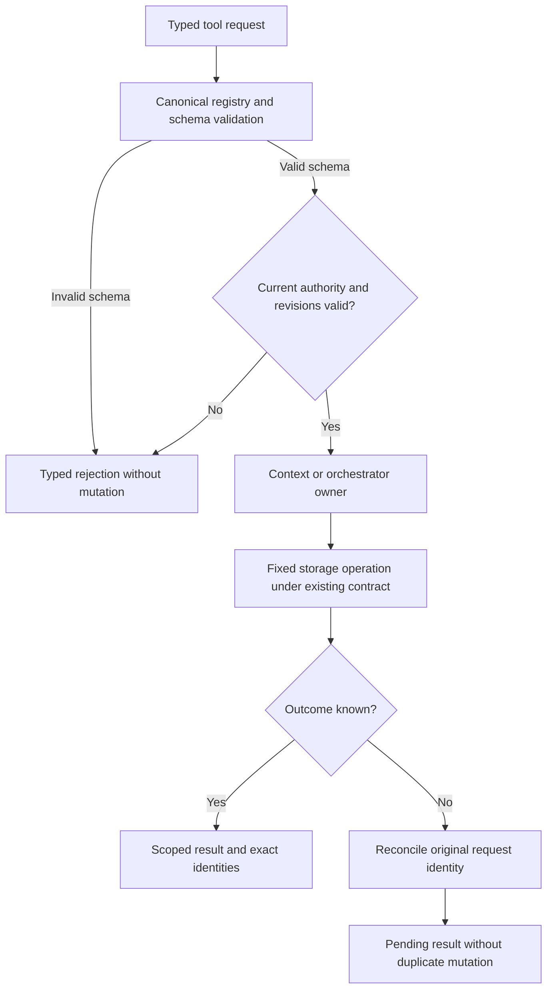
```mermaid
flowchart TD
    Request["Typed tool request"] --> Registry["Canonical registry and schema validation"]
    Registry -->|Invalid schema| Reject["Typed rejection without mutation"]
    Registry -->|Valid schema| Guard{"Current authority and revisions valid?"}
    Guard -->|No| Reject
    Guard -->|Yes| Owner["Context or orchestrator owner"]
    Owner --> Store["Fixed storage operation under existing contract"]
    Store --> Result{"Outcome known?"}
    Result -->|Yes| Receipt["Scoped result and exact identities"]
    Result -->|No| Resolve["Reconcile original request identity"]
    Resolve --> Pending["Pending result without duplicate mutation"]
```

## Source files and session artifacts

A file reference contains host and working-location IDs, a validated relative
locator, source-object evidence and content digest. Absolute paths are display
or diagnostic data, never portable authority. D1 owns descriptor-based access
and alias/replacement defenses. Capture verifies byte length and identity before
and after reading; detected concurrent changes produce unstable evidence, not a
claim of an atomic filesystem snapshot.

Ranges use byte offsets into the named digest and record text encoding. Rendered
line numbers are a presentation aid. A later version at the same path cannot
satisfy an old range. Deleted or replaced sources remain historical references
only when retained bytes and current access permit their use. Missing retained
bytes return unavailable; the service never reconstructs them from a hash.

Propose `sessions/<artifact-set-id>/objects/<payload-id>` for retained payloads.
An artifact set is a storage grouping tied to explicit installation/project and
optional conversation/task references. It is not a new conversation or model
session. Its identifier is generated by the service; user filenames cannot become
unchecked path components. Store original filenames only as untrusted metadata.

A session manifest or transcript export is a labelled projection of named graph
and conversation revisions. It contains a format version, scope, source revisions,
payload IDs/digests and export status. Editing that file does not edit canonical
conversation history. If editable notes are later supported, the resolver/capture
owner ingests them as new document versions with provenance and explicit authority.

Do not persist opaque Foundation Models runtime state as if it were a replayable
session. A resumed task rebuilds eligible model input through the existing session
contract. Retained history, summaries and prompt caches remain part of effective
context and must be invalidated when their sources lose eligibility.

## Atomicity, publication and recovery

Proposed ingestion protocol. The orchestrator admits one memory operation under
current policy and resource limits. The context subsystem defines its record
changes. The journal records operation identity, scope, payload digests and phase;
it does not become a second evidence body store. New journal record kinds require
review in the authority design before implementation.

1. Revalidate source, destination and binding; record a durable prepared operation.
2. For file-backed content, stage bytes under `tmp/` using exclusive, validated
   paths. Verify length/digest, then durably install an immutable retained object.
3. In one database transaction, create the version, required edges and an operation
   receipt. Conditional head updates check expected revisions in that transaction.
4. Reconcile the database receipt against the original operation identity and
   digest. Record the committed result and publication obligation in the journal.
5. Publish only after required payloads, records, binding and current authority are
   verified. An unfinalized graph record is not eligible for retrieval or model use.

Inline document ingestion skips the file step; it keeps the same operation and
publication contract. File installation, database commit and journal commit do
not form one atomic transaction. Database transactions cannot protect a mutable
source path or commit a local file with an external server.

### Ingestion across stores

Proposed sequence. Arrows show durable checkpoints and reconciliation. The
receipt resolves unknown database commits; it is not a second control authority.

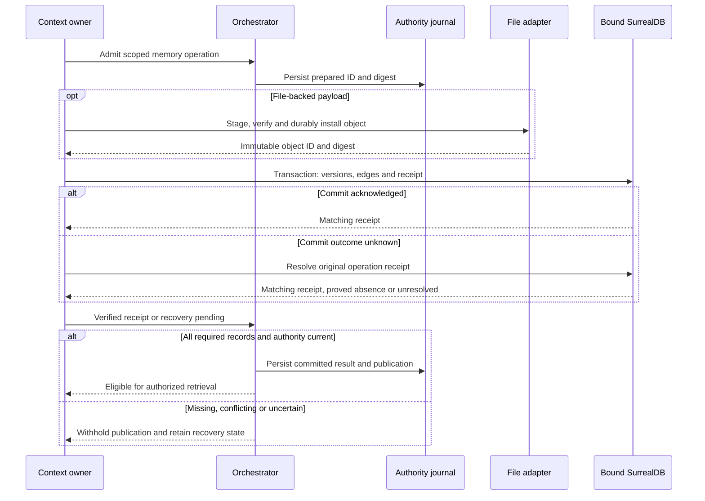
```mermaid
sequenceDiagram
    participant C as Context owner
    participant O as Orchestrator
    participant J as Authority journal
    participant F as File adapter
    participant D as Bound SurrealDB
    C->>O: Admit scoped memory operation
    O->>J: Persist prepared ID and digest
    opt File-backed payload
        C->>F: Stage, verify and durably install object
        F-->>C: Immutable object ID and digest
    end
    C->>D: Transaction: versions, edges and receipt
    alt Commit acknowledged
        D-->>C: Matching receipt
    else Commit outcome unknown
        C->>D: Resolve original operation receipt
        D-->>C: Matching receipt, proved absence or unresolved
    end
    C->>O: Verified receipt or recovery pending
    alt All required records and authority current
        O->>J: Persist committed result and publication
        O-->>C: Eligible for authorized retrieval
    else Missing, conflicting or uncertain
        O-->>C: Withhold publication and retain recovery state
    end
```

A matching receipt requires matching operation kind, payload digest, graph binding
and referenced records. A timeout proves neither commit nor absence. If the
receipt is absent but the transaction may still be in flight, keep it unresolved.
Retry only after the adapter establishes a safe idempotent path for that operation.
Current authorization and binding must still permit the retry.

| Failure point | Required recovery |
| --- | --- |
| Prepared journal frame, no installed payload | Retain operation; resume authorized capture or record failure, never publish missing content |
| Retained file exists, no known database receipt | Protect file from GC; reconcile original receipt before retry or cleanup |
| Database committed, journal finalization failed | Graph record stays ineligible; recover matching receipt and finalize original result |
| Acknowledgement lost after journal commit | Return original result by ID after disclosure checks; no duplicate version/effect |
| Digest mismatch, missing payload or graph identity conflict | Quarantine affected data and block dependent use; preserve evidence for repair |
| Journal unavailable, external graph still answers | Do not publish new operations or reconstruct control authority from graph rows |
| External graph unavailable | Preserve local control/status; memory retrieval is unavailable, with no embedded fallback |

Propose one Rust context mutation coordinator per installation. It serializes
head selection and dependency-set changes. Database constraints and revision
checks remain necessary against retries, restart and external tampering. Queries
that depend on a set of edges need an explicit shared revision record; snapshot
isolation alone does not enforce an arbitrary graph-wide invariant. D3/D4 must
qualify this mechanism for cycle checks, unique receipts and concurrent GC.

## Retrieval, visibility and invalidation

Use typed requests such as capture source, append document version, assess claim,
select context and inspect provenance. Each includes principal, origin/destination
scope, task revision where applicable, binding generation and bounded limits.
Models may suggest identifiers; the context owner resolves and authorizes them.
No model-generated query text reaches a database executor.

Begin with lexical and structural candidate retrieval. Propose indexes for origin
scope/kind, object/version identity, receipt identity, source locator/digest and
edge endpoints. An ordered selection uses deterministic tie-breaking by stable
version ID. Vector indexes and embeddings remain a later evaluated option;
they are derived sensitive data, not required for this ontology.

Every retrieval checks current origin visibility, current group membership,
principal permission, destination purpose, source eligibility and egress rules.
Closed blocks cross-context use; group requires current shared membership; open
remains installation-local. Inherited sensitivity follows every derivation.
A summary cannot reduce classification simply by omitting the original wording.
Current policy is outside the graph; a stored visibility label cannot grant access.

### Selection and invalidation gate

Required gate with proposed retrieval mechanics. Arrows show candidate filtering
and provenance closure. Failure withholds content rather than widening scope.

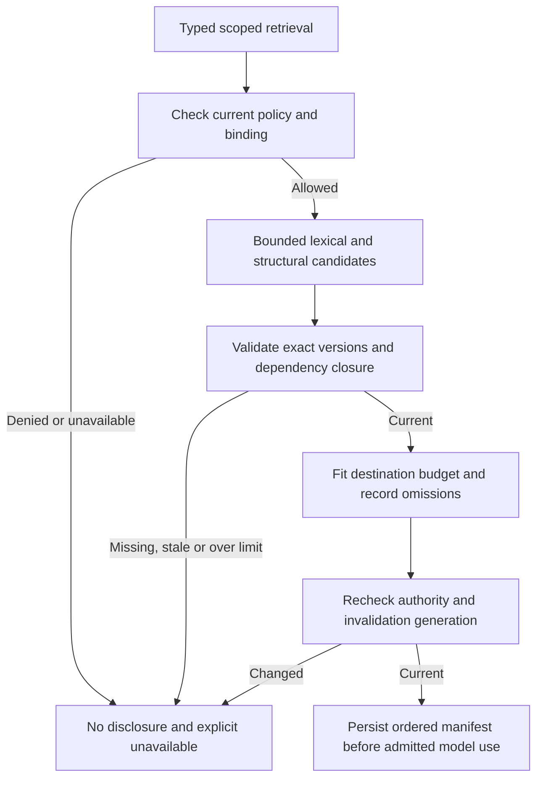
```mermaid
flowchart TD
    Request["Typed scoped retrieval"] --> Policy["Check current policy and binding"]
    Policy -->|Denied or unavailable| Reject["No disclosure and explicit unavailable"]
    Policy -->|Allowed| Find["Bounded lexical and structural candidates"]
    Find --> Closure["Validate exact versions and dependency closure"]
    Closure -->|Missing, stale or over limit| Reject
    Closure -->|Current| Fit["Fit destination budget and record omissions"]
    Fit --> Final["Recheck authority and invalidation generation"]
    Final -->|Changed| Reject
    Final -->|Current| Manifest["Persist ordered manifest before admitted model use"]
```

Revocation, deletion, group changes or source replacement immediately make
affected use ineligible at the canonical gate. Background reverse-edge walks
mark derivative views/indexes stale, but a delayed walk cannot leave a permission
window. Selection and model admission recheck source authority and invalidation
generation. If complete provenance cannot be enumerated within bounds, reject
use and rebuild a smaller view. The model-session owner retires affected retained
state and rejects late results under its existing contract.

## Retention, garbage collection and deletion

Immutable means that a version is not edited in place. It does not mean perpetual
retention. The context owner proposes retention; the orchestrator/policy owners
resolve deletion authority and holds. Active task manifests, unsettled operations,
recovery records, retained exports and required audit references are roots for GC.
A source file outside managed memory is never deleted by memory GC.

Propose a journalled deletion operation that first tombstones eligibility and
advances invalidation state. Deletion records must retain only the minimum allowed
identity/proof; raw content cannot remain in a tombstone by accident. The operation
then resolves model-session retirement, reference holds and derived copies before
removing payloads and database bodies. A pending hold is visible, not a false
claim of completed erasure.

### Ingestion and publication lifetime

Proposed state view. Arrows name capture, persistence evidence and current
authority checks. `Published` and `Ineligible` continue in the deletion view.
The prepared-to-published guard requires both the graph receipt and journal result.
Reconciliation must prove the original operation and revalidate its authority.

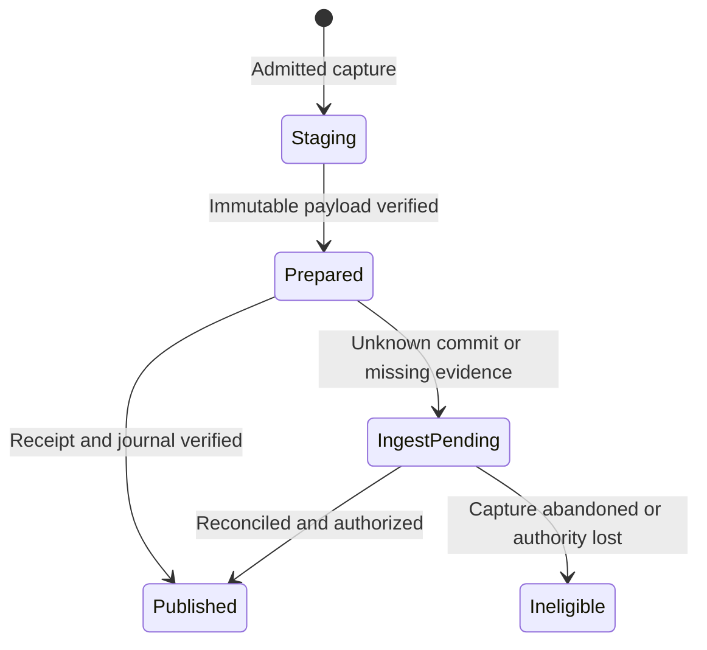
```mermaid
stateDiagram-v2
    [*] --> Staging: Admitted capture
    Staging --> Prepared: Immutable payload verified
    Prepared --> Published: Receipt and journal verified
    Prepared --> IngestPending: Unknown commit or missing evidence
    IngestPending --> Published: Reconciled and authorized
    IngestPending --> Ineligible: Capture abandoned or authority lost
```

### Eligibility, holds and deletion lifetime

Proposed continuation of the ingestion view. Arrows name eligibility changes,
reference holds and verified removal. GC and new references share one owner gate.
The `H2` guard requires settled references and a fresh authorization check.
Purging requires authorized deletion with no retained reference. A removal is
complete only when every required store proves it; an unknown outcome cannot
return to publication.

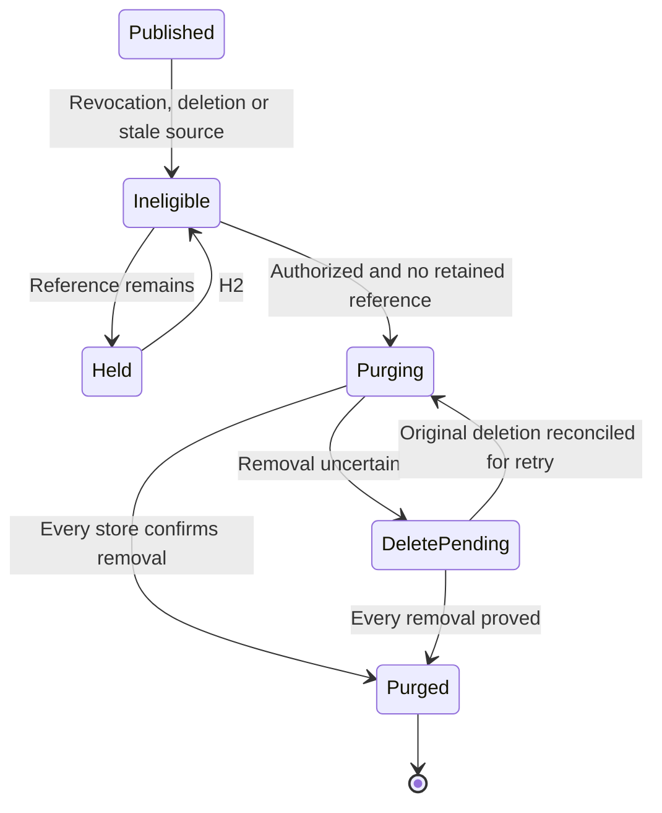
```mermaid
stateDiagram-v2
    Published --> Ineligible: Revocation, deletion or stale source
    Ineligible --> Held: Reference remains
    Held --> Ineligible: H2
    Ineligible --> Purging: Authorized and no retained reference
    Purging --> Purged: Every store confirms removal
    Purging --> DeletePending: Removal uncertain
    DeletePending --> Purging: Original deletion reconciled for retry
    DeletePending --> Purged: Every removal proved
    Purged --> [*]
```

IngestPending and DeletePending retain distinct operation kinds. An uncertain
deletion cannot republish a tombstoned version. An uncertain ingestion can publish
only after current authority is revalidated. D3 must encode these allowed
transitions so the two recovery paths cannot mix.

A GC candidate is selected from verified references, then rechecked under the
mutation coordinator immediately before deletion. New references cannot race a
purge without checking the object's state and revision. Staging files use explicit
operation ownership; age alone never proves an operation abandoned. Orphans are
quarantined until no prepared operation or required export can reference them.
Disk limits produce bounded admission failure; they do not permit deletion of
protected evidence. `tmp/` must not become an untracked durable payload store.

Backups, logs, indexes, exports, summaries and external replicas may retain data.
The retention contract must identify them and state deletion limits. Never claim
immediate erasure from an offline backup or third-party server without evidence.
The first implementation must select retention periods, quota limits, encryption
requirements and deletion-versus-audit policy before exposing deletion commands.

## Export, backup and migration

An explicit export records format versions, installation/graph IDs, binding
generation, authority position, included versions, edge closure and payload digests.
It records omissions and unavailable bodies. A portable document export is a
readable projection, not a runnable authority restore. Import validates it as
untrusted evidence, preserves origin provenance and creates authorized destination
identities; it never installs imported permissions or task outcomes. The new
record belongs to the importing installation and its authorized capture context.
The export's original installation/context IDs remain quoted provenance, not local
policy references or permission claims. Import cannot impersonate a current
source-context link or inherit an exported grant.

A recovery backup is different. It must include the authority journal, graph
snapshot and every required retained payload at a coordinated boundary. Pause or
fence relevant mutation/GC, record pending operations and verify reference closure.
An arbitrary copy of `db/` while the engine runs is not a qualified backup. An
external-mode backup must include the external graph plus local session artifacts;
copying the home directory is incomplete.

Migration records one authorized operation, source/target schema and binding
identities, checkpoint, compatibility rules and rollback limits. Preserve immutable
version IDs when semantics are unchanged. A semantic transformation creates new
versions with derivation links. Do not update both old and new formats as writable
authorities. Unknown versions block affected reads/writes until a reviewed migration
or compatible reader exists. Restore rechecks current policy; an old backup cannot
restore revoked access by itself.

## External database semantics

External mode uses the same ontology and binding checks. Database availability
cannot redirect it to `db/`. Store payload references as logical object IDs and
origin-host IDs, not external-server-readable local paths. A remote server cannot
fetch a local session file merely because its metadata points to it.

Persisting document text, source excerpts, hashes, paths or graph relationships
in an external database is data egress. Admission must authorize each data class,
destination and retention assumption before transmission. Propose local retention
for file-backed payloads; explicit payload transfer requires a separate authorized
artifact transport. This design does not introduce automatic upload or replication.

Database credentials stay in the selected credential facility. Graph records and
`config.yaml` carry allowed references only. Clients and the model helper receive
no database credentials. The storage adapter validates query results and rejects
cross-installation records, wrong kinds, oversized values and mismatched binding.
External administrators remain a separate trust case; TLS and row permissions
alone do not prove protection against a compromised database owner.

## SurrealDB documentation evidence

Primary documentation checked on 2026-09-26. These are documented capabilities,
not a selected version or runtime qualification. No SurrealDB instance was started.

| Documented capability | Design consequence and proof limit |
| --- | --- |
| [Nested objects and arrays](https://surrealdb.com/docs/learn/data-models/document/nested-objects-and-arrays) support structured document records | Store typed document bodies beside graph references; payload placement remains an Asura contract |
| [Record links](https://surrealdb.com/docs/reference/query-language/language-primitives/record-links) use typed record IDs | Keep logical IDs independent of paths; authorize traversals rather than exposing automatic reference expansion |
| [Table definitions](https://surrealdb.com/docs/reference/query-language/statements/define/table) support schema and relation constraints | Propose schemafull tables and property-bearing relation records; qualify endpoint checks and deletion behavior in both modes |
| [Field definitions](https://surrealdb.com/docs/reference/query-language/statements/define/field) support nested types and assertions | Define all envelope/body fields; do not use unrestricted flexible objects for provenance or authority fields |
| [Transactions](https://surrealdb.com/docs/learn/querying/concepts-and-guides/transactions) describe snapshot isolation and commit-time conflicts | Do not assume serializable graph predicates; qualify shared revision guards and whole-transaction retries |

Current table documentation distinguishes pre-3.0 unknown-field handling from
3.0 rejection. The transaction documentation marks named-record `FOR UPDATE`
behavior as available since 3.3.0. This proposal does not depend on that feature
or pick 3.3.0. Pin compatible Rust SDK, server and embedded engine versions before
writing schemas, and verify rejection behavior rather than relying on defaults.
Database transaction claims do not cover file publication or journal durability.

## Threats and required limits

| Threat | Required result |
| --- | --- |
| Model or document content embeds instructions or query fragments | Store as untrusted content; no policy change, query execution or governing-instruction promotion |
| Hash match links private projects | No cross-scope deduplication/existence disclosure without current authorization |
| Path traversal, symlink swap or reused payload filename | Reject unsafe access; verify object identity and digest; preserve prior evidence |
| Stale graph policy projection or delayed invalidation | Canonical per-use checks deny access before content leaves the boundary |
| External server injects records or lies about completeness | Validate scope/schema/digests; refuse unverifiable closure; no fabricated complete manifest |
| Malformed or cyclic graph causes unbounded work | Bound depth, visited nodes, edges, bytes and duration; distinguish truncation from absence |
| GC races capture, export or model admission | Serialize eligibility/reference changes; retain unresolved roots; reject stale head/revision |
| Diagnostic or export path leaks payload | Redact logs and authorize export independently; logs are not a fallback memory store |

D4/D7 must choose numeric limits for document size, nesting, file bytes, concurrent
capture, query depth, fan-out, returned records, retained disk, retry count and
operation deadlines. A limit breach returns typed unavailable/partial evidence
with an omission reason. It cannot report complete retrieval or bypass policy.
The selected same-UID trust limit remains; this design does not claim resistance
to a malicious process that can rewrite all of the user's files.

## Acceptance cases

Each case requires unit, real integration and end-to-end evidence. Run database
cases in embedded mode and against the selected external server. Use supported
macOS filesystems, isolated test identities and fixture payloads. The real control
surface must expose outcome, provenance and uncertainty. Real model cases must
also inspect admitted manifests/session generations; generated text alone is not
proof. No case has been executed for this design.

### HM1: immutable capture and document versions

**Initial state:** A registered source and one document have valid capture authority.
**Trigger:** Capture bytes, update the document, then repeat the same operation ID.
**Required result:** Stable exact versions, explicit new head, original replay
result and no duplicate body. A reused ID with changed bytes rejects.
**Unit:** Envelope, digest, typed-body, ID and conditional-head rules.
**Integration:** Real files/DB, concurrent updates and unique-receipt constraints.
**End-to-end:** Inspect prior/current versions and their exact provenance through
one real client; verify source files remain unchanged.

### HM2: source replacement and corrupted payload

**Initial state:** Capture or retrieval holds a source/payload reference.
**Trigger:** HM2-A replaces the source during capture; HM2-B modifies retained bytes;
HM2-C requests an old range after path reuse.
**Required result:** Unstable or corrupt content is unavailable; old identities
never resolve to new occupants. No hash-only reconstruction.
**Unit:** Identity, byte range, digest and absence rules.
**Integration:** Real alias/replacement barriers and payload corruption.
**End-to-end:** Client reports the affected evidence and repair limit without
publishing incorrect current content.

### HM3: cross-store interruption

**Initial state:** One prepared ingestion spans journal, payload and graph.
**Trigger:** Independently crash before/after file installation, DB receipt and
journal finalization; lose acknowledgements at each committed boundary.
**Required result:** Resolve the original operation, withhold incomplete data,
retain protected orphans and publish at most one version.
**Unit:** Operation-kind/phase transitions and replay decisions.
**Integration:** Real durability boundaries and external unknown-commit faults.
**End-to-end:** Restart and inspect committed, pending or repair outcomes through
the client; never report uncertainty as a successful capture.

### HM4: visibility and retained model input

**Initial state:** Linked evidence and a summary feed a destination task manifest.
**Trigger:** HM4-A closes the source project; HM4-B removes group membership;
HM4-C deletes the source while model work is active.
**Required result:** Immediate ineligibility at selection/admission; retire affected
retained state and reject late results. The original source scope remains recorded.
**Unit:** Visibility, sensitivity propagation and invalidation-generation checks.
**Integration:** Delay reverse-index updates and model callbacks behind controlled
barriers while changing real policy/graph state.
**End-to-end:** Use a real model with distinguishable private fixtures and inspect
its input manifest and generation. No stale evidence may drive an accepted action.

### HM5: claims, contradictions and provenance cycles

**Initial state:** A claim has supporting evidence and one assessment.
**Trigger:** Add contradictory evidence, competing assessments and a derivation
cycle. Resolve identically named symbols from different files/worktrees and change
one definition before retrieving its dependent behavior claim.
**Required result:** Preserve competing claims and limits; reject prohibited
causality cycles without banning permitted dependency cycles. Distinct source
identities cannot collapse by name; changed definitions invalidate derived claims.
**Unit:** Edge kinds, endpoints, cycle rules and head conflict resolution.
**Integration:** Concurrent real DB transactions and bounded graph traversal.
**End-to-end:** Client displays the disagreement and exact evidence versions;
model confidence cannot become a verified control outcome.

### HM6: deletion and GC races

**Initial state:** Files and graph bodies have active manifest/export/recovery references.
**Trigger:** HM6-A races GC with new reference creation; HM6-B requests deletion
under an active hold; HM6-C crashes during purge; HM6-D exhausts disk quota.
**Required result:** No protected payload is removed; deletion status is truthful;
uncertain deletion cannot republish data. Full disk does not erase recovery roots.
**Unit:** Reference-state/revision and operation-kind transition rules.
**Integration:** Real file/DB deletion, quota faults and concurrent transactions.
**End-to-end:** Inspect held, pending and completed deletion states after restart;
verify source workspace files are never GC targets.

### HM7: external mode, export and restore

**Initial state:** An external graph references retained local artifacts.
**Trigger:** HM7-A loses server access; HM7-B recreates the database name;
HM7-C restores an incomplete backup; HM7-D imports a hostile portable export.
**Required result:** No embedded fallback, binding substitution or imported grant.
Missing payloads remain unavailable; a portable export cannot replace authority.
**Unit:** Binding, backup membership, import schema and path validation.
**Integration:** Real external server, local artifacts, partition and restore tests.
**End-to-end:** Export/restore through authorized clients and inspect preserved
identity, omissions, current permissions and recovery diagnostics.

### HM8: bounded retrieval and schema compatibility

**Initial state:** Large, cyclic and deeply nested fixture documents/graphs exist.
**Trigger:** Exceed each selected limit; return unknown schema fields/kinds from the
server; interrupt a supported migration and replay an older authority projection.
**Required result:** Bounded explicit failures; no silent field loss or mixed schema;
no stale projection can authorize work. Resume the original migration or block.
**Unit:** Limit edges, schema rejection and projection revision rules.
**Integration:** Both real database modes, interrupted migration and actual query bounds.
**End-to-end:** Keep control responsive while retrieval fails; inspect omissions
and version errors without disclosing private content.

### HM9: plan adoption and prerequisite admission

**Initial state:** A proposed plan contains two items and a versioned prerequisite.
**Trigger:** HM9-A introduces a prerequisite cycle; HM9-B races two adoptions;
HM9-C changes prerequisite evidence or task revision before admission;
HM9-D loses the graph during adoption reconciliation.
**Required result:** Reject only prohibited edge cycles; one adoption wins;
no stale, unknown or unadopted graph state dispatches work. Plan membership does
not change task ancestry or aggregate budget. General dependency cycles remain valid.
**Unit:** Endpoint, DAG, predicate, revision and readiness rules.
**Integration:** Real graph/journal publication faults, concurrent adoption and
admission/invalidation races in both database modes.
**End-to-end:** Inspect plan, blockers and accepted revision through a real client;
observe agent execution only after canonical admission.

### HM10: replanning, assignment and cancellation recovery

**Initial state:** An adopted plan has an active assignment and an unsettled operation.
**Trigger:** HM10-A replans during dispatch; HM10-B cancels and restarts;
HM10-C retransmits a command then requests a real retry; HM10-D revokes origin access.
**Required result:** No implicit retargeting or terminal resurrection; cancellation
survives restart. Retransmission preserves operation identity; a real retry needs
fresh admission. Unknown usage stays reserved. Cross-context edges grant no access.
**Unit:** Assignment/attempt distinctions and guarded revision transitions.
**Integration:** Real journal replay, graph projection lag, agent disconnect and
reservation settlement with fault injection.
**End-to-end:** Client shows old/new plan revisions, cancellation and reconciliation;
agent output cannot spend beyond task limits or bypass current scope.

### HM11: task-linked partial progress

**Initial state:** Running, blocked, reconciling and terminal tasks have known revisions.
**Trigger:** Submit partial, duplicate, conflicting, out-of-order and late reports;
correct one report and revoke access to a cited source.
**Required result:** Preserve immutable report history and exact task links;
reject changed content for the same `(report_id, version_id)` and forged assignment
references. A new version may correct the same report lineage. No text or percentage
marks completion, clears a reservation or revives a task. Current visibility applies.
**Unit:** Report identity, ownership, sequencing and supersession validation.
**Integration:** Real DB report storage, journal projection delay and evidence deletion holds.
**End-to-end:** Client displays completed/remaining work, blockers, uncertainty and
permitted evidence while accepted task lifecycle remains independently visible.

HM9–HM11 require the existing isolated macOS environment, real service/client and
agent runtime, and both embedded and external database profiles. No acceptance
case in this proposal has run.

### HM12: typed built-in database tools

**Initial state:** Authorized agents have memory, plan, task and report tool schemas.
**Trigger:** HM12-A submits malformed fields, wrong endpoint kinds or query text;
HM12-B forges identity or writes a control projection; HM12-C races a revision;
HM12-D loses a write acknowledgement; HM12-E exceeds query limits or loses the DB.
**Required result:** Rejected inputs cannot mutate state or widen access. Conflicts
do not overwrite versions. Replays resolve one original operation. Unknown outcomes
remain explicit. Authorized local status/cancel remains available during DB outage.
**Unit:** Each operation's schema, endpoint restrictions, identity binding and errors.
**Integration:** Registry-to-owner dispatch, real graph/journal persistence, file
handles, duplicate receipts and fault injection in both database modes.
**End-to-end:** An agent creates a plan, records a task-linked partial report and
retrieves permitted evidence through built-in tools. A second scoped client sees
the same versions; hostile input and unavailable storage produce truthful results.
**Environment:** Isolated supported macOS host, real service, agent runtime and
client, embedded store and selected external server. This case has not run.

## Minimum embedded slice: HM0

Status: HM0-A selected for scratch qualification after root review, 2026-09-27. HM0 qualifies
one embedded adapter on private scratch data. It does not initialize the user's
installation or complete stage 3B. The broader ontology above remains intact.
No product code, dependency change or database creation occurred during this design.

### Scope and dependency evidence

HM0 implements one marker, immutable note versions, explicit links and operation
receipts. These exercise document, graph and persistence behavior together.
Plan definitions, tasks, dependencies and partial reports retain their contracts
above. Their scheduling, adoption and typed tools follow after binding authority.
HM0 provides storage primitives, not a parallel task controller.

Use these exact candidates for dependency resolution and qualification:

| Candidate | Proposed constraint | Primary evidence and limit |
| --- | --- | --- |
| Rust SDK and query engine | `surrealdb = "=3.2.4"`, defaults off, feature `kv-surrealkv` | [Tagged SDK manifest](https://raw.githubusercontent.com/surrealdb/surrealdb/v3.2.4/surrealdb/Cargo.toml) selects the local engine and permits excluding network protocol, scripting and ML features |
| Persistent engine | SurrealKV `0.21.2` in the reviewed lock | [Tagged workspace manifest](https://raw.githubusercontent.com/surrealdb/surrealdb/v3.2.4/Cargo.toml) declares this engine candidate and Tokio `1.52.1`; declared requirements are not a resolved dependency graph |
| Async runtime | `tokio = "=1.52.1"`, explicit `rt-multi-thread`, `sync`, `time` | Same tagged workspace evidence; retain the exact SDK-compatible version in Cargo.lock |
| External server | SurrealDB `3.2.4` as later compatibility candidate | No external server, credentials, TLS or external-mode qualification belongs to HM0 |

HM0-A uses an optional `embedded-memory` Cargo feature so the qualification engine
is not linked into the current service until production integration is reviewed.
Root reviews the resolved Cargo.lock, enabled features, licenses and native build
requirements before the first dependency build. Do not silently replace candidate
versions if resolution fails. Existing Serde and SHA-256 owners remain canonical.
The current [storage guide](https://surrealdb.com/docs/build/embedding/storage-engines)
labels SurrealKV beta. HM0 qualification is necessary; a successful build alone
cannot select it for production.

Use `Surreal<engine::local::Db>` and `Surreal::new::<SurrealKv>(...)` in the adapter.
Select namespace `asura` and database `memory`. The fixed endpoint requests
`.sync("every")`; do not depend on environment defaults. The
[tagged endpoint API](https://raw.githubusercontent.com/surrealdb/surrealdb/v3.2.4/surrealdb/src/opt/endpoint/local.rs)
accepts this explicit sync mode. The
[tagged engine](https://raw.githubusercontent.com/surrealdb/surrealdb/v3.2.4/surrealdb/core/src/kvs/surrealkv/mod.rs)
waits for grouped WAL sync on commit in that mode. Its shutdown path logs some
flush/close errors while returning success. Therefore close success is not a
separate durability proof; acknowledge only successfully committed operations.
Power-loss durability remains a distinct qualification from process termination.

### Minimal physical records and typed adapter API

Proposed schema version 1. All tables are SCHEMAFULL. Reject unknown fields on
input and decoded output. Store IDs as 32 lowercase hexadecimal characters from
nonzero 128-bit IDs supplied by the existing host random-ID owner. These are not
UUID claims. SHA-256 fields contain 64 lowercase hexadecimal characters.

| Table and key | Exact application fields |
| --- | --- |
| `graph_marker:installation` | `schema_version: int=1`, `installation_id: string`, `graph_id: string`, `init_operation_id: string`, `binding_generation: int=1`, `schema_digest: string` |
| `memory_note:<version_id>` | `schema_version: int=1`, `installation_id: string`, `graph_id: string`, `binding_generation: int=1`, `context_id: string`, `object_id: string`, `operation_id: string`, `body: string`, `body_sha256: string` |
| `memory_link:<edge_id>` relation from/to `memory_note` | `schema_version: int=1`, `installation_id: string`, `context_id: string`, `operation_id: string`, `kind: string='derived_from'`; `in` and `out` identify exact versions |
| `memory_receipt:<operation_id>` | `schema_version: int=1`, `installation_id: string`, `command_sha256: string`, `version_id: string`, `edge_id: option<string>` |

These records are a qualification subset of the common envelope. They are not
eligible production evidence or accepted task reports. Production publication
must add provenance, sensitivity, policy revision and journal result references
before exposing these records through a built-in tool. No synthetic policy grant
or invented task identifier may fill those missing fields.

The adapter exposes only these Rust operations:

- `initialize(intent)` creates schema and marker in one transaction on an empty,
  explicitly authorized scratch root. A matching existing marker returns its
  original result. Different identity, schema or intent returns `BindingMismatch`.
- `open(binding)` requires existing engine data and an exact marker match. It
  never calls initialization, creates a missing marker or repairs a schema.
- `put_note(command)` creates one immutable version, optional same-context
  `derived_from` link, and one receipt in a single transaction.
- `get_note(binding, context_id, version_id)` returns an exact version or `NotFound`.
- `get_sources(binding, context_id, version_id)` returns direct linked versions,
  capped at 32. This packet has no recursive or arbitrary-query interface.
- `resolve(operation_id, command_sha256)` returns the original receipt, `NotFound`
  or `IdempotencyConflict`. Reusing an ID with changed bytes never writes.
- `close()` closes admission, waits for accepted work to settle and drops the SDK
  handle/runtime on the storage owner thread.

`put_note` takes an operation ID, explicit binding and context ID, object/version
IDs, UTF-8 body, and optionally one existing source-version ID plus edge ID.
Hash a versioned length-prefixed encoding of those typed fields for the command
digest. Hash exact body bytes separately. Same-context endpoint and binding checks
run inside the transaction. Writes are serial in HM0. Use bound values and fixed
query text; no caller text becomes a table name, field name or SurrealQL fragment.
Check every statement result, including transaction commit. A stored matching
receipt resolves retries; an error after submission returns `OutcomeUnconfirmed`.
Do not automatically retry a write or infer rollback from a timeout.

### Files, binding and initialization boundary

Only the engine writes inside `db/`. Storage owns both file and database adapters under the
[storage ownership contract](storage-adapters.md); platform supplies safe OS primitives. Qualification roots mimic `.asura/db/` below a private test directory.
HM0 uses inline note bodies up to 16 KiB, so it writes no session payload files.
The retained-file protocol remains required before larger content is admitted.
`config.yaml`, `logs/`, `sessions/`, `tmp/`, classifiers and model directories keep
their earlier roles. The selected `logs/audit.jsonl` metadata journal follows the
[config/audit contract](config-commands.md#proposed-audit-setting-consumption-and-event-journal).
It cannot repair graph or control authority and does not contain training labels.

Production integration must use the existing initialization order: durable
PendingInit, verified graph marker, then durable ActiveBinding. Root identity,
mode and configuration digest must match the recorded intent throughout recovery.
The marker is graph evidence, not a replacement for the independent journal.
A missing database after ActiveBinding returns repair-required without creating
engine files. A marker that may have committed is queried using the same intent.
A mismatch is preserved for repair. No embedded fallback is permitted for external
bindings. HM0 tests receive explicit fixture binding objects, never forge a
production ActiveBinding record to bypass the missing writer.

The SDK opens by pathname and can create engine state. A production open therefore
needs a retained directory identity, a no-create preflight and post-open checks.
Same-UID malicious replacement remains outside the selected trust claim. HM0
rejects symlink roots and records this pathname limitation; it cannot qualify
host path-race enforcement from an ordinary scratch-directory success.

### Bounded asynchronous owner

Proposed HM0 limits apply to the adapter and its test process:

| Boundary | Limit and behavior |
| --- | --- |
| Database ownership | One instance, one storage owner thread, two Tokio worker threads, at most two blocking-pool threads |
| Work admission | One executing command, eight queued commands; reject the ninth queued command with `Busy` |
| Inputs/results | 16 KiB note body, 20 KiB encoded command, 32 records or 64 KiB response; reject before submission or return explicit `LimitExceeded` |
| Deadlines | Open/initialize 10 seconds; read/write 2 seconds; SDK query and transaction timeout 2 seconds |
| Shutdown | Stop admission immediately; inspect settlement without blocking the service; after 2 seconds retain ownership and report unavailable |
| Qualification workload | 1000 notes, at most one source link per note, 64 MiB aggregate logical input |

SDK and engine file opens, syncs, reads, compaction, thread joins and destruction
stay off the service reactor. Use a bounded request channel and one result slot
per accepted command. Tag results with owner generation and request identity.
Cancellation before submission removes queued work. After submission it prevents
new work but does not prove the engine stopped. Retain the in-flight slot and
owner until settlement, even after a caller deadline expires. Never create a
replacement owner while the old engine may still write.

The [tagged engine settings](https://raw.githubusercontent.com/surrealdb/surrealdb/v3.2.4/surrealdb/core/src/kvs/surrealkv/cnf.rs)
show memory-scaled cache/memtable defaults. Qualification must record effective
settings and peak RSS; a bounded caller queue is not a bound on total engine
memory. Target a 32 MiB block cache, 64 MiB memtable and 512 MiB peak RSS for this
workload. Verifying a supported per-instance setting path is a production blocker.
Do not mutate global environment variables inside the running service. An isolated
qualification process may receive explicit test environment values before startup.

HM0-A admits one scratch database owner per process. A nonblocking root claim is
acquired before spawning its owner thread. That thread retains the claim until
runtime destruction, including after the public handle is dropped. New opens
return Busy while the claim remains. Lexical validation restricts roots to direct
`/private/tmp/asura-memory-*` children before claim admission; worker validation
rejects symlinks. This restriction avoids aliasing without filesystem calls on
the caller's control path.

Before reopening a nonempty fixture, require the pinned SurrealKV 0.21.2 layout:
regular `LOCK`, directories `manifest`, `wal`, `sstables`, `vlog`, and regular
`manifest/00000000000000000000.manifest`. The manifest must contain its 26-byte
fixed header and format version 1. Reject missing or unsafe components before
calling the create-capable SDK. This is an existence/format preflight, not a full
engine corruption parser. Qualified deeper corruption handling remains required.

The selected HM0-A close mechanism accounts for SDK 3.2.4's missing public
shutdown acknowledgement. After dropping the last SDK handle, the storage owner
keeps its private runtime alive until `runtime.metrics().num_alive_tasks()` is
zero. It then destroys that runtime on the owner thread. Callers poll thread
completion and retain an unsettled owner after their deadline. Reopen and child
termination tests must qualify this mechanism. It does not expose suppressed
engine shutdown errors or establish power-loss durability.

#### HM0 operation and uncertainty state

Proposed adapter states. Arrows name admission, completion and recovery decisions.
No timeout arrow releases an unsettled database owner.

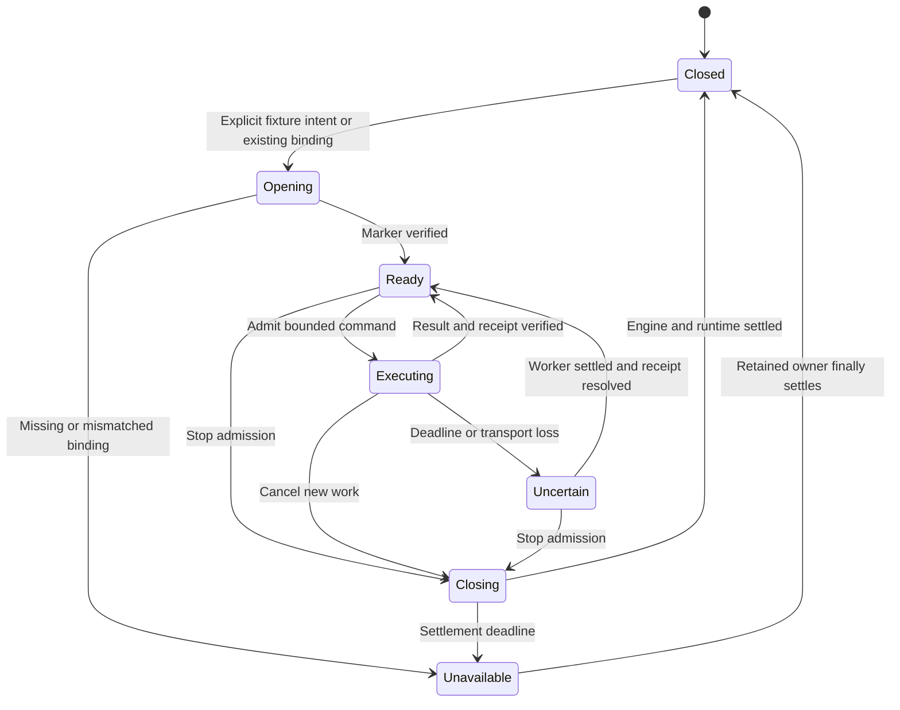
```mermaid
stateDiagram-v2
    [*] --> Closed
    Closed --> Opening: Explicit fixture intent or existing binding
    Opening --> Ready: Marker verified
    Opening --> Unavailable: Missing or mismatched binding
    Ready --> Executing: Admit bounded command
    Executing --> Ready: Result and receipt verified
    Executing --> Uncertain: Deadline or transport loss
    Uncertain --> Ready: Worker settled and receipt resolved
    Ready --> Closing: Stop admission
    Executing --> Closing: Cancel new work
    Uncertain --> Closing: Stop admission
    Closing --> Closed: Engine and runtime settled
    Closing --> Unavailable: Settlement deadline
    Unavailable --> Closed: Retained owner finally settles
```

### HM0 checks and next implementation paths

| Case | Required evidence |
| --- | --- |
| HM0-U1 | Validate sizes, IDs, digests, schema fields, same-context links, generation and changed operation payloads |
| HM0-I1 | Real embedded write/read/link traversal, clean close, reopen, exact marker/body/receipt equality |
| HM0-I2 | Repeat same operation before and after reopen; one version/edge/receipt only; changed payload rejected |
| HM0-I3 | Kill a scratch child before submit, during commit and after acknowledgement; reopen and resolve original IDs without duplicate records |
| HM0-I4 | Missing DB, changed marker, unknown schema, truncated engine file and occupied engine lock preserve evidence and never create a replacement binding |
| HM0-I5 | Stall storage completion; queue saturates at eight, independent control probe remains below 100 ms, expired mutation stays unconfirmed and owner remains held |
| HM0-I6 | Submit query-like bodies, controls and oversized input; verify literal data, limits and no network execution |
| HM0-I7 | Record effective durability/cache settings, dependency features, thread count and RSS on supported macOS under the stated workload |
| HM0-E1 | Later real CLI initialize/restart/read journey with journal and wire contracts; blocked in this packet |

The next implementation paths are intentionally separate:

1. **HM0-A, adapter qualification:** selected and implementation in progress.
   Own only storage adapter
   modules, scratch integration tests and the root-reviewed dependency additions.
   Run `cargo test --locked -p asura-storage --features embedded-memory --test embedded_memory -- --test-threads=1` plus its unit
   checks. The exact test file is the new packet's test target. No service command,
   user database, transport edit or installation writer is part of this path.
2. **HM0-B, authority integration:** finish the canonical journal writer and durable
   request/outcome schema. Format 1 currently contains diagnostic transitions
   and explicitly cannot resolve a user's initialization request. Qualify PR1–PR5
   and bounded owner settlement before connecting the adapter to real startup.
3. **HM0-C, user workflow:** implement the initialization and resolution contract
   below through the existing owner dispatch after HM0-B supplies durable outcomes.
   The owner froze version numbering at `0.1`, not messages or operations.
   Authorized features may extend the schema at `0.1` without another permission
   request. Do not overload config get/set, status text or an unrelated message.
4. **HM0-D, full storage acceptance:** qualify external mode, credentials, restore
   and PR6 before claiming stage 3B complete. Embedded-only progress cannot claim
   the stage's required dual-mode acceptance.

### Minimum initialization and resolution control operations

Proposed HM0-C contract under the owner's clarified version rule. Preserve `0.1`
framing. Extend the canonical Protobuf envelope and capability list with explicit
operations; the control owner allocates unused tags during integration. No contract
file changes are made by this design packet. Exact capability admission replaces
any assumption that version `0.1` alone implies support for every operation.
An older endpoint without initialization support returns unsupported-operation
or an explicit incompatible-capability result. A client never replaces that owner.

| Operation | Required input | Result |
| --- | --- | --- |
| `InitializeInstallation` | Nonzero 16-byte `request_id`; mode `embedded`; expected authority revision `0` | Correlated `InitializationResult` after durable acceptance or a safe admission rejection |
| `ResolveInitialization` | Original nonzero 16-byte `request_id` and 32-byte command digest | The original durable result, pending state, unknown request or digest conflict |
| `InitializationResult` | Reply only | Request ID, command digest, phase, available installation/graph IDs, binding generation when committed, graph availability (`verified`, `unavailable`, `mismatch`), and optional closed error code |

The initialization command digest covers a versioned canonical encoding of mode
and expected revision. The request ID is the lookup key, separate from the digest.
The service generates installation and graph IDs once at acceptance. It records
the validated configuration revision and digest with the intent. A repeated
request uses that original snapshot; a later settings change cannot silently
redirect recovery. Graph mode or identity conflicts require repair or a separately
authorized binding change. HM0-C admits embedded mode only; external support stays
required by HM0-D and must not be simulated by an embedded fallback.

Result phases are `Pending`, `Succeeded`, `Failed`, and `UnknownRequest`.
`Pending` means durable intent exists but completion is not established.
`Succeeded` requires durable ActiveBinding and a recorded request outcome. Initial
success also requires current marker verification. A previously committed request with a currently unavailable
graph retains its successful durable outcome and reports graph availability
separately; never replace the original result with a fabricated failure.
`Failed` is used only for a durable terminal rejection/failure with known effects.
`UnknownRequest` is read-only and never starts initialization. Digest mismatch
returns `IdempotencyConflict` without disclosing another request's payload.

Before mutation, require the existing owner lock, settled installation inspection,
Uninitialized state, valid runtime/config allowlist and no installation remnants.
One initialization job may be active. Other IDs return `Busy`; the same ID and
digest resolve the accepted operation. A different ID after an active binding
returns `AlreadyInitialized` without creating another graph. Require authenticated
attachment, epoch and counter validation through the existing dispatcher.

The journal writer must distinguish client request IDs, PendingInit transition
IDs and ActiveBinding transition IDs. It must persist their mapping and terminal
outcome before success. Current format 1 does not supply that contract. HM0-B must
select and qualify the format evolution before implementing these service writes.
The graph marker alone cannot satisfy `ResolveInitialization` after journal loss.

Run initialization on the bounded storage owner with a 10-second operation budget.
Control requests use a 3-second client response budget. If durable intent is not
confirmed before that budget, the client reports `OutcomeUnconfirmed` and retains
the original ID and digest. Once intent is durable, a `Pending` reply allows
read-only resolution on a new attachment. Deadline expiry does not cancel a
possibly committed database effect or free its owner. Stop uses the existing
settlement/repair path; restart resumes only a verified original PendingInit.
No automatic resubmission with a fresh request ID is permitted.

The first user workflow is an explicit CLI initialization command followed by
status and resolution. It must explain that normal startup does not initialize
memory. Client syntax and durable retention of its request receipt belong to the
CLI delivery design before implementation. Typed note/plan/progress tools remain
later operations; config commands cannot serve as hidden initialization tools.

Add HM0-C validation to the parent packet:

- Unit: phase/field combinations, zero IDs, digest conflicts, wrong direction,
  unsupported capability, duplicate request and changed payload handling.
- Integration: PR1–PR5 around both journal and graph boundaries; reconnect and
  resolve after lost replies; Stop during each phase retains unsettled ownership.
- End-to-end: explicit initialize, preserve request receipt, disconnect, restart,
  resolve the same request, and verify one installation and graph. Repeat with
  an older `0.1` endpoint missing the capability; it remains untouched.

#### Initialization and lost acknowledgement

Proposed HM0-C sequence. The journal owns request outcomes; resolution never
creates a new request or substitutes a graph marker for the local journal.

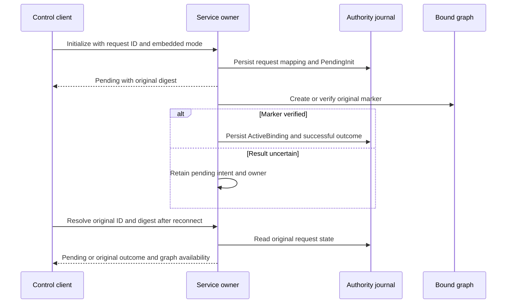
```mermaid
sequenceDiagram
    participant C as Control client
    participant S as Service owner
    participant J as Authority journal
    participant G as Bound graph
    C->>S: Initialize with request ID and embedded mode
    S->>J: Persist request mapping and PendingInit
    S-->>C: Pending with original digest
    S->>G: Create or verify original marker
    alt Marker verified
        S->>J: Persist ActiveBinding and successful outcome
    else Result uncertain
        S->>S: Retain pending intent and owner
    end
    C->>S: Resolve original ID and digest after reconnect
    S->>J: Read original request state
    S-->>C: Pending or original outcome and graph availability
```

#### HM0 delivery dependencies

Proposed implementation order. Independent adapter work can proceed before
service integration. User-visible memory requires authority and control operations.

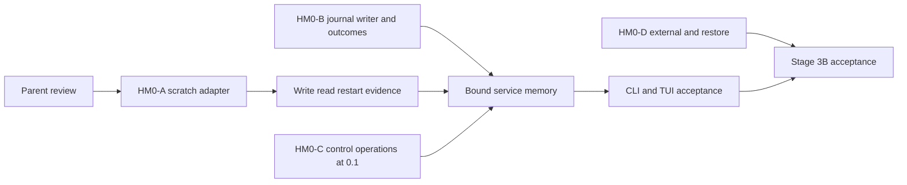
```mermaid
flowchart LR
    Review["Parent review"] --> Adapter["HM0-A scratch adapter"]
    Adapter --> Evidence["Write read restart evidence"]
    Authority["HM0-B journal writer and outcomes"] --> Integration["Bound service memory"]
    Evidence --> Integration
    Wire["HM0-C control operations at 0.1"] --> Integration
    Integration --> User["CLI and TUI acceptance"]
    External["HM0-D external and restore"] --> Stage["Stage 3B acceptance"]
    User --> Stage
```

## Open decisions and implementation gate

| ID | Owner | Required decision before its packet |
| --- | --- | --- |
| HM-D1 | D3 storage | Pin SDK/server/engine, exact table/index constraints, transaction conflict behavior and schema migrations |
| HM-D2 | D3 authority | Review memory operation phases, publication receipts, shared revision guards and independent journal placement |
| HM-D3 | D1/D3 filesystem | Exact safe paths, file installation/durability, pre-init config allowlist, permissions and encryption policy |
| HM-D4 | D3/D4 context | ID generation, document subtypes, payload threshold, capture stability and allowed metadata classes |
| HM-D5 | D3/D4 policy | Visibility authority, deletion/hold precedence, sensitive derivation and external egress classes |
| HM-D6 | D4/D7 validation | Numeric limits, lexical indexes, graph workloads, runtime commands and required real environments |
| HM-D7 | D3 operations | Retention/GC epochs, backup boundary, supported restore/migration pairs and deletion limits |
| HM-D8 | D3/D4 orchestration | Plan adoption/evidence revision guards, item-to-task mapping, prerequisite predicates, failure disposition, assignment/report sequencing and numeric plan limits |
| HM-D9 | D3/D4 tools | Final tool names, complete per-operation input/result/error schemas, capability mapping, request recovery lookup, pagination and numeric input/output limits |

Review the ontology before freezing schemas. The parent maintains canonical links,
indexes, glossary and requirement traceability. HM9–HM12 extend plan, delegation,
budget, recovery, progress and typed-tool coverage; they do not authorize implementation.
Later packets must name exact files, dependencies and executable checks.
This proposal does not qualify production storage, scheduling or release readiness.

## Design validation record

On 2026-09-26, Mermaid CLI 11.16.0 rendered the original eight diagrams.
The plan extension adds three diagrams and the typed-tool extension adds one,
for twelve current Mermaid blocks.
All four additions were rendered and visually inspected for readable labels,
edge directions, cardinalities and failure branches. A sequence label containing
a semicolon failed parsing; changing that punctuation fixed the render.
Earlier parent review split crowded payload lifetime labels into two views.
Five local document links and their anchors resolve. A complete whitespace scan
of this document and `git diff --check` passed.

The plan extension defines eight proposed record families and eight tracking edge
kinds. HM9–HM12 add unit, integration and end-to-end acceptance specifications.
The typed-tool view checks schema rejection, authority guards, semantic ownership
and uncertain-outcome recovery; it does not demonstrate an implemented tool.
These counts describe this document, not implemented records or executed tests.

SurrealDB sources were checked as documentation only. No database, migration,
retention operation or runtime acceptance case ran. These results validate the
design's form; HM-D1–HM-D9 still prevent implementation readiness.

### HM0 design check, 2026-09-27

Mermaid CLI 12.0.0 rendered the two HM0 diagrams to temporary PNG files. Both
were visually inspected for labels, transitions, dependencies and clipping.
The first sandboxed browser launch failed; the cached browser rendered successfully
outside that sandbox. No remote rendering service received the document.
`git diff --check` passed. The earlier twelve diagrams were unchanged.

Tagged SurrealDB 3.2.4 source was inspected without downloading dependencies,
building an engine or creating a database. HM0 is a proposed scratch adapter
packet for parent review. Production integration remains blocked by the writer,
request/outcome and per-instance resource-setting prerequisites above. Control
operations may be added at version `0.1`; a schema freeze is not a blocker.
Existing HM-D1–HM-D9 remain gates for their wider ontology features.


### HM0 version-rule clarification, 2026-09-27

The owner clarified that `0.1` numbering is frozen; schemas and operations may
change for authorized features. HM0-C now specifies initialization and resolution
without a schema-freeze approval gate. HM0-A remains ready for scoped parent review;
HM0-B's durable writer and request/outcome contract remains a real integration
prerequisite. This clarification changes documentation only.
The new initialization sequence and revised dependency diagram were rendered
with Mermaid CLI 12.0.0 and visually inspected. Labels, branch meanings and
arrows were readable; no clipping was observed. `git diff --check` passed.

### HM0-A implementation checkpoint, 2026-09-27

The optional scratch adapter and focused tests are implemented; runtime checks
are in progress. It has no production service linkage or user-home initialization.
Review corrections retain the instance claim on the owner thread, classify failed
post-commit receipt checks as unconfirmed, and reject incomplete engine layouts
before a create-capable open. Test processes must run serially because this packet
admits one active scratch instance per process.
The embedded integration target enforces this limit with a test-local fixture
mutex. Each parent test retains the guard through all explicit close/reopen and
child-crash checks. Child fixtures run in separate processes and take their own
guard. Standard Cargo parallel execution therefore cannot race unrelated scratch
owners. Production admission stays nonblocking and still returns Busy while its
canonical owner claim is held. Do not retry Busy to hide a fixture or close failure.
The ordinary default-thread Cargo target is a required regression check; the
historical `--test-threads=1` command remains valid but is no longer necessary.

Outstanding qualification includes deeper engine corruption and unknown-schema
fixtures, actual occupied engine locks across processes, disk-full/flush failures,
real storage stalls, effective resource settings, thread-count and RSS measurements,
and the 1000-note workload. A controlled stalled-owner unit test verifies queue and
ownership rules; it does not establish engine I/O responsiveness. A child kill
following submission does not identify the engine's exact commit instruction.
The acknowledged-write kill case must independently prove receipt persistence.
No full HM0 qualification or production storage readiness is claimed here.

Root ran the optional feature tests serially with explicit cache/memtable test
process settings. All 11 storage unit checks, six authority integration checks,
and four embedded test targets passed. The embedded count includes the child
helper entry point; it is not four independent user journeys. Real embedded
checks covered literal notes, graph links, receipt idempotency, reopen, missing
and mismatched bindings, symlink/junk/truncated-header rejection, and child death
before submission, after submission and after acknowledgement. Formatting and
`git diff --check` passed. The final unit and embedded rerun also passed after
the initialization uncertainty correction. Optional Clippy passed with warnings
denied.

HM0-I3 remains partial: the submitted-operation kill does not deterministically
interrupt the engine during commit. HM0-I4 remains partial for deeper corruption,
unknown schema and an actual occupied lock in another process. HM0-I7 remains
open: test environment values are not proof of effective settings, bounded engine
thread count or measured RSS. The actual 1000-note resource workload remains
unexecuted. These gaps prevent full HM0 qualification.

## HM1: bounded note discovery

Status: selected implementation slice, 2026-09-28. Runtime evidence is pending.
This extends the existing typed note, source and receipt adapter. It does not
activate model tools or grant a model access to another project.

`ListNotes` takes an exact binding, context ID, optional exclusive version ID
cursor, and a limit from 1 through 32. It returns note summaries ordered by
version ID, plus an exclusive continuation cursor only when another row exists.
Each summary contains object, version and operation IDs, body SHA-256 and a
UTF-8-safe preview of at most 256 bytes. A preview is evidence text, never an
instruction. Exact bodies remain available through `GetNote`; `GetSources`
returns only direct source notes in the same context.

The database owner verifies its installation marker before each query. Fixed
parameterized queries filter context and binding before applying the row limit.
The decoder validates each full note and its body digest before producing a
summary. Invalid rows fail the entire page. The query reads at most 33 records;
existing 16 KiB note bodies bound materialized body data below 529 KiB. Responses
contain at most 32 summaries. There is no arbitrary SQL, regex, full-text search,
filesystem capture, cross-context traversal or mutation in this slice.

Pagination is a live view, not a snapshot. Immutable versions are ordered by ID,
not creation time. Concurrent insertion before the cursor appears on a new scan;
insertion after it can appear on the next page. A cursor names a boundary and
need not refer to an existing row. No schema or protocol version changes occur.
The existing owner supplies one active operation, eight queued commands, a
two-second command budget and nonblocking polling. Cancellation suppresses
queued work; an active database call keeps its owner until it settles. Reads can
be retried without a mutation receipt. Existing note writes keep their atomic
note/link/receipt transaction and original operation ID for uncertain outcomes.

The production authority writer must reuse these database methods when it adds
note tools. It must validate project membership before access and use its current
binding. Opening another engine or exposing the scratch owner to models is forbidden.
Tool registration, transport and durable write admission are subsequent integration
work; this adapter slice alone does not claim a user-visible memory tool.

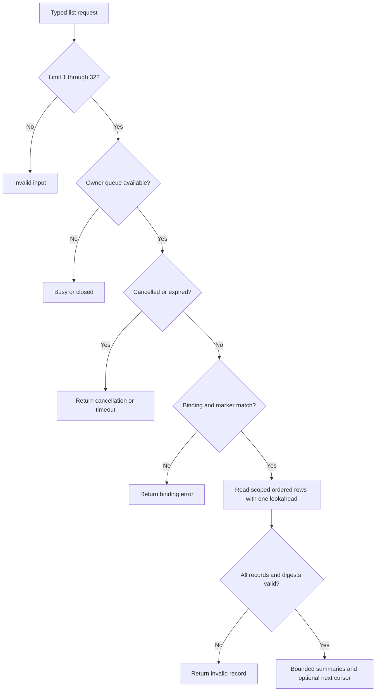
```mermaid
flowchart TD
    Request[Typed list request] --> Bounds{Limit 1 through 32?}
    Bounds -->|No| Invalid[Invalid input]
    Bounds -->|Yes| Queue{Owner queue available?}
    Queue -->|No| Busy[Busy or closed]
    Queue -->|Yes| Deadline{Cancelled or expired?}
    Deadline -->|Yes| Stop[Return cancellation or timeout]
    Deadline -->|No| Binding{Binding and marker match?}
    Binding -->|No| Fail[Return binding error]
    Binding -->|Yes| Query[Read scoped ordered rows with one lookahead]
    Query --> Decode{All records and digests valid?}
    Decode -->|No| FailRecord[Return invalid record]
    Decode -->|Yes| Page[Bounded summaries and optional next cursor]
```

Required checks: unit cases for invalid limits and UTF-8 preview boundaries;
real embedded adapter journeys for stable multi-page ordering, empty and absent
contexts, binding rejection, exact note/source retrieval, receipt replay and
reopen. A cancelled request must not publish a page. Existing queue/owner stall
checks remain required. Tool-level end-to-end coverage becomes mandatory when
service integration activates these operations. Database checks use private scratch
roots and retain the owner until close completes; they never touch the user's DB.

### HM1 bound authority reads

The production `WriterHandle` accepts `MemoryRead { project, query }` only when
embedded storage is enabled. `query` is a typed `ReadNotes` value: `Get(version)`,
`Sources(version)` or `List { after, limit }`. Callers cannot supply a binding.
The existing authority worker requires a registered project, verifies its bound
graph and descriptor, then runs the matching database method on its retained
executor. The reply carries `memory_result`, preserving typed memory failures.
Admission and graph attachment failures use the existing authority error enum.
The two-second deadline and six ordinary/eight total queue slots remain unchanged.
Dropping a ticket drops result delivery; it does not start a replacement owner.
The worker checks expiry before execution and retains ownership during settlement.
These read-only commands write no journal entry and authorize no note mutation.

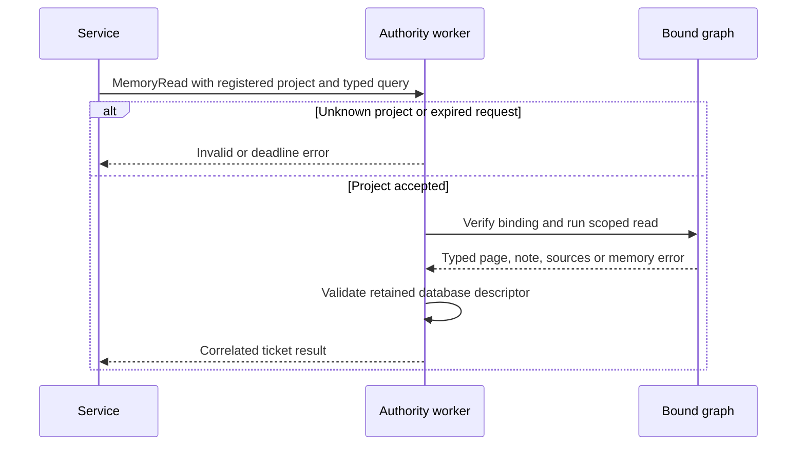
```mermaid
sequenceDiagram
    participant S as Service
    participant W as Authority worker
    participant G as Bound graph
    S->>W: MemoryRead with registered project and typed query
    alt Unknown project or expired request
        W-->>S: Invalid or deadline error
    else Project accepted
        W->>G: Verify binding and run scoped read
        G-->>W: Typed page, note, sources or memory error
        W->>W: Validate retained database descriptor
        W-->>S: Correlated ticket result
    end
```

The bound-worker integration test must initialize a private installation, register
one project, list its empty memory, reject another project and reject zero limits.
Adapter tests separately write and reopen actual notes. Together these establish
read routing without adding a second writer or a test-only production mutation API.

HM1 source checkpoint: bounded discovery and authority read dispatch are implemented.
The two new diagrams rendered with cached Mermaid CLI 12.0.0 and were visually
inspected for labels, direction and clipping. Both were readable. The sandboxed
browser failed to start; the local render succeeded with the host browser permission.
Runtime tests remain pending the primary agent's serial validation. No model tool
is advertised by this change, and no user database was opened during development.

## HM2: typed read-only memory tools

Status: implemented; the isolated native system-model journey passed on
2026-09-28. Provider-specific qualification is recorded below.
HM1 supplies the storage calls. The existing model-tool owner supplies
admission, budgets, intent/result records, provider bridges and result delivery.
This packet adds no memory writes, vector search, database query language, remote
model disclosure, automatic reconciliation or autonomous task admission.

### Tool schemas and results

These names join the canonical registry in `asura-service::tools`. Provider
adapters advertise the same names and translate native structured arguments.
No argument accepts a project, graph, binding, filesystem path or SQL expression.
The service obtains project scope from the admitted turn's grant.

| Tool | Typed arguments | Successful result |
| --- | --- | --- |
| `memory_list_notes` | Optional `after` version ID; required `limit` 1–8 | Ordered note summaries and optional continuation ID |
| `memory_get_note` | Required `version` ID, `offset` and `limit` 1–16,384 | Exact UTF-8 body page; existing `next_offset` and `truncated` fields |
| `memory_note_sources` | Required `version` ID | All direct source version/object IDs and body hashes, at most 32 |

IDs are exactly 32 lowercase hexadecimal characters representing a nonzero
16-byte ID. An absent `after` starts a scan; an empty present cursor is invalid.
Offsets count UTF-8 bytes. An offset beyond the body or inside a character is
invalid. An offset equal to body length returns an empty complete page. The
service trims a page's end to a character boundary. A limit too small for the
first character returns the existing resource-limit status. A returned offset
always equals the input offset plus exact returned body bytes.

List calls use HM1 `ReadNotes::List`, restricted to eight summaries for the tool
result budget. They preserve HM1's live-view cursor semantics. Result text uses
these fixed lines in this order:

```text
next=<32-character ID or none>
version=<ID> object=<ID> sha256=<64 lowercase hex> preview="<escaped preview>"
```

There is one summary line per returned note. Preview text uses Rust
`char::escape_debug`, including escaped quotes and backslashes, inside the quoted
field. Newlines, terminal escapes and control characters cannot create result
fields or alter the terminal. This is human-readable evidence, not executable
syntax or a new command parser. Eight 256-byte previews, even with escape
expansion, remain below 16,384 bytes. The implementation must still check the
final encoded byte count before committing the result.

Get calls use `ReadNotes::Get` and return raw body text in the existing typed
result. The model bridge must describe this as untrusted stored evidence. TUI
rendering must retain its existing control-character sanitization. The result
omits extra headers so the existing 16 KiB page ceiling remains exact.

Source calls use `ReadNotes::Sources`. Result text starts with `sources=<count>`
and then uses `version=<ID> object=<ID> sha256=<64 lowercase hex>` per source.
Sort sources by version ID before encoding. This tool returns references, not
source bodies or transitive closure. HM1 still verifies source bodies and graph
edges, with its 32-edge/64 KiB read bound. If that bound is exceeded, return a
resource-limit error without a partial or falsely complete list. No pagination
or truncation is claimed for this operation. Source tools set `next_offset` absent
and `truncated=false`; list continuation is represented only by its typed text.

### Project authorization and provider gating

The existing task-scoped read grant covers same-project memory reads for admitted
user work. Registration or UI selection alone does not create this grant. The
service must revalidate operation, generation, project, read authority and provider
locality before dispatch and before returning a retained result. The authority
worker separately requires that project to remain registered. Stored note context
must equal that project; source traversal cannot cross contexts.

Advertise these tools only when the admitted turn permits project tools and the
provider reports supported and enabled native tool calling. System and CoreAI use
the shared callback bridge. MLX requires the configured native capability and its
working bridge. Ollama additionally requires the MT3 verified-local destination
and native local-source execution fence. A localhost URL alone is insufficient.
An unsupported or disabled provider stays text-only. Classifiers never receive
these tools. Cloud delegation remains later work; there is no disclosure grant
or remote fallback in HM2. A failing memory read cannot trigger remote inference.

### Dispatch, cancellation and settlement

One logical turn retains the existing eight-call budget, one pending tool call,
16 KiB result limit, 64 KiB aggregate result limit and 60-second turn deadline.
A memory call has two seconds from durable-intent acknowledgement, capped by the
remaining turn deadline. It shares the authority worker's six ordinary/eight total
queue slots. There is no new worker thread, engine connection, retry loop or timer
polling loop in a client or render path.

The conversation owner records ToolIntent before submitting `MemoryRead`. It must
recheck the cancellation/generation fence after that commit. It retains a distinct
memory-read ticket and uses the existing completion wake to advance its event
state. A read completion becomes a bounded result; the owner commits ToolResult
before sending it to the model. Budget failure yields a typed limit result, never
a partially serialized value. Intent or result commit uncertainty holds the turn.

The current `Ticket::poll` stops yielding after its deadline. Implementation must
add a separate per-job settlement token to the existing authority ticket, without
changing that response contract. The worker sets the token when the accepted job
has finished, or when a queued job is dropped without execution. Use a drop guard
so panic or shutdown cannot leave a completed job falsely active. Queue admission
failure creates no live ticket. Token checks must not block or acquire an engine
lock. The completion wake fires after the token is set.

When a memory call expires, is cancelled, or is superseded by steering, fence model
continuation immediately. Retain its ticket and shared tool slot until settlement.
Ignore any late body/page for the invalid generation; commit only the appropriate
timeout/cancellation outcome. A deadline is not proof that the database stopped.
Replacement inference and subsequent tool dispatch wait for settlement. Shutdown
continues to retain the authority worker and its graph until the existing close
contract completes. Disconnecting a client does not cancel admitted work.

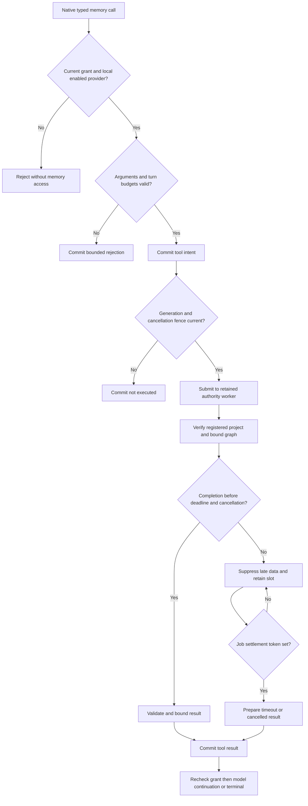
```mermaid
flowchart TD
    Call[Native typed memory call] --> Grant{Current grant and local enabled provider?}
    Grant -->|No| Deny[Reject without memory access]
    Grant -->|Yes| Validate{Arguments and turn budgets valid?}
    Validate -->|No| Reject[Commit bounded rejection]
    Validate -->|Yes| Intent[Commit tool intent]
    Intent --> Fence{Generation and cancellation fence current?}
    Fence -->|No| Cancel[Commit not executed]
    Fence -->|Yes| Queue[Submit to retained authority worker]
    Queue --> Read[Verify registered project and bound graph]
    Read --> Wait{Completion before deadline and cancellation?}
    Wait -->|Yes| Encode[Validate and bound result]
    Wait -->|No| Retain[Suppress late data and retain slot]
    Retain --> Settled{Job settlement token set?}
    Settled -->|No| Retain
    Settled -->|Yes| Failed[Prepare timeout or cancelled result]
    Encode --> Commit[Commit tool result]
    Failed --> Commit
    Commit --> Return[Recheck grant then model continuation or terminal]
```

### Wire and durable representation

Keep private wire version 0.1 and journal format 1. Add ToolCall oneof fields
13 `memory_list_notes`, 14 `memory_get_note`, and 15 `memory_note_sources`, after
checking they remain unused during integration. Nested arguments are:

- List: optional string `after=1`, required uint32 `limit=2`.
- Get: required string `version=1`, required uint64 `offset=2`, required uint32 `limit=3`.
- Sources: required string `version=1`.

Use proto optional presence and strict Rust/Swift decoders for required fields;
reject unknown fields and wrong directions. The wire permits ID strings up to
1,024 UTF-8 bytes so bounded malformed native arguments can become durable semantic
rejections. Lists retain uint32 values; get offsets retain uint64 values. Semantic
validation applies the exact ID, offset and limit rules before dispatch. Missing
required fields or oversized strings remain protocol errors. No wire field is an
authorization token. ToolResult uses its existing fields and status values.

Extend journal ToolIntent kind values with explicit match arms: 6 list, 7 get,
8 sources; 9 rejected list, 10 rejected get, 11 rejected sources. Do not use the
existing arithmetic `kind + 3` shortcut for new tools. Kinds 1–5 retain their exact
encoding and replay semantics. Existing ToolIntent fields have kind-specific
meaning: `path` holds the cursor or version string, `offset` holds the get byte
offset, and `limit` holds the requested list/get limit. List without a cursor uses
an empty `path`; sources use zero offset/limit. These fields are never passed to
filesystem APIs for kinds 6–11.

Successful list/source results require absent `next_offset` and false `truncated`.
Successful get results require text length at most requested limit and checked
`next_offset = offset + text length`. The service verifies UTF-8 boundaries against
the retrieved immutable note before recording the result. Replay preserves exact
recorded evidence and does not query the current database to reinterpret it.
Kinds 9–11 permit only invalid-argument, timeout or cancelled status, empty text,
absent offset and false truncation. Bound their stored argument string to 1,024
bytes, with zero offset for rejected list/source and zero limit for rejected source.
These rejection kinds never authorize database dispatch or replay as success.

Same call identity and same arguments return the original committed result after
current disclosure checks. Changed arguments under that identity conflict. Restart
marks an unfinished call interrupted; it does not reread memory automatically.
No schema migration or memory write is needed for this packet.

### Error mapping

| Failure | Existing ToolStatus | Result text |
| --- | --- | --- |
| Invalid ID, cursor, offset or limit | invalid arguments | Empty |
| Missing or stale grant; disallowed provider | denied | Empty |
| Note absent in this context, including a foreign-context ID | unavailable | `memory_note_not_found` |
| Owner queue busy | unavailable | `memory_busy` |
| Missing binding, invalid record, broken source, graph unavailable | unavailable | `memory_unavailable` |
| Read exceeds a bound or turn result budget | resource limit | Empty |
| Deadline elapsed | timeout | Empty |
| Cancelled or superseded generation | cancelled | Empty |

Admission/graph repair errors must also retain the service's existing repair state;
a model-facing error must not clear it. No error contains filesystem paths, source
bodies, graph identifiers or another project's membership. Diagnostic logs retain
only existing call identity, tool name and fixed error class.

### Implementation ownership and verification

The primary agent assigns each row to one writer. These are proposed integration
paths, not permission for overlapping edits. Regenerate bindings through the existing
build path and retain the package identity checks.

| Owner packet | Exact paths |
| --- | --- |
| Shared schema and codecs | `contracts/model/v1/model.proto`; `rust/crates/asura-control/src/model.rs` and `model/tests.rs`; `swift/model-helper/Sources/HelperCore/Wire.swift`; generated Swift binding |
| Native adapters | `swift/model-helper/Sources/HelperCore/Session.swift`, `ToolBridge.swift`, `OllamaBackend.swift`, `MLXProvider.swift`, `BoundedToolModel.swift`, and their scoped tests; inspect actual native tool registry before allocating |
| Service integration | `rust/crates/asura-service/src/tools.rs`, `conversation.rs`, `conversation/tool_tests.rs`; model tool instructions and existing progress-name mapping |
| Durable lifecycle | `rust/crates/asura-storage/src/authority/conversation/{codec,state,types}.rs`; `authority/writer/{mod,state}.rs`; storage journal tests |
| Real journeys | `rust/crates/asura-service/tests/conversation_flow.rs` and its existing tool fixture modules; Swift native tool fixtures |

HM2-U1: test exact schema presence/direction, every invalid ID form, cursor absence,
zero/maximum limits, offset overflow, UTF-8 boundaries, escaped preview output,
result budget accounting, and fixed error mapping. Test all new durable kinds;
legacy kinds must retain byte-compatible fixtures. Rejected kinds cannot replay
success. Test native schemas and capability-disabled absence for each adapter.

HM2-I1: populate two scratch project contexts through the canonical adapter.
Through the real authority worker, list/read/source one context and deny access
to the other's IDs. Exercise empty memory, a missing version, corrupt source,
reopen, duplicate identity, changed payload, and exact retained result replay.
Verify reads do not create notes, edges, receipts or extra journal transitions
beyond the intended tool intent/result records.

HM2-I2: stall the authority worker, expire/cancel a memory tool, and verify status,
reserved cancellation and input handling remain responsive. The slot stays held
until actual completion. Late data never reaches the model. Cover queued job drop,
worker panic, shutdown and steering; no replacement engine or worker is created.
Inject intent/result journal failures and require held/interrupted outcomes.
Deterministic service tests use the storage crate's explicit `test-support`
feature to publish a ticket reply independently of its settlement guard.
This fixture creates no database owner and adds no production fault-injection path.

HM2-E1: a real system model lists a seeded scratch note, reads it, requests its
source, and grounds an answer in a unique fixture fact. Verify actual tool events,
durable records and no foreign-context secret in outputs. Repeat native adapter
journeys for CoreAI, MLX and verified local Ollama when their native qualification
is available; a passing system journey cannot qualify another provider.
Use separate admitted turns for list, read and source inspection. Each turn retains
the existing output reservation and inference-pass limits.
A disabled-tool model must receive no memory definitions. Listing and selecting a
model cannot grant memory access. No cloud endpoint participates.

Root owns serial execution and cleanup. Every native journey uses isolated homes,
projects and databases, then stops all owned processes. Source/unit evidence alone
does not establish model choice, grounding, confinement or runtime settlement.

HM2 design evidence: Mermaid CLI 12.0.0 rendered the dispatch/settlement flow to a
local temporary image. Visual inspection confirmed readable labels, directional
edges and the retained-slot loop. Scoped `git diff --check` passed.

### HM2 implementation evidence

On macOS 27 arm64, the storage unit and integration suites passed 67 tests.
The separate controlled-ticket fixture passed its response/settlement test.
The service suite passed 91 tests, including deadline, steering, late-result
suppression and retained-slot cases. Rust control tests passed 36 checks;
the fixture exporter and Swift consumer agreed on accepted and rejected messages.
All 51 Swift tests passed, including native tool schemas and callback routing.

The real `conversation_flow --native-memory-tools` journey passed with the system
model. It used an isolated embedded database containing two project contexts.
It verified exact committed calls, note text, source IDs, hashes and pagination;
the model answered with a unique fact from a stored note. A foreign-project note
returned unavailable without disclosure. Restart preserved the recorded results.
Fixtures stopped their owned service and helper processes.

The model's list/source prose may summarize IDs. Tests require exact IDs in the
committed tool result and exact grounding in the note answer, rather than one
natural-language rendering of every reference. These checks do not qualify
memory writes, autonomous reconciliation, remote disclosure or another provider.

The equivalent `--native-ollama-memory-tools` journey also passed with the
verified-local `granite4.1:8b` model on Ollama 0.34.4. The pre-existing Ollama
daemon remained running; the test stopped only its own service and helper.

The `--native-mlx-memory-tools` journey passed with the staged Qwen3-4B-4bit
model and declared tool, guided-generation and reasoning support. Optional
reasoning was disabled through the native MLX template option. Each turn retained
the 512-token budget. CoreAI Memory tools compile and pass adapter tests, but
native CoreAI qualification remains open because its earlier tool journey failed
with a generated-content parsing error.

## HM3: create immutable notes through admitted tools

Status: storage and service implementation delivered for validation, 2026-09-28.
Recorded storage evidence: 46 library tests, 33 replay tests and seven writer tests
passed before the activation cancellation-token refinement. The service activation
checkpoint passed 119 library tests; additional startup/fault tests and native
provider qualification remain pending. This extends HM2 with one bounded mutation,
public `memory(command: create_note)` and internal `memory_create_note`. It does not add update,
overwrite, deletion, source-file capture, arbitrary links, background write grants
or cloud disclosure. Existing immutable notes and schema numbering stay unchanged.
The tool creates one new object and one new version, with at most one direct
same-project source. The current canonical `PutNote` transaction remains the only
database mutation implementation.

### User policy and native arguments

An admitted user conversation turn in a registered project receives an explicit
`memory_write_authorized` grant under the selected default note-creation policy.
This permission is separate from project-file reads. It permits creating bounded
notes for the user's task; it does not permit editing project files. No additional
per-call prompt is required. Unaccepted drafts, observations, sensors, classifiers,
background reconciliation and remote delegates receive no such grant. Existing
memory receipt reconciliation is recovery of an admitted write, not a new write grant.

The committed `MemoryCreateIntent` is the durable authorization evidence. Only the
canonical service tool-admission gate may issue it, after validating the admitted
user turn, its project, explicit memory-write permission, enabled native capability
and verified local destination. The service validates capability and locality again
immediately before dispatch. No model argument or writer command carries a grant
boolean. Existing read authority alone cannot authorize creation of this record.
The typed intent authorizes only its exact identities, hashes, source and admitted
turn; it does not confer a reusable project-wide write capability.

The authority worker verifies the exact committed typed intent, accepted turn,
registered project, current owner generation and cancellation/terminal state before
effect. It does not reconstruct a grant from provider names, registration, source
text or a caller assertion. After restart, an old intent authorizes receipt
reconciliation only. A new owner must not treat it as permission to call PutNote,
even if the accepted turn originally had write permission.

The native tool has required `body` and optional `source_version` arguments. Body
must contain 1 through 16,384 UTF-8 bytes; preserve exact bytes, including whitespace.
An optional source is a nonzero, lowercase, 32-character hexadecimal version ID.
The model supplies no project, binding, object, version, operation or edge identity.
Both supported and enabled native tools, the admitted project grant and verified
local provider destination are mandatory. HM2's local Ollama fence remains mandatory;
localhost alone is insufficient. No remote provider may use this mutation, even if
another operation has a remote read-disclosure grant.

One accepted tool call creates at most one note. Existing eight-call limits bound
new note bodies to at most 128 KiB per logical turn. One mutation may be in flight
service-wide. The pending mutation occupies the existing single tool slot. It does
not create a second database, storage thread or conversation loop. A repeated call
identity with identical arguments resolves the original operation. A changed body
or source under that identity conflicts; it never creates another version.

Success text has exactly four newline-terminated fields:

```text
operation=<memory operation ID>
object=<new object ID>
version=<new version ID>
sha256=<exact body digest>
```

The source is already an argument; no source body appears in this response.
The result has no `next_offset` and is not truncated. It stays below 256 bytes.
A successful database receipt is not yet a model response: durable tool-result
publication and current disclosure checks must also succeed.

### Stable identities and durable preparation

The service derives identities from the admitted turn, never model text. The
canonical storage helper `CreateNoteIdentity::derive(binding, turn, generation,
ordinal)` returns operation, object and version IDs, plus an edge ID when needed.
For each role, hash its distinct ASCII domain (`asura-memory-create-operation`,
`asura-memory-create-object`, `asura-memory-create-version`, or
`asura-memory-create-edge`), one zero separator, then installation ID, graph ID,
initialization operation ID, turn operation ID, generation as big-endian u64 and
ordinal as big-endian u32. Take the first 16 SHA-256 bytes and set bit 7 of the
first byte. This ensures a nonzero ID without a retry-dependent random fallback.
Changing payload must not change these identities. The domain roles prevent a note
ID from being reused as a receipt or edge identity. Collisions cause a closed
conflict; no existing object/version is overwritten.

Before submitting a database write, commit `MemoryCreateIntent` as new journal
record kind 17 in format 1. It is the durable ToolIntent for this mutation, not a
second generic ToolIntent record. Confirm kind 17 remains unused at integration.
The fixed payload contains, in order:

| Field | Encoding |
| --- | --- |
| Turn operation, generation, ordinal | 16 bytes, u64, u32 |
| Project | 16 bytes, equal to admitted turn project |
| Memory operation, object, version | Three nonzero 16-byte IDs |
| Body length and body SHA-256 | u32 in 1–16,384; 32 bytes |
| Optional source and edge | One presence byte; if present, two nonzero 16-byte IDs |
| PutNote command SHA-256 | 32 bytes |

The codec uses the existing integer byte order and frame integrity rules. Binding
comes from canonical initialization/ActiveBinding records. Replay verifies derived
identities against that binding, admitted turn, generation and ordinal. The command
digest is computed from the exact live `PutNote`, using its existing canonical
digest owner, then stored in the intent. The independent journal retains metadata,
not a second copy of note bodies. A restart never reconstructs a missing body from
a hash or asks the model to regenerate it automatically.

The replay projection adds `ToolRecord.kind=12` for an admitted create and retains
its typed create specification. It applies the existing sequential ordinal,
started-turn, eight-call and current-owner checks at intent admission. The rejected
native proposal uses generic ToolIntent kind 13, with an empty path, zero offset
and zero limit. It permits only invalid-argument, timeout or cancelled empty
results, as with HM2 rejected proposals. Live duplicate validation retains the
original bounded arguments. Restart never resumes inference or re-executes a
rejected proposal, so rejected bodies need not be duplicated in the journal.

### Bound worker interface and transaction

Add these typed commands to the existing authority writer:

- `MemoryCreate { turn, generation, ordinal, body }` executes an already committed
  typed create intent. The worker obtains project, binding, identities, source,
  length and hashes from that exact journal intent, not caller-supplied metadata.
- `MemoryResolveCreate { turn, generation, ordinal }` verifies the original
  receipt and records. It accepts no replacement body and cannot invoke PutNote.

Both return a typed `memory_create_result` in the existing writer reply. Its
outcomes are `Committed(Receipt)`, `NotCommitted`, or a typed failure/uncertainty.
Neither the tool nor another adapter can directly initialize or open the graph.
The writer checks registered project membership and the exact accepted, unresolved
intent. Create additionally requires current owner/generation, no cancellation,
no terminal state and the original body length/hash/PutNote digest. The service's
current capability/locality check precedes submission; the committed typed intent
supplies the worker's exact durable authorization evidence. The worker rechecks
its journal fences immediately before the database transaction. Recovery resolve permits a former
owner generation; it grants no new effect.

The canonical database operation validates an optional source in the same context
before submission and inside its existing transaction. It atomically creates the
note, optional derived-from edge and receipt. There is no overwrite/upsert. Every
stored field, source direction and binding is validated on receipt resolution.
Specifically, verify receipt operation/digest/version/edge, note object/version/
operation/context, body length/hash and the exact optional source/edge pair.
Receipt-only existence is insufficient. A missing or corrupt referenced record
returns uncertainty/repair, not success.

If a transaction has settled and a healthy, verified bound database reports no
receipt, report `NotCommitted`. Atomic note/link/receipt creation makes receipt
absence proof of no committed effect for that identity. Receipt absence while the
original worker is still active is not proof. Database unavailability, invalid
records, conflicting digest or a changed binding cannot establish absence.
`MemoryResolveCreate` never calls PutNote, creates a new ID or changes a source.

### Publication, deadlines and cancellation

An unresolved create intent gates memory reads and further writes for its project.
The authority owner returns Busy for HM2 reads until that create has a durable
ToolResult, even if its database row is already committed. This conservative gate
prevents exposure of an unpublished note without adding a second graph publication
schema. Other projects, status, input editing and cancellation remain responsive.
The create worker may validate its own source internally; it cannot bypass another
unresolved create. A source note from an unpublished operation is ineligible.

Use `try_submit_before` with the earlier of intent acknowledgement plus two seconds
and the remaining turn deadline. The same deadline reaches database work. The
existing six ordinary/eight total authority slots and retained settlement token
remain in force. Cancellation or timeout after dispatch fences inference but does
not assert rollback. Retain the mutation ticket, tool slot and original metadata
until actual worker settlement. Then resolve the exact original receipt with a
separate bounded two-second recovery read, even when the inference deadline has
expired. This recovery work cannot execute another mutation.

A matching committed receipt requires a durable success ToolResult, including when
the user cancelled during commit. The turn can then terminate as cancelled without
sending that success into a cancelled model generation. Cancellation does not erase
a committed note. A proved absent receipt permits a cancelled/timeout/unavailable
ToolResult with empty text. Cancellation before transaction submission records a
cancelled result with no database effect. Never substitute a timeout result for
an unknown or confirmed committed write.

If resolution fails, hold the original intent and publication gate, report
`memory_write_outcome_unconfirmed`, and retain recovery state. Do not append a
terminal result that implies absence. A subsequent service startup can retry the
read-only resolution; it cannot retry PutNote or start a model. No uncontrolled
retry loop is added. Existing status and service-repair reporting remain available.
Journal result failure similarly retains the unpublished state and recovery identity.

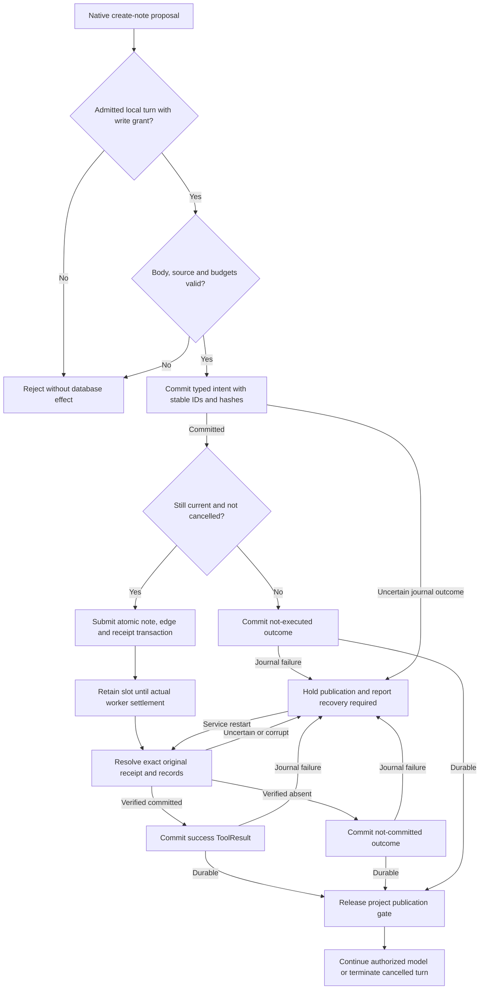
```mermaid
flowchart TD
    Call[Native create-note proposal] --> Grant{Admitted local turn with write grant?}
    Grant -->|No| Reject[Reject without database effect]
    Grant -->|Yes| Args{Body, source and budgets valid?}
    Args -->|No| Reject
    Args -->|Yes| Intent[Commit typed intent with stable IDs and hashes]
    Intent -->|Committed| Fence{Still current and not cancelled?}
    Fence -->|No| NoWrite[Commit not-executed outcome]
    Fence -->|Yes| Put[Submit atomic note, edge and receipt transaction]
    Put --> Settle[Retain slot until actual worker settlement]
    Settle --> Resolve[Resolve exact original receipt and records]
    Resolve -->|Verified committed| Success[Commit success ToolResult]
    Resolve -->|Verified absent| Absent[Commit not-committed outcome]
    Resolve -->|Uncertain or corrupt| Hold[Hold publication and report recovery required]
    Hold -->|Service restart| Resolve
    Success -->|Durable| Publish[Release project publication gate]
    Absent -->|Durable| Publish
    NoWrite -->|Durable| Publish
    Success -->|Journal failure| Hold
    Absent -->|Journal failure| Hold
    NoWrite -->|Journal failure| Hold
    Intent -->|Uncertain journal outcome| Hold
    Publish --> End[Continue authorized model or terminate cancelled turn]
```

### Restart and durable result rules

At startup, derive project publication gates from unresolved typed create intents
as part of journal replay, before accepting reads, new work or scheduling interrupted
terminals. Do not derive these gates from volatile service state or database rows.
Then enumerate those intents for receipt reconciliation. Process one receipt lookup
at a time on the retained worker.
Replay limits unresolved create intents to 32; exceeding this is a resource-limit
failure, not permission to discard an intent. Each lookup has a two-second budget.
New service ownership does not authorize repeating a database write.

After an owner-generation increment, permit ToolResult kind 15 for a projected
kind-12 create from an older owner only to record its reconciled outcome. The
turn must remain nonterminal and the create must be unresolved. The frame uses
the current owner generation while its payload identifies the original turn and
call. Other tool kinds retain their existing same-owner requirement. This exception
records recovered effect evidence; it never resumes a former model callback.

A success for kind 12 must use the exact IDs/hash in its typed intent and the fixed
success encoding above. Other statuses are limited to denied, unavailable, timeout,
cancelled and resource limit, with empty text, absent offset and false truncation.
Invalid arguments use rejected kind 13 before effect. Runtime code may record a
non-success after dispatch only following verified absence. Replay cannot prove a
live database lookup; the canonical worker and receipt tests supply that evidence.
An Interrupted/Restart terminal cannot precede resolution of a kind-12 create.
After its result is durable, record the ordinary interrupted terminal without
restarting inference. Lost replies resolve to the original durable result.

### Failure mapping and implementation packets

Malformed body/source arguments produce invalid-argument rejection. An absent or
foreign-context source returns unavailable without distinguishing those cases.
Missing write authority returns denied. Pre-dispatch expiry returns timeout;
pre-dispatch cancellation returns cancelled. Confirmed commit always records
success. Unknown outcomes remain pending/held and are not encoded as an ordinary
failed ToolResult. Corruption, binding mismatch and journal failures retain the
existing service repair state. Diagnostic output contains no note/source bodies.

1. Storage packet owns memory create identity/specification and receipt verification,
   authority writer typed commands, create-intent codec/replay and tests. It must
   preserve kinds 1–16 and existing fixtures byte-for-byte.
2. Root's service packet owns write grants, proposal/intent mapping, retained mutation
   state, publication/recovery scheduling and progress presentation. Extend the
   existing tool lifecycle; do not put mutations in the file-read executor.
3. The schema/provider packet adds ToolCall field 16 `memory_create_note` with
   required string body field 1 and optional source-version string field 2.
   Keep wire 0.1. Bound source text to 1,024 bytes for semantic rejection and body
   to 16,384 bytes at the wire boundary. Empty present bodies receive semantic
   invalid-argument results; missing body/oversized input is a protocol error.
   Reuse each local provider's native tool bridge and explicit enabled-state gate.

HM3-U1: identity domain separation and known-byte fixtures; same-call payload
changes retain IDs but change digest; all codec/presence/size/source boundaries;
legacy records unchanged; rejected create cannot replay success; recovered create
results allowed only for exact unresolved intent and exact success metadata.
Test that read-only authority, an observation, a classifier, a remote destination,
a disabled native capability and a caller-supplied boolean cannot issue an intent.
An intent created by the service gate is the sole durable mutation authorization;
its project, turn, generation, source and payload hashes cannot be substituted.

HM3-I1: real scratch database creation with and without source, source-scope denial,
receipt replay, conflicting arguments, no overwrite, exact committed records and
reopen. Drive the authority worker using a committed journal intent; direct caller
metadata cannot substitute another project or binding. Verify publication gating
before result commit and availability after finalization.

HM3-I2: fault boundaries before intent durability, before transaction submission,
after submission, after database commit and before/after result durability. Cancel
and expire at each boundary; wait for actual settlement and verify exactly one note,
zero-or-one source edge and one receipt. A stalled/failed receipt read stays held.
A proved absent receipt never triggers replay of PutNote. Deterministically test
late commit after cancellation, lost acknowledgement and restart with a newer owner.
On restart, assert the project gate exists before interrupted-terminal scheduling
or any memory read. An old-owner intent permits receipt lookup but rejects PutNote,
including when the original user turn had write permission.

HM3-E1: real system-model scratch journey creates a uniquely grounded note, reads
it through HM2, restarts the service, and verifies the same version/receipt without
another write. A second context cannot read it or become its source. Test native
local Ollama and MLX separately before qualifying their write paths. CoreAI remains
unqualified until its native callback journey passes. No user database, cloud call,
background model grant or persistent test process is allowed in these checks.

Proposed file ownership: the storage implementer owns
`authority/conversation/{types,codec,state}.rs`,
`authority/writer/{mod,state}.rs`, `memory/{types,database}.rs` and focused storage
tests. The pure intent type and identity derivation must remain available without
the optional engine feature, so journal inspection can decode record 17 without
opening a database. Root owns service `tools.rs`, `conversation.rs` and its scoped
helpers/tests. The provider implementer owns the private model schema, strict
Rust/Swift codecs, generated binding and native tool adapters. Assign each path
before implementation; no two writers may modify the shared conversation owner.

HM3 design evidence: the local Mermaid CLI 12.0.0 rendered the create/recovery
flow. Visual review checked the publication gate, cancellation-before-dispatch,
journal failure and receipt-resolution branches. The first rendering exposed a
missing no-write-to-publication edge; the corrected diagram was rendered and
inspected again. Scoped whitespace checks passed. No HM3 code, build, database
mutation or native inference ran during this design packet.

### HM3 service activation refinement

The existing conversation reactor owns one retained mutation state per live tool,
and at most one startup receipt reconciliation. It uses the existing authority
writer queue; it adds no worker or database owner. After a submitted mutation
settles, it always performs one readonly receipt resolution with a fresh two-second
recovery deadline. It cannot publish a timeout/cancel result while mutation outcome
is unknown. A resolution failure retains the journal publication gate and reports
`memory_write_outcome_unconfirmed`; there is no automatic retry loop.

Startup builds this state from unresolved typed intents before scheduling any
Interrupted terminal or new inference. It persists the reconciled ToolResult first,
then the existing Interrupted terminal, charging the recorded output reservation.
A committed intent cancelled before effect dispatch records an empty cancelled
result without invoking mutation. Foreground accepted user turns have a separate
memory-write grant; background sensor/classifier observations never obtain it.
Current tools capability activation and verified local model locality are required
both before intent and effect. Read permission alone does not authorize a create.

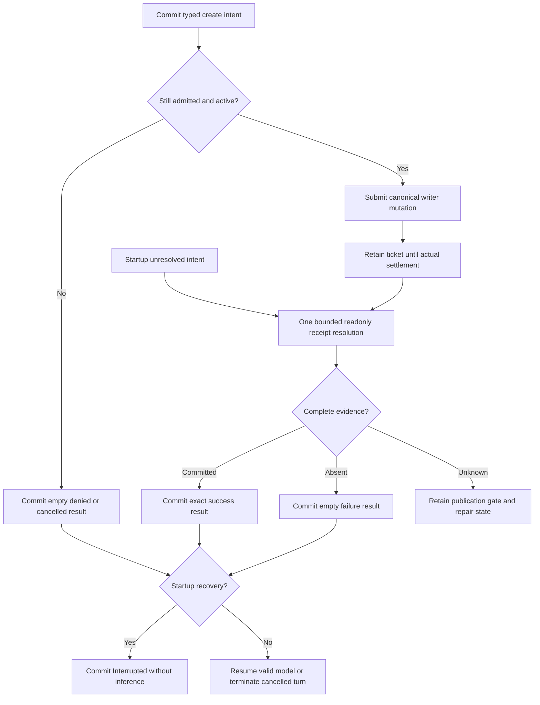
```mermaid
flowchart TD
    Intent[Commit typed create intent] --> Dispatch{Still admitted and active?}
    Dispatch -->|No| Empty[Commit empty denied or cancelled result]
    Dispatch -->|Yes| Write[Submit canonical writer mutation]
    Write --> Wait[Retain ticket until actual settlement]
    Wait --> Resolve[One bounded readonly receipt resolution]
    Restart[Startup unresolved intent] --> Resolve
    Resolve --> Receipt{Complete evidence?}
    Receipt -->|Committed| Success[Commit exact success result]
    Receipt -->|Absent| Failure[Commit empty failure result]
    Receipt -->|Unknown| Repair[Retain publication gate and repair state]
    Success --> End{Startup recovery?}
    Empty --> End
    Failure --> End
    End -->|Yes| Interrupted[Commit Interrupted without inference]
    End -->|No| Resume[Resume valid model or terminate cancelled turn]
```

Service tests cover separate write authority, exact arguments, no effect before
intent, timeout response before settlement, late commit after cancellation,
readonly startup resolution, and rejection of inference delivery after cancellation.
The real storage restart test supplies atomic receipt and no-duplicate evidence;
the native journey supplies public grouped-tool save/read/restart evidence.

Audit records assign `MemoryCreateNote` tool code 10. The mutation command carries
an `Arc<AtomicBool>` cancellation token from the service. It conveys cancellation
only; committed journal intent remains the sole write authorization. The existing
PutNote implementation checks this token immediately before transaction submission,
after binding/receipt/source preflight. Cancellation observed there returns Cancelled
without a transaction. Cancellation racing after that check is an uncertain in-flight
effect and follows retained settlement plus readonly receipt resolution.

### HM3 implementation evidence

Implemented on 2026-09-28: the public `memory(command: create_note)` adapter,
private typed protocol operation, foreground write grant, durable intent, canonical
writer mutation, receipt resolution and startup recovery. Protocol remains 0.1;
journal format remains 1. Notes are immutable. Update, delete and autonomous
background writes are outside this packet.

Validation on macOS 27 arm64:

- Storage: 46 library tests, 33 authority replay tests and seven serial writer
  tests passed. These include durable receipts, source isolation, cancellation
  before submission, replay and restart without duplicate writes.
- Service: 124 library tests passed. Recovery tests exercise committed writes
  without a durable result, unresolved receipt lookup, publication gating and
  cancelled generations. Shutdown, model terminal and failure events revoke
  pending submission immediately, before another reactor iteration.
- Swift: 81 tests passed. Coverage includes generated argument schemas, exact
  body decoding, wire boundaries, disabled capabilities, callback cancellation,
  failed inference and bounded correction without service dispatch.
- Control: 24 tests passed; the fixture exporter is an explicitly invoked ignored
  test. Rust-to-Swift fixture checks passed in the Swift suite. CLI: 133 library
  tests passed. Strict workspace Clippy checks passed for all targets.
- Native System Foundation Models, Ollama `granite4.1:8b`, MLX `Qwen3-4B-4bit` and CoreAI
  `qwen3_4b_4bit_dynamic` passed the full scratch Memory journey. Each created two
  exact notes, linked one source, read both, checked project isolation, reopened
  the database and restarted the service. Exact receipts, source edges and note
  counts established that restart made no duplicate write. All owned services
  stopped. Existing user data was not used as the test database.

Native model proposals are not deterministic. Earlier attempts supplied invalid
arguments, which were rejected. Improved field guidance and fixed correction
feedback use the existing three-pass, 2,048-token and eight-proposal limits.
The adapter never repairs arguments itself or sends rejected fields to storage.
These checks qualify the named model/bundle combinations, not every local model.
