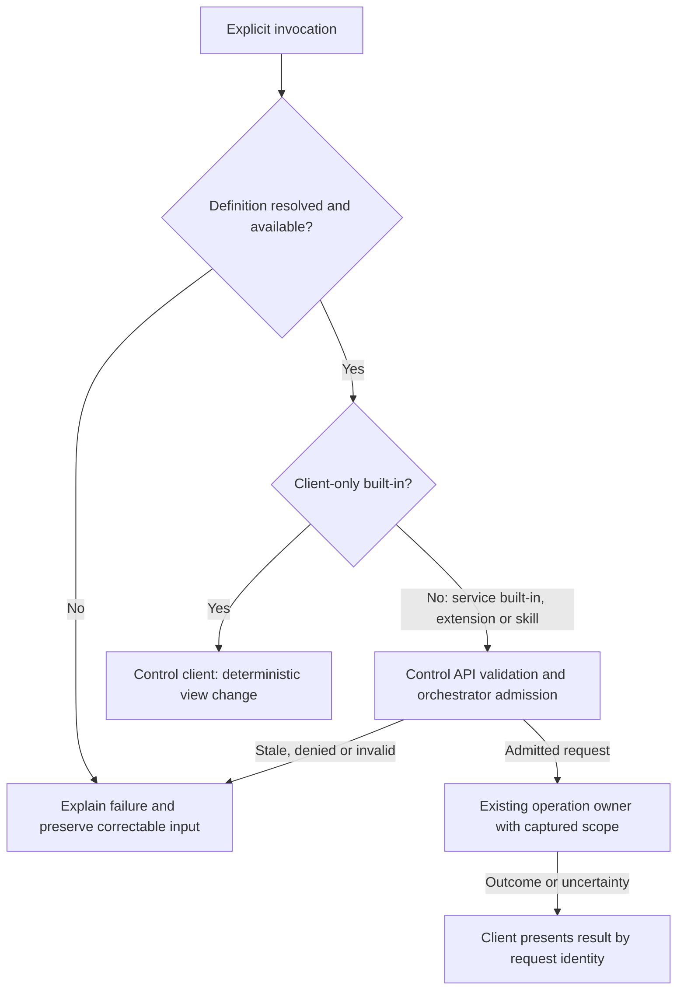
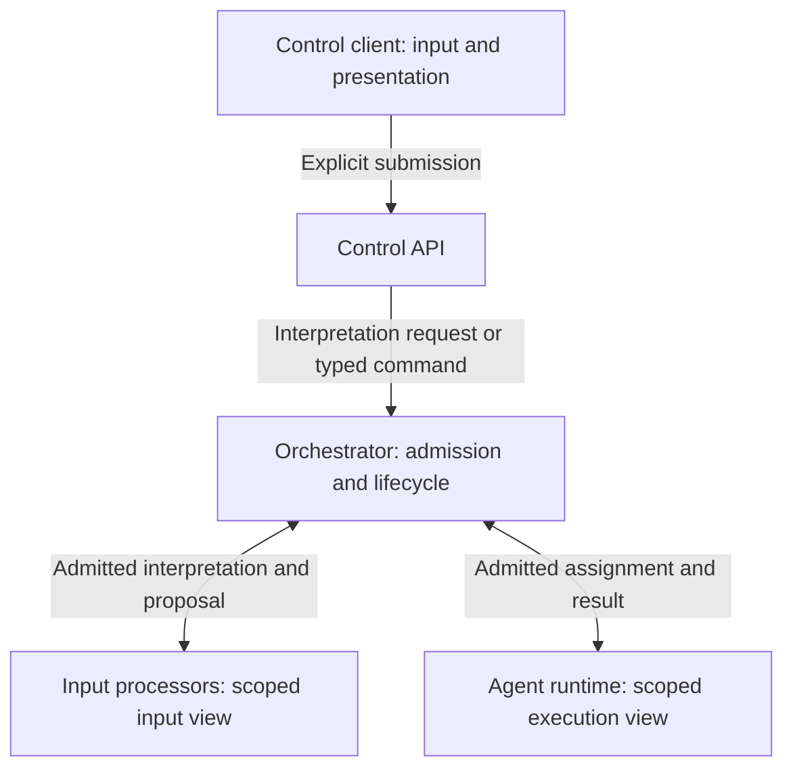
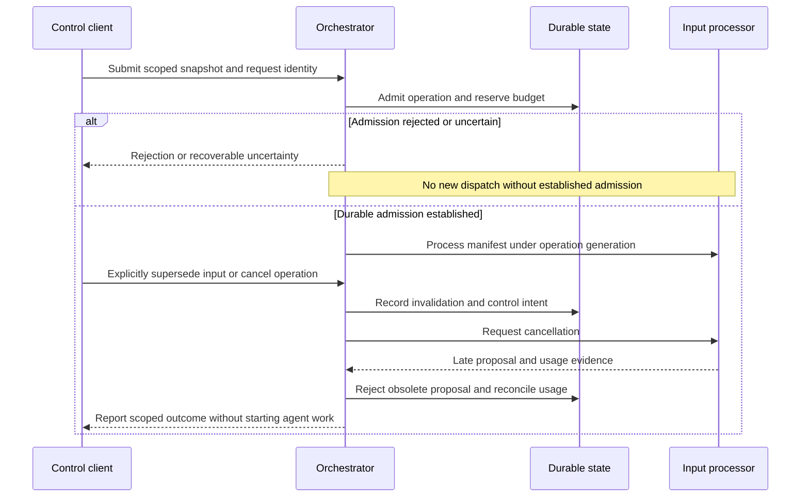

# Interaction and extension boundaries

Status: design brief recorded on 2026-09-24. Intuitive interaction, three in-chat
command categories and support for the named integrations are required.
Agent Plugins are later work. Separating
input context and processors from orchestration is a thought experiment, not a
selected mechanism. This brief does not authorize implementation.

## Scope and intent

The interaction must follow how the user expects to work. The user must not need
to understand the orchestrator, agent topology or processing stages to express
an objective, follow progress, correct a misunderstanding or stop work.

Detailed chat design is deferred to the forthcoming D6 interaction work. This
brief records its goals and architectural questions without selecting controls,
screen layouts, conversational gestures or an additional conversational agent.
The [TUI prototype plan](tui-interaction-prototype.md) governs the isolated
experiment informed by Wisp's spacing and input layout. Its
[implementation packet](../plans/tui-prototype-implementation.md) records the owner's
authorization, implemented scope and validation evidence. That authorization does
not select production command mechanisms or establish production runtime behavior.
[W6](product-workflows.md#w6-navigate-projects-and-concurrent-activities) remains
the contract for moving among projects and activities in one interface.

AGENTS.md, Agent Skills, MCP and LSP support are product requirements. The owner
selected runtime AGENTS.md support for I2 and Agent Skills for I3, both in the
first I4 release, on 2026-09-25. Nested instruction applicability, skill
activation, provenance, conflict and invalidation contracts remain D4 work.
MCP first ships in I6 with local stdio server transport. Remote HTTP transport
requires a later profile. Its first profile includes tools, resources and
prompts. Tool calls use ordinary admission. Resource and prompt content enters
context only with source identity, version and activation provenance. An MCP
prompt does not automatically become an in-chat command or grant authority.
D4 must define discovery, activation, invalidation and conformance. LSP
support enters I2 and the first I4 release. The owner selected Rust and Swift
as the first qualified LSP languages on 2026-09-25. Their servers come from
explicitly configured, identity-checked installed toolchains. A missing or
mismatched toolchain makes that LSP capability unavailable; it cannot trigger
an ambient `PATH` fallback or a project-selected executable. D4 must define
the exact identity, configuration and conformance checks. Agent Plugins are
explicitly later; no plugin ecosystem or package format is selected. The
remaining requirements do not silently expand the selected I4 first-release
scope.

This is Asura runtime support. The repository's
[Codex development configuration](repository-agent-configuration.md) does not
provide or select that runtime support.

## Interaction goals for D6

Required behavior, to be made measurable before implementation:

- Keep the user's objective, destination and progress understandable while work
  continues across projects. Internal pipeline stages need not become user modes.
- Allow the user to express intent, clarify it and correct its interpretation.
  Define when a message requests new work, revises work or only discusses it.
- Support multiline composition and dynamic controls, status and information
  around the input pane. Preserve draft editing and focus as surrounding content
  changes; an arriving decision must not reinterpret ordinary typing as an answer.
- Preserve drafts and scoped pending decisions during navigation and reconnect
  under W6. Do not infer a new execution target from the currently visible view.
- Explain uncertainty and meaningful consequences before taking an ambiguous
  action. Ask for missing information only when it changes the result or authority.
- Keep explicit status and cancellation controls available during slow or failed
  interpretation. Natural-language convenience cannot be their only route.
- Make relevant instruction sources and enabled capabilities inspectable. Expose
  details when they help the user understand or change behavior.

D6/D7 must evaluate representative journeys with users, including first use,
follow-up correction, concurrent work, interrupted work and recovery. Define task
completion, interpretation-error, recovery and latency measures before evaluation.
Record usability evidence separately from automated conformance and model quality.

## In-chat commands

**Required behavior:** The owner specified three categories on 2026-09-24:
**built-ins**, **extensions** and **Skill-based** commands. These categories describe
the source and meaning of a command, not different levels of authority. Command
delivery scope and most syntax remain open; the extension prefix `/ext:` is
selected. This requirement does not add command execution to the isolated TUI
experiment.

The [selected isolated TUI command trial](tui-command-discovery.md) refines names,
completion, multiline editing and invocation flows for the prototype. Its
validation does not select production mechanisms or limits. This brief remains
the canonical category and authority contract.
The [production command-system proposal](command-system.md) defines the logical
catalogue, resolution, admission and recovery contract for joint review.

| Category | Meaning | Required boundary |
| --- | --- | --- |
| Built-ins | Commands supplied by Asura for its supported interactions | Deterministic editing, navigation and presentation belong to the client. Commands affecting service-owned work use the shared control contract and ordinary admission. |
| Extensions | Explicit command definitions contributed by supported sources, including Asura-shipped feature modules | A contribution declares a user-invocable work operation. It does not register a parallel executor or grant authority. Existing owners handle its context, tool and lifecycle behavior. |
| Skill-based | Explicit user invocation of an Agent Skill through chat | Select and activate scoped instructions with provenance. A skill is not an executable command body or a permission grant; its scripts and tool requests use ordinary admitted execution. |

Extension commands do not require Agent Plugins. Plugins remain a later possible
delivery mechanism; D4 must define supported command contribution sources.
An MCP tool, resource or prompt does not automatically become an in-chat command.
An explicit command definition and its supported mapping are required.

The categories must remain distinguishable during discovery and invocation.
Presentation must identify the supplying source and the intended target where
applicable. A friendly command name cannot substitute for definition identity,
provenance, current authority or the revision checks required by its operation.
Selecting a skill does not imply that its optional scripts run immediately.

### Ownership and language boundaries

Required ownership follows the [architecture](../architecture.md#control-and-execution-boundaries).
This table does not select new registries, executable formats or transports.

| Behavior | Canonical owner |
| --- | --- |
| Editing, local navigation, command discovery presentation and user selection | Control client |
| Validation and authorization at the service entry boundary | Shared control API |
| Admission, request identity, task lifecycle, scheduling and shared budgets | Orchestrator |
| Skill loading, instruction composition, provenance and invalidation | Context subsystem, reusing configuration discovery where applicable |
| Tool definitions exposed to clients and agents | Canonical tool registry |
| Execution of assigned work and requests to use tools | Agent runtime |
| Resource access and enforcement of current grants | Host services |

The Rust Ratatui client and Rust chat backend are selected. The backend remains
part of the shared per-user service. A command category does not create another
service or grant the client authority over agent execution. The
[language allocation](../plans/architecture-and-design.md#proposed-language-ownership)
proposes Rust for the context and execution owners, and Swift for Foundation Models
and native platform adapters. Those remaining allocations and IPC/FFI boundaries
require D2 design. Any Swift model operation supplies a bounded result to its
admitted owner; it cannot interpret a command into an authorization grant.

### Command routing boundaries

Requirement view. Arrows show the permitted routing of an explicitly invoked,
resolved command. Name resolution and wire schemas remain open. The admission
node represents the existing control API and orchestrator handoff, not a new owner.
Unknown, ambiguous or unavailable definitions cannot reach dispatch.

For skill activation, the operation owner is the context subsystem; its result
includes the scoped instruction manifest. Subsequent scripts or tool calls require
ordinary tool admission and host enforcement. Client-only built-ins do not require
service availability. No command category requires model interpretation merely to
route an explicitly selected definition.

The [submission and reconnect sequence](../architecture.md#asynchronous-submission-and-reconnect)
owns service acceptance, events and unknown outcomes. Command invocation cannot
bypass that lifecycle or silently retry uncertain effects. W6 owns target capture
through project navigation. D3/D4 must refine command data and activation states
before implementation; this brief selects neither schemas nor durability points.

### Decisions required before command implementation

- **D6 syntax and discovery:** Select invocation syntax, literal-text escaping,
  completion, help, source labels and keyboard interaction. A slash prefix is an
  option, not a selected requirement. Typing or browsing a command must not execute it.
- **D3/D4 definitions and collisions:** Select canonical catalogue/resolution
  ownership, definition identity and versioning, contribution validation, name
  collisions, namespaces and override rules. No resolution policy is selected here.
- **D3/D6 targets and arguments:** Define argument schemas, bounds, validation and
  correction. Specify target capture and required revisions for each operation;
  navigation must not retarget an invocation already captured for another project.
- **D3/D4 invocation and admission:** Define the messages, activation lifetime,
  cancellation, idempotency and recovery contract for each category. Resolve skill
  activation before a task exists through the same pre-task admission design as
  input interpretation; the category does not create an unmetered lifecycle.
- **D4/D6 availability and failure:** Define behavior for missing, disabled,
  incompatible, revoked or changed definitions, disconnected services and invalid
  skill sources. Preserve recoverable input and explain the reason without silently
  selecting another command, skill, target or execution path.

## Proposed separation

The thought experiment separates three logical responsibilities. It does not
select three processes, queues, models or independently authoritative services.
It could let interaction and context preparation evolve without changing agent
execution. The tradeoff is another versioned handoff, with possible latency,
failure and recovery costs. Those costs need evidence before selecting a pipeline.

| Responsibility | Proposed contract | Existing owner retained |
| --- | --- | --- |
| Interaction and input preparation | Capture a scoped input snapshot; interpret it and propose an intent or clarification | Client owns presentation; context subsystem owns evidence and effective input; on-device decision subsystem owns model-assisted interpretation |
| Command admission and orchestration | Validate an explicit command, record acceptance, schedule work and report its lifecycle | Control API, orchestrator, policy and host services retain their documented responsibilities |
| Agent execution | Work on an assigned objective using an authorized context view and available capabilities | Agent runtime, context subsystem, canonical tool registry and host services |

Here, **input context** means the evidence available to interpret a particular user
submission. It is distinct from a project context and an execution model session.
The **instruction pipeline** remains an open term: D3/D4 must distinguish composing
model guidance from validating executable control commands. Instruction text is
not itself an admitted command or a capability grant.

### Logical boundary proposal

Proposed logical responsibilities. Arrows show data or control flow, not selected
deployment boundaries. Admission applies to interpretation operations as well as
agent work. Ordinary status and cancellation do not depend on a processor result.
Both processor and execution views come from the canonical context subsystem.

The graph's admission edges reuse the
[harness lifecycle](core-harness-brief.md) and
[policy boundaries](security-policy-brief.md). They do not move host enforcement
into the orchestrator or let processors directly schedule agents. Effect execution
and event delivery use those existing contracts and ADR-0006; they are omitted
here to focus this view on the proposed responsibility split.

### Conditions on any selected mechanism

Required constraints from the current contracts:

1. Pure local editing and presentation remain client work. Model inference,
   retrieval, server startup and tool calls remain governed operations. Typing
   alone must not initiate these operations under the current submission contract.
2. Each submitted snapshot records its origin, principal, intended project and
   working location where applicable, draft revision and instruction/evidence
   provenance. D3/D4 must define identities, limits and invalidation semantics.
3. Processors return proposals or clarification needs. Model output, a skill or a
   server response cannot approve an action, expand a budget or change task scope.
4. Context assembly has one canonical owner. Input and execution views may differ,
   but both account for all effective inputs, retained history and transformations.
   Reusing evidence requires authorization and provenance; it does not permit
   shared model-session state across tasks or principals.
5. D3/D4 must define an admitted task/lifecycle for interpretation before a user
   task exists. Until resolved, pre-task model processing is not implementation
   ready. A client-owned, unmetered model loop would violate the
   [outer-loop requirement](core-harness-brief.md#result-handling).
6. Admission and result acceptance must fence changed authority and invalid
   generations. A validity check followed by an unprotected effect is insufficient.
   Discarding a stale answer must still preserve usage and uncertain-effect evidence.
7. Bounded queues, cancellation, deadlines, shared budgets, durable acceptance and
   recovery follow [ADR-0006](../decisions/0006-async-event-pipelines.md). A slow
   processor must not block control or cause blind retries after an unknown outcome.

### Interpretation invalidation proposal

Proposed sequence for a submitted input whose interpretation becomes invalid.
Arrows show requests and results. D3/D4 must specify the atomic guards and exact
durability points. A view switch alone does not invalidate submitted work.

Draft editing after submission does not silently revise a task. D6 must define an
explicit correction interaction using D3's revision/control semantics. Unresolved
usage stays reserved until reconciliation; processor loss does not prove zero use.

## Required integrations and ownership

Protocol and format sources below were inspected on 2026-09-24. They describe
external capabilities, not Asura's conformance. D4 must pin supported versions,
subsets and deviations before implementation; no SDK, server or transport is chosen.

| Integration | Product purpose and source | Asura design responsibility |
| --- | --- | --- |
| AGENTS.md | Project and nested directory guidance in Markdown; [format guidance](https://agents.md/) | Reuse configuration discovery/provenance and context assembly. Define target-path applicability, precedence, conflict handling, unreadable files, links and change invalidation explicitly. Do not assume every harness has identical rules. |
| Agent Skills | Reusable instructions with metadata and optional scripts/resources; [format specification](https://agentskills.io/specification) | D4 defines discovery, progressive loading, explicit/assisted selection and versioned activation. Context owns loaded evidence; execution of scripts uses ordinary admitted tools. Metadata never grants permissions. |
| MCP | Server-provided tools, resources and prompts; [2026-07-28 specification](https://modelcontextprotocol.io/specification/2026-07-28) | Adapters normalize protocol data into the canonical tool registry and context subsystem. D3/D4 define supported interactions, credentials, server lifecycle, cancellation and recovery. |
| LSP | Language-aware navigation and analysis; [protocol overview](https://microsoft.github.io/language-server-protocol/) | D4 defines language-server lifecycle, capability negotiation, workspace/document identity and versioned results. D1 defines confinement. Proposed edits must use the ordinary authorized write path. |
| Agent Plugins, later | Packaging and composition of capabilities; ecosystem and format remain open | Reuse existing owners for contributed instructions, skills, servers and tools. Design installation, update, compatibility, removal and revocation before enabling packages. |

The table assigns design duties to existing components. It does not create five
parallel execution systems. In particular, the harness already requires one
[tool registry](core-harness-brief.md#model-decision-contracts); integration
descriptors and model/UI tool views must use it.

Treat supplied instructions, skill content, tool descriptions and server output
according to their provenance and trust. They cannot replace service policy or
host enforcement. Discovery and loading need explicit access, size and recursion
bounds; resolving linked material cannot escape the admitted scope.

Server startup and an apparently read-only query can involve processes, files or
network access. D1/D4 must constrain actual server effects. Credentials and source
data must not be sent to a remote server without the applicable disclosure grant.
Unsupported callbacks or capabilities must fail explicitly without hidden fallback.
These constraints also cover background indexing, unsolicited callbacks and
shutdown; enforcement cannot depend on a visible user tool invocation.

The initial source-read-only boundary also applies to skill scripts, MCP tools and
LSP requests. Language-server edit requests cannot bypass it. Explicitly granted
scratch/generated-output writes remain distinct from permission to edit source.
Document versions must distinguish persisted files from unsaved buffers so that
stale diagnostics or edit proposals cannot attach to a different revision.

## Open decisions and alternatives

- **D0/D6:** Must a conversation span projects, or does a global interface navigate
  project-scoped conversations? The [domain draft](domain-model.md) currently
  proposes one project context per conversation. W6 does not select a global
  transcript. Sharing a visible conversation would still not permit sharing
  execution authority or retained model state.
- **D2/D4:** Are processors deterministic transformations, model operations or a
  composition? Keep these logically separable; do not require a model for every
  submission. D2 selects deployment only after ownership and latency are known.
- **D3/D4:** How is interpretation admitted before a task exists? Define budget
  ancestry, control identity, durability, cancellation, recovery and session scope.
  Selecting a new service-operation lifecycle would require updating the governing
  harness design first; this brief does not select that alternative.
- **D3/D4:** Which snapshot parts persist, for how long, and with what deletion,
  replay, cache and audit rules? Define pipeline versions and bounded processing
  stages, including invalid output, partial failure and unavailable capabilities.
- **D0/D4:** Define integration conformance profiles for the selected I6 MCP
  tools, resources and prompts.
  Agent Plugins remain later. D4 must identify and qualify specific installed
  Rust and Swift language servers; protocol support does not imply support for
  every server.
- **D6/D7:** Define correction, clarification and capability discovery interactions.
  Compare a deterministic submission path with optional model interpretation using
  the same journeys. Select latency/quality/resource limits from recorded evidence.

## Validation obligations

These are design cases, not tests that have run. D7 must split independent fault
variants into executable IDs. Unit, integration and end-to-end evidence are all
required for each delivered behavior; usability and real-model evaluations add
distinct evidence.

### IX1: Interpretation ownership and correction

- **Initial state:** A submitted input has an admitted processor operation; another
  project has active agent work. The client also has an unsubmitted draft.
- **Trigger:** Independently supersede, cancel, revoke authority, change an input
  source, navigate away, or stall the processor. Deliver late output and usage.
- **Required result:** Invalid output cannot start or redirect work. Navigation
  alone preserves submitted scope. Status/cancel remain responsive, the draft
  creates no effects, and usage is settled or retained for reconciliation.
- **Unit:** Snapshot identity, revision/generation guards and budget accounting.
- **Integration:** Race invalidation against dispatch/result acceptance, inject
  processor loss and restart around durable admission with the real store. Race
  replay against the handoff from interpretation to command acceptance; preserve
  request identity without duplicate tasks. Inspect effective manifests and
  generations to prove session isolation, not only the text of model answers.
- **End-to-end:** Correct or cancel from real chat while other work continues;
  reconnect and inspect scope, progress and resource accounting.
- **Environment:** Supported macOS, actual service/store/control clients and real
  on-device inference for session isolation and model-quality claims.

### IX2: Instruction and skill scope

- **Initial state:** Two project trees contain nested AGENTS.md and skills with
  instructions, linked material and optional scripts.
- **Trigger:** Cross directory boundaries; change, remove, corrupt or replace a
  source during loading. Supply hostile instructions and unauthorized tool claims.
- **Required result:** Use the designed applicable sources with recorded versions.
  Reject unstable or inaccessible applicable inputs under the selected contract.
  No sibling leakage, authority expansion or script execution from discovery alone.
- **Unit:** Format, precedence, scope, reference limits and invalidation rules.
- **Integration:** Real filesystem races, canonical context assembly and tool admission.
- **End-to-end:** Inspect active guidance, invoke a permitted skill and explain
  unavailable or rejected capabilities without losing the user's task.
- **Environment:** Real macOS filesystem and confinement; compatible skill fixtures.

### IX3: Protocol and package boundaries

- **Initial state:** Registered MCP/LSP servers expose permitted and denied
  capabilities. Plugin variants apply only when plugin delivery is selected.
- **Trigger:** Independently exercise malformed messages, version mismatch, slow
  response, crash, unknown outcome, stale document result, denied edit, attempted
  egress and server/package replacement or revocation.
- **Required result:** Preserve tool/context identity and current authority. Do not
  blindly replay uncertain effects, accept obsolete output, or widen access.
- **Unit:** Protocol mapping, versions, retry classification and capability filters.
- **Integration:** Real server processes, credentials/disclosure boundaries, OS
  confinement and recovery. Test actual package update/removal when delivered.
- **End-to-end:** Use supported capabilities from chat and CLI, explain failure,
  and recover without changing task scope or writing protected source.
- **Environment:** Pinned compatible servers and supported macOS. Remote servers
  and plugin fixtures are additionally required for those claimed capabilities.

### IX4: In-chat command categories and admission

- **Initial state:** Two project contexts expose built-ins, an extension command
  and a skill invocation. Include a client-only built-in, a service built-in and
  definitions with colliding names or unavailable sources.
- **Trigger:** Discover and invoke each category. Independently change its target
  revision, definition or authority after selection; navigate before delivery;
  supply invalid arguments; disconnect or restart around service acceptance.
- **Required result:** Identify category, source and applicable target. Client-only
  controls create no service work. Other invocations reach their canonical owners
  through admission. Reject invalid or stale requests without effects or silent
  substitution. Preserve input for correction and reconcile uncertain outcomes by
  request identity. Skill activation records scoped instructions and grants no
  additional capabilities; optional scripts cannot bypass tool admission.
- **Unit:** Category classification, selected syntax and argument validation,
  definition identity, collision policy, target/revision guards and failure states.
- **Integration:** Actual contribution loading, skill/context assembly, control API,
  tool admission and durable request handling. Race revocation and definition changes
  against admission; prove that repeated delivery does not duplicate effects.
- **End-to-end:** Discover all three categories in real chat, inspect source and
  target, invoke them across project navigation, correct failures and reconnect.
  Verify extension commands with no Agent Plugin package installed. Exercise a
  permitted skill tool request and a denied script request without losing the task.
- **Environment:** Supported macOS, real client/service/store and supported
  extension/skill fixtures. Claims about script confinement require actual host
  enforcement; fixtures alone do not establish it.

IX1 also needs D6 usability evaluation of misunderstanding and recovery. IX2–IX4
need capability-discovery and explanation evaluation. D7 must record scenario
sets, thresholds, versions and residual limitations before claiming intuitive UX.

## Documentation verification on 2026-09-24

Before the command taxonomy addition, an independent read-only review found no
material ownership, scope, recovery or traceability issues. Mermaid CLI 11.16.0
rendered both diagrams. Both were visually inspected; the boundary overview was
simplified to remove overlapping labels.
All 269 local Markdown links and anchors across 28 documents passed, as did
whitespace checks and `git diff --check`. Previews stayed outside the repository.
These checks validate documentation only. No implementation, protocol conformance,
runtime tests, model evaluations or usability studies were performed.

For the command taxonomy addition, Mermaid CLI 11.16.0 rendered all three diagrams.
The new command-routing view was visually inspected after simplifying its layout.
All 13 local links and anchors in this document passed. Whitespace and
`git diff --check` passed; generated previews remained under temporary storage.
IX4 defines future acceptance obligations. No in-chat command implementation or
runtime validation was performed for this addition.
