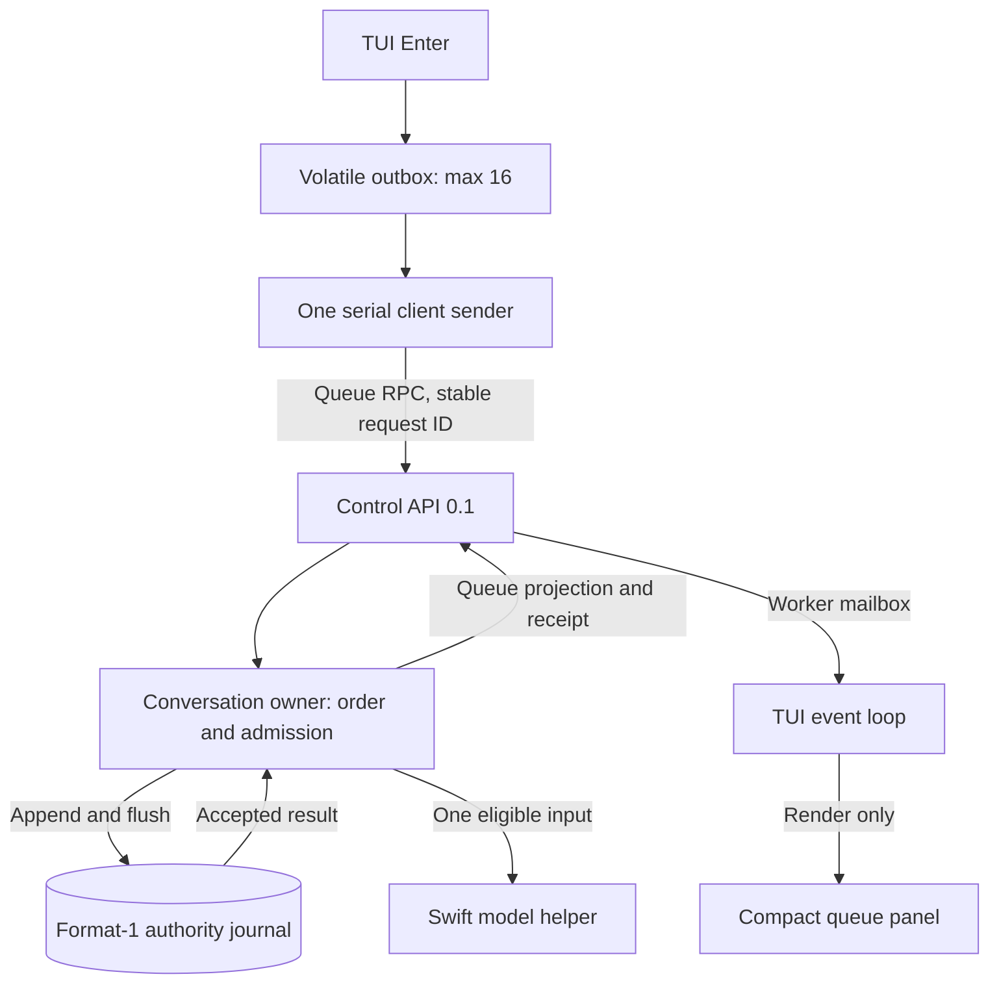
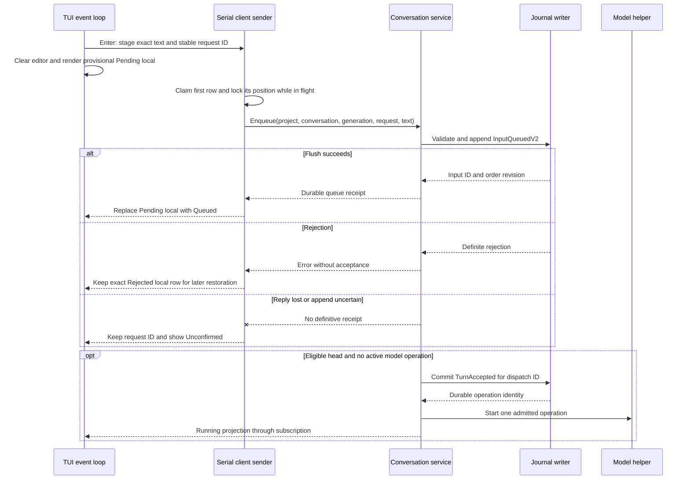
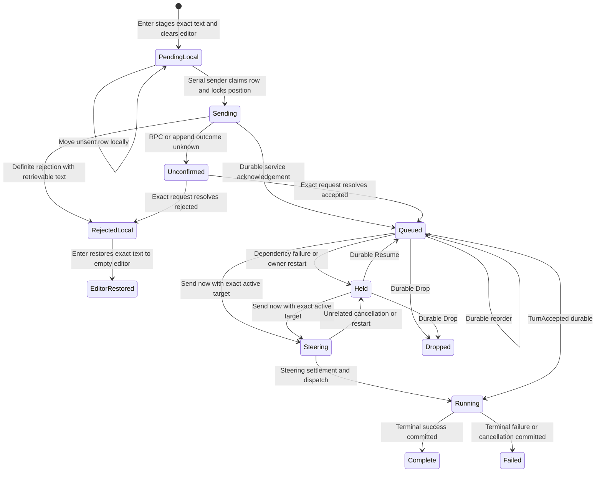
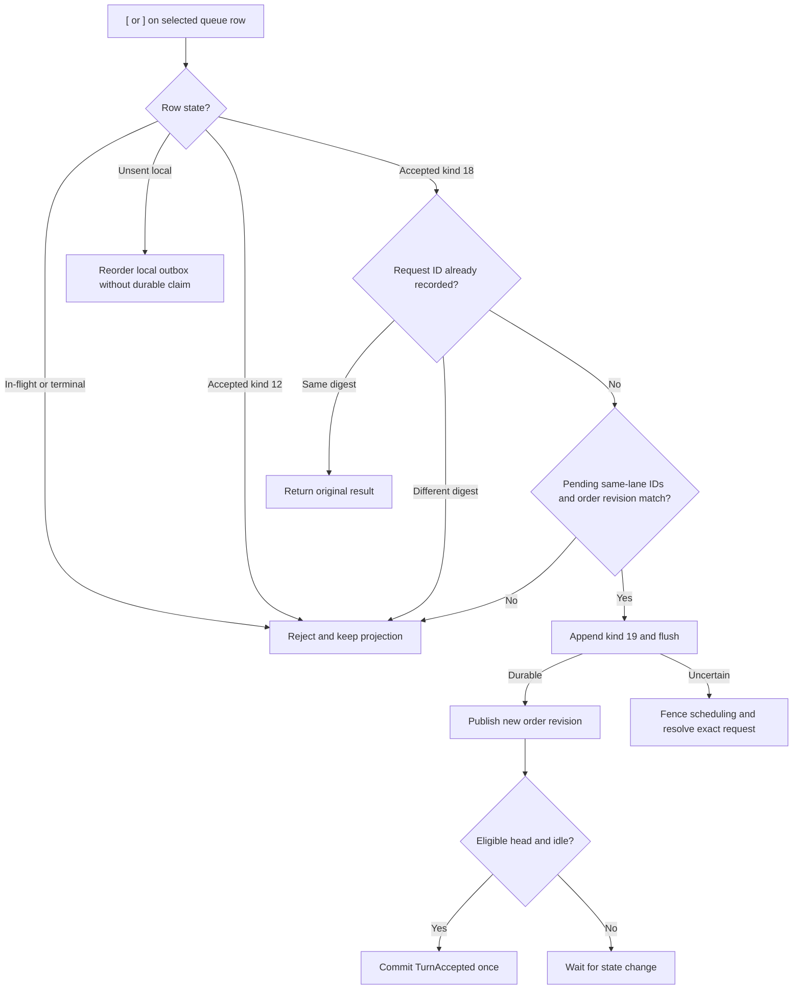

# Managed conversation input queue

Status: selected design for the owner's 2026-09-29 queue instruction. Codec,
authority, service and TUI implementation are integrated. Focused unit,
service and isolated lifecycle/PTY checks passed; the full validation matrix
below remains open. Protocol number remains
0.1. Journal format remains 1. The existing [IQ1 and IQ2 contracts](conversation-admission.md#durable-input-queue-iq1)
govern legacy records and steering settlement. This document replaces their
busy-only and direct-idle submission rules for new conversational input.

## Required behavior and scope

Every conversational message enters a managed input queue before model admission.
The TUI accepts Enter without waiting for a backend response. A sender consumes
its pending local outbox sequentially. The service durably accepts each message,
then its existing conversation owner selects one eligible message for dispatch.
The user can move an undispatched message within its conversation queue. The user
can select one to send now while an operation is active. The queue appears in a
compact panel above the composer.

Built-in commands, configuration changes and project selection remain control
operations. Slash text recognized as a command does not enter the conversation
queue. A literal slash message follows the existing escape or quoting rule.
This packet does not add a generic job scheduler, another process, multiple
simultaneous model operations or automatic execution after uncertain recovery.

The old IQ1 sentence “Existing idle Submit ... remain unchanged” and its
active-target requirement conflict with this instruction. The owner explicitly
replaced them. The old IQ1 predecessor chain based on immutable enqueue order
also cannot define the new reorderable order. New records use this contract;
replay of old records retains their original dependency meaning. IQ2's atomic
promotion, exact target validation, cancel-and-replace behavior and prompt size
limit remain in force.

## Ownership and process boundaries

| Owner | Responsibility |
| --- | --- |
| Rust TUI | Draft editing, volatile pending outbox, focus, reorder interaction and service projection |
| Rust control client worker | Serial RPC delivery, exact retry identity and bounded result delivery |
| Rust conversation service | Project/conversation checks, queue ordering, fair selection, admission, steering and events |
| Rust storage authority writer | One format-1 journal, flushed queue mutations, replay and request lookup |
| Swift model helper | One admitted model operation at a time; no queue mutation or scheduling |

The TUI outbox is a staging area, not an authority record. Its `Pending local`
rows are visibly different from service-acknowledged `Queued` rows. A crash can
lose local rows, including text removed from the editor when Enter stages it.
The TUI labels this state provisional and never claims durable acceptance.
At local outbox acceptance, Enter copies the exact text and request ID into a
row, then clears the editor immediately. If the outbox is full, the editor
retains its text. A definite service rejection keeps the exact text in a
`Rejected local` row. Enter on that row restores it into an empty editor;
when the editor contains a newer draft, the row stays retrievable until the
user clears or submits that draft. The client never overwrites newer text.
Once the service acknowledges an input, only service state determines its position and
outcome. A client disconnect cannot drop it. The render path only reads immutable
projections. It performs no socket, file, model or blocking lock operation.

### Ownership view — selected design

Arrows show requests and event delivery. The service alone starts model work.

## Identity, order and mutation contracts

An `input_id` is a service-generated nonzero 16-byte ID. The client supplies a
stable nonzero 16-byte `request_id`. Its digest covers project ID, optional
conversation ID, expected conversation generation, exact UTF-8 prompt bytes and
the explicit new-conversation intent. The service returns the same input ID for
an exact retry. Reusing an ID with different fields is a conflict. Prompt bytes
are never normalized. One input has one internal dispatch request ID and at most
one accepted model operation. The existing 32 KiB prompt limit applies.

The first queued message for a new conversation allocates its conversation ID
in the same durable `InputQueuedV2` record. Its generation is zero until first
`TurnAccepted`. Later queued messages name that conversation. The service rejects
an unknown, cross-project or stale conversation. The first enqueue requires an
explicit empty restoration result or `/new` intent, not a guessed absence of
history. A selection change fences unsent local requests. A service-epoch change
discards stale projections and resolves an in-flight request by its exact ID.
Replay tracks a generation-zero provisional conversation separately from
accepted-turn history.
Later messages may name that provisional conversation with generation zero and
`new_conversation = false`; the service verifies its durable project and lane
identity. They do not allocate another conversation. After a turn is accepted,
the service permits another queue input for the same conversation when the
client's observed generation lags that accepted turn. This queues future work;
dispatch still uses the current generation and complete history.
Only one undispatched new-conversation lane per project is allowed in this
slice. `/new` rejects while that project has unresolved queued inputs. On
relaunch, a queue snapshot identifies that lane before a new submission; the
TUI selects it if it is newer than the latest accepted turn. The service still
validates the generation. This extends the restoration contract without
mistaking a historical terminal queue row for a current cursor.

The queue has one ordered lane per conversation. Reorder moves one `Queued` or
`Held` kind-18 input after a named kind-18 pending input in that same lane; an absent predecessor
means the front. The predecessor cannot be the moved input. Running, terminal,
promoted steering and in-flight local entries cannot move. Unsent local rows
may change position before the sender claims them. Kind-12 legacy entries
cannot move or serve as reorder anchors until a separate migration contract
has been designed and tested. In a mixed lane, unresolved kind-12 entries
stay ahead of kind-18 entries; a kind-18 move cannot cross them. A successful reorder
does not modify prompt, input ID, dispatch ID or conversation generation. It
changes only future selection order. It cannot preempt a dispatch already
committed as `TurnAccepted`.

The client sends `input_id`, optional `after_input_id`, stable mutation request
ID and `expected_order_revision`. The storage writer checks all identities and
revision under its serialized owner, then appends and flushes one `InputReordered`
record. The queue-specific order revision increases by one for each committed
enqueue, reorder, drop, resume, promotion or dispatch. It never wraps. A stale
revision returns the current bounded projection; the client keeps selection and
can offer a fresh user-directed move. An uncertain append keeps the same request
ID and digest for resolution; no local optimistic order is presented as durable.
The reorder digest covers command kind 19, input ID, optional predecessor ID
and expected order revision in that order. It excludes request ID and resulting
revision. A position-preserving move still records its request result and
advances the revision, so exact retries remain stable.

Existing kind-12 `InputQueued` requires an active operation and immutable
predecessor. The new idle-capable payload cannot reuse that kind. Reserve
kind 18 for `InputQueuedV2` and kind 19 for `InputReordered`. Kind 18 contains,
in order, request ID, request digest, input ID, dispatch request ID, project ID,
conversation ID, expected generation, new-conversation flag, exact prompt and
initial order revision. The new-conversation flag requires an unused generated
conversation ID and expected generation zero. Existing-conversation records
require a registered conversation and matching expected generation. Kind 19's
canonical binary payload is
request ID, request digest, input ID, optional predecessor input ID, expected
order revision and resulting order revision. Replay rejects a missing input,
wrong lane, non-pending predecessor, changed request digest, revision gap,
duplicate ID or impossible order. Existing records are not rewritten. Extend
the version-0.1 Protobuf envelope with unused field numbers for a typed reorder
request and reply; add `order_revision` to queue projections. Do not reuse the
existing journal `revision` as an order revision. Add distinct
`ConversationQueueSubmit` and `ConversationQueueReorder` envelope operations at
unused field numbers 53 and 54; keep the existing target-bearing
`ConversationEnqueue` intact for exact legacy retries. Submit returns the common
queue reply with input ID, conversation ID and order revision. Reorder returns
the common queue reply with the committed order revision. Add `stale_order`
to that reply: a stale reorder returns `stale_order = true` and the current
bounded queue projection with its current order revision. A successful reorder
returns `stale_order = false`; old replies may omit it. Reject malformed
optional fields before admission.
New Submit and Reorder replies carry the full bounded same-project projection.
Submit also returns `accepted_input_id` so the client can correlate its local
request with one projected entry; an absent or mismatched identity rejects the
reply. Exact legacy replies retain their existing one-entry shape.
Keep each entry's `sequence` as its immutable journal acceptance sequence for
history-baseline detection. Add a separate `order_position` to queue entries for
new records. The service returns new pending entries in their committed order;
the TUI uses `order_position` for presentation and move anchors. Legacy entries
keep their sequence order and have no `order_position`.

The queue keeps at most 16 unresolved service inputs across all projects, each
at most 32 KiB. The client outbox keeps at most 16 local pending inputs and one
RPC in flight. Full capacity rejects a new Enter visibly and retains the draft.
The service never acknowledges before its journal flush. The existing 64 KiB
frame and 8 MiB journal caps remain; capacity or storage exhaustion rejects
without losing an earlier accepted input. The client removes only the outbox
row whose identity received a durable acknowledgement. It does not clear the
editor again. Subsequent editing creates another draft identity and is never
cleared by a late reply.

## Scheduling, dependency and steering

The service retains its single active model operation. When that operation
settles, the conversation owner selects one eligible lane head. It rotates among
project/conversation lanes that have eligible heads, starting after the lane last
dispatched. Within a lane, order is the last durable order. A held head blocks
later items in that lane until the user resumes or drops it; other lanes can run.
No operation from a lane runs concurrently with another operation from that
conversation. Model reservation, current configuration and complete-turn history
are checked only at dispatch. A queued input has no reserved model budget.

If the preceding operation in the same conversation fails, is cancelled or has
unknown settlement, queued successors become `Held`. Reordering does not erase
that hold cause. Explicit Resume clears the selected hold through IQ1's durable
decision. Dropping a held head lets the next item become selectable only when
its dependency is safe; otherwise it remains Held and needs its own Resume.
These rules prevent a move from silently treating failed work as completed.

The existing IQ2 `Send now` action may select a `Queued` or `Held` input only
while an exact operation in the same conversation is active. The service
atomically promotes that input to Steer, checks the combined 32 KiB prompt,
then requests cancel-and-replace. The TUI says this stops and restarts the
response. If no active operation exists, `Send now` moves the item to the front
with a reorder request; it does not create a steering cancellation. A stale
target, conflicting steer or already dispatched input rejects and preserves
the queue. The TUI never implements steering as Drop plus a second Enqueue.

### Admission and delivery — selected design

Arrows identify the durable acknowledgement and dispatch boundary.

### Input state — selected design

Arrows name accepted actions or observed outcomes. `PendingLocal`, `Sending`
and `RejectedLocal` are client-only.

## Failure, restart and async limits

The client sender uses the existing one-slot queue transport worker. It holds
one in-flight request until a definitive reply or exact resolution. It does not
send later local inputs while an earlier outcome is uncertain; this preserves
the user's observed ordering. It uses the existing two-second RPC operation
deadline and five-second observation budget. A timeout reports Unconfirmed and
retains the worker slot until settlement. Idle rendering, editing, project
navigation and quit remain responsive under a stalled service. Exit leaves
durably accepted inputs in the service. Exit with pending local inputs warns
that they were not accepted; it does not silently label them queued.

The service uses the existing eight-slot journal worker and one bounded
scheduler transition per reactor cycle. Filesystem replay, append and prompt
read remain on the worker. The service never performs them in its reactor.
The scheduler pauses on uncertain journal state; cancellation/status retain
reserved capacity. A crashed owner replays accepted inputs and order mutations.
It holds undispatched inputs from a prior owner generation until explicit
Resume, as IQ1 requires. A recorded `TurnAccepted` resolves to the same operation
and is never dispatched twice. A missing journal or graph binding does not
create a replacement queue. A queue subscription gives a bounded projection;
the TUI fences it by project, service epoch and order revision.

For fairness, the scheduler selects each continuously ready lane once before
selecting any ready lane a second time. A lane leaves this set when its project
becomes unavailable or its head becomes Held. This is a scheduling invariant,
not a latency promise:
one model call may occupy the service for its existing 60-second deadline.
The queue panel shows at most four unresolved rows and an overflow count. It
uses the existing padded grey-blue panel style, bounded 256-byte excerpts and
explicit local, queued, held, steering, rejected and unconfirmed labels. Up
from the first editor row enters queue focus; arrows select a row. Enter sends
an accepted row now. While queue focus is active, `[` moves the selected
movable row one position up and `]` moves it one position down. These plain
characters work in terminals that do not report modified arrow keys. Hints
show `[ move up · ] move down`; `/help` spells out the same keys. An in-flight
row shows `Sending` and rejects either move. Enter on a rejected local row
restores its exact text into an empty editor. The panel closes when empty.

### Reorder and recovery — selected design

Arrows show exact-request and revision checks. The committed order is authoritative.

## Security and proof limits

The control API authenticates the attaching OS user and verifies project scope
before enqueue, reorder, inspect, resume, drop or promotion. IDs and excerpts
do not authorize cross-project access. An invalid foreign ID returns the same
non-disclosing error as an unknown ID. The service stores prompt text only in
the existing protected authority journal. The TUI does not write another queue
file. The Swift helper receives only an admitted prompt under the current
model and tool authority. New local inputs cannot silently route to a remote
model; provider selection remains governed by its own policy.

This document specifies intended behavior. No runtime check here proves durable
enqueue, reorder, fairness, steering or visual quality. Power-loss durability
remains limited by the existing journal qualification evidence. Old IQ1 queued
records must replay under their original predecessor links; migration must not
reinterpret them as reorderable records. Reorder rejects kind-12 inputs and
anchors. Existing IQ2 promotion of a kind-12 input keeps its original contract.

## Acceptance cases and delivery order

| ID | Initial state and trigger | Required result | Evidence |
| --- | --- | --- | --- |
| MQ01 | Idle service; Enter once, then rapidly enter two more messages | Each Enter stages exact text and clears editor immediately; all three get distinct durable queue receipts; one model operation at a time | Unit outbox/IDs; real service integration; PTY end to end |
| MQ02 | Backend stalls before first queue reply; user edits and quits | Renderer and keys remain responsive; in-flight ID stays stable; provisional crash-loss risk is visible; no false durable claim | Unit worker timeout; stalled service integration; PTY end to end |
| MQ03 | Two accepted pending inputs; move second to front | One kind-19 mutation; new revision and dispatch order persist after restart | Replay unit; real journal integration; service and PTY end to end |
| MQ04 | Concurrent reorder clients use same order revision | Exactly one wins; loser gets stale revision without losing text | Unit CAS; service process integration; two-client end to end |
| MQ05 | Same reorder request retried after lost reply | Original position/result returned; no second move or dispatch | Codec/replay unit; fault-injected journal integration; control-client end to end |
| MQ06 | Operation active; select same-conversation queued item to send now | IQ2 promotion commits before cancellation; one replacement; other affected items Held | Unit target/bounds; real service/helper integration; PTY end to end |
| MQ07 | Failed predecessor, restart, or uncertain append | Successors Held; unrelated lanes progress; explicit Resume needed | Scheduler unit; restart journal integration; PTY end to end |
| MQ08 | 16 unresolved inputs, local outbox full, or 8 MiB journal full | Definite rejection preserves draft and existing queue; controls remain responsive | Bounds unit; fault-injected service integration; PTY end to end |
| MQ09 | Two ready lanes across projects, one busy model | Scheduler rotates after each terminal; no lane starves under the stated invariant | Scheduler unit; two-project service integration; control-client end to end |
| MQ10 | Reconnect after dispatch and owner crash | Exact input maps to one operation; historical queue rows do not lower restored cursor | Replay unit; restart integration; relaunch PTY end to end |
| MQ11 | Legacy kind-12 and new kind-18 rows coexist; user presses `[` or `]` | Legacy row and anchor reject moves; new row cannot cross unresolved legacy work; replay order stays valid | Unit validation; mixed-journal integration; PTY end to end |
| MQ12 | First outbox row is in flight; later input is edited; service rejects first | In-flight row cannot move; exact rejected text remains retrievable without overwriting newer draft; unsent rows can move | Unit state/focus; stalled service integration; PTY end to end |

First implement codec, replay and typed wire additions. Then implement service
admission, order mutation and scheduler under the existing journal writer. Last,
add client outbox, serial sender, compact panel, move interaction and terminal
tests. Run the mandatory CLI lifecycle gate and the native service process suite.
Use a real macOS terminal for final layout and stalled-backend checks. Record
which cases ran; mock success does not prove service durability or model results.
