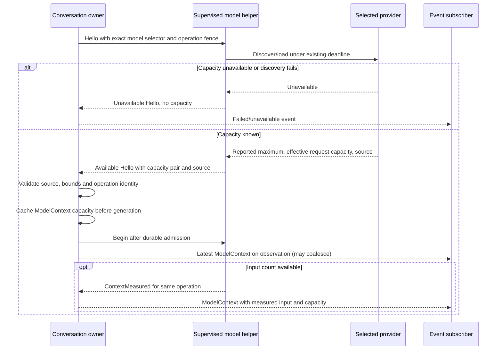
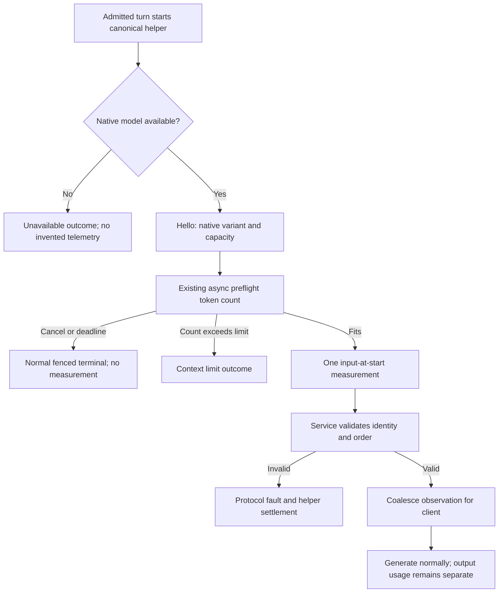
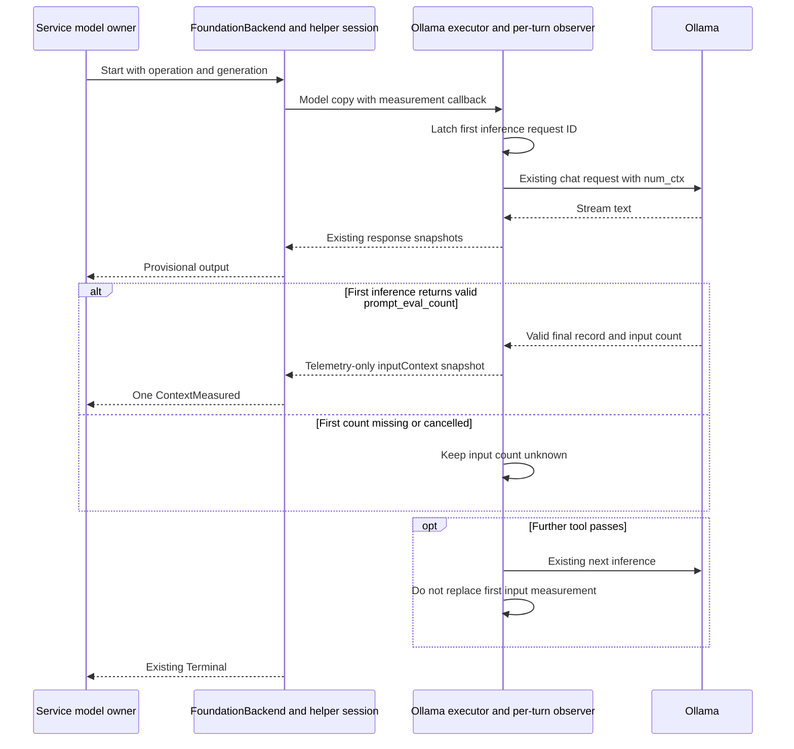

# Model context telemetry

Status: system-model input telemetry was verified on 2026-09-27. The capacity discovery extension below is implemented; its recorded
checks distinguish provider fixtures from native qualification. Provider input counts
remain unknown when the adapter cannot measure them; see the
[qualification limits](model-provider-integration.md#recorded-provider-checks).

## Capacity discovery and collection

Required behavior: no consumer assumes a model's context window size. The helper
reports an **effective request capacity** from the selected provider. It also
reports the provider's **reported maximum** and the source of that value. These
are different facts. The effective capacity may be lower because Asura selected
a smaller request window. Input tokens are a third, operation-specific value.
Unknown values remain absent. A missing usable capacity makes the selected model
unavailable; it does not become an implicit default.

| Provider | Reported maximum source | Effective request capacity |
| --- | --- | --- |
| System | Loaded `SystemLanguageModel.contextSize` | Same value |
| CoreAI | Validated loaded bundle `maxContextLength` | Same value |
| MLX | Validated local model configuration `max_position_embeddings` | Same value |
| Ollama | Bounded `/api/show` `model_info` context length; smallest valid value when keys disagree | Smaller of reported maximum and the existing explicit 8,192 request limit; sent as `num_ctx` |

The Swift provider adapter owns discovery inside the supervised helper. The Rust
model owner validates and forwards its result. The conversation owner caches
the effective capacity, reported maximum and source in `ModelContext` at Hello,
before generation. Its existing observation path publishes that cache after
durable admission; client polling may coalesce capacity and input measurements. The service keeps at most eight operation-scoped observations.
Any subscribed client or future context builder can consume the same observation;
the TUI uses it only when measured input tokens are also present. A context builder
must recheck capacity for its own selected operation. A prior operation's value
does not authorize a later model selection or replace the helper's context check.

The private Hello adds `reported_context_tokens` and `context_source` fields.
The public `ModelContext` adds `reported_max_tokens` and `capacity_source` fields.
The existing `context_tokens` and `capacity_tokens` fields mean effective request
capacity. Sources are 1 system runtime, 2 CoreAI bundle, 3 MLX configuration,
and 4 Ollama show. The helper sets both new fields only when available. The
reported maximum must be positive and at least the effective capacity. The
service rejects malformed pairs or sources that disagree with the selected
provider. The public observation may carry capacity without input tokens; `basis`
remains absent until a valid input measurement arrives. No format, API or protocol
number changes. Old peers fail the existing schema-digest handshake.

### Capacity discovery sequence — selected design

The existing helper preparation and five-second discovery deadlines apply.
Generation follows the [cancellation-driven lifetime](model-provider-integration.md#cancellation-driven-turn-lifetime--selected-2026-09-30). Provider file reads and network calls remain in the helper's
cancellable work; the service reactor and TUI renderer perform no discovery.
Cancellation or helper death discards unverified observations. A restart clears
the bounded cache. Capacity is metadata, not a permission or usage charge.

The service owns observations. The helper reports the native system model variant
name from `SystemLanguageModel.default.variant.displayName`, capacity from
`contextSize`, and input tokens from the existing asynchronous preflight
`tokenCount(for:)` calls over instructions, history, current prompt and tool schemas.
These are input context measurements at generation start. They are not current
occupancy during generation, generated-token usage, or accumulated session usage.
Before native discovery the client shows the configured selector. Unknown values
remain absent in telemetry. The status bar displays `0%` when no valid measurement
is available; this is a display default, not a measured count. It displays the
model name or selector without a `Model` prefix. No extra discovery helper or
model call is introduced.

The private Hello adds optional model_name (UTF-8, 1–256 bytes, no controls).
At most one ContextMeasured message follows Start and precedes Terminal, with input_tokens
and capacity_tokens. Both are UInt32; capacity is positive, input <= capacity.
Operation and generation fences apply. Duplicates, messages after Terminal and wrong
channel direction are protocol faults. The system backend supplies this measurement;
custom backends currently omit it. Counts are optional observations and do
not authorize work or change durable accounting. Discovery remains bounded; SDK counting during generation is cancellation-driven.
Cancellation keeps priority. No
post-generation counting delays terminal delivery.

ConversationEvent carries optional ModelContext: model_name, input_tokens,
capacity_tokens, basis (1 = input at start). Counts and basis occur together.
The service keeps telemetry for at most eight operation identities in memory.
Each observation is scoped to its operation; it cannot supply measurements for
another turn. Completed measurements retain that identity. Restart clears this
cache and does not invent recovered values.
The client labels the fraction as input context and can calculate its percentage
from those two measured integers. It never adds output tokens to this count.

The following flow describes the system backend's measured-input path. Custom
backends without a token counter generate with absent input measurements.

## Validation

For the capacity extension, unit tests check each provider source, the Ollama
reported/effective distinction, missing capacity, malformed pairs, and a source
that disagrees with the selected provider. Integration tests exchange the new
Hello fields across the real helper boundary and verify capacity is cached
before input measurement and survives coalesced observation. End-to-end PTY evidence must show that an
unknown input count still displays `0%`, while a measured count uses the selected
effective capacity. Cancellation, timeout and restart must not publish a stale
capacity as current. Native model checks qualify each provider's discovery source
separately; metadata fixtures do not prove an installed model's actual limit.

Unit checks cover UTF-8 names, control rejection, absent metadata, incomplete
count pairs, excessive count, direction and duplicate/order rejection. Injected
Swift backend tests prove measurement precedes output and cancellation remains
independent. Service integration proves current operation/generation projection,
new-turn invalidation and no journal accounting change. Native manual validation
must confirm the runtime variant and measured input display; mocks are not proof
of native values. Root owns serial builds and native checks.

## Recorded validation

Root verified wire presence and measurement bounds, service ordering and generation
fences, and UI percentage calculation. The native service journey confirmed a
nonempty actual model name, positive measured input within native capacity, and
absent recovered telemetry after restart. The native PTY journey confirmed the
model name and labelled input percentage alongside real queued conversation work.
Swift model-free tests passed 18 cases. No generated-token usage is presented as
context occupancy. Other model providers retain their separate qualification.

### Capacity extension checks — 2026-09-29

Swift model-free tests passed 82 cases, including cross-language fixtures from
Rust. The matching development package completed two native system-model turns.
The service observation carried measured input, effective capacity, equal reported
maximum and source 1. Inspect responded in 1 ms during generation. Normal restart
removed recovered telemetry, and cancellation settled. Native queue dispatch,
steering and explicit recovery also passed their assertions.

The combined native command did not pass its final crash scenario: the operation
completed before the test reached its crash boundary. This run supplies no crash
proof. The first native attempt ended at the output limit. The conversation-only
fixture now explicitly excludes tools; its success does not qualify memory-write
tool loops. CoreAI, MLX and Ollama source handling has fixture coverage in this
change; their installed-model limits were not requalified.

The full CLI lifecycle and PTY suite passed with the matching package. Changed
capacity and queue diagrams were rendered and visually inspected. Protocol remains
0.1 and journal format remains 1. The test package is isolated from the helper
used by the account's running backend.

## Ollama measured input — selected 2026-09-30

The existing Ollama executor collects the provider's prompt_eval_count from the
valid final record of the first actual inference request in a turn. A recognized
stop or length completion may supply the count; the length outcome still fails
with the existing output limit. Unknown or missing finish reasons cannot supply
a verified measurement. It pairs that
count with the same request's num_ctx. It does not estimate tokens, sum tool-pass
counts, add cached counts or use a later pass when the first count is missing.
Counts remain unknown until that record arrives. Output usage accounting remains
under its existing separate policy.

FoundationBackend owns a per-generation model instrumentation factory. For Ollama
it attaches one per-turn observer actor to a copy of the model. The observer
latches the first request ID before HTTP admission and accepts at most one valid
completion measurement from that request. It invokes the existing inputContext
snapshot callback; no worker, additional inference or discovery request is added.

The helper accepts one telemetry-only snapshot during Running, even after response
output, and preserves the response text. The Rust owner accepts one matching
ContextMeasured before Terminal, with its existing generation fence and discovered
effective-capacity equality. Duplicate, invalid-bound, stale and post-terminal
measurements fail under existing protocol handling. Cancellation closes admission
and suppresses late observations.

Tests cover first-request latching, missing first count, later tool-pass exclusion,
zero and capacity bounds, invalid counts, cancellation, late telemetry preserving
text, duplicate rejection, generation/capacity fences and post-terminal rejection.
The real service/helper streaming fixture must publish input occupancy after text
and still complete beyond the old turn cap with responsive controls and cleanup.
Native Ollama checks verify a real nonzero count against discovered capacity;
provider result equality needs operation-correlated evidence and is not inferred
from unrelated server log entries.

Recorded validation on 2026-09-30: the matching development package passed native
Ollama completion with a nonzero input count within discovered capacity. The
64-second service/helper fixture reported its configured first-request count of
1 against capacity 8192. The 72-second real TUI fixture reported 1024 against
8192 and displayed `12% input`, while preserving the full response and a draft
typed during generation. Synthetic counts verify the event route; they do not
establish tokenization accuracy for a native model. Before a provider supplies
the first measurement, the UI retains its initial zero display.
