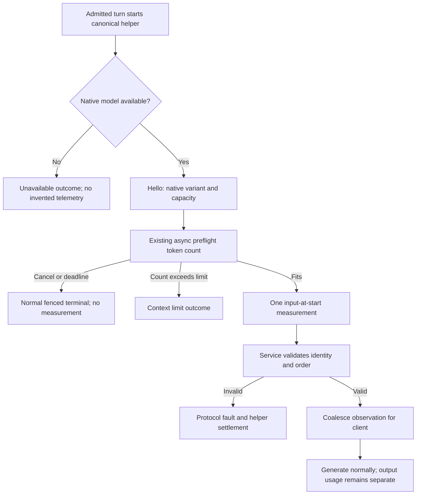

# Model context telemetry

Status: system-model telemetry implemented and verified on 2026-09-27.
The provider integration adds adapters with unknown input measurements; see its
[qualification limits](model-provider-integration.md#recorded-provider-checks).

The service owns observations. The helper reports the native system model variant
name from `SystemLanguageModel.default.variant.displayName`, capacity from
`contextSize`, and input tokens from the existing asynchronous preflight
`tokenCount(for:)` calls over instructions, history, current prompt and tool schemas.
These are input context measurements at generation start. They are not current
occupancy during generation, generated-token usage, or accumulated session usage.
Before native discovery the client shows the configured selector. Unknown values
remain absent in telemetry. The status bar displays `0%` when no valid measurement
is available; this is a display default, not a measured count. It displays the
model name or selector without a `Model` prefix. No extra discovery helper or
model call is introduced.

The private Hello adds optional model_name (UTF-8, 1–256 bytes, no controls).
At most one ContextMeasured message follows Start and precedes output, with input_tokens
and capacity_tokens. Both are UInt32; capacity is positive, input <= capacity.
Operation and generation fences apply. Duplicates, late messages and wrong
channel direction are protocol faults. The system backend supplies this measurement;
custom backends currently omit it. Counts are optional observations and do
not authorize work or change durable accounting. Existing 60 second inference
and discovery deadlines bound SDK counting; cancellation keeps priority. No
post-generation counting delays terminal delivery.

ConversationEvent carries optional ModelContext: model_name, input_tokens,
capacity_tokens, basis (1 = input at start). Counts and basis occur together.
The service keeps telemetry for at most eight operation identities in memory.
Each observation is scoped to its operation; it cannot supply measurements for
another turn. Completed measurements retain that identity. Restart clears this
cache and does not invent recovered values.
The client labels the fraction as input context and can calculate its percentage
from those two measured integers. It never adds output tokens to this count.

The following flow describes the system backend's measured-input path. Custom
backends without a token counter generate with absent input measurements.

## Validation

Unit checks cover UTF-8 names, control rejection, absent metadata, incomplete
count pairs, excessive count, direction and duplicate/order rejection. Injected
Swift backend tests prove measurement precedes output and cancellation remains
independent. Service integration proves current operation/generation projection,
new-turn invalidation and no journal accounting change. Native manual validation
must confirm the runtime variant and measured input display; mocks are not proof
of native values. Root owns serial builds and native checks.

## Recorded validation

Root verified wire presence and measurement bounds, service ordering and generation
fences, and UI percentage calculation. The native service journey confirmed a
nonempty actual model name, positive measured input within native capacity, and
absent recovered telemetry after restart. The native PTY journey confirmed the
model name and labelled input percentage alongside real queued conversation work.
Swift model-free tests passed 18 cases. No generated-token usage is presented as
context occupancy. Other model providers retain their separate qualification.
