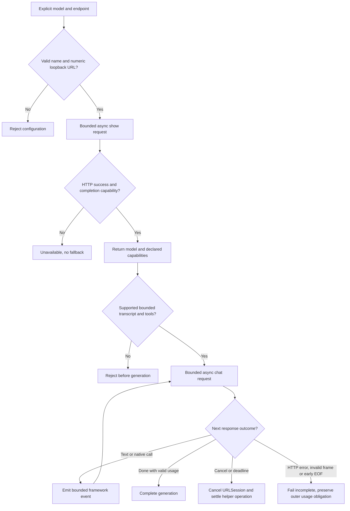
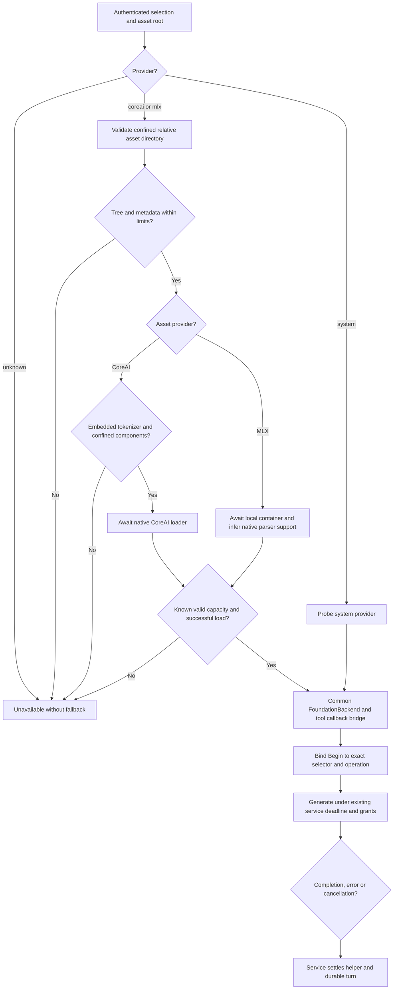
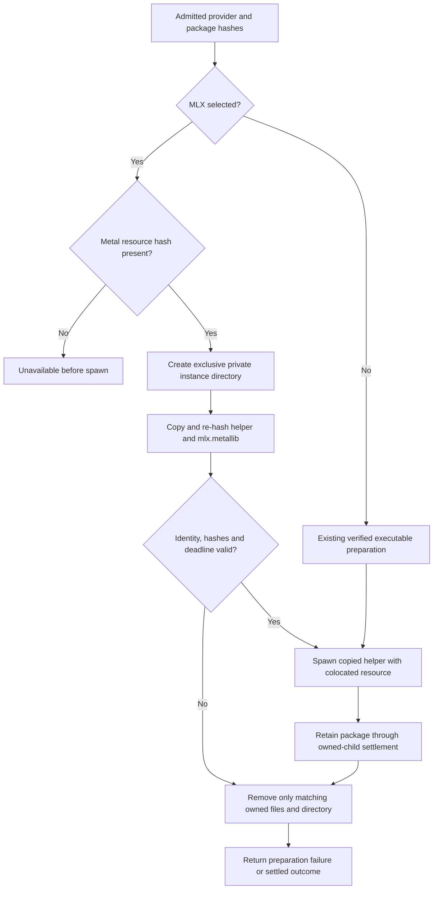
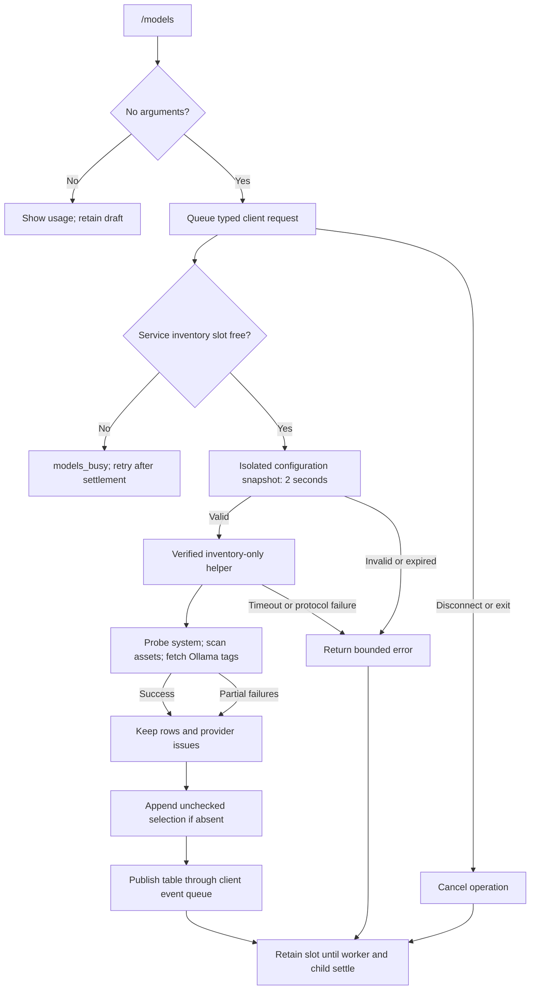
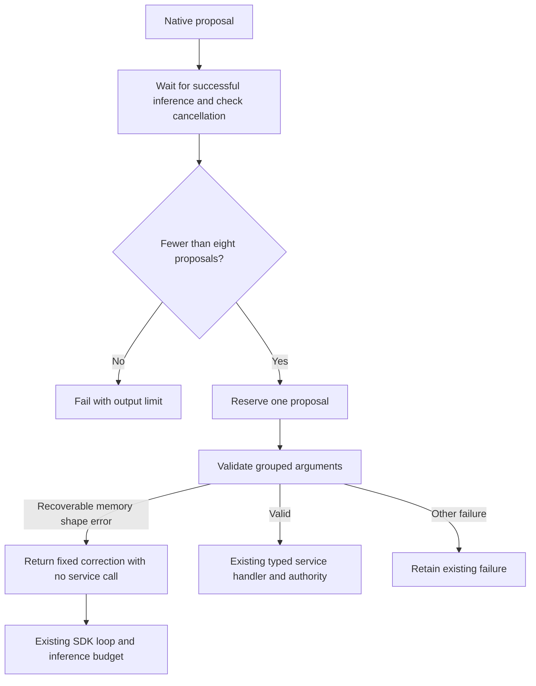

# Model provider integration

Response-budget update, 2026-09-28: the [response activity contract](response-activity.md#response-limits-and-truthful-completion)
supersedes this packet's earlier 512-token budget and 256/128/128 allocations.
New admissions reserve 2,048 tokens with tool passes of 1,024/512/512. Historical
512-token journal records retain their recorded accounting. Earlier numerical
examples and validation evidence below describe that earlier packet.

Status: MP2 integrated and compiled, with native system, Ollama and MLX checks
recorded below, 2026-09-28. CoreAI now also passes the scoped HM3 native Memory
journey; see the [Memory evidence](hybrid-memory-ontology.md#hm3-implementation-evidence).
Wisp source informed this packet.
MP2 connects selection, prepared configuration, local assets and the shared tool
bridge. The registry resolves all four adapters; runtime availability still depends
on the selected helper and assets. The MP1 sections below record the earlier
contract. MP2 supersedes its inventory and endpoint restrictions where stated.
Provider-specific runtime evidence and its limits are recorded separately below.

## Scope and evidence

Read-only Wisp inspection used revision
`0111d0743a96bb7c1c7820eba41f9a03a7910f56`, including its working tree.
Relevant sources are `harness/Sources/WispCore/Session/ModelSelection.swift`,
`ModelBackend.swift`, `OllamaModel.swift`, and the CoreAI/MLX backend modules.
The installed macOS 27 FoundationModels Swift interface defines `LanguageModel`,
`LanguageModelExecutor` and async generation-channel events. These are source
observations, not runtime qualification.

Reuse Wisp's provider/name separation, preserved model tags, capability provenance,
structured history and native tool-call conversion. Do not copy synchronous
`Blocking.run` discovery or loading. Do not infer locality from the provider name.
Wisp's generic local-backend label cannot establish that an Ollama URL is local.
Do not parse unlimited NDJSON lines or convert invalid JSON to empty arguments.

The service retains the canonical provider registry in `model.rs`. The Swift
adapter translates provider inference only. Models can be local or remote;
classifiers remain local and cannot use this provider/tool execution path.
The [common tool owner](model-tool-execution.md) owns validation, grants, execution,
results and cancellation. Foundation Models manages inference continuation with
native tool callbacks that await that owner. No adapter executes host tools.

## Delivery and ownership

MP1 owns `model.rs`, a new `OllamaBackend.swift`, and `OllamaBackendTests.swift`.
The tools packet owns helper Session/Wire/Backend and service model-owner wiring.
MP1 exposes a custom Foundation Models language model, so the tools callback bridge
can serve it unchanged when MP2 supplies the admitted selection.

MP1 adds explicit known-provider inventory: system implemented, Ollama adapter
pending wiring, CoreAI and MLX unavailable without installed build dependencies.
Resolution must keep rejecting unconnected providers, without fallback. Existing
configuration may retain their model identifiers; saving a value does not prove
availability or authorize execution.

MP2 must resolve the current Hello-before-Begin selection ordering. The helper
cannot report system availability as evidence for another provider. Selected
provider and endpoint must be sent under the authenticated private channel before
provider discovery. MP2 must bind the admitted configuration snapshot, tool
capabilities and destination to that selection. This is a schema extension at
protocol 0.1, not a protocol number change. Journal format remains 1.

CoreAI and MLX require dependency/package qualification and bounded asset loading
before enablement. Their assets use `$HOME/.asura/data/models/coreai/` and `mlx/`.
Classifier assets remain `$HOME/.asura/data/classifiers/`. MP1 installs/downloads
nothing, changes no user config and never starts an Ollama daemon.

## MP1 adapter contract

The adapter accepts an explicit model name and numeric-loopback HTTP endpoint.
The default is `http://127.0.0.1:11434`. Endpoint parsing rejects credentials,
query, fragment, non-root path, hostnames and non-loopback addresses. HTTP redirects
are refused, proxy use is disabled, and cookies/cache are disabled. This limited
transport cannot authorize a remote endpoint. Loopback transport also does not
prove local inference: a local daemon can forward requests. MP2 must establish
the configured model's inference destination before granting disclosure. Future remote support needs endpoint
identity, TLS/authentication, redirect policy and scoped disclosure grants.

Discovery uses `POST /api/show` with the selected model. A successful result
constructs the model only if `completion` is declared. `tools` maps to native tool
calling; absent capability stays unavailable. Other capabilities remain unsupported
until separately validated. Runtime declarations are not permission grants.

Generation preserves system, user, assistant, tool-call and tool-output roles.
Unknown transcript content fails explicitly rather than being silently omitted.
Tool definitions use the framework's schema. Malformed argument JSON fails.
Structured-output requests fail unsupported in MP1. Native tool proposals retain
request identity and ordinal; the shared callback bridge controls execution.

The adapter streams cumulative text through Foundation Models events. A response
must contain a final `done:true` record; EOF before it is incomplete. An error,
negative usage, oversized frame or unsupported role fails. No partial response
becomes completed history. Usage is provider-reported, never invented as measured.
Missing usage remains unknown at the backend boundary.

### Adapter decision flow

Selected MP1 flow. Arrows name asynchronous operations and terminal outcomes.

## Bounds and failure isolation

MP1 runs only inside the existing supervised helper. No network call runs on the
service reactor or UI. One generation and one network request are active per helper.
The outer service owns its 60-second absolute operation deadline and owned-child
termination/reap. Adapter retries are disabled; cancellation invalidates its session.

| Resource | Bound |
| --- | --- |
| Model name | 1 to 1,024 UTF-8 bytes, no whitespace/control |
| Discovery request | 5 seconds total and 64 KiB response |
| Generation request | 60 seconds total, never extending the outer deadline |
| Encoded request | 256 KiB including transcript and tool schemas |
| NDJSON record | 64 KiB before decoding |
| Total response | 4 MiB |
| Response text | 60 KiB per generation |
| Tool calls | 8 per generation; shared turn budget may be stricter |
| Tool arguments | 16 KiB per call |
| Context request | 8,192 tokens; not proof of the runtime's actual context capacity |
| Output request | At most 512 tokens |

Read network bytes incrementally and reject before growing the record buffer beyond
its limit. HTTP error bodies are not logged or retained. Invalid or redirected
responses fail without disclosing to a different endpoint. Task cancellation
must invalidate the owned URLSession; helper shutdown remains the final containment
boundary if a dependency does not stop. Numeric bounds do not establish tested
responsiveness; MP2 requires real fault injection before activation.

## Required validation

| ID | Unit | Integration and end-to-end |
| --- | --- | --- |
| MP1-A | Endpoint/name rejection and no fallback inventory | MP2 sends exact admitted endpoint/model through private channel |
| MP1-B | Preserve roles, native tool arguments and capability absence | Isolated loopback server records real request and native callback/result cycle |
| MP1-C | Frame/total/text/call bounds, malformed JSON and missing done | Real oversized/truncated/stalled server response fails without blocked control |
| MP1-D | Usage bounds and unsupported content/schema | Provider usage or unknown usage preserved through service settlement |
| MP1-E | Discovery requires completion and reflects tools declaration | Capability change between discovery/use fails explicitly, no silent tools loss |
| MP2-A | Generation fencing and grant checks | Cancel during connect/stream/tool wait, disconnect/restart, no duplicate execution |
| MP2-B | Destination admission | Real remote adapter only with authorized credentials/egress; absent grant discloses nothing |

MP1 unit tests join the normal Swift test target. Root owns serial compilation,
package identity generation and test execution. MP2 extends the real CLI/TUI journey;
a model substitute cannot establish actual Ollama/native model behavior. All fixture
servers/backends are private and must stop at test completion. Live provider access
is a separate qualification. No result is claimed until root runs the checks.

## MP1 review evidence

The flowchart rendered with Mermaid CLI 12.0.0 and was visually inspected.
Rust formatting and `git diff --check` passed. Compilation and test execution
remain with root; no live provider access occurred.

## MP2 local asset providers

Status: implemented. This section supersedes MP1 inventory states. Runtime
qualification remains provider-specific, as recorded below. Root owns dependency
pins and compilation.
The provider agent owns `model.rs`, `ProviderFactory.swift`, `AssetLocation.swift`,
`CoreAIProvider.swift`, `MLXProvider.swift`, `OllamaBackend.swift` and their tests.
The common tools owner owns `Backend.swift`, `Session.swift` and the shared callback
bridge. The factory returns that common backend; it adds no inference lifecycle.

The service sends the exact model selector before provider discovery. It supplies
an absolute managed `data/models` root for asset providers. The helper never derives
this root from its environment. `coreai:name` and `mlx:name` select a relative path
beneath their respective provider directories. Absolute names, empty components,
`.` and `..` are invalid. The factory never substitutes the system provider.

The helper validates the asset directory before calling a vendor loader. It rejects
symbolic links, nonregular files, paths outside the selected directory and excessive
asset trees. Limits are 8,192 entries, depth 16, 128 GiB aggregate file size and
1 MiB for each metadata JSON read. Regular weights remain memory mapped or streamed
by the vendor. The helper does not copy, repair or download missing assets.
The assets are trusted account-owned model data; changing files during vendor loading
can cause failure. This validation is not a sandbox against another same-user process.

Filesystem inspection and vendor initialization run in one detached helper task.
The service remains the deadline and process-settlement owner. Cancellation stops
admission; a stalled loader is terminated with its helper. The operation retains
the existing deadlines: two seconds for helper preparation, five seconds for
Hello and provider loading, then 60 seconds for the started operation. There are
no retries or additional helper slots. A model that cannot load within five
seconds fails availability; larger assets require explicit runtime qualification. Neither
filesystem reads nor model loading runs on the service reactor or terminal renderer.

CoreAI uses `CoreAILanguageModel` from `coreai-models` revision
`3f109efd54273391f9fd9f5f5b3d8c6e99836d55`. `LanguageBundle.maxContextLength`
provides capacity. An embedded tokenizer is mandatory. The vendor's pretrained
Hugging Face tokenizer fallback is forbidden because it can download implicitly.
All component paths must resolve inside the checked asset tree. The native model's
capabilities establish tool support. Missing or invalid bundles fail unavailable.

MLX uses `mlx-swift-lm` revision
`c6446cf7bfb7cea76408013b614d4b2c530eaa03` with its Foundation Models integration.
The local-directory loader and explicit weights-location closure prevent model
identifier downloads. Tokenizers use `swift-transformers` revision
`c21fdcde390313a6d98d8e33a346f2c3486c3ab0`. The factory loads the container once,
then shares it with the native bridge. The loaded configuration's native
`toolCallFormat` establishes parser support. Missing parser support means no tools;
ordinary model prose cannot become a tool request. Capacity comes from the model's
positive integer `max_position_embeddings`, including `text_config` when present.
Tokenizer sentinel lengths do not establish capacity. Models without a supported
capacity field fail explicitly until their format receives a specific adapter.

Both providers use `FoundationBackend` and the same service-owned tool bridge.
They report the selected model name and known capacity. They leave input counts and
usage unknown when the adapter cannot establish an actual measurement. The common
engine enforces response and tool budgets. Vendor generation honors the passed
maximum response tokens. No capability declaration grants host access.

### MP2 provider validation

- MP2-L1 unit: reject absolute/traversing/symlink asset paths, excessive metadata,
  missing capacity, missing tokenizer and unknown provider without fallback.
- MP2-L2 integration: private Hello selects each provider; Begin cannot change it.
  Missing assets return unavailable before inference, with no network download.
- MP2-L3 integration: stalled load remains cancellable through helper containment;
  service status/input events remain responsive and helper is reaped on cancellation.
- MP2-L4 native: installed MLX/CoreAI assets produce a real response and a native
  tool callback through the common service grant/result cycle. Each model needs its
  own recorded evidence; one provider's success does not qualify another.
- MP2-L5 native: output budget, cancellation and missing-tool capability fail
  truthfully. Input context/usage stay unknown if no actual measurement exists.

Initial investigation found installed SDK and cached pinned source for these APIs,
an MLX asset in Wisp's store, and no CoreAI bundle in the inspected standard stores.
Root subsequently copied the MLX asset into an isolated managed root and qualified
its native path. The recorded checks below are the current runtime evidence.

### MP2 Ollama limits

Discovery must return a positive integer model-info key ending in `.context_length`.
Conflicting values use the smallest capacity. The request context is the smaller
of that capacity and 8,192 tokens; Hello reports this effective request capacity.
Missing capacity fails unavailable. `num_predict` comes from the common engine's
current request, between 1 and 512, so tool continuations preserve remaining budget.
Stream usage above that request limit fails. Discovery keeps its resource bounds;
the [endpoint configuration contract](#mp2-endpoint-configuration-handoff) governs
local HTTP and remote HTTPS selection.

### Dependency graph review

The helper links the selected provider bridges; provider availability is checked
at runtime. Direct dependencies are pinned in `swift/model-helper/Package.swift`:
SwiftProtobuf (existing), CoreAILM, MLXFoundationModels, MLXHuggingFace, MLXLLM,
MLXLMCommon and Tokenizers. CoreAI adds its shared bundle and tokenizer dependencies.
MLX adds `mlx-swift` (Metal kernels) and SwiftSyntax macro support. Tokenizers adds
its pinned tokenizer/template dependencies. These are vendor inference adapters,
not alternate Asura orchestration or tool owners.

Root reviews the resolved transitive graph and licenses before the dependency
build. Package resolution and Metal resource packaging remain root's serial build
steps. No package was fetched or built by the provider implementation agent.
The cached Wisp graph is source evidence, not Asura's resolved lockfile.

Ollama requests set `truncate:false` and `shift:false`. The current upstream
[ChatRequest contract](https://github.com/ollama/ollama/blob/main/api/types.go)
defines these controls for explicit context overflow failure. Qualification must
verify overflow against the installed daemon; an older daemon might ignore unknown
fields. An encoded-request test alone does not prove the daemon honors this rule.

### MP2 endpoint configuration handoff

The selected optional key is `providers.ollama.endpoint`. The configuration owner
stores it in the same snapshot as `model`. The value is at most 2,048 UTF-8 bytes.
Absence selects `http://127.0.0.1:11434`. HTTP is permitted only for numeric loopback;
HTTPS requires a nonempty host and normal system certificate validation. URLs with
credentials, query, fragment or non-root paths are invalid. Redirects, cookies,
proxy configuration and ambient credentials remain disabled. The adapter sends no
Authorization header. Authenticated providers need a separate credential contract.

The service sends the endpoint from the admitted snapshot in Hello. Endpoint
changes cannot modify an already admitted operation. Selecting an Ollama endpoint
permits its ordinary conversation inference only under service admission. It does
not grant project disclosure. All Ollama selections remain endpoint-dependent,
including loopback daemons that can forward to cloud models. The service denies
project tool results to these selections by default. The owner-selected
[verified local route](model-tool-execution.md#verified-local-ollama-disclosure)
permits tools only after runtime locality checks and enforced local-only routing.
Cloud and unverified routes remain denied. The system/CoreAI/MLX asset providers
keep their separate on-device classification.

The configuration owner must add get/set, YAML dump, invalid URL/type tests and
snapshot-digest coverage. The provider adapter tests HTTP locality, HTTPS acceptance,
credential/path rejection and continued redirect refusal. Integration must show the
exact admitted endpoint reaching the helper without mutating account configuration.

MP2 diagram rendered and visually inspected with local Mermaid CLI. Source files and unit cases are integrated. The recorded checks below supersede
the earlier pending compilation and native-check status.

The storage configuration snapshot carries `model`, `ollama_endpoint`,
`asset_root` and the configuration digest together. The digest covers normalized
configuration, including the endpoint. The writer preserves these fields in its
prepared admission result. The service copies them into the private helper
selection; it does not re-read configuration during launch. The asset root comes
from the retained runtime directory's managed parent path through a pure platform
accessor, with no environment lookup or filesystem operation on the reactor.

The strict YAML tree now permits three mapping levels for `providers.ollama.endpoint`.
It retains duplicate rejection and a three-key bound per mapping. Providers and
Ollama mappings are omitted from default YAML when no endpoint is configured.
The endpoint validator accepts ASCII DNS names or IP literals, with an optional
port from 1 to 65535. It rejects escapes and backslashes to keep Rust and Swift
URL interpretations consistent. Ordinary config get/set continues to use the
existing command flow, atomic file replacement and worker deadline.

### MP2 resolved dependency review

Root resolved the helper lock graph to 16 pins. Root reviewed the package-root
licenses: CoreAI uses BSD-3-Clause; MLX, EventSource and yyjson use MIT; the other
reviewed packages use Apache-2.0, with Swift exceptions where present. Root found
no binary targets in the package-root manifests. The reviewed MLX CUDA plugin
returns no build commands on macOS. The network-denied helper build and all 26
model-free tests passed on 2026-09-28. Metal resource packaging and native provider
qualification remain separate evidence gates; the missing CoreAI asset limits live proof.

### Verified Metal resource packaging

The MLX loader first searches for `mlx.metallib` beside its loaded executable.
Its compiled fallback is relative `default.metallib`; the build tree is not an
authorized runtime source. Package assembly therefore stages `mlx.metallib` beside
`asura-model` and records its SHA-256 in the service package identity.

Only an MLX selection requires this resource. The existing preparation worker
creates a private unique `model-ID` directory beneath the retained runtime root.
It copies the verified helper as `asura-model` and the verified resource as
`mlx.metallib`. Source files must be regular, owned by the service account and not
group/world writable. Final symlinks are rejected. Bounds are 128 MiB executable
and 64 MiB Metal resource, copied in 64 KiB chunks under the existing preparation
deadline and cancellation flag. Both copied inodes are re-read and hashed.

The platform retains both files and the directory through child settlement.
Cleanup unlinks only names whose device/inode match retained descriptors, then
removes only the matching empty directory. It never recursively removes unknown
entries or replaces another process's resources. Failure before spawn cleans
owned files; failure during execution follows existing child termination/reap.
System, CoreAI and Ollama retain executable-only preparation and do not depend on
Metal resource presence. All preparation and cleanup remain isolated from reactors.

Resource tests must prove colocated bytes are visible to the copied helper,
resource absence/hash mismatch fails before spawn, failures remove owned copies,
system preparation requires no resource, and unknown replacement entries survive
cleanup. Root must run relocated native MLX inference to prove Metal loading.

The opt-in `conversation_flow --native-mlx` journey requires `ASURA_TEST_MLX_ASSET`.
The fixture first starts the service and waits for completed initialization. It
then copies that explicitly supplied source into mode-0700 managed model directories,
dereferencing regular-file links. Preexisting data without initialization authority
remains a recovery condition; the fixture must not bypass that protection. It bounds the copy to 8,192 entries,
depth 16 and 128 GiB, never downloads, and deletes only its scratch home.
The journey checks missing assets before admission, real native completion,
private copied Metal bytes, cancellation and post-shutdown resource cleanup.
The fixture's ordinary service guard owns stop/kill/reap on every exit path.

The opt-in `conversation_flow --native-ollama` journey uses an already running
numeric-loopback Ollama daemon. `ASURA_TEST_OLLAMA_MODEL` selects its installed model;
the fixture defaults to `granite4.1:8b`. It writes only scratch Asura configuration,
never starts/stops or modifies the daemon, and submits synthetic text only. It
asserts native completion without project tools, then submits a bounded 30,000-byte
synthetic prompt whose repeated tokens exceed the 8,192-token request window.
Overflow must fail explicitly; a successful shortened response fails qualification.

### Development hashing performance

The integrated helper grew to about 97 MiB. Root measured preparation failure at
2.48 seconds wall time, including 2.10 seconds of user CPU time. The retained
preparation worker reached its two-second deadline before provider discovery.
The installed `sha2` 0.10.9 source selects its software backend on AArch64 unless
its `asm` feature is enabled; the current build enables only `default` and `std`.

The selected correction optimizes only the existing `sha2` package at level 3 in
the development profile. Tests inherit that profile. Dependencies, features,
verification passes, cancellation and deadlines remain unchanged. No stripping
step changes the assembled helper identity. Root must rebuild and re-run native
admission to verify that preparation fits its budget; this change alone is not
performance evidence. The client submit deadline remains three seconds, so
increasing preparation time would also require a coordinated admission contract.

Native provider fixtures retain one submit request ID while waiting for prior
helper settlement. They retry only an explicit `conversation_busy` response, for
at most five seconds. Transport errors and uncertain outcomes stop the fixture;
they never allocate a replacement request. Each provider stage annotates errors
so preparation, missing-asset checks, inference and shutdown failures are distinct.

### Recorded provider checks

Root reports 30 Swift model-free tests and 38 cross-language contract cases passed.
Root also reports native system tool execution passed, including status calls and
replay checks. These results do not establish other providers' native behavior.

The native Ollama fixture passed synthetic inference and explicit context-overflow
rejection against the existing Ollama 0.34.4 daemon with `granite4.1:8b`. It exposed
no project tools or project data. This qualifies that daemon/model combination's
observed text and overflow path, not authenticated remote transport or native
remote tool disclosure.

Root reports the native MLX fixture passed with
`LFM2.5-1.2B-Instruct-MLX-4bit`. The fixture verified missing-asset rejection,
private copied Metal resource bytes, real generation, unknown input measurements,
cancellation and owned resource cleanup. Assets were copied into an isolated
managed root. This establishes that model's tested local path, not all MLX model
formats or native tool selection by that model.

Root also reports the baseline native system journey passed durable FIFO queue,
steering and restart recovery with system tools enabled. CoreAI code compiled and
model-free checks passed. The initial asset search missed Wisp's separate export
store; a subsequent lookup found the Qwen3-4B export. With owner authorization,
all seven bundle files were copied to the managed CoreAI model directory and
verified against the original export manifest on 2026-09-28. Its selector is
`coreai:qwen3_4b_4bit_dynamic`. Wisp's recorded inference checks do not establish
native Asura qualification. Root's lint, build and terminal checks remain separate
gates.

### Optional display name bounds

The routing selector remains unchanged through `Hello.selected_model` and
`Begin.model`, up to its existing 1,024-byte limit. The optional `Hello.model_name`
field is presentation metadata, limited to 256 UTF-8 bytes. The helper emits this
field only when the supplied display name is nonempty, within the byte limit and
contains no control characters. Otherwise it omits the field; the client retains
the configured selector. This avoids slicing UTF-8 or silently changing routing.
Tests cover names at and above the multibyte boundary and full selector retention.

## MP3: model inventory command

Status: implemented and integrated. Local validation passed on 2026-09-28. The owner authorized `/models`.
The command reads one configuration snapshot and lists model candidates. It neither
changes selection nor loads weights, starts inference, downloads assets or starts
an Ollama daemon. Wire numbering remains 0.1 and journal numbering remains 1.

### Inventory ownership and contract

The service owns one inventory operation slot. The control client submits
`ModelsList` and consumes `ModelsReply` through its existing command queue.
The reply contains the configured selector (provider spelling normalized by the
canonical model identifier parser), typed rows, provider issues and an
optional whole-operation error. Each row contains selector, provider, status and
an optional bounded detail. Status values mean available (system SDK probe),
installed (local metadata only), listed (Ollama catalog only), unavailable, or
unchecked. Installed/listed never claims inference qualification. A configured
selector absent from discovery is appended as unchecked with `not_discovered`.
The TUI marks the configured row and shows provider issues below its padded table.
Empty provider directories are a successful empty inventory. Missing provider
roots are empty; inaccessible roots and invalid metadata produce explicit issues.

The service reuses the canonical configuration snapshot reader on one isolated
worker, with a two-second deadline. It then uses the verified `ModelOwner` helper
lifecycle for metadata discovery: two-second preparation, five-second Hello and
existing cancellation, kill, reap and private-path cleanup. A dedicated Hello flag
selects inventory-only execution. The helper returns inventory in Hello and exits;
Begin, tool grants and generation are forbidden on this path. The helper executes
filesystem discovery in a detached task. A stalled filesystem cannot block the
service reactor or terminal. The inventory slot remains occupied until workers
and the helper actually settle, even after error, disconnect or timeout.

One inventory helper may coexist with the existing admitted conversation helper.
This is a separate read-only slot with no inference permission, not a second
conversation execution owner. Repeated concurrent inventory commands return
`models_busy`; there is no hidden retry queue or cache. Disconnection cancels the
request. Shutdown cancels discovery and retains service ownership through normal
drain settlement. Read-only retry is safe after settlement; no durable journal
record is needed because the operation has no model or mutation effects.

### Discovery bounds and security

The helper uses the existing system backend availability probe without generation.
It scans only the service-supplied managed `data/models/{coreai,mlx}` roots.
It reads metadata, not weight contents, and rejects symbolic links and special
files. A model directory is identified by the provider's expected metadata file;
metadata parsing does not instantiate vendor models. Traversal stops at each
candidate metadata file; weight and tokenizer subtrees are not scanned. The
installed state proves metadata only. Provider loading retains its separate full
asset validation. Nested directories are
searched to depth four, at most 256 entries per provider. Each metadata file is
at most 64 KiB, and total metadata reads are at most 1 MiB per provider. There are
at most 21 candidate rows per provider, plus one system row (64 total).
Selectors are at most 256 UTF-8 bytes for discovered rows; the configured missing
selector retains the existing 1,024-byte bound. Issue lists have at most four
entries. Strict wire metadata permits 64 helper rows and 65 control rows; other
repeated-message bounds remain unchanged. Unsupported configured selectors remain
visible as an unavailable row with provider `unknown`. Bounds reached produce `inventory_limit`, never a silently complete list.
Provider output is untrusted: controls, invalid selectors and malformed metadata
are rejected. Detail and issue reason strings are fixed codes or bounded sanitized
SDK display names; paths and raw response/error bodies are not returned or logged.

Ollama enumeration uses GET `/api/tags` at the snapshotted configured endpoint.
It reuses endpoint validation and URLSession policy: no redirects, proxy, ambient
credentials, cookies or cache. The request has a two-second deadline and 64 KiB
incremental response bound. A provider failure preserves other provider rows.
Listing sends no prompts, project information or filesystem content. Locality is
not inferred from Ollama; catalog presence establishes neither completion/tool
capability nor a local execution destination. No new dependency is introduced.

### MP3 command flow

Selected flow. Arrows show request admission, asynchronous completion and failure.

### MP3 validation

| Case | Unit evidence | Integration and end-to-end evidence |
| --- | --- | --- |
| MP3-A | Codec directions, row limits, status and selector validation | Client/service typed inventory round trip; unchanged protocol numbering |
| MP3-B | Missing, nested, malformed and symlink assets; bounded scans | Scratch asset roots list metadata without model loading or downloads |
| MP3-C | Ollama catalog parse, invalid names and response limits | Private HTTP server: success, error, oversized reply, stall and cancellation |
| MP3-D | Selection marker, missing selection, table formatting and arity | Real service PTY `/models`, scrolling only on overflow, repeated command and quit |
| MP3-E | Timeout retains slot; late result suppressed | Stalled discovery leaves Inspect and exit responsive; child and scratch cleanup |

Root owns serial Cargo, Swift and real terminal checks. Model-free tests are
mandatory; listing itself does not require native inference. Optional account
inventory checks disclose no private catalog details in tracked evidence. The MP3 flowchart rendered with local Mermaid CLI 12.0.0 and was visually
inspected.

Verified behavior on macOS arm64, 2026-09-28:

- Swift helper: 39 tests passed, including bounded discovery and HTTP cancellation.
- Rust control tests passed with inventory codec and direction checks.
- Service: 76 unit tests passed.
- CLI: 100 unit tests, argument tests and the isolated lifecycle journeys passed.
- Real service inventory passed with the packaged Swift helper and private fixtures.
  This covered metadata discovery, missing selection, partial failure, busy admission,
  responsive Inspect and child cleanup.
- The real terminal `/models` journey passed with the packaged helper.
  This covered completion, arity, displayed results, repeated requests and exit.

These checks establish inventory behavior. They do not qualify inference for any
listed model. An installed or listed row is not proof that the model can generate.

### Wrapped tool callback diagnostics

For SDK `LanguageModelSession.ToolCallError`, inspect only its public
`underlyingError` type. Keep the existing fixed `tool_callback` diagnostic class.
Use the following closed numeric mapping; never print the tool name, arguments,
error description, userInfo, decoding path or provider text.

| Underlying error | Diagnostic code |
| --- | --- |
| BackendFailure | 100 plus the private protocol Reason value |
| HelperError.protocolFault | 201 |
| HelperError.limit | 202 |
| HelperError.closed | 203 |
| HelperError.unavailable | 204 |
| HelperError.contextLimit | 205 |
| HelperError.timeout | 206 |
| DecodingError | 300 |
| CancellationError | 400 |
| Any other type, including another wrapper | 0 |

Inspect one wrapper only. The diagnostic remains one bounded nonblocking stderr
write. This changes no error outcome, validation or tool authority. Unit tests
cover each mapping, unknown errors and private names/descriptions not appearing.

For grouped memory argument rejection, retain the input-limit failure outcome and
add value-free flags to its internal diagnostic metadata. A wrapped creation
rejection uses `tool_callback` code 1000 plus this bitmask: 1 missing body,
2 oversized body, 4 oversized source, 8 unrelated version present, 16 unrelated
after present, 32 unrelated offset present, 64 unrelated limit present. A read
command containing creation fields uses code 2000 plus flags: 1 body present,
2 source_version present. Codes reveal only failed schema conditions, never field
values, lengths or content. All other input-limit errors retain code 102.
The same guards still reject before the service callback. Unit tests verify each
flag and combined flags, strict rejection and absence of private text. This
instrumentation does not add retries or alter the public tool schema.

### Bounded correction of grouped memory proposals

Native qualification produced a `create_note` proposal without body and with
unrelated version and limit fields. The exported SDK schema confirms body and
source_version permit strings; default nil does not constrain them to null.
Describe each command's permitted fields explicitly in the tool and field guides.

For a decoded grouped memory proposal with these structural faults, return fixed
correction text to the SDK tool loop instead of terminating the conversation.
Do not discard supplied fields, invent a body, dispatch a partial call or contact
the service. Missing/oversized creation fields and creation fields on read commands
receive this feedback. Other errors retain their existing failure behavior.
The feedback states the required body, optional source_version, allowed field
sizes, and the fields that must be omitted. It contains no argument values.

One wrapper around each advertised native tool uses the existing turn-local
ToolRoundBudget. Before adapter validation, it waits for the current inference
result, checks cancellation and reserves one of eight native proposals. Valid
and locally rejected proposals consume this same bound. The service independently
retains its eight admitted-operation limit. Exhaustion records output-limit;
it does not return another correction. The wrapper forwards the original schema,
name and description. It cannot expose an additional tool or grant authority.
The existing three inference allocations (1024, 512, 512), 2048 total reservation,
turn deadline, callback-waiter bound and output bounds remain unchanged. No retry
scheduler or extra model dispatch owner is added; the SDK decides whether to
correct its proposal within those limits.

Tests must prove malformed creation followed by a valid creation reaches the host
once, across the SDK loop; repeated correction cannot exceed three inference
passes or eight proposals; failed inference and cancellation cannot return a
correction or invoke the host; and rejected fields remain rejected without their
values appearing in feedback. All four public tool names and schemas stay intact.
