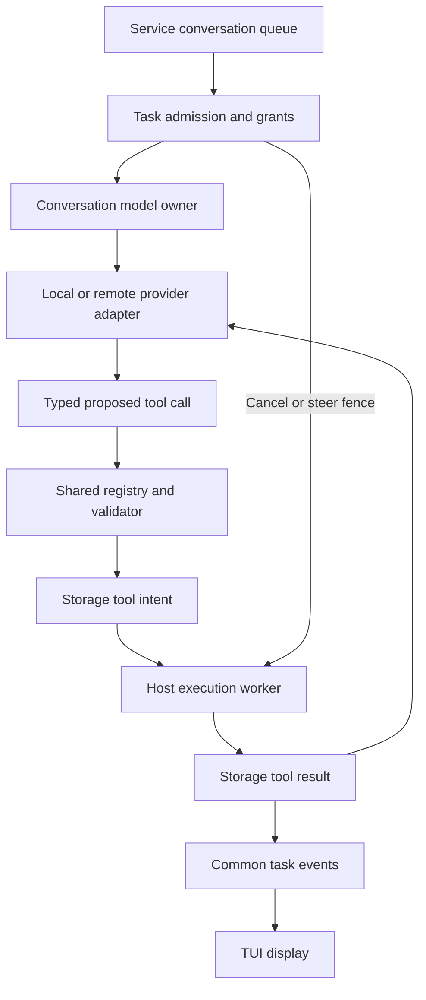
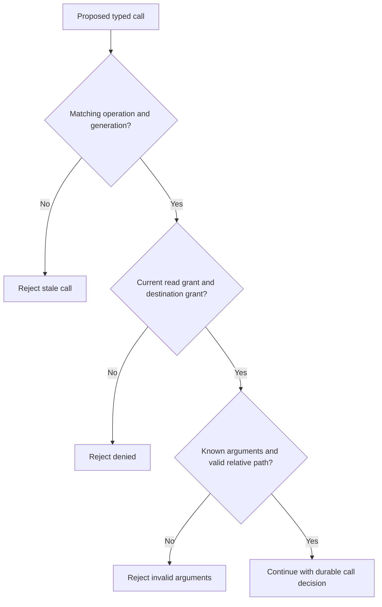
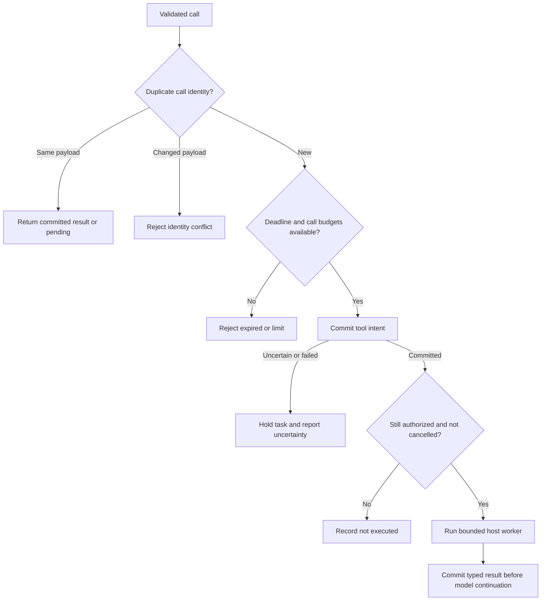
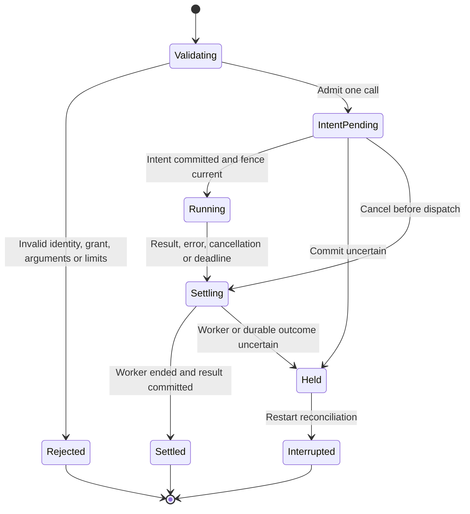
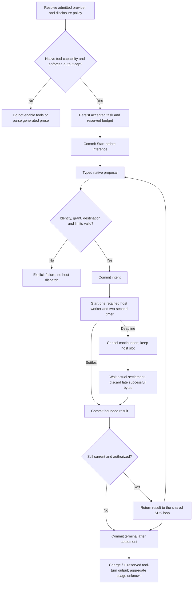
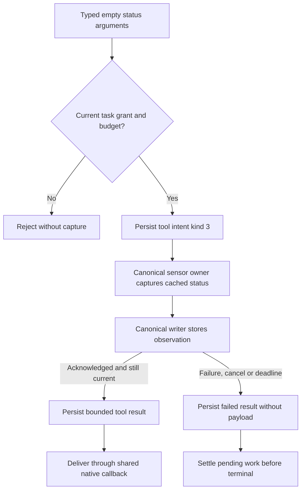
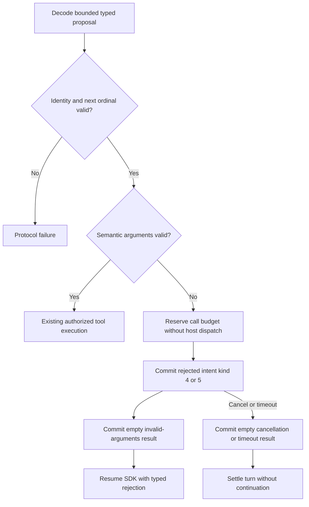
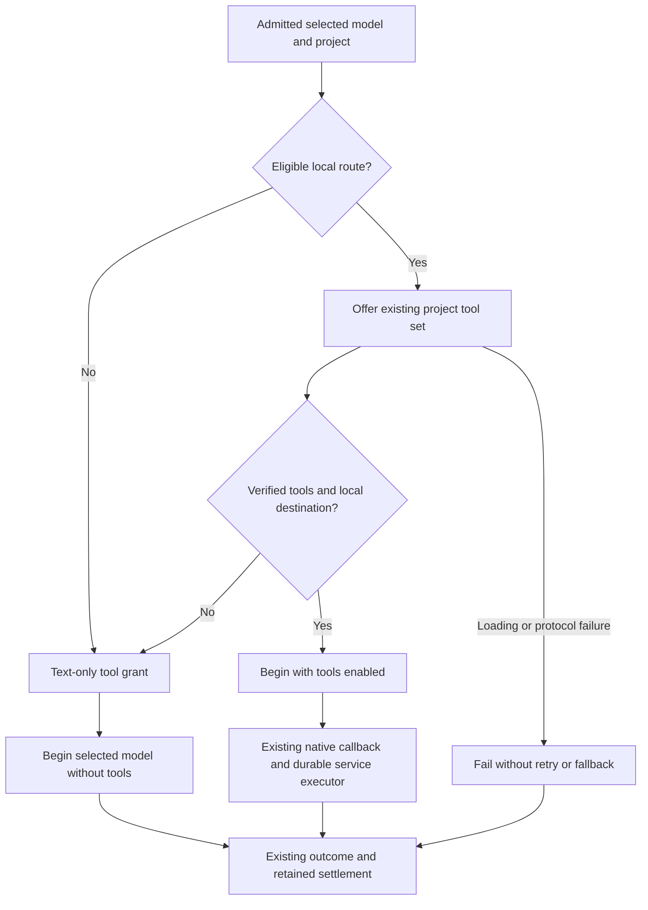
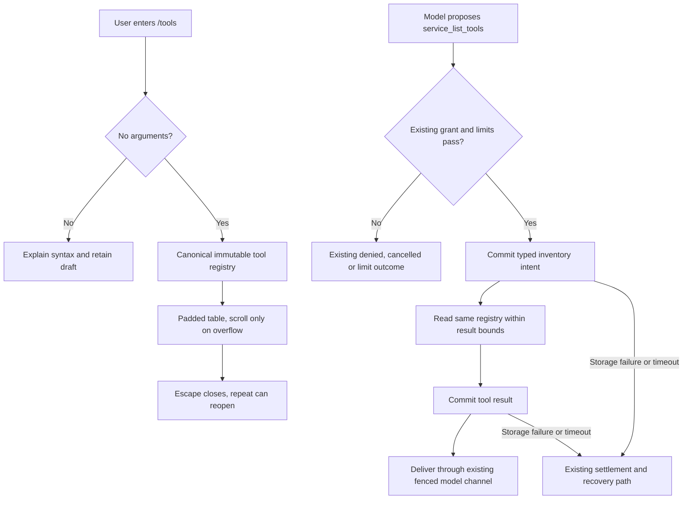

# Shared model tool execution

Response-budget update, 2026-09-28: the [response activity contract](response-activity.md#response-limits-and-truthful-completion)
supersedes this packet's earlier 512-token budget and 256/128/128 allocations.
New admissions reserve 2,048 tokens with tool passes of 1,024/512/512. Historical
512-token journal records retain their recorded accounting. Earlier numerical
examples and validation evidence below describe that earlier packet.

Status: implemented and activated for the `system` model selection. On 2026-09-28,
the isolated native journey passed file reading, directed service status,
committed-result recovery and outside-secret non-disclosure. The validation
record below states the limits of this evidence.

MT3 below extends activation to CoreAI, declared MLX models and verified local
Ollama models. System, MLX and verified-local Ollama passed the HM2 native Memory
journeys recorded in the linked packet. CoreAI native qualification remains open.
Remote Ollama project disclosure remains disabled. A provider declaration or passing adapter unit
test does not establish native tool support.

This extends [conversation admission](conversation-admission.md), the
[model channel](platform-capabilities.md#private-helper-messages-at-version-01),
and [storage ownership](storage-adapters.md). Wire numbering remains 0.1 and
journal numbering remains 1. The service owns the queue and tool lifecycle.
Classifiers remain local and never receive this tool interface.

[HM2 memory tools](hybrid-memory-ontology.md#hm2-typed-read-only-memory-tools)
extends this lifecycle with project-scoped note listing, reading and source links.
The authority worker executes these reads; it retains each tool slot until actual
job settlement. The HM2 packet owns their arguments, limits and validation evidence.

## Ownership and provider coverage

One registry defines tool names, typed arguments, limits and result types.
Provider adapters translate requests and results. They never authorize or execute
host operations. The service validates the accepted task, project identity,
operation generation, grant, remaining deadline and budget before each dispatch.
The platform supplies descriptor-relative file access. Storage owns durable tool
records. The TUI displays service events and sends control requests only.

| Model class | Current implementation | Tool integration contract |
| --- | --- | --- |
| Apple system | Shared bridge activated; native file-read and status journey passed | Native Foundation Models callbacks use the service grant, executor and durable results |
| Custom Core AI local | Adapter compiled; native qualification blocked by generated-content parsing failure | Same native callback contract; passing adapter tests do not qualify the model |
| MLX local | Native project-file and Memory journeys passed with the qualified Qwen3 model | Explicit configured capabilities intersect native support; service permission controls activation |
| Verified-local Ollama | Native project-file and Memory journeys passed with granite4.1:8b | Runtime capability and local-only routing checks remain mandatory |
| Remote conversation model | Cloud tool activation remains later work | Explicit destination and data-disclosure policy required |
| Local classifier | Not a conversation adapter | No tool execution or remote fallback |

Text that resembles a tool call is never executable. A provider without validated
native tool calling returns unsupported capability. This increment adds no parser
that extracts commands from generated prose and no second conversation loop.
Foundation Models may manage inference continuation internally; its callback must
await the service result before returning to inference.

### Component flow

Selected design. Arrows are typed requests or observations across owner boundaries.

## MT1: typed registry and validation

First useful tools are `project_read_file` and `project_list_directory`.
Both accept relative paths in the accepted project's pinned directory. Read
arguments include byte offset and requested byte limit. List arguments name one
directory only; recursive traversal is excluded. The root directory is `.` for
listing. File reads reject `.`. Absolute paths, empty components, parent components,
control characters, backslashes, NUL and paths above 1,024 UTF-8 bytes are invalid.

The platform must reject symlinks at every component, nonregular read targets,
non-directory listing targets and a replaced project identity. It must use held
parent descriptors and `O_NOFOLLOW`; path validation alone is not confinement.
File results contain valid UTF-8 text, the requested offset, bytes returned and a
continuation flag. If the page ends inside a UTF-8 character, return the valid
prefix and resume at its byte boundary. A page too small for its first character
returns a typed limit error. The platform reads at most 16 KiB plus one byte.
The worker checks cancellation and its deadline between operations and rejects
a changed file identity, size or modification stamp after reading. Binary/invalid UTF-8 input yields a typed error. Reads never
silently replace invalid text. Directory results contain at most 128 immediate
entries; incomplete lists carry `truncated`, never a false complete marker.

A typed call contains operation ID, generation, monotonically increasing call
ordinal and one argument variant. A grant contains the exact operation ID,
generation, project ID and whether project reads were authorized. Registration
alone never creates this grant. Admission of a user task in an explicitly
selected registered project applies the default read-only project policy and
creates the task-scoped grant. This owner-selected policy needs no additional
per-session permission prompt. Unaccepted drafts and external observations grant
no access. A TUI selection alone is insufficient without admitted user work.
Changing projects cannot alter an already accepted task's scope.

Remote adapters additionally require a destination-specific disclosure grant.
The shared validator must reject remote disclosure without it, even for read-only
operations. Adding remote providers requires their authentication, disclosure and
policy design; MT1 does not silently authorize project egress.

Initial service limits are one active tool worker, one pending call, eight calls
per logical turn, 16 KiB per read result and 64 KiB aggregate result bytes per turn.
Each tool has a two-second deadline within the existing 60-second turn deadline.
A requested read limit must be 1 through 16,384 bytes. Offset plus limit must not
overflow. Paths, arguments and result bytes remain out of diagnostic logs.

MT1 implements the pure registry, typed validation and bounded call accounting.
It does not activate tools or claim filesystem confinement. MT2 requires the
platform worker, durable records, helper bridge and tests before activation.
This split permits shared contract validation while queue integration progresses.

### Call decision flow

Selected design. Each exit is a typed outcome; no rejected call reaches host IO.

### Durable call decision

Selected design. Validated calls enter this flow; stored identity determines replay.

## MT2: bridge, execution and recovery

Add typed `ToolCall` and `ToolResult` bodies to the existing private model envelope.
Retain operation ID and generation on every frame. The call ordinal identifies a
call within that operation. The helper declares a tool-calling capability only
when its callback bridge is installed. A service grant selects the permitted tool
set; an empty set preserves text-only behavior. Tool arguments are typed protobuf
fields, not arbitrary JSON or source text. Unknown fields and invalid direction
are rejected by the existing strict codecs.

The service records tool intent before execution and a result before sending it
to the model. Result events expose call identity, tool name, pending/completed/
failed state and bounded reason. They do not put file contents in audit logs.
Authority records retain bounded results needed for duplicate-call resolution.
The service revalidates disclosure before returning any retained result.

Cancel and steer fence further tool dispatch immediately. The current queue
contract uses cancel-and-replace steering. Replacement work waits for the current
logical turn's terminal record and settlement of both model and tool workers.
No callback or late result can revive a cancelled generation. A disconnected TUI
does not cancel accepted work. Restart marks uncompleted tool work interrupted;
it never rereads a file or restarts inference automatically. Completed results
remain evidence of the original observation, not a statement of current contents.

Blocking open/read/readdir/stat calls run in one retained host worker, never the
reactor or Swift callback actor. Cancellation is checked between bounded reads.
A syscall can outlive its deadline. Retain its worker slot and pinned descriptors,
report cancellation pending and block replacement execution until it settles.
Shutdown uses existing owner settlement rules; it must not detach uncertain work
and create another worker. Reserved cancellation capacity is separate from data.

### Tool state and steering

Selected states. Arrows name durable records or observed settlement.

## Validation and delivery

| Case | Unit | Integration | End-to-end |
| --- | --- | --- | --- |
| MT01 schema | Exact names, typed arguments, path and numeric boundaries | Both model codecs reject malformed and wrong-direction calls | Invalid native request produces a visible failed tool event, no host action |
| MT02 scope | Stale identity and missing grant denied | Held descriptors reject symlink/parent/replacement/FIFO access | A model cannot read outside the admitted project |
| MT03 bounds | Call/result ceilings and retained pending slot | Stalled worker preserves status/cancel responsiveness and slot | TUI accepts edits within 100 ms during stalled tool execution |
| MT04 lifecycle | Cancel before dispatch and stale result fencing | Intent/result commit faults, duplicate identity, crash boundaries | Disconnect/reconnect preserves one outcome; steering waits settlement |
| MT05 providers | Unsupported capability never downgrades | Scripted local and remote adapters use identical typed contracts | Real system model reads a scratch project file and grounds its answer |
| MT06 disclosure | Remote result denied without destination grant | Adapter cannot obtain denied retained results | Remote live evidence required when a remote adapter is implemented |

Root runs serial Cargo and Swift checks. All process tests use isolated scratch
projects and homes; cleanup must stop every owned child. MT1 tests prove only pure
contract rules. Full tool functionality requires MT2 integration, terminal and live
model evidence. No credentials or remote calls are needed for MT1.

Installed SDK inspection on 2026-09-27 found `LanguageModelSession(... tools: ...)`,
`Tool.Arguments: ConvertibleFromGeneratedContent`, and asynchronous `Tool.call`.
Wisp's registry and typed read-tool arguments informed the adapter boundary.
Wisp's synchronous file read inside its callback is not adopted. Local SDK
inspection does not prove native runtime tool choice or cancellation quality.

Journal kinds 14 (`ToolIntent`) and 15 (`ToolResult`) are implemented after queue
kinds 12 and 13. The service projects committed tool progress through the shared
conversation events. Private bridge fields and default read-only admission policy
are selected below. The conversation owner retains lifecycle ownership.

### Private bridge schema selection

Selected MT2 schema reservation. Envelope fields 20 and 21 carry `ToolCall` and
`ToolResult`. `Begin.enable_project_tools` is optional field 5; absent or false
retains the existing text-only path. ToolCall has ordinal field 1 and a oneof:
read-file field 10 or list-directory field 11. Read-file fields are relative path
1, byte offset 2 and byte limit 3. List-directory has relative path field 1.
ToolResult contains ordinal 1, status 2, bounded text 3, optional next offset 4
and explicit truncated flag 5. Known status values distinguish success, denied,
invalid arguments, unavailable, timeout, cancelled and resource limit.

The service sends results; helpers send calls. Only ordinals 1 through 8 are
valid. A helper retains at most one suspended callback. Concurrent callbacks fail
with an explicit busy error; they do not create an unbounded continuation queue.
Cancellation, EOF, timeout or terminal state resumes the pending continuation
exactly once with failure. Late or mismatched results fault the private channel.

MT2 durable conversation integration is complete for the activated system path.
The model owner exposes a pending typed call without another task scheduler.
The composer context directory is a display and execution-context locator; it is
not a project-read grant. Tool paths remain relative to the admitted project root
until a validated task working-directory field is added to the control contract.

### Retained execution slot

MT1 also supplies a service executor with one retained thread handle. Its start
method validates the typed call against the task grant and pinned project identity.
Only the conversation owner may call start after durable intent. The executor
checks the saved device/inode before reading; opening the project and every file
operation occur on that worker. Poll joins only a finished thread. Cancel sets an
atomic fence and retains the slot until poll observes termination. A second start
returns busy while the first slot remains held, including after a deadline.
The same executor instance must remain owned by the service through shutdown.

### Validation evidence and current limits

Mermaid CLI 12.0.0 rendered the ownership, decision and state diagrams locally.
The images were inspected for readable labels and distinct failure exits. Root
owns compilation and runtime checks; their results are recorded in the delivery
plan. The private bridge and host primitives do not alone complete MT2.

One remaining MT2 accounting issue is native continuation usage. The existing
conversation reserves 512 output tokens. Apple documents `maximumResponseTokens`
as a response limit, but current evidence does not establish an aggregate cap
across internally repeated inference after tool results. Activation must resolve
that bound and durable accounting; a terminal snapshot count is insufficient proof
that all prior tool-call generation was charged. See Apple's
[maximum response tokens](https://developer.apple.com/documentation/foundationmodels/generationoptions/maximumresponsetokens)
and the installed macOS 27 `GenerationOptions` declarations.

### Aggregate inference bound for MT2

Selected implementation refinement. Wrap each provider's `LanguageModelExecutor`
with a per-turn dispatch counter. The wrapper delegates to the existing executor;
it does not run another model loop. The installed macOS 27 SDK exposes both
`SystemLanguageModel.Executor.respond` and mutable request generation options.

A tool-enabled turn permits at most three inference dispatches. Their token caps
are 256, 128 and 128, respectively. The total remains within the existing 512-token
durable turn reservation. Every executor invocation, including a framework retry,
reserves its full allocation before inference starts. Allocations are never
refunded, including when a caller requests a smaller cap or generation stops early.
A fourth invocation fails with the typed output-limit reason before provider IO.
Cancellation cannot restore a consumed allocation. Each provider must enforce the
passed `maximumResponseTokens` cap.

This permits an initial tool proposal, a second tool proposal and a final answer
when the model uses one tool per inference pass. Eight tool calls remains an
independent maximum, not a guarantee of eight inference rounds. Text-only turns
retain their 512-token limit. Tool-enabled usage remains unknown and charges 512;
an individual snapshot's usage does not replace aggregate accounting.

This allocation supersedes nine 56-token passes after native CoreAI qualification
reported generated-content parsing failure. It provides more room for complete
native tool JSON without increasing the turn budget. The exact native failure
cause and usable model behavior require the subsequent native journeys.
Unit tests prove exact passed caps, aggregate sum, fourth-pass refusal, smaller
caller limits and independent turn budgets. No generated prose is parsed as a tool.

### Durable tool record contract

Selected format-1 additions. Kind 14 stores operation ID, generation, ordinal,
tool kind (1 read, 2 list), relative path, offset and byte limit. A list uses
zero offset and limit. Kind 15 stores operation ID, generation, ordinal, typed
status, text, optional continuation offset and truncation flag. Paths are at most
1,024 bytes and results at most 16,384 bytes. Result text across a turn is at most
65,536 bytes. Only ordinals 1 through 8 are valid.

Replay requires a started current operation without cancellation before an intent.
Only one unresolved intent may exist. Results match the last unresolved ordinal;
they may settle after cancellation. A complete turn requires every tool result
committed. Restart may interrupt a turn with an unresolved tool; no automatic
re-execution occurs. The operation index stores bounded frame references, never
copies result text. An unresolved intent reserves one maximum-sized result frame
in addition to existing terminal/cancellation capacity. Failed writes keep the
service unavailable and prevent provider continuation.

## MT3 activation completion

MT2 durable records and common progress events are implemented. MT3 system-only
activation passed the integrated checks and native scratch-project journey listed
below. Additional provider activations require their own native evidence.

The service must enforce conservative accounting itself: after any tool-enabled
inference starts, per-step helper usage is ignored and the turn charges its full
512-token reservation with aggregate usage marked unknown. This applies even if
no tool is selected. Before Start the charge remains zero. The executor wrapper
admits only the three allocations specified above. Each supported provider must
implement the same structured tool callbacks and enforce the passed output cap;
provider inventory alone never enables tools.

The host worker's two-second deadline is also an explicit reactor timer. Expiry
fences model continuation and cancels the model and host worker without waiting
for the blocked syscall. The worker slot, project descriptors and operation stay
retained until actual settlement. Its eventual durable result is a timeout, not
a fresh observation; no late successful bytes are disclosed. The turn terminal
cannot commit before that unresolved tool result settles or recovery interrupts
it. Startup/restart never retries an unfinished tool automatically.

Provider selection and disclosure are immutable for a turn. Local project tools
require an admitted user task and the selected registered project. Remote results
require explicit destination authorization bound to the selected provider; an
endpoint on loopback is insufficient evidence that inference stays local.
Dispatch and cached result delivery use the same destination/grant checks.
Unknown provider capability leaves tools unavailable, with no text-command parser.
The provider factory and helper negotiation changes are coordinated with the
provider packet; schema edits belong to the primary agent.

MT3 tests add service-enforced conservative accounting, deadline expiry while a
host worker is stalled, cancellation-before-intent/after-intent/after-result,
result commit failure fencing, duplicate argument identity, stale generations,
and recovery with unresolved intent. The native scratch-project journey must
observe a committed tool result and an answer containing a file-only random
value, then verify reconnect/replay and outside-project rejection. Test homes and
all spawned service/helper children remain owned by the test fixture and settle
on every exit path. The primary agent schedules all builds and live tests.

### Shared Foundation Models engine

System, custom-local and network providers use one generic FoundationBackend over
the SDK LanguageModel abstraction. ProviderFactory supplies the selected model,
observed name, optional capacity, native-tool capability, optional asynchronous
native token counter and whether output usage is actually reported. Missing counts
stay unknown. A provider must not advertise tool support merely because it can
produce text. The engine owns structured history, shared tool wrappers, streaming,
output bounds and the per-turn inference-dispatch budget. Provider adapters own
native request/response translation and discovery. They do not execute host tools.

Numeric arguments which cannot fit the typed private schema fail the turn before
host dispatch. They are never turned into success-shaped text returned locally
to inference. A typed request reaches the canonical validator; malformed private
frames fail the private channel. Visible turn failure is the minimum malformed-
argument outcome; only durably admitted valid calls produce durable tool progress.
This clarifies MT01's earlier stronger claim of a tool event for every invalid
native argument, which cannot hold for an undecodable request.

### Selected-provider handshake

Private Hello service fields 9 selected_model, 10 asset_root and 11 endpoint carry
the admitted provider selection before discovery. Absent selected_model retains
`system` for existing injected fixtures. Asset root is a canonical service-provided
local path; it never comes from model output or the helper's HOME. Endpoint is an
explicit selected provider setting. These two fields occur only service-to-helper.
The helper echoes selected_model and reports capability bits 1 (text) or 3 (text
and native tools). Begin.model must equal that discovered selector exactly; there
is no fallback provider. Per-turn tool enablement also requires the service's
local/disclosure policy. Unknown capacity keeps the current unavailable admission
behavior until a provider supplies a truthful capacity and overflow contract.

### Directed service status observation

`service_observe_status` takes an empty typed argument object. Private ToolCall
uses ObserveStatus at tag 12; journal ToolIntent uses kind 3 with empty path,
zero offset and zero limit. It uses the same admitted task/project read grant,
eight-call limit, result-byte accounting, generation fences and two-second
execution deadline as project reads. Remote disclosure remains denied.

The service sensor owner captures the cached status and stores its typed
observation through the canonical writer. It returns bounded JSON (at most
16 KiB) only after persistence acknowledgement. The conversation owner then
stores ToolResult before delivering it to inference. The filesystem executor
rejects this argument; it never becomes another sensor owner. Duplicate calls
retain the same observation identity. Cancellation, unavailable cache, persistence
failure or deadline produces an explicit failed result with no late payload.

The system-model status tool passed the combined build and isolated native
qualification. Typed memory note/source tools extend this checkpoint through
[HM2](hybrid-memory-ontology.md#hm2-typed-read-only-memory-tools).

### Cancellation at private output boundaries

A tool result must pass the current model deadline before it enters the private
output queue. Cancellation discards all unstarted queued frames before queuing
Cancel. If a frame is partly written, cancellation closes the private socket
instead of completing that frame or sending a corrupt replacement. The existing
bounded child drain and process settlement still own cleanup. Tests cover expired
result admission, queued result cancellation and partial-frame cancellation.

MLX helper preparation also verifies an optional fourth package identity hash
for the sibling `mlx.metallib` resource. MLX selection requires this hash; other
providers preserve three-hash compatibility. The platform copies and verifies
the helper and resource into one private instance directory before spawning;
provider adapters do not search for another resource or download one.

The deterministic service boundary fixture is a test-only child module of the
conversation owner. It injects canonical writer completion outcomes and a private
model owner with no process or socket. It checks cancellation after intent,
cancellation before result acknowledgement, and unconfirmed writer outcomes:
no callback delivery may be queued, pending authority remains fenced, and only
acknowledged results enter the replay cache. This proves reducer boundaries;
existing storage replay and live native journeys provide separate disk/process
proof. It adds no production backend injection or second executor.

## Recorded validation: system activation, 2026-09-28

The primary agent ran the following checks against the integrated development
sources and reported these results:

- Service unit suite: 73 passed, including service acknowledgement boundaries,
  cancelled or expired result delivery, and unconfirmed writer outcomes.
- Conversation journal integration suite: 21 passed, including completed status
  result replay, interrupted status intent, and invalid result rejection.
- Swift helper suite: 30 passed. Cross-language protocol cases: 38 passed.
- `conversation_flow --native-tools`: passed with system-only tool activation.
  A native answer contained a random value present only in the scoped file;
  committed file-read and status-tool progress were observed. Submission-client
  disconnect did not cancel accepted work. Service restart preserved committed
  text and tool progress. Tool usage remained unknown with the full 512-token
  reservation charged. The outside-project secret was absent from the answer.

The native journey proves these observed paths. It does not prove native directory
listing, every model choice, cancellation at a precisely timed filesystem syscall,
or tool support on CoreAI, MLX or Ollama. Deterministic host tests cover traversal,
symlink and special-file rejection; the native outside-file prompt may be refused
without a tool call. Service boundary fixtures inject writer acknowledgements and
failures; they do not replace storage crash/replay evidence. Provider qualification
and wider stalled-dependency/TUI responsiveness requirements remain separate gates.

### Native failure diagnostics

A failed SDK turn emits at most two diagnostic records containing a fixed error
classification and a numeric error code. Descriptions, metadata, prompts and
model output are never included. The helper makes stderr nonblocking and attempts
one write of a record shorter than 256 bytes; a full or failed pipe drops the
record. The service drains stderr under its existing byte limit and logs only
complete allowlisted records once, while running or draining. Unrecognized vendor
output remains unlogged. This improves diagnosis without retries or changing the
turn outcome. Tests cover prompt-bearing errors and rejected diagnostic strings.

Preparation and private-channel failures also emit a fixed stage/class and
numeric OS error code, without paths or error descriptions. Session receive-loop
failures use fixed helper-error classes. The service drains diagnostics once more
after reaping a child, before handing it to cleanup, so final records cannot be
lost between the running drain and process exit. These records distinguish failure
before inference from SDK failure; they do not retry a failed operation.

Private terminal receipt logs only numeric outcome/reason, snapshot byte count and
whether tools were enabled, before mapping to the durable public outcome. A
complete private response with empty text is a failed conversation; it must be
distinguishable from an SDK exception even when no backend diagnostic exists.

### SDK session lifetime and unsolicited cancellation

Service cancellation diagnostics record the numeric control reason and current
model phase. Writer failures record only their fixed public error class. These
fields distinguish a service-issued cancellation from a provider-originated one.
Service failure records may include the numeric source line of the failure site;
they must not include source paths, model arguments or workspace contents.

The shared backend retains its LanguageModelSession until async stream iteration
has finished or thrown. An explicit lifetime barrier runs on every exit. Releasing
the session after creating a stream is not an acceptable ownership assumption.

A CancellationError from a backend while the helper is still running does not
prove a service cancellation request. The helper records a fixed provider_cancelled
(or task_cancelled) diagnostic and returns a failed internal-error outcome without
retry. Explicit control cancellation first transitions to terminal and preserves
the requested cancelled outcome; subsequent backend cancellation cannot overwrite
it. Socket-pair regressions cover an unsolicited backend CancellationError and
existing explicit before-Start/tool-callback cancellation. Native reruns are
required to assess whether the lifetime change removes the observed intermittent
failure; classification alone does not repair SDK execution.

### Rejected semantic tool proposals

A valid private frame can contain an unsafe relative path or invalid read range.
These are ordinary tool argument rejections. The service reserves the next call
ordinal, commits a rejected intent, then commits an empty invalid-arguments result
before resuming the SDK. No host executor runs. Rejections consume the same
eight-call budget. Undecodable frames, identity conflicts and invalid ordinals
remain protocol faults.

Journal format 1 adds intent kind 4 (rejected read) and 5 (rejected list), using the
existing fields. Their original nonempty UTF-8 path is bounded to 1024 bytes;
read limits remain 1–16384, while unsafe path syntax/read range are retained for
audit. Kind 5 requires zero offset/limit. These records never authorize execution.
Replay accepts only empty status-3 invalid-arguments results (or empty cancelled/
timeout results during settlement), with no offset or truncation; success is
corrupt. Existing executable kinds 1–3 retain their strict validation. Restart
interrupts an unresolved rejected intent without executing it. Exact duplicates
return the committed rejection after current identity/authority/deadline checks;
changed arguments at an existing ordinal fail.

Tests cover ordinal consumption, denied host execution, acknowledgement before
callback, exact duplicate rejection, success-result replay rejection and restart
between rejected intent and result. Native PTY checks ordinary conversation after integration; it does not require
a model-selected invalid call. Native rejection qualification requires observing
that call and its committed rejection. Until then, deterministic service and
journal tests are the rejection-boundary evidence.

This semantic rejection slice preserves private frame bounds: missing or empty
paths, paths over 1024 bytes and read limits outside 1–16384 fail private decoding.

The integrated correction passed 73 service unit tests and 21 conversation-journal
tests on 2026-09-28. The native terminal journey passed ordinary chat, explicit
queue selection, service-dispatched follow-up and cleanup. The native system-tool
journey passed file-only answer proof, status capture, disconnect continuation,
restart replay and outside-secret non-disclosure. These native checks do not
assert that the model selected invalid arguments; the deterministic rejection
fixtures establish that boundary separately. Workspace Clippy with warnings denied,
Rust formatting and the diff whitespace check also passed.
Traversal, absolute paths, invalid components and offset overflow within a valid
frame receive the durable rejection. Conversation instructions also say to answer
directly when tools are unnecessary; instructions never replace these checks.

## MT3: provider capability activation

Status: source implemented under the owner's request to activate native tools for
other conversation model types. Root validation and native qualification remain
separate evidence gates. Existing MT1/MT2 ownership, limits and durable lifecycle
apply unchanged. No schema, protocol or journal number changes are required.

The service offers the existing project tool set to admitted on-device selections
(system, CoreAI and MLX). The model owner intersects this task permission with the
verified helper Hello tool capability before Begin. A model that declares text
only receives a text-only Begin. This is capability negotiation for the selected
model, not a retry or fallback after inference failure. Provider discovery, loading,
protocol and execution failures remain failures and never select another model.

The Swift FoundationBackend owns the common native callback session. Its tool
advertisement requires both adapter support and the underlying model's native
`toolCalling` capability. CoreAI obtains this from its bundle/runtime; MLX uses
its explicit configuration declaration and loaded native tool-call format.
Tool-like generated text never reaches a host operation. Ollama activation requires
the verified local route described below. Numeric loopback alone is not proof of
local inference because a daemon can forward.

No additional work queue or blocking call is introduced. Existing provider load
workers, five-second Hello, 60-second turn, one pending callback, eight tool calls,
two-second host workers, retained cancellation and cleanup rules apply. Three native
inference allocations of 256, 128 and 128 tokens preserve the 512-token reservation.

### MT3 activation decision

Selected flow. Arrows carry the admitted tool intent and verified capability.

### MT3 validation

- Unit: on-device versus endpoint-dependent policy; Begin capability intersection;
  real discovery/protocol failures do not turn into text fallback; unsupported
  native tools never dispatch; all provider selectors use the same private bridge.
- Integration: typed native callback round trip and cancellation for all four
  provider selectors with deterministic substitutes; declared provider capability
  cannot override missing native model capability.
- Native end-to-end: isolated CoreAI and MLX model journeys must read a scratch
  project file through a recorded service tool intent/result, use status, reject
  outside access and settle owned children. Existing native system journey is the
  acceptance template. Text-only success alone does not qualify tool execution.
- Ollama native project-tool proof uses verified local routing. Unknown versions,
  cloud metadata, remote endpoints and changed-to-cloud tags must not receive tools.
  Existing structured adapter tests do not establish remote authority.

Root owns serial Swift/Cargo checks, packaging and native journeys. Missing model
assets or unsupported native tool syntax must be reported as qualification limits.

### Verified local Ollama disclosure

The owner selected verified local Ollama models only. Native tool support and
permission remain distinct. Hello optional boolean field 15,
`local_tool_destination`, attests a checked local Ollama route for this helper.
It is permitted only in an available non-inventory helper Hello. Absent means
unverified. The service also requires its selected Ollama endpoint to be numeric
loopback and intersects this attestation with the native tools bit. On-device
adapters use their canonical destination classification.

Ollama discovery requires numeric loopback, version 0.34.4 or a later patch in
0.34, no remote_host/remote_model metadata, and a successful local-only show.
Tool requests use the same model reference with the native `:local` source suffix,
including all continuation requests carrying results. An ordinary model name gets
an explicit `:latest` tag before the suffix when no tag is supplied. Explicit
cloud references never qualify. Unknown versions or failed locality checks retain
ordinary text capability; malformed ordinary discovery still fails. No inference
retry occurs after failure. The version range remains narrow until upstream
source or native evidence qualifies another minor version.

[Ollama 0.34.4 model references](https://github.com/ollama/ollama/blob/v0.34.4/internal/modelref/modelref.go)
and [chat routing](https://github.com/ollama/ollama/blob/v0.34.4/server/routes.go)
provide local-only enforcement: a remote-backed model returns not-found before
proxying. The native source suffix, not a prior metadata observation, closes the
check-to-use race if a tag changes. This trusts the configured local Ollama daemon
as the execution endpoint; it does not attest an arbitrary malicious proxy.
Discovery remains under the existing five-second Hello deadline. Each metadata
response is limited to 64 KiB, version to 1 KiB, with cancellation closing its
URLSession. No additional daemon, credential or model acquisition is introduced.

### Capability support and activation

Each helper backend retains a typed set of toolCalling, guidedGeneration,
reasoning and vision support with provenance (framework, runtime, configuration,
or undeclared). Supported, unsupported and unknown are distinct. Required-capability
filtering rejects unsupported or unknown requirements before inference. Activation
is recorded separately: enabled, disabled, providerControlled or unknown. This
increment enables tools only after service permission. Guided generation and
vision remain disabled because the input contract requests neither. Native
reasoning is reported providerControlled when supported; it is not falsely labelled
disabled. No reasoning trace becomes an executable tool request.

MLX parser availability alone is insufficient. Canonical YAML
`providers.mlx.models` maps exact asset names to `capabilities` lists. Missing
configuration means unknown support and text-only operation. An explicit list
has configuration provenance and must use the four names above. ToolCalling also
requires the loaded native parser; an incompatible declaration fails loading.
The selected immutable configuration snapshot carries optional `model_capabilities`
bitmask (1 tools, 2 guided, 4 reasoning, 8 vision) to service Hello field 16. This
field is service-only, MLX-only, non-inventory and bounded to 0 through 15. An
explicit empty declaration is distinct from missing. The shared native engine
continues to filter support before creating a tool session. Configured reasoning
is providerControlled; SDK refusal of unsupported mandatory reasoning is preserved.

The helper reports optional `supported_capabilities` (Hello field 17) and
`capability_source` (field 18: framework 1, runtime 2, configuration 3, undeclared 4).
They are helper-only on available non-inventory Hello. Known sources require a
0..15 support mask; undeclared requires absent mask. Absent report remains unknown
for compatibility within the frozen protocol number. The service retains this
profile on the active turn and records activation independently: tools enabled
only by negotiated grant, guided/vision disabled, reasoning providerControlled
when supported, disabled when unsupported, unknown when undeclared. These are
runtime observations, not durable replay proof of a restarted provider.

MT3 source handoff: the changed activation chart rendered with Mermaid CLI 12.0.0
and was visually inspected. Unit additions cover required-capability filtering,
unknown support, activation versus support, local-route metadata/version checks,
Hello field direction, and service admission negotiation. The private bridge
round-trip test covers all four provider selectors. Root must execute these tests
and the native fixtures before reporting runtime qualification.

Native tool fixtures reuse the existing isolated service journey. Flags are
`--native-coreai-tools`, `--native-mlx-tools` and `--native-ollama-tools`.
CoreAI and MLX require explicit source asset paths through `ASURA_TEST_COREAI_ASSET`
and `ASURA_TEST_MLX_ASSET`. MLX declarations use `ASURA_TEST_MLX_CAPABILITIES`
(default `[toolCalling]`); the Qwen3 fixture uses `[toolCalling, guidedGeneration,
reasoning]`. Ollama uses an already-running local daemon and the installed model
selected by `ASURA_TEST_OLLAMA_MODEL`. Fixtures never start an Ollama daemon or
modify account configuration. All copied assets and Asura children belong to the
existing scratch fixture guard and are removed after settlement.

Native failure diagnostics use the fixture's private service log. The child installs
a tracing subscriber with ANSI disabled. On failure, the fixture reads at most
64 KiB and prints at most 16 fixed diagnostic class/code pairs. It never prints
raw provider errors, prompts, tool arguments, results or filesystem paths. This
bounded diagnostic runs only in the process test, before its existing cleanup.

The fixed diagnostic vocabulary also distinguishes generated-content parsing,
typed decoding, native tool callback and session-state errors. Classification
uses concrete error types, never their descriptions or raw generated content.

### Optional MLX reasoning activation

For a declared reasoning-capable MLX model with a native `templateFlag` strategy,
this conversation slice explicitly disables optional reasoning. Support remains
recorded as supported. The pinned MLX bridge accepts only
`ContextOptions.ReasoningLevel.custom("no_think")` as its disable convention.
The shared session forwards that option on every inference continuation.
Always-on or unknown strategies keep providerControlled/unknown activation;
CoreAI remains providerControlled because its pinned executor ignores that option.
Hello optional boolean field 19, `reasoning_disabled`, reports an enforced disable
only for an available MLX helper with declared reasoning support. The service
retains it in the turn profile and records reasoning activation as disabled.
Absent or false means no disable claim. Tests distinguish toggleable, always-on,
and missing strategy, and verify support remains independent of activation.

### Standard MLX package and missing resources

The normal helper package includes MLX; there is no separate MLX build variant.
Pinned Swift products link into the same executable. Current packaged-binary
inspection found OS framework dependencies and no separately installed MLX dylib.
The service requires the verified Metal resource only for an MLX selection.
A missing or tampered resource rejects that selection before spawn. A subsequent
non-MLX preparation must still succeed without the resource. This is covered by
an actual-process platform regression with private scratch package files.
Missing compile-time dependencies remain a build failure; runtime missing MLX
assets/resources are a bounded provider-unavailable result. Failure never starts
a package download, changes the selected model, or affects the service reactor.

Generated-content diagnostics inspect at most 16 KiB of the concrete parsing
error's raw content. They emit only a fixed shape class (empty, invalid JSON,
object, array, scalar or oversized) and a bounded byte count. No content, key,
value or provider description is logged. This separates absent response output
from malformed native JSON without adding any executable text parser. Shape
inspection is diagnostic only and cannot authorize or recover a tool call.

## Tool inventory command and model tool

Selected implementation slice, 2026-09-28. `/tools` lists registered tool names
and descriptions in the TUI. `service_list_tools` exposes the same metadata to
models. Inventory reports registration, not a grant or provider availability.
The service registry remains the single metadata owner. The CLI already depends
on that crate and reads its immutable registry directly; no I/O or new worker
is needed for this static command. `/tools` accepts no arguments, supports help
and completion, and uses the existing padded, scrollable result panel. Invalid
arguments retain the draft. Escape closes the panel; repeated use is harmless.

Model calls use the existing grant, local destination, ordinal, deadline,
cancellation, eight-call and result-byte limits. Add an empty `ListTools` argument
at model ToolCall field 17, reserving field 16 for the planned Memory create tool.
Durable ToolIntent kind 14 represents inventory with empty path, offset zero and
limit zero; kinds 12 and 13 remain reserved for the planned Memory create packet.
The service forms the result from the registry only after durable intent and
publishes it only after durable result. No filesystem, database read, external
request, model recursion or new thread is involved. Existing journal work retains
its bounded worker and settlement semantics. Protocol stays 0.1, journal stays 1.
Return at most 32 entries and 16 KiB; overflow fails with the existing limit result.
An inventory can include its own tool. Metadata does not contain project content.

Selected flow; arrows show command routing and model-call outcomes.

Validation: strict Rust/Swift wire cases; registry/result bounds and journal replay;
TUI no-argument, invalid-argument, completion, help and panel rendering cases; real
PTY repeated command and cleanup; native model journey requiring a durable successful
inventory call and expected tool names. Native provider qualification remains separate.

### Inventory validation record, 2026-09-28

The primary agent ran the storage suite successfully. The checks also passed
94 service unit tests, 125 CLI unit tests, 37 control tests and the cross-language
fixture export. All 52 Swift tests passed. Adapter tests cover inventory translation
for system, CoreAI, MLX and Ollama; these tests do not qualify native model execution.

The system-model `conversation_flow --native-tools-inventory` journey passed.
It required one successful inventory call, verified its exact canonical registry
text in the durable result, restarted the service and verified replay. The fixture
stopped its owned service and helper processes. This establishes native system-model
inventory behavior; it does not establish native inventory behavior for CoreAI,
MLX or Ollama.

The full CLI lifecycle journey and final integrated build are pending the primary
agent's remaining checks. Unit and native tool results above do not substitute
for those checks or claim completion of terminal interaction validation.

Inventory integration checkpoint: the full CLI lifecycle suite, workspace Clippy
with warnings denied, and `cargo build --locked -p asura-cli` passed on 2026-09-28.
The real system-model inventory journey also passed. Test-owned processes were
stopped by the fixtures.

## Command execution extension

The selected [shell design](shell-tool.md) adds one noninteractive command tool.
It requires a separate execution grant for an admitted foreground turn.
The existing read grant does not authorize commands. The service retains execution,
cleanup and durable result ownership through the same conversation pipeline.
