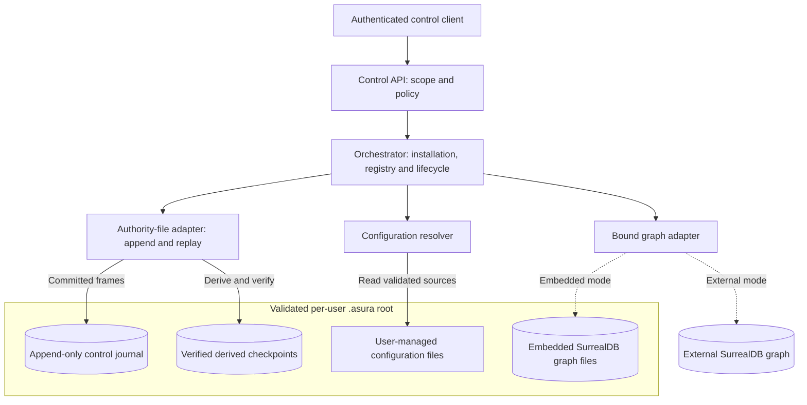
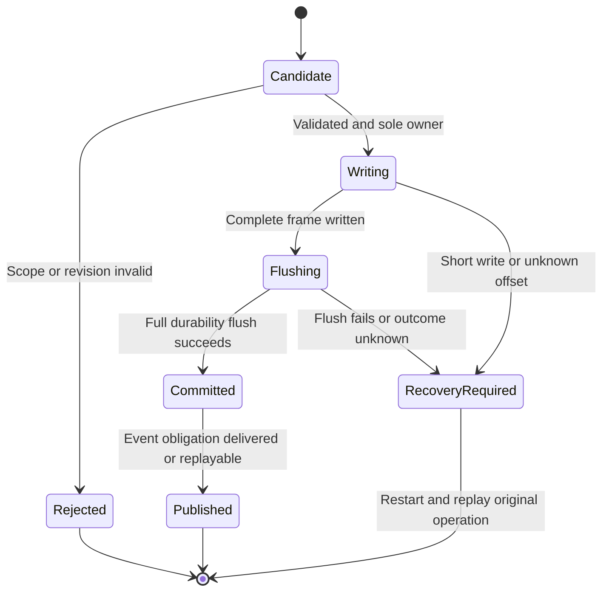
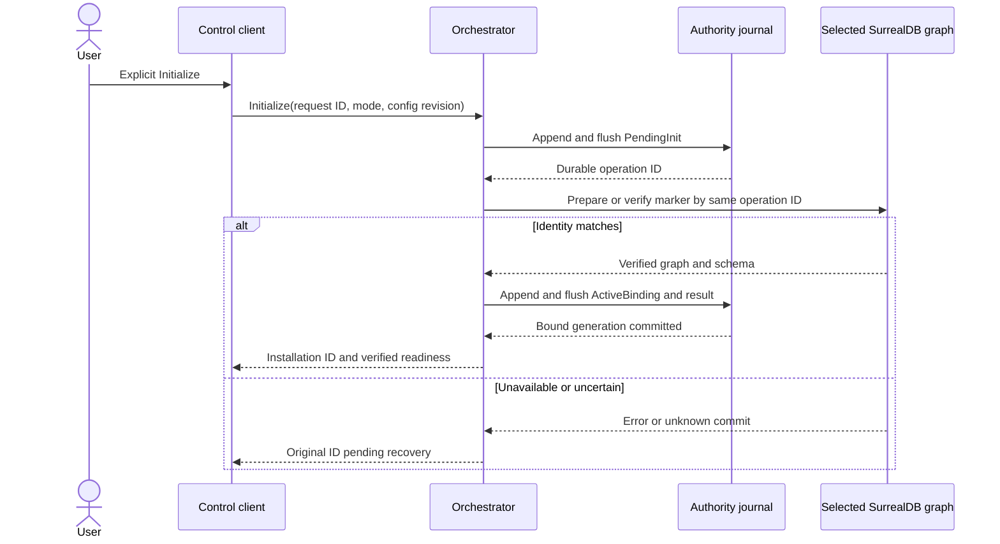
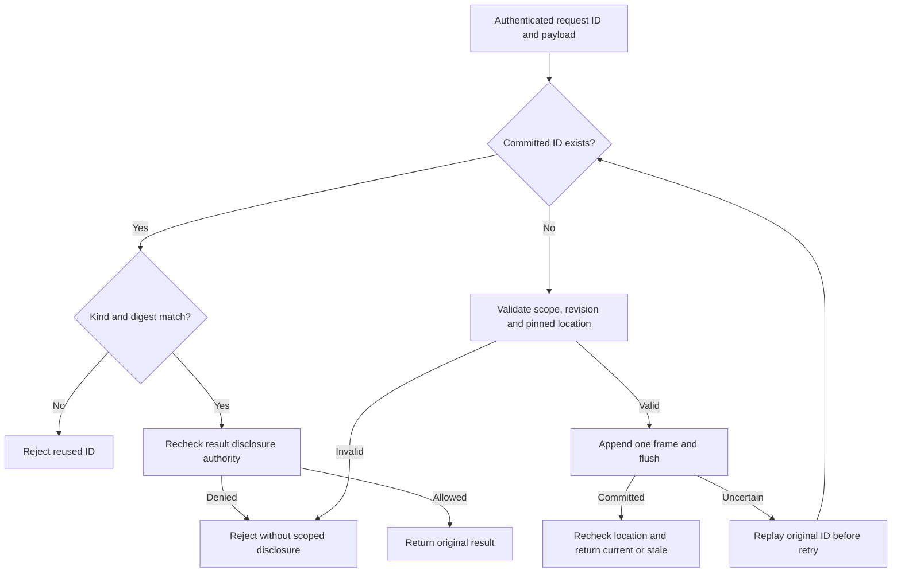
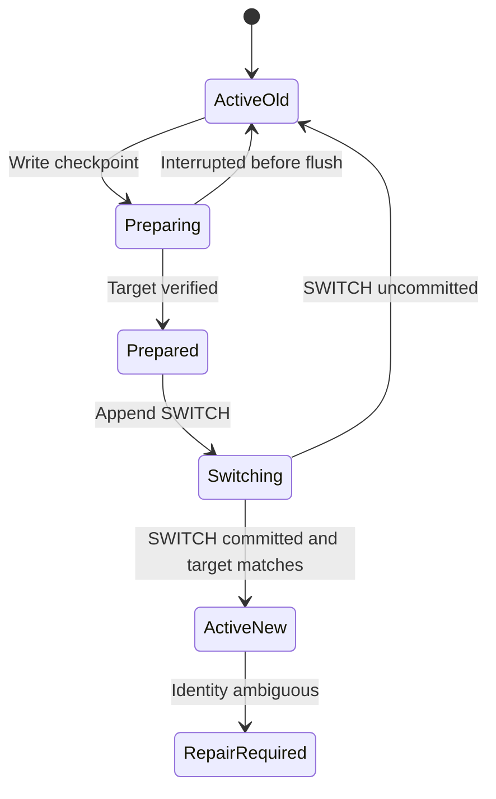

# D3 ordinary-file authority and recovery

Status: proposed I1 D3 design. The owner selected ordinary files plus the bound
SurrealDB graph on 2026-09-25 and ruled out SQLite. This document proposes one
append-only ordinary-file authority journal. Frame format, durability behavior,
compaction, schema versions and fault limits still need review and qualification.
It does not authorize implementation or claim runtime evidence. Later D3-D4 work
must extend the same authority contract to the full task/action ledger.

The [installation binding contract](context-storage-candidates.md#selected-installation-binding-and-change-contract)
owns graph selection and cutover requirements. The
[per-user home contract](user-service-configuration.md#per-user-home-and-hybrid-persistence)
owns the state root. The [production bootstrap design](production-bootstrap-status.md)
owns user-visible registration and status. This document specifies the proposed
local transaction mechanism for their I1 boundary.

## One authority journal

Propose one append-only journal under the validated `$HOME/.asura/` root as the
authoritative local control store. One complete frame is one control transaction.
It contains every state delta, request outcome and event-publication obligation
for that transition. The orchestrator owns those meanings; its file adapter owns
encoding, writes, replay and integrity checks. Only the active service owner may
append. Clients and agents never write or repair the journal directly.

User-managed configuration remains ordinary files. Embedded SurrealDB keeps its
engine files under `.asura/`; an external graph keeps physical data on its server.
The graph owns evidence and provenance, not the registry or accepted control
requests. An external outage may make graph work unavailable, but authenticated
local status and cancellation continue through the journal's authority contract.
The service must not acknowledge a durable cancellation until its journal frame
is committed.

| Candidate | I1 consequence |
| --- | --- |
| One append-only framed journal | One local transaction and replay order for bootstrap, registry, request outcomes and events; requires a designed format, tail recovery and compaction. |
| Immutable file per transaction | Atomic rename can publish each update, but high file counts, directory sync and manifest/snapshot management add operational cost. |
| SurrealDB for all authority | External outage would block local durable controls, or require a second local database in external mode. That weakens the required independent bootstrap and control path. |

The journal and its derived checkpoints are **ordinary files**, not an additional
database engine. Propose `state/control/` for the two slots, with
`data/graph/` for the embedded graph. D3 must finalize paths and retention.
No embedded graph directory is created in external mode.

### Authority and storage view

Proposed I1 view. Solid arrows denote authorized reads or writes. Dotted edges
are mutually exclusive graph modes. Checkpoints are rebuildable projections of
committed journal frames, never a second writable authority.

## Journal record and commit contract

Proposed logical frame fields: format version; bounded frame length; monotonic
sequence; previous-frame digest; operation/request ID; command kind and payload
digest; expected and resulting authority revisions; installation and owner
generations; typed state changes; request result; ordered event obligation; and
a frame digest plus end marker. The frame must encode one complete transition.
The digest detects accidental damage, gaps and reordered records; it is not a
MAC and does not protect against an attacker who can rewrite same-UID files.
D3 must select an exact canonical encoding, checksum algorithm and size bounds.

The active owner serializes candidate transitions, validates the expected
revision and all affected limits, then appends one complete frame. It performs a
full durability flush before acknowledging acceptance. The macOS `F_FULLFSYNC`
mechanism is a candidate; D1/D3/D7 must test support and behavior on the
selected filesystem and document the power-loss limit. A short write, flush
error, disk-full result or uncertain offset stops new admission until recovery.
The service cannot treat a buffered write as durable acceptance.

During replay, the adapter verifies a contiguous sequence, hash chain, length,
version and complete frame boundary. A complete valid frame remains committed
even if its client never received the acknowledgement; the request ID resolves
that ambiguity. An incomplete trailing frame is quarantined and treated as
unacknowledged only when no valid commit boundary exists. A checksum mismatch
in a complete frame, interior damage, sequence gap, unknown required version or
ambiguous tail enters RepairRequired. Recovery retains the original bytes for
inspection; it does not silently truncate a possibly accepted record.

The journal must contain a durable owner-generation transition after an
exclusive service owner is established and before work dispatch. D2-D3 must
prove that an old process or helper cannot dispatch using a stale generation.
The endpoint/lock is not an authority record and a PID is not a fencing token.

### Local transaction state

Proposed state machine for one append. A client acknowledgement follows
Committed, never Written. A process restart resolves an uncertain write by
replaying the original operation ID rather than appending a new effect.

## Initialization and graph binding

Normal startup opens existing authority files without creating replacements.
An existing root with a missing journal, damaged authoritative slot or
incompatible required format enters RepairRequired. An entirely absent root
shows Uninitialized and warns that absence cannot prove first-ever use. Only an
explicit authorized initialization request may create the root and first frame.
The service must establish exclusive per-user ownership before that creation;
the D2 runtime socket/guard location cannot depend on `.asura/` already existing.

1. Validate the account home, requested graph mode, service configuration and
   credential references. Partial external settings reject; they do not select
   the embedded default.
2. Create the protected root and journal area. Append and flush a PendingInit
   frame with one installation ID, graph identity intent, mode, configuration
   revision and stable operation ID. If creation stops before this frame is
   durable, preserve the partial root and require repair.
3. Prepare or open only the selected graph. Write or read its identity marker
   under the same graph operation ID. An unknown database commit is reconciled
   by marker identity, not retried as a new installation.
4. Verify graph identity and schema. Append and flush an ActiveBinding frame
   with binding generation and the original request outcome. Recheck the bound
   graph before GraphReady and at every later graph-dependent admission.

The exact external create/open contract, marker schema and credential workflow
remain D3 decisions. A graph marker is evidence about the graph, not an
independently writable copy of the local binding authority. A transaction
cannot span the file journal and SurrealDB; the durable PendingInit frame is
the recovery anchor for every intermediate state. A binding mismatch or missing
embedded engine data is RepairRequired. An external outage retains local status
but gates registration and graph work; it never starts an embedded graph.

### Initialization across stores

Proposed D3 sequence. The client keeps the original request ID when delivery
is uncertain. The selected graph may be embedded or external; the other mode
remains unopened.

### I1 recovery cases

Proposed fault IDs. Each requires isolated transition tests, a real-process
crash or fault-injection integration case, and CLI-visible recovery. Run the
graph-dependent cases in embedded and real external modes; I4 repeats their
presentation through the TUI.

| ID | Fault point | Required result |
| --- | --- | --- |
| PR1 | Root or journal created before first durable PendingInit frame | Partial root requires repair; no automatic new installation or graph. |
| PR2 | PendingInit durable before graph operation | Resume the same installation and graph operation after revalidation. |
| PR3 | Graph marker may commit but acknowledgement is lost | Query the selected graph by original identity; no blind second create or fallback. |
| PR4 | Marker verified before ActiveBinding flush | No GraphReady claim; resume the original pending operation. |
| PR5 | ActiveBinding flush succeeds but client acknowledgement is lost | Replay the complete frame, verify graph and return the original result by request ID. |
| PR6 | External graph disappears after binding | Preserve binding and registry; return GraphUnavailable and allow independently durable control. |
| PR7 | Journal has incomplete final frame after interrupted write | Preserve evidence; quarantine only a proved uncommitted tail, and resolve request ID before another write. |
| PR8 | Journal has interior damage, complete-frame mismatch or version gap | RepairRequired with no dispatch or guessed replay. |

## Registration, events and projection

I1 registration writes no graph record. One journal frame records the context
and working-location association, validated object identity, revision, request
ID plus payload digest, result and publication obligation. Replaying that frame
reconstructs all five. The same ID with a different digest rejects. A lost
acknowledgement resolves through replay or the current journal index; the
client does not submit a new registration to guess the result.

The [registration race contract](production-bootstrap-status.md#first-use-and-project-registration-contract)
requires a filesystem identity check before append, immediately after commit
and before later status or work. The journal binds the pinned object identity,
not a mutable pathname. A path changed across commit yields a durable but
stale association; no subsequent request follows its replacement silently.
Derived in-memory indexes and checkpoints cannot authorize an action if the
journal's current revision or source identity is uncertain.

### Idempotency decision

Proposed algorithm. The lookup index is derived from committed frames. Current
authorization is rechecked before revealing an earlier result.

## Compaction and backup

The journal cannot grow without bound. Propose two pre-created ordinary-file
slots. The active slot contains the current append log. While holding the sole
writer gate, the service writes a self-contained checkpoint to the inactive
slot: every authoritative object, request result and digest needed for retry,
unresolved intent and event obligation, plus the last sequence and frame hash.
It flushes and verifies that slot before appending and flushing a SWITCH frame
to the active slot naming the target slot, epoch and checkpoint digest. Only
then may it append later transactions to the target. Replay follows a valid
SWITCH and matching checkpoint; it never chooses a slot by largest epoch alone.
The old slot remains a recovery path until target replay and retention rules
permit reuse. A checkpoint cannot silently discard deduplication outcomes or
pending cross-store work. D3 must fix the exact torn-slot and SWITCH algorithm,
limits, reuse ordering and proof for directory-entry durability at first
creation. The checkpoint is a projection of the same authority stream, not an
independent writer.

### Slot switch state

Proposed compaction state view. Arrows show writer transitions and replay
decisions. A valid switch requires a matching target checkpoint.

The active new slot accepts later transactions. A subsequent switch reuses the
old slot only after the selected recovery path remains unambiguous.

A consistent backup includes both authority slots, selected checkpoint, schema
versions, installation ID, owner/binding generation and graph identity. The
service gates new graph writes while capturing the graph and local authority
at a recorded generation. It preserves status and cancellation, and waits for
or reports unsettled effects. External mode requires a coordinated server-side
graph backup; copying `.asura/` alone is incomplete. Restore verifies every
member, current policy and reference before any work admission. An arbitrary
live directory copy is not a qualified backup.

Every file and frame format has a compatibility version. An unsupported version
blocks admission without automatic rewrite. An authorized migration records
its operation ID and phase before changing files, preserves old references and
resumes or blocks after a crash. D3 must define supported upgrade pairs,
checkpoint order, rollback limits and the treatment of old slots.

## Required qualification and remaining choices

The local writer must be tested on supported macOS filesystems for short writes,
disk full, interrupted flush, process death, path replacement, corruption,
slot switch, checkpoint publication and restore. Verify the original request
outcome after lost acknowledgements. Exercise both SurrealDB modes with real
stores and forced failures; mock success cannot prove graph identity or flush
semantics. D7 must pin the exact frame encoding, digest, size limits, flush
mechanism, test commands, environments and performance targets.

This I1 design remains proposed until D2 qualifies the standalone runtime guard,
D3 fixes frame/slot/marker schemas and backup
protocol, and D7 maps each independent fault to runnable unit, integration and
end-to-end checks. The owner must review the ready design and plan before code.
