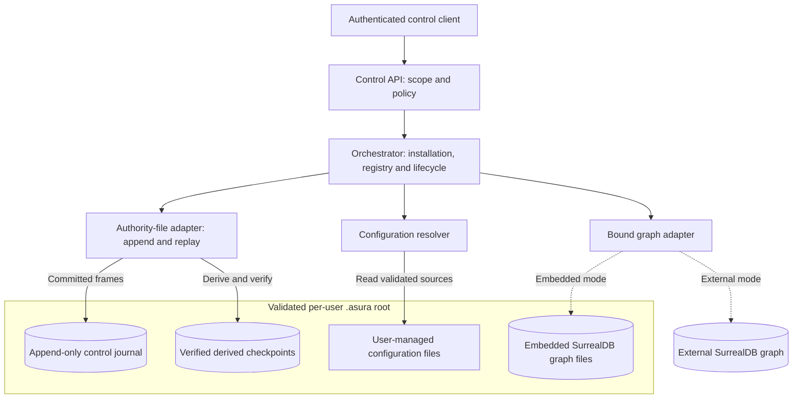
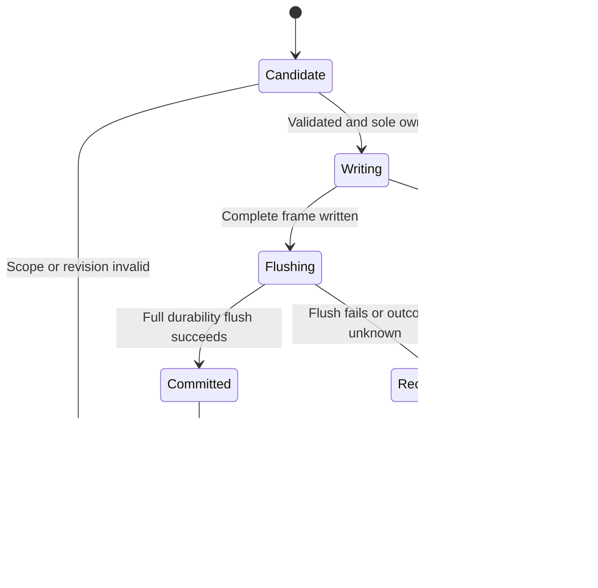
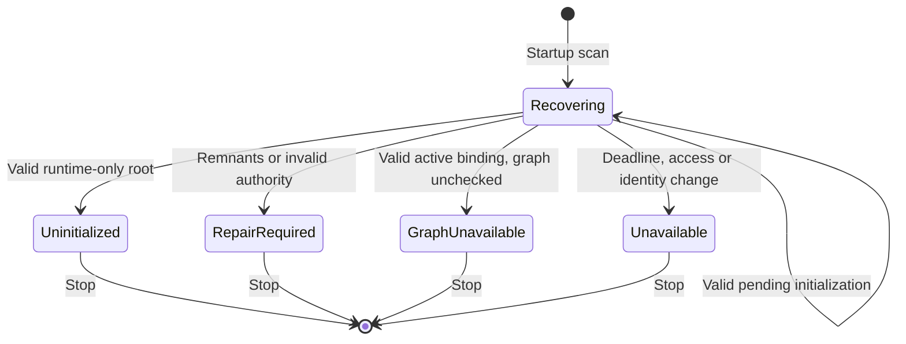
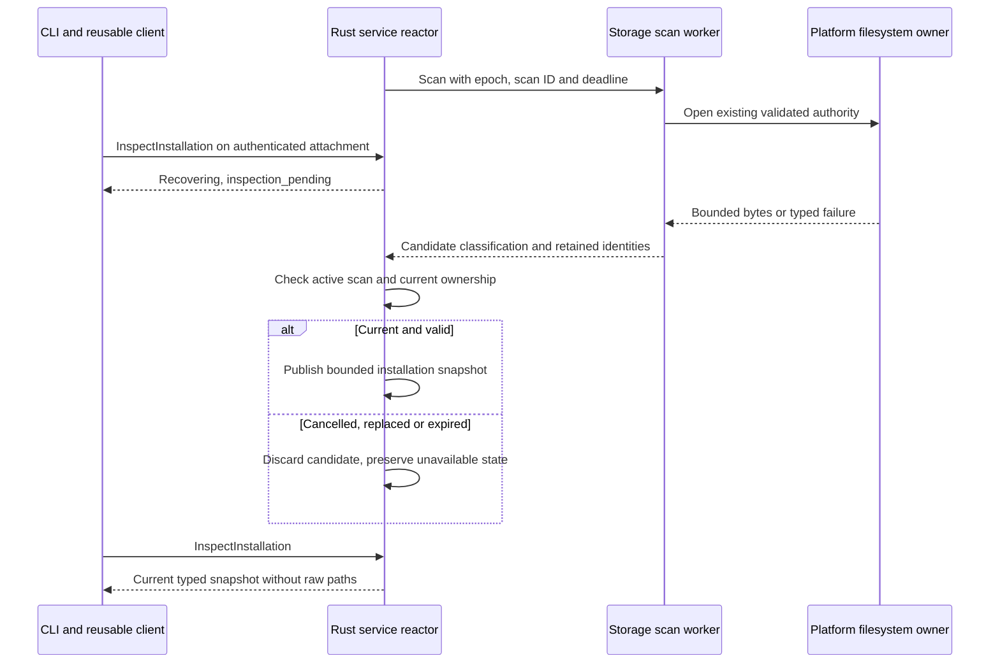
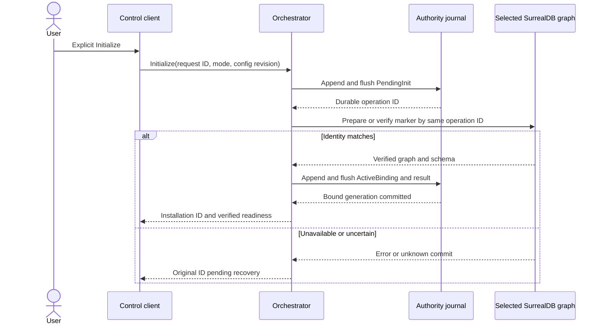
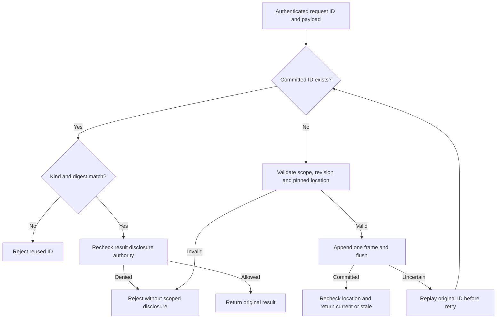
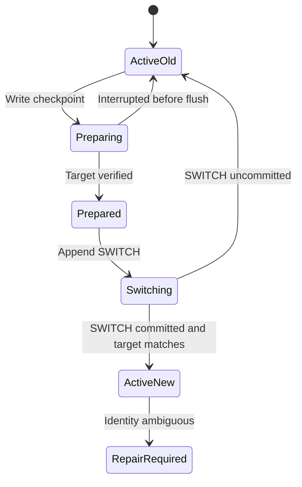

# D3 ordinary-file authority and recovery

Status: proposed I1 D3 design. The owner selected ordinary files plus the bound
SurrealDB graph on 2026-09-25 and ruled out SQLite. This document proposes one
append-only ordinary-file authority journal. Frame format, durability behavior,
compaction, schema versions and fault limits still need review and qualification.
The read-only stage 3A contract below is selected for scoped implementation under
the current implicit authorization. It has no runtime evidence. Later D3-D4 work
must extend the same authority contract to the full task/action ledger.

The [first conversation amendment](conversation-admission.md) extends format 1
for installation request outcomes, project registration, conversation admission,
token reservation and terminal recovery. Root selected its CA-A pure codec/replay
packet after review. All journal frames remain format 1; its diagnostic records
retain their original payloads and are never silently converted.
Writer, production graph binding and service integration retain that amendment's
separate validation gates. This extends the same authority owner and file.

The [installation binding contract](context-storage-candidates.md#selected-installation-binding-and-change-contract)
owns graph selection and cutover requirements. The
[per-user home contract](user-service-configuration.md#per-user-home-and-hybrid-persistence)
owns the state root. The [production bootstrap design](production-bootstrap-status.md)
owns user-visible registration and status. This document specifies the proposed
local transaction mechanism for their I1 boundary.

## One authority journal

Propose one append-only journal under the validated `$HOME/.asura/` root as the
authoritative local control store. One complete frame is one control transaction.
It contains every state delta, request outcome and event-publication obligation
for that transition. The orchestrator owns those meanings; its file adapter owns
encoding, writes, replay and integrity checks. Only the active service owner may
append. Clients and agents never write or repair the journal directly.

User-managed configuration remains ordinary files. Embedded SurrealDB keeps its
engine files under `.asura/`; an external graph keeps physical data on its server.
The graph owns evidence and provenance, not the registry or accepted control
requests. An external outage may make graph work unavailable, but authenticated
local status and cancellation continue through the journal's authority contract.
The service must not acknowledge a durable cancellation until its journal frame
is committed.

| Candidate | I1 consequence |
| --- | --- |
| One append-only framed journal | One local transaction and replay order for bootstrap, registry, request outcomes and events; requires a designed format, tail recovery and compaction. |
| Immutable file per transaction | Atomic rename can publish each update, but high file counts, directory sync and manifest/snapshot management add operational cost. |
| SurrealDB for all authority | External outage would block local durable controls, or require a second local database in external mode. That weakens the required independent bootstrap and control path. |

The journal and its derived checkpoints are **ordinary files**, not an additional
database engine. Propose `state/control/` for the two slots. The owner selected
`db/` for the embedded graph on 2026-09-26, replacing the earlier `data/graph/`
proposal. D3 must finalize the journal path and retention.
No embedded graph directory is created in external mode.

### Authority and storage view

Proposed I1 view. Solid arrows denote authorized reads or writes. Dotted edges
are mutually exclusive graph modes. Checkpoints are rebuildable projections of
committed journal frames, never a second writable authority.

```mermaid
flowchart TD
    Client["Authenticated control client"] --> API["Control API: scope and policy"]
    API --> Orch["Orchestrator: installation, registry and lifecycle"]
    Orch --> File["Authority-file adapter: append and replay"]
    External[("External SurrealDB graph")]
    subgraph Home["Validated per-user .asura root"]
        Journal[("Append-only control journal")]
        Snapshot[("Verified derived checkpoints")]
        Config["User-managed configuration files"]
        Embedded[("Embedded SurrealDB graph files")]
    end
    File -->|Committed frames| Journal
    File -->|Derive and verify| Snapshot
    Orch --> Resolver["Configuration resolver"]
    Resolver -->|Read validated sources| Config
    Orch --> Graph["Bound graph adapter"]
    Graph -.->|Embedded mode| Embedded
    Graph -.->|External mode| External
```

## Journal record and commit contract

Proposed logical frame fields: format version; bounded frame length; monotonic
sequence; previous-frame digest; operation/request ID; command kind and payload
digest; expected and resulting authority revisions; installation and owner
generations; typed state changes; request result; ordered event obligation; and
a frame digest plus end marker. The frame must encode one complete transition.
The digest detects accidental damage, gaps and reordered records; it is not a
MAC and does not protect against an attacker who can rewrite same-UID files.
D3 must select an exact canonical encoding, checksum algorithm and size bounds.

The active owner serializes candidate transitions, validates the expected
revision and all affected limits, then appends one complete frame. It performs a
full durability flush before acknowledging acceptance. The macOS `F_FULLFSYNC`
mechanism is a candidate; D1/D3/D7 must test support and behavior on the
selected filesystem and document the power-loss limit. A short write, flush
error, disk-full result or uncertain offset stops new admission until recovery.
The service cannot treat a buffered write as durable acceptance.

During replay, the adapter verifies a contiguous sequence, hash chain, length,
version and complete frame boundary. A complete valid frame remains committed
even if its client never received the acknowledgement; the request ID resolves
that ambiguity. An incomplete trailing frame is quarantined and treated as
unacknowledged only when no valid commit boundary exists. A checksum mismatch
in a complete frame, interior damage, sequence gap, unknown required version or
ambiguous tail enters RepairRequired. Recovery retains the original bytes for
inspection; it does not silently truncate a possibly accepted record.

The journal must contain a durable owner-generation transition after an
exclusive service owner is established and before work dispatch. D2-D3 must
prove that an old process or helper cannot dispatch using a stale generation.
The endpoint/lock is not an authority record and a PID is not a fencing token.

### Local transaction state

Proposed state machine for one append. A client acknowledgement follows
Committed, never Written. A process restart resolves an uncertain write by
replaying the original operation ID rather than appending a new effect.

```mermaid
stateDiagram-v2
    [*] --> Candidate
    Candidate --> Rejected: Scope or revision invalid
    Candidate --> Writing: Validated and sole owner
    Writing --> Flushing: Complete frame written
    Writing --> RecoveryRequired: Short write or unknown offset
    Flushing --> Committed: Full durability flush succeeds
    Flushing --> RecoveryRequired: Flush fails or outcome unknown
    Committed --> Published: Event obligation delivered or replayable
    Published --> [*]
    Rejected --> [*]
    RecoveryRequired --> [*]: Restart and replay original operation
```

## Stage 3A: bounded read-only authority inspection

Selected scoped contract. Stage 3A reads existing authority and classifies absent
or damaged state. It creates no journal, installation ID, owner-generation record,
checkpoint or graph connection. It never repairs, truncates or migrates files.
The existing service retains its runtime lock and installation mutations remain
unavailable. A replayed owner generation is historical; it grants no dispatch.
The append and compaction sections remain later writer requirements.

### Ownership and supported state

The Rust storage adapter owns byte validation and replay. The Rust service owns
installation classification and publication. The platform owns descriptor-relative
filesystem access and account checks. The control/client owners transport typed
results; the CLI renders them. No Swift helper or separate process is added.
Reuse the foundation's supported local APFS home and runtime ownership contract.
Do not treat its local checkpoint evidence as complete filesystem qualification.

Select `state/control/slot-0.log` for the initial authority stream. Stage 3A supports
format 1 with slot 0 only. Any `slot-1.log`, checkpoint, switch record or other
control-area entry returns `unsupported_layout` without choosing a newer slot.
Later compaction must version and qualify its layout before enabling it. The
read-only adapter needs no compaction writer or retention worker.

Open existing directories without creation, through validated held descriptors.
Require current-user ownership, directory mode 0700 and ordinary-file mode 0600;
reject symlinks, extra hard links, ACL access beyond the supported foundation
profile and nonregular journal files. Retain device/inode identities. Recheck the
root, directory chain, journal identity, length and modification metadata before
publishing replay. A change makes the snapshot unavailable; never follow a
replacement. A malicious process with the same UID remains outside the supported
threat boundary. Checksums detect damage, not hostile rewriting.

The service classifies at most 64 immediate root entries. Validated root `.DS_Store`
metadata is excluded from authority evidence under the
[Finder metadata contract](conversation-admission.md#automatic-initialization-and-explicit-registration-workflow).
Its regular-file permission exception permits read access but never group/world
write access. All other file and directory rules remain applicable.
`run/` and `logs/` are
non-authoritative: validate their directory type, ownership and safe permissions,
with no group/world write permission; existing log directories need not be exactly
0700. Do not replay diagnostic log contents. Their presence alone cannot initialize
an installation. `config.yaml`, `db/`, `data/`, `sessions/`, `tmp/`, `state/` or any unknown
entry without a valid journal is installation evidence requiring inspection;
report `installation_remnants`, never silently call it fresh. A root containing
only validated `run/` and optional `logs/` is `Uninitialized`. This classification
permits no initialization action in 3A. Missing records cannot prove first-ever use.
If a valid journal exists, preserve the named areas without interpreting contents.
This includes the selected `data/` classifier/model areas, including Core AI and
MLX artifacts; their presence is not unknown root content. An unlisted root entry
still produces `unknown_content`. Configuration and graph
validation remain unavailable until their owners are implemented.

### Format 1 byte contract

All integers are unsigned big-endian; there is no native padding. Each frame is
one contiguous header, payload and trailer. The table order is byte order.

| Header field | Bytes | Validation |
| --- | --- | --- |
| Magic | 8 | ASCII `ASURAJ01` |
| Format version; record kind | 2 each | Version 1; diagnostic kinds 1–3 below; conversation kinds in the amendment |
| Total frame length | 4 | Includes 144-byte header, payload and 40-byte trailer |
| Sequence | 8 | Starts at 1, increases by 1, never wraps |
| Previous frame digest | 32 | All zero for sequence 1; otherwise preceding digest |
| Installation ID | 16 | Nonzero; unchanged throughout stream |
| Operation ID | 16 | Nonzero; unique in this format |
| Command digest | 32 | SHA-256 of the two-byte kind followed by exact payload bytes |
| Expected revision; resulting revision | 8 each | Starts at 0 to 1; each frame advances exactly once |
| Owner generation | 8 | Nonzero; validated by transition rules below |

The trailer contains SHA-256 of the exact header and payload, followed by the
8-byte ASCII commit boundary `ASURAC01`. Hash the encoded bytes; do not decode and
re-encode before comparison. No unknown fields, trailing payload bytes or lossy
integer conversions are accepted. Reuse one reviewed SHA-256 implementation;
this design introduces no handwritten digest implementation or dependency change.

| Kind | Exact payload, in order | Replay effect |
| --- | --- | --- |
| 1 PendingInit | Mode u8 (1 embedded, 2 external); configuration revision u64; configuration digest 32 bytes; intended graph ID 16 bytes | Only sequence 1, owner generation 1; records pending initialization |
| 2 ActiveBinding | Binding generation u64; graph ID 16 bytes; configuration digest 32 bytes | Once after PendingInit; generation 1; graph ID and digest must match pending intent |
| 3 OwnerGeneration | Empty | Previous owner generation plus 1; no binding or operation completion effect |

Configuration revision and graph ID must be nonzero. Kind 2 retains the current
owner generation; kind 3 may follow either initialization state. Revision, sequence
or generation exhaustion rejects rather than wrapping. Unknown kinds reject. Adding an authorized record kind does not change the
format number. Only the owner can authorize a format-number change. The adapter rejects repeated operation IDs, including
identical bytes at a new sequence. The same initialization intent is correlated
by its installation/graph/configuration identity; each committed transition has
its own operation ID. Future durable request/outcome schemas must distinguish
that transition identity from the user's initialization request before a writer
is implemented. Stage 3A cannot answer `ResolveRequest` or claim a user request
completed from these diagnostic bootstrap records.

The [conversation amendment](conversation-admission.md#format-1-and-record-compatibility)
adds request-bearing initialization kinds 10 and 11, plus kinds 4 through 9.
Kind 3 remains shared. The first record selects diagnostic or request-bearing
initialization rules. Public inspection validates the complete corresponding
stream before returning its summary. A diagnostic stream cannot acquire request
outcomes by mixing these initialization records. Their payloads and numbers are
distinct; none changes the format-1 envelope or existing diagnostic fixtures.

A complete valid frame is a replayed commit boundary even if its acknowledgement
was lost. That does not establish successful graph verification now. Stage 3A
reports PendingInit as `Recovering` with `initialization_pending`; ActiveBinding
as `GraphUnavailable` with `graph_verification_unavailable`. It never reports
`ControlReady` or `GraphReady`, resumes initialization or increments a generation.

### Bounds, interruption and preservation

Maximum journal size is 8 MiB, frame size 64 KiB and frame count 32,768. Maximum
replay allocation is 16 MiB, including the bounded operation-ID index. Read in
chunks no larger than 64 KiB. Inspect frame lengths before allocation. Exceeding
any bound returns `inspection_limit`; it cannot authorize partial-state use.

One bounded storage worker performs one startup scan. The reactor remains able
to serve Inspect and Stop while the state is `Recovering`/`inspection_pending`.
The worker posts one typed result with the current service epoch and scan ID.
A result from a stopped or obsolete scan cannot publish. Use a five-second
monotonic deadline and cancellation checks between reads and frames. The timer
marks the view unavailable on expiry; it does not prove a blocked syscall ended.
Stop cancels the scan and retains ownership until the worker settles. The reactor
checks worker completion without a blocking join; join only after completion is
reported. If the existing stop deadline expires first, keep the owner and serve
responsive `RepairOnly` inspection while settlement remains unknown. A subsequent
Stop may complete after the worker exits. Never claim timeout killed a blocked
read. Unknown settlement follows the existing drain failure contract. No periodic scan,
filesystem watcher or unbounded retry is introduced. Restart requests a new scan.

EOF exactly at a valid frame boundary permits replay. An empty journal is a
partial installation, not an empty initialized installation. A short header,
payload or trailer is `incomplete_tail`; preserve the entire file and expose
`RepairRequired`. Complete checksum/chain/revision damage is `corrupt_authority`.
Unsupported version/layout is distinct from corruption. Stage 3A may retain a
verified prefix for diagnostics internally, but exposes no installation identity
or usable revision from a failed scan. It writes no quarantine file and performs
no truncation. Its stricter read-only response preserves the later PR7 repair
requirement; it does not redefine an incomplete tail as a committed transition.

The future writer must flush complete frames before acknowledgement and qualify
first-file and directory-entry durability. No write API ships in 3A, so short-write,
flush-error, slot-switch and power-loss qualification stay writer prerequisites.
Read-only replay tests exercise their resulting bytes without claiming to qualify
the missing writer. Process-death tests establish only process-crash behavior.

### Read-only inspection state

Selected stage 3A view. Arrows denote classification and publication decisions;
no transition writes installation state. Service shutdown remains independently
owned by the foundation lifecycle.

```mermaid
stateDiagram-v2
    [*] --> Recovering: Startup scan
    Recovering --> Uninitialized: Valid runtime-only root
    Recovering --> RepairRequired: Remnants or invalid authority
    Recovering --> Recovering: Valid pending initialization
    Recovering --> GraphUnavailable: Valid active binding, graph unchecked
    Recovering --> Unavailable: Deadline, access or identity change
    Uninitialized --> [*]: Stop
    RepairRequired --> [*]: Stop
    GraphUnavailable --> [*]: Stop
    Unavailable --> [*]: Stop
```

### Inspection publication

Selected interaction view. Arrows carry requests and bounded snapshots, never
journal writes. A pending scan does not block control traffic.

```mermaid
sequenceDiagram
    participant CLI as CLI and reusable client
    participant S as Rust service reactor
    participant W as Storage scan worker
    participant P as Platform filesystem owner
    S->>W: Scan with epoch, scan ID and deadline
    W->>P: Open existing validated authority
    CLI->>S: InspectInstallation on authenticated attachment
    S-->>CLI: Recovering, inspection_pending
    P-->>W: Bounded bytes or typed failure
    W-->>S: Candidate classification and retained identities
    S->>S: Check active scan and current ownership
    alt Current and valid
        S->>S: Publish bounded installation snapshot
    else Cancelled, replaced or expired
        S->>S: Discard candidate, preserve unavailable state
    end
    CLI->>S: InspectInstallation
    S-->>CLI: Current typed snapshot without raw paths
```

## Initialization and graph binding

Normal startup may create the validated `.asura/run/` runtime area under the
[service ownership contract](system-architecture.md). This selected placement
includes permitted creation of the validated `.asura/` parent. Runtime setup
creates no journal, installation identity or graph binding. Existing authority
files are opened without creating replacements.

After obtaining sole ownership, the installation owner classifies the state.
A validated runtime-only root with no installation remnants or detected conflict
is Uninitialized. It still requires explicit initialization and the warning that
missing records cannot prove first-ever use. An installation area with a missing
journal, a damaged slot, an incompatible format, unknown content or conflicting
graph evidence enters RepairRequired. The service preserves those files; it does
not overwrite them to establish an empty installation.

The [runtime-only root contract](production-bootstrap-status.md#runtime-only-root-and-explicit-installation)
owns the user-visible distinction. D1-D3 must define the exact runtime allowlist
and conflict checks. The presence of `run/` alone cannot establish that a root
is safe for initialization. Only an explicit authorized initialization request
may create the journal and first installation frame. The runtime owner lock must
remain held throughout initialization and authority recovery.

1. Validate the account home, requested graph mode, service configuration and
   credential references. Partial external settings reject; they do not select
   the embedded default.
2. Revalidate the protected root and create only the installation journal area.
   Append and flush a PendingInit
   frame with one installation ID, graph identity intent, mode, configuration
   revision and stable operation ID. If creation stops before this frame is
   durable, preserve the partial installation area and require repair.
3. Prepare or open only the selected graph. Write or read its identity marker
   under the same graph operation ID. An unknown database commit is reconciled
   by marker identity, not retried as a new installation.
4. Verify graph identity and schema. Append and flush an ActiveBinding frame
   with binding generation and the original request outcome. Recheck the bound
   graph before GraphReady and at every later graph-dependent admission.

The exact external create/open contract, marker schema and credential workflow
remain D3 decisions. A graph marker is evidence about the graph, not an
independently writable copy of the local binding authority. A transaction
cannot span the file journal and SurrealDB; the durable PendingInit frame is
the recovery anchor for every intermediate state. A binding mismatch or missing
embedded engine data is RepairRequired. An external outage retains local status
but gates registration and graph work; it never starts an embedded graph.

### Initialization across stores

Proposed D3 sequence. The client keeps the original request ID when delivery
is uncertain. The selected graph may be embedded or external; the other mode
remains unopened.

```mermaid
sequenceDiagram
    actor User
    participant Client as Control client
    participant Orch as Orchestrator
    participant Log as Authority journal
    participant Graph as Selected SurrealDB graph
    User->>Client: Explicit Initialize
    Client->>Orch: Initialize(request ID, mode, config revision)
    Orch->>Log: Append and flush PendingInit
    Log-->>Orch: Durable operation ID
    Orch->>Graph: Prepare or verify marker by same operation ID
    alt Identity matches
        Graph-->>Orch: Verified graph and schema
        Orch->>Log: Append and flush ActiveBinding and result
        Log-->>Orch: Bound generation committed
        Orch-->>Client: Installation ID and verified readiness
    else Unavailable or uncertain
        Graph-->>Orch: Error or unknown commit
        Orch-->>Client: Original ID pending recovery
    end
```

### I1 recovery cases

Proposed fault IDs. Each requires isolated transition tests, a real-process
crash or fault-injection integration case, and CLI-visible recovery. Run the
graph-dependent cases in embedded and real external modes; I4 repeats their
presentation through the TUI.

| ID | Fault point | Required result |
| --- | --- | --- |
| PR1 | Installation journal area created before first durable PendingInit frame | Partial installation requires repair; no automatic new installation or graph. A validated runtime-only root is covered separately by PBS15. |
| PR2 | PendingInit durable before graph operation | Resume the same installation and graph operation after revalidation. |
| PR3 | Graph marker may commit but acknowledgement is lost | Query the selected graph by original identity; no blind second create or fallback. |
| PR4 | Marker verified before ActiveBinding flush | No GraphReady claim; resume the original pending operation. |
| PR5 | ActiveBinding flush succeeds but client acknowledgement is lost | Replay the complete frame, verify graph and return the original result by request ID. |
| PR6 | External graph disappears after binding | Preserve binding and registry; return GraphUnavailable and allow independently durable control. |
| PR7 | Journal has incomplete final frame after interrupted write | Preserve evidence; quarantine only a proved uncommitted tail, and resolve request ID before another write. |
| PR8 | Journal has interior damage, complete-frame mismatch or version gap | RepairRequired with no dispatch or guessed replay. |

The [PBS15 runtime-root cases](production-bootstrap-status.md#pbs15-runtime-directory-does-not-initialize-an-installation)
add absent, runtime-only, partial, unknown-content and conflicting-graph startup
fixtures. They require unit classification, real-process/filesystem integration
and CLI/TUI checks. They do not replace PR1's interrupted initialization case.

## Registration, events and projection

I1 registration writes no graph record. One journal frame records the context
and working-location association, validated object identity, revision, request
ID plus payload digest, result and publication obligation. Replaying that frame
reconstructs all five. The same ID with a different digest rejects. A lost
acknowledgement resolves through replay or the current journal index; the
client does not submit a new registration to guess the result.

The [registration race contract](production-bootstrap-status.md#first-use-and-project-registration-contract)
requires a filesystem identity check before append, immediately after commit
and before later status or work. The journal binds the pinned object identity,
not a mutable pathname. A path changed across commit yields a durable but
stale association; no subsequent request follows its replacement silently.
Derived in-memory indexes and checkpoints cannot authorize an action if the
journal's current revision or source identity is uncertain.

### Idempotency decision

Proposed algorithm. The lookup index is derived from committed frames. Current
authorization is rechecked before revealing an earlier result.

```mermaid
flowchart TD
    Request["Authenticated request ID and payload"] --> Lookup{"Committed ID exists?"}
    Lookup -->|Yes| Compare{"Kind and digest match?"}
    Compare -->|No| Conflict["Reject reused ID"]
    Compare -->|Yes| Auth["Recheck result disclosure authority"]
    Auth -->|Denied| Reject["Reject without scoped disclosure"]
    Auth -->|Allowed| Original["Return original result"]
    Lookup -->|No| Validate["Validate scope, revision and pinned location"]
    Validate -->|Invalid| Reject
    Validate -->|Valid| Append["Append one frame and flush"]
    Append -->|Committed| Current["Recheck location and return current or stale"]
    Append -->|Uncertain| Resolve["Replay original ID before retry"]
    Resolve --> Lookup
```

## Compaction and backup

The journal cannot grow without bound. Propose two pre-created ordinary-file
slots. The active slot contains the current append log. While holding the sole
writer gate, the service writes a self-contained checkpoint to the inactive
slot: every authoritative object, request result and digest needed for retry,
unresolved intent and event obligation, plus the last sequence and frame hash.
It flushes and verifies that slot before appending and flushing a SWITCH frame
to the active slot naming the target slot, epoch and checkpoint digest. Only
then may it append later transactions to the target. Replay follows a valid
SWITCH and matching checkpoint; it never chooses a slot by largest epoch alone.
The old slot remains a recovery path until target replay and retention rules
permit reuse. A checkpoint cannot silently discard deduplication outcomes or
pending cross-store work. D3 must fix the exact torn-slot and SWITCH algorithm,
limits, reuse ordering and proof for directory-entry durability at first
creation. The checkpoint is a projection of the same authority stream, not an
independent writer.

### Slot switch state

Proposed compaction state view. Arrows show writer transitions and replay
decisions. A valid switch requires a matching target checkpoint.

```mermaid
stateDiagram-v2
    [*] --> ActiveOld
    ActiveOld --> Preparing: Write checkpoint
    Preparing --> ActiveOld: Interrupted before flush
    Preparing --> Prepared: Target verified
    Prepared --> Switching: Append SWITCH
    Switching --> ActiveOld: SWITCH uncommitted
    Switching --> ActiveNew: SWITCH committed and target matches
    ActiveNew --> RepairRequired: Identity ambiguous
```

The active new slot accepts later transactions. A subsequent switch reuses the
old slot only after the selected recovery path remains unambiguous.

A consistent backup includes both authority slots, selected checkpoint, schema
versions, installation ID, owner/binding generation and graph identity. The
service gates new graph writes while capturing the graph and local authority
at a recorded generation. It preserves status and cancellation, and waits for
or reports unsettled effects. External mode requires a coordinated server-side
graph backup; copying `.asura/` alone is incomplete. Restore verifies every
member, current policy and reference before any work admission. An arbitrary
live directory copy is not a qualified backup.

Every file and frame format has a compatibility version. An unsupported version
blocks admission without automatic rewrite. An authorized migration records
its operation ID and phase before changing files, preserves old references and
resumes or blocks after a crash. D3 must define supported upgrade pairs,
checkpoint order, rollback limits and the treatment of old slots.

## Required qualification and remaining choices

The local writer must be tested on supported macOS filesystems for short writes,
disk full, interrupted flush, process death, path replacement, corruption,
slot switch, checkpoint publication and restore. Verify the original request
outcome after lost acknowledgements. Exercise both SurrealDB modes with real
stores and forced failures; mock success cannot prove graph identity or flush
semantics. D7 must pin the exact frame encoding, digest, size limits, flush
mechanism, test commands, environments and performance targets.

This I1 design remains proposed until D2 qualifies the standalone runtime guard,
D3 fixes frame/slot/marker schemas and backup
protocol, and D7 maps each independent fault to runnable unit, integration and
end-to-end checks. The owner must review the ready design and plan before code.
