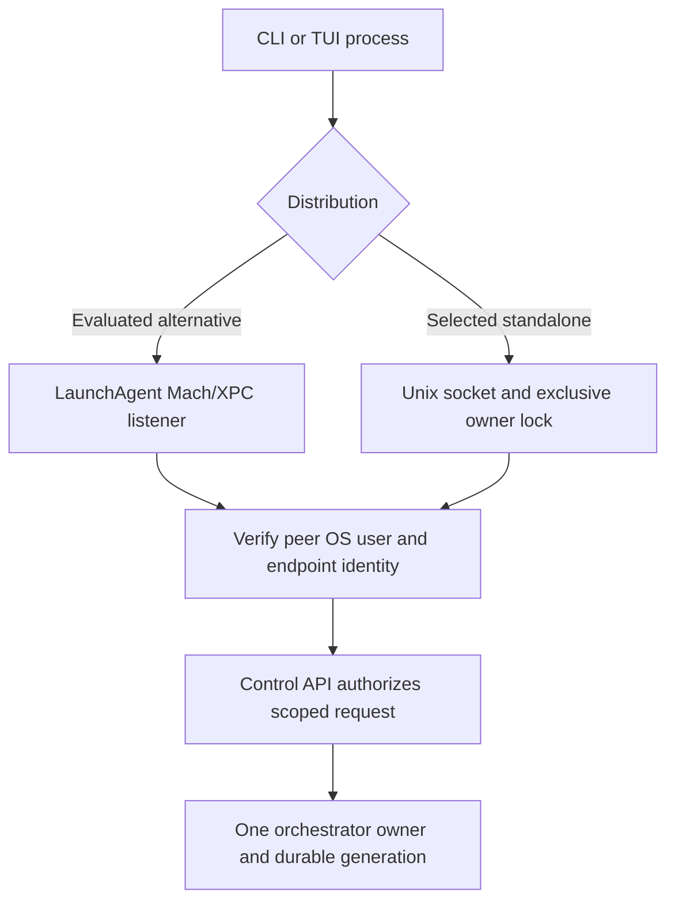
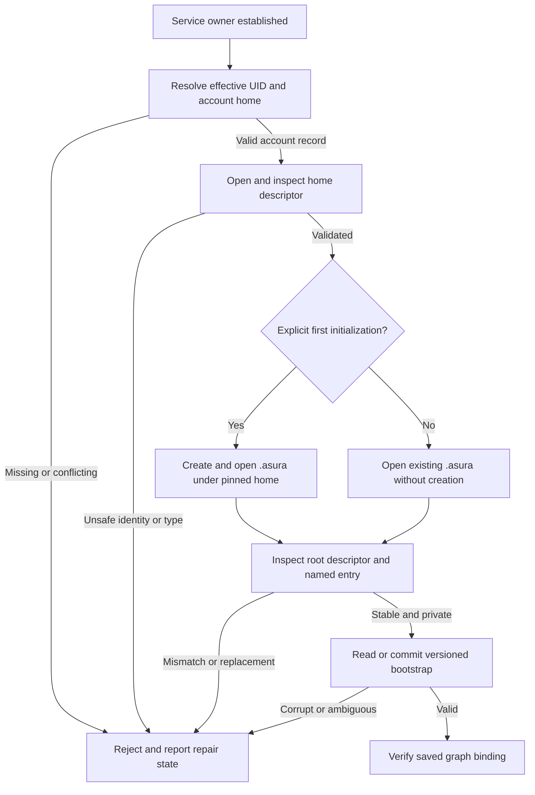

# D1 platform capabilities for the first local service

Status: D1 evidence and proposed mechanism for the I1 bootstrap and control
boundary. The inspected host has Xcode 27.0 (27A266a) with the macOS 27.0 SDK.
Header availability is verified locally; runtime behavior, packaging and
entitlements are not verified. The [production bootstrap design](production-bootstrap-status.md)
remains proposed. The owner selected a standalone command with per-user service
and one same-UID principal on 2026-09-25. The owner also selected a Unix-domain
socket for the standalone service's local control channel on that date. This
document does not authorize implementation.

## Scope and evidence

This assessment covers the per-user home, managed root, service ownership and
local client authentication. It does not select an agent sandbox, credential
facility or Swift/Rust bridge. The
[threat model](threat-model.md) owns adversaries and protected assets. D2 must
qualify the standalone service and proposed transport; D3 must define durable state and
recovery before the I1 packet is ready.

| Capability | Local primary evidence | Design implication and limit |
| --- | --- | --- |
| Account identity and home | macOS 27 SDK `unistd.h`: `geteuid`; `pwd.h`: `getpwuid_r` | The service can resolve its account home without accepting an attaching client's `HOME`; runtime account-directory behavior still needs tests. |
| Descriptor-relative directory access | macOS 27 SDK `sys/fcntl.h`: `openat`, `O_DIRECTORY`, `O_NOFOLLOW`, `O_NOFOLLOW_ANY`; `sys/stat.h`: `mkdirat`, `fstatat` | A backend can pin and inspect directory handles. These APIs alone do not prevent a same-user process from changing an accessible path. |
| Local exclusion | macOS 27 SDK `sys/fcntl.h`: `O_EXLOCK`, `flock` | A lock is an arbitration candidate; a PID or socket path alone does not prove current ownership. Crash and multi-login fencing remain untested. |
| Unix-socket peer evidence | macOS 27 SDK `sys/un.h`: `LOCAL_PEERCRED`, `LOCAL_PEERTOKEN` | Peer UID can authenticate the OS-user boundary. It cannot distinguish trusted from malicious processes under the same UID. |
| XPC peer evidence | macOS 27 SDK `xpc/connection.h`: `xpc_connection_get_euid` | A Mach/XPC listener can inspect peer UID. Listener identity, signature policy and lifecycle require D2 selection. |
| LaunchAgent lifecycle | [Apple SMAppService documentation](https://developer.apple.com/documentation/servicemanagement/smappservice) and installed `ServiceManagement.framework/Headers/SMAppService.h` | A packaged app can register a LaunchAgent. This remains an evaluated alternative, not the selected I1 distribution. |

The installed SDK establishes names and compile-time availability, not whether
the selected Rust or Swift packaging can use them safely. Apple also documents
[service registration](https://developer.apple.com/documentation/servicemanagement/smappservice/register%28%29)
and [Mach service listeners](https://developer.apple.com/documentation/xpc/xpc_connection_mach_service_listener).
The I1 selection is a standalone service. LaunchAgent evidence is retained as
an evaluated alternative. Test the selected lifecycle on supported macOS.

### Candidate local service boundaries

Comparison of the selected distribution and an evaluated alternative. Arrows
name identity evidence. Both require service-side per-request authorization.

A launchd-managed Mach service may avoid client races over a socket pathname,
but it ties first-use and updates to an app-bundle/LaunchAgent contract. The
Unix socket is selected for the standalone service, but D2-D3 must prove concurrent
startup, stale endpoint replacement and old-owner fencing. Neither alternative
grants a request permission merely because the peer UID matches.
An XPC code-signing requirement can restrict direct peers in a signed release,
but it does not prove user intent or prevent a same-UID process from invoking an
allowed CLI. The [threat model](threat-model.md#scope-assets-and-actors) records
the selected I1 same-UID principal boundary and its limits.

## Proposed managed-root procedure

The following is a candidate for D1-D3 selection, not a completed security
proof. It uses the service account, not an attaching client's environment.

1. Read the service's effective UID and account record. Reject missing,
   conflicting or unstable account-home information.
2. Open the resolved account home as a directory and inspect its descriptor.
   Validate its owner, type and the supported symlink/mount policy chosen by D1.
3. Create `.asura` relative to that pinned directory only during explicit new
   initialization. Open the result with directory and no-follow flags.
4. Inspect the opened root's owner, type and access mode. Retain its descriptor
   for descendant access. Recheck the named entry before committing bootstrap
   state; reject replacement or unexpected aliases.
5. On reopen, never recreate missing authoritative bootstrap data merely
   because a pathname is absent. Enter repair-required and preserve the graph
   binding decision.

Propose private mode `0700` for the managed root and private modes for records
selected by D3. D1 must define the treatment of ACLs, network-mounted homes,
account-home symlinks, backup agents and same-UID processes before this procedure
is selected. Numeric modes do not establish confidentiality against the same UID
or an administrator. D3 must choose atomic file updates, durability calls and
rollback detection separately.

### Root access decision flow

Proposed D1-D3 algorithm. Every reject is an explicit service state with repair
guidance. The flow does not imply that a pathname check is sufficient by itself.

## D1-D2 qualification still required

Test home aliases, symlinks, directory replacement, ACLs and supported mounts
under real OS accounts. Exercise two simultaneous clients, separate login
sessions under one UID, another UID, process death during ownership transfer,
and an old owner trying to dispatch. Verify peer credentials and listener
activation in the selected distribution. These checks need unit decision tests,
real-process integration tests and CLI/TUI end-to-end evidence. SDK inspection
does not establish any of those outcomes.
