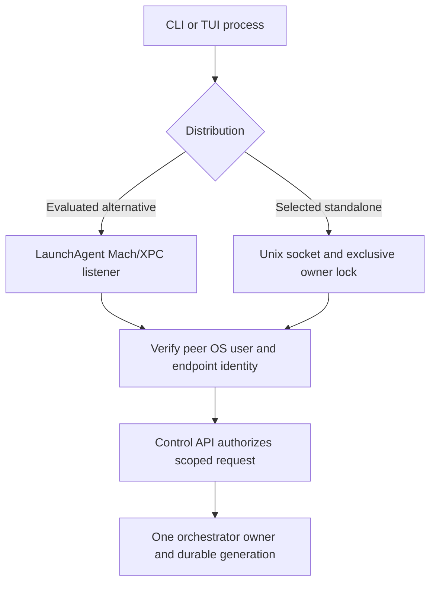
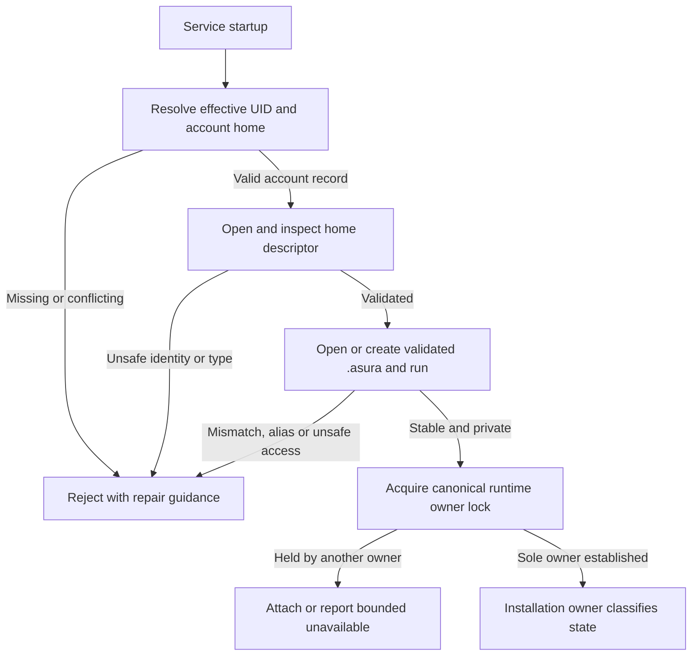
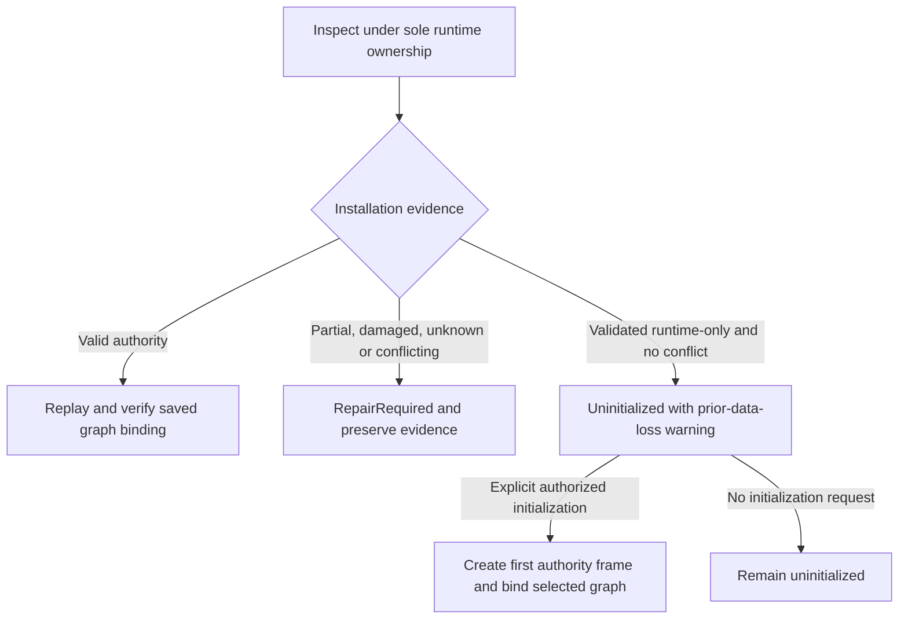
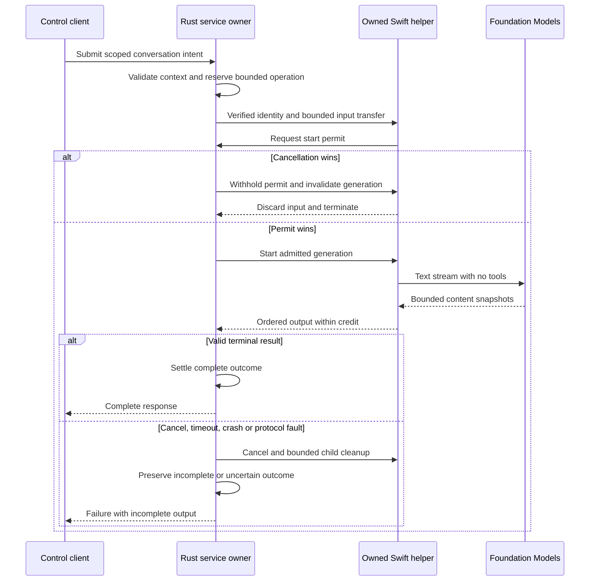

# D1 platform capabilities for the first local service

Response-budget update, 2026-09-28: the [response activity contract](response-activity.md#response-limits-and-truthful-completion)
supersedes this packet's earlier 512-token budget and 256/128/128 allocations.
New admissions reserve 2,048 tokens with tool passes of 1,024/512/512. Historical
512-token journal records retain their recorded accounting. Earlier numerical
examples and validation evidence below describe that earlier packet.

Status: D1 evidence and proposed mechanism for the I1 bootstrap and control
boundary. The inspected host has Xcode 27.0 (27A266a) with the macOS 27.0 SDK.
Header availability is verified locally; runtime behavior, packaging and
entitlements are not verified. The [production bootstrap design](production-bootstrap-status.md)
remains proposed. The owner selected a standalone command with per-user service
and one same-UID principal on 2026-09-25. The owner also selected a Unix-domain
socket for the standalone service's local control channel on that date. This
document does not authorize implementation. On 2026-09-26, the owner selected
`$HOME/.asura/run/` for runtime state. Validated runtime creation may precede
explicit installation initialization; neither directory proves initialization.

## Scope and evidence

This assessment covers the per-user home, managed root, service ownership and
local client authentication. It does not select an agent sandbox, credential
facility or Swift/Rust bridge. The
[threat model](threat-model.md) owns adversaries and protected assets. D2 must
qualify the standalone service and proposed transport; D3 must define durable state and
recovery before the I1 packet is ready.

| Capability | Local primary evidence | Design implication and limit |
| --- | --- | --- |
| Account identity and home | macOS 27 SDK `unistd.h`: `geteuid`; `pwd.h`: `getpwuid_r` | The service can resolve its account home without accepting an attaching client's `HOME`; runtime account-directory behavior still needs tests. |
| Descriptor-relative directory access | macOS 27 SDK `sys/fcntl.h`: `openat`, `O_DIRECTORY`, `O_NOFOLLOW`, `O_NOFOLLOW_ANY`; `sys/stat.h`: `mkdirat`, `fstatat` | A backend can pin and inspect directory handles. These APIs alone do not prevent a same-user process from changing an accessible path. |
| Local exclusion | macOS 27 SDK `sys/fcntl.h`: `O_EXLOCK`, `flock` | A lock is an arbitration candidate; a PID or socket path alone does not prove current ownership. Crash and multi-login fencing remain untested. |
| Unix-socket peer evidence | macOS 27 SDK `sys/un.h`: `LOCAL_PEERCRED`, `LOCAL_PEERTOKEN` | Peer UID can authenticate the OS-user boundary. It cannot distinguish trusted from malicious processes under the same UID. |
| XPC peer evidence | macOS 27 SDK `xpc/connection.h`: `xpc_connection_get_euid` | A Mach/XPC listener can inspect peer UID. Listener identity, signature policy and lifecycle require D2 selection. |
| LaunchAgent lifecycle | [Apple SMAppService documentation](https://developer.apple.com/documentation/servicemanagement/smappservice) and installed `ServiceManagement.framework/Headers/SMAppService.h` | A packaged app can register a LaunchAgent. This remains an evaluated alternative, not the selected I1 distribution. |

The installed SDK establishes names and compile-time availability, not whether
the selected Rust or Swift packaging can use them safely. Apple also documents
[service registration](https://developer.apple.com/documentation/servicemanagement/smappservice/register%28%29)
and [Mach service listeners](https://developer.apple.com/documentation/xpc/xpc_connection_mach_service_listener).
The I1 selection is a standalone service. LaunchAgent evidence is retained as
an evaluated alternative. Test the selected lifecycle on supported macOS.

### Candidate local service boundaries

Comparison of the selected distribution and an evaluated alternative. Arrows
name identity evidence. Both require service-side per-request authorization.

```mermaid
flowchart TD
    Client["CLI or TUI process"] --> Choice{"Distribution"}
    Choice -->|Evaluated alternative| Launch["LaunchAgent Mach/XPC listener"]
    Choice -->|Selected standalone| Socket["Unix socket and exclusive owner lock"]
    Launch --> Peer["Verify peer OS user and endpoint identity"]
    Socket --> Peer
    Peer --> API["Control API authorizes scoped request"]
    API --> Owner["One orchestrator owner and durable generation"]
```

A launchd-managed Mach service may avoid client races over a socket pathname,
but it ties first-use and updates to an app-bundle/LaunchAgent contract. The
Unix socket is selected for the standalone service, but D2-D3 must prove concurrent
startup, stale endpoint replacement and old-owner fencing. Neither alternative
grants a request permission merely because the peer UID matches.
An XPC code-signing requirement can restrict direct peers in a signed release,
but it does not prove user intent or prevent a same-UID process from invoking an
allowed CLI. The [threat model](threat-model.md#scope-assets-and-actors) records
the selected I1 same-UID principal boundary and its limits.

## Proposed managed-root procedure

The following is a candidate for D1-D3 selection, not a completed security
proof. It uses the service account, not an attaching client's environment.

1. Read the service's effective UID and account record. Reject missing,
   conflicting or unstable account-home information.
2. Open the resolved account home as a directory and inspect its descriptor.
   Validate its owner, type and the supported symlink/mount policy chosen by D1.
3. Open or create `.asura` relative to that pinned directory for the selected
   runtime setup. Use directory and no-follow flags. Create no installation
   identity, authority record or graph during this step.
4. Inspect the opened root's owner, type and access mode. Retain its descriptor
   for descendant access. Open or create and validate `run/` under the same
   rules, then acquire the canonical owner lock through the service contract.
   Reject replacement or unexpected aliases before installation inspection.
5. Let the installation owner classify validated runtime-only state separately
   from installation remnants. Unknown content, damaged authority or conflicting
   graph evidence requires repair. Preserve that evidence and the binding.
6. Recheck the named root before any explicit initialization commit. Missing
   authority in a partial installation never permits an empty replacement.
   The absence of all prior state can remain undetectable; retain the first-use
   warning and explicit initialization action.

Propose private mode `0700` for the managed root and private modes for records
selected by D3. D1 must define the treatment of ACLs, network-mounted homes,
account-home symlinks, backup agents and same-UID processes before this procedure
is selected. Numeric modes do not establish confidentiality against the same UID
or an administrator. D3 must choose atomic file updates, durability calls and
rollback detection separately.

### Root access decision flow

Proposed D1-D3 algorithm. Every reject is an explicit service state with repair
guidance. The flow does not imply that a pathname check is sufficient by itself.

```mermaid
flowchart TD
    Start["Service startup"] --> Account["Resolve effective UID and account home"]
    Account -->|Missing or conflicting| Reject["Reject with repair guidance"]
    Account -->|Valid account record| Home["Open and inspect home descriptor"]
    Home -->|Unsafe identity or type| Reject
    Home -->|Validated| Root["Open or create validated .asura and run"]
    Root -->|Mismatch, alias or unsafe access| Reject
    Root -->|Stable and private| Lock["Acquire canonical runtime owner lock"]
    Lock -->|Held by another owner| Attach["Attach or report bounded unavailable"]
    Lock -->|Sole owner established| Inspect["Installation owner classifies state"]
```

### Installation classification after runtime setup

Required distinction, with allowlist and conflict-detection mechanisms still
proposed. Arrows show classification and explicit initialization; runtime setup
alone creates no installation. The bootstrap design owns these result states.

```mermaid
flowchart TD
    Inspect["Inspect under sole runtime ownership"] --> State{"Installation evidence"}
    State -->|Valid authority| Recover["Replay and verify saved graph binding"]
    State -->|Partial, damaged, unknown or conflicting| Repair["RepairRequired and preserve evidence"]
    State -->|Validated runtime-only and no conflict| Empty["Uninitialized with prior-data-loss warning"]
    Empty -->|Explicit authorized initialization| Init["Create first authority frame and bind selected graph"]
    Empty -->|No initialization request| Wait["Remain uninitialized"]
```

## D1-D2 qualification still required

Test home aliases, symlinks, directory replacement, ACLs and supported mounts
under real OS accounts. Exercise two simultaneous clients, separate login
sessions under one UID, another UID, process death during ownership transfer,
and an old owner trying to dispatch. Include [PBS15](production-bootstrap-status.md#pbs15-runtime-directory-does-not-initialize-an-installation)
for runtime-only, partial and unknown root contents. Verify peer credentials and listener
activation in the selected distribution. These checks need unit decision tests,
real-process integration tests and CLI/TUI end-to-end evidence. SDK inspection
does not establish any of those outcomes.

## Wisp model and classifier reference (2026-09-26)

Source inspection only; no Asura provider or classifier is implemented by this
note. Wisp HEAD was `bf7e6afe66f62da61f367a6371b0ef4a0bec7295`; inspected files
may include working-tree changes. Paths below are relative to the Wisp repository.

- `harness/Sources/WispCore/Session/ModelSelection.swift` separates identifier
  parsing from provider resolution. Splitting at the first colon preserves model
  tags such as `ollama:granite4.1:8b`. Resolved models carry capabilities and provenance.
- `harness/Sources/WispCore/Session/ModelBackend.swift` provides one provider
  registry contract. System, Private Cloud Compute, Ollama, Core AI and conditional
  MLX implementations report availability separately from saved configuration.
- `harness/Sources/WispCore/Approval/ClassifierStore.swift` stores versioned
  artifacts with source digests, training counts, parent versions and measurements.
- `harness/Sources/WispCore/Approval/RiskExamples.swift` harvests model-derived
  audit verdicts, excludes fallback verdicts and redacts secrets before training.
- `harness/Sources/WispCore/Approval/TrainingSplit.swift` groups related examples
  and prevents overlap with held-out evaluation data.
- `harness/Sources/WispCore/Approval/CoreMLRiskClassifier.swift` uses conservative
  failure and confidence handling; deterministic rules establish minimum risk.
- `docs/decisions/0041-shipped-classifier-is-the-default.md` records fast inference,
  but also dangerous commands rated safe. Classification remains advisory; it
  must not replace Asura's canonical authorization checks.

These patterns inform future designs. A candidate classifier layout is
`data/classifiers/<task>/<version>/`; model assets use the selected model roots. Graph records can link artifact digests, training provenance, measurements
and activation history. Adapt synchronous Wisp operations to Asura's bounded
workers, deadlines, cancellation, recovery and overload rules; do not copy its
blocking bridges or mutex-protected audit IO into event loops.

## Next conversation-model packet (2026-09-27)

Status: proposed implementation packet for root review. The owner clarified that
0.1 fixes version numbering, not message schemas. This packet defines the next
message contracts at 0.1. It does not authorize a client-side model call or a
second orchestration owner.
The [local-model boundary](swift-rust-boundary.md) remains the canonical model
contract. The scoped contracts below must be reconciled into that document before code.

### First useful adapter and ownership

Propose the on-device `system` adapter first. It uses the selected supervised
Swift helper and installed Foundation Models framework. It needs no additional
model provider dependency or downloaded weights. Initial generation is text-only,
with an empty tool list. The adapter cannot execute tools, access the graph,
change configuration, or infer approval from generated text.

The Rust service owns model selection, operation admission, context generation,
cancellation, budget reservation and final outcome. The Swift helper owns one
Foundation Models session for that admitted generation. The TUI displays service
observations and submits user intent through the canonical control client.
Neither saving `model` nor finding model assets proves model availability.

Propose one Rust-owned provider registry. Its first entry maps `system` to the
verified packaged Swift helper. Other identifiers produce `provider_unavailable`;
they do not fall back silently. Provider registration comes from the installation,
not a project file, executable search path or model response.

The existing configuration owner retains responsibility for the stored string.
Do not tighten its accepted syntax as a side effect of implementing an adapter.
The model resolver parses the stored identifier separately. Propose `system` and
`<provider>:<name>` as resolved forms. Split only the first colon, so an Ollama
model tag remains intact. Reject empty components and whitespace at resolution.
Normalize the provider name only; preserve the model name. Wisp's `pcc` alias
and remote-provider behavior are not selected for Asura by this packet.

### Installed SDK evidence

Verified on 2026-09-27: Xcode 27.0, build 27A266a, macOS 27 SDK. Evidence is the
installed `FoundationModels.framework/Versions/A/Modules/FoundationModels.swiftmodule/arm64e-apple-macos.swiftinterface`.
The path is relative to the SDK's `System/Library/Frameworks` directory.

| SDK declaration | Packet implication | Proof limit |
| --- | --- | --- |
| `SystemLanguageModel.availability`, interface line 267 | Report unavailable with a typed reason before admission. | Header inspection does not prove this Mac has ready model assets. |
| `LanguageModelSession` initializer with `tools`, line 38 | Create a scoped session with no tools for the first adapter. | No real session was opened for this research. |
| `streamResponse`, lines 2061–2070 | Consume an asynchronous response stream. | Stream progress and cancellation latency need runtime measurement. |
| `ResponseStream.Snapshot`, line 2191 | Treat content as a snapshot, not an independent text delta. | Do not assume snapshots are append-only. |
| `ResponseStream.AsyncIterator.next`, line 2240 | Await generation outside the service control reactor. | An async signature does not prove bounded cancellation or memory use. |
| `SystemLanguageModel.tokenCount`, lines 410–434; `contextSize`, line 445 | Check context capacity before generation and reserve response capacity. | Counting can fail or stall and requires the operation deadline. |
| `GenerationOptions.maximumResponseTokens`, line 3211 | Apply the admitted output-token bound. | Also enforce a separate UTF-8 byte limit. |
| `LanguageModelSession.Error.concurrentRequests`, line 2027 | Serialize generation per session. | Do not retry a concurrent operation automatically. |

No external inference, dependency installation, compilation or runtime model
qualification was performed. Use installed SDK declarations instead of copying
Wisp's deprecated error mappings without checking them.

### Proposed numeric limits and failure handling

These limits require incorporation into the canonical D2/D4 contract before code.
They use explicit messages in the evolving 0.1 schemas.

| Resource or operation | Proposed limit | Required failure behavior |
| --- | --- | --- |
| Active helper generations | 1 per service initially | Reject additional admission as busy; no hidden waiting queue. |
| Input including instructions and scoped history | 64 KiB UTF-8 and the model's measured token window minus 512 response tokens | Reject overflow before the start permit; preserve the draft. |
| Generation response | 512 tokens and 60 KiB UTF-8 | Cancel on byte overflow and mark output incomplete. |
| Private model-channel frame / chunk payload | 64 KiB / 16 KiB | Reject excessive lengths before allocation. |
| Input and output credit windows | 64 KiB each | Pause data transfer at zero credit; continue control processing. |
| Helper startup and identity handshake | 5 seconds absolute | Close channel, terminate and reap only the owned child. |
| Admission through terminal generation result | [Cancellation-driven lifetime](model-provider-integration.md#cancellation-driven-turn-lifetime--selected-2026-09-30), no fixed whole-turn expiry | Explicit cancel, provider failure, EOF or shutdown settles owned work. |
| Grace after cancellation / SIGTERM | 250 ms / 250 ms | Escalate to SIGKILL of the owned child if necessary. |
| Child reap observation | 1 second after SIGKILL | Retain the child handle and block replacement admission until reaped. |
| Reserved private control capacity | 8 frames, at most 4 KiB each | Never queue cancellation behind data credit. |
| Service/TUI progress under a stalled helper | Existing control deadline; TUI input response within 100 ms in the test environment | Report stalls and overload explicitly; no reactor wait for inference. |

Model creation, token counting, stream iteration and SDK cleanup stay in the
owned helper. Rust spawn, identity checks and descriptor preparation use the
existing platform owner with bounded isolated work. Both processes use
nonblocking transport IO. They do not copy Wisp's synchronous `Blocking.run`
bridges into event loops.

Swift retains the transmitting snapshot and at most one coalesced replacement,
each limited to 60 KiB. A changed snapshot is not
appended blindly to prior text. The snapshot contract below supplies explicit replacement revisions when the
stream revises already published content. A final
result requires valid terminal counts and service settlement. On stream failure,
the displayed prefix stays marked incomplete and cannot become assistant history.

Cancellation and the start permit are serialized by the Rust owner. Cancellation
before the permit means no SDK call. Cancellation after the permit invalidates
the generation and requests Swift task cancellation. The service continues to
observe and, if necessary, terminate and reap its exact child. A cancellation
request is not proof that the SDK stopped. Late output is rejected by generation.
Service restart never silently replays an uncertain generation.

The selected helper boundary forbids host tools. Its remaining OS confinement
and framework-service access require the existing D2/D4 security decision. This
packet does not invent a permissive sandbox exception to make inference work.

### Admission and cancellation sequence

Proposed scoped model operation. Arrows show service authority and helper work.
The client request and event portions use the explicit 0.1 additions below.

```mermaid
sequenceDiagram
    participant C as Control client
    participant R as Rust service owner
    participant H as Owned Swift helper
    participant M as Foundation Models
    C->>R: Submit scoped conversation intent
    R->>R: Validate context and reserve bounded operation
    R->>H: Verified identity and bounded input transfer
    H->>R: Request start permit
    alt Cancellation wins
        R->>H: Withhold permit and invalidate generation
        H-->>R: Discard input and terminate
    else Permit wins
        R->>H: Start admitted generation
        H->>M: Text stream with no tools
        M-->>H: Bounded content snapshots
        H-->>R: Ordered output within credit
        alt Valid terminal result
            R->>R: Settle complete outcome
            R-->>C: Complete response
        else Cancel, timeout, crash or protocol fault
            R->>H: Cancel and bounded child cleanup
            R->>R: Preserve incomplete or uncertain outcome
            R-->>C: Failure with incomplete output
        end
    end
```

### Required validation

All cases use scratch state and preserve unrelated service processes. A scripted
helper tests deterministic behavior; it cannot prove actual Foundation Models
availability, cancellation or output quality.

| Case | Initial state and trigger | Required result | Unit / integration / end-to-end evidence |
| --- | --- | --- | --- |
| MC01 identifier | Stored tagged identifier is resolved | First colon only; known provider selection; unknown provider unavailable | Parser boundaries / service registry with fake provider / config plus real client selection after control design exists |
| MC02 unavailable model | SDK reports assets missing or device unavailable | Actionable typed unavailable result; no accepted generation | Error mapping / actual helper availability handshake / TUI preserves draft and stays responsive |
| MC03 text response | Admitted prompt receives snapshots then completion | Bounded provisional output; one complete response; no tool execution | Snapshot replacement and terminal counts / real socketpair and scripted helper / real TUI to service to live on-device model |
| MC04 cancellation race | Cancel before or after start permit | Before: no SDK call; after: invalidate and settle only with evidence | Serialized state transitions / helper fault barriers at both sides of permit / user cancels while typing and resizing |
| MC05 stalled helper | Helper stalls during handshake, counting, stream or cleanup | Absolute deadline; responsive control; exact-child cleanup | Deadline transitions / SIGSTOP or scripted stalls at each phase / TUI input within 100 ms and usable exit |
| MC06 overload | Second request or excess frame, credit or output arrives | Busy or typed limit failure; bounded allocations; control capacity preserved | Boundary arithmetic / real transport flood and blocked reader / responsive TUI while rejected work is reported |
| MC07 stale result | Helper crashes or service restarts after a prefix | Prefix incomplete; old generation rejected; no automatic retry | Generation fencing / real child death and restart / reconnect does not show an invented complete answer |
| MC08 capabilities | Requested provider lacks tool or structured-output capability | Reject before admission; no implicit downgrade | Capability matching / helper reports reduced capability / client receives explicit unavailability |

Record host, SDK, helper build, model availability, measured response latency and
memory high-water mark for live qualification. Do not run remote inference or
read real user prompts for tests. Local inference tests require a suitable host;
unavailable model assets leave MC03 live evidence incomplete.

### Control messages at version 0.1

Extend `contracts/control/v1/control.proto` using envelope body field numbers
22 through 27 for `ConversationSubmit`, `ConversationAccepted`,
`ConversationObserve`, `ConversationEvent`, `ConversationCancel`, and
`ConversationCancelAccepted`. Capability value 5 is `CAPABILITY_CONVERSATION`.
The receiver retains existing epoch, attachment and request-counter validation.
Unavailable capability produces the existing unsupported-operation error.

| Message | Fields in numeric order starting at 1 | Validation and meaning |
| --- | --- | --- |
| ConversationSubmit | request_id bytes; project_id bytes; conversation_id bytes; expected_generation uint64; prompt string | IDs are nonzero 16-byte values. Empty conversation ID requests creation within the named project. Generation is zero only for creation. Prompt is nonempty, at most 32 KiB UTF-8. |
| ConversationAccepted | operation_id bytes; conversation_id bytes; generation uint64; cursor uint64 | Returned only after durable admission and token reservation. |
| ConversationObserve | operation_id bytes; after_cursor uint64; wait_ms uint32 | Wait at most 1,000 ms without blocking a reactor. At most one observation wait per attachment. |
| ConversationEvent | operation_id bytes; cursor uint64; generation uint64; kind enum; text string; reason enum; usage_tokens uint64; usage_known bool | One event per response. Text is a complete replacement snapshot of at most 60 KiB. Kinds: 1 pending, 2 snapshot, 3 complete, 4 failed, 5 cancelled, 6 interrupted. Unknown kinds reject. |
| ConversationCancel | operation_id bytes; generation uint64 | Idempotent intent, scoped to the admitted operation. Stale generation rejects. |
| ConversationCancelAccepted | operation_id bytes; terminal bool | Confirms recorded intent, not SDK settlement. Terminal state arrives through observation. |

All fields use explicit presence where absence is invalid. A pending observation
has no text and retains the supplied cursor. A changed snapshot increments the
cursor. Complete replaces the last provisional snapshot; other terminal kinds
retain any prefix only as incomplete UI content. The service returns the newest
snapshot when intermediate revisions were coalesced. Therefore no revision gap
implies missing append-only text. The cursor is monotonic within an operation.

The 60 KiB text bound leaves room inside the existing 64 KiB control frame.
The encoder must still check the entire encoded envelope length.
The service retains one 60 KiB snapshot for its one active operation. Completed
results are read through the durable owner, with one bounded response buffer.
A terminal cursor does not change. Unknown operations return invalid request;
expired retained records return a typed `result_expired` reason, never a new
admission. Retention deletion is excluded from this first packet, so storage
limits reject new admission instead of silently expiring records.

Repeat submit with the same request ID and exact normalized request digest returns
the recorded acceptance or terminal identity. A different digest is a conflict.
A disconnect does not cancel accepted work. Reconnect observes by operation ID;
if acceptance was lost, it retries the same submit ID. It never creates another
ID automatically. Successful config changes affect the next admitted operation;
existing operations retain their selected model and configuration revision.

### Private helper messages at version 0.1

Add canonical source `contracts/model/v1/model.proto`, package `asura.model.v1`.
Use the selected four-byte big-endian frame length and the limits above. Generate
both bindings from this file with the already pinned tools. A model envelope has
operation_id bytes field 1, generation uint64 field 2, and body fields below.
The identity and credit rules in the canonical D2 design continue to apply.

| Body field | Message and numbered fields | Meaning |
| --- | --- | --- |
| 10 | Hello: build_id bytes 1; schema_digest bytes 2; max_frame_bytes uint32 3 | Build and schema identities are exactly 32 bytes and must match before input. |
| 11 | Begin: model string 1; input_bytes uint64 2; deadline_remaining_ms uint32 3; max_response_tokens uint32 4 | Selected provider, at most 64 KiB input; absent deadline selects cancellation-driven generation, present1–60,000 ms is explicit legacy timing. |
| 12 | Chunk: transfer_id uint64 1; direction enum 2; ordinal uint64 3; data bytes 4; revision uint64 5 | Directions 1 input and 2 output. Nonempty payload at most 16 KiB. |
| 13 | Credit: transfer_id uint64 1; direction enum 2; accepted_bytes uint64 3; granted_bytes uint64 4 | Cumulative credit under the existing D2 ledger, never over the 64 KiB window. |
| 14 | InputEnd: count uint64 1; total_bytes uint64 2 | Exact match to accepted input chunks. |
| 15 | Ready: empty | Helper requests the serialized start permit after validating input. |
| 16 | Start: empty | Rust grants the current generation exactly once. |
| 17 | Cancel: reason enum 1 | 1 user, 2 timeout, 3 shutdown, 4 resource limit. |
| 18 | SnapshotEnd: revision uint64 1; count uint64 2; total_bytes uint64 3 | Commits one complete replacement snapshot in transport memory, not a final operation outcome. |
| 19 | Terminal: outcome enum 1; last_revision uint64 2; count uint64 3; total_bytes uint64 4; usage_tokens uint64 5; usage_known bool 6; reason enum 7 | Outcomes 1 complete, 2 failed, 3 cancelled. Terminal byte and chunk counts are cumulative across output transfers. |

Input uses transfer ID 1 and revision 0. Output transfer IDs start at 2 and
increase with snapshot revisions starting at 1. Credit belongs to its transfer;
only one output transfer is active. A receiver replaces its prior snapshot only
after SnapshotEnd validates the whole transfer. Swift coalesces newer SDK
snapshots while credit is exhausted, retaining at most one additional 60 KiB
snapshot. It never allocates a queue per SDK token. Limit cumulative transmitted
output to 4 MiB and 1,024 snapshot revisions per operation; exceedance cancels.
The final SDK snapshot must be transferred before a complete Terminal.

Reason values are 0 none, 1 model_unavailable, 2 input_limit, 3 output_limit,
4 context_limit, 5 timeout, 6 refusal, 7 cancelled, 8 protocol_fault,
9 helper_failed, 10 internal_error, 11 interrupted, and 12 result_expired.
The control event maps helper reasons to the same meanings. Unknown critical
values reject; absent usage stays unknown and does not refund reserved tokens.
Control frames are processed while waiting for data credit. Use the existing
D2 rule that late credit or chunks after terminal are a protocol fault.

### Minimal helper package and identity

Select `swift/model-helper/Package.swift` and executable target `AsuraModelHelper`,
producing `asura-model`. Use the installed Swift 6.4 toolchain and macOS 27 SDK.
The only package dependency is SwiftProtobuf at the exact revision already locked
in `tools/protobuf/lock.json`. Reuse that reviewed dependency and generator;
this packet does not introduce Core AI, MLX or Ollama dependencies.

For development, assemble the command, helper and `model-package.json` into one
private build directory. For distribution, put the same set in the versioned
package's `libexec`. Resolve relative to the running service's real executable,
never its current directory or PATH. The manifest records format 0.1, a package
build ID, helper SHA-256 and model-schema SHA-256. Embed the build ID and expected
helper/schema digests into the Rust binary after compiling the helper. Embed the
same build ID and schema digest into Swift before that compile. The package build
ID is generated once for that assembled build, not inferred from version 0.1.

For the development build, the assembly step writes the three fixed identity
values (build, schema, helper) to ignored `.build/model-tools/package-identity.txt`.
The service build script embeds these bytes. Missing build input disables the
model capability while status and config remain usable. The assembly step places
`asura-model` and `model-package.json` beside the command executable. No runtime
environment variable or command-line option selects a different helper.

Before spawn, verify regular-file ownership, no-follow identity and helper digest
through the platform owner. Copy verified bytes into the service-owned private
runtime directory, verify the copy, and execute that pinned copy. Retain and check
its inode identity through spawn. The same-UID threat boundary remains unchanged;
this is package mismatch/race detection, not protection against arbitrary owner
account compromise. No command-line or environment value selects another helper.

The helper receives one private socketpair endpoint as descriptor 3, with all
unrelated descriptors closed. Channel EOF terminates its scoped session. Its
stdout/stderr are private bounded diagnostics, never the TUI terminal. Start with
at most 64 KiB captured diagnostics, dropping older diagnostic bytes explicitly.
Only the service can invoke generation; a standalone version check opens no model.

The first native qualification uses the same user principal as the service, no
host tool registry, and only selected Foundation Models calls. It makes no OS
sandbox confinement claim. The previously open sandbox/framework-access decision
must be reconciled in D2 before production deployment; do not install a new
sandbox profile or weaken an existing mandatory outer sandbox in this packet.

### Remaining authority prerequisite and execution order

The protocol freeze is no longer a blocker. The root must review these contracts
and place their canonical ownership in D2/D3/D4 and the control design before code.
This document does not duplicate a second authority writer.

The current authority adapter is read-only and recognizes only initialization,
graph binding and owner-generation records. The architecture requires a project
context per conversation and durable budget reservation before model dispatch.
Consequently a production text conversation cannot legitimately use a temporary
in-memory task or write a separate conversation authority file.

Deliver the authority prerequisite first through the existing storage owner:
project registration, conversation identity/context generation, idempotent model
admission, 512-token reservation, cancellation intent, terminal outcome and
restart interruption. Extend the canonical journal format with these records,
its writer and replay rules. Preserve the existing frame/digest/durability
contract, define crash points and retain unknown usage charges after interruption.
The current journal explicitly requires a newly supported format for new record
kinds; the 0.1 software/protocol numbering instruction does not waive that on-disk
compatibility rule. Root must reconcile that format amendment with D3 before code.

No additional user decision is needed to honor these already required owners.
Bypassing them for an ephemeral preview would require an explicit architecture
exception. The normal implementation sequence is:

1. Complete the canonical admission/recovery amendment and reviewed writer packet.
2. Implement model identifiers and registry in a service-owned model module.
3. Implement the private model schema, real socketpair supervisor and scripted
   helper tests. Extend the existing platform spawn owner; no second manager.
4. Add the scoped Swift helper and generated bindings with standard SwiftPM.
5. Extend control/client and TUI with submit, bounded observation and cancel.
6. Run MC01–MC08, then the real on-device conversation journey. A missing model
   is actionable unavailability, not a passing live-inference test.

Minimal code paths are `rust/crates/asura-storage/src/authority.rs` plus its writer
module, `rust/crates/asura-service/src/` model and admission modules,
`rust/crates/asura-platform/src/` owned helper supervision, both `contracts/`
schemas, `swift/model-helper/`, and existing control/client/TUI modules.
The parser and model protocol/supervisor packet can become implementation-ready
after root review without waiting for graph feature work. Actual inference
admission remains gated by the durable owner. Ordinary Cargo and SwiftPM builds
remain sufficient; deferred bootstrap-cache publication is not a prerequisite.

Packet validation: the new sequence diagram rendered with Mermaid CLI 12.0.0
and was visually inspected on 2026-09-27. The labels and failure branches are
legible. `git diff --check -- docs/designs/platform-capabilities.md` passed.
This is documentation validation, not implementation or runtime evidence.

### Reviewed first model implementation assignment

On 2026-09-27 root selected the pure service-owned identifier/registry component
for implementation under this packet. It parses identifiers using the first colon,
normalizes only provider names and reports unsupported providers without fallback.
Its system entry declares text-only capability; availability stays unknown until
the verified helper reports it. No model call, admission, helper spawn, protocol
change or TUI execution is part of this first component. Keep the accepted config
string grammar unchanged. Unit coverage must exercise tagged names, invalid
components, capability mismatch and no implicit availability. Full conversation
integration still depends on the authority and helper contracts above.
